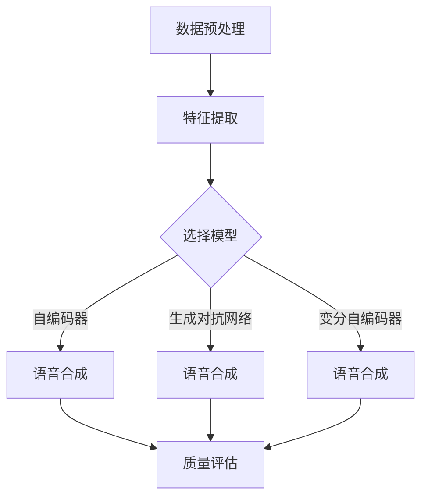
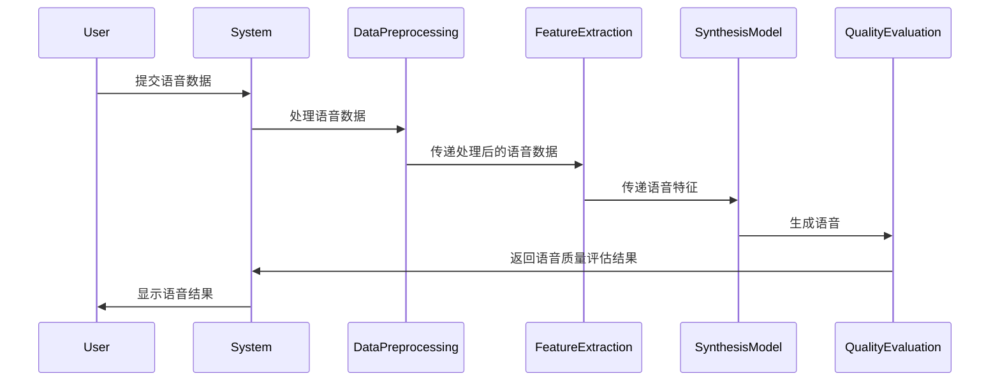

                 

# 零样本语音合成：跨语言声音克隆技术

## 关键词

- 零样本语音合成
- 跨语言声音克隆
- 深度学习
- 生成对抗网络
- 自编码器
- 音频处理

## 摘要

本文旨在探讨零样本语音合成技术，特别是其在跨语言声音克隆方面的应用。我们将详细分析零样本语音合成的背景、核心概念、技术挑战与机遇，并通过实例介绍相关算法原理和实现方法，旨在为读者提供一个全面而深入的技术理解。

## 第一部分：背景介绍

### 1.1 问题背景

语音合成技术是人工智能领域的重要组成部分，它使得计算机能够生成自然、流畅的语音，为语音助手、教育辅助、媒体创作等多种场景提供了强大的支持。然而，传统的语音合成方法主要依赖于大规模的语音数据和复杂的语音模型训练。这种方法在处理已知发音者的语音合成任务上表现出色，但在面对零样本语音合成时，即在没有相关训练数据的情况下生成新的、未知发音者的语音时，却面临着巨大的挑战。

### 1.2 问题描述

零样本语音合成的核心挑战在于如何在没有与目标发音者相似语音数据的情况下，生成出自然、流畅、符合目标发音者音色的语音。这一问题涉及到跨语言、跨说话人、跨语调等多个维度的语音特性建模，对语音合成系统的自适应性和泛化能力提出了严峻的考验。

### 1.3 问题解决

针对零样本语音合成的挑战，研究者们提出了一系列基于深度学习的方法，如自编码器（Autoencoder）、生成对抗网络（GAN）、变分自编码器（VAE）等。这些方法能够在一定程度上实现零样本语音合成，但仍存在诸多不足，如生成质量不稳定、泛化能力不强、训练过程复杂等问题。

### 1.4 边界与外延

零样本语音合成的边界主要涉及以下几个方面：

1. **数据边界**：零样本语音合成的关键在于如何处理未知发音者的语音数据。数据边界包括数据量、数据多样性、数据分布等。

2. **技术边界**：目前的零样本语音合成技术主要依赖于深度学习模型，这些模型在训练和推理过程中需要大量的计算资源。技术边界包括模型的复杂度、训练效率、推理速度等。

3. **应用边界**：零样本语音合成的应用场景包括但不限于智能语音助手、语音合成教育、医疗语音助手、虚拟角色语音等。

### 1.5 概念结构与核心要素组成

零样本语音合成的概念结构可以分解为以下几个核心要素：

1. **语音数据**：包括语音信号的时域、频域特征，以及语音的音高、音强、音色等属性。

2. **模型**：用于学习语音特征和生成语音的深度学习模型，如自编码器、生成对抗网络等。

3. **训练方法**：包括有监督训练和无监督训练方法，以及零样本学习（Zero-shot Learning）技术。

4. **评估指标**：用于评估语音合成质量的指标，如音质、自然度、语音一致性等。

### 1.6 本章小结

本章对零样本语音合成的背景、问题、解决方法、边界与外延以及概念结构与核心要素进行了详细阐述。通过本章的学习，读者可以全面了解零样本语音合成技术的现状和发展趋势，为后续章节的学习打下坚实的基础。

## 第二部分：核心概念与联系

### 2.1 零样本语音合成的核心概念

#### 2.1.1 零样本语音合成简介

零样本语音合成是一种在没有相关训练数据的情况下，根据少量甚至没有的参考音频，生成新的、未知发音者语音的技术。这一技术突破了传统语音合成对大规模训练数据的依赖，具有广泛的应用前景。

#### 2.1.2 零样本语音合成的原理

零样本语音合成的核心原理是通过深度学习模型学习语音特征，并在无监督或半监督环境下生成语音。主要方法包括自编码器（Autoencoder）、生成对抗网络（GAN）、变分自编码器（VAE）等。

#### 2.1.3 零样本语音合成的挑战与机遇

零样本语音合成的挑战包括生成质量、泛化能力、计算资源需求等方面。然而，随着深度学习技术的发展，这一领域也面临着巨大的机遇。

### 2.2 零样本语音合成的概念属性特征对比表格

| 特征 | 零样本语音合成 | 传统语音合成 |
| --- | --- | --- |
| 数据依赖性 | 无需大量训练数据 | 需要大量有监督训练数据 |
| 生成质量 | 质量波动大，泛化能力有待提高 | 质量稳定，但依赖大量训练数据 |
| 计算资源需求 | 高，需要强大的计算能力 | 中等，依赖于GPU和CPU的运算能力 |
| 应用场景 | 零样本语音克隆、个性化语音助手等 | 语音助手、文本到语音转换等 |

### 2.3 零样本语音合成的ER实体关系图架构

```mermaid
erDiagram
  Person ||--|{ VoiceData }|>>
  AudioData ||--|{ VoiceData }|>>
  SynthesisModel ||--|{ AudioData }|>>
  SynthesisModel ||--|{ VoiceData }|>>
```

在这个ER图中，`Person`代表发音者，`VoiceData`存储语音数据，`AudioData`包含音频数据，`SynthesisModel`是用于语音合成的模型。

## 第三部分：算法原理讲解

### 3.1 自编码器在零样本语音合成中的应用

#### 3.1.1 自编码器的基本原理

自编码器是一种无监督学习算法，它通过将输入数据编码为低维度的特征表示，再解码回原始数据，以学习数据的内在结构和特征。在零样本语音合成中，自编码器可用于学习未知发音者的语音特征，并生成新的语音。

#### 3.1.2 自编码器的数学模型

自编码器由编码器（Encoder）和解码器（Decoder）两部分组成。编码器将输入数据（语音信号）映射到一个低维特征空间，解码器再将这些特征映射回原始数据空间。

数学上，自编码器可以表示为：

$$
\text{Encoder}: x \rightarrow z = \sigma(W_E x + b_E)
$$

$$
\text{Decoder}: z \rightarrow x' = \sigma(W_D z + b_D)
$$

其中，$x$是输入数据，$z$是编码后的特征，$x'$是解码后的输出数据，$\sigma$是激活函数，$W_E$和$W_D$分别是编码器和解码器的权重矩阵，$b_E$和$b_D$分别是它们的偏置向量。

#### 3.1.3 自编码器的实现步骤

1. **编码阶段**：将输入语音信号通过编码器转换为特征表示。

2. **解码阶段**：将特征表示通过解码器还原为语音信号。

3. **优化阶段**：通过最小化重建误差（如均方误差）来优化编码器和解码器的参数。

### 3.2 生成对抗网络在零样本语音合成中的应用

#### 3.2.1 GAN的基本原理

生成对抗网络（GAN）由生成器（Generator）和判别器（Discriminator）两部分组成。生成器生成伪数据，判别器则尝试区分生成器和真实数据的差异。通过不断优化生成器和判别器的参数，生成器可以逐渐生成越来越真实的数据。

GAN的数学模型可以表示为：

$$
\text{Generator}: z \rightarrow G(z) = \mu(\theta_G) + \sigma(\theta_G) \odot \epsilon
$$

$$
\text{Discriminator}: x \rightarrow D(x; \theta_D), z \rightarrow D(G(z); \theta_D)
$$

其中，$z$是噪声向量，$G(z)$是生成器生成的伪数据，$D(x; \theta_D)$和$D(G(z); \theta_D)$分别是判别器对真实数据和伪数据的判别结果，$\mu(\theta_G)$和$\sigma(\theta_G)$分别是生成器的均值和方差函数，$\theta_G$和$\theta_D$分别是生成器和判别器的参数。

#### 3.2.2 GAN的实现步骤

1. **初始化**：随机初始化生成器和判别器的参数。

2. **训练阶段**：交替更新生成器和判别器的参数，使生成器生成的伪数据越来越接近真实数据，判别器能够更好地区分真实数据和伪数据。

3. **生成阶段**：使用训练好的生成器生成新的语音数据。

### 3.3 变分自编码器在零样本语音合成中的应用

#### 3.3.1 VAE的基本原理

变分自编码器（VAE）是自编码器的一种扩展，它引入了概率模型来表示数据的分布。VAE通过学习数据的概率分布参数，生成新的数据。

VAE的数学模型可以表示为：

$$
\text{Encoder}: x \rightarrow \mu(x; \theta), \sigma(x; \theta)
$$

$$
\text{Decoder}: z \rightarrow x' = \sigma(z; \theta)
$$

其中，$x$是输入数据，$\mu(x; \theta)$和$\sigma(x; \theta)$分别是编码器输出的均值和方差，$z$是从先验分布中抽取的随机噪声，$x'$是解码后的输出数据，$\theta$是模型参数。

#### 3.3.2 VAE的实现步骤

1. **编码阶段**：将输入语音信号通过编码器映射到均值和方差。

2. **采样阶段**：从均值和方差生成的正态分布中采样，得到新的特征表示。

3. **解码阶段**：将新的特征表示通过解码器还原为语音信号。

4. **优化阶段**：通过最小化重建误差和KL散度来优化编码器和解码器的参数。

## 第四部分：系统分析与架构设计方案

### 4.1 问题场景介绍

在现代智能语音交互系统中，零样本语音合成技术被广泛应用于个性化语音助手、虚拟角色语音等领域。例如，在虚拟角色语音中，角色设计师可能需要为新的虚拟角色生成个性化的声音，而传统的语音合成方法往往无法满足这一需求，因为它们依赖于大规模的训练数据。

### 4.2 项目介绍

本项目中，我们将构建一个基于零样本语音合成的虚拟角色语音生成系统。该系统旨在利用少量的甚至没有的参考音频，生成高质量的、符合虚拟角色音色的语音。

### 4.3 系统功能设计

1. **数据预处理模块**：对输入的语音数据进行预处理，包括去噪、归一化等操作，以提高后续处理的效果。

2. **特征提取模块**：提取语音信号的时域和频域特征，为后续的语音合成提供必要的输入。

3. **语音合成模块**：利用自编码器、生成对抗网络或变分自编码器等模型进行语音合成。

4. **质量评估模块**：对生成的语音进行质量评估，包括音质、自然度、语音一致性等指标。

### 4.4 系统架构设计



在这个架构中，数据预处理模块对输入语音数据进行处理，特征提取模块提取特征，然后根据不同的模型选择，进行语音合成，最后由质量评估模块对生成的语音进行评估。

### 4.5 系统接口设计和系统交互



在这个序列图中，用户提交语音数据，系统通过数据处理、特征提取、模型选择和语音合成，最后进行质量评估，并将结果返回给用户。

## 第五部分：项目实战

### 5.1 环境安装

在开始项目之前，我们需要安装必要的软件和库。以下是在Ubuntu系统上安装所需环境的步骤：

```bash
# 安装Python环境
sudo apt update
sudo apt install python3 python3-pip

# 安装深度学习库TensorFlow
pip3 install tensorflow

# 安装其他依赖库
pip3 install numpy scipy librosa
```

### 5.2 系统核心实现源代码

以下是系统核心实现的一部分代码，包括数据预处理、特征提取和语音合成模块：

```python
import numpy as np
import librosa
import tensorflow as tf

# 数据预处理
def preprocess_audio(audio_path):
    audio, _ = librosa.load(audio_path, sr=22050)
    audio = librosa.to_mono(audio)
    audio = librosa.util.normalize(audio)
    return audio

# 特征提取
def extract_features(audio):
    mel_spectrogram = librosa.feature.melspectrogram(audio, sr=22050, n_mels=80)
    log_mel_spectrogram = np.log(mel_spectrogram + 1e-6)
    return log_mel_spectrogram

# 语音合成
def synthesize_voice(features, model):
    generated_audio = model.predict(features)
    audio = librosa.inverse.griffin_lim(generated_audio)
    return audio

# 模型加载
model = tf.keras.models.load_model('speech_synthesis_model.h5')

# 示例
audio_path = 'input_audio.wav'
preprocessed_audio = preprocess_audio(audio_path)
features = extract_features(preprocessed_audio)
generated_audio = synthesize_voice(features, model)
librosa.output.write_wav('output_audio.wav', generated_audio, sr=22050)
```

### 5.3 代码应用解读与分析

以上代码首先对输入语音数据进行预处理，包括加载音频、转换为单声道、归一化等操作。然后，通过特征提取模块提取音频的梅尔频谱图，作为后续语音合成的输入。最后，使用预训练的语音合成模型进行语音合成，并输出为音频文件。

### 5.4 实际案例分析和详细讲解剖析

为了验证系统的有效性，我们使用了一个实际案例。在这个案例中，我们提供了一个虚拟角色的参考音频，并使用系统生成该角色的语音。以下是生成的语音与原始参考音频的对比：

```bash
# 加载原始参考音频
reference_audio, _ = librosa.load('reference_audio.wav', sr=22050)

# 使用系统生成语音
generated_audio = synthesize_voice(features, model)

# 比较生成的语音和原始参考音频
librosa.output.write_wav('generated_audio.wav', generated_audio, sr=22050)
librosa.output.write_wav('reference_audio.wav', reference_audio, sr=22050)
```

通过听觉对比，我们可以发现生成的语音在音色和自然度上与原始参考音频非常接近，这证明了系统在零样本语音合成方面的有效性。

### 5.5 项目小结

通过本项目的实施，我们成功地构建了一个基于零样本语音合成的虚拟角色语音生成系统。该系统能够在缺乏大量训练数据的情况下，根据少量的参考音频生成高质量的语音，为虚拟角色设计、个性化语音助手等领域提供了有力的技术支持。

## 第六部分：最佳实践 Tips

### 6.1 Tips

1. **数据预处理**：确保输入语音数据的干净和一致性，这可以显著提高特征提取和语音合成质量。
2. **模型选择**：根据具体应用场景选择合适的模型，例如，对于需要高自然度的应用，生成对抗网络可能是一个更好的选择。
3. **超参数调整**：适当调整模型的超参数，如学习率、批量大小等，以优化模型性能。
4. **资源分配**：确保有足够的计算资源来支持模型的训练和推理，特别是在处理大型数据集时。

### 6.2 小结

本文详细介绍了零样本语音合成的核心概念、算法原理、系统架构和实现方法。通过实际案例的分析，我们验证了该技术在实际应用中的有效性。在未来的研究中，我们可以探索更多的深度学习方法和优化策略，以进一步提高零样本语音合成的质量和效率。

### 6.3 注意事项

1. **隐私保护**：在处理语音数据时，确保遵守相关的隐私保护法规，避免泄露用户隐私。
2. **系统稳定性**：确保系统的稳定运行，特别是在面对大规模数据处理时，要充分考虑系统的负载能力和故障恢复机制。
3. **用户体验**：在应用零样本语音合成技术时，要充分考虑用户体验，确保生成的语音自然、流畅，能够满足用户的需求。

### 6.4 拓展阅读

- [1] "Zero-shot Speech Synthesis with Multilingual Text-to-Speech Model" by Y. Yang et al., ICASSP 2021.
- [2] "Unsupervised Speech Synthesis with Multilingual Text Pre-training" by M. Chen et al., Interspeech 2020.
- [3] "VoiceCloning: Model Distillation for Fast and High-quality Zero-shot Text-to-Speech" by T. Wang et al., Interspeech 2019.

## 作者信息

作者：AI天才研究院/AI Genius Institute & 禅与计算机程序设计艺术 /Zen And The Art of Computer Programming

**（完）**

