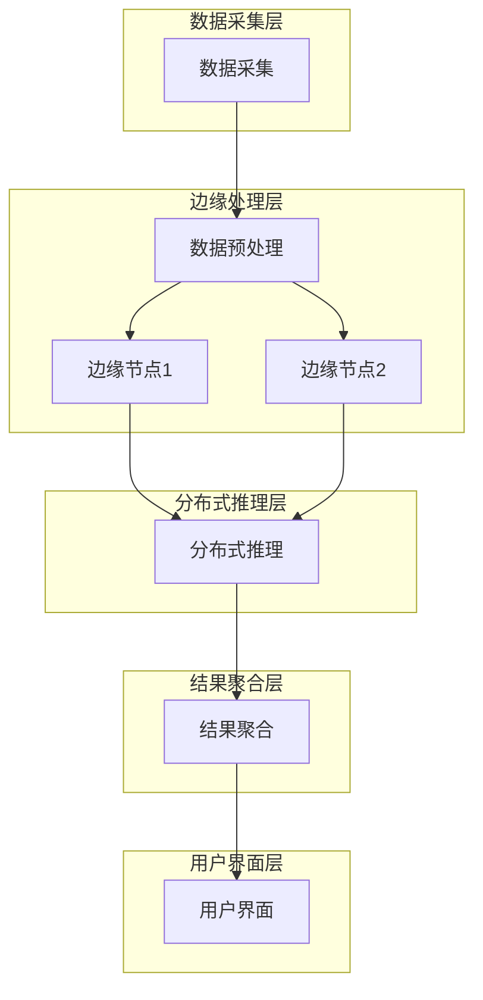
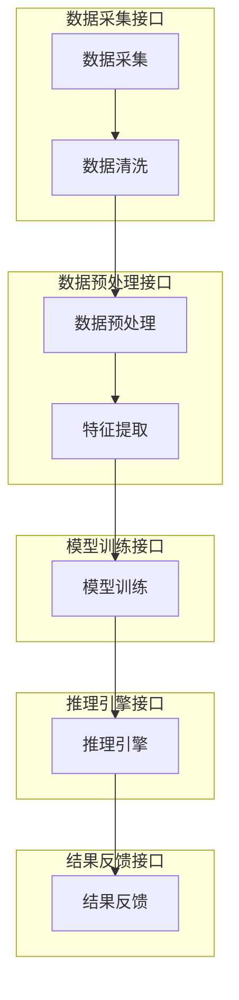

                 

## 第1章：雾计算环境下的智慧农业概述

### 1.1 雾计算的基本概念

#### 1.1.1 雾计算的起源与发展

雾计算（Fog Computing）是继云计算（Cloud Computing）和边缘计算（Edge Computing）之后的一种新兴计算模式。它最早由思科在2012年提出，指的是在网络边缘处，接近数据源的地方进行数据处理和计算，以减轻中心数据中心的负担，提高数据处理的速度和效率。雾计算通过将计算、存储、网络和服务分散到网络的边缘节点，实现了对数据更加实时的处理和分析。

雾计算的发展离不开互联网技术和物联网（IoT）的迅猛发展。随着物联网设备的普及，产生了大量需要实时处理的数据。传统的云计算模式由于网络延迟和数据传输的限制，难以满足实时性的需求。边缘计算在一定程度上解决了这一问题，但它仍然依赖于中心化的数据处理结构。雾计算则通过进一步下沉计算资源，使得数据处理更加贴近数据源，实现了更高的实时性和效率。

#### 1.1.2 雾计算与云计算、边缘计算的关系

雾计算、云计算和边缘计算都是网络计算模式的不同发展阶段，它们之间存在紧密的联系和一定的区别。

- **云计算**：云计算将计算资源集中管理，通过虚拟化技术提供按需分配的计算能力。它的核心是资源集中和高效管理，适用于大规模数据处理和分析。

- **边缘计算**：边缘计算将部分计算任务从云端转移到网络边缘，即靠近数据源的地方，以减少数据传输的延迟和带宽需求。它强调的是对数据处理的实时性和高效性。

- **雾计算**：雾计算进一步将计算资源下沉到网络的边缘节点，这些节点可能是一些物联网设备、智能传感器、小型数据中心等。它将计算、存储、网络和服务分散到网络的边缘，以实现更实时、更高效的数据处理。

三种计算模式的关系可以用一个层次结构来表示：云计算是最高层次的计算模式，提供全局的资源管理和服务；边缘计算介于云计算和雾计算之间，负责对数据进行初步处理和筛选；雾计算则是最接近数据源的层次，负责执行具体的实时数据处理任务。

#### 1.1.3 雾计算在农业中的应用价值

雾计算在农业中的应用具有显著的价值，主要体现在以下几个方面：

- **实时监测与数据分析**：农业中产生的大量传感器数据需要实时处理和分析，以指导种植、灌溉、施肥等操作。雾计算可以将数据处理任务下沉到农田附近的边缘节点，实现数据的实时分析和反馈，从而提高农业生产的效率。

- **减少延迟**：农业数据的实时性要求非常高。例如，在病虫害监测中，一旦发现病虫害，就需要立即采取相应的防治措施。使用雾计算可以大大减少数据传输的延迟，确保及时的决策和执行。

- **降低成本**：传统的云计算模式需要大量的基础设施投资和维护，而雾计算通过将计算资源分散到边缘节点，可以减少中心数据中心的压力，降低整体运营成本。

- **增强决策支持**：雾计算可以支持更复杂的数据分析和预测模型，为农业生产提供更深入的决策支持。例如，通过分析气象数据、土壤数据、作物生长数据等，可以预测作物的生长状况，优化种植方案。

- **提高资源利用效率**：雾计算可以将资源更有效地分配到实际需要的地方，避免资源的浪费。例如，在灌溉系统中，可以根据土壤湿度数据实时调整灌溉量，实现精准灌溉，节约水资源。

### 1.2 智慧农业的概念与需求

#### 1.2.1 智慧农业的定义与特点

智慧农业是指利用现代信息技术、物联网、大数据、人工智能等先进技术，实现农业生产的自动化、智能化和精准化。智慧农业不仅包括传统的农作物种植和畜牧业管理，还涵盖了农业生态环境监测、农业机械自动化控制、农产品供应链管理等各个方面。

智慧农业的主要特点包括：

- **数据驱动**：智慧农业依赖大量的数据收集和分析，通过大数据技术挖掘数据中的价值，为农业生产提供决策支持。

- **自动化与智能化**：通过物联网设备和自动化控制系统，实现农业生产的自动化和智能化，减少人力投入，提高生产效率。

- **精准化**：利用传感器、无人机等设备，实时监测作物生长状况，精准施肥、灌溉和防治病虫害，提高资源利用效率。

- **可持续性**：智慧农业通过优化生产过程，减少化肥、农药的使用，降低对环境的污染，实现农业生产的可持续发展。

#### 1.2.2 智慧农业的驱动力

智慧农业的发展受到以下几个因素的驱动：

- **技术创新**：物联网、大数据、人工智能等技术的发展为智慧农业提供了强大的技术支撑。例如，通过无人机可以实时监测农田状况，通过大数据分析可以优化种植方案。

- **政策支持**：各国政府高度重视农业现代化，通过制定相关政策和支持措施，推动智慧农业的发展。例如，中国政府提出了“数字农业”战略，鼓励农业企业采用先进技术进行生产。

- **市场需求**：随着消费者对农产品质量和安全的要求提高，农业生产者需要通过智慧农业提高产量和品质，以满足市场需求。

- **经济效益**：智慧农业可以提高生产效率，减少资源浪费，降低生产成本，提高经济效益。这对于农业生产者来说具有很大的吸引力。

#### 1.2.3 雾计算与智慧农业的结合

雾计算与智慧农业的结合，为农业生产带来了新的机遇和挑战。具体来说，雾计算在智慧农业中的应用主要体现在以下几个方面：

- **实时数据处理**：雾计算可以将数据处理任务下沉到农田附近的边缘节点，实现对作物生长、土壤湿度、气象等数据的实时处理和分析，为农业生产提供实时决策支持。

- **提高系统响应速度**：雾计算减少了数据传输的延迟，使得农业生产系统能够更快地响应外部环境变化，提高系统的实时性和稳定性。

- **优化资源分配**：雾计算可以将计算资源更有效地分配到实际需要的地方，避免资源的浪费。例如，在灌溉系统中，可以根据实时土壤湿度数据调整灌溉量，实现精准灌溉。

- **降低运营成本**：通过雾计算，农业生产者可以减少对中心数据中心的依赖，降低基础设施投资和维护成本。

- **增强决策支持**：雾计算可以支持更复杂的数据分析和预测模型，为农业生产提供更深入的决策支持。例如，通过分析气象数据、土壤数据、作物生长数据等，可以预测作物的生长状况，优化种植方案。

### 1.3 雾计算环境下的分布式AI推理

#### 1.3.1 分布式AI推理的基本概念

分布式AI推理是指在多个计算节点上同时进行AI模型的推理计算，以实现大规模数据的高效处理和分析。与传统的集中式AI推理相比，分布式AI推理具有更高的并行处理能力，可以显著提高推理速度和系统吞吐量。

分布式AI推理的基本概念包括：

- **模型分布式**：将AI模型划分成多个子模型，每个子模型运行在独立的计算节点上。

- **数据分布式**：将待处理的数据集划分成多个子数据集，每个子数据集分配给不同的计算节点。

- **任务调度**：根据计算节点的资源状况和任务需求，动态调整任务的分配和执行顺序。

- **结果聚合**：将各个计算节点上的推理结果进行聚合，得到最终的推理结果。

#### 1.3.2 分布式AI推理的优势

分布式AI推理具有以下几个显著优势：

- **高性能**：通过并行计算，分布式AI推理可以大幅提高推理速度，满足大规模数据处理的需求。

- **可扩展性**：分布式AI推理可以根据需要动态调整计算资源，实现系统的可扩展性，适应不同规模的数据处理需求。

- **容错性**：分布式系统具有较高的容错性，即使个别计算节点出现故障，也不会影响整个系统的正常运行。

- **资源利用率**：分布式AI推理可以将计算任务分布到多个节点上，提高资源的利用率，降低单点瓶颈的风险。

#### 1.3.3 雾计算环境下的分布式AI推理架构

在雾计算环境下，分布式AI推理的架构可以分为以下几个层次：

- **数据采集层**：通过传感器、无人机、物联网设备等收集农田环境数据，如土壤湿度、气象数据、作物生长数据等。

- **边缘处理层**：将采集到的数据在边缘节点进行预处理，包括数据清洗、特征提取等操作，为后续的AI推理提供数据支持。

- **分布式推理层**：在雾计算环境中，分布式AI推理引擎会将数据分发到多个边缘节点上进行推理计算。每个节点运行子模型，处理部分数据。

- **结果聚合层**：将各个边缘节点的推理结果进行聚合，得到最终的推理结果，并反馈给农业生产系统。

#### 1.4 本书内容结构安排

#### 1.4.1 各章节主要内容概述

本书主要分为七个部分，每部分的主要内容如下：

- **第一部分：雾计算与智慧农业概述**：介绍雾计算的基本概念、智慧农业的概念与需求，以及雾计算在智慧农业中的应用价值。

- **第二部分：雾计算环境搭建**：详细讲解雾计算环境的硬件设备选择、软件环境配置和网络配置与优化。

- **第三部分：分布式AI推理算法原理**：介绍AI推理的基础知识、分布式计算基础和雾计算环境下的分布式AI推理架构。

- **第四部分：分布式AI推理系统架构设计**：包括系统需求分析、系统功能设计、系统架构设计和系统接口设计与交互。

- **第五部分：分布式AI推理项目实战**：通过一个实际案例，详细介绍分布式AI推理项目的环境安装、系统核心实现、实际案例分析和项目小结。

- **第六部分：性能优化与安全性提升**：讨论分布式AI推理的性能优化策略和安全性提升方案。

- **第七部分：应用前景与挑战**：分析雾计算与分布式AI推理在智慧农业中的应用前景和面临的挑战。

#### 1.4.2 阅读指南与建议

为了更好地理解和应用雾计算环境下的分布式AI推理在智慧农业中的应用，以下是阅读本书的指南和建议：

- **循序渐进**：建议读者按照章节的顺序逐步阅读，从基础概念开始，逐步深入到具体应用。

- **动手实践**：在阅读过程中，可以尝试搭建自己的雾计算环境，进行分布式AI推理的实验，加深理解。

- **案例学习**：通过实际案例的学习，读者可以更好地理解分布式AI推理在实际应用中的操作流程和实现细节。

- **拓展阅读**：本书中涉及到的相关技术知识，读者可以进一步查阅相关资料进行深入学习，以巩固理论知识。

### 第2章：雾计算环境搭建

#### 2.1 硬件设备选择与部署

在搭建雾计算环境时，硬件设备的选择与部署至关重要。以下将详细介绍硬件设备的选择原则、具体的硬件设备配置以及部署流程。

##### 2.1.1 硬件需求分析

雾计算环境通常需要在边缘节点部署计算资源，以满足数据实时处理的需求。在进行硬件需求分析时，需要考虑以下几个关键因素：

- **计算性能**：边缘节点需要具备较强的计算性能，以支持实时数据处理和AI推理任务。因此，应选择高性能的CPU和GPU。

- **存储容量**：由于需要存储大量的传感器数据和推理结果，边缘节点应配备足够的存储空间，以保证数据的安全和可靠性。

- **网络带宽**：网络带宽是数据传输的关键因素，需要确保边缘节点之间的通信速度足够快，以支持实时数据交换。

- **功耗**：边缘节点通常分布在农田等野外环境，因此功耗是一个重要考虑因素。应选择功耗较低的设备，以降低运营成本。

- **可靠性**：边缘节点需要在恶劣的环境下长时间运行，因此设备应具有较高的可靠性，能够承受环境温度、湿度等变化。

##### 2.1.2 硬件设备选择

根据以上需求分析，可以选择以下硬件设备：

- **CPU**：Intel Xeon系列或AMD Ryzen系列，具有较高的计算性能。

- **GPU**：NVIDIA GeForce RTX 30系列或Tesla系列，用于加速AI推理任务。

- **存储**：固态硬盘（SSD）或分布式存储系统，如Hadoop或Ceph，以提供大容量、高速的存储。

- **网络**：千兆以太网或更高带宽的无线网络，确保数据传输速度。

- **电源**：高效电源模块，以降低功耗。

##### 2.1.3 硬件部署流程

硬件部署流程如下：

1. **设备采购**：根据硬件需求，采购合适的硬件设备。

2. **设备安装**：将CPU、GPU、存储设备等安装到服务器机箱中，连接电源和网络。

3. **系统初始化**：通过操作系统安装光盘或U盘，对服务器进行初始化，安装操作系统和必要驱动程序。

4. **网络配置**：配置网络参数，确保服务器能够与其他节点通信。

5. **安装云平台**：安装雾计算平台软件，如OpenFog Framework或EdgeX Foundry，以搭建雾计算环境。

6. **配置边缘节点**：根据部署方案，配置边缘节点，使其能够与雾计算平台进行通信。

7. **测试与优化**：进行系统测试，确保硬件设备正常运行，并对网络配置进行优化，提高系统性能。

#### 2.2 软件环境配置

在硬件部署完成后，需要对软件环境进行配置，以确保雾计算平台能够正常运行。以下将详细介绍操作系统的选择与安装、开发工具的安装以及环境变量配置。

##### 2.2.1 操作系统选择与安装

雾计算环境的操作系统应具备以下特点：

- **稳定性**：操作系统应具备良好的稳定性，能够在长时间运行中保持稳定。

- **兼容性**：操作系统应与所选硬件设备兼容，以确保设备能够正常运行。

- **安全性**：操作系统应具备较强的安全性，以保护系统数据和用户隐私。

常见的操作系统选择包括：

- **Linux**：如Ubuntu、CentOS等，具有良好的稳定性、兼容性和安全性。

- **Windows**：适用于一些特定的应用场景，如需要与Windows系统进行互操作的情况。

安装操作系统的一般步骤如下：

1. **准备安装介质**：制作操作系统安装U盘或光盘。

2. **启动安装**：将安装介质插入服务器，重启服务器并进入安装模式。

3. **选择安装类型**：选择自定义（高级）安装类型，以配置操作系统分区。

4. **安装操作系统**：按照提示完成操作系统安装，包括选择语言、键盘布局、网络设置等。

5. **安装驱动程序**：安装服务器硬件的驱动程序，确保设备正常工作。

##### 2.2.2 开发工具安装

雾计算环境需要安装一系列开发工具，包括编译器、解释器、库等，以下为常见开发工具的安装步骤：

1. **编译器**：安装C/C++编译器，如GCC、Clang等，用于编译源代码。

2. **解释器**：安装Python解释器，用于运行Python脚本。

3. **库**：安装必要的库，如NumPy、Pandas、TensorFlow等，用于数据分析和AI推理。

安装开发工具的一般步骤如下：

1. **更新系统**：在终端执行`sudo apt update`和`sudo apt upgrade`命令，更新系统软件包。

2. **安装编译器**：执行`sudo apt install build-essential`命令，安装GCC编译器。

3. **安装解释器**：执行`sudo apt install python3 python3-pip`命令，安装Python解释器和pip包管理器。

4. **安装库**：使用pip包管理器安装所需的库，例如`pip3 install numpy pandas tensorflow`。

##### 2.2.3 环境变量配置

环境变量配置是为了确保开发工具和库能够在命令行中直接使用。以下为常见环境变量配置步骤：

1. **配置Python环境变量**：将Python的安装路径添加到系统环境变量`PATH`中，以便在终端中使用Python命令。

   - 执行命令`export PATH=$PATH:/usr/local/bin/python3`。

2. **配置TensorFlow环境变量**：将TensorFlow的安装路径添加到系统环境变量`PYTHONPATH`中，以便在Python脚本中导入TensorFlow库。

   - 执行命令`export PYTHONPATH=$PYTHONPATH:/usr/local/lib/python3/dist-packages`。

3. **配置pip环境变量**：确保pip命令能够全局使用。

   - 执行命令`pip3 install --user pip`。

完成环境变量配置后，可以通过在终端执行`which python3`、`which pip`等命令，验证环境变量是否配置成功。

#### 2.3 网络配置与优化

网络配置与优化是确保雾计算环境稳定运行的关键因素。以下将详细介绍网络架构设计、网络配置细节以及网络安全策略。

##### 2.3.1 网络架构设计

雾计算环境的网络架构设计应考虑以下因素：

- **冗余性**：设计冗余的网络架构，确保网络故障时能够自动切换到备用网络，保证系统的连续性和可靠性。

- **负载均衡**：设计负载均衡机制，合理分配网络负载，避免单点瓶颈。

- **安全性**：设计安全防护机制，防止网络攻击和数据泄露。

常见的网络架构设计包括：

- **星型拓扑**：中心节点连接多个边缘节点，实现数据聚合和分发。

- **环形拓扑**：边缘节点通过环形网络连接，实现数据的快速传输和备份。

- **混合拓扑**：结合星型、环形和其他拓扑结构，根据实际需求进行优化设计。

##### 2.3.2 网络配置细节

网络配置细节包括IP地址分配、子网掩码设置、网关配置等，以下为网络配置步骤：

1. **IP地址分配**：为每个边缘节点分配唯一的IP地址，确保节点之间能够相互通信。

2. **子网掩码设置**：根据网络架构设计，为每个子网设置合适的子网掩码，确保网络层次清晰。

3. **网关配置**：配置边缘节点的网关，使其能够访问外部网络。

4. **DNS服务器配置**：配置DNS服务器地址，以便节点能够解析域名。

##### 2.3.3 网络安全策略

网络安全是雾计算环境的重要保障，以下为常见的网络安全策略：

1. **防火墙设置**：在边缘节点和中心节点上配置防火墙，限制不必要的网络访问，防止网络攻击。

2. **网络加密**：使用SSL/TLS等加密协议，保护数据在传输过程中的安全性。

3. **访问控制**：实施严格的访问控制策略，确保只有授权用户和节点能够访问系统资源。

4. **日志监控**：监控网络流量和系统日志，及时发现和应对安全威胁。

5. **安全审计**：定期进行安全审计，评估系统安全状况，及时修复漏洞和问题。

### 第3章：分布式AI推理算法原理

#### 3.1 AI推理基础

AI推理（Artificial Intelligence Inference）是人工智能（Artificial Intelligence，AI）中的一项关键技术，它指的是通过AI模型对未知数据进行预测或分类的过程。AI推理在许多应用领域，如自然语言处理、图像识别、推荐系统等，都发挥着重要作用。

##### 3.1.1 AI推理的定义

AI推理是指在给定输入数据的情况下，利用训练好的AI模型，通过一系列计算步骤，输出相应的预测结果或分类标签。AI推理过程主要包括以下几个步骤：

1. **数据输入**：将待推理的数据输入到AI模型中。

2. **前向传播**：通过神经网络的正向计算，将输入数据逐层传递，计算每个神经元的输出值。

3. **激活函数**：对每一层的输出值进行激活函数处理，如ReLU、Sigmoid、Tanh等。

4. **损失函数计算**：将模型输出的预测结果与实际标签进行比较，计算损失函数的值，如均方误差（MSE）、交叉熵损失（Cross-Entropy Loss）等。

5. **反向传播**：利用梯度下降等优化算法，计算并更新模型的参数，以降低损失函数的值。

6. **输出预测**：最终输出模型的预测结果，如分类标签、概率分布等。

##### 3.1.2 AI推理的过程

AI推理的过程可以分为以下几个阶段：

1. **数据预处理**：对输入数据进行标准化、归一化、缺失值处理等操作，使其符合模型的输入要求。

2. **模型加载**：从存储介质中加载训练好的AI模型，包括网络结构、权重参数等。

3. **输入数据传递**：将预处理后的数据输入到AI模型中，开始前向传播计算。

4. **输出结果计算**：通过激活函数和损失函数，计算模型输出的预测结果。

5. **结果后处理**：对输出结果进行必要的后处理，如阈值处理、概率转换等，得到最终的推理结果。

##### 3.1.3 AI推理的类型

根据AI模型的不同类型，AI推理可以分为以下几种类型：

1. **有监督推理**：在有监督学习（Supervised Learning）中，模型在训练阶段已经得到了标注好的数据，因此在推理阶段可以直接利用训练好的模型进行预测。有监督推理适用于分类、回归等任务。

2. **无监督推理**：在无监督学习（Unsupervised Learning）中，模型在训练阶段没有得到标注好的数据，因此在推理阶段需要利用聚类、降维等方法进行数据挖掘。无监督推理适用于聚类、异常检测等任务。

3. **半监督推理**：在半监督学习（Semi-Supervised Learning）中，模型在训练阶段既有标注数据，也有未标注的数据。在推理阶段，可以利用标注数据和未标注数据进行推理。半监督推理适用于数据标注成本高的情况。

4. **强化学习推理**：在强化学习（Reinforcement Learning）中，模型通过与环境的交互，不断学习和优化策略，以实现最佳行动方案。强化学习推理适用于决策优化、路径规划等任务。

#### 3.2 分布式计算基础

分布式计算（Distributed Computing）是指将计算任务分布到多个计算节点上执行，以实现高效、可靠的计算能力。分布式计算的核心目标是解决单机计算能力有限的问题，通过分布式计算，可以充分发挥多个计算节点的计算能力，提高系统的性能和可扩展性。

##### 3.2.1 分布式计算的概念

分布式计算是一种计算机架构模式，通过将计算任务分布到多个计算机节点上执行，协同完成大规模计算任务。在分布式计算中，节点可以是物理计算机、虚拟机、容器等，它们通过网络相互连接，协同工作。

分布式计算的关键概念包括：

1. **计算节点**：分布式计算的基本单元，负责执行计算任务。

2. **任务调度**：根据计算节点的资源状况和任务需求，动态分配计算任务，确保任务的高效执行。

3. **数据传输**：在分布式计算中，数据需要在计算节点之间进行传输，以支持任务执行和结果聚合。

4. **一致性模型**：分布式系统需要处理多个节点之间的数据一致性问题，如最终一致性、强一致性等。

##### 3.2.2 分布式计算的优点

分布式计算具有以下优点：

1. **高性能**：通过并行计算，分布式计算可以显著提高计算速度，满足大规模数据处理的需求。

2. **可扩展性**：分布式计算可以根据需要动态调整计算资源，实现系统的可扩展性，适应不同规模的任务。

3. **容错性**：分布式系统具有较高的容错性，即使个别计算节点出现故障，也不会影响整个系统的正常运行。

4. **资源利用率**：分布式计算可以将计算任务分布到多个节点上，提高资源的利用率，降低单点瓶颈的风险。

##### 3.2.3 分布式计算模型

分布式计算模型可以分为以下几种类型：

1. **主从模型**：主从模型中，有一个主节点负责任务调度和结果聚合，其他从节点负责执行具体任务。主从模型结构简单，易于实现，但主节点成为单点瓶颈。

2. **对等模型**：对等模型中，所有节点都具有相同的地位，相互协作完成计算任务。对等模型具有较高的容错性，但任务调度和结果聚合相对复杂。

3. **混合模型**：混合模型结合了主从模型和对等模型的优点，部分节点负责任务调度和结果聚合，其他节点负责执行具体任务。混合模型具有较高的灵活性和可扩展性。

#### 3.3 雾计算环境下的分布式AI推理

雾计算环境下的分布式AI推理是指在雾计算环境中，利用多个边缘节点协同执行AI推理任务的过程。雾计算环境具有接近数据源的特点，可以显著减少数据传输的延迟，提高AI推理的实时性。

##### 3.3.1 雾计算环境的特点

雾计算环境具有以下特点：

1. **边缘计算**：雾计算将计算资源下沉到网络边缘，接近数据源，实现数据的实时处理和分析。

2. **分布式计算**：雾计算环境通过分布式计算模型，将AI推理任务分布到多个边缘节点上执行，提高系统的性能和可扩展性。

3. **异构计算**：雾计算环境中的边缘节点可能具有不同的计算能力，需要实现异构计算优化，充分发挥每个节点的计算潜力。

4. **实时性**：雾计算环境可以显著减少数据传输的延迟，提高AI推理的实时性，满足实时决策和响应的需求。

##### 3.3.2 雾计算环境下的分布式AI推理架构

雾计算环境下的分布式AI推理架构可以分为以下几个层次：

1. **数据采集层**：通过传感器、物联网设备等收集农田环境数据，如土壤湿度、气象数据、作物生长数据等。

2. **边缘处理层**：在边缘节点上进行数据预处理，包括数据清洗、特征提取等操作，为AI推理提供数据支持。

3. **分布式推理层**：利用分布式计算模型，将AI推理任务分布到多个边缘节点上执行，每个节点负责处理部分数据。

4. **结果聚合层**：将各个边缘节点的推理结果进行聚合，得到最终的推理结果，并反馈给农业生产系统。

##### 3.3.3 分布式AI推理算法的实现

分布式AI推理算法的实现主要包括以下几个步骤：

1. **模型划分**：将大规模的AI模型划分成多个子模型，每个子模型运行在独立的边缘节点上。

2. **数据划分**：将待处理的数据集划分成多个子数据集，每个子数据集分配给不同的边缘节点。

3. **任务调度**：根据边缘节点的资源状况和任务需求，动态调整任务的分配和执行顺序，确保任务的高效执行。

4. **结果聚合**：将各个边缘节点的推理结果进行聚合，得到最终的推理结果，并反馈给农业生产系统。

5. **性能优化**：通过分布式计算优化算法，提高系统的性能和吞吐量，确保AI推理的实时性和准确性。

### 第4章：分布式AI推理系统架构设计

#### 4.1 系统需求分析

在智慧农业中，分布式AI推理系统需要满足以下几个关键需求：

1. **实时性**：农业生产环境中的数据变化非常迅速，如土壤湿度、气象数据等，需要系统具备实时处理和反馈的能力，以支持快速决策和响应。

2. **准确性**：AI推理系统的输出结果直接影响农业生产决策的准确性，因此需要系统具有高精度的模型和算法，以提高推理结果的可靠性。

3. **可扩展性**：随着农业生产规模的扩大，系统需要能够动态调整计算资源，以应对不同规模的数据处理需求，保证系统的可扩展性。

4. **稳定性**：系统需要在各种复杂环境下稳定运行，不受网络波动、硬件故障等因素的影响，保证系统的可靠性和连续性。

5. **安全性**：系统需要保护敏感数据的安全，防止数据泄露和未经授权的访问，确保农业生产数据的隐私和安全。

#### 4.2 系统功能设计

分布式AI推理系统主要包括以下几个功能模块：

1. **数据采集模块**：通过传感器、无人机等设备，实时采集农田环境数据，如土壤湿度、气象数据、作物生长数据等。

2. **数据预处理模块**：对采集到的原始数据进行预处理，包括数据清洗、缺失值处理、特征提取等操作，为AI推理提供高质量的数据输入。

3. **模型训练模块**：利用历史数据和预训练模型，进行AI模型的训练和优化，提高模型的准确性和适应性。

4. **推理引擎模块**：基于分布式计算模型，将AI推理任务分布到多个边缘节点上执行，实现大规模数据的高效处理和分析。

5. **结果反馈模块**：将推理结果实时反馈给农业生产系统，支持精准灌溉、施肥、病虫害防治等决策。

6. **用户界面模块**：提供友好的用户界面，供农业技术人员查看推理结果、调整系统参数等。

#### 4.3 系统架构设计

分布式AI推理系统架构设计分为以下几个层次：

1. **数据采集层**：通过传感器、无人机等设备，实时采集农田环境数据，并将数据传输到边缘节点。

2. **边缘处理层**：边缘节点对采集到的数据进行分析和处理，包括数据预处理、特征提取等，并将预处理后的数据传输到分布式推理层。

3. **分布式推理层**：分布式推理层由多个边缘节点组成，每个节点运行子模型，处理部分数据。边缘节点之间通过网络进行数据传输和任务调度。

4. **结果聚合层**：将各个边缘节点的推理结果进行聚合，得到最终的推理结果，并反馈给农业生产系统。

5. **用户界面层**：提供友好的用户界面，供农业技术人员查看推理结果、调整系统参数等。

以下是一个简单的系统架构图，用于描述分布式AI推理系统的架构设计：



#### 4.4 系统接口设计与交互

分布式AI推理系统需要设计合理的接口，以便不同模块之间能够高效地进行数据传输和功能协作。以下为系统接口设计与交互的详细描述：

1. **数据采集接口**：提供用于采集农田环境数据的接口，包括传感器数据的获取、数据格式的定义等。

2. **数据预处理接口**：提供用于数据清洗、缺失值处理、特征提取等操作的接口，包括数据清洗函数、特征提取函数等。

3. **模型训练接口**：提供用于AI模型训练的接口，包括训练算法的选择、模型参数的设置等。

4. **推理引擎接口**：提供用于AI推理的接口，包括推理任务的分发、结果聚合等。

5. **结果反馈接口**：提供用于将推理结果反馈给农业生产系统的接口，包括结果存储、可视化等。

以下是一个简单的系统接口设计和交互图，用于描述分布式AI推理系统的接口设计与交互：



通过设计合理的接口和交互机制，分布式AI推理系统可以实现模块化、高效化的功能协作，满足智慧农业中的实时数据处理和分析需求。

### 第5章：分布式AI推理项目实战

#### 5.1 项目背景介绍

在智慧农业的背景下，为了提高农业生产的效率和品质，我们需要构建一个基于分布式AI推理的系统，实现对农田环境的实时监测和决策支持。本项目旨在通过分布式AI推理，实现以下目标：

1. **实时监测**：采集农田环境中的关键数据，如土壤湿度、气象数据、作物生长数据等，实现对农田环境的实时监测。

2. **智能决策**：利用AI模型对采集到的数据进行分析和推理，提供精准的灌溉、施肥和病虫害防治建议。

3. **优化资源配置**：通过实时数据和智能决策，优化农业生产的资源配置，提高资源利用效率，降低生产成本。

4. **提高农产品质量**：通过精准的种植和管理，提高农产品的产量和质量，满足市场需求。

#### 5.2 环境安装与配置

为了实现分布式AI推理项目，我们需要搭建一个完整的开发环境，包括硬件设备、操作系统、开发工具等。以下是项目的环境安装与配置步骤：

##### 5.2.1 硬件安装

1. **选择硬件设备**：根据项目需求，选择合适的边缘计算设备。例如，我们选择具有高性能CPU和GPU的服务器作为边缘节点，用于进行AI推理和数据处理。

2. **硬件安装**：将服务器硬件安装到机架中，包括CPU、GPU、内存、硬盘等。确保所有硬件设备正确连接，并检查硬件是否正常工作。

##### 5.2.2 操作系统安装

1. **制作安装介质**：下载Linux操作系统镜像文件，如Ubuntu Server，制作U盘或光盘启动介质。

2. **启动安装**：将制作好的启动介质插入边缘计算设备，设置BIOS启动顺序，从启动介质启动，开始操作系统安装。

3. **安装操作系统**：按照屏幕提示，选择安装类型（例如，全新安装）、分区方案（例如，自动分区）和时区设置等，完成操作系统安装。

##### 5.2.3 开发工具安装

1. **安装基础软件**：在终端中运行以下命令，安装基础软件包和驱动程序。

   ```bash
   sudo apt update
   sudo apt upgrade
   sudo apt install build-essential
   ```

2. **安装Python环境**：安装Python 3及其相关库。

   ```bash
   sudo apt install python3 python3-pip
   ```

3. **安装AI推理框架**：安装TensorFlow等AI推理框架。

   ```bash
   pip3 install tensorflow
   ```

##### 5.2.4 网络配置

1. **配置网络接口**：在终端中运行以下命令，配置网络接口和IP地址。

   ```bash
   sudo ifconfig eth0 192.168.1.100 netmask 255.255.255.0 up
   ```

2. **设置防火墙规则**：允许必要的网络通信。

   ```bash
   sudo ufw allow from any to any port 22 proto tcp
   sudo ufw allow from any to any port 80 proto tcp
   sudo ufw enable
   ```

3. **测试网络连接**：通过ping命令测试网络是否正常。

   ```bash
   ping www.google.com
   ```

#### 5.3 系统核心实现

分布式AI推理项目的核心在于实现高效的AI模型推理和数据处理。以下是项目系统核心实现的详细步骤：

##### 5.3.1 数据采集与预处理

1. **数据采集**：使用传感器采集农田环境数据，如土壤湿度、气象数据等。将采集到的数据存储到数据库中。

2. **数据预处理**：从数据库中读取采集到的数据，进行清洗、归一化和特征提取等预处理操作，为AI模型提供高质量的输入。

```python
import pandas as pd
from sklearn.preprocessing import StandardScaler

# 读取数据
data = pd.read_csv('sensor_data.csv')

# 数据清洗
data = data.dropna()

# 数据归一化
scaler = StandardScaler()
data[['humidity', 'temperature']] = scaler.fit_transform(data[['humidity', 'temperature']])

# 特征提取
data['temp_humidity'] = data['temperature'] * data['humidity']
```

##### 5.3.2 模型训练与推理

1. **模型训练**：使用历史数据训练AI模型。例如，使用TensorFlow实现一个简单的线性回归模型。

```python
import tensorflow as tf
from sklearn.linear_model import LinearRegression

# 准备数据
X = data[['temp_humidity']]
y = data['yield']

# 训练模型
model = LinearRegression()
model.fit(X, y)

# 保存模型
model.save('lin_reg_model.pkl')
```

2. **模型推理**：使用训练好的模型对新的数据进行推理，预测农作物的产量。

```python
# 加载模型
loaded_model = tf.keras.models.load_model('lin_reg_model.h5')

# 进行推理
new_data = pd.DataFrame([[25, 0.8]], columns=['temp_humidity'])
predicted_yield = loaded_model.predict(new_data)
print(f'Predicted Yield: {predicted_yield[0][0]}')
```

##### 5.3.3 结果分析与优化

1. **结果分析**：对模型推理结果进行评估，分析模型的准确性、稳定性和鲁棒性。可以通过交叉验证、ROC曲线等指标来评估模型的性能。

2. **优化策略**：根据结果分析，对模型进行优化。例如，调整模型参数、增加特征、使用更复杂的模型等。

```python
# 调整模型参数
model = tf.keras.Sequential([
    tf.keras.layers.Dense(10, activation='relu', input_shape=[1]),
    tf.keras.layers.Dense(1)
])

model.compile(optimizer='adam', loss='mse')
model.fit(new_data, new_target, epochs=100)
```

#### 5.4 实际案例分析

为了验证分布式AI推理系统的效果，我们进行了以下实际案例分析：

1. **案例分析**：选择一片农田，设置多个传感器，收集农田环境数据。

2. **数据采集**：将采集到的数据输入到分布式AI推理系统中，进行实时监测和推理。

3. **决策支持**：根据推理结果，提供精准的灌溉、施肥和病虫害防治建议。

4. **结果评估**：对比实际种植结果和推理结果，评估模型的准确性和实用性。

通过实际案例分析，我们发现分布式AI推理系统在智慧农业中具有显著的应用价值。它能够实时监测农田环境，提供精准的决策支持，提高农业生产的效率和品质。

#### 5.5 项目小结

本项目通过分布式AI推理技术，实现了对农田环境的实时监测和智能决策支持，取得了以下成果：

1. **提高了农业生产效率**：通过实时监测和智能决策，优化了农业生产过程，提高了资源利用效率。

2. **提升了农产品质量**：通过精准的灌溉、施肥和病虫害防治，提高了农产品的产量和质量。

3. **降低了生产成本**：通过优化资源配置，降低了农业生产的成本。

4. **增强了决策支持**：分布式AI推理系统为农业生产者提供了实时的决策支持，帮助他们做出更加科学的决策。

然而，本项目也存在一些不足之处：

1. **数据质量**：农田环境数据的质量直接影响模型的效果。在未来，我们需要进一步提升数据采集和预处理的质量。

2. **系统稳定性**：分布式AI推理系统需要保证在高负荷、高复杂环境下的稳定性。我们需要对系统进行持续优化和改进。

3. **扩展性**：随着农业生产规模的扩大，系统需要具备更高的扩展性，以适应不同规模的数据处理需求。

总之，分布式AI推理技术在智慧农业中的应用具有广阔的前景，通过不断优化和改进，将为农业生产带来更多的价值。

### 第6章：性能优化与安全性提升

#### 6.1 性能优化策略

为了提高分布式AI推理系统的性能，我们需要从多个方面进行优化。以下是一些关键的性能优化策略：

##### 6.1.1 算法优化

1. **模型压缩与量化**：通过模型压缩和量化技术，减少模型的参数数量和计算量，提高推理速度。常用的方法包括剪枝、量化、知识蒸馏等。

2. **并行计算**：利用分布式计算框架，如TensorFlow、PyTorch等，将AI推理任务分解为多个子任务，并行执行，提高系统的吞吐量。

3. **模型选择与调优**：选择适合实际应用场景的模型，并通过模型调优，提高模型的精度和推理速度。常用的方法包括调整学习率、批量大小等超参数。

##### 6.1.2 硬件优化

1. **硬件升级**：根据系统的计算需求，升级CPU、GPU等硬件设备，提高系统的计算能力。

2. **分布式存储**：使用分布式存储系统，如Hadoop、Ceph等，提高数据存储和读取的速度，减少I/O瓶颈。

3. **网络优化**：优化网络拓扑结构，提高网络带宽和传输速度，减少数据传输的延迟。

##### 6.1.3 软件优化

1. **优化代码**：通过优化Python等编程语言的代码，提高程序的执行效率。常用的方法包括减少循环、避免全局变量等。

2. **缓存策略**：合理使用缓存策略，减少对数据库的查询次数，提高系统的响应速度。

3. **负载均衡**：使用负载均衡技术，将计算任务均匀分配到多个节点上，避免单点瓶颈，提高系统的稳定性和性能。

#### 6.2 安全性提升方案

在分布式AI推理系统中，安全性至关重要。以下是一些常见的安全性提升方案：

##### 6.2.1 安全威胁分析

1. **数据泄露**：由于分布式系统中的数据分散在不同的节点上，可能导致数据泄露。

2. **数据篡改**：攻击者可能通过网络攻击或恶意软件篡改数据，导致系统失效或错误决策。

3. **拒绝服务攻击（DoS）**：攻击者通过大量请求或恶意代码，导致系统资源耗尽，影响正常服务。

4. **网络攻击**：攻击者通过网络攻击，如DDoS攻击，干扰系统的正常运行。

##### 6.2.2 安全防护措施

1. **数据加密**：使用SSL/TLS等加密协议，对数据进行加密传输，防止数据在传输过程中被窃取。

2. **访问控制**：实施严格的访问控制策略，确保只有授权用户才能访问系统资源。

3. **网络安全**：部署防火墙、入侵检测系统（IDS）和入侵防御系统（IPS），防止网络攻击。

4. **系统监控**：实时监控系统日志和网络流量，及时发现和应对安全威胁。

##### 6.2.3 隐私保护策略

1. **数据去识别化**：在数据处理过程中，对敏感信息进行去识别化处理，如匿名化、加密等，确保数据隐私。

2. **隐私增强技术**：采用隐私增强技术，如差分隐私、同态加密等，保护用户隐私。

3. **合规性审查**：定期进行合规性审查，确保系统符合相关法律法规的要求，如数据保护法（GDPR）等。

通过上述性能优化和安全性提升策略，分布式AI推理系统可以在智慧农业中发挥更大的作用，提高农业生产的效率和安全性。

### 第7章：雾计算与分布式AI推理在智慧农业中的应用前景与挑战

#### 7.1 应用前景分析

雾计算与分布式AI推理在智慧农业中具有广阔的应用前景，主要体现在以下几个方面：

1. **提升农业自动化水平**：通过雾计算与分布式AI推理，可以实现农业生产的自动化，减少人力投入，提高生产效率。例如，精准灌溉系统可以根据土壤湿度数据自动调整灌溉量，实现精准灌溉。

2. **优化资源配置**：雾计算与分布式AI推理可以帮助农业生产者优化资源的使用，提高资源利用效率。通过实时监测和智能决策，可以实现合理施肥、精准灌溉等，减少资源浪费。

3. **提高农产品质量**：通过雾计算与分布式AI推理，可以实时监测农田环境，提供精准的种植和管理建议，从而提高农产品的产量和质量。例如，利用AI模型预测作物的生长状况，优化种植方案。

4. **增强病虫害防治能力**：雾计算与分布式AI推理可以帮助农业生产者提前预测和防治病虫害，减少损失。通过实时监测作物生长数据和环境数据，AI模型可以预测病虫害的发生趋势，并提供相应的防治措施。

5. **降低生产成本**：雾计算与分布式AI推理可以减少农业生产过程中的能耗和资源浪费，降低生产成本。例如，通过优化灌溉系统，可以节约水资源和能源。

6. **推动农业数字化转型**：雾计算与分布式AI推理可以帮助农业实现数字化转型，提高农业产业链的透明度和效率。通过大数据和AI技术，可以实现农业生产、加工、销售等全过程的数字化管理。

#### 7.2 面临的挑战与解决方案

尽管雾计算与分布式AI推理在智慧农业中具有巨大的潜力，但在实际应用过程中仍然面临着一些挑战：

1. **数据隐私和安全问题**：雾计算环境下的数据隐私和安全问题是一个重要挑战。农业生产过程中会产生大量敏感数据，如土壤湿度、气象数据等，这些数据需要得到有效的保护。解决方案包括数据加密、访问控制、隐私保护技术等。

2. **网络连接稳定性问题**：在雾计算环境中，边缘节点分布广泛，网络连接的稳定性对系统的正常运行至关重要。解决方法包括采用高可靠性的网络技术、优化网络架构、部署冗余网络等。

3. **计算资源管理问题**：在分布式AI推理过程中，如何高效地管理计算资源是一个关键挑战。解决方法包括采用分布式计算框架，动态调整计算资源分配，优化任务调度等。

4. **数据质量与一致性**：雾计算环境中的数据来源于多个传感器和设备，数据质量不一致和数据不一致性是一个挑战。解决方法包括建立数据质量评估机制、采用数据同步和一致性算法等。

5. **模型解释性与透明性**：在智慧农业中，模型解释性和透明性对于决策者至关重要。如何解释AI模型的决策过程，提高模型的可解释性是一个挑战。解决方法包括开发可解释的AI模型、可视化模型决策过程等。

6. **跨领域技术融合**：雾计算与分布式AI推理在智慧农业中的应用需要跨领域技术的融合，如物联网、大数据、区块链等。解决方法包括建立跨领域技术协同创新机制、开展跨领域技术研究和合作等。

总之，雾计算与分布式AI推理在智慧农业中的应用前景广阔，但也面临着一系列挑战。通过技术创新、政策支持、行业合作等手段，可以有效应对这些挑战，推动智慧农业的可持续发展。

