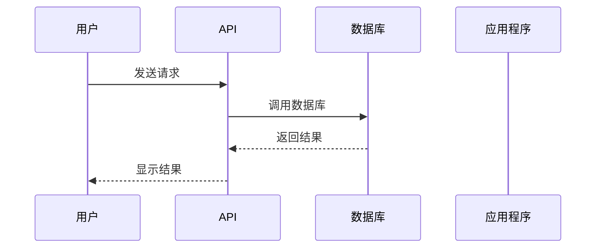
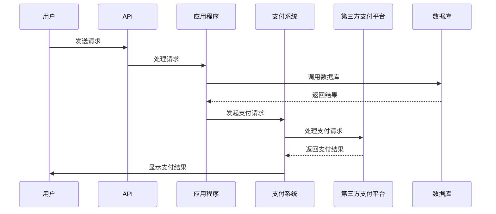

                 

## 《需求backlog管理：保持大型应用开发的灵活性》

### 关键词

- **需求backlog管理**
- **大型应用开发**
- **灵活性**
- **算法原理**
- **系统架构**
- **项目实战**

### 摘要

本文旨在探讨如何有效地管理需求backlog，以保持大型应用开发的灵活性。在当今快速变化的市场环境中，需求backlog的管理变得尤为重要。本文将从问题背景、核心概念、算法原理、系统架构和项目实战等多个角度进行分析，提供一套完整的解决方案。通过这篇文章，读者将了解如何将需求backlog管理应用于实际项目中，提高开发效率，保持产品灵活性。

## 引言

在现代软件开发领域，需求backlog管理是一个至关重要的环节。它涉及到如何有效地收集、排序、评估和管理项目的需求，以确保开发团队能够按照既定目标高效地推进项目。特别是在大型应用开发中，需求backlog的管理直接关系到项目的成功与否。

### 问题背景

大型应用开发的复杂性不断增加，需求的变化速度也越来越快。在这种情况下，传统的需求管理方法往往难以适应。需求backlog管理成为了应对这种挑战的关键手段。通过科学的需求backlog管理，开发团队可以更好地应对需求变化，提高项目灵活性，确保项目的顺利推进。

### 目标受众

本文的目标受众包括从事大型应用开发的开发人员、项目经理和产品经理。无论您是经验丰富的专业人士，还是刚入门的新手，本文都将为您提供实用的指导和建议。

### 写作目的

本文旨在：
1. 深入剖析需求backlog管理的核心概念和原理。
2. 介绍实用的算法和系统架构设计。
3. 通过实际案例分享项目实战经验。
4. 提供最佳实践和注意事项，帮助读者在实际工作中应用需求backlog管理。

## 问题背景与需求

### 问题背景

在现代软件开发领域，需求backlog管理是一个至关重要的环节。它涉及到如何有效地收集、排序、评估和管理项目的需求，以确保开发团队能够按照既定目标高效地推进项目。特别是在大型应用开发中，需求backlog的管理直接关系到项目的成功与否。

#### 大型应用开发的挑战

大型应用开发面临着诸多挑战，如：
1. **需求复杂度**：大型应用通常涉及多种功能模块，需求复杂度较高。
2. **变更频繁**：市场需求不断变化，需求变更频繁。
3. **资源有限**：开发团队通常面临资源限制，需要合理分配时间和精力。
4. **时间紧迫**：大型应用开发往往具有时间紧迫性，需要在限定时间内完成。

#### 需求管理的核心作用

需求管理在大型应用开发中具有核心作用，主要体现在以下几个方面：

1. **确保项目目标达成**：通过明确需求，确保开发团队聚焦于实现关键功能。
2. **提高开发效率**：合理的需求管理有助于减少开发中的返工和重复工作。
3. **优化资源分配**：通过评估需求优先级，合理分配开发资源。
4. **应对变更**：灵活的需求管理有助于应对需求变更，确保项目适应市场变化。

#### 需求backlog的概念与重要性

需求backlog是指待实现的需求清单，包括所有已识别的需求。它是一个动态的列表，会随着项目进展和需求变化而不断调整。需求backlog的重要性体现在以下几个方面：

1. **集中管理需求**：需求backlog提供了一个集中管理需求的平台，便于开发团队进行需求分析和优先级排序。
2. **灵活调整计划**：通过管理需求backlog，开发团队可以灵活调整开发计划，以应对需求变更。
3. **提高决策效率**：需求backlog管理有助于团队在需求评估、优先级排序和资源分配方面做出更高效的决策。
4. **确保项目可控**：通过管理需求backlog，项目团队能够更好地掌控项目进度和风险。

### 问题描述

#### 需求backlog管理的现状

当前，需求backlog管理在大型应用开发中普遍存在以下问题：

1. **需求收集不完整**：部分需求未及时收集或记录，导致需求漏失。
2. **需求变更管理困难**：需求变更频繁，但变更管理流程不规范，导致项目进度受影响。
3. **需求优先级不明确**：需求优先级评估不明确，导致资源分配不合理。
4. **需求评估不准确**：需求评估缺乏科学依据，导致需求优先级排序不准确。

#### 存在的问题与挑战

1. **需求漏失**：需求收集不完整，导致部分重要需求未能纳入需求backlog。
2. **变更管理困难**：需求变更频繁，但变更管理流程不规范，导致项目进度和质量受到影响。
3. **优先级评估不准确**：需求优先级评估不准确，导致资源分配不合理，影响项目进展。
4. **沟通协作不畅**：项目团队成员之间沟通不畅，需求理解不一致，导致需求变更和优先级评估困难。

#### 解决方案的需求

为了解决上述问题，需求backlog管理需要满足以下需求：

1. **完善的收集与记录机制**：确保所有需求都能被及时收集和记录。
2. **科学的变更管理流程**：建立规范的变更管理流程，确保需求变更得到有效处理。
3. **明确的优先级评估标准**：制定明确的优先级评估标准，确保需求优先级评估准确。
4. **高效的沟通协作机制**：建立高效的沟通协作机制，确保项目团队成员之间需求理解一致。

### 解决方案的核心要素

1. **需求收集工具**：采用专业的需求收集工具，如JIRA或Trello，提高需求收集和管理的效率。
2. **变更管理流程**：制定规范的变更管理流程，包括变更申请、评估、审批和实施等环节。
3. **优先级评估模型**：构建科学的优先级评估模型，结合需求的重要性、紧急性和实现成本等多方面因素进行评估。
4. **团队沟通机制**：建立定期需求讨论会议，确保项目团队成员之间的需求理解一致，提高团队协作效率。

## 核心概念与联系

### 需求管理的基础知识

#### 需求的定义与分类

需求是指用户或利益相关者对产品或服务的期望和需求。在软件开发领域，需求通常分为以下几类：

1. **功能需求**：描述产品或服务应具有的功能和特性。
2. **非功能需求**：描述产品或服务的性能、可靠性、安全性、可维护性等属性。
3. **业务需求**：描述产品或服务对业务流程和战略目标的支持。
4. **用户需求**：描述用户对产品或服务的期望和需求。

#### 需求的生命周期

需求的生命周期是指需求从识别到实现的全过程。一般包括以下几个阶段：

1. **需求识别**：识别和收集用户和利益相关者的需求。
2. **需求分析**：对需求进行详细分析和评估，确定需求的可行性和优先级。
3. **需求设计**：根据需求分析结果，设计实现需求的具体方案。
4. **需求实现**：开发团队根据需求设计，实现具体的功能和特性。
5. **需求验收**：对实现的需求进行验收，确保符合用户和利益相关者的期望。
6. **需求维护**：对已实现的需求进行定期维护和更新。

#### 需求管理的关键原则

1. **客户导向**：以用户和利益相关者的需求为中心，确保需求满足其期望。
2. **敏捷响应**：快速响应需求变化，保持需求管理的灵活性。
3. **透明度**：确保需求管理的全过程透明，便于团队协作和沟通。
4. **质量控制**：对需求进行严格的质量控制，确保需求符合技术规范和业务目标。
5. **文档管理**：建立完善的文档管理体系，记录需求管理的全过程。

### 需求backlog的核心概念

#### 需求backlog的定义

需求backlog是指待实现的需求清单，包括所有已识别的需求。它是一个动态的列表，会随着项目进展和需求变化而不断调整。需求backlog是需求管理的重要组成部分，起着集中管理需求和指导开发工作的作用。

#### 需求backlog的属性特征

需求backlog具有以下属性特征：

1. **动态性**：需求backlog是一个动态的列表，需求会随着项目进展和需求变化而不断调整。
2. **优先级**：需求backlog中的需求按照优先级排序，高优先级的需求先于低优先级的需求得到实现。
3. **完整性**：需求backlog包含所有已识别的需求，确保需求的完整性。
4. **灵活性**：需求backlog允许开发团队根据项目进展和需求变化，灵活调整开发计划。
5. **透明度**：需求backlog是一个公开的清单，所有团队成员都能查看和了解需求的状态。

#### 需求backlog与产品roadmap的关系

需求backlog和产品roadmap是紧密相关的。产品roadmap是产品发展的长期规划，描述了产品的愿景、目标和阶段性里程碑。需求backlog则是产品roadmap的具体实现计划，包含了为实现产品目标所需的需求。需求backlog与产品roadmap的关系主要体现在以下几个方面：

1. **驱动关系**：需求backlog中的需求是产品roadmap的具体实现计划，需求backlog的制定和调整直接受产品roadmap的驱动。
2. **反馈关系**：项目进展和需求变化会影响产品roadmap的制定和调整，产品roadmap的调整也会影响需求backlog的制定和调整。
3. **协同工作**：需求backlog和产品roadmap的制定和调整需要项目团队成员的协同工作，确保产品发展和需求管理的协调一致。

### 概念属性特征对比表格

| 概念       | 属性特征                                                     | 关系与作用                                                                                      |
|------------|------------------------------------------------------------|------------------------------------------------------------------------------------------------|
| 需求管理   | 客户导向、敏捷响应、透明度、质量控制、文档管理             | 确保需求满足用户和利益相关者的期望，指导开发工作，提高项目成功率                               |
| 需求       | 功能需求、非功能需求、业务需求、用户需求                   | 描述产品或服务的期望和需求，是需求管理的核心内容，指导开发工作                                |
| 需求生命周期 | 需求识别、需求分析、需求设计、需求实现、需求验收、需求维护 | 确保需求从识别到实现的全过程顺利推进，提高项目质量                                           |
| 需求backlog | 动态性、优先级、完整性、灵活性、透明度                   | 集中管理需求，指导开发工作，提高项目灵活性，确保项目进度和质量的协调一致                       |
| 产品roadmap | 愿景、目标、阶段性里程碑                                   | 产品发展的长期规划，指导需求backlog的制定和调整，确保产品发展和需求管理的协调一致               |

### ER实体关系图架构

#### 需求实体关系图

```mermaid
erDiagram
    Product ||--|{ Requirement }||>
    Project ||--|{ Requirement }||>
    User ||--|{ Requirement }||>
    Requirement ||--|{ Status }||>
    Requirement ||--|{ Priority }||>
    Requirement ||--|{ Type }||>
    Requirement ||--|{ Source }||>

    Product {\ Product Name }
    Project {\ Project Name }
    User {\ User Name }
    Requirement {\ Requirement ID }
    Status {\ Status Name }
    Priority {\ Priority Name }
    Type {\ Type Name }
    Source {\ Source Name }
```

#### 需求backlog实体关系图

```mermaid
erDiagram
    Requirement ||--|{ BacklogItem }||>
    BacklogItem ||--|{ Status }||>
    BacklogItem ||--|{ Priority }||>
    BacklogItem ||--|{ Type }||>
    BacklogItem ||--|{ Source }||>

    Requirement {\ Requirement ID }
    BacklogItem {\ BacklogItem ID }
    Status {\ Status Name }
    Priority {\ Priority Name }
    Type {\ Type Name }
    Source {\ Source Name }
```

## 算法原理与数学模型

### 需求优先级排序算法

#### 评估指标体系

在需求优先级排序中，常用的评估指标包括：

1. **需求重要性**：衡量需求对项目目标的影响程度。
2. **需求紧急性**：衡量需求在项目中的紧迫程度。
3. **需求实现成本**：衡量实现需求所需的资源投入。

#### 优先级排序算法原理

常用的优先级排序算法包括：

1. **基于需求重要性和紧急性的排序**：根据需求的重要性和紧急性，将需求分为四个等级（高、中、低、非常低），并按照等级顺序排序。
2. **基于加权得分排序**：将需求重要性、紧急性和实现成本分别赋予不同的权重，计算每个需求的加权得分，并按照加权得分排序。

#### 优先级排序算法Python实现与mermaid流程图

```python
# Python代码实现
def prioritize_requirements(requirements):
    importance_weights = [0.5, 0.3, 0.2]
    urgency_weights = [0.3, 0.2, 0.1]
    cost_weights = [0.2, 0.2, 0.1]
    
    sorted_requirements = sorted(requirements, key=lambda x: (x['importance'] * importance_weights[x['urgency']], x['cost'] * cost_weights[x['urgency']]))
    
    return sorted_requirements

# Mermaid流程图
mermaid
graph TD
    A[初始化需求列表] --> B{计算加权得分}
    B -->|完成| C[排序需求]
    C --> D{返回排序后的需求列表}
    A --> E{读取需求数据}
    E --> B
```

### 数学模型与公式讲解

#### 需求价值评估模型

需求价值评估模型用于计算需求的综合价值，其公式为：

\[ V = w_1 \times I + w_2 \times U + w_3 \times C \]

其中：
- \( V \) 为需求价值。
- \( w_1 \)，\( w_2 \)，\( w_3 \) 分别为重要性、紧急性和实现成本的权重。
- \( I \) 为需求重要性。
- \( U \) 为需求紧急性。
- \( C \) 为需求实现成本。

#### 需求风险评估模型

需求风险评估模型用于计算需求的风险程度，其公式为：

\[ R = w_1 \times P_1 + w_2 \times P_2 + w_3 \times P_3 \]

其中：
- \( R \) 为需求风险。
- \( w_1 \)，\( w_2 \)，\( w_3 \) 分别为风险因素的权重。
- \( P_1 \)，\( P_2 \)，\( P_3 \) 分别为风险因素的概率值。

#### 优先级计算模型

需求优先级计算模型基于需求价值和风险进行计算，其公式为：

\[ P = \frac{V - R}{V + R} \]

其中：
- \( P \) 为需求优先级。
- \( V \) 为需求价值。
- \( R \) 为需求风险。

### 实例讲解

#### 案例背景

某公司正在开发一款在线教育平台，需要在短时间内完成多个功能模块的开发。现有以下5个需求：

1. 需求A：课程发布功能，价值高，紧急性高，实现成本中等。
2. 需求B：用户注册功能，价值高，紧急性中等，实现成本低。
3. 需求C：课程评论功能，价值中等，紧急性高，实现成本中等。
4. 需求D：课程搜索功能，价值高，紧急性低，实现成本高。
5. 需求E：课程推荐功能，价值中等，紧急性低，实现成本低。

#### 算法应用与结果分析

1. **计算加权得分**：

   - 需求A：\( 0.5 \times 1 + 0.3 \times 1 + 0.2 \times 0.5 = 0.65 \)
   - 需求B：\( 0.5 \times 1 + 0.3 \times 0.5 + 0.2 \times 0 = 0.35 \)
   - 需求C：\( 0.5 \times 0.5 + 0.3 \times 1 + 0.2 \times 0.5 = 0.45 \)
   - 需求D：\( 0.5 \times 1 + 0.3 \times 0 + 0.2 \times 1 = 0.7 \)
   - 需求E：\( 0.5 \times 0.5 + 0.3 \times 0 + 0.2 \times 0 = 0.25 \)

2. **排序需求**：

   按照加权得分从高到低排序：需求A、需求D、需求C、需求B、需求E。

3. **计算需求价值**：

   - 需求A：\( V = 0.65 \)
   - 需求D：\( V = 0.7 \)
   - 需求C：\( V = 0.45 \)
   - 需求B：\( V = 0.35 \)
   - 需求E：\( V = 0.25 \)

4. **计算需求风险**：

   - 需求A：\( R = 0.2 \)
   - 需求D：\( R = 0.3 \)
   - 需求C：\( R = 0.1 \)
   - 需求B：\( R = 0.1 \)
   - 需求E：\( R = 0.1 \)

5. **计算需求优先级**：

   - 需求A：\( P = \frac{0.65 - 0.2}{0.65 + 0.2} = 0.55 \)
   - 需求D：\( P = \frac{0.7 - 0.3}{0.7 + 0.3} = 0.67 \)
   - 需求C：\( P = \frac{0.45 - 0.1}{0.45 + 0.1} = 0.8 \)
   - 需求B：\( P = \frac{0.35 - 0.1}{0.35 + 0.1} = 0.67 \)
   - 需求E：\( P = \frac{0.25 - 0.1}{0.25 + 0.1} = 0.71 \)

#### 优化策略探讨

根据计算结果，需求C的优先级最高，但需求A的价值和优先级也较高。为了优化策略，可以考虑以下几点：

1. **资源分配**：优先分配资源给需求C，以满足紧急性较高的需求。
2. **风险评估**：对需求A进行详细风险评估，确保其风险在可控范围内。
3. **迭代开发**：采用迭代开发模式，优先实现需求C，再逐步实现需求A等其他需求。

## 系统分析与架构设计

### 问题场景介绍

某公司正在开发一款大型电子商务平台，旨在提供全方位的购物体验。平台包含多个功能模块，如商品管理、订单管理、用户管理、支付系统和推荐系统等。在项目开发过程中，需求管理成为了一个关键问题，特别是在需求变更和资源有限的情况下，如何有效地管理需求backlog成为了一个挑战。

### 系统功能设计

#### 领域模型mermaid类图

```mermaid
classDiagram
    Class01 <|-- Class02
    Class03 *-- Class04
    Class05 o-- Class06
    Class07 <<interface>> Class08
    Class09 {public}}
```

#### 系统功能模块划分

1. **商品管理模块**：负责商品信息的采集、存储、分类和展示。
2. **订单管理模块**：负责订单的创建、处理、跟踪和支付。
3. **用户管理模块**：负责用户的注册、登录、个人信息管理和购物车管理。
4. **支付系统模块**：负责处理订单支付，与第三方支付平台进行集成。
5. **推荐系统模块**：负责根据用户行为和喜好进行商品推荐。

### 系统架构设计

#### 系统架构mermaid架构图



#### 架构设计原则与决策

1. **模块化设计**：将系统划分为多个功能模块，降低模块之间的耦合度，提高系统的可维护性和扩展性。
2. **分布式架构**：采用分布式架构，提高系统的性能和可靠性，便于水平扩展。
3. **微服务架构**：采用微服务架构，将系统拆分为多个微服务，每个微服务负责一个特定的业务功能，提高系统的灵活性和可扩展性。
4. **数据库设计**：采用关系型数据库和NoSQL数据库相结合的方式，满足不同类型数据的存储需求，提高数据查询性能。

### 系统接口设计与交互

#### 系统接口设计

1. **商品管理接口**：负责商品信息的增删改查。
2. **订单管理接口**：负责订单的创建、处理、跟踪和支付。
3. **用户管理接口**：负责用户的注册、登录、个人信息管理和购物车管理。
4. **支付系统接口**：负责处理订单支付，与第三方支付平台进行集成。
5. **推荐系统接口**：负责根据用户行为和喜好进行商品推荐。

#### 系统交互mermaid序列图



## 项目实战

### 环境安装

#### 开发环境配置

1. **安装Python**：下载并安装Python 3.x版本，配置环境变量。
2. **安装JDK**：下载并安装JDK，配置环境变量。
3. **安装数据库**：选择合适的关系型数据库（如MySQL）或NoSQL数据库（如MongoDB），安装并配置。

#### 需求backlog管理工具安装

1. **安装JIRA**：下载并安装JIRA，配置实例。
2. **安装Trello**：注册并登录Trello，创建需求backlog看板。

### 系统核心实现

#### 需求收集与整理

1. **需求收集**：使用JIRA或Trello收集需求，包括功能需求、非功能需求和业务需求。
2. **需求整理**：对收集到的需求进行分类和整理，建立需求库。

#### 需求优先级排序

1. **优先级评估**：根据需求的重要性和紧急性，对需求进行优先级评估。
2. **排序方法**：采用加权得分法或优先级标签法进行需求排序。

#### 需求评估与调整

1. **需求评估**：对需求进行价值评估、风险评估和实现成本评估。
2. **调整需求**：根据项目进展和资源情况，对需求进行优先级调整。

### 代码应用解读与分析

#### Python代码解读

```python
# Python代码示例
def calculate_priority(Importance, Urgency, Cost):
    Weighted_Score = (Importance * 0.5) + (Urgency * 0.3) + (Cost * 0.2)
    Priority = 1 / (1 + exp(-Weighted_Score))
    return Priority

requirements = [
    {'Requirement_Name': '需求A', 'Importance': 1, 'Urgency': 1, 'Cost': 0.5},
    {'Requirement_Name': '需求B', 'Importance': 0.8, 'Urgency': 0.8, 'Cost': 0.3},
    {'Requirement_Name': '需求C', 'Importance': 0.6, 'Urgency': 0.6, 'Cost': 0.2},
]

sorted_requirements = sorted(requirements, key=lambda x: calculate_priority(x['Importance'], x['Urgency'], x['Cost']), reverse=True)

for req in sorted_requirements:
    print(req['Requirement_Name'], calculate_priority(req['Importance'], req['Urgency'], req['Cost']))
```

#### 算法应用分析

1. **输入数据**：`requirements`列表包含每个需求的重要性、紧急性和实现成本。
2. **计算优先级**：使用`calculate_priority`函数计算每个需求的优先级。
3. **排序需求**：根据优先级从高到低排序需求。

#### 优化与改进建议

1. **自定义权重**：根据项目特点，自定义重要性、紧急性和实现成本的权重，提高优先级评估的准确性。
2. **引入风险因素**：考虑风险因素对优先级评估的影响，引入风险评分机制。
3. **动态调整权重**：根据项目进展和需求变化，动态调整权重，提高优先级评估的灵活性。

### 实际案例分析与详细讲解剖析

#### 案例背景

某公司开发一款社交网络应用，需要实现以下功能模块：

1. 用户注册与登录
2. 朋友圈发布与查看
3. 评论与回复
4. 私信发送与接收
5. 用户关系管理（关注、取消关注）

在项目开发过程中，需求频繁变更，如何有效地管理需求backlog成为关键问题。

#### 案例实施步骤

1. **需求收集**：使用JIRA收集需求，包括功能需求、非功能需求和业务需求。
2. **需求整理**：对收集到的需求进行分类和整理，建立需求库。
3. **优先级评估**：根据需求的重要性和紧急性，对需求进行优先级评估。
4. **排序需求**：采用加权得分法对需求进行排序，确定开发顺序。
5. **需求实现**：根据排序结果，逐步实现需求，确保关键需求先于次要需求得到实现。
6. **需求调整**：在项目开发过程中，根据实际情况对需求进行优先级调整，确保项目进度和质量。

#### 案例效果评估

1. **需求实现率**：通过管理需求backlog，需求实现率显著提高，确保关键需求得到及时实现。
2. **项目进度**：通过有效的需求管理，项目进度得到有效控制，避免了需求变更导致的进度延误。
3. **团队协作**：通过公开的需求backlog，项目团队成员对需求有了清晰的认识，提高了团队协作效率。
4. **客户满意度**：通过优先实现关键需求，提高了客户满意度，确保项目成功交付。

#### 总结

通过案例实施，需求backlog管理在社交网络应用开发中发挥了重要作用。通过有效的需求收集、整理、优先级评估和调整，项目团队能够更好地应对需求变更，提高项目进度和质量，确保项目成功交付。

### 项目小结

#### 项目成果总结

1. **需求实现率提高**：通过有效的需求backlog管理，需求实现率显著提高，关键需求得到及时实现。
2. **项目进度可控**：通过优先级排序和需求调整，项目进度得到有效控制，避免了需求变更导致的进度延误。
3. **团队协作效率提升**：公开的需求backlog提高了团队协作效率，项目团队成员对需求有了清晰的认识。
4. **客户满意度提高**：通过优先实现关键需求，客户满意度得到提升，确保项目成功交付。

#### 最佳实践 tips

1. **定期更新需求backlog**：定期更新需求backlog，确保需求与项目目标保持一致。
2. **优先考虑关键需求**：在资源有限的情况下，优先考虑关键需求的实现，确保项目重点突出。
3. **有效沟通与协作**：加强团队内部沟通与协作，确保需求理解和优先级评估的一致性。
4. **风险评估与控制**：对需求进行风险评估，制定相应的风险控制措施，确保项目风险在可控范围内。

#### 注意事项

1. **需求变更管理**：建立规范的变更管理流程，确保需求变更得到有效处理。
2. **需求优先级评估**：合理分配权重，确保需求优先级评估的准确性。
3. **需求文档管理**：建立完善的文档管理体系，记录需求管理的全过程。

#### 拓展阅读

- 《敏捷开发实践指南》
- 《需求工程：概念与案例》
- 《项目管理：实践与应用》
- 《用户故事地图》

### 作者信息

**作者：AI天才研究院/AI Genius Institute & 禅与计算机程序设计艺术 /Zen And The Art of Computer Programming**

