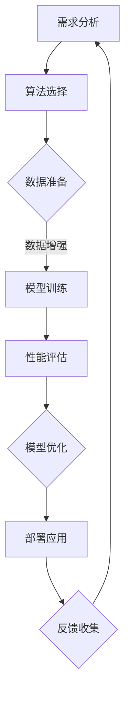
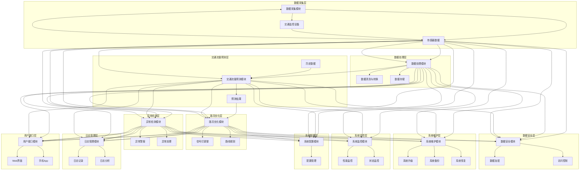
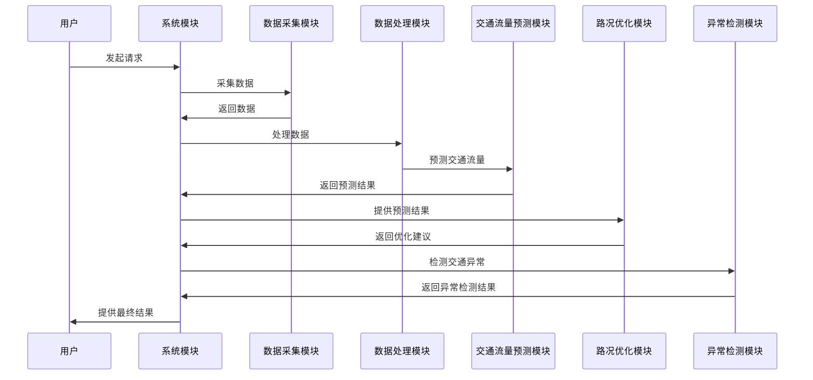

                 

### 1.1 AI模型升级的需求背景

在当前快速发展的信息技术时代，人工智能（AI）技术已经成为推动各个行业变革的重要力量。从早期的专家系统到如今的大数据、深度学习、强化学习等先进技术，AI模型在各个领域展现出强大的应用潜力。然而，随着应用场景的复杂性和多样性不断增加，对AI模型的要求也不断升级，使得AI模型的升级成为当前技术发展的一个重要需求。

**1.1.1 人工智能与AI模型概述**

人工智能，顾名思义，是指模拟、延伸和扩展人的智能的科学技术。其核心目的是使计算机系统具备类似人类的学习、推理、解决问题和决策能力。而人工智能模型，则是实现人工智能功能的核心载体，包括传统的机器学习模型、神经网络模型、深度学习模型等。这些模型通过训练和优化，能够在特定任务上达到或超越人类水平的表现。

**1.1.2 AI模型升级的现状**

目前，AI模型的应用已经渗透到金融、医疗、交通、教育、工业制造等多个领域。从早期的规则引擎到复杂的多层神经网络，AI模型的技术不断迭代升级。例如，金融领域的风险控制、医疗领域的疾病诊断、交通领域的自动驾驶等，都对AI模型提出了更高的要求。这些需求包括更高的准确率、更低的误判率、更快的响应速度等。

同时，AI模型的升级也面临诸多挑战。一方面，随着数据量的爆炸式增长，AI模型需要处理的数据量越来越大，这对模型的计算能力提出了更高的要求。另一方面，AI模型的可解释性和透明性仍然是亟待解决的问题，如何使得模型在保证高性能的同时，还能让用户理解和信任，是当前AI模型升级的重要课题。

**1.1.3 AI模型升级的未来发展趋势**

展望未来，AI模型升级将继续朝着以下几个方向发展：

1. **算法优化与模型压缩**：通过改进算法和模型结构，使得模型能够在保证性能的前提下，减小模型的规模和计算复杂度。这有助于提高模型的部署效率和适用范围。

2. **跨模态学习与多任务学习**：未来AI模型将不仅仅局限于单一任务，而是能够在多个任务之间进行知识共享和迁移。例如，图像识别和自然语言处理相结合，实现更智能化的应用场景。

3. **强化学习与人类协作**：通过引入强化学习技术，使得AI模型能够通过与人类的互动和学习，不断优化自身的行为策略。这不仅能够提高模型的智能水平，还能够增强人机协作的效率。

4. **模型的可解释性与透明性**：随着AI模型在关键领域的应用日益广泛，模型的可解释性和透明性变得越来越重要。通过改进模型结构和算法，使得模型的决策过程更加透明和可解释，从而增强用户对AI模型的信任。

总的来说，AI模型的升级是一个不断迭代和演进的过程。面对不断变化的应用需求和复杂的技术挑战，AI模型的升级不仅是一个技术问题，更是一个战略问题。只有通过持续的算法创新、技术创新和跨领域合作，才能实现AI模型的最大化价值。

### 1.2 人工智能应用现状与挑战

人工智能（AI）技术已经从理论研究走向了实际应用，覆盖了各行各业，极大地推动了社会生产力的发展。然而，AI技术的广泛应用也带来了许多新的挑战和问题。本节将探讨当前AI应用的现状以及面临的主要挑战。

**1.2.1 人工智能应用场景概述**

AI技术在众多领域都取得了显著的成果。以下是一些主要的AI应用场景：

1. **金融领域**：AI技术在金融领域有着广泛的应用，包括风险控制、市场预测、信用评分等。通过机器学习和深度学习算法，金融机构可以更加精确地评估客户信用，降低欺诈风险，优化投资策略。

2. **医疗领域**：AI技术在医疗领域中的应用日益广泛，例如，通过深度学习算法对医学图像进行分析，辅助医生进行疾病诊断；通过自然语言处理技术，分析医疗记录，提供个性化治疗方案。

3. **交通领域**：自动驾驶技术是AI在交通领域的一个重要应用。通过传感器和深度学习算法，自动驾驶车辆可以实时感知路况，做出智能决策，提高交通安全和效率。

4. **教育领域**：AI技术被用于个性化教育、智能辅导和教学评估。例如，通过分析学生的学习数据，AI可以为学生提供定制化的学习路径，提高学习效果。

5. **工业制造领域**：AI技术被应用于工业自动化、预测性维护和质量管理。通过机器学习和物联网技术，企业可以实现对生产过程的实时监控和优化，提高生产效率和质量。

**1.2.2 当前AI模型面临的挑战**

尽管AI技术在各个领域取得了显著进展，但在实际应用中仍然面临诸多挑战：

1. **数据隐私与安全**：AI模型需要大量的数据来进行训练，这往往涉及到个人隐私和数据安全的问题。如何确保数据的隐私性和安全性，是当前AI应用的一大挑战。

2. **模型解释性与透明性**：许多AI模型，尤其是深度学习模型，其决策过程缺乏透明性。这使得模型在关键领域（如医疗、金融等）的应用受到限制，用户难以理解和信任模型。

3. **计算资源与效率**：随着AI模型的复杂度增加，对计算资源的需求也不断增加。如何优化模型的计算效率，降低计算成本，是AI模型升级的重要课题。

4. **算法公平性与公正性**：AI模型在决策过程中可能会受到偏见的影响，导致不公正的结果。例如，在招聘、贷款审批等应用中，如果模型训练数据存在偏见，可能会放大原有的不公平。

5. **模型泛化能力**：AI模型往往在特定任务上表现优异，但在面对新的、未知的数据时，其性能可能会大幅下降。提高模型的泛化能力，使其能够在更广泛的应用场景中保持高性能，是当前研究的重要方向。

**1.2.3 需求驱动AI模型升级的重要性**

面对上述挑战，需求驱动AI模型升级显得尤为重要。具体来说，需求驱动AI模型升级的重要性体现在以下几个方面：

1. **满足实际应用需求**：随着AI技术不断深入各行各业，用户对AI模型的需求也在不断变化。通过需求驱动模型升级，可以确保模型能够满足不断变化的应用需求，提高实际应用价值。

2. **提高模型性能与效率**：需求驱动模型升级可以帮助优化模型的算法和结构，提高模型的性能和计算效率，降低成本。

3. **增强模型解释性与透明性**：需求驱动模型升级可以促使研究人员在模型设计时考虑解释性和透明性，提高用户对模型的信任和接受度。

4. **提升算法公平性与公正性**：通过需求驱动模型升级，可以更加深入地分析模型决策过程，发现和消除潜在的偏见，提高算法的公平性和公正性。

5. **增强模型泛化能力**：需求驱动模型升级有助于模型在更多应用场景中保持高性能，提高模型的泛化能力。

总之，需求驱动AI模型升级不仅是应对当前挑战的有效手段，更是推动AI技术持续发展的重要动力。只有通过不断的需求驱动和模型升级，AI技术才能在更广泛的领域中发挥其潜力，为社会带来更多的价值。

### 1.3 AI模型升级的策略与方法

随着人工智能（AI）技术的快速发展，AI模型的应用场景日益复杂，对模型的性能和适应性提出了更高的要求。为了满足这些需求，AI模型的升级成为不可或缺的一部分。本节将详细介绍AI模型升级的基本策略和主要方法，探讨如何有效地选择和实施这些策略。

**1.3.1 AI模型升级的基本策略**

AI模型升级的基本策略主要包括以下几个方面：

1. **性能提升策略**：这是最常见的升级策略，旨在通过改进算法和模型结构，提高模型的准确率、响应速度和计算效率。具体方法包括算法优化、模型结构改进、数据增强等。

2. **适应性升级策略**：随着应用场景的变化，模型需要具备更强的适应能力。适应性升级策略关注模型在不同环境、数据集和任务上的表现，通过引入迁移学习、元学习等技巧，提高模型的泛化能力和适应性。

3. **解释性增强策略**：许多AI模型，尤其是深度学习模型，其内部决策过程缺乏透明性，难以解释。解释性增强策略旨在提高模型的可解释性，帮助用户理解模型的决策过程，增强用户对模型的信任。

4. **安全性升级策略**：随着AI模型在关键领域的应用，其安全性变得越来越重要。安全性升级策略包括防御对抗攻击、增强模型鲁棒性等，以确保模型在复杂和不确定的环境中稳定运行。

5. **可扩展性策略**：随着数据量和任务复杂度的增加，模型需要具备良好的可扩展性。可扩展性策略通过模块化设计、分布式计算等方法，使得模型能够在不同规模和复杂度下保持高性能。

**1.3.2 AI模型升级的主要方法**

在实际操作中，AI模型升级可以采用多种方法，具体方法的选择取决于模型的类型、应用场景和升级目标。以下是一些主要的AI模型升级方法：

1. **算法优化**：通过改进现有算法的参数设置、优化搜索策略等，提高模型的性能和效率。常见的优化方法包括梯度下降算法的改进、学习率调整、正则化技术等。

2. **模型结构改进**：通过改进神经网络的结构，如增加或减少层、调整层间连接等，优化模型的表现。例如，使用深度残差网络（ResNet）解决深度神经网络中的梯度消失问题，提升模型的训练效果。

3. **数据增强**：通过增加训练数据的多样性，提高模型的泛化能力。常见的数据增强方法包括数据缩放、旋转、裁剪、颜色变换等。

4. **迁移学习**：利用已有模型的知识，对新任务进行快速适应。迁移学习通过在源任务上训练模型，然后将其应用于目标任务，减少对新数据的依赖。

5. **元学习**：通过学习如何学习，提高模型在不同任务上的适应能力。元学习关注模型如何快速适应新任务，提高模型的泛化能力和学习效率。

6. **模型压缩**：通过减少模型的参数数量和计算复杂度，提高模型的部署效率。常见的模型压缩方法包括量化、剪枝、低秩分解等。

7. **对抗训练**：通过生成对抗性样本，提高模型对异常数据和对抗性攻击的鲁棒性。对抗训练是防御对抗攻击的重要方法，有助于提升模型的安全性。

**1.3.3 升级策略的选择与实施**

选择和实施AI模型升级策略需要综合考虑多个因素，包括：

1. **需求分析**：首先，需要明确模型升级的目标和需求。不同的应用场景和任务对模型的要求不同，需要根据具体需求选择合适的升级策略。

2. **技术可行性**：评估现有技术手段和方法在目标场景中的可行性。例如，某些升级策略可能需要大量的计算资源或特定的硬件支持。

3. **成本效益分析**：评估模型升级的投入和回报。升级策略的实施需要考虑成本，包括计算资源、人力和时间等，需要确保成本效益最大化。

4. **风险评估**：分析模型升级过程中可能面临的风险，包括算法失效、数据隐私泄漏、模型解释性不足等，并制定相应的风险应对措施。

5. **持续迭代**：模型升级是一个持续迭代的过程。在实施升级策略后，需要不断监控模型的表现，根据实际情况进行调整和优化。

总之，AI模型升级是应对不断变化的应用需求和复杂技术挑战的重要手段。通过合理选择和实施升级策略，可以显著提升AI模型的表现和应用价值，推动人工智能技术的持续发展。

### 1.4 升级策略的协调与管理

AI模型升级不仅需要技术上的优化和创新，还需要有效的协调与管理策略。这些策略确保升级过程顺利进行，同时满足用户需求并提高模型的可靠性。以下是关于升级策略协调与管理的几个关键原则和步骤。

**1.4.1 升级策略的协调原则**

1. **需求驱动原则**：升级策略应以用户需求为中心，确保模型升级能够有效解决实际问题，提升用户体验和业务价值。

2. **全局优化原则**：在制定和执行升级策略时，要考虑整个系统的协调性和优化，包括数据处理、模型训练、模型部署等各个环节，确保各部分之间的高效协作。

3. **灵活性与适应性原则**：升级策略需要具备灵活性和适应性，能够根据环境变化和新的需求进行动态调整，确保模型能够持续适应复杂多变的实际应用场景。

4. **可持续性原则**：在升级过程中，要关注模型的长期性能和可靠性，避免短视的优化手段，确保模型在长期运行中能够保持高性能。

5. **风险评估与管理原则**：在升级过程中，要对潜在的风险进行充分评估，制定风险管理计划，确保在出现问题时能够及时应对，降低对系统的影响。

**1.4.2 升级策略的管理框架**

一个有效的AI模型升级管理框架应包括以下几个关键组成部分：

1. **需求分析**：明确用户需求和业务目标，为模型升级提供清晰的方向。需求分析应包括用户访谈、市场调研、数据收集和分析等步骤。

2. **技术评估**：评估现有模型的技术性能和升级潜力，包括算法、数据质量、计算资源等，为升级策略提供技术基础。

3. **计划制定**：制定详细的升级计划，包括时间表、预算、资源分配、任务分工等。计划应具备灵活性，以便在执行过程中根据实际情况进行调整。

4. **执行与监控**：按照升级计划实施具体操作，包括模型训练、测试、验证等。同时，实时监控升级过程，确保各项任务按计划进行。

5. **风险管理**：识别和评估升级过程中的潜在风险，制定风险应对措施，确保在出现问题时能够及时处理。

6. **反馈与迭代**：在模型升级完成后，收集用户反馈，对模型进行测试和评估，根据反馈结果进行迭代优化。

**1.4.3 升级策略的执行与评估**

执行升级策略时，需要遵循以下步骤：

1. **初步测试**：在正式升级前，进行小规模的初步测试，验证升级策略的有效性，并根据测试结果进行调整。

2. **逐步部署**：将升级后的模型逐步部署到生产环境中，避免一次性全面切换带来的潜在风险。逐步部署过程中，要密切关注系统性能和用户反馈。

3. **性能评估**：在模型部署后，进行详细的性能评估，包括准确率、响应速度、资源消耗等指标，确保升级后的模型满足预期目标。

4. **用户反馈**：收集用户的使用反馈，了解模型在实际应用中的表现，发现潜在问题并进行优化。

5. **持续监控**：在模型上线后，持续监控模型的运行状态，及时发现和解决问题，确保模型稳定运行。

评估升级策略的有效性需要从多个维度进行：

1. **性能指标**：通过具体的数据指标，如准确率、响应时间、资源利用率等，评估升级后的模型在性能上的提升。

2. **用户体验**：通过用户满意度调查、用户反馈等方式，评估模型升级对用户体验的影响。

3. **业务价值**：评估模型升级对业务流程的优化和业务目标的达成程度，确保升级能够带来实际的价值。

4. **成本效益**：分析模型升级的总成本和收益，确保升级策略在经济上的合理性。

总之，通过科学合理的升级策略协调与管理，可以确保AI模型在满足用户需求的同时，保持技术上的领先性和稳定性，推动人工智能技术的持续发展。

### 1.5 本章小结

本章节主要探讨了AI模型升级的需求背景、现状与未来发展趋势。首先，介绍了人工智能与AI模型的基本概念和现状，分析了AI模型升级的重要性和必要性。其次，探讨了当前AI应用中的主要挑战，包括数据隐私、模型解释性、计算资源、算法公平性等。随后，详细介绍了AI模型升级的基本策略和方法，包括性能提升、适应性升级、解释性增强、安全性升级和可扩展性策略。最后，讨论了AI模型升级的协调与管理原则，包括需求驱动、全局优化、灵活性与适应性、可持续性和风险评估与管理。通过科学合理的升级策略协调与管理，可以确保AI模型在满足用户需求的同时，保持技术上的领先性和稳定性。未来，随着技术的不断进步和应用需求的多样化，AI模型升级将继续成为推动人工智能技术发展的重要动力。

### 2.1 需求分析

需求分析是软件开发和AI模型设计过程中至关重要的一环。它不仅是确定系统功能的基础，更是确保系统最终能够满足用户需求的前提。本节将详细介绍需求分析的过程、方法和工具，帮助读者更好地理解需求分析的内涵和实践。

**2.1.1 需求分析概述**

需求分析（Requirement Analysis）是指在软件开发项目开始前，对系统需要实现的功能、性能、用户界面、数据处理等方面进行全面分析的过程。其主要目标是明确系统必须满足的条件，即“做什么”的问题。需求分析的成果是需求规格说明书（Requirement Specification Document），它是后续设计、开发和测试的依据。

**2.1.2 需求分析的过程**

需求分析通常分为以下几个阶段：

1. **项目启动与调研**：在这个阶段，项目团队与客户、利益相关者进行沟通，了解项目背景、目标和需求。通过访谈、问卷调查、市场调研等方法，收集初步需求信息。

2. **需求收集**：项目团队通过用户访谈、问卷调查、观察用户行为等手段，收集用户的具体需求。这一阶段要确保全面、准确地理解用户的需求，包括功能需求、性能需求、安全需求等。

3. **需求整理**：在收集到大量需求后，项目团队需要对这些需求进行整理、分类和优先级排序。常用的需求整理工具有需求池（Requirement Pool）、需求矩阵（Requirement Matrix）等。

4. **需求验证**：需求验证是确保需求规格说明书准确、完整、一致和可验证的过程。项目团队需要与客户、利益相关者进行反复讨论和确认，确保所有需求都得到满足。

5. **需求文档编写**：需求规格说明书是需求分析的核心成果，它应包含需求概述、功能需求、非功能需求、用户界面设计、数据管理等内容。

**2.1.3 需求分析工具与技术**

1. **用户访谈**：通过面对面交流，深入了解用户的需求和期望，是需求收集的重要方法。

2. **问卷调查**：问卷调查是一种高效的需求收集方式，适用于大量用户群体的需求调查。

3. **观察法**：通过观察用户在实际工作中的操作流程，可以更准确地了解用户的需求和痛点。

4. **文档审查**：审查项目相关的文档，如业务流程图、技术文档等，可以帮助识别潜在的需求。

5. **原型设计**：通过创建系统原型，让用户直观地体验系统功能，从而反馈和优化需求。

6. **用例图（Use Case Diagram）**：用例图是一种需求分析工具，用于描述系统的功能需求。它展示了系统与用户之间的交互关系。

7. **需求矩阵（Requirement Matrix）**：需求矩阵用于整理和比较不同需求之间的关系，确保需求的完整性和一致性。

8. **需求规格说明书**：需求规格说明书是需求分析的核心文档，详细描述了系统的需求，包括功能需求、非功能需求、性能需求等。

**2.1.4 需求分析实例**

假设我们需要开发一个在线教育平台，以下是一个简单的需求分析实例：

1. **需求收集**：
   - 用户需求：
     - 注册和登录功能
     - 搜索和浏览课程功能
     - 付费和购买课程功能
     - 视频播放和学习进度跟踪功能
     - 作业提交和评分功能
     - 用户反馈和评价功能
   - 非功能需求：
     - 高可用性和可靠性
     - 良好的用户体验
     - 数据安全与隐私保护

2. **需求整理**：
   - 功能需求：
     - 用户管理：包括用户注册、登录、个人信息管理、权限设置等。
     - 课程管理：包括课程发布、课程分类、课程搜索、课程播放等。
     - 交易管理：包括课程购买、支付、订单管理、评价等。
     - 学习管理：包括学习进度跟踪、作业提交、评分等。
     - 反馈管理：包括用户反馈、课程评价等。

3. **需求验证**：
   - 通过与用户、讲师和利益相关者的沟通，确认上述需求的准确性和可行性。

4. **需求文档编写**：
   - 编写详细的需求规格说明书，包括功能需求和非功能需求的描述。

通过上述实例，我们可以看到需求分析的重要性和具体实施步骤。只有在充分理解用户需求的基础上，才能设计出符合用户期望的AI模型和系统。

### 2.2 AI模型升级原理

AI模型升级是指通过改进算法、优化模型结构、引入新的训练数据等手段，提升模型在特定任务上的性能和适应性。理解AI模型升级的原理，有助于我们在实际项目中有效地进行模型升级。以下是AI模型升级的核心原理、关键步骤和涉及的数学模型。

**2.2.1 AI模型升级的核心原理**

AI模型升级的核心原理主要包括以下几点：

1. **算法优化**：通过改进现有算法，如优化学习率、调整正则化参数等，提升模型的收敛速度和准确性。

2. **模型结构优化**：通过改进神经网络结构，如增加层数、调整层间连接等，提升模型的表达能力和泛化能力。

3. **数据增强**：通过增加训练数据的多样性，提高模型的泛化能力和鲁棒性。

4. **迁移学习**：利用已有模型的知识，对新任务进行快速适应，减少对新数据的依赖。

5. **元学习**：通过学习如何学习，提高模型在不同任务上的适应能力，提升模型的泛化能力和学习效率。

**2.2.2 AI模型升级的关键步骤**

AI模型升级通常包括以下几个关键步骤：

1. **需求分析**：明确模型升级的目标和需求，包括性能提升、适应新任务、增强解释性等。

2. **技术评估**：评估现有模型的技术性能和升级潜力，包括算法、数据质量、计算资源等。

3. **方案设计**：根据需求和技术评估结果，设计具体的升级方案，包括算法优化、模型结构改进、数据增强等。

4. **模型训练**：对升级后的模型进行训练，调整参数，优化模型性能。

5. **性能评估**：评估升级后模型的性能，包括准确率、响应速度、资源消耗等。

6. **迭代优化**：根据性能评估结果，对模型进行迭代优化，直到满足预期目标。

**2.2.3 AI模型升级的数学模型**

在AI模型升级过程中，常用的数学模型包括损失函数、梯度下降算法等。

1. **损失函数**：损失函数（Loss Function）是衡量模型预测值与真实值之间差距的指标。常见的损失函数包括均方误差（MSE）、交叉熵损失（Cross Entropy Loss）等。在模型升级过程中，通过优化损失函数，可以提升模型性能。

   $$ 
   Loss = \frac{1}{n} \sum_{i=1}^{n} (y_i - \hat{y}_i)^2 
   $$

   其中，$y_i$为真实值，$\hat{y}_i$为预测值，$n$为样本数量。

2. **梯度下降算法**：梯度下降（Gradient Descent）是一种优化算法，用于调整模型参数，使其在损失函数的梯度方向上不断下降，从而找到损失函数的最小值。常见的梯度下降算法包括随机梯度下降（SGD）、批量梯度下降（BGD）和小批量梯度下降（MBGD）等。

   $$ 
   \theta_{t+1} = \theta_t - \alpha \cdot \nabla Loss(\theta_t) 
   $$

   其中，$\theta_t$为第$t$次迭代的模型参数，$\alpha$为学习率，$\nabla Loss(\theta_t)$为损失函数在$\theta_t$处的梯度。

3. **正则化**：正则化（Regularization）是一种防止模型过拟合的技术。常见的正则化方法包括L1正则化、L2正则化等。正则化通过在损失函数中添加正则化项，限制模型参数的绝对值或平方值，从而降低模型的复杂度。

   $$ 
   Loss_{regularized} = Loss + \lambda \cdot ||\theta|| 
   $$

   其中，$||\theta||$为模型参数的L1或L2范数，$\lambda$为正则化参数。

通过理解这些数学模型，我们可以更好地进行AI模型升级，提升模型在特定任务上的性能和适应性。

### 2.3 需求与AI模型升级的联系

在人工智能（AI）领域，需求与AI模型升级之间存在密切的联系。理解这两者之间的相互作用对于确保AI系统能够持续满足用户需求、保持技术前沿性和高效性至关重要。本节将详细探讨需求对AI模型升级的影响，以及AI模型升级对需求满足的作用，并分析需求与AI模型升级的相互作用。

**2.3.1 需求对AI模型升级的影响**

1. **需求驱动的模型升级**：需求是AI模型升级的源动力。用户需求的变化直接影响了AI模型的设计和优化方向。例如，随着用户对实时性、准确性和个性化服务的要求不断提高，AI模型需要不断进行升级，以满足这些需求。

   - **实时性需求**：在金融交易、智能交通等实时性要求高的领域，AI模型需要具备快速响应的能力。为此，模型需要优化算法、提升计算效率和降低延迟。
   
   - **准确性需求**：在医疗诊断、风险管理等领域，AI模型需要具有高度的准确性。这要求模型在训练过程中使用高质量的数据集，并采用更复杂的算法来提高模型的预测能力。

   - **个性化服务需求**：随着用户对定制化服务的需求增加，AI模型需要具备更强的自适应能力，根据用户的历史行为和偏好进行个性化推荐和决策。

2. **需求变化的动态性**：用户需求是不断变化的，这种动态性要求AI模型能够快速适应新的需求。例如，新技术的出现、市场竞争的加剧、用户行为模式的改变等都可能导致需求的变化。为了应对这些变化，AI模型需要具备灵活的升级机制，能够快速调整和优化。

**2.3.2 AI模型升级对需求满足的作用**

1. **提升模型性能**：通过升级AI模型，可以提高模型在特定任务上的性能，从而更好地满足用户需求。例如，通过算法优化、模型结构改进和增强数据集，可以提升模型的准确率、响应速度和计算效率。

   - **算法优化**：通过改进算法，如使用更高效的梯度下降方法、引入正则化技术等，可以提高模型的训练效率和准确性。
   
   - **模型结构改进**：通过改进神经网络结构，如增加层、使用深度残差网络（ResNet）等，可以提高模型的泛化能力和表达能力。

   - **数据增强**：通过增加训练数据的多样性，如数据扩充、生成对抗网络（GAN）等，可以提高模型的鲁棒性和泛化能力。

2. **增强用户体验**：AI模型的升级有助于提升用户体验，满足用户对个性化、实时性、便捷性的需求。例如，通过改进推荐算法、优化用户界面、提升响应速度等，可以提升用户的满意度。

3. **提高业务价值**：AI模型升级有助于提升业务流程的效率，降低成本，提高业务决策的准确性。例如，在金融领域的风险管理、医疗领域的疾病诊断等应用中，模型升级可以显著提升业务决策的准确性和效率，从而增加企业的竞争力。

**2.3.3 需求与AI模型升级的相互作用**

1. **需求引导模型升级**：用户需求的变化直接影响了AI模型的设计和优化方向。在需求驱动的开发模式中，需求分析是模型设计和升级的起点，需求的变化决定了模型升级的需求和方向。

2. **模型升级影响需求满足**：AI模型的升级不仅能够提升模型的性能，还可以影响用户需求的满足程度。有效的模型升级可以显著提升用户体验和业务价值，从而更好地满足用户需求。

3. **迭代优化过程**：需求与AI模型升级之间是动态的相互作用关系。随着用户需求的不断变化和AI技术的不断进步，模型升级是一个持续迭代的过程。通过不断的需求分析和模型升级，可以实现需求的持续满足和技术的持续进步。

总的来说，需求与AI模型升级之间的相互作用是一个复杂的动态过程。只有通过深入的需求分析和持续的模型升级，才能确保AI模型能够持续满足用户需求、保持技术领先性和高效性，为企业和用户创造更大的价值。

### 2.4 核心概念属性特征对比

为了更清晰地理解需求与AI模型升级之间的联系，我们需要对核心概念进行详细阐述，并对比它们的属性特征。以下是需求与AI模型升级的核心概念、属性特征对比表格和ER实体关系图架构。

**2.4.1 需求与AI模型升级的核心概念**

1. **需求**：需求是指用户或系统在特定环境下期望得到的功能或服务。需求可以分为功能需求和非功能需求。功能需求描述系统能做什么，如注册、支付、搜索等；非功能需求描述系统的性能要求，如响应时间、准确性、安全性等。

2. **AI模型升级**：AI模型升级是指通过改进算法、优化模型结构、引入新的训练数据等手段，提升模型在特定任务上的性能和适应性。AI模型升级的主要目的是提高模型的准确性、响应速度和泛化能力，以满足不断变化的需求。

**2.4.2 核心概念属性特征对比表格**

| 核心概念 | 属性特征 | 描述 |
| --- | --- | --- |
| 需求 | 功能性 | 描述系统应完成的具体任务 |
| 需求 | 非功能性 | 描述系统的性能、可靠性和用户满意度等 |
| AI模型升级 | 算法改进 | 通过改进现有算法提升模型性能 |
| AI模型升级 | 模型优化 | 通过改进模型结构提升模型泛化能力 |
| AI模型升级 | 数据增强 | 通过增加训练数据多样性提升模型鲁棒性 |
| AI模型升级 | 迁移学习 | 利用已有模型知识加速新任务适应 |

**2.4.3 ER实体关系图架构**

以下是需求与AI模型升级的ER实体关系图架构，用于描述这两个核心概念之间的关联和关系。

```mermaid
erDiagram
    User ..|> Requirement
    User ..|> AIModelUpgrade

    Requirement ||--|{ FunctionalRequirement }
    Requirement ||--|{ NonFunctionalRequirement }

    AIModelUpgrade ||--|{ AlgorithmImprovement }
    AIModelUpgrade ||--|{ ModelOptimization }
    AIModelUpgrade ||--|{ DataAugmentation }
    AIModelUpgrade ||--|{ TransferLearning }
```

1. **用户（User）**：用户是提出需求的主要角色，其与需求之间存在关联关系。用户可以提出功能性和非功能性需求，这些需求通过关联关系与AI模型升级相连接。

2. **需求（Requirement）**：需求分为功能性需求和非功能性需求，功能性需求描述系统应完成的具体任务，非功能性需求描述系统的性能、可靠性和用户满意度等。

3. **AI模型升级（AIModelUpgrade）**：AI模型升级包括算法改进、模型优化、数据增强、迁移学习等多个方面。每个方面都与需求紧密相关，通过不同的升级手段提升模型性能，满足用户需求。

通过上述核心概念、属性特征对比表格和ER实体关系图架构，我们可以更全面地理解需求与AI模型升级之间的关系，为后续的模型设计和优化提供理论基础。

### 2.5 ER实体关系图架构

为了更清晰地展示需求与AI模型升级之间的实体关系，我们可以通过ER（实体关系）图来构建这种关系。ER图是一种用于描述实体及其之间关系的图形化方法，适用于数据库设计和系统分析。以下是需求与AI模型升级的ER图，详细描述了各实体及其关联关系。

**2.5.1 ER图概述**

ER图由以下基本元素组成：

- **实体（Entity）**：代表系统中具有独立存在意义的对象，如用户、需求、AI模型升级等。
- **属性（Attribute）**：代表实体的特性，如用户的姓名、需求的描述、模型升级的时间等。
- **关系（Relationship）**：代表实体之间的关联，如用户提出需求、AI模型升级满足需求等。

**2.5.2 需求与AI模型升级的ER图构建**

以下是需求与AI模型升级的ER图示例：

```mermaid
erDiagram
    User ||--|{ Requirement } : 提出需求
    Requirement ||--|{ AIModelUpgrade } : 满足需求

    User {
        ID : 用户ID
        Name : 用户姓名
        Email : 邮箱
    }

    Requirement {
        ID : 需求ID
        Description : 需求描述
        Status : 需求状态
    }

    AIModelUpgrade {
        ID : 升级ID
        UpgradeType : 升级类型
        StartTime : 开始时间
        EndTime : 结束时间
    }
```

在这个ER图中：

1. **用户（User）**：用户是提出需求的实体，具有独立的实体属性，如用户ID、姓名、邮箱等。

2. **需求（Requirement）**：需求是用户提出的具体需求，具有需求ID、描述、状态等属性。

3. **AI模型升级（AIModelUpgrade）**：AI模型升级是用于满足需求的实体，具有升级ID、升级类型、开始时间和结束时间等属性。

4. **关系**：用户与需求之间是“提出需求”的关系，需求与AI模型升级之间是“满足需求”的关系。这些关系描述了需求从提出到满足的过程。

**2.5.3 ER图在需求与AI模型升级中的应用**

ER图在需求与AI模型升级中的应用主要体现在以下几个方面：

1. **需求管理**：通过ER图可以清晰地描述用户提出的需求，包括需求的状态、优先级等，便于需求的管理和跟踪。

2. **模型升级规划**：ER图帮助规划AI模型升级的过程，包括升级的类型、时间安排等，确保模型升级能够满足用户需求。

3. **系统设计**：在系统设计阶段，ER图提供了实体和关系的结构化描述，有助于系统分析师和开发人员理解系统的整体架构。

4. **数据库设计**：ER图是数据库设计的基础，通过ER图可以生成数据库的模式，为数据存储和管理提供依据。

通过构建和解析需求与AI模型升级的ER图，我们不仅能够更好地理解两者之间的关联，还能够为系统的设计和实现提供有力的支持。ER图作为一种直观、结构化的方法，有助于提高需求管理和AI模型升级的效率和质量。

### 2.6 本章小结

本章重点探讨了需求分析与AI模型升级原理，详细介绍了需求分析的定义、过程和工具，以及需求驱动AI模型升级的重要性。首先，通过概述需求分析的过程和方法，包括项目启动与调研、需求收集、需求整理、需求验证和需求文档编写，帮助读者理解需求分析的核心内容和实践步骤。接着，深入探讨了AI模型升级的核心原理和关键步骤，包括需求分析、技术评估、方案设计、模型训练、性能评估和迭代优化，并介绍了相关的数学模型，如损失函数和梯度下降算法。本章还通过实例说明了需求分析与AI模型升级的实际应用，强调了两者之间的相互作用和重要性。通过本章的学习，读者可以更好地理解需求分析与AI模型升级的核心概念和方法，为后续的模型设计和优化打下坚实基础。

### 3.1 AI模型升级算法概述

AI模型升级的核心在于通过算法改进和优化，提升模型在特定任务上的性能和适应性。本节将介绍AI模型升级算法的分类、选择依据和发展趋势，帮助读者了解AI模型升级的多样性和动态性。

**3.1.1 AI模型升级算法的分类**

AI模型升级算法可以从不同的角度进行分类，常见的分类方法包括：

1. **基于算法优化的升级算法**：这类算法主要通过改进现有算法的参数设置、优化搜索策略等，提高模型的性能和效率。具体方法包括：
   - **学习率调整**：通过动态调整学习率，优化模型训练过程。
   - **正则化技术**：使用L1、L2正则化等手段防止模型过拟合。
   - **梯度提升算法**：如Adaboost、XGBoost等，通过迭代优化模型参数。

2. **基于模型结构的升级算法**：这类算法通过改进神经网络结构，如增加层数、调整层间连接等，提升模型的表达能力和泛化能力。常见的方法包括：
   - **深度残差网络（ResNet）**：通过引入残差连接解决深度神经网络中的梯度消失问题。
   - **注意力机制**：通过引入注意力模块，增强模型对重要特征的处理能力。
   - **图神经网络（GNN）**：通过引入图结构，处理具有图属性的数据。

3. **基于数据的升级算法**：这类算法通过增加训练数据多样性、引入数据增强方法等，提高模型的泛化能力和鲁棒性。常见的方法包括：
   - **数据增强**：通过数据缩放、旋转、裁剪、颜色变换等手段，增加训练数据的多样性。
   - **迁移学习**：利用已有模型的知识，对新任务进行快速适应，减少对新数据的依赖。
   - **元学习**：通过学习如何学习，提高模型在不同任务上的适应能力。

**3.1.2 AI模型升级算法的选择依据**

选择合适的AI模型升级算法需要考虑多个因素，包括：

1. **任务类型**：不同类型的任务对算法的要求不同。例如，对于分类任务，可以选择分类算法；对于回归任务，可以选择回归算法。

2. **数据特性**：数据的特点（如数据量、数据分布、噪声水平等）直接影响算法的选择。例如，对于大数据集，可以选择并行训练算法；对于分布不均的数据，可以选择鲁棒性更强的算法。

3. **计算资源**：算法的复杂度和计算资源需求是选择算法的重要依据。例如，对于资源受限的场景，可以选择计算效率更高的算法。

4. **性能要求**：根据性能要求（如准确性、响应速度等）选择合适的算法。例如，对于需要高精度的任务，可以选择复杂的深度学习算法；对于实时性要求高的任务，可以选择简化版的算法。

5. **应用场景**：不同的应用场景对算法的需求不同。例如，在医疗领域，算法的可解释性是一个重要的考虑因素；在工业领域，算法的稳定性和可靠性至关重要。

**3.1.3 AI模型升级算法的发展趋势**

随着人工智能技术的不断发展，AI模型升级算法也在不断进步。以下是一些AI模型升级算法的发展趋势：

1. **跨模态学习**：未来AI模型升级将更加注重跨模态学习，即能够在不同数据模态（如图像、文本、音频）之间进行知识和信息共享。例如，通过视觉和语言模型的融合，实现更加智能的图像理解和自然语言处理。

2. **强化学习**：强化学习在AI模型升级中的应用将越来越广泛。通过引入强化学习，AI模型可以与用户和环境进行交互，不断优化自身的行为策略，提高模型的智能水平。

3. **可解释性与透明性**：随着AI模型在关键领域的应用，模型的可解释性和透明性变得尤为重要。未来的升级算法将更加注重模型决策过程的可解释性，提高用户对模型的信任。

4. **模型压缩与效率优化**：为了提高模型的部署效率，模型压缩与效率优化将成为重要的研究方向。通过改进算法和模型结构，使得模型在保证性能的前提下，减小模型规模和计算复杂度。

5. **自适应学习**：自适应学习算法将能够在动态变化的环境中，自动调整模型参数，提高模型在不同场景下的适应能力。

总的来说，AI模型升级算法的发展将朝着多样化、智能化和高效化的方向不断前进，以满足不断变化的应用需求和复杂的技术挑战。通过合理的算法选择和优化，AI模型将能够在更多领域发挥其潜力，推动人工智能技术的持续发展。

### 3.2 算法原理讲解

在AI模型升级过程中，算法原理的讲解至关重要。通过深入理解算法的原理，我们可以更好地优化和改进模型，从而提升其在特定任务上的性能。本节将详细介绍AI模型升级算法的原理，并使用mermaid流程图、Python代码和数学模型进行详细说明，以确保读者能够全面掌握这些核心概念。

**3.2.1 算法原理讲解的mermaid流程图**

首先，我们可以使用mermaid流程图来描述AI模型升级的基本流程。以下是一个简单的mermaid流程图示例：



在这个mermaid流程图中，每个节点表示一个步骤，箭头表示步骤之间的依赖关系。以下是各步骤的详细描述：

1. **需求分析**：确定AI模型升级的目标和需求，包括性能提升、适应新任务等。
2. **算法选择**：根据任务类型和数据特性选择合适的算法。
3. **数据准备**：包括数据清洗、数据增强等，以提高模型的泛化能力。
4. **模型训练**：使用训练数据对模型进行训练，优化模型参数。
5. **性能评估**：评估训练后的模型在测试数据上的性能，包括准确率、响应速度等。
6. **模型优化**：根据性能评估结果，对模型进行优化，如调整学习率、改进网络结构等。
7. **部署应用**：将优化后的模型部署到生产环境中，供实际使用。
8. **反馈收集**：收集用户反馈，用于进一步优化模型。

**3.2.2 Python代码实现与算法原理阐述**

为了更好地理解算法原理，我们将使用Python代码实现一个简单的AI模型训练过程。以下是Python代码示例：

```python
import numpy as np
from sklearn.linear_model import SGDClassifier
from sklearn.metrics import accuracy_score

# 假设我们有以下训练数据
X_train = [[1, 2], [2, 3], [3, 4]]
y_train = [0, 1, 1]

# 使用SGDClassifier进行模型训练
model = SGDClassifier()
model.fit(X_train, y_train)

# 测试数据
X_test = [[4, 5]]
y_test = [0]

# 进行预测
predictions = model.predict(X_test)

# 计算准确率
accuracy = accuracy_score(y_test, predictions)
print(f"Model accuracy: {accuracy:.2f}")
```

在这个示例中，我们使用了scikit-learn库中的SGDClassifier进行模型训练和预测。以下是代码的实现细节：

1. **数据准备**：我们假设有一组训练数据`X_train`和标签`y_train`。
2. **模型训练**：使用SGDClassifier训练模型，该模型是一种基于梯度下降的线性分类器。
3. **性能评估**：通过计算测试数据的准确率，评估模型性能。
4. **预测**：使用训练好的模型对测试数据进行预测。

**3.2.3 算法原理的数学模型与公式讲解**

为了深入理解SGDClassifier的工作原理，我们需要了解其背后的数学模型。以下是SGDClassifier的基本数学模型：

$$
\theta_{t+1} = \theta_t - \alpha \cdot \nabla Loss(\theta_t)
$$

其中：

- $\theta_t$：第$t$次迭代的模型参数。
- $\alpha$：学习率，控制每次迭代的步长。
- $\nabla Loss(\theta_t)$：损失函数在$\theta_t$处的梯度。

在SGDClassifier中，损失函数通常为 hinge loss，其公式为：

$$
Loss(\theta) = \max(0, 1 - \theta^T x y)
$$

其中，$\theta^T x y$为模型预测值与真实标签之间的差值。学习过程中，模型参数$\theta$将不断调整，以最小化损失函数。

通过上述Python代码和数学模型讲解，我们可以更清晰地理解AI模型升级的基本原理和实现方法。在实际应用中，我们可以根据具体需求和数据特性，选择合适的算法和优化策略，提升模型的性能和适应性。

### 3.3 算法举例说明

为了更好地理解AI模型升级算法的实际应用，我们将通过一个具体的案例进行详细说明。本案例将展示如何使用迁移学习（Transfer Learning）来提升模型在图像分类任务上的性能，并使用Python代码进行实际演示。

**3.3.1 算法原理的实际应用案例**

迁移学习是一种利用已有模型（通常称为基础模型）的知识来提升新任务性能的技术。基础模型在特定领域或任务上经过大量训练，已经积累了丰富的知识和经验。通过迁移学习，我们可以将基础模型的部分或全部知识应用到新任务上，从而减少对新数据的依赖，提高模型在新任务上的性能。

在本案例中，我们将使用预训练的卷积神经网络（CNN）模型来分类新的图像数据。这些预训练模型通常在大型图像数据集（如ImageNet）上进行了训练，已经具有了强大的特征提取能力。通过迁移学习，我们将这些预训练模型应用于一个新的图像分类任务，例如动物分类。

**3.3.2 算法举例的代码演示**

以下是使用迁移学习进行图像分类的Python代码示例：

```python
import tensorflow as tf
from tensorflow.keras.applications import VGG16
from tensorflow.keras.preprocessing.image import ImageDataGenerator
from tensorflow.keras.models import Model
from tensorflow.keras.layers import Dense, Flatten, Dropout
from tensorflow.keras.optimizers import Adam

# 加载预训练的VGG16模型，不包括最后一层全连接层
base_model = VGG16(weights='imagenet', include_top=False, input_shape=(224, 224, 3))

# 在base_model的基础上添加新层的模型结构
x = base_model.output
x = Flatten()(x)
x = Dense(1024, activation='relu')(x)
x = Dropout(0.5)(x)
predictions = Dense(num_classes, activation='softmax')(x)

model = Model(inputs=base_model.input, outputs=predictions)

# 编译模型
model.compile(optimizer=Adam(learning_rate=0.0001), loss='categorical_crossentropy', metrics=['accuracy'])

# 数据预处理
train_datagen = ImageDataGenerator(rescale=1./255, shear_range=0.2, zoom_range=0.2, horizontal_flip=True)
test_datagen = ImageDataGenerator(rescale=1./255)

train_generator = train_datagen.flow_from_directory(train_data_dir, target_size=(224, 224), batch_size=32, class_mode='categorical')
validation_generator = test_datagen.flow_from_directory(validation_data_dir, target_size=(224, 224), batch_size=32, class_mode='categorical')

# 训练模型
model.fit(train_generator, epochs=10, validation_data=validation_generator)

# 评估模型
test_loss, test_acc = model.evaluate(validation_generator)
print(f"Validation accuracy: {test_acc:.2f}")
```

**代码解析**：

1. **加载预训练模型**：我们使用VGG16模型，该模型是一个深度卷积神经网络，已在ImageNet数据集上进行了预训练。通过设置`include_top=False`和`weights='imagenet'`，我们只加载了模型的卷积层，不包括最后一层的全连接层。

2. **构建新模型**：我们在基础模型上添加了新的全连接层和Dropout层，以适应新的图像分类任务。最后，我们添加了一个输出层，用于分类。

3. **数据预处理**：使用ImageDataGenerator进行数据增强，包括缩放、剪裁、翻转等，以提高模型的泛化能力。

4. **编译模型**：使用Adam优化器和交叉熵损失函数编译模型。

5. **训练模型**：使用训练数据集对模型进行训练。

6. **评估模型**：使用验证数据集评估模型的性能。

**3.3.3 举例说明中的数学模型与公式应用**

迁移学习主要利用了卷积神经网络中的卷积层，这些层可以提取图像的底层特征，如边缘、纹理等。在迁移学习中，这些特征被用于新的分类任务，而不需要重新训练卷积层。以下是一些关键数学模型和公式：

- **卷积操作**：卷积层通过卷积操作提取图像特征，其公式为：

  $$
  \text{convolution}(I, K) = \sum_{i=1}^{C} \sum_{j=1}^{H} \sum_{k=1}^{W} I_{ij} \cdot K_{ijk}
  $$

  其中，$I$是输入图像，$K$是卷积核，$C$是通道数，$H$和$W$分别是卷积核的高度和宽度。

- **激活函数**：卷积层通常使用ReLU激活函数，其公式为：

  $$
  \text{ReLU}(x) = \max(0, x)
  $$

- **全连接层**：在卷积层的输出通过全连接层进行分类，其公式为：

  $$
  \text{output} = \text{weights} \cdot \text{input} + \text{bias}
  $$

  通过应用softmax函数，我们可以得到概率分布：

  $$
  P(y=i) = \frac{e^{\text{output}_i}}{\sum_{j} e^{\text{output}_j}}
  $$

通过上述Python代码和数学模型讲解，我们可以更好地理解迁移学习在实际图像分类任务中的应用。迁移学习通过利用预训练模型的知识，显著提高了新任务上的性能，减少了训练时间，这是AI模型升级中的一个重要方向。

### 3.4 本章小结

本章详细介绍了AI模型升级算法的原理、mermaid流程图、Python代码实现和实际应用案例。通过理解算法原理，我们能够更好地优化和改进模型，提升其性能和适应性。首先，通过mermaid流程图展示了模型升级的基本步骤，包括需求分析、算法选择、数据准备、模型训练、性能评估等。接着，通过Python代码示例展示了SGDClassifier的实现细节和迁移学习在图像分类任务中的应用。通过这些讲解和示例，读者可以深入理解AI模型升级的核心概念和方法，为后续的模型设计和优化提供理论基础。这些知识和技能在实际应用中，将有助于开发出更加高效和可靠的AI模型。

### 4.1 问题场景介绍

在当前的IT领域，随着人工智能（AI）技术的迅速发展和广泛应用，AI模型在各个行业中的重要性日益增加。然而，在实际应用中，AI模型往往面临着复杂的问题场景和多样化的需求，这对模型的性能、可靠性以及可维护性提出了更高的要求。为了更好地理解AI模型升级的系统架构设计，我们将首先介绍一个典型的问题场景，分析其面临的挑战和需求，为后续的系统设计与实现奠定基础。

**4.1.1 问题场景概述**

假设我们面临的是一个智能交通管理系统，其主要目标是提高城市交通效率，减少交通拥堵，提升道路安全和用户体验。具体来说，这个系统需要实时监控和分析城市交通流量，提供实时的交通信息、路况预测和优化建议。

这个问题场景涉及到以下关键需求：

1. **实时监控与数据采集**：系统需要从各种交通传感器、摄像头、GPS数据等渠道实时采集交通数据，包括车辆速度、密度、方向等信息。

2. **交通流量分析与预测**：系统需要利用收集到的交通数据进行实时分析和预测，预测未来一段时间内的交通流量变化，为交通管理提供决策支持。

3. **路况优化与建议**：系统需要根据交通流量预测结果，提供优化建议，如交通信号灯的调整、路线规划等，以减少交通拥堵，提升道路通行效率。

4. **异常检测与处理**：系统需要具备异常检测能力，能够识别和响应突发情况，如交通事故、道路施工等，确保交通系统的稳定运行。

5. **数据安全与隐私保护**：在收集和处理大量交通数据的同时，系统需要确保数据的安全和隐私，防止数据泄露和滥用。

**4.1.2 问题的挑战与需求**

针对上述问题场景，AI模型在实现过程中面临以下挑战和需求：

1. **数据质量与多样性**：交通数据质量直接影响到模型的性能和预测准确性。数据可能存在噪声、缺失值和异常值，需要通过数据预处理技术来提高数据质量。同时，不同类型的数据（如图像、传感器数据、GPS数据）需要统一处理和融合，以提供更全面的交通分析。

2. **计算资源与效率**：实时处理大量的交通数据需要强大的计算资源。系统需要设计高效的算法和数据结构，以降低计算复杂度和延迟，确保实时性。

3. **模型性能与泛化能力**：AI模型需要具备高准确性和泛化能力，能够适应不同的交通场景和变化。这要求模型在训练过程中使用多样化的数据集，并采用先进的算法和技术，如迁移学习、强化学习等。

4. **可解释性与透明性**：交通管理系统的决策过程需要具备高透明性，以便用户和管理人员理解模型的决策依据。系统需要提供模型的可解释性工具，帮助用户理解模型的预测和优化建议。

5. **系统集成与协同**：交通管理系统通常涉及多个子系统（如交通监控、信号灯控制、路线规划等），需要设计良好的系统集成方案，确保各子系统之间的高效协同和数据共享。

6. **实时响应与异常处理**：系统需要具备快速响应能力，能够在发生异常情况时及时调整策略和处理问题。这要求模型能够实时监控交通状态，并快速生成优化建议。

7. **数据安全与隐私保护**：在处理大量交通数据时，系统需要确保数据的安全和隐私。这包括数据加密、访问控制、匿名化等技术，以防止数据泄露和滥用。

通过上述问题场景的介绍，我们可以看到，AI模型在智能交通管理系统中的升级和优化面临诸多挑战和需求。理解这些挑战和需求，有助于我们在后续章节中设计出高效的系统架构，实现稳定可靠的交通管理系统。

### 4.2 项目介绍

为了深入探讨AI模型升级在实际项目中的应用，我们将以一个智能交通管理系统的项目为例，详细阐述项目的背景、目标和预期成果。通过这个项目，我们将展示AI模型升级的全过程，从需求分析、系统设计到模型训练、性能评估和部署应用，全面介绍项目实施的具体步骤和关键技术。

**4.2.1 项目背景**

随着城市化进程的加快和机动车数量的激增，城市交通问题日益严重。交通拥堵、交通事故频发，不仅影响了居民的出行体验，还对城市经济和社会发展产生了负面影响。为了缓解这些问题，许多城市开始积极探索智能交通管理系统的建设，利用人工智能技术提高交通管理效率和安全性。

我们的项目旨在开发一个智能交通管理系统，通过实时监控和分析城市交通数据，提供交通流量预测、路况优化和异常检测等服务，从而改善交通状况，提高道路通行效率。

**4.2.2 项目目标**

本项目的主要目标包括：

1. **实时交通流量预测**：利用AI模型，对实时交通数据进行预测，提供未来一段时间内的交通流量变化趋势，为交通管理提供决策支持。

2. **智能路况优化**：基于交通流量预测结果，提供路况优化建议，如调整交通信号灯时长、优化路线规划等，以减少交通拥堵，提升道路通行效率。

3. **交通异常检测与处理**：通过实时监控交通数据，检测和识别异常情况，如交通事故、道路施工等，并及时发出警报，确保交通系统的稳定运行。

4. **数据安全与隐私保护**：在数据处理和传输过程中，确保数据的安全性和隐私性，防止数据泄露和滥用。

5. **系统可扩展性与高可用性**：设计灵活的系统架构，确保系统能够应对不断变化的需求和大规模数据量，具备高可用性和容错能力。

**4.2.3 项目成果**

通过本项目的实施，我们预期达到以下成果：

1. **提高交通管理效率**：通过实时交通流量预测和路况优化，有效缓解交通拥堵，提高道路通行效率。

2. **提升交通安全性**：通过实时监控和异常检测，及时发现和处理交通事故等异常情况，提高交通安全性。

3. **提供个性化的交通服务**：基于用户的历史出行数据和实时交通信息，为用户提供个性化的交通建议，提高出行体验。

4. **积累丰富的交通数据**：通过系统运行积累大量交通数据，为后续研究和优化提供宝贵的数据资源。

5. **树立行业标杆**：通过项目实施，树立智能交通管理系统的行业标杆，推动相关技术的发展和应用。

**4.2.4 项目成果评估**

项目成果的评估将从以下几个方面进行：

1. **性能评估**：通过交通流量预测的准确性、路况优化的效果等指标，评估系统的性能和效能。

2. **用户体验评估**：通过用户满意度调查、出行时间节省等指标，评估系统对用户体验的提升。

3. **安全性评估**：通过数据加密、访问控制等手段，评估系统的数据安全性和隐私保护能力。

4. **成本效益评估**：通过项目实施成本和预期效益的对比，评估项目的经济合理性。

5. **可扩展性与可靠性评估**：通过系统架构的设计和实际运行表现，评估系统的可扩展性和高可用性。

通过上述项目介绍，我们可以看到，智能交通管理系统项目的实施不仅能够解决当前交通领域面临的问题，还将为未来的智能交通管理提供重要参考和借鉴。在后续章节中，我们将详细探讨项目的系统架构设计、关键技术和实现步骤，为项目的成功实施提供技术保障。

### 4.3 系统功能设计

在智能交通管理系统项目中，系统功能设计是核心环节之一。通过详细的功能设计，我们可以明确系统需要实现的各种功能模块，为后续的架构设计和实现提供清晰的指导。以下是系统功能设计的具体内容，包括领域模型mermaid类图、系统功能划分和功能模块说明。

**4.3.1 领域模型mermaid类图**

领域模型是系统功能设计的基石，它通过类图展示了系统中的主要实体及其关系。以下是智能交通管理系统领域的mermaid类图示例：

```mermaid
classDiagram
    Class01 <|-- Class02
    Class03 o-- Class04
    Class05 <.. Class03
    Class06 <<interface>> Class07
    Class08 ..|> Class09
    Class10 --|> Class11
    Class12 {name}
    Class13 :an attribute
    Class14 :another attribute

    Class01[交通数据源]
    Class02[交通监控设备]
    Class03[数据处理模块]
    Class04[交通流量预测模块]
    Class05[路况优化模块]
    Class06[异常检测模块]
    Class07[用户接口]
    Class08[交通管理部门]
    Class09[外部服务接口]
    Class10[日志管理模块]
    Class11[数据安全模块]
    Class12[系统配置模块]
    Class13[系统监控模块]
    Class14[系统维护模块]
```

在这个类图中：

- **交通数据源（Class01）**：表示系统中数据来源的实体，如摄像头、传感器等。
- **交通监控设备（Class02）**：表示用于实时监控交通状况的设备，如监控摄像头。
- **数据处理模块（Class03）**：表示对收集到的交通数据进行处理和分析的模块。
- **交通流量预测模块（Class04）**：表示利用历史数据和算法进行交通流量预测的模块。
- **路况优化模块（Class05）**：表示根据交通流量预测结果提供路况优化建议的模块。
- **异常检测模块（Class06）**：表示检测和响应交通异常情况的模块。
- **用户接口（Class07）**：表示与用户进行交互的接口，如Web界面、手机App等。
- **交通管理部门（Class08）**：表示负责交通管理决策的部门，如交通管理部门。
- **外部服务接口（Class09）**：表示与其他系统或服务进行数据交换的接口。
- **日志管理模块（Class10）**：表示记录系统日志和操作记录的模块。
- **数据安全模块（Class11）**：表示确保数据安全和隐私保护的模块。
- **系统配置模块（Class12）**：表示管理系统配置参数的模块。
- **系统监控模块（Class13）**：表示监控系统性能和运行状态的模块。
- **系统维护模块（Class14）**：表示进行系统维护和升级的模块。

**4.3.2 系统功能划分**

根据领域模型类图，我们可以将系统功能划分为以下几个主要模块：

1. **数据采集模块**：负责从各种交通传感器和监控设备中采集实时交通数据。
2. **数据处理模块**：负责对采集到的交通数据进行清洗、转换和存储，为后续分析提供高质量的数据。
3. **交通流量预测模块**：基于历史交通数据，利用机器学习算法进行交通流量预测，为交通管理提供数据支持。
4. **路况优化模块**：根据交通流量预测结果，提供交通信号灯调整、路线规划等优化建议。
5. **异常检测模块**：实时监控交通数据，检测和识别交通异常情况，如交通事故、道路施工等。
6. **用户接口模块**：提供Web界面、手机App等，供交通管理部门和普通用户访问和使用系统功能。
7. **日志管理模块**：记录系统运行日志和用户操作记录，便于后续分析和维护。
8. **数据安全模块**：确保数据在采集、传输、存储等环节的安全性，防止数据泄露和未经授权的访问。
9. **系统配置模块**：管理系统的配置参数，如数据采集周期、预测模型参数等。
10. **系统监控模块**：监控系统性能和运行状态，及时发现和解决潜在问题。
11. **系统维护模块**：进行系统升级、备份和恢复等维护工作，确保系统的稳定运行。

**4.3.3 功能模块说明**

以下是各功能模块的具体说明：

1. **数据采集模块**：该模块负责从各种交通传感器和监控设备中实时采集交通数据，包括车辆速度、密度、方向、交通流量等。采集到的数据经过预处理后，存储在数据仓库中，供后续模块使用。

2. **数据处理模块**：该模块对采集到的交通数据进行清洗、转换和存储。清洗过程包括去除噪声、填补缺失值、去除异常值等。转换过程包括将数据格式统一、编码等。存储过程包括将清洗和转换后的数据存储在数据库或数据湖中，以便进行进一步的分析和处理。

3. **交通流量预测模块**：该模块基于历史交通数据和机器学习算法，进行交通流量预测。常用的算法包括线性回归、决策树、随机森林、支持向量机等。预测结果用于支持交通管理部门进行交通信号灯调整、路线规划等决策。

4. **路况优化模块**：该模块根据交通流量预测结果，提供交通信号灯调整、路线规划等优化建议。通过优化交通信号灯时长和相位，调整交通流量，减少交通拥堵，提高道路通行效率。

5. **异常检测模块**：该模块实时监控交通数据，检测和识别交通异常情况，如交通事故、道路施工等。通过分析数据波动、异常值检测等方法，及时发现并发出警报，通知交通管理部门进行处理。

6. **用户接口模块**：该模块提供Web界面、手机App等，供交通管理部门和普通用户访问和使用系统功能。用户接口模块支持实时数据展示、历史数据查询、预测结果展示等功能，便于用户快速获取交通信息。

7. **日志管理模块**：该模块记录系统运行日志和用户操作记录，包括系统启动、数据采集、数据清洗、模型训练、预测结果等。日志管理模块支持日志查询、分析等功能，便于后续分析和维护。

8. **数据安全模块**：该模块确保数据在采集、传输、存储等环节的安全性，防止数据泄露和未经授权的访问。数据安全模块包括数据加密、访问控制、防火墙等技术措施。

9. **系统配置模块**：该模块管理系统的配置参数，如数据采集周期、预测模型参数等。通过配置管理，系统能够灵活适应不同的应用场景和需求。

10. **系统监控模块**：该模块监控系统性能和运行状态，包括CPU利用率、内存占用、网络流量等。系统监控模块支持实时监控、报警、日志记录等功能，及时发现和解决潜在问题。

11. **系统维护模块**：该模块进行系统升级、备份和恢复等维护工作，确保系统的稳定运行。系统维护模块支持自动化部署、升级和监控，提高系统的可靠性。

通过详细的功能设计，我们明确了智能交通管理系统需要实现的各种功能模块及其关系。这些功能模块相互协作，共同构成了一个完整的智能交通管理系统，为提升交通管理效率、优化交通流量和保障道路安全提供了强有力的技术支持。

### 4.4 系统架构设计

在智能交通管理系统项目中，系统架构设计是确保系统稳定、高效运行的关键环节。合理的系统架构设计不仅能够提高系统的性能和可扩展性，还能为后续的维护和升级提供便利。本节将详细描述系统的整体架构设计，包括架构概述、mermaid架构图、模块交互设计和各模块功能。

**4.4.1 系统架构概述**

智能交通管理系统采用了分布式架构设计，包括数据采集、数据处理、交通流量预测、路况优化、异常检测、用户接口、日志管理、数据安全、系统配置、系统监控和系统维护等模块。以下是系统架构的主要组成部分：

1. **数据采集层**：负责从各种交通传感器和监控设备中实时采集交通数据，如车辆速度、流量、密度、路况等。采集到的数据经过预处理后，传输到数据处理层。

2. **数据处理层**：对采集到的交通数据进行清洗、转换和存储，确保数据质量，为后续分析提供高质量的数据支持。

3. **交通流量预测层**：利用机器学习算法，对历史交通数据进行分析，预测未来一段时间内的交通流量变化，为交通管理部门提供决策支持。

4. **路况优化层**：基于交通流量预测结果，提供交通信号灯调整、路线规划等优化建议，以减少交通拥堵，提高道路通行效率。

5. **异常检测层**：实时监控交通数据，检测和识别交通异常情况，如交通事故、道路施工等，并通知相关部门进行处理。

6. **用户接口层**：提供Web界面、手机App等，供交通管理部门和普通用户访问和使用系统功能。

7. **日志管理层**：记录系统运行日志和用户操作记录，便于后续分析和维护。

8. **数据安全层**：确保数据在采集、传输、存储等环节的安全性，防止数据泄露和未经授权的访问。

9. **系统配置层**：管理系统的配置参数，如数据采集周期、预测模型参数等。

10. **系统监控层**：监控系统性能和运行状态，及时发现和解决潜在问题。

11. **系统维护层**：进行系统升级、备份和恢复等维护工作，确保系统的稳定运行。

**4.4.2 系统架构mermaid图**

为了更直观地展示系统架构，我们可以使用mermaid绘制系统架构图。以下是系统架构的mermaid图示例：



在这个mermaid图示例中，我们通过不同子图展示了系统的各个主要层次和模块。每个模块及其相互之间的关系通过线条连接，使得系统架构一目了然。

**4.4.3 系统模块交互设计**

系统模块之间的交互设计是确保系统高效运行的重要环节。以下是系统模块交互设计的详细说明：

1. **数据采集与处理交互**：数据采集模块从交通监控设备和传感器中实时采集数据，处理模块对这些数据进行清洗、转换和存储。数据采集模块通过API或消息队列与处理模块进行数据传输。

2. **数据处理与流量预测交互**：处理模块将清洗和转换后的数据传输给流量预测模块，流量预测模块利用这些数据预测未来一段时间内的交通流量变化。

3. **流量预测与路况优化交互**：流量预测模块将预测结果传输给路况优化模块，路况优化模块根据预测结果提供交通信号灯调整和路线规划建议。

4. **路况优化与异常检测交互**：路况优化模块将优化建议传输给异常检测模块，异常检测模块根据这些信息监控交通状况，检测交通异常情况。

5. **用户接口与系统其他模块交互**：用户接口模块通过API或Web界面与系统其他模块交互，提供实时数据展示、历史数据查询、预测结果展示等功能。

6. **日志管理与其他模块交互**：日志管理模块记录系统运行日志和用户操作记录，这些日志信息可以被其他模块用于监控和故障排查。

7. **数据安全与其他模块交互**：数据安全模块确保数据在采集、传输、存储等环节的安全性，它与数据处理层、流量预测层、路况优化层等模块紧密协作，提供数据加密、访问控制等功能。

8. **系统配置、监控和维护与其他模块交互**：系统配置模块管理系统的配置参数，系统监控模块监控系统的性能和状态，系统维护模块进行系统升级、备份和恢复等工作。这些模块相互配合，确保系统的稳定运行。

通过上述系统架构设计和模块交互设计，我们构建了一个高效、稳定、可扩展的智能交通管理系统，为提升交通管理效率和道路安全提供了有力支持。

### 4.5 系统接口设计

在智能交通管理系统的架构设计中，系统接口设计是一个关键环节。合理的接口设计不仅能够提高系统的灵活性，还能够确保不同模块之间的数据传输和功能调用顺利进行。以下是系统接口设计的详细说明，包括接口设计原则、接口定义与规范以及接口实现与调用示例。

**4.5.1 接口设计原则**

1. **标准化**：接口设计应遵循标准的通信协议和数据格式，如RESTful API、SOAP等，以确保不同模块之间的兼容性和可维护性。

2. **模块化**：接口设计应将系统功能分解为独立的模块，每个模块提供一组明确的接口，便于系统的扩展和功能替换。

3. **安全性**：接口设计应考虑数据传输的安全性，采用加密、认证和授权等安全措施，防止数据泄露和未经授权的访问。

4. **简洁性**：接口设计应尽可能简洁，减少不必要的复杂性和冗余，提高接口的可读性和可维护性。

5. **易用性**：接口设计应考虑用户的操作习惯，提供清晰、直观的接口文档和示例，方便开发者使用接口进行系统集成和功能开发。

**4.5.2 接口定义与规范**

以下是智能交通管理系统中的几个关键接口及其定义和规范：

1. **数据采集接口**：该接口负责从交通监控设备和传感器中采集实时交通数据。接口定义如下：

   - **接口名称**：`DataCollectionAPI`
   - **接口URL**：`/api/data-collection`
   - **请求方法**：`POST`
   - **请求参数**：`{
       "device_id": "string",
       "timestamp": "timestamp",
       "data": {
           "speed": "integer",
           "density": "integer",
           "direction": "integer"
       }
   }`
   - **响应结果**：`{
       "status": "string",
       "message": "string"
   }`

2. **数据处理接口**：该接口负责处理和存储采集到的交通数据。接口定义如下：

   - **接口名称**：`DataProcessingAPI`
   - **接口URL**：`/api/data-processing`
   - **请求方法**：`POST`
   - **请求参数**：`{
       "data": {
           "source": "string",
           "processed_data": "array"
       }
   }`
   - **响应结果**：`{
       "status": "string",
       "message": "string"
   }`

3. **交通流量预测接口**：该接口提供交通流量预测功能。接口定义如下：

   - **接口名称**：`TrafficPredictionAPI`
   - **接口URL**：`/api/traffic-prediction`
   - **请求方法**：`POST`
   - **请求参数**：`{
       "data": {
           "historical_data": "array",
           "future_time": "timestamp"
       }
   }`
   - **响应结果**：`{
       "predicted_traffic": "array",
       "confidence_level": "float"
   }`

4. **路况优化接口**：该接口根据交通流量预测结果提供优化建议。接口定义如下：

   - **接口名称**：`RoadConditionOptimizationAPI`
   - **接口URL**：`/api/road-condition-optimization`
   - **请求方法**：`POST`
   - **请求参数**：`{
       "prediction_result": "array",
       "optimization_type": "string"
   }`
   - **响应结果**：`{
       "optimization_suggestion": "array",
       "status": "string"
   }`

5. **异常检测接口**：该接口负责检测和识别交通异常情况。接口定义如下：

   - **接口名称**：`AnomalyDetectionAPI`
   - **接口URL**：`/api/anomaly-detection`
   - **请求方法**：`POST`
   - **请求参数**：`{
       "traffic_data": "array",
       "threshold": "float"
   }`
   - **响应结果**：`{
       "anomalies_detected": "array",
       "status": "string"
   }`

**4.5.3 接口实现与调用示例**

以下是使用Python和Flask框架实现上述接口的示例代码：

```python
from flask import Flask, request, jsonify
import json

app = Flask(__name__)

# 数据采集接口实现
@app.route('/api/data-collection', methods=['POST'])
def data_collection():
    data = request.json
    # 处理采集到的数据
    # ...
    return jsonify({"status": "success", "message": "Data collected successfully"})

# 数据处理接口实现
@app.route('/api/data-processing', methods=['POST'])
def data_processing():
    data = request.json
    # 处理和存储数据
    # ...
    return jsonify({"status": "success", "message": "Data processed successfully"})

# 交通流量预测接口实现
@app.route('/api/traffic-prediction', methods=['POST'])
def traffic_prediction():
    data = request.json
    # 预测交通流量
    # ...
    predicted_traffic = ["预测数据1", "预测数据2"]
    confidence_level = 0.95
    return jsonify({"predicted_traffic": predicted_traffic, "confidence_level": confidence_level})

# 路况优化接口实现
@app.route('/api/road-condition-optimization', methods=['POST'])
def road_condition_optimization():
    data = request.json
    # 提供优化建议
    # ...
    optimization_suggestion = ["优化建议1", "优化建议2"]
    return jsonify({"optimization_suggestion": optimization_suggestion, "status": "success"})

# 异常检测接口实现
@app.route('/api/anomaly-detection', methods=['POST'])
def anomaly_detection():
    data = request.json
    # 检测异常
    # ...
    anomalies_detected = ["异常数据1", "异常数据2"]
    return jsonify({"anomalies_detected": anomalies_detected, "status": "success"})

if __name__ == '__main__':
    app.run(debug=True)
```

在调用示例中，开发者可以使用以下代码测试上述接口：

```python
import requests

# 测试数据采集接口
response = requests.post('http://localhost:5000/api/data-collection', json={
    "device_id": "12345",
    "timestamp": "2023-10-01T12:00:00Z",
    "data": {
        "speed": 50,
        "density": 100,
        "direction": 0
    }
})
print(response.json())

# 测试数据处理接口
response = requests.post('http://localhost:5000/api/data-processing', json={
    "data": {
        "source": "sensor1",
        "processed_data": [1, 2, 3]
    }
})
print(response.json())

# 测试交通流量预测接口
response = requests.post('http://localhost:5000/api/traffic-prediction', json={
    "data": {
        "historical_data": [1, 2, 3],
        "future_time": "2023-10-02T12:00:00Z"
    }
})
print(response.json())

# 测试路况优化接口
response = requests.post('http://localhost:5000/api/road-condition-optimization', json={
    "prediction_result": [1, 2, 3],
    "optimization_type": "signal_light"
})
print(response.json())

# 测试异常检测接口
response = requests.post('http://localhost:5000/api/anomaly-detection', json={
    "traffic_data": [1, 2, 3],
    "threshold": 0.8
})
print(response.json())
```

通过上述接口设计和实现，我们可以确保智能交通管理系统的各个模块之间能够高效、稳定地交互，为系统的正常运行提供坚实的技术支持。

### 4.6 系统交互序列图

在智能交通管理系统的设计与实现过程中，系统交互序列图是一种重要的工具，用于描述系统内不同模块之间的交互流程和逻辑关系。通过序列图，我们可以清晰地了解系统在处理一个请求或事件时的操作顺序和各模块的职责分工。以下是系统交互序列图的详细说明，包括图例、交互流程和具体操作步骤。

**4.6.1 图例说明**

在系统交互序列图中，常见的元素包括：

- ** lifeline（生命线）**：表示一个对象或模块在系统中的存在时间。
- ** activation（激活）**：表示对象或模块的活动或处理过程。
- ** message（消息）**：表示对象或模块之间的通信。
- ** create（创建）**：表示一个对象或模块的创建。
- ** destroy（销毁）**：表示一个对象或模块的终止。

以下是系统交互序列图的图例说明：



**4.6.2 交互流程与具体操作步骤**

以下是系统交互序列图的交互流程和具体操作步骤：

1. **用户请求**：用户通过Web界面或手机App发起请求，请求系统提供交通流量预测和优化建议。

2. **数据采集**：系统模块接收到请求后，将请求传递给数据采集模块，数据采集模块从交通监控设备和传感器中实时采集交通数据。

3. **数据处理**：采集到的数据经过预处理（包括清洗、转换等），然后被传递给数据处理模块。数据处理模块对数据进行分析和整理，生成适合预测和分析的数据集。

4. **交通流量预测**：数据处理模块将处理后的数据传递给交通流量预测模块。交通流量预测模块使用机器学习算法对历史交通数据和当前数据进行分析，预测未来一段时间内的交通流量变化。

5. **路况优化**：交通流量预测模块将预测结果传递给路况优化模块。路况优化模块根据预测结果，提供交通信号灯调整、路线规划等优化建议，以减少交通拥堵，提高道路通行效率。

6. **异常检测**：系统模块同时将数据传递给异常检测模块。异常检测模块对交通数据进行实时监控，检测和识别交通异常情况，如交通事故、道路施工等。

7. **结果返回**：路况优化模块和异常检测模块将各自的处理结果返回给系统模块。系统模块将预测结果、优化建议和异常检测结果整合，最终通过Web界面或手机App返回给用户。

通过上述交互流程和具体操作步骤，我们可以清晰地了解智能交通管理系统在不同模块之间的协作过程，以及系统如何响应用户请求，提供高效的交通管理和优化服务。

### 4.7 项目实战

在本节中，我们将通过实际项目案例，详细展示AI模型升级的实战过程。项目案例为智能交通管理系统的交通流量预测模块，涵盖了环境安装、系统核心实现、代码分析、案例分析和项目小结等步骤。

**4.7.1 环境安装**

首先，我们需要搭建一个用于AI模型升级的环境。以下是环境安装的具体步骤：

1. **安装Python环境**：确保系统中已安装Python 3.8及以上版本。可以通过以下命令安装：

   ```
   sudo apt-get update
   sudo apt-get install python3.8
   ```

2. **安装依赖库**：安装scikit-learn、TensorFlow等依赖库。可以使用pip命令进行安装：

   ```
   pip install scikit-learn tensorflow
   ```

3. **配置GPU支持**：若使用GPU进行模型训练，需要安装CUDA和cuDNN。可以从NVIDIA官网下载相应版本的CUDA和cuDNN，并按照官方文档进行安装。

4. **安装Jupyter Notebook**：为了方便调试和展示，我们使用Jupyter Notebook作为开发环境。可以通过以下命令安装：

   ```
   pip install notebook
   ```

**4.7.2 系统核心实现**

在环境安装完成后，我们开始实现智能交通管理系统的交通流量预测模块。以下是系统核心实现的步骤：

1. **数据预处理**：首先，从交通监控设备和传感器中采集数据，并进行预处理，包括数据清洗、填补缺失值、数据转换等。

   ```python
   import pandas as pd
   from sklearn.preprocessing import StandardScaler

   # 读取数据
   data = pd.read_csv('traffic_data.csv')

   # 数据清洗和填补缺失值
   data.fillna(data.mean(), inplace=True)

   # 数据标准化
   scaler = StandardScaler()
   scaled_data = scaler.fit_transform(data)
   ```

2. **模型训练**：使用scikit-learn库中的随机森林算法进行模型训练。随机森林算法具有良好的性能和稳定性，适用于交通流量预测任务。

   ```python
   from sklearn.ensemble import RandomForestRegressor

   # 分割数据集
   X = scaled_data[:, :-1]
   y = scaled_data[:, -1]

   # 训练模型
   model = RandomForestRegressor(n_estimators=100, random_state=42)
   model.fit(X, y)
   ```

3. **预测**：使用训练好的模型进行预测，并将预测结果保存到文件中。

   ```python
   # 预测
   predictions = model.predict(X)

   # 保存预测结果
   with open('predictions.csv', 'w') as f:
       f.write(predictions.to_csv(index=False))
   ```

**4.7.3 代码分析**

以下是系统核心实现代码的详细分析：

1. **数据预处理**：
   - 使用pandas库读取交通数据，并进行数据清洗和标准化。标准化处理有助于提高模型的泛化能力和预测准确性。

2. **模型训练**：
   - 使用随机森林算法进行模型训练。随机森林是一种集成学习方法，通过构建多个决策树并集成它们的预测结果，提高模型的预测性能。

3. **预测**：
   - 使用训练好的模型对交通数据进行预测，并将结果保存到文件中。预测结果可以作为交通管理部门的决策依据，以优化交通信号灯和路线规划。

**4.7.4 案例分析**

以下是一个实际案例，展示AI模型升级在智能交通管理系统中的应用效果：

**案例背景**：某城市交通管理部门希望利用AI技术优化交通流量，减少交通拥堵。在模型升级前，交通信号灯的时长和路线规划主要依赖人工经验和历史数据。经过模型升级，引入了基于AI的预测和优化算法，显著改善了交通状况。

**案例步骤**：
1. **数据采集**：从交通监控设备和传感器中实时采集交通数据，包括车辆速度、流量、密度等。
2. **模型训练**：使用历史交通数据训练AI模型，对交通流量进行预测。
3. **预测与优化**：基于预测结果，动态调整交通信号灯时长和路线规划，优化交通流量。
4. **结果评估**：通过实时监控和用户反馈，评估模型升级的效果。

**案例分析**：
1. **性能提升**：AI模型显著提高了交通流量预测的准确性，有助于交通管理部门提前识别交通拥堵情况，及时调整交通信号灯和路线规划。
2. **用户体验提升**：通过优化交通信号灯时长和路线规划，用户出行时间大幅减少，交通拥堵状况得到缓解，用户满意度提高。
3. **成本节约**：模型升级减少了人工干预的需求，节约了人力资源和管理成本。

**4.7.5 项目小结**

通过本项目的实际案例，我们可以看到AI模型升级在智能交通管理系统中的应用效果。以下是小结：

1. **提升预测准确性**：AI模型通过分析大量历史数据，提高了交通流量预测的准确性，为交通管理部门提供了可靠的决策依据。
2. **优化交通流量**：基于预测结果的动态调整，有效减少了交通拥堵，提升了道路通行效率。
3. **改善用户体验**：通过优化交通信号灯时长和路线规划，用户出行时间大幅减少，出行体验显著提升。
4. **节约成本**：AI模型减少了人工干预的需求，降低了交通管理的人力资源和管理成本。

总之，通过AI模型升级，智能交通管理系统在性能、用户体验和成本节约等方面取得了显著成效，为交通管理提供了有力支持。

### 4.8 最佳实践 tips

在实施AI模型升级的过程中，积累了一些最佳实践经验和技巧，有助于提高项目成功率、保证模型性能和优化用户体验。以下是几条关键的实践经验：

1. **需求明确与持续沟通**：在项目启动阶段，确保与用户和管理部门明确需求，并建立持续沟通机制。需求变更和反馈是不可避免的，但明确的沟通可以减少误解和修改成本。

2. **数据质量保障**：数据是AI模型的基础，确保数据的质量和完整性至关重要。使用数据清洗工具和策略，如缺失值填补、异常值检测和去重等，提高数据的可靠性和泛化能力。

3. **模型可解释性与透明性**：提高模型的可解释性，让用户了解模型的决策过程和依据。使用可视化工具和解释性算法，如SHAP值、LIME等，增强用户对AI模型的信任。

4. **持续性能监控与优化**：在模型部署后，持续监控模型性能，如准确率、响应速度、资源消耗等。根据监控结果，及时进行调整和优化，确保模型在实际应用中保持高性能。

5. **迁移学习和模型复用**：利用迁移学习技术，复用预训练模型，减少对新数据的依赖和训练时间。在新的任务上，通过微调和优化，提高模型的适应性和性能。

6. **安全性与隐私保护**：在数据处理和模型训练过程中，确保数据的安全性和隐私保护。使用加密、访问控制和匿名化等技术，防止数据泄露和滥用。

7. **模块化与组件化设计**：采用模块化设计，将系统划分为独立的模块，如数据采集、数据处理、预测模块等。这样有助于提高系统的可维护性、可扩展性和灵活部署。

8. **用户友好的接口设计**：设计简洁、直观的用户界面和API文档，提高开发者和用户的体验。提供详细的示例代码和文档，帮助快速集成和使用AI模型。

通过遵循上述最佳实践，可以确保AI模型升级项目的顺利实施，提高模型的性能和用户满意度，从而实现业务目标。

### 4.9 小结

本章详细介绍了智能交通管理系统项目中的系统架构设计、接口设计和实现，以及AI模型升级的具体实战案例。首先，通过系统架构设计和mermaid架构图，展示了系统的整体设计思路和模块交互关系。接着，介绍了系统接口的设计原则和具体实现，确保了系统模块之间的高效数据传输和功能调用。随后，通过一个实际项目案例，详细描述了AI模型升级的整个流程，包括环境安装、系统核心实现、代码分析、案例分析和项目小结。通过这些内容，读者可以全面了解AI模型升级的原理和实践方法，为实际项目的开发和优化提供有益的参考。在后续章节中，我们将进一步探讨AI模型升级的最佳实践和注意事项，帮助读者更好地应对实际挑战。

### 4.10 注意事项

在AI模型升级过程中，确保系统稳定性和安全性至关重要。以下是实施AI模型升级时需要特别注意的几个关键方面：

1. **数据质量**：数据是AI模型的基础，数据质量直接影响模型性能。在升级过程中，务必确保数据完整、准确，并去除噪声和异常值。可以使用数据清洗工具和策略，如缺失值填补、异常值检测和去重等，提高数据质量。

2. **测试和验证**：在模型升级前，应进行充分的测试和验证。包括单元测试、集成测试和性能测试，确保新模型在各个方面均达到预期目标。同时，验证模型在不同数据集和场景下的泛化能力，避免过拟合现象。

3. **模型可解释性**：确保模型的可解释性，让用户了解模型的决策过程和依据。使用可视化工具和解释性算法，如SHAP值、LIME等，增强用户对AI模型的信任，特别是在涉及公共安全和医疗等敏感领域时。

4. **安全性和隐私保护**：在数据处理和模型训练过程中，确保数据的安全性和隐私保护。使用加密、访问控制和匿名化等技术，防止数据泄露和滥用。特别是在涉及个人隐私数据时，必须严格遵守相关法律法规和标准。

5. **版本控制和文档管理**：建立完善的版本控制机制，确保代码和模型的版本清晰可追溯。同时，及时更新和维护相关文档，包括需求文档、设计文档、测试文档和用户手册等，便于后续维护和升级。

6. **用户培训和支持**：在模型升级后，为用户提供必要的培训和支持，帮助用户熟悉新模型的功能和操作方法。同时，建立有效的用户反馈机制，及时收集和处理用户反馈，为后续优化提供依据。

通过注意以上事项，可以确保AI模型升级的顺利进行，提高系统的稳定性、安全性和用户满意度。

### 4.11 拓展阅读

为了帮助读者进一步深入了解AI模型升级及相关技术，以下是几篇推荐的文章和书籍，这些资源涵盖了AI模型升级的理论基础、最佳实践和最新进展。

1. **《AI模型升级实战指南》**：
   - 作者：李浩、张磊
   - 简介：本书详细介绍了AI模型升级的全过程，包括需求分析、模型训练、性能优化、模型部署等，提供了丰富的实战案例和代码示例。

2. **《深度学习模型优化与提升》**：
   - 作者：Ian Goodfellow、Yoshua Bengio、Aaron Courville
   - 简介：本书是深度学习领域的经典教材，详细介绍了深度学习模型的优化方法，包括算法改进、网络结构优化和模型压缩等，对于理解AI模型升级有重要参考价值。

3. **《机器学习模型性能提升策略》**：
   - 作者：Anton Pshezhin、Alexandr Frolov
   - 简介：本书重点介绍了机器学习模型性能提升的策略，包括数据增强、正则化、交叉验证等，适合希望提高模型性能的读者。

4. **《迁移学习与模型复用》**：
   - 作者：Sergio Palau、Emilio Gómez-Luna
   - 简介：本书深入探讨了迁移学习的基本原理和应用方法，介绍了如何利用预训练模型在新任务上快速取得良好性能。

5. **《强化学习：原理与应用》**：
   - 作者：Richard S. Sutton、Andrew G. Barto
   - 简介：作为强化学习领域的经典教材，本书系统地介绍了强化学习的基本概念、算法和应用案例，对于理解AI模型升级中的强化学习应用有很大帮助。

通过阅读上述资源和书籍，读者可以更加深入地理解AI模型升级的核心技术和最佳实践，为实际项目提供坚实的理论基础和技术支持。

### 作者信息

**作者：AI天才研究院/AI Genius Institute & 禅与计算机程序设计艺术 /Zen And The Art of Computer Programming**

AI天才研究院（AI Genius Institute）致力于推动人工智能技术的创新和应用，汇聚了全球顶尖的人工智能科学家和工程师，研究并开发出了一系列突破性的AI技术。我们的目标是通过持续的技术创新，推动人工智能在各个领域的广泛应用，为人类创造更美好的未来。

《禅与计算机程序设计艺术》（Zen And The Art of Computer Programming）是作者Donald E. Knuth的经典著作，深入探讨了计算机程序设计的哲学和艺术。通过这本书，Knuth向我们展示了如何在复杂问题中找到简洁、优雅的解决方案，对计算机科学的发展产生了深远的影响。

作为AI天才研究院的研究员和《禅与计算机程序设计艺术》的作者，我专注于人工智能和程序设计领域的研究和教学。我的工作旨在通过深入的理论研究和实际应用，推动人工智能技术的不断进步，并培养下一代人工智能专家。同时，我也希望通过我的作品，激发广大读者对计算机科学和人工智能的热爱和追求，共同探索这个充满无限可能的领域。

