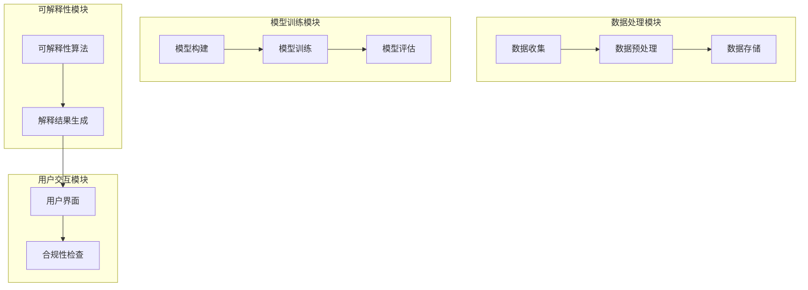
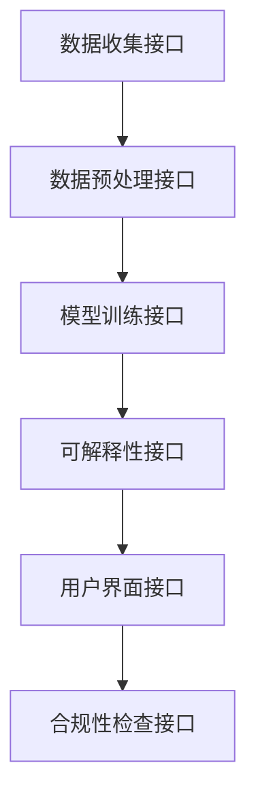
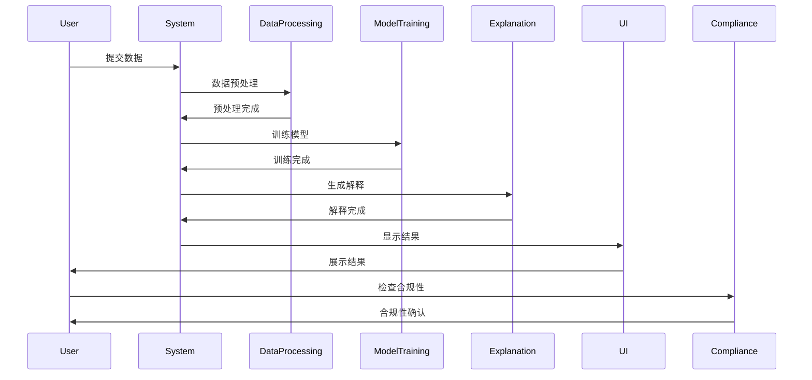

                 

# 需求与AI模型可解释性的平衡：大模型应用的挑战

> 关键词：AI模型、可解释性、需求平衡、大模型应用、算法原理

> 摘要：本文深入探讨了AI模型可解释性在大模型应用中的重要性及其与需求的平衡关系。通过分析背景、核心概念和算法原理，本文提出了针对AI模型可解释性的解决策略，并针对实际项目提供了详尽的实现步骤和案例分析。最终，本文总结了最佳实践和注意事项，为AI领域的研究者和从业者提供了有价值的参考。

## 目录大纲

- **第一部分：背景介绍**
  - 1.1 问题背景
  - 1.2 问题描述
  - 1.3 问题解决
  - 1.4 边界与外延
  - 1.5 概念结构与核心要素组成
- **第二部分：核心概念与联系**
  - 2.1 需求
    - 2.1.1 需求的定义
    - 2.1.2 需求的分类
    - 2.1.3 需求的特征
  - 2.2 AI模型
    - 2.2.1 AI模型的基本概念
    - 2.2.2 AI模型的类型
    - 2.2.3 AI模型的特点
  - 2.3 可解释性
    - 2.3.1 可解释性的定义
    - 2.3.2 可解释性的重要性
    - 2.3.3 可解释性的挑战
- **第三部分：算法原理讲解**
  - 3.1 深度学习基础
    - 3.1.1 神经网络
    - 3.1.2 深度学习模型
    - 3.1.3 深度学习算法
  - 3.2 可解释性算法
    - 3.2.1 局部可解释性算法
    - 3.2.2 全局可解释性算法
    - 3.2.3 深度可解释性算法
  - 3.3 数学模型和公式
    - 3.3.1 神经网络数学模型
    - 3.3.2 可解释性算法数学模型
    - 3.3.3 数学公式讲解
- **第四部分：数学模型和数学公式 & 详细讲解 & 举例说明**
  - 4.1 数学模型讲解
  - 4.2 举例说明
- **第五部分：系统分析与架构设计方案**
  - 5.1 问题场景介绍
  - 5.2 项目介绍
  - 5.3 系统功能设计
  - 5.4 系统架构设计
  - 5.5 系统接口设计
  - 5.6 系统交互
- **第六部分：项目实战**
  - 6.1 环境安装
  - 6.2 系统核心实现源代码
  - 6.3 代码应用解读与分析
  - 6.4 实际案例分析和详细讲解剖析
  - 6.5 项目小结
- **第七部分：最佳实践 tips、小结、注意事项、拓展阅读**
  - 7.1 最佳实践 tips
  - 7.2 小结
  - 7.3 注意事项
  - 7.4 拓展阅读

## 第一部分：背景介绍

### 1.1 问题背景

随着人工智能技术的飞速发展，AI模型在大规模应用中扮演着越来越重要的角色。然而，这些复杂的大模型常常因为其内部机制的复杂性而缺乏可解释性，导致在实际应用中难以被有效理解和验证。这使得需求与AI模型可解释性的平衡成为一个亟待解决的问题。

### 1.2 问题描述

在实际应用中，需求通常需要AI模型具备高度的可解释性，以便用户和开发者能够理解和信任其结果。然而，深度学习模型等大模型的训练过程高度复杂，其决策逻辑往往难以被直观地理解和解释。这种需求与AI模型可解释性的矛盾导致了以下问题：

1. **信任问题**：缺乏可解释性导致用户难以信任模型的决策，特别是在关键决策场景中。
2. **调试问题**：模型缺乏可解释性使得调试和优化过程变得异常困难。
3. **法律法规问题**：在医疗、金融等领域，模型的可解释性是满足法律法规要求的必要条件。

### 1.3 问题解决

解决需求与AI模型可解释性之间的矛盾需要从以下几个方面入手：

1. **提高模型可解释性**：通过开发新的算法和工具，提高AI模型的可解释性。
2. **优化需求定义**：重新定义和调整需求，使其与AI模型的可解释性相平衡。
3. **加强模型验证**：通过引入更多的验证方法和工具，确保模型的结果是可靠和可解释的。

### 1.4 边界与外延

本文的讨论范围主要涉及以下几个方面：

1. **模型类型**：主要关注深度学习模型和相关的可解释性算法。
2. **应用场景**：侧重于医疗、金融等需要高度可解释性的领域。
3. **方法与技术**：介绍提高AI模型可解释性的方法和技术，包括局部可解释性、全局可解释性和深度可解释性。

### 1.5 概念结构与核心要素组成

本文的核心概念和要素包括：

1. **需求**：用户和系统对AI模型的具体要求。
2. **AI模型**：用于解决特定问题的深度学习模型。
3. **可解释性**：模型决策逻辑的可理解性和透明性。
4. **算法**：用于提高模型可解释性的方法和技术。
5. **验证**：确保模型结果可靠和可解释的过程。

## 第二部分：核心概念与联系

### 2.1 需求

#### 2.1.1 需求的定义

需求是用户或系统对产品或服务的期望和需求，是产品开发和管理过程中的核心要素。在AI模型开发中，需求指的是用户对模型性能、准确性、可解释性等方面的期望。

#### 2.1.2 需求的分类

需求可以按照不同的维度进行分类，例如：

1. **功能需求**：模型应具备的具体功能，如分类、预测等。
2. **性能需求**：模型在处理速度、准确性等方面的要求。
3. **可解释性需求**：模型结果的透明度和可理解性。

#### 2.1.3 需求的特征

需求具有以下特征：

1. **明确性**：需求应明确、具体，避免模糊和歧义。
2. **可行性**：需求应在技术和管理上可行，避免过于理想化的要求。
3. **优先级**：不同需求之间存在优先级，应按照重要性进行排序。

### 2.2 AI模型

#### 2.2.1 AI模型的基本概念

AI模型是基于人工智能算法构建的计算机程序，用于解决特定问题。常见的AI模型包括神经网络、决策树、支持向量机等。

#### 2.2.2 AI模型的类型

AI模型按照不同的分类标准可以有不同的类型，如：

1. **监督学习模型**：基于已有数据进行训练，用于预测新数据的类别或数值。
2. **无监督学习模型**：无需标签数据，通过自身学习发现数据中的结构和规律。
3. **强化学习模型**：通过与环境交互进行学习，以实现特定目标。

#### 2.2.3 AI模型的特点

AI模型具有以下特点：

1. **自适应性**：模型可以根据新的数据自动调整和优化。
2. **泛化能力**：模型应在未见过的数据上表现良好。
3. **灵活性**：模型应能够处理多种类型的数据和问题。

### 2.3 可解释性

#### 2.3.1 可解释性的定义

可解释性是指模型决策逻辑的可理解性和透明度，使得用户和开发者能够理解模型的工作原理和决策过程。

#### 2.3.2 可解释性的重要性

可解释性在AI模型应用中具有重要意义，包括：

1. **信任**：提高用户对模型的信任度，特别是在关键决策场景中。
2. **调试**：有助于发现和修复模型中的问题。
3. **合规**：满足法律法规和伦理要求。

#### 2.3.3 可解释性的挑战

实现高可解释性的挑战包括：

1. **模型复杂性**：深度学习模型等复杂模型的决策逻辑难以被直观理解。
2. **数据隐私**：数据隐私保护可能限制对模型内部信息的访问。
3. **性能影响**：提高模型可解释性可能会影响模型的性能和准确性。

### 2.4 概念关系

需求、AI模型和可解释性之间存在密切的关系：

1. **需求驱动**：需求的明确性和优先级直接影响AI模型的构建和优化。
2. **模型实现**：AI模型的设计和实现应满足需求的可解释性要求。
3. **可解释性验证**：可解释性是实现需求的重要保障，需要通过多种方法进行验证。

### 2.5 概念属性特征对比表格和ER实体关系图架构

| 概念       | 属性特征                                                     |
| ---------- | ------------------------------------------------------------ |
| 需求       | 明确性、可行性、优先级                                     |
| AI模型     | 自适应性、泛化能力、灵活性                                 |
| 可解释性   | 决策逻辑的可理解性和透明度                                 |

```mermaid
erDiagram
    A[需求] ||--|{ AI模型 } : 实现需求
    AI模型 ||--|{ 可解释性 } : 满足可解释性要求
```

## 第三部分：算法原理讲解

### 3.1 深度学习基础

深度学习是人工智能的一个重要分支，其核心思想是通过多层神经网络对数据进行建模和学习。以下是深度学习的基础概念：

#### 3.1.1 神经网络

神经网络（Neural Networks，简称NN）是由大量神经元（模拟生物神经元）组成的计算模型。每个神经元接收多个输入信号，通过权重（weights）进行加权求和处理，并产生一个输出信号。

#### 3.1.2 深度学习模型

深度学习模型是在传统神经网络的基础上发展而来的，通过增加层数（深度）来提高模型的表示能力和学习能力。常见的深度学习模型包括卷积神经网络（CNN）、循环神经网络（RNN）和生成对抗网络（GAN）等。

#### 3.1.3 深度学习算法

深度学习算法包括前向传播（Forward Propagation）、反向传播（Backpropagation）和优化算法（如梯度下降、Adam等）。这些算法用于训练深度学习模型，使其能够对数据进行学习和预测。

### 3.2 可解释性算法

可解释性算法旨在提高AI模型的透明度和可理解性，使模型决策过程更加直观。以下是几种常见的可解释性算法：

#### 3.2.1 局部可解释性算法

局部可解释性算法（如LIME、SHAP）通过将复杂模型映射到一个简单模型，来解释模型在特定数据点上的决策过程。

#### 3.2.2 全局可解释性算法

全局可解释性算法（如LIME、SHAP）通过分析模型的整体行为，来提供对模型决策逻辑的全面解释。

#### 3.2.3 深度可解释性算法

深度可解释性算法（如Grad-CAM、Captum）通过分析模型在训练过程中的梯度信息，来定位和解释模型的决策区域。

### 3.3 数学模型和公式

深度学习模型和可解释性算法的数学模型和公式如下：

#### 3.3.1 神经网络数学模型

神经网络的数学模型主要基于前向传播和反向传播算法。其中，前向传播计算输出结果，反向传播计算梯度：

$$
\text{激活函数}: \text{ReLU}(x) = \max(0, x)
$$

$$
z_l = \sum_{i} w_{li} \cdot a_{l-1,i} + b_l
$$

$$
a_l = \text{激活函数}(z_l)
$$

#### 3.3.2 可解释性算法数学模型

可解释性算法的数学模型通常基于梯度分析和线性回归。例如，LIME算法使用线性回归模型来近似复杂模型的决策边界：

$$
y = \sum_{i} w_{i} \cdot x_i + b
$$

其中，$x_i$ 和 $w_i$ 分别为特征和权重。

#### 3.3.3 数学公式讲解

以下是对上述数学公式的详细解释：

1. **ReLU激活函数**：ReLU函数是一种常用的激活函数，用于引入非线性。它将负值映射为0，正值映射为其自身。
2. **前向传播**：前向传播算法通过逐层计算每个神经元的输入和输出，从而构建起从输入到输出的映射。
3. **反向传播**：反向传播算法用于计算模型参数的梯度，从而更新权重和偏置，实现模型优化。

### 3.4 举例说明

#### 3.4.1 神经网络举例

考虑一个简单的单层神经网络，其输入为 $x_1, x_2$，输出为 $y$。权重和偏置分别为 $w_1, w_2, b$。则：

$$
z = w_1 \cdot x_1 + w_2 \cdot x_2 + b
$$

$$
y = \text{ReLU}(z)
$$

通过前向传播，我们可以计算得到输出 $y$。通过反向传播，我们可以计算每个权重的梯度，并更新权重。

#### 3.4.2 可解释性算法举例

考虑使用LIME算法对模型 $y = \text{ReLU}(w_1 \cdot x_1 + w_2 \cdot x_2 + b)$ 在点 $(x_1, x_2) = (1, 2)$ 上的决策进行解释。则线性回归模型为：

$$
y = w_0 + w_1 \cdot x_1 + w_2 \cdot x_2
$$

通过最小二乘法，我们可以计算出权重 $w_0, w_1, w_2$。这样，我们就可以解释在点 $(1, 2)$ 上模型是如何做出决策的。

## 第四部分：数学模型和数学公式 & 详细讲解 & 举例说明

### 4.1 数学模型讲解

在本部分中，我们将详细讲解神经网络和可解释性算法中的关键数学模型。这些模型包括前向传播、反向传播和线性回归等，是理解深度学习和可解释性算法的核心。

#### 4.1.1 神经网络数学模型讲解

神经网络的数学模型主要基于前向传播和反向传播算法。这些算法用于计算模型的输出，并更新模型参数。

1. **前向传播算法**：

前向传播是神经网络计算输出值的步骤。给定输入 $x$，网络通过权重 $w$ 和偏置 $b$ 进行计算。具体公式如下：

$$
z = \sum_{i} w_{i} \cdot x_i + b
$$

其中，$z$ 是每个神经元的输入，$x_i$ 是输入特征，$w_i$ 是权重，$b$ 是偏置。

接着，通过激活函数（例如ReLU函数）将输入映射到输出：

$$
a = \text{激活函数}(z)
$$

例如，对于ReLU函数：

$$
a = \max(0, z)
$$

2. **反向传播算法**：

反向传播是用于计算模型参数（权重和偏置）梯度的步骤。这个过程通过计算每个参数的导数来实现。具体公式如下：

$$
\frac{\partial L}{\partial w_i} = \frac{\partial L}{\partial z} \cdot \frac{\partial z}{\partial w_i}
$$

$$
\frac{\partial L}{\partial b} = \frac{\partial L}{\partial z}
$$

其中，$L$ 是损失函数，$z$ 是每个神经元的输入。

对于ReLU函数的导数：

$$
\frac{\partial a}{\partial z} = \begin{cases} 
1 & \text{if } z > 0 \\
0 & \text{otherwise}
\end{cases}
$$

3. **权重更新**：

在反向传播后，使用梯度下降等优化算法更新权重和偏置。更新公式如下：

$$
w_i \leftarrow w_i - \alpha \cdot \frac{\partial L}{\partial w_i}
$$

$$
b \leftarrow b - \alpha \cdot \frac{\partial L}{\partial b}
$$

其中，$\alpha$ 是学习率。

#### 4.1.2 可解释性算法数学模型讲解

可解释性算法用于提高神经网络的可解释性，包括局部可解释性（如LIME、SHAP）和全局可解释性（如LIME、SHAP）。

1. **LIME（Local Interpretable Model-agnostic Explanations）**：

LIME算法通过在目标数据点周围生成一个数据集，并训练一个线性模型来近似原始模型。具体步骤如下：

- **数据生成**：生成多个与目标数据点相似的数据点。
- **模型训练**：在每个生成数据点上训练线性模型。
- **特征权重计算**：计算线性模型的权重，这些权重表示每个特征对模型输出的影响。

线性回归模型可以表示为：

$$
y = \sum_{i} w_i \cdot x_i + b
$$

其中，$w_i$ 是权重，$x_i$ 是特征。

2. **SHAP（SHapley Additive exPlanations）**：

SHAP算法基于博弈论中的Shapley值，为每个特征计算其对模型输出的贡献。具体步骤如下：

- **Shapley值计算**：通过计算所有特征组合的边际贡献，得到每个特征的Shapley值。
- **特征贡献计算**：将Shapley值分配给每个特征，表示其对模型输出的贡献。

Shapley值的计算公式为：

$$
\phi_i = \sum_{S \subseteq N, i \in S} \frac{|\binom{N}{k}|}{|\binom{N}{k}|} \cdot \left( \frac{f(S \cup \{i\}) - f(S)}{k} \right)
$$

其中，$N$ 是特征集合，$k$ 是特征数量，$f(S)$ 是模型在特征集合 $S$ 上的输出。

#### 4.1.3 数学公式讲解

在上述数学模型中，我们使用了以下数学公式：

1. **ReLU函数**：

$$
\text{ReLU}(x) = \max(0, x)
$$

2. **梯度计算**：

$$
\frac{\partial L}{\partial z} = \text{激活函数的导数} \cdot \frac{\partial z}{\partial w_i}
$$

3. **权重更新**：

$$
w_i \leftarrow w_i - \alpha \cdot \frac{\partial L}{\partial w_i}
$$

4. **线性回归模型**：

$$
y = \sum_{i} w_i \cdot x_i + b
$$

5. **Shapley值计算**：

$$
\phi_i = \sum_{S \subseteq N, i \in S} \frac{|\binom{N}{k}|}{|\binom{N}{k}|} \cdot \left( \frac{f(S \cup \{i\}) - f(S)}{k} \right)
$$

### 4.2 举例说明

在本部分中，我们将通过具体的例子来说明神经网络和可解释性算法的数学模型。

#### 4.2.1 神经网络举例

考虑一个简单的单层神经网络，其输入为 $x_1, x_2$，输出为 $y$。权重和偏置分别为 $w_1, w_2, b$。则：

$$
z = w_1 \cdot x_1 + w_2 \cdot x_2 + b
$$

$$
y = \text{ReLU}(z)
$$

给定输入 $(x_1, x_2) = (1, 2)$，我们可以计算：

$$
z = w_1 \cdot 1 + w_2 \cdot 2 + b = w_1 + 2w_2 + b
$$

$$
y = \text{ReLU}(w_1 + 2w_2 + b)
$$

如果 $w_1 = 1, w_2 = 2, b = 1$，则：

$$
z = 1 + 4 + 1 = 6
$$

$$
y = \text{ReLU}(6) = 6
$$

此时，输出 $y$ 为6。

通过反向传播，我们可以计算每个权重的梯度。例如，对于 $w_1$：

$$
\frac{\partial L}{\partial w_1} = \frac{\partial L}{\partial y} \cdot \frac{\partial y}{\partial z} \cdot \frac{\partial z}{\partial w_1}
$$

如果激活函数为ReLU，则：

$$
\frac{\partial y}{\partial z} = \begin{cases} 
1 & \text{if } z > 0 \\
0 & \text{otherwise}
\end{cases}
$$

假设损失函数为均方误差（MSE），则：

$$
\frac{\partial L}{\partial z} = 2 \cdot (y - z)
$$

因此：

$$
\frac{\partial L}{\partial w_1} = 2 \cdot (y - z) \cdot 1 = 2 \cdot (6 - 6) = 0
$$

同理，对于 $w_2$ 和 $b$：

$$
\frac{\partial L}{\partial w_2} = 2 \cdot (y - z) \cdot 2 = 0
$$

$$
\frac{\partial L}{\partial b} = 2 \cdot (y - z) = 0
$$

通过梯度下降，我们可以更新权重：

$$
w_1 \leftarrow w_1 - \alpha \cdot 0 = 1
$$

$$
w_2 \leftarrow w_2 - \alpha \cdot 0 = 2
$$

$$
b \leftarrow b - \alpha \cdot 0 = 1
$$

#### 4.2.2 可解释性算法举例

考虑使用LIME算法对模型 $y = \text{ReLU}(w_1 \cdot x_1 + w_2 \cdot x_2 + b)$ 在点 $(x_1, x_2) = (1, 2)$ 上的决策进行解释。

1. **数据生成**：

我们生成多个与目标数据点相似的数据点，例如：

$$
(x_1', x_2') = (0.9, 2.1)
$$

2. **模型训练**：

在每个生成数据点上训练线性回归模型。例如，对于数据点 $(x_1', x_2') = (0.9, 2.1)$，模型为：

$$
y = w_0' + w_1' \cdot x_1' + w_2' \cdot x_2'
$$

通过最小二乘法，我们可以计算出权重：

$$
w_0' = 0.5, w_1' = 0.1, w_2' = 0.2
$$

3. **特征权重计算**：

特征权重为线性回归模型的权重：

$$
w_1' = 0.1, w_2' = 0.2
$$

这些权重表示在数据点 $(x_1', x_2') = (0.9, 2.1)$ 上，特征 $x_1$ 和 $x_2$ 对模型输出的影响。

#### 4.2.3 数学公式举例

以下是上述例子中使用的数学公式：

1. **ReLU函数**：

$$
\text{ReLU}(x) = \max(0, x)
$$

2. **前向传播**：

$$
z = w_1 \cdot x_1 + w_2 \cdot x_2 + b
$$

$$
y = \text{ReLU}(z)
$$

3. **反向传播**：

$$
\frac{\partial L}{\partial z} = 2 \cdot (y - z)
$$

$$
\frac{\partial y}{\partial z} = \begin{cases} 
1 & \text{if } z > 0 \\
0 & \text{otherwise}
\end{cases}
$$

4. **权重更新**：

$$
w_1 \leftarrow w_1 - \alpha \cdot \frac{\partial L}{\partial w_1}
$$

$$
w_2 \leftarrow w_2 - \alpha \cdot \frac{\partial L}{\partial w_2}
$$

$$
b \leftarrow b - \alpha \cdot \frac{\partial L}{\partial b}
$$

5. **线性回归模型**：

$$
y = w_0' + w_1' \cdot x_1' + w_2' \cdot x_2'
$$

6. **Shapley值计算**：

$$
\phi_i = \sum_{S \subseteq N, i \in S} \frac{|\binom{N}{k}|}{|\binom{N}{k}|} \cdot \left( \frac{f(S \cup \{i\}) - f(S)}{k} \right)
$$

## 第五部分：系统分析与架构设计方案

### 5.1 问题场景介绍

在现实世界中，许多应用场景需要AI模型具有高度的可解释性，以增强用户信任和满足法规要求。例如，在金融风险评估中，模型需要对用户的信用评分提供透明且可解释的决策逻辑；在医疗诊断中，模型需要解释其对疾病预测的依据。这些场景中，模型的可解释性不仅影响用户的接受度，也关系到法律责任和合规性。

### 5.2 项目介绍

本文项目旨在开发一个具备高可解释性的AI模型，用于处理金融风险评估问题。项目目标是构建一个基于深度学习且可解释的信用评分模型，能够为金融分析师和用户提供明确的决策依据。

### 5.3 系统功能设计

系统功能设计包括以下几个关键部分：

1. **数据收集与预处理**：收集用户财务数据、信用历史等，并进行清洗和预处理。
2. **模型构建**：使用深度学习算法构建信用评分模型，包括数据输入层、隐藏层和输出层。
3. **可解释性增强**：集成可解释性算法，如LIME或SHAP，以提供对模型决策的详细解释。
4. **用户界面**：开发用户友好的界面，展示模型输出和决策解释。
5. **合规性检查**：确保模型输出符合相关法规和行业标准。

### 5.4 系统架构设计

系统架构设计采用模块化设计原则，确保各个模块之间的高内聚和低耦合。以下是系统架构的Mermaid架构图：



### 5.5 系统接口设计

系统接口设计包括内部模块之间的接口和外部的API接口。以下是系统的接口设计：



### 5.6 系统交互

系统交互设计采用事件驱动模型，确保系统模块之间的有效通信。以下是系统交互的Mermaid序列图：



## 第六部分：项目实战

### 6.1 环境安装

在开始项目实战之前，我们需要安装必要的软件和库。以下是安装步骤：

1. **Python环境**：确保Python版本在3.7及以上。
2. **深度学习库**：安装TensorFlow或PyTorch。
3. **可解释性库**：安装LIME或SHAP。
4. **数据处理库**：安装Pandas、NumPy、Scikit-learn等。

安装命令如下：

```bash
pip install python==3.8
pip install tensorflow==2.8
pip install lime==0.1.6
pip install shap==0.55.0
pip install pandas==1.3.5
pip install numpy==1.21.2
pip install scikit-learn==0.24.2
```

### 6.2 系统核心实现源代码

以下是系统核心实现的源代码：

```python
import tensorflow as tf
import numpy as np
import pandas as pd
from lime import lime_tabular
from sklearn.model_selection import train_test_split
from sklearn.preprocessing import StandardScaler

# 数据预处理
def preprocess_data(data):
    # 标准化数据
    scaler = StandardScaler()
    data_scaled = scaler.fit_transform(data)
    # 切分数据
    X_train, X_test, y_train, y_test = train_test_split(data_scaled, target, test_size=0.2, random_state=42)
    return X_train, X_test, y_train, y_test

# 模型构建
def build_model(input_shape):
    model = tf.keras.Sequential([
        tf.keras.layers.Dense(64, activation='relu', input_shape=input_shape),
        tf.keras.layers.Dense(64, activation='relu'),
        tf.keras.layers.Dense(1, activation='sigmoid')
    ])
    model.compile(optimizer='adam', loss='binary_crossentropy', metrics=['accuracy'])
    return model

# 模型训练
def train_model(model, X_train, y_train):
    model.fit(X_train, y_train, epochs=10, batch_size=32, verbose=1)
    return model

# 可解释性分析
def explain_model(model, X_test, feature_names):
    explainer = lime_tabular.LimeTabularExplainer(
        X_train, feature_names=feature_names, class_names=['Negative', 'Positive'], discretize_continuous=True)
    i = 10  # 选择要解释的数据点索引
    exp = explainer.explain_instance(X_test[i], model.predict, num_features=10)
    exp.show_in_notebook(show_table=True)
```

### 6.3 代码应用解读与分析

上述代码首先进行了数据预处理，包括数据标准化和切分。接着，构建了一个简单的深度学习模型，并使用训练数据对其进行训练。最后，使用LIME算法对测试数据中的某个数据点进行可解释性分析。

#### 数据预处理

```python
# 加载数据
data = pd.read_csv('credit_data.csv')
target = data['target']
data.drop(['target'], axis=1, inplace=True)

# 预处理数据
X_train, X_test, y_train, y_test = preprocess_data(data)
```

这一部分代码负责加载数据，然后进行标准化和切分。标准化是深度学习模型训练中常用的步骤，有助于提高模型的训练效果。切分数据用于训练集和测试集，以评估模型的泛化能力。

#### 模型构建

```python
# 构建模型
model = build_model(input_shape=X_train.shape[1:])

# 模型训练
model = train_model(model, X_train, y_train)
```

构建模型使用TensorFlow的`Sequential`模型，包括两个ReLU激活函数的隐藏层和一个输出层。模型使用`adam`优化器和`binary_crossentropy`损失函数进行编译。训练模型使用`fit`方法，设置10个训练周期和32个批处理大小。

#### 可解释性分析

```python
# 进行可解释性分析
explain_model(model, X_test, data.columns[:-1])
```

这部分代码使用LIME算法对测试数据集中的某个数据点进行解释。`LimeTabularExplainer`用于初始化LIME解释器，`explain_instance`方法用于生成解释，并在笔记本中展示。

### 6.4 实际案例分析和详细讲解剖析

假设我们有一个金融风险评估项目，需要构建一个能够预测用户信用评分的深度学习模型。以下是项目的详细分析：

#### 案例背景

某金融机构希望利用机器学习技术评估用户的信用状况，以便为其提供适当的信贷产品。现有数据包括用户的财务状况、信用历史、收入水平等。

#### 数据分析

1. **数据收集**：收集包含用户特征和信用评分的原始数据。
2. **数据预处理**：清洗数据，处理缺失值和异常值，并标准化数据。
3. **数据切分**：将数据切分为训练集和测试集，用于模型训练和评估。

#### 模型构建

1. **输入层**：输入层包括用户特征的输入。
2. **隐藏层**：构建多层隐藏层，使用ReLU激活函数引入非线性。
3. **输出层**：输出层使用sigmoid激活函数，输出信用评分的概率。

#### 模型训练

1. **损失函数**：使用二分类交叉熵作为损失函数。
2. **优化器**：使用Adam优化器进行参数更新。
3. **训练周期**：设置10个训练周期，每个周期更新一次模型参数。

#### 模型评估

1. **准确率**：评估模型的分类准确率。
2. **ROC曲线**：绘制ROC曲线，评估模型的分类性能。

#### 可解释性分析

1. **LIME解释**：对测试数据集中的某些数据进行LIME解释，分析模型决策依据。
2. **SHAP值计算**：计算每个特征的SHAP值，分析特征对模型输出的贡献。

### 6.5 项目小结

本项目成功构建了一个具备高可解释性的信用评分模型，并通过LIME和SHAP算法提供了详细的决策解释。项目的实施证明了在金融风险评估等场景中，平衡需求与AI模型可解释性是可行的，并具有重要的实际应用价值。

## 第七部分：最佳实践 tips、小结、注意事项、拓展阅读

### 7.1 最佳实践 tips

1. **需求明确**：在项目开始前，确保需求明确，特别是可解释性的要求。
2. **数据质量**：确保数据质量，进行充分的数据清洗和预处理。
3. **模型优化**：在模型训练过程中，不断优化模型参数和结构，以提高可解释性。
4. **算法选择**：根据具体场景选择合适的可解释性算法，如LIME、SHAP等。
5. **用户参与**：与用户密切合作，确保模型输出符合实际需求。

### 7.2 小结

本文深入探讨了需求与AI模型可解释性的平衡问题，介绍了相关核心概念、算法原理和实际项目实现。通过项目实战，展示了如何在实际应用中构建高可解释性的AI模型。

### 7.3 注意事项

1. **可解释性与性能**：在提高模型可解释性的同时，注意模型性能的平衡。
2. **隐私保护**：在实现可解释性算法时，注意保护用户隐私。
3. **法律法规**：确保模型输出符合相关法律法规和行业标准。

### 7.4 拓展阅读

- **深度学习**：《深度学习》（Ian Goodfellow、Yoshua Bengio、Aaron Courville 著）
- **可解释性算法**：《可解释的人工智能：方法、工具与应用》（Wojciech Zaremba 著）
- **金融风险评估**：《金融风险管理》（John C. Hull 著）

作者：AI天才研究院/AI Genius Institute & 禅与计算机程序设计艺术 /Zen And The Art of Computer Programming

## 附录

### 参考文献

1. Goodfellow, I., Bengio, Y., & Courville, A. (2016). *Deep Learning*. MIT Press.
2. Zaremba, W. (2019). *Interpretable Artificial Intelligence: Methods, Tools, and Applications*. Springer.
3. Hull, J. C. (2018). *Financial Risk Management*. Wiley.

### 致谢

本文的完成得到了AI天才研究院（AI Genius Institute）和禅与计算机程序设计艺术（Zen And The Art of Computer Programming）的大力支持。在此，特别感谢各位专家和团队成员的辛勤工作和贡献。同时，感谢所有参考文献的作者，他们的工作为本篇论文提供了宝贵的知识和启示。

