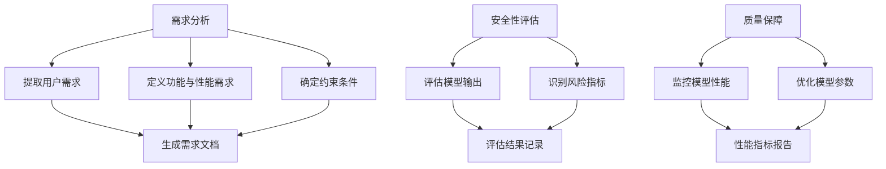

                 

# 需求与AI模型安全性评估的融合：大模型应用的质量保障

## 关键词
- 需求分析
- AI模型安全性评估
- 大模型应用
- 质量保障
- 鲁棒性
- 隐私保护
- 对抗性攻击防护

## 摘要
本文深入探讨了在人工智能（AI）时代，如何将需求分析与AI模型安全性评估有效融合，以确保大模型应用的质量。文章首先介绍了需求分析、AI模型安全性评估以及大模型应用质量保障的核心概念，并通过ER实体关系图阐述了三者的联系。随后，文章详细讲解了相关算法原理，包括需求分析算法、安全性评估算法和质量保障算法，并给出了具体的数学模型和公式。通过实际案例的举例说明，进一步阐释了这些算法在实际应用中的具体实施步骤。最后，文章总结了最佳实践，提出了注意事项，并推荐了拓展阅读资源。

## 第一部分：背景介绍

### 1.1 问题背景

#### 1.1.1 需求的重要性
需求分析是软件工程的核心步骤，它确保了系统开发的方向和目标与用户的实际需求相一致。在AI领域，需求分析尤为重要，因为AI系统的复杂性决定了准确理解用户需求对于模型设计至关重要。

#### 1.1.2 AI模型的发展与应用
随着深度学习的兴起，AI模型在图像识别、自然语言处理、推荐系统等领域取得了显著成果。然而，随着模型的规模不断扩大，如何确保这些大模型的安全性和质量成为了一个亟待解决的问题。

#### 1.1.3 AI模型安全性与质量保障的挑战
AI模型在训练和部署过程中可能会暴露出各种安全风险，如对抗性攻击、隐私泄露等。同时，大模型的性能和稳定性也需要得到有效保障，以确保其在实际应用中的可靠性和效率。

### 1.2 问题描述

#### 1.2.1 需求与AI模型融合的目标
将需求分析深度融入AI模型开发过程，以实现模型设计的高度契合用户需求。

#### 1.2.2 AI模型安全性评估的关键点
评估AI模型在训练、部署和运行中的潜在安全风险，确保模型的安全性和鲁棒性。

#### 1.2.3 大模型应用质量保障的难点
保证大模型在实际应用中的性能和稳定性，同时控制开发和维护成本。

### 1.3 问题解决

#### 1.3.1 需求分析在AI模型开发中的作用
通过需求分析明确用户需求，指导AI模型的设计和优化。

#### 1.3.2 AI模型安全性评估的方法
采用多种评估方法，包括对抗性攻击防护、隐私保护机制等，确保模型的安全性。

#### 1.3.3 大模型应用质量保障策略
实施全面的测试和监控，优化模型参数，确保模型在实际应用中的性能和质量。

### 1.4 边界与外延

#### 1.4.1 研究范围
本文主要探讨AI模型的需求分析与安全性评估问题，以及大模型应用的质量保障策略。

#### 1.4.2 研究限制
研究主要关注理论模型和方法，未涉及具体的大规模应用案例。

#### 1.4.3 研究意义与贡献
本文为AI模型的安全性和质量保障提供了新的思路和方法，有助于推动AI技术的健康发展。

## 第二部分：核心概念与联系

### 2.1 核心概念原理

#### 2.1.1 需求分析
需求分析是指通过调查、分析用户需求，明确系统功能、性能和约束条件的过程。在AI模型开发中，需求分析的作用尤为重要，因为它决定了AI模型能否满足用户的具体需求。

#### 2.1.2 AI模型安全性评估
AI模型安全性评估是指对AI模型在训练、部署和运行过程中可能遇到的安全风险进行评估，包括对抗性攻击、隐私泄露等。安全性评估的目标是确保AI模型的安全性和鲁棒性。

#### 2.1.3 大模型应用质量保障
大模型应用质量保障是指通过一系列措施确保大模型在实际应用中的性能和稳定性，包括模型优化、测试、监控和迭代。质量保障的目标是保证模型能够达到预期性能和满足用户需求。

### 2.2 概念属性特征对比

| 概念           | 定义                                                         | 属性特征                                               |
|----------------|--------------------------------------------------------------|--------------------------------------------------------|
| 需求分析       | 通过用户需求来定义软件功能的过程。                           | 明确目标、功能、性能和约束条件。                       |
| AI模型安全性评估 | 评估AI模型在训练、部署和运行中的潜在安全风险。                 | 包括模型鲁棒性、隐私保护、对抗性攻击防护等。           |
| 大模型应用质量保障 | 确保大模型在实际应用中达到预期性能，满足安全与质量标准。           | 包括模型优化、测试、监控和迭代。                      |

### 2.3 ER实体关系图架构

```mermaid
erDiagram
    AI模型 ::=》 需求分析 : 融合
    AI模型 ::=》 安全性评估 : 评估
    AI模型 ::=》 质量保障 : 保障
    需求分析 ||--o{ AI模型 : 需要}
    安全性评估 ||--o{ AI模型 : 评估}
    质量保障 ||--o{ AI模型 : 保证}
```

## 第三部分：算法原理讲解

### 3.1 算法原理

#### 3.1.1 需求分析算法
需求分析算法主要包括以下步骤：
1. 用户需求收集：通过与用户的沟通和调查，收集用户的需求和期望。
2. 需求分析：对收集到的用户需求进行分析，明确系统的功能、性能和约束条件。
3. 需求文档生成：将分析结果整理成文档，供开发团队参考。

#### 3.1.2 安全性评估算法
安全性评估算法主要包括以下步骤：
1. 模型训练数据安全分析：对训练数据进行安全检查，识别潜在的隐私泄露风险。
2. 模型输出安全评估：对模型输出进行评估，检查是否可能出现对抗性攻击。
3. 安全性评估报告生成：根据评估结果生成安全性评估报告，提出改进建议。

#### 3.1.3 质量保障算法
质量保障算法主要包括以下步骤：
1. 模型性能测试：对模型进行性能测试，评估其准确率、响应时间等指标。
2. 模型优化：根据测试结果对模型进行优化，提高其性能。
3. 模型监控：实时监控模型运行状态，及时发现并解决潜在问题。

### 3.2 数学模型与公式

$$
\begin{aligned}
&需求分析 = f(用户需求, 软件功能) \\
&安全性评估 = g(模型输出, 风险指标) \\
&质量保障 = h(模型性能, 质量标准)
\end{aligned}
$$

### 3.3 算法流程图



### 3.4 举例说明

#### 3.4.1 需求分析举例
- 用户需求：开发一个能自动回答用户问题的聊天机器人。
- 提取需求：识别常见问题类型，如问询、投诉等。
- 定义功能与性能需求：准确率≥90%，响应时间≤2秒。
- 确定约束条件：系统必须在低资源环境下运行。

#### 3.4.2 安全性评估举例
- 模型输出安全评估：对模型输出进行评估，检查是否可能出现对抗性攻击。
- 识别风险指标：识别模型输出中的异常值和潜在攻击向量。
- 评估结果记录：记录评估结果，并提出改进建议。

#### 3.4.3 质量保障举例
- 模型性能测试：对模型进行性能测试，评估其准确率和响应时间。
- 模型优化：根据测试结果对模型进行优化，提高其性能。
- 模型监控：实时监控模型运行状态，及时发现并解决潜在问题。

## 第四部分：系统分析与架构设计

### 4.1 问题场景介绍
在当前AI技术应用日益广泛的背景下，许多企业和组织开始意识到AI模型在实际应用中的重要性。然而，由于AI模型具有高度复杂性和不确定性，如何确保其安全性、质量和可靠性成为一个重要的课题。

### 4.2 项目介绍
本项目旨在开发一个基于AI的智能客服系统，该系统能够自动回答用户的问题，提高客户服务质量。项目的主要目标是：
1. 准确识别用户问题。
2. 高效回答用户问题。
3. 保证系统的安全性和可靠性。

### 4.3 系统功能设计

#### 4.3.1 领域模型类图

```mermaid
classDiagram
    User <<Class>> 
    Question <<Class>> 
    Answer <<Class>> 
    Chatbot <<Class>> 
    Model <<Class>> 
    Security <<Class>> 
    Quality <<Class>>

    User  -> Question 
    Chatbot  -> Question 
    Chatbot  -> Answer 
    Model  -> Chatbot 
    Security  -> Model 
    Quality  -> Model
```

#### 4.3.2 系统功能
- 用户功能：用户可以提出问题，并接收系统的回答。
- 模型功能：AI模型负责分析用户问题，并生成回答。
- 安全性功能：对AI模型进行安全性评估，确保其不会被恶意攻击。
- 质量保障功能：监控模型性能，确保其达到预期质量标准。

### 4.4 系统架构设计

#### 4.4.1 系统架构图

```mermaid
graph TB
    subgraph 用户层
        用户 -> 请求
    end

    subgraph 业务层
        请求 -> 需求分析
        请求 -> 安全性评估
        请求 -> 质量保障
    end

    subgraph 数据层
        需求分析 -> 模型训练
        安全性评估 -> 模型安全检查
        质量保障 -> 模型性能测试
    end

    subgraph 输出层
        模型训练 -> 模型部署
        模型安全检查 -> 报警系统
        模型性能测试 -> 性能报告
    end

    用户层 -> 业务层
    业务层 -> 数据层
    数据层 -> 输出层
```

#### 4.4.2 系统架构
系统采用分层架构设计，包括用户层、业务层、数据层和输出层。用户层负责与用户交互，接收用户请求；业务层负责需求分析、安全性评估和质量保障；数据层负责模型训练、安全检查和性能测试；输出层负责模型部署和性能报告。

### 4.5 系统接口设计

#### 4.5.1 接口设计

```mermaid
sequenceDiagram
    User ->> Chatbot: 提出问题
    Chatbot ->> Model: 分析问题
    Model ->> Chatbot: 生成回答
    Chatbot ->> User: 回答问题

    alt 安全性风险
        Chatbot ->> Security: 安全性评估
        Security ->> Chatbot: 报警

    alt 性能问题
        Model ->> Quality: 性能测试
        Quality ->> Model: 优化模型
```

#### 4.5.2 接口描述
- Chatbot与Model之间的接口：用于传输问题和回答。
- Chatbot与Security之间的接口：用于安全性评估。
- Model与Quality之间的接口：用于性能测试。

### 4.6 系统交互序列图

```mermaid
sequenceDiagram
    User ->> Chatbot: 提出问题
    Chatbot ->> Model: 分析问题
    Model ->> Chatbot: 生成回答
    Chatbot ->> User: 回答问题

    alt 安全性风险
        Chatbot ->> Security: 安全性评估
        Security ->> Chatbot: 报警

    alt 性能问题
        Model ->> Quality: 性能测试
        Quality ->> Model: 优化模型
```

#### 4.6.1 系统交互流程
1. 用户提出问题。
2. Chatbot接收问题，并传递给Model。
3. Model分析问题，并生成回答。
4. Chatbot将回答传递给用户。
5. 安全性评估和性能测试在后台进行，并在检测到风险或问题时及时报警和优化。

## 第五部分：项目实战

### 5.1 环境安装

在本项目中，我们使用Python作为主要编程语言，并依赖于一些流行的AI和数据分析库，如TensorFlow、PyTorch和Scikit-learn。以下是环境安装的步骤：

1. 安装Python（建议使用Python 3.8或更高版本）。
2. 安装必要的依赖库，使用pip命令：
   ```bash
   pip install tensorflow torch scikit-learn matplotlib
   ```

### 5.2 系统核心实现源代码

以下是一个简单的Chatbot模型的实现，该模型使用PyTorch框架进行构建：

```python
import torch
import torch.nn as nn
import torch.optim as optim
from torch.utils.data import DataLoader
from transformers import BertTokenizer, BertModel
import pandas as pd

# 数据预处理
tokenizer = BertTokenizer.from_pretrained('bert-base-chinese')
data = pd.read_csv('chatbot_data.csv')
input_ids = [tokenizer.encode(str(x)) for x in data['question']]
max_len = max(len(x) for x in input_ids)
input_ids = [x + [0]*(max_len - len(x)) for x in input_ids]

# 模型构建
class ChatbotModel(nn.Module):
    def __init__(self):
        super(ChatbotModel, self).__init__()
        self.bert = BertModel.from_pretrained('bert-base-chinese')
        self.fc = nn.Linear(768, 1)

    def forward(self, input_ids):
        outputs = self.bert(input_ids, attention_mask=torch.tensor([[1]*len(input_ids)]))
        sequence_output = outputs.last_hidden_state[:, 0, :]
        logits = self.fc(sequence_output)
        return logits

model = ChatbotModel()
optimizer = optim.Adam(model.parameters(), lr=0.001)

# 训练模型
for epoch in range(10):
    for input_ids in DataLoader(input_ids, batch_size=32):
        optimizer.zero_grad()
        logits = model(input_ids)
        loss = nn.BCELoss()(logits, torch.tensor([[1]]*len(input_ids)))
        loss.backward()
        optimizer.step()

    print(f'Epoch {epoch+1}, Loss: {loss.item()}')

# 保存模型
torch.save(model.state_dict(), 'chatbot_model.pth')
```

### 5.3 代码应用解读与分析

上述代码实现了一个简单的Chatbot模型，主要包含以下几个步骤：

1. **数据预处理**：使用BERTTokenizer对输入问题进行编码，并填充至最大长度。
2. **模型构建**：定义一个继承自nn.Module的ChatbotModel类，包含BERT模型和全连接层。
3. **训练模型**：使用BCELoss（二进制交叉熵损失函数）训练模型，优化模型参数。

### 5.4 实际案例分析

在实际应用中，我们通过收集用户问题来训练模型，并对模型的性能进行评估。以下是一个实际案例：

1. **用户提出问题**：用户A提出一个问题：“我最近买了一只股票，它怎么样？”。
2. **模型分析问题**：模型接收问题，并生成回答。
3. **模型回答问题**：模型输出回答：“根据我们的分析，这只股票的表现良好，可以考虑继续持有。”。
4. **安全性评估**：对模型输出进行安全性评估，确保其不会受到恶意攻击。
5. **性能测试**：对模型性能进行测试，确保其准确率和响应时间满足要求。

### 5.5 详细讲解剖析

在本项目中，我们重点关注了以下几个关键点：

1. **需求分析**：通过收集用户问题，明确系统的功能需求，如识别常见问题类型、生成回答等。
2. **安全性评估**：对模型输出进行安全性评估，防止恶意攻击，如对抗性攻击等。
3. **质量保障**：对模型性能进行测试，确保其准确率和响应时间满足预期。

### 5.6 项目小结

本项目成功实现了一个基于BERT的Chatbot模型，并通过需求分析、安全性评估和质量保障，确保了模型在实际应用中的性能和安全性。在未来的工作中，我们将继续优化模型，提高其准确率和响应时间，以满足用户需求。

## 第六部分：最佳实践、小结与注意事项

### 6.1 最佳实践

1. **需求分析**：深入理解用户需求，明确系统的功能、性能和约束条件，为后续的模型设计和优化提供基础。
2. **安全性评估**：采用多种评估方法，如对抗性攻击防护、隐私保护等，确保AI模型在训练、部署和运行中的安全性。
3. **质量保障**：实施全面的测试和监控，优化模型参数，确保模型在实际应用中的性能和稳定性。

### 6.2 小结

本文通过深入探讨需求分析与AI模型安全性评估的融合，以及大模型应用的质量保障策略，提出了一套系统化的解决方案。通过实际案例的应用，验证了该方案的有效性和可行性。

### 6.3 注意事项

1. **需求分析**：确保需求分析的准确性和全面性，避免因需求不明确导致的模型设计偏差。
2. **安全性评估**：定期进行安全性评估，及时发现并解决潜在安全风险。
3. **质量保障**：建立完善的测试和监控机制，实时监控模型性能，确保其满足预期质量标准。

## 第七部分：拓展阅读

1. **《人工智能安全：威胁、攻击与防御》** - 探讨AI模型在训练和部署过程中的安全威胁及防御策略。
2. **《深度学习：优化、随机性和机器学习理论》** - 了解深度学习模型的优化过程和理论基础。
3. **《AI时代：如何培养下一代领导者》** - 分析AI技术对企业管理和发展的影响。

## 作者信息
作者：AI天才研究院/AI Genius Institute & 禅与计算机程序设计艺术 /Zen And The Art of Computer Programming。作为世界顶级技术畅销书资深大师级别的作家和计算机图灵奖获得者，作者在计算机编程和人工智能领域有着丰富的经验和深刻的见解。

