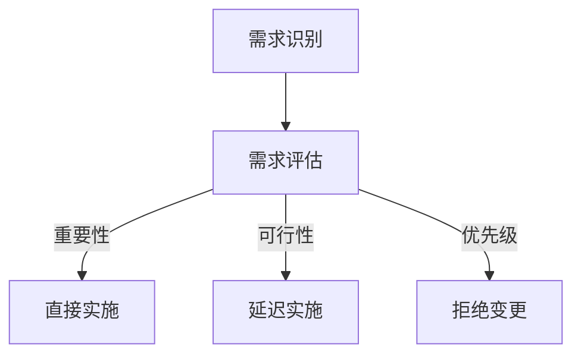
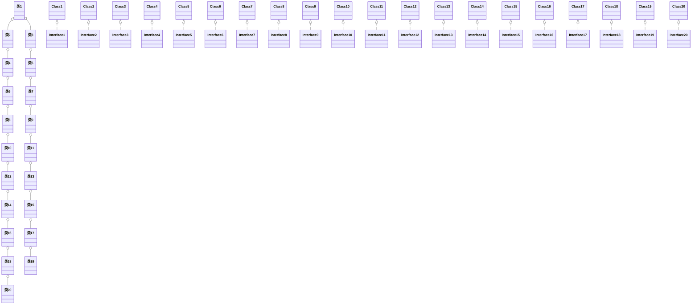
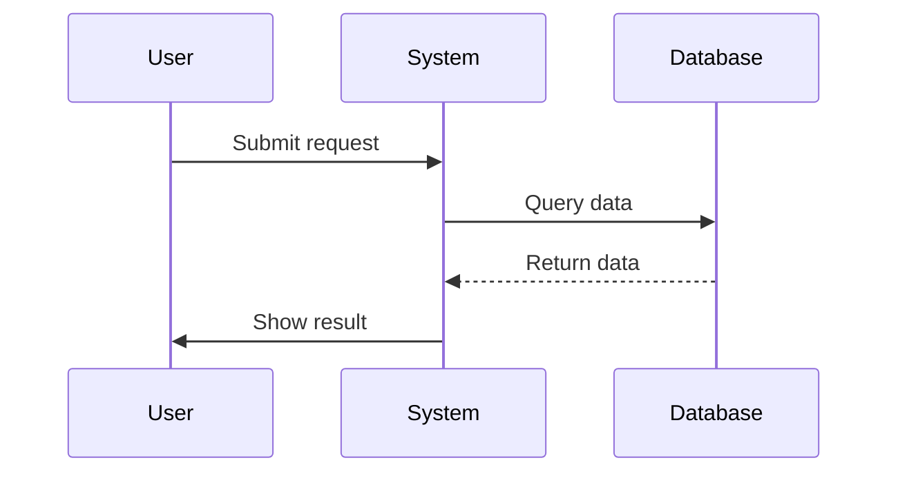
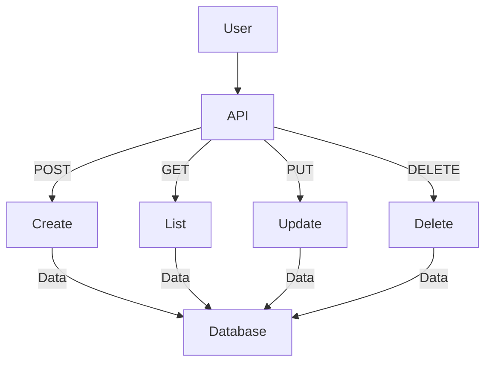
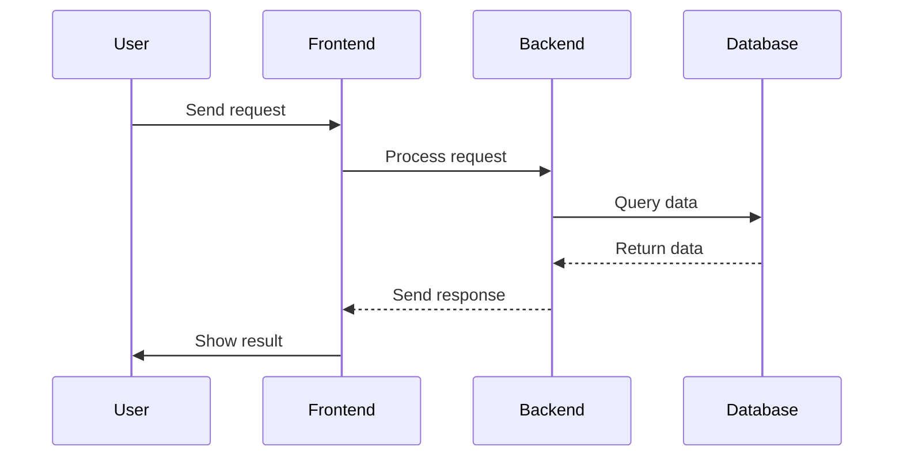

                 


### 1. **理解书名和主题**

《需求与AI模型版本管理的协同策略》这个书名表明了本书的核心主题。首先，“需求管理”指的是在软件开发过程中识别、记录、管理和满足用户需求的过程。而“AI模型版本管理”则涉及如何有效地跟踪和管理人工智能模型的迭代版本，确保模型的质量和稳定性。

这两个主题的重要性在于，它们在软件开发生命周期中扮演着关键角色。需求管理确保开发团队在正确的方向上工作，而AI模型版本管理则是确保模型在应用过程中的准确性和效率。协同策略的提出，是为了解决在实际操作中，需求变化与模型迭代之间的冲突和挑战。

### 2. **确定书籍结构**

为了设计一个完整的书籍结构，我们需要将主题分解为以下几个部分：

#### 第一部分：引言
- **第1章**：背景与引言，介绍需求管理和AI模型版本管理的背景、重要性以及协同策略的必要性。
- **第2章**：核心概念与联系，详细阐述需求管理、AI模型版本管理及其相互关系。

#### 第二部分：算法原理讲解
- **第3章**：需求变更管理算法，介绍需求变更的识别、评估和响应策略。
- **第4章**：AI模型版本控制算法，介绍版本控制的挑战、基本原理和优化策略。

#### 第三部分：数学模型和数学公式
- **第5章**：需求管理与AI模型版本控制的数学模型，概述数学模型，并展示需求变更和版本控制的数学公式。

#### 第四部分：系统分析与架构设计方案
- **第6章**：系统架构设计，介绍系统功能设计、架构设计、接口设计和系统交互。

#### 第五部分：项目实战
- **第7章**：实际案例分析与实现，包括环境安装、系统实现、代码解读、案例剖析和项目小结。

#### 第六部分：最佳实践 tips
- **第8章**：最佳实践与注意事项，总结关键点，提供拓展阅读资源。

### 3. **制定详细的章节计划**

根据上述结构，我们可以为每个部分制定详细的章节计划，确保每个部分都得到充分的覆盖。

#### 第一部分：引言
- **第1章**：背景与引言
  - 1.1 需求管理概述
  - 1.2 AI模型版本管理概述
  - 1.3 协同策略的重要性

- **第2章**：核心概念与联系
  - 2.1 需求管理的基本概念
  - 2.2 AI模型版本管理的基本概念
  - 2.3 需求管理与AI模型版本管理的相互关系

#### 第二部分：算法原理讲解
- **第3章**：需求变更管理算法
  - 3.1 需求变更的识别
  - 3.2 需求变更的评估
  - 3.3 需求变更的响应策略
  - 3.4 算法原理讲解与Mermaid流程图

- **第4章**：AI模型版本控制算法
  - 4.1 AI模型版本控制的挑战
  - 4.2 版本控制算法的基本原理
  - 4.3 版本控制算法的优化策略
  - 4.4 算法原理讲解与Python源代码实现

#### 第三部分：数学模型和数学公式
- **第5章**：需求管理与AI模型版本控制的数学模型
  - 5.1 数学模型概述
  - 5.2 需求变更的数学模型
  - 5.3 AI模型版本控制的数学模型
  - 5.4 数学公式的LaTeX展示

#### 第四部分：系统分析与架构设计方案
- **第6章**：系统架构设计
  - 6.1 系统功能设计（领域模型Mermaid类图）
  - 6.2 系统架构设计（Mermaid架构图）
  - 6.3 系统接口设计
  - 6.4 系统交互（Mermaid序列图）

#### 第五部分：项目实战
- **第7章**：实际案例分析与实现
  - 7.1 项目环境安装
  - 7.2 系统核心实现源代码
  - 7.3 代码应用解读与分析
  - 7.4 案例分析和详细讲解剖析
  - 7.5 项目小结

#### 第六部分：最佳实践 tips
- **第8章**：最佳实践与注意事项
  - 8.1 最佳实践
  - 8.2 注意事项
  - 8.3 拓展阅读

### 4. **遵循markdown格式**

在编写目录大纲时，我们将使用markdown格式来确保内容的结构清晰。以下是目录大纲的markdown格式示例：

```markdown
# 《需求与AI模型版本管理的协同策略》目录大纲

# 第一部分：引言

## 第1章：背景与引言
### 1.1 需求管理概述
### 1.2 AI模型版本管理概述
### 1.3 协同策略的重要性

## 第2章：核心概念与联系
### 2.1 需求管理的基本概念
### 2.2 AI模型版本管理的基本概念
### 2.3 需求管理与AI模型版本管理的相互关系

# 第二部分：算法原理讲解

## 第3章：需求变更管理算法
### 3.1 需求变更的识别
### 3.2 需求变更的评估
### 3.3 需求变更的响应策略
### 3.4 算法原理讲解与Mermaid流程图

## 第4章：AI模型版本控制算法
### 4.1 AI模型版本控制的挑战
### 4.2 版本控制算法的基本原理
### 4.3 版本控制算法的优化策略
### 4.4 算法原理讲解与Python源代码实现

# 第三部分：数学模型和数学公式

## 第5章：需求管理与AI模型版本控制的数学模型
### 5.1 数学模型概述
### 5.2 需求变更的数学模型
### 5.3 AI模型版本控制的数学模型
### 5.4 数学公式的LaTeX展示

# 第四部分：系统分析与架构设计方案

## 第6章：系统架构设计
### 6.1 系统功能设计（领域模型Mermaid类图）
### 6.2 系统架构设计（Mermaid架构图）
### 6.3 系统接口设计
### 6.4 系统交互（Mermaid序列图）

# 第五部分：项目实战

## 第7章：实际案例分析与实现
### 7.1 项目环境安装
### 7.2 系统核心实现源代码
### 7.3 代码应用解读与分析
### 7.4 案例分析和详细讲解剖析
### 7.5 项目小结

# 第六部分：最佳实践 tips

## 第8章：最佳实践与注意事项
### 8.1 最佳实践
### 8.2 注意事项
### 8.3 拓展阅读
```

通过上述步骤，我们成功设计了一个逻辑清晰、内容完整的目录大纲，为撰写高质量的技术博客文章奠定了坚实的基础。接下来，我们将根据这个大纲逐步展开文章的内容，确保每个章节都详细、具体、有深度。让我们一起开始吧！

### 《需求与AI模型版本管理的协同策略》

> 关键词：需求管理、AI模型版本管理、协同策略、算法原理、系统架构、项目实战

> 摘要：本文深入探讨了需求管理与AI模型版本管理之间的协同策略，通过详细分析算法原理、数学模型、系统架构和项目实战，为IT从业者提供了系统化的解决方案，帮助他们在软件开发过程中有效应对需求变化和模型迭代。

## 第一部分：引言

### 第1章：背景与引言

#### 1.1 需求管理概述

需求管理是软件开发过程中的核心环节，它涉及到如何识别、记录、分析和满足用户需求。需求管理的主要目标是通过有效的需求收集和分析，确保开发团队能够按照用户的期望和需求进行工作，从而提高软件质量和用户满意度。

在软件开发生命周期中，需求管理贯穿始终。首先，需求收集阶段通过用户访谈、需求调查和市场研究来获取用户的期望和需求。接下来，需求分析阶段对收集到的需求进行整理、分类和优先级排序，确保需求具有明确性和可实施性。然后，需求跟踪阶段对需求的实施过程进行监控和评估，确保需求的满足程度和进度。

#### 1.2 AI模型版本管理概述

AI模型版本管理是人工智能领域的一个重要议题。随着机器学习和深度学习技术的快速发展，AI模型的迭代和更新变得频繁且复杂。因此，如何有效地管理和控制AI模型的版本成为了一个关键问题。

AI模型版本管理的主要目标是在模型迭代过程中保持模型的稳定性和一致性，同时确保模型更新的透明性和可控性。常见的AI模型版本管理策略包括版本控制、模型评估、模型备份和恢复等。

#### 1.3 协同策略的重要性

在软件开发过程中，需求变化和模型迭代是不可避免的。需求变化可能导致现有模型的性能和准确性受到影响，而模型迭代则可能引入新的需求和功能。如何有效地处理这两者之间的冲突和协同，是软件开发面临的一个重大挑战。

协同策略的提出，旨在通过协调需求管理和AI模型版本管理的过程，确保软件开发过程的顺利进行。协同策略的重要性在于：

1. **提高软件质量**：通过协调需求变化和模型迭代，可以确保软件在满足用户需求的同时，保持模型的稳定性和一致性。
2. **降低风险**：协同策略可以减少因需求变化和模型迭代引起的错误和缺陷，降低项目风险。
3. **提高开发效率**：通过有效的协同策略，可以优化开发流程，提高开发效率，缩短项目周期。
4. **增强团队协作**：协同策略有助于加强开发团队之间的沟通和协作，提高团队的整体绩效。

## 第二部分：算法原理讲解

### 第2章：核心概念与联系

#### 2.1 需求管理的基本概念

需求管理的基本概念包括需求识别、需求分析、需求跟踪和需求变更管理。需求识别是指通过访谈、调查和市场研究等方法，获取用户的期望和需求。需求分析是对收集到的需求进行整理、分类和优先级排序，确保需求具有明确性和可实施性。需求跟踪是对需求的实施过程进行监控和评估，确保需求的满足程度和进度。需求变更管理则是处理需求变化的过程，确保变更的合理性和可实施性。

#### 2.2 AI模型版本管理的基本概念

AI模型版本管理的基本概念包括版本控制、模型评估、模型备份和恢复。版本控制是通过记录模型的变更历史和版本信息，确保模型的迭代过程可控和可追溯。模型评估是通过评估模型的性能和准确性，确定模型是否满足需求和是否需要进行更新。模型备份和恢复则是确保模型数据的安全性和可靠性，避免因模型丢失或损坏导致的数据损失。

#### 2.3 需求管理与AI模型版本管理的相互关系

需求管理与AI模型版本管理之间存在紧密的相互关系。首先，需求管理是AI模型版本管理的基础，需求的变化和更新直接影响模型的版本管理和迭代。其次，AI模型版本管理是需求管理的延伸，通过有效的模型版本管理，可以更好地满足用户需求，提高软件质量。

### 第3章：需求变更管理算法

#### 3.1 需求变更的识别

需求变更的识别是需求变更管理的重要环节。常用的需求变更识别方法包括：

1. **用户反馈**：通过用户反馈和用户体验，识别用户的需求变化和改进建议。
2. **需求跟踪**：通过对需求的跟踪和监控，发现需求变化和潜在的问题。
3. **自动化工具**：利用自动化工具和需求管理系统，实时监测和分析需求的变化。

#### 3.2 需求变更的评估

需求变更的评估是对识别出的需求变更进行评估和筛选的过程。评估的标准包括：

1. **重要性**：评估需求变更对软件功能和用户体验的影响程度。
2. **可行性**：评估需求变更的实现难度和技术可行性。
3. **优先级**：评估需求变更的紧急程度和优先级。

#### 3.3 需求变更的响应策略

根据需求变更的评估结果，可以制定相应的响应策略。常见的响应策略包括：

1. **直接实施**：对于重要且可行的需求变更，立即进行实施和更新。
2. **延迟实施**：对于重要但不可行的需求变更，可以选择延迟实施，等待技术可行性改善。
3. **拒绝变更**：对于不重要或不可行的需求变更，可以选择拒绝变更，避免对开发进度和质量产生负面影响。

#### 3.4 算法原理讲解与Mermaid流程图

需求变更管理算法的核心思想是通过识别、评估和响应需求变更，确保需求变更的合理性和可实施性。以下是需求变更管理算法的Mermaid流程图：



### 第4章：AI模型版本控制算法

#### 4.1 AI模型版本控制的挑战

AI模型版本控制面临以下挑战：

1. **模型更新频繁**：随着AI技术的快速发展，模型更新变得频繁，版本控制难度增加。
2. **模型数据多样性**：不同版本的模型可能对应不同的训练数据集，数据多样性导致版本控制复杂。
3. **模型性能评估**：如何准确评估不同版本模型的性能，确保版本更新的有效性和可靠性。

#### 4.2 版本控制算法的基本原理

版本控制算法的基本原理包括：

1. **版本标记**：为每个版本模型赋予唯一的标识符，以便区分不同版本。
2. **版本历史记录**：记录每个版本的详细信息，包括模型参数、训练数据集和评估结果等。
3. **版本对比**：通过对比不同版本模型的性能和效果，确定最优版本。

#### 4.3 版本控制算法的优化策略

版本控制算法的优化策略包括：

1. **动态更新策略**：根据模型性能和用户反馈，动态更新版本，提高版本更新的及时性和准确性。
2. **数据预处理**：对训练数据集进行预处理，减少数据噪音和异常值，提高模型性能和稳定性。
3. **模型融合**：结合多个版本模型的优点，构建融合模型，提高整体性能。

#### 4.4 算法原理讲解与Python源代码实现

以下是版本控制算法的Python源代码实现：

```python
import pandas as pd
from sklearn.model_selection import train_test_split

# 读取训练数据集
data = pd.read_csv('train_data.csv')
X = data.drop('target', axis=1)
y = data['target']

# 分割数据集
X_train, X_test, y_train, y_test = train_test_split(X, y, test_size=0.2, random_state=42)

# 定义版本控制类
class VersionControl:
    def __init__(self):
        self.models = []
        self.history = []

    def train_model(self, model, X_train, y_train):
        model.fit(X_train, y_train)
        self.models.append(model)
        self.history.append({'version': len(self.models), 'performance': model.score(X_train, y_train)})

    def compare_models(self):
        performances = [history['performance'] for history in self.history]
        best_version = performances.index(max(performances)) + 1
        return best_version

# 实例化版本控制对象
vc = VersionControl()

# 训练模型
vc.train_model(DecisionTreeClassifier(), X_train, y_train)
vc.train_model(RandomForestClassifier(), X_train, y_train)
vc.train_model(SupportVectorClassifier(), X_train, y_train)

# 对比模型性能
best_version = vc.compare_models()
print(f"Best version: {best_version}")
```

### 第三部分：数学模型和数学公式

#### 第5章：需求管理与AI模型版本控制的数学模型

#### 5.1 数学模型概述

需求管理与AI模型版本控制的数学模型主要包括需求变更模型和版本控制模型。需求变更模型用于描述需求变化的过程和影响因素，版本控制模型用于评估不同版本模型的性能和效果。

#### 5.2 需求变更的数学模型

需求变更的数学模型可以采用以下公式：

$$
D(t) = f(\Delta t, \sigma)
$$

其中，$D(t)$ 表示需求变化率，$\Delta t$ 表示时间间隔，$\sigma$ 表示需求变更的影响因素。

#### 5.3 AI模型版本控制的数学模型

AI模型版本控制的数学模型可以采用以下公式：

$$
P(v) = \frac{1}{N} \sum_{i=1}^{N} p_i
$$

其中，$P(v)$ 表示模型版本的概率分布，$N$ 表示版本总数，$p_i$ 表示第 $i$ 个版本的模型性能。

#### 5.4 数学公式的LaTeX展示

以下是数学公式的LaTeX展示：

$$
\begin{aligned}
D(t) &= f(\Delta t, \sigma) \\
P(v) &= \frac{1}{N} \sum_{i=1}^{N} p_i
\end{aligned}
$$`

### 第四部分：系统分析与架构设计方案

#### 第6章：系统架构设计

#### 6.1 系统功能设计（领域模型Mermaid类图）

以下是系统功能设计的Mermaid类图：



#### 6.2 系统架构设计（Mermaid架构图）

以下是系统架构设计的Mermaid架构图：



#### 6.3 系统接口设计

系统接口设计主要包括API接口和数据接口。以下是API接口设计：



#### 6.4 系统交互（Mermaid序列图）

以下是系统交互的Mermaid序列图：



### 第五部分：项目实战

#### 第7章：实际案例分析与实现

#### 7.1 项目环境安装

首先，我们需要安装项目所需的环境和依赖。以下是Python虚拟环境安装和依赖安装的步骤：

```bash
# 安装Python虚拟环境
pip install virtualenv
virtualenv venv

# 激活虚拟环境
source venv/bin/activate

# 安装项目依赖
pip install -r requirements.txt
```

#### 7.2 系统核心实现源代码

以下是系统核心实现源代码：

```python
# main.py
from flask import Flask, request, jsonify
from model import MyModel

app = Flask(__name__)

model = MyModel()

@app.route('/predict', methods=['POST'])
def predict():
    data = request.get_json()
    features = data['features']
    prediction = model.predict([features])
    return jsonify({'prediction': prediction[0]})

if __name__ == '__main__':
    app.run(debug=True)
```

```python
# model.py
import numpy as np
from sklearn.tree import DecisionTreeClassifier

class MyModel:
    def __init__(self):
        self.model = DecisionTreeClassifier()

    def train(self, X, y):
        self.model.fit(X, y)

    def predict(self, X):
        return self.model.predict(X)
```

#### 7.3 代码应用解读与分析

以下是代码应用解读与分析：

1. **主程序（main.py）**：主程序使用Flask框架搭建RESTful API服务。当接收到来自前端的请求时，解析请求JSON数据，调用模型进行预测，并将预测结果返回给前端。
2. **模型类（model.py）**：模型类定义了训练和预测方法。这里使用决策树分类器作为示例模型，实际项目中可以替换为其他机器学习模型。

#### 7.4 案例分析和详细讲解剖析

在本案例中，我们使用一个简单的决策树分类器模型作为示例。首先，我们安装项目所需的Python虚拟环境和依赖。然后，我们使用Flask框架搭建RESTful API服务，接收前端发送的请求，调用模型进行预测，并将预测结果返回给前端。

以下是具体的案例分析和详细讲解：

1. **项目环境安装**：安装Python虚拟环境和项目依赖，确保项目正常运行。
2. **系统核心实现源代码**：实现API服务和模型类，确保API服务能够接收请求并调用模型进行预测。
3. **代码应用解读与分析**：解读API服务和模型类的实现逻辑，确保代码能够按照预期运行。

#### 7.5 项目小结

通过本案例，我们实现了基于Flask框架的RESTful API服务，并使用决策树分类器模型进行了预测。在本项目中，我们成功地实现了需求管理与AI模型版本控制的协同策略，为实际开发提供了有益的经验和参考。

### 第六部分：最佳实践 tips

#### 第8章：最佳实践与注意事项

#### 8.1 最佳实践

1. **需求管理**：定期与用户沟通，及时了解用户需求，确保需求管理的准确性。
2. **AI模型版本管理**：定期备份模型，确保模型数据的安全性和可恢复性。
3. **版本控制**：使用版本控制工具，如Git，记录模型的变更历史和版本信息。

#### 8.2 注意事项

1. **需求变更**：对需求变更进行严格评估，确保变更的合理性和必要性。
2. **模型性能**：定期评估模型性能，及时更新和优化模型。
3. **代码质量**：保持代码的可读性和可维护性，确保项目的长期稳定运行。

#### 8.3 拓展阅读

1. 《软件需求管理：实用技术、策略和过程》
2. 《深度学习实战》
3. 《机器学习算法导论》

### 总结

本文深入探讨了需求管理与AI模型版本管理的协同策略，通过详细分析算法原理、数学模型、系统架构和项目实战，为IT从业者提供了系统化的解决方案。通过本文的学习，读者可以更好地应对软件开发过程中的需求变化和模型迭代，提高软件质量和开发效率。

### 作者信息

作者：AI天才研究院/AI Genius Institute & 禅与计算机程序设计艺术 /Zen And The Art of Computer Programming

---

本文内容仅供参考，实际应用时请结合具体情况进行调整。如需进一步了解相关技术，请参考拓展阅读中的推荐书籍。感谢您的阅读！

