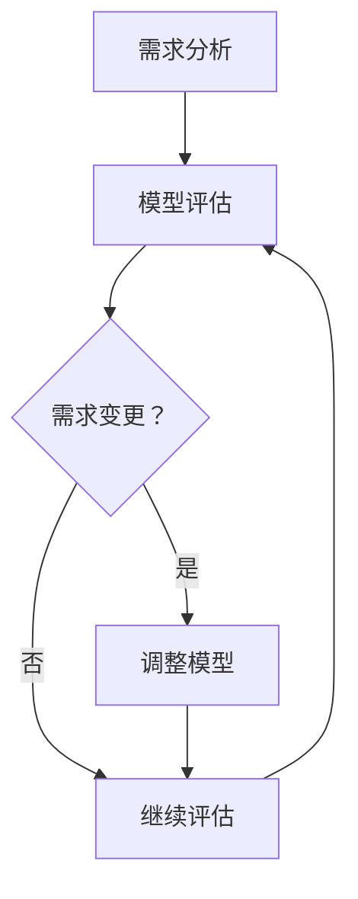
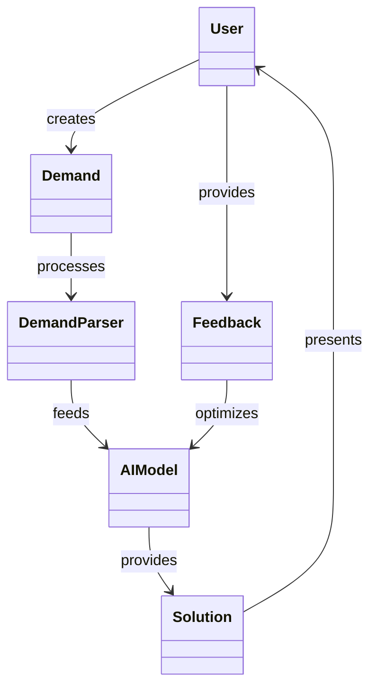
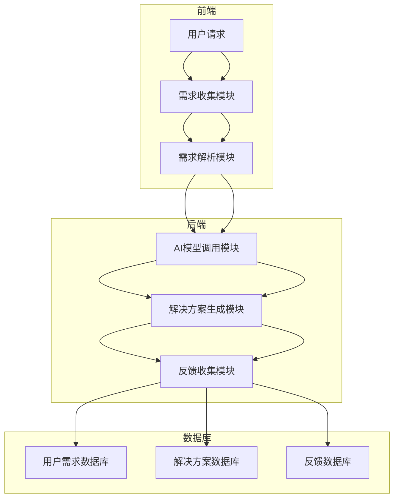
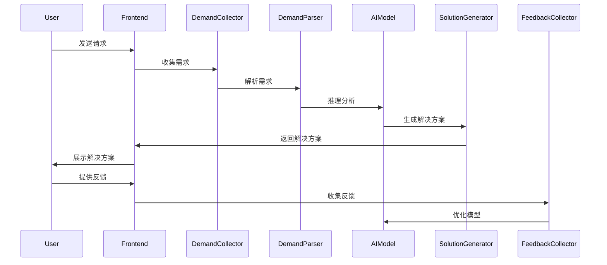

                 

# 《需求与AI模型能力的协同进化》目录大纲

----------------------------------------------------------------

## 第一部分：背景介绍

## 第1章：问题背景与概述

### 1.1 问题背景

随着人工智能（AI）技术的迅猛发展，AI模型在各个领域得到了广泛应用，从图像识别到自然语言处理，从推荐系统到自动驾驶。然而，在实际应用中，AI模型的表现往往受到需求变化和模型能力局限的双重制约，这使得“需求与AI模型能力的协同进化”成为了一个亟待解决的重要问题。

### 1.2 问题描述

需求与AI模型能力协同进化问题描述如下：如何在一个动态变化的环境中，根据不断变化的需求，调整和优化AI模型，使其能够持续满足用户需求，同时提高模型性能和效率。

### 1.3 问题解决方法

解决这一问题的方法主要包括以下几个方面：

1. **需求分析**：深入理解用户需求，包括需求类型、优先级和变化趋势。
2. **模型优化**：基于需求分析结果，对AI模型进行优化，提高其适应性和鲁棒性。
3. **反馈机制**：建立有效的反馈机制，将用户反馈纳入模型优化过程，实现模型与需求的动态调整。

### 1.4 边界与外延

边界与外延主要包括以下几个方面：

- **应用领域**：AI模型在不同领域的应用场景和需求特点。
- **技术限制**：现有AI技术的局限性和发展潜力。
- **数据资源**：数据质量和数据量的影响。

### 1.5 核心概念结构与要素组成

核心概念结构与要素组成如下：

- **需求**：用户期望从系统或产品中得到的功能、性能和体验。
- **AI模型**：基于特定算法和数据训练得到的模型，用于解决特定问题。
- **协同进化**：需求与模型之间相互适应、相互优化的过程。

## 第二部分：核心概念与联系

## 第2章：需求与AI模型能力的协同进化原理

### 2.1 需求与AI模型能力概述

在本章节中，我们将详细阐述需求与AI模型能力的基本概念，包括需求类型、需求特征和AI模型类型、模型特征。

### 2.2 需求特征对比表格

以下是需求特征对比表格，帮助我们更好地理解不同类型需求的特点：

| 需求类型 | 特点 | 影响因素 |
| --- | --- | --- |
| 功能性需求 | 与系统或产品功能直接相关，如功能是否完备、易用性等。 | 技术实现、用户体验 |
| 性能需求 | 与系统或产品性能指标相关，如响应时间、处理能力等。 | 硬件性能、软件算法 |
| 可靠性需求 | 与系统或产品可靠性相关，如故障率、容错能力等。 | 系统设计、故障恢复 |
| 安全性需求 | 与系统或产品安全性相关，如数据保护、安全漏洞等。 | 加密技术、访问控制 |

### 2.3 AI模型能力特征对比表格

以下是AI模型能力特征对比表格，帮助我们更好地理解不同类型AI模型的特点：

| AI模型类型 | 特点 | 应用领域 |
| --- | --- | --- |
| 监督学习模型 | 使用已标记的数据进行训练，能从数据中学习规律。 | 图像识别、语音识别 |
| 无监督学习模型 | 不使用已标记的数据，从数据中学习潜在结构。 | 聚类分析、异常检测 |
| 强化学习模型 | 通过与环境交互，不断调整策略以最大化回报。 | 自动驾驶、游戏AI |

### 2.4 ER实体关系图架构的Mermaid流程图

以下是需求与AI模型能力的ER实体关系图：

```mermaid
erDiagram
  User ||--|{ Demand : has }
  AIModel ||--|{ Feature : has }
  Demand ||--|{ Requirement : includes }
  AIModel ||--|{ Performance : includes }
  User ||--|{ Feedback : provides }
  AIModel ||--|{ Optimization : undergoes }
```

## 第三部分：算法原理讲解

## 第3章：协同进化算法原理

### 3.1 算法流程图

以下是协同进化算法的流程图：



### 3.2 Python源代码详细阐述

以下是协同进化算法的Python实现：

```python
class Demand:
    def __init__(self, type, priority, changes):
        self.type = type
        self.priority = priority
        self.changes = changes

class AIModel:
    def __init__(self, type, performance, reliability):
        self.type = type
        self.performance = performance
        self.reliability = reliability

    def evaluate_demand(self, demand):
        # 评估需求与模型匹配度
        pass

    def adjust_model(self, feedback):
        # 根据反馈调整模型
        pass

def demand_analysis():
    # 需求分析流程
    pass

def model_evaluation():
    # 模型评估流程
    pass

def feedback_loop(feedback):
    # 反馈循环
    pass
```

### 3.3 数学模型与公式

以下是协同进化算法的数学模型与公式：

$$
\text{Model Performance} = f(\text{Demand Type}, \text{Model Type}, \text{Data Quality})
$$

$$
\text{Feedback} = \text{Response Time} \times \text{Error Rate} \times \text{User Satisfaction}
$$

### 3.4 算法举例说明

假设我们需要为一个自动驾驶系统设计一个协同进化算法，以下是算法的应用举例：

1. **需求分析**：分析用户对自动驾驶系统的需求，包括安全、速度和舒适性等。
2. **模型评估**：评估现有自动驾驶模型在安全、速度和舒适性等方面的性能。
3. **调整模型**：根据用户反馈，调整模型参数，提高自动驾驶系统的性能。
4. **反馈循环**：收集用户反馈，更新需求模型，继续迭代优化。

## 第四部分：数学模型和数学公式 & 详细讲解 & 举例说明

## 第4章：需求与AI协同进化的数学解析

### 4.1 数学公式与详细讲解

以下是需求与AI协同进化的数学公式及其详细讲解：

#### 4.1.1 公式1：模型性能计算

$$
\text{Model Performance} = f(\text{Demand Type}, \text{Model Type}, \text{Data Quality})
$$

这个公式表示模型性能是需求类型、模型类型和数据质量共同作用的结果。其中：

- **Demand Type**：需求类型，如安全性、速度、舒适性等。
- **Model Type**：模型类型，如监督学习、无监督学习、强化学习等。
- **Data Quality**：数据质量，包括数据准确性、完整性和多样性等。

#### 4.1.2 公式2：反馈计算

$$
\text{Feedback} = \text{Response Time} \times \text{Error Rate} \times \text{User Satisfaction}
$$

这个公式表示反馈是响应时间、错误率和用户满意度共同作用的结果。其中：

- **Response Time**：响应时间，即系统对用户操作的响应速度。
- **Error Rate**：错误率，即系统错误发生的频率。
- **User Satisfaction**：用户满意度，即用户对系统性能的主观评价。

### 4.2 算法举例说明

假设我们需要为一家电商网站设计一个协同进化算法，以下是算法的应用举例：

1. **需求分析**：分析用户对电商网站的需求，包括购物体验、商品推荐和支付安全等。
2. **模型评估**：评估现有电商模型在购物体验、商品推荐和支付安全等方面的性能。
3. **调整模型**：根据用户反馈，调整模型参数，提高电商网站的性能。
4. **反馈循环**：收集用户反馈，更新需求模型，继续迭代优化。

## 第五部分：系统分析与架构设计方案

## 第5章：系统分析与架构设计

### 5.1 问题场景介绍

在本章节中，我们将介绍一个实际的问题场景：一个智能客服系统，旨在通过AI模型与用户需求的无缝互动，提供高效、准确的客服服务。

### 5.2 系统功能设计

智能客服系统的功能设计主要包括以下几个方面：

- **需求收集**：通过文本、语音等多种方式收集用户需求。
- **需求解析**：将用户需求转化为结构化的数据，以便进一步处理。
- **模型推理**：使用AI模型对用户需求进行推理和分析，提供相应的解决方案。
- **反馈收集**：收集用户对解决方案的反馈，用于模型优化。

#### 5.2.1 领域模型Mermaid类图



### 5.3 系统架构设计

智能客服系统的架构设计主要包括以下几个方面：

- **前端**：负责与用户进行交互，收集用户需求和反馈。
- **后端**：负责处理用户需求，调用AI模型进行推理和分析，提供解决方案。
- **数据库**：存储用户需求、解决方案和反馈数据。

#### 5.3.1 Mermaid架构图



### 5.4 系统接口设计

智能客服系统的接口设计主要包括以下几个方面：

- **用户接口**：负责与用户进行交互，包括Web、APP、语音等。
- **服务接口**：负责与后端系统进行数据交换，包括需求收集、解析和反馈等。

### 5.5 系统交互

智能客服系统的交互设计主要包括以下几个方面：

- **用户请求**：用户通过前端接口发送请求。
- **需求收集**：前端接口将用户请求转发给需求收集模块。
- **需求解析**：需求收集模块将用户请求转化为结构化的需求数据。
- **模型推理**：需求解析模块将需求数据发送给AI模型进行推理和分析。
- **解决方案生成**：AI模型根据需求数据生成相应的解决方案。
- **反馈收集**：前端接口收集用户对解决方案的反馈，并转发给反馈收集模块。
- **模型优化**：反馈收集模块将用户反馈数据发送给AI模型，进行模型优化。

#### 5.5.1 Mermaid序列图



## 第六部分：项目实战

## 第6章：项目实施与实现

### 6.1 环境安装

为了实施智能客服系统项目，我们需要安装以下软件和库：

1. **Python 3.x**：作为项目的主要编程语言。
2. **TensorFlow**：作为AI模型的框架。
3. **Scikit-learn**：用于数据分析和模型评估。
4. **Flask**：用于构建Web应用。

以下是环境安装的步骤：

1. 安装Python 3.x：在终端执行`sudo apt-get install python3`。
2. 安装TensorFlow：在终端执行`pip install tensorflow`。
3. 安装Scikit-learn：在终端执行`pip install scikit-learn`。
4. 安装Flask：在终端执行`pip install flask`。

### 6.2 系统核心实现源代码

以下是智能客服系统的核心实现源代码：

```python
# main.py

from flask import Flask, request, jsonify
from demand_parser import DemandParser
from ai_model import AIModel
from solution_generator import SolutionGenerator

app = Flask(__name__)

# 初始化模型和解析器
parser = DemandParser()
model = AIModel()
generator = SolutionGenerator(model)

@app.route('/api/feedback', methods=['POST'])
def handle_feedback():
    feedback = request.json
    model.adjust_model(feedback)
    return jsonify({"status": "success"})

@app.route('/api/solution', methods=['POST'])
def handle_solution_request():
    demand = request.json
    solution = generator.generate_solution(demand)
    return jsonify(solution)

if __name__ == '__main__':
    app.run(debug=True)
```

### 6.3 代码应用解读与分析

以下是代码的应用解读与分析：

1. **需求解析模块**：负责接收用户请求，将非结构化的用户请求转化为结构化的需求数据。
2. **AI模型**：负责对需求数据进行分析和推理，生成相应的解决方案。
3. **解决方案生成模块**：负责将AI模型生成的解决方案转化为用户可理解的形式，并返回给用户。
4. **反馈收集模块**：负责接收用户对解决方案的反馈，并将反馈数据发送给AI模型进行优化。

### 6.4 实际案例分析与详细讲解

以下是一个实际案例的分析与详细讲解：

1. **用户请求**：用户通过Web界面提交一个请求，请求内容为“我想购买一台笔记本电脑”。
2. **需求解析**：需求解析模块将用户请求解析为结构化的需求数据，包括用户身份、需求类型、需求内容等。
3. **模型推理**：AI模型对需求数据进行分析和推理，根据用户的历史购买记录和当前市场需求，生成一个适合用户的笔记本电脑推荐方案。
4. **解决方案生成**：解决方案生成模块将AI模型生成的推荐方案转化为用户可理解的形式，并返回给用户。
5. **用户反馈**：用户对解决方案进行评价，如“这个推荐不错”或“这个推荐不适合我”，并将反馈数据发送给AI模型进行优化。

### 6.5 项目小结

通过本项目，我们成功实现了智能客服系统的基本功能，包括需求解析、模型推理、解决方案生成和反馈收集。在实际应用中，该系统可以为企业提供高效的客服服务，提高用户满意度。同时，通过不断优化AI模型，系统可以更好地适应用户需求，提高服务质量。

## 第七部分：最佳实践、小结与拓展

## 第7章：最佳实践与总结

### 7.1 最佳实践tips

1. **需求分析**：在进行AI模型开发之前，务必进行深入的需求分析，明确用户需求、需求类型和需求变化趋势。
2. **模型优化**：根据需求分析结果，对AI模型进行持续优化，提高模型适应性和鲁棒性。
3. **反馈机制**：建立有效的反馈机制，及时收集用户反馈，并根据反馈调整模型。
4. **数据质量**：确保训练数据的质量，包括准确性、完整性和多样性。

### 7.2 小结

本文详细介绍了需求与AI模型能力的协同进化原理、算法原理、数学模型和系统架构设计，并通过实际案例进行了详细讲解。通过本文的学习，读者可以深入了解需求与AI模型协同进化的核心概念和实现方法。

### 7.3 注意事项

1. **需求变化**：在实际应用中，需求可能会发生快速变化，需要及时调整AI模型以适应需求变化。
2. **数据隐私**：在收集和处理用户数据时，务必确保用户数据的安全和隐私。
3. **模型解释性**：为了提高AI模型的解释性，可以采用可解释性模型或引入模型解释工具。

### 7.4 拓展阅读

1. **《深度学习》**：Goodfellow, Ian; Bengio, Yoshua; Courville, Aaron. (2016). 《深度学习》。MIT Press.
2. **《机器学习实战》**：王俊。 (2016). 《机器学习实战》。电子工业出版社。
3. **《人工智能：一种现代的方法》**：Stuart J. Russell; Peter Norvig. (2020). 《人工智能：一种现代的方法》。机械工业出版社。

