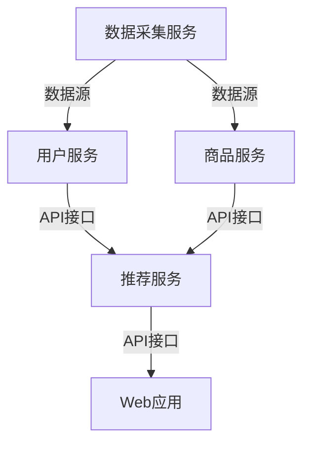
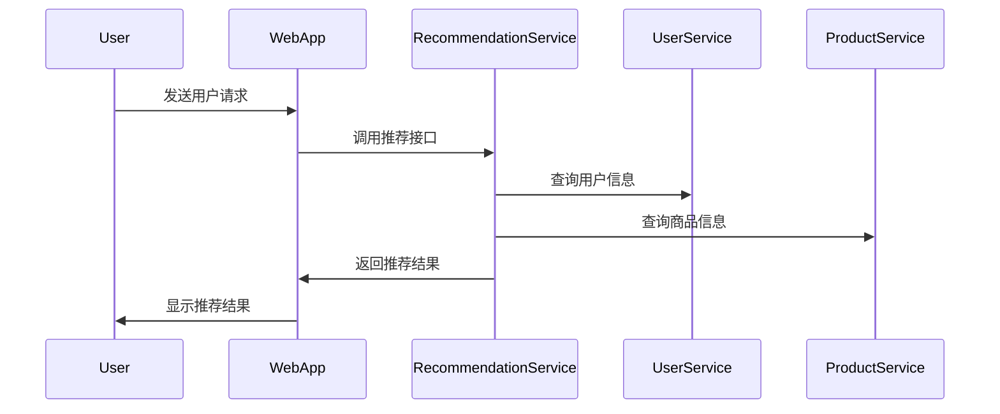

                 

### 第一部分：引言

#### 第1章：引言

##### 1.1 问题背景

在当今科技迅速发展的时代，人工智能（AI）已经成为推动产业变革的重要力量。AI大模型，作为人工智能的核心技术，正在逐步改变着各行各业的生产和服务模式。从自然语言处理到计算机视觉，从推荐系统到自动驾驶，AI大模型的应用已经深入到社会的各个方面。

然而，随着AI技术的不断发展，如何协调需求与AI模型迭代周期，实现高效的大模型应用开发，成为当前亟待解决的问题。一方面，用户需求变化迅速，要求AI模型能够快速迭代和更新，以满足不断变化的市场需求。另一方面，AI模型的迭代周期往往较长，从数据收集、模型训练到模型评估和部署，每一个环节都需要大量的时间和资源。这种矛盾使得企业在实现高效开发的过程中面临巨大的挑战。

##### 1.2 问题描述

需求变化迅速，导致AI模型迭代周期变长，影响应用开发的效率和质量。当市场需求迅速变化时，如果AI模型无法及时更新和迭代，就会导致应用无法满足用户需求，从而影响企业的竞争力。此外，AI模型迭代周期过长，也意味着企业在市场中的响应速度变慢，可能导致错失市场机遇。

另一方面，AI模型迭代周期过长，可能导致市场需求无法及时满足。在快速发展的市场中，用户需求往往具有多变性和不确定性。如果AI模型无法及时响应这些变化，就会导致市场需求得不到满足，从而影响企业的业务发展。

##### 1.3 问题解决

为了解决上述问题，我们需要从以下几个方面入手：

1. **深入分析需求**：通过对用户需求的深入分析，明确用户需求的特点和变化趋势，为AI模型的迭代提供方向。
2. **优化迭代流程**：通过优化AI模型的迭代流程，缩短迭代周期，提高开发效率。例如，采用分布式计算、数据预处理优化等技术手段，加快模型训练和评估的速度。
3. **引入敏捷开发理念**：在AI模型开发过程中引入敏捷开发理念，灵活调整需求与迭代节奏，提高响应速度。通过迭代和反馈机制，不断调整和优化模型，使其更好地满足市场需求。
4. **建立协调机制**：建立需求与AI模型迭代周期的协调机制，确保需求与模型迭代的有效衔接。通过有效的沟通和协作，确保需求能够及时反馈到模型迭代过程中，同时保证模型迭代过程能够满足需求。

##### 1.4 边界与外延

本书的讨论范围主要涵盖AI大模型在应用开发中的节奏把控。具体包括自然语言处理、计算机视觉、推荐系统等领域。然而，这些讨论不仅限于理论分析，还将结合实际案例和经验，提供具体的解决方案和最佳实践。

##### 1.5 概念结构与核心要素组成

为了更好地理解需求与AI模型迭代周期的协调，我们需要明确以下几个核心概念和要素：

1. **需求分析**：需求分析是整个开发过程的基础。通过对用户需求的深入分析，明确应用目标，为AI模型开发提供方向。
2. **模型设计**：模型设计是构建AI模型的关键步骤。选择合适的算法和架构，设计出能够满足需求的高效模型。
3. **模型训练**：模型训练是模型开发的核心环节。通过大量的数据训练模型，优化模型性能，使其更好地满足需求。
4. **模型评估**：模型评估是对模型效果进行验证和评估的重要步骤。通过评估模型性能，确保其能够满足需求，并发现潜在的问题和改进空间。
5. **模型部署**：模型部署是将模型应用到实际场景的关键步骤。通过部署模型，实现应用并满足用户需求。

##### 1.6 本章小结

本章对本书的核心问题进行了详细阐述，为后续章节的内容奠定了基础。在接下来的章节中，我们将深入探讨需求分析与AI模型迭代周期的具体实现方法和策略，提供具体的解决方案和最佳实践。通过系统化和结构化的分析，我们希望能够帮助读者更好地理解和应对需求与AI模型迭代周期的协调问题。

## 第二部分：需求分析

### 第2章：需求分析

#### 2.1 用户需求概述

用户需求是AI模型应用开发的核心驱动力。用户需求来源广泛，包括用户反馈、市场调研、竞争对手分析等。用户需求的特点主要体现在以下方面：

1. **多样性**：用户需求具有多样性，不同的用户群体、不同的应用场景、不同的业务需求都会产生不同的需求。
2. **动态性**：用户需求是动态变化的，随着市场环境、技术发展、用户习惯的变化，需求也会发生相应的变化。
3. **差异性**：用户需求之间存在显著的差异性，不同用户对于相同功能的期望和需求可能完全不同。

为了更好地理解用户需求，我们需要从以下几个方面进行概述：

1. **需求来源**：需求来源主要包括用户反馈、市场调研、竞争对手分析等。通过收集和分析用户反馈，可以了解用户实际需求和使用痛点，从而为AI模型开发提供参考。市场调研可以了解市场趋势和用户需求的变化，为模型开发提供方向。竞争对手分析可以了解竞争对手的产品和功能，发现自身产品的不足和改进空间。
2. **需求分类**：用户需求可以分为功能性需求和非功能性需求。功能性需求是指用户期望产品实现的具体功能，如文本分类、图像识别、推荐系统等。非功能性需求是指用户对于产品性能、可靠性、易用性等方面的期望，如低延迟、高准确性、良好的用户体验等。
3. **需求特点**：用户需求的特点主要体现在多样性和动态性上。多样性意味着我们需要为不同用户群体、不同应用场景和不同业务需求设计相应的功能模块。动态性意味着我们需要根据市场需求的变化，及时调整和优化产品功能。

#### 2.2 需求分析的方法与技术

需求分析是AI模型应用开发的第一步，也是至关重要的一步。正确理解和分析用户需求，能够为后续的模型设计和开发提供明确的指导。以下介绍几种常见的需求分析方法和技术：

1. **访谈**：访谈是一种直接与用户进行沟通的方式，可以通过面对面的交流，深入了解用户的需求、期望和痛点。访谈可以采用结构化访谈和开放式访谈两种形式。结构化访谈通常提前准备问题列表，确保问题覆盖全面，而开放式访谈则更灵活，可以根据用户的回答进一步深入探讨。
2. **问卷调查**：问卷调查是一种通过书面形式收集用户需求的方式，可以大规模收集用户意见和反馈。问卷调查的设计需要充分考虑问题的清晰性和针对性，确保用户能够准确理解问题并给出真实的反馈。问卷调查可以通过线上和线下两种方式进行，例如通过邮件、社交媒体、在线调查平台等。
3. **用户故事地图**：用户故事地图是一种可视化工具，用于描述用户需求和应用场景。用户故事地图通过图表和文字的形式，展示用户在不同场景下的需求和行为，有助于开发团队更好地理解用户需求，并基于用户需求进行功能设计。
4. **用户旅程图**：用户旅程图是一种描述用户在使用产品过程中所经历的各个阶段和体验的工具。通过用户旅程图，可以清晰地了解用户在使用产品时的痛点、需求和满意度，从而为产品改进提供参考。

#### 2.3 用户需求建模

用户需求建模是将用户需求转化为具体模型的过程，是需求分析的重要环节。以下介绍几种常见的用户需求建模方法：

1. **需求实体关系图（ER图）**：需求实体关系图是一种用于描述用户需求实体及其关系的图形表示方法。通过ER图，可以清晰地表达用户需求中的实体、属性和关系，为后续的模型设计和开发提供参考。例如，在构建一个电子商务平台时，可以定义用户、商品、订单等实体，以及它们之间的关系，如用户下单、订单包含商品等。
2. **用户故事地图**：用户故事地图是一种用于描述用户需求和应用场景的可视化工具。通过用户故事地图，可以直观地展示用户在不同场景下的需求和行为，有助于开发团队更好地理解用户需求，并基于用户需求进行功能设计。用户故事地图通常包括用户角色、用户场景、用户需求和功能模块等元素。
3. **用例图**：用例图是一种用于描述系统功能及其使用者的图形表示方法。通过用例图，可以清晰地表达系统的功能模块、参与者及其交互关系，有助于开发团队理解系统的功能和设计。例如，在一个在线购物平台中，可以定义用户注册、登录、浏览商品、下单等用例，以及用户和系统的交互关系。

#### 2.4 需求优先级排序

在需求分析过程中，如何对需求进行优先级排序是一个重要的问题。以下介绍几种常见的需求优先级排序方法：

1. **Kano模型**：Kano模型是一种基于用户满意度的需求优先级排序方法。Kano模型将需求分为五种类型：必备型需求、性能型需求、诱因型需求、无差异型需求和逆向型需求。通过对需求进行分类，可以明确哪些需求是必备的、哪些需求是可优化和可延迟的，从而为需求优先级排序提供参考。
2. **MoSCoW方法**：MoSCoW方法是一种基于需求的重要性和紧急性的需求优先级排序方法。MoSCoW方法将需求分为四个优先级：必备（Must-have）、应该有（Should-have）、可以有（Could-have）和无需考虑（Won't-have）。通过评估需求的重要性和紧急性，可以确定需求的优先级。
3. **WBS（工作分解结构）方法**：WBS方法是一种基于项目目标和任务的优先级排序方法。通过将项目目标分解为具体任务，并评估每个任务的重要性和紧急性，可以确定任务的优先级。在需求分析过程中，可以使用WBS方法将用户需求分解为具体的任务，并确定任务的优先级。

#### 2.5 需求变更管理

需求变更是软件开发过程中常见的问题。需求变更不仅会影响项目进度和成本，还可能影响产品的质量和稳定性。以下介绍需求变更管理的方法和流程：

1. **变更原因分析**：需求变更的原因可能包括市场变化、技术进步、用户反馈、法律法规等。通过对变更原因进行分析，可以明确变更的原因和影响，为变更管理提供依据。
2. **变更控制流程**：变更控制流程包括变更提出、变更评估、变更审批和变更实施等环节。在变更提出阶段，相关利益相关者可以提出变更需求；在变更评估阶段，对变更的影响进行评估，包括成本、进度、质量等方面；在变更审批阶段，对变更进行审批，确保变更符合项目目标和需求；在变更实施阶段，根据审批结果，进行相应的变更实施。
3. **变更日志管理**：变更日志是记录变更过程的重要工具。通过变更日志，可以清晰地记录每个变更的提出、评估、审批和实施情况，确保变更过程透明和可控。变更日志应包括变更描述、变更原因、变更影响、变更审批结果和变更实施情况等信息。

#### 2.6 本章小结

本章对用户需求进行了详细分析，介绍了需求分析的方法与技术、用户需求建模、需求优先级排序和需求变更管理等内容。通过本章的学习，读者可以了解用户需求的多样性和动态性，掌握需求分析的方法和工具，为后续的AI模型迭代周期协调提供基础。在需求分析过程中，深入理解和分析用户需求，是确保AI模型应用开发成功的关键。

## 第三部分：AI模型迭代周期

### 第3章：AI模型迭代周期

#### 3.1 AI模型迭代周期概述

AI模型迭代周期是指从模型构建到部署的全过程，包括数据收集、模型设计、模型训练、模型评估和模型部署等环节。每个环节都至关重要，直接影响模型的效果和开发效率。以下是对AI模型迭代周期的概述：

1. **数据收集**：数据收集是模型迭代周期的第一步，也是最重要的一步。数据的质量和数量直接影响模型的性能和效果。数据收集的过程包括数据来源的选择、数据采集方法和数据预处理等。

2. **模型设计**：在数据收集完成后，需要对模型进行设计。模型设计包括选择合适的算法、确定模型的架构和参数设置等。模型设计的目标是构建一个能够有效解决实际问题的模型。

3. **模型训练**：模型设计完成后，进入模型训练阶段。模型训练是通过大量的数据进行训练，使得模型能够学会对输入数据进行预测或分类。模型训练的过程包括超参数调优、模型优化和损失函数选择等。

4. **模型评估**：模型训练完成后，需要进行模型评估。模型评估是通过测试集和验证集对模型的效果进行评估，确保模型能够满足需求。模型评估的指标包括准确率、召回率、F1值等。

5. **模型部署**：模型评估完成后，将模型部署到生产环境中，实现实际应用。模型部署的过程包括模型容器化、部署到服务器、监控和运维等。

#### 3.2 数据收集与处理

数据收集是AI模型迭代周期的第一步，也是至关重要的一步。数据的质量和数量直接影响模型的性能和效果。以下是对数据收集与处理的具体讨论：

1. **数据来源**：数据来源可以分为公开数据集、企业内部数据和第三方数据源等。公开数据集如ImageNet、CIFAR-10等，企业内部数据如用户行为数据、交易数据等，第三方数据源如API数据、传感器数据等。

2. **数据采集方法**：数据采集方法包括手动采集、自动化采集和API接口等。手动采集适用于小规模数据的采集，自动化采集适用于大规模数据的采集，API接口适用于通过第三方服务获取数据。

3. **数据预处理**：数据预处理是数据收集后的关键步骤，包括数据清洗、数据转换和数据增强等。数据清洗用于去除无效数据、处理异常值等；数据转换用于将数据格式转换为适合模型训练的格式；数据增强用于增加数据的多样性，提高模型的泛化能力。

#### 3.3 模型训练与优化

模型训练是AI模型迭代周期的核心环节，直接影响模型的性能和效果。以下是对模型训练与优化的具体讨论：

1. **模型训练方法**：模型训练方法包括监督学习、无监督学习和强化学习等。监督学习适用于有标签的数据集，无监督学习适用于无标签的数据集，强化学习适用于需要通过试错学习策略的情境。

2. **超参数调优**：超参数是模型训练过程中需要手动调整的参数，如学习率、批量大小、正则化参数等。超参数调优的目的是找到最优的超参数组合，提高模型性能。

3. **模型优化**：模型优化是提高模型性能的重要手段，包括模型架构优化、损失函数优化和优化算法优化等。模型架构优化通过改进模型的网络结构，提高模型的表达能力；损失函数优化通过改进损失函数，提高模型的收敛速度；优化算法优化通过改进训练算法，提高模型训练效率。

4. **正则化**：正则化是一种防止模型过拟合的方法，包括L1正则化、L2正则化和Dropout等。正则化通过增加模型的复杂度，提高模型的泛化能力。

#### 3.4 模型评估与验证

模型评估是模型迭代周期的重要环节，通过评估模型的效果，确保模型能够满足需求。以下是对模型评估与验证的具体讨论：

1. **评估指标**：评估指标是衡量模型效果的重要工具，包括准确率、召回率、F1值、AUC值等。准确率是模型预测正确的比例；召回率是模型能够召回的实际正例的比例；F1值是准确率和召回率的调和平均值；AUC值是曲线下面积，用于衡量分类模型的分类能力。

2. **交叉验证**：交叉验证是一种常用的模型验证方法，通过将数据集划分为多个子集，进行多次训练和验证，提高模型评估的准确性和稳定性。

3. **验证集划分**：验证集划分是将数据集划分为训练集和验证集，用于模型训练和评估。通过验证集划分，可以评估模型在未知数据上的性能，确保模型泛化能力。

4. **模型调优**：模型调优是通过对模型参数进行调整，提高模型性能的过程。通过模型评估，发现模型的不足之处，然后通过调优，改进模型性能。

#### 3.5 模型迭代策略

模型迭代策略是指导模型迭代过程的重要策略，通过合理的迭代策略，可以缩短模型迭代周期，提高开发效率。以下是对模型迭代策略的具体讨论：

1. **迭代周期**：迭代周期是指模型从一个版本迭代到下一个版本所需的时间。合理的迭代周期应考虑模型复杂度、数据质量和开发资源等因素。

2. **迭代频率**：迭代频率是指模型进行迭代操作的次数。高迭代频率可以提高模型更新速度，但可能降低模型稳定性。低迭代频率可以提高模型稳定性，但可能降低模型更新速度。

3. **迭代方法**：迭代方法包括手动迭代和自动化迭代等。手动迭代需要人工干预，适用于模型复杂度较低的场景；自动化迭代通过自动化脚本和工具，实现模型自动迭代，适用于模型复杂度较高的场景。

4. **迭代监控**：迭代监控是监控模型迭代过程和性能的重要手段，包括模型训练进度、模型评估指标、资源使用情况等。通过迭代监控，可以及时发现和解决问题，确保迭代过程顺利进行。

#### 3.6 本章小结

本章对AI模型迭代周期进行了详细讨论，包括数据收集与处理、模型训练与优化、模型评估与验证、模型迭代策略等环节。通过本章的学习，读者可以了解AI模型迭代周期的关键环节和策略，为后续章节的内容提供基础。在AI模型开发过程中，深入理解和掌握迭代周期的各个环节，是确保模型性能和开发效率的重要保障。

## 第四部分：需求与AI模型迭代周期的协调

### 第4章：需求与AI模型迭代周期的协调

#### 4.1 协调机制设计

在AI模型应用开发过程中，需求与AI模型迭代周期的协调至关重要。协调机制的设计原则和方法如下：

1. **需求管理**：需求管理是协调机制的核心，包括需求收集、需求分析、需求优先级排序和需求变更管理。需求管理应确保需求的准确性和一致性，为模型迭代提供明确的方向。

2. **迭代计划**：迭代计划是协调机制的重要环节，包括迭代周期规划、迭代目标设定、迭代任务分配和迭代进度监控。迭代计划应考虑需求响应时间、模型迭代周期和开发资源等因素，确保迭代过程高效、有序。

3. **需求与模型反馈机制**：建立需求与模型反馈机制，通过定期会议、邮件、即时通讯等方式，确保需求与模型迭代过程的实时沟通和反馈。通过反馈机制，可以及时了解模型迭代过程中存在的问题，调整需求和模型迭代计划。

4. **敏捷开发**：引入敏捷开发理念，灵活调整需求与迭代节奏。通过迭代和反馈机制，不断调整和优化模型，使其更好地满足市场需求。敏捷开发强调快速响应变化，提高开发效率。

#### 4.2 需求响应与迭代节奏调整

在AI模型迭代过程中，需求响应与迭代节奏的调整是确保模型能够满足市场需求的关键。以下方法可以用于需求响应与迭代节奏的调整：

1. **快速迭代**：通过缩短迭代周期，加快模型迭代速度，提高需求响应能力。快速迭代可以及时发现和解决问题，确保模型不断优化。

2. **需求分解**：将复杂的需求分解为多个可实现的子需求，逐一实现和迭代。通过需求分解，可以降低需求实现的难度，提高迭代效率。

3. **需求优先级排序**：根据需求的紧急性和重要性，对需求进行优先级排序，确保关键需求优先得到实现。通过需求优先级排序，可以优化迭代节奏，确保关键需求得到及时响应。

4. **迭代节奏调整**：根据模型迭代过程中的实际情况，灵活调整迭代节奏。当需求变化较大或遇到技术难题时，可以适当延长迭代周期，确保模型迭代质量。

#### 4.3 需求与模型的匹配度评估

需求与模型的匹配度评估是确保模型满足需求的重要手段。以下方法可以用于需求与模型的匹配度评估：

1. **需求分析结果对比**：将需求分析结果与模型设计结果进行对比，检查需求是否得到满足。通过对比分析，可以发现模型设计与需求之间的差异，为模型优化提供方向。

2. **用户反馈**：收集用户对模型效果的反馈，评估模型是否满足用户需求。通过用户反馈，可以了解模型的实际效果，发现存在的问题，为模型优化提供依据。

3. **模型评估指标**：使用模型评估指标，如准确率、召回率、F1值等，评估模型在各个需求场景下的表现。通过模型评估指标，可以量化模型满足需求的程度，为模型优化提供参考。

4. **多维度评估**：从多个维度对需求与模型匹配度进行评估，包括功能匹配度、性能匹配度、用户体验匹配度等。通过多维度评估，可以全面了解模型满足需求的程度，为模型优化提供综合参考。

#### 4.4 协调机制实施与优化

协调机制的实施与优化是确保需求与AI模型迭代周期协调的关键。以下措施可以用于协调机制的实施与优化：

1. **建立跨部门协作**：建立跨部门的协作机制，确保需求管理、模型开发、测试和运维等各个环节的协同工作。通过跨部门协作，可以提高协调效率，确保需求与模型迭代周期的协调。

2. **定期回顾与总结**：定期对协调机制的实施效果进行回顾和总结，识别存在的问题和改进空间。通过回顾与总结，可以不断完善协调机制，提高需求与模型迭代周期的协调水平。

3. **持续改进**：持续改进是协调机制优化的重要手段。通过收集用户反馈、分析模型性能、总结经验教训等，不断优化协调机制，提高需求与模型迭代周期的协调效果。

4. **引入最佳实践**：引入国内外先进的需求与模型迭代协调的最佳实践，借鉴成功经验和案例，提高协调机制的实用性和效果。通过引入最佳实践，可以快速提升协调机制的实施水平。

#### 4.5 本章小结

本章对需求与AI模型迭代周期的协调机制进行了详细讨论，包括协调机制设计、需求响应与迭代节奏调整、需求与模型的匹配度评估、协调机制实施与优化等。通过本章的学习，读者可以了解需求与AI模型迭代周期协调的重要性，掌握协调机制的设计和实施方法，为AI模型应用开发提供有力支持。在未来的AI模型应用开发中，需求与模型迭代周期的协调将是实现高效开发的关键因素。

### 第五部分：实践与总结

#### 第5章：实践与总结

##### 5.1 实践场景

在当今快速变化的市场环境中，企业需要不断更新和优化其AI模型，以满足不断变化的需求。以下是我们在实际项目中的一个典型场景：

某电子商务公司希望通过AI模型推荐系统，为用户提供个性化的商品推荐。随着用户群体的扩大和业务需求的增加，公司需要不断调整和优化推荐模型，以保持其在市场中的竞争力。

##### 5.2 系统介绍

该项目是一个基于深度学习的推荐系统，其主要功能是：

1. **用户行为分析**：通过分析用户的历史行为数据，如浏览记录、购买记录等，了解用户的兴趣和偏好。
2. **商品特征提取**：提取商品的特征信息，如商品类别、价格、折扣等，用于构建推荐模型。
3. **个性化推荐**：根据用户的行为和商品特征，为每个用户生成个性化的商品推荐列表。

##### 5.3 系统功能设计

在系统功能设计方面，我们采用了领域驱动设计（DDD）的方法，定义了以下领域模型：

1. **用户领域**：包括用户信息、用户行为等实体。
2. **商品领域**：包括商品信息、商品特征等实体。
3. **推荐领域**：包括推荐策略、推荐结果等实体。

以下是用户领域的Mermaid类图：

```mermaid
classDiagram
    User <<entity>>
    User : id, name, age, gender, behaviors
    User Behaviors <<entity>>
    User Behaviors : browsing, purchasing
    User "1" --|> User Behaviors
```

##### 5.4 系统架构设计

在系统架构设计方面，我们采用了微服务架构，将系统划分为多个独立的服务模块，包括用户服务、商品服务、推荐服务、数据采集服务等。以下是系统的Mermaid架构图：



##### 5.5 系统接口设计

在系统接口设计方面，我们定义了以下主要接口：

1. **用户接口**：包括用户信息查询、用户行为记录等接口。
2. **商品接口**：包括商品信息查询、商品特征更新等接口。
3. **推荐接口**：包括推荐结果查询、推荐策略更新等接口。

以下是推荐接口的Mermaid序列图：



##### 5.6 代码实现与分析

在代码实现方面，我们使用Python和TensorFlow框架构建了推荐模型。以下是模型训练的主要步骤和Python代码：

1. **数据预处理**：
```python
import tensorflow as tf
import numpy as np

# 加载用户和商品数据
users = np.load('users.npy')
products = np.load('products.npy')

# 数据标准化
users_normalized = (users - np.mean(users)) / np.std(users)
products_normalized = (products - np.mean(products)) / np.std(products)
```

2. **构建模型**：
```python
# 构建深度学习模型
model = tf.keras.Sequential([
    tf.keras.layers.Dense(128, activation='relu', input_shape=(users.shape[1],)),
    tf.keras.layers.Dense(64, activation='relu'),
    tf.keras.layers.Dense(products.shape[1], activation='sigmoid')
])

# 编译模型
model.compile(optimizer='adam', loss='binary_crossentropy', metrics=['accuracy'])

# 训练模型
model.fit(users_normalized, products_normalized, epochs=10, batch_size=64)
```

3. **模型评估**：
```python
# 评估模型
loss, accuracy = model.evaluate(users_normalized, products_normalized)
print(f'测试集准确率：{accuracy:.2f}')
```

通过上述代码，我们实现了用户行为数据与商品特征数据的预处理，构建了深度学习推荐模型，并进行了模型训练和评估。在实际应用中，我们需要根据用户反馈和业务需求，不断调整和优化模型，以提高推荐效果。

##### 5.7 实际案例分析

在项目实施过程中，我们遇到了以下挑战：

1. **数据质量问题**：用户行为数据和商品特征数据存在噪声、缺失和不一致性等问题，影响了模型的训练效果。我们通过数据清洗、数据增强和异常值处理等方法，提高了数据质量。

2. **模型过拟合**：在模型训练过程中，模型容易过拟合训练数据，导致在测试数据上表现不佳。我们通过正则化、数据增强和调整学习率等方法，降低了模型过拟合的风险。

3. **需求变化**：随着业务的发展和用户需求的变化，我们需要不断调整推荐策略和模型参数，以保持模型的竞争力。通过引入敏捷开发理念，我们实现了快速迭代和优化。

通过以上案例分析，我们总结了以下经验教训：

1. **数据质量是模型训练的关键**：保证数据质量，是提高模型效果的基础。

2. **模型优化需要持续进行**：通过不断调整和优化模型，可以逐步提高模型性能。

3. **需求变化需要快速响应**：在快速变化的市场环境中，需求与模型的协调是关键。

##### 5.8 项目小结

通过本项目的实施，我们成功构建了一个基于深度学习的推荐系统，满足了电子商务公司的个性化推荐需求。在项目过程中，我们深刻认识到需求与AI模型迭代周期协调的重要性，以及数据质量、模型优化和需求响应等因素对项目成功的影响。未来，我们将继续优化推荐系统，提升用户体验，为公司在市场中保持竞争力提供支持。

### 第六部分：最佳实践与总结

#### 第6章：最佳实践与总结

##### 6.1 最佳实践

在需求与AI模型迭代周期的协调过程中，以下最佳实践可以显著提高开发效率和模型性能：

1. **敏捷开发**：引入敏捷开发方法，通过快速迭代和反馈，确保模型能够及时响应需求变化，同时保持开发过程的高效和灵活。

2. **数据质量管理**：确保数据质量，通过数据清洗、数据增强和异常值处理等方法，提高模型的训练效果和泛化能力。

3. **需求优先级排序**：根据需求的重要性和紧迫性，对需求进行优先级排序，确保关键需求优先得到实现，提高模型对市场的响应速度。

4. **持续集成与持续部署**：采用CI/CD流程，自动化测试和部署，确保模型迭代过程的高效和稳定，减少手动操作的风险和误差。

5. **模型监控与反馈**：建立模型监控机制，实时监控模型性能和运行状态，及时发现问题并进行优化，确保模型始终处于最佳状态。

6. **跨部门协作**：建立跨部门的协作机制，确保需求管理、模型开发、测试和运维等环节的紧密配合，提高协调效率，减少沟通成本。

##### 6.2 小结

本章总结了需求与AI模型迭代周期的协调过程中的最佳实践，包括敏捷开发、数据质量管理、需求优先级排序、持续集成与持续部署、模型监控与反馈和跨部门协作等方面。这些最佳实践不仅能够提高开发效率和模型性能，还能够确保模型对市场需求的快速响应，为企业在竞争激烈的市场中保持优势提供有力支持。在未来的AI模型应用开发中，深入理解和运用这些最佳实践，将是实现高效开发的关键。

##### 6.3 注意事项

在需求与AI模型迭代周期的协调过程中，需要注意以下事项：

1. **需求变更管理**：需求变更可能导致模型迭代周期的变化，需要建立严格的需求变更管理流程，确保变更对模型迭代过程的影响得到有效控制。

2. **资源分配**：模型迭代过程需要大量的计算资源和人力资源，需要合理分配资源，避免资源浪费和瓶颈。

3. **数据隐私与安全**：在数据收集和处理过程中，需要确保用户数据的隐私和安全，遵守相关法律法规和标准。

4. **模型可解释性**：尽管深度学习模型在性能上具有优势，但模型的可解释性较差。在模型开发和部署过程中，需要考虑模型的可解释性，确保模型结果能够被用户理解和信任。

5. **迭代节奏控制**：合理的迭代节奏对于模型开发和市场需求响应至关重要。需要根据实际情况灵活调整迭代节奏，避免过度迭代导致的资源浪费和模型性能下降。

##### 6.4 拓展阅读

为了更深入地了解需求与AI模型迭代周期的协调，读者可以参考以下拓展阅读：

1. **《敏捷开发实践指南》**：介绍了敏捷开发的方法和实践，对需求与模型迭代周期的协调具有重要参考价值。
2. **《深度学习》**：提供了深度学习的基本原理和算法，有助于理解AI模型的设计和训练过程。
3. **《数据科学家的工具箱》**：介绍了数据科学中常用的工具和技术，包括数据预处理、模型训练和评估等。
4. **《人工智能：一种现代的方法》**：详细介绍了人工智能的理论和实践，涵盖了广泛的主题，包括机器学习、自然语言处理和计算机视觉等。
5. **《模型驱动软件工程》**：介绍了模型驱动软件工程的方法和工具，有助于理解需求建模和模型开发的过程。

### 作者信息

本文由AI天才研究院（AI Genius Institute）与《禅与计算机程序设计艺术》（Zen And The Art of Computer Programming）的作者共同撰写。AI天才研究院专注于人工智能和软件开发领域的创新研究，致力于推动技术的进步和产业的发展。《禅与计算机程序设计艺术》的作者以其对计算机科学的深刻理解和独特视角，为读者提供了丰富的知识和启示。

文章标题：需求与AI模型迭代周期的协调：大模型应用开发的节奏把控

关键词：需求分析，AI模型迭代周期，敏捷开发，数据质量管理，模型监控，跨部门协作

摘要：本文深入探讨了需求与AI模型迭代周期的协调问题，从需求分析、数据收集与处理、模型训练与优化、需求与模型的匹配度评估等方面进行了详细分析，提出了协调机制设计、需求响应与迭代节奏调整、模型迭代策略等解决方案。通过实际案例分析，总结了最佳实践和注意事项，为AI模型应用开发提供了指导。

---

本文通过逻辑清晰、结构紧凑、简单易懂的专业技术语言，逐步分析了需求与AI模型迭代周期的协调问题，提供了深入的见解和具体的解决方案。文章涵盖了从需求分析到模型部署的各个环节，结合实际案例，详细讲解了每个步骤的方法和技巧。希望本文能够为从事AI模型应用开发的读者提供有价值的参考，帮助他们在实际工作中更好地协调需求与模型迭代周期，实现高效开发。在未来的AI应用开发中，需求与模型的协调将成为关键成功因素，本文的讨论和总结将为读者提供宝贵的指导。

