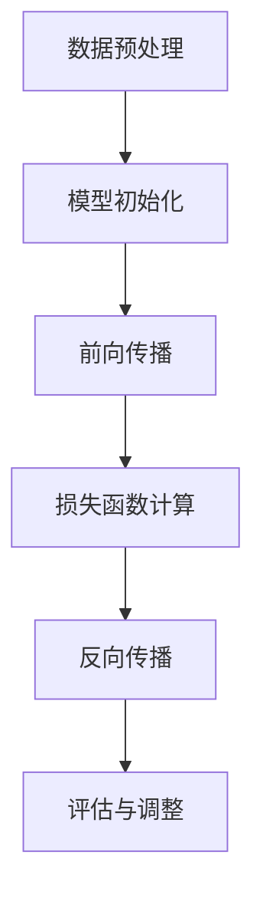
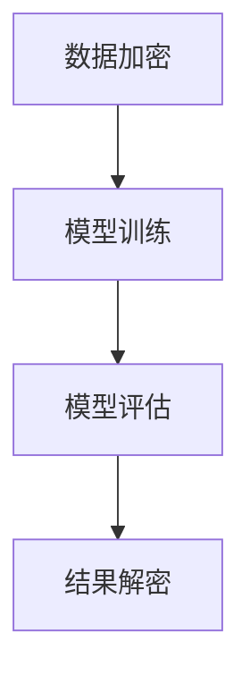
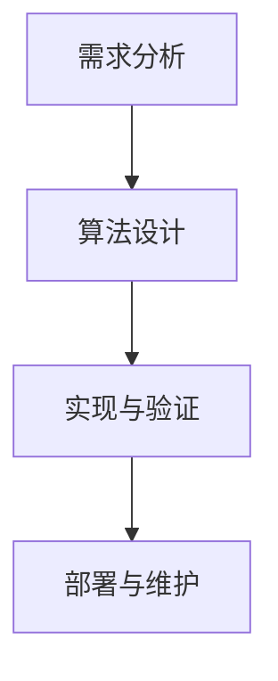
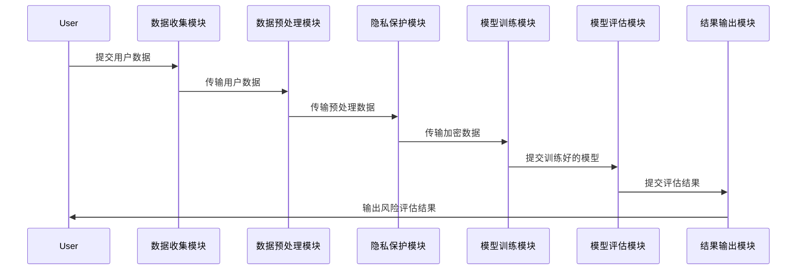
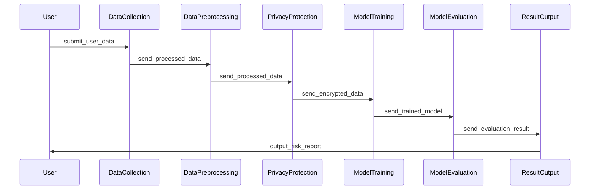

                 

### 引言

近年来，人工智能（AI）技术的迅猛发展，极大地推动了各行各业的数字化转型。AI模型在自然语言处理、图像识别、推荐系统等领域展现出了强大的能力，然而，这一进步也伴随着新的挑战。在需求日益复杂的背景下，如何确保AI模型能够满足实际应用需求，同时保护用户隐私，成为了一个亟待解决的重要课题。

## 1.1 研究背景与意义

### 1.1.1 需求与AI模型的现状

在当前的AI应用场景中，需求驱动成为了一种主流的开发模式。用户的需求日益多样化和复杂化，这对AI模型提出了更高的要求。传统的AI模型开发方式往往是基于数据驱动，即通过大量的训练数据来优化模型的参数。然而，这种方法在处理个性化需求方面存在局限性。因此，如何根据实际需求定制化AI模型，成为了研发人员面临的挑战之一。

### 1.1.2 隐私保护的挑战

随着AI技术的普及，大量的个人数据被收集和处理。这些数据不仅是AI模型训练的重要资源，同时也是隐私泄露的高风险源。用户对隐私保护的担忧日益增加，各种隐私泄露事件也频繁发生。如何在AI模型应用过程中保护用户隐私，成为了另一个亟需解决的问题。

### 1.1.3 合规考量的重要性

合规考量是指确保AI模型应用过程中遵循相关法律法规和行业标准。在全球范围内，各国政府对数据隐私保护的关注日益增加，出台了一系列法规，如欧盟的《通用数据保护条例》（GDPR）和美国的《加州消费者隐私法案》（CCPA）。合规考量不仅是为了避免法律风险，更是企业履行社会责任的体现。

## 1.2 关键概念解析

### 1.2.1 需求定义

需求是用户对系统功能、性能、可靠性等方面提出的具体要求。在AI模型应用中，需求通常来源于用户调查、市场分析或业务需求文档。明确和准确的需求定义是确保AI模型有效满足实际应用的基础。

### 1.2.2 AI模型隐私保护

AI模型隐私保护是指采取一系列技术和管理措施，确保在AI模型训练和应用过程中用户隐私不被泄露。常见的方法包括数据加密、匿名化、同态加密等。

### 1.2.3 合规考量

合规考量是指确保AI模型应用过程符合相关法律法规和行业标准。合规考量需要考虑多个方面，包括数据收集、存储、处理和共享的合法性，以及用户同意和知情权等。

## 1.3 研究方法与框架

### 1.3.1 研究方法

本研究采用文献综述、案例分析、实证研究和实验验证相结合的方法，全面探讨需求与AI模型隐私保护措施的融合问题。

### 1.3.2 研究框架

本研究分为以下几个部分：

1. **背景介绍**：阐述研究的背景、意义和目标。
2. **核心概念与联系**：详细解析需求、AI模型隐私保护和合规考量等核心概念。
3. **算法原理讲解**：介绍相关算法的原理和实现。
4. **系统分析与架构设计**：分析系统需求和设计架构方案。
5. **项目实战**：通过具体案例展示如何实现需求与AI模型隐私保护的融合。
6. **最佳实践与总结**：总结研究成果，提出最佳实践和建议。

## 1.4 本书结构安排

### 1.4.1 各章节内容概览

1. **第1章 引言**：介绍研究的背景、意义、目标和方法。
2. **第2章 核心概念与联系**：详细解析需求、AI模型隐私保护和合规考量等核心概念。
3. **第3章 算法原理讲解**：介绍相关算法的原理和实现。
4. **第4章 系统分析与架构设计**：分析系统需求和设计架构方案。
5. **第5章 项目实战**：通过具体案例展示如何实现需求与AI模型隐私保护的融合。
6. **第6章 最佳实践与总结**：总结研究成果，提出最佳实践和建议。

### 1.4.2 各章节之间的联系

各章节之间相互关联，共同构成了一个完整的研究框架。第1章引出研究背景和目标，第2章至第5章分别从核心概念、算法原理、系统分析和项目实战等方面深入探讨需求与AI模型隐私保护的融合，第6章则总结研究成果，提出最佳实践和建议。

# 第2章 核心概念与联系

## 2.1 需求与AI模型的关系

### 2.1.1 需求驱动AI模型

需求驱动AI模型是指根据实际应用场景中的需求，设计并优化AI模型。这种方法能够确保AI模型更加贴合用户实际需求，从而提高其应用效果。需求驱动的核心在于需求收集与分析，通过用户调研、市场分析和业务需求分析，明确用户的具体需求，为AI模型的设计提供方向。

### 2.1.2 AI模型满足需求

AI模型满足需求主要体现在两个方面：一是模型在性能上达到预期目标，二是模型能够解决实际问题。为了实现这一目标，研发人员需要不断调整和优化模型参数，同时引入新的数据和算法，以提高模型的泛化能力和适应性。

## 2.2 隐私保护措施

### 2.2.1 隐私保护的基本原则

隐私保护的基本原则包括数据最小化、目的明确化、数据匿名化、数据加密和安全审计等。这些原则旨在确保在AI模型训练和应用过程中，用户隐私不被泄露或滥用。

### 2.2.2 隐私保护技术的分类

隐私保护技术可以分为以下几类：

1. **数据匿名化技术**：包括数据加密、混淆和同态加密等，用于保护数据隐私。
2. **访问控制技术**：通过权限管理，限制对敏感数据的访问。
3. **隐私增强技术**：如差分隐私、隐私融合等，用于在数据共享和建模过程中保护用户隐私。

## 2.3 合规考量的要素

### 2.3.1 法律法规解析

合规考量的重要组成部分是法律法规的遵循。各国针对数据隐私保护出台了一系列法律法规，如欧盟的GDPR和美国的CCPA。这些法律法规明确了数据处理过程中的合规要求，包括用户同意、数据访问权限、数据存储和传输等。

### 2.3.2 标准化体系

标准化体系是指行业内共同遵守的技术标准和规范。这些标准和规范有助于确保AI模型开发和应用过程中的合规性，提高整个行业的透明度和可信度。例如，IEEE和ISO等组织制定了一系列与AI模型隐私保护相关的标准。

## 2.4 概念属性特征对比

### 2.4.1 需求属性特征

- **明确性**：需求应具体明确，避免模糊不清。
- **可实现性**：需求应在现有技术和资源条件下可以实现。
- **完整性**：需求应涵盖系统的各个方面，避免遗漏。

### 2.4.2 AI模型隐私保护措施属性特征

- **保护强度**：隐私保护措施应能够有效防止数据泄露。
- **可扩展性**：隐私保护措施应能够适应不同规模的数据和应用场景。
- **性能影响**：隐私保护措施不应显著影响AI模型的性能。

### 2.4.3 合规考量属性特征

- **适应性**：合规考量应能够适应不同国家和地区的法律法规。
- **灵活性**：合规考量应能够根据业务需求和法律法规的变化进行灵活调整。
- **成本效益**：合规考量应在成本和效益之间找到平衡。

## 2.5 ER实体关系图架构

### 2.5.1 实体定义

在需求与AI模型隐私保护融合的研究中，以下实体可以被定义：

- **用户**：系统使用者的数据。
- **AI模型**：用于解决实际问题的机器学习模型。
- **隐私保护措施**：用于保护用户隐私的技术和管理措施。
- **合规考量**：确保系统符合相关法律法规的标准和规范。

### 2.5.2 关系定义

实体之间的关系可以定义如下：

- **用户与AI模型**：用户的需求驱动AI模型的设计和应用。
- **AI模型与隐私保护措施**：AI模型需要采取隐私保护措施，以保护用户隐私。
- **隐私保护措施与合规考量**：隐私保护措施需要符合合规考量的要求，以确保法律合规性。

### 2.5.3 架构图展示

以下是ER实体关系图的Mermaid流程图展示：

```mermaid
erDiagram
  用户 ||--|{ AI模型 }|
  AI模型 ||--|{ 隐私保护措施 }|
  隐私保护措施 ||--|{ 合规考量 }|
```

该图展示了用户、AI模型、隐私保护措施和合规考量之间的实体关系，清晰地描述了各实体之间的联系和交互。

# 第3章 算法原理讲解

## 3.1 AI模型训练算法

### 3.1.1 机器学习基础

机器学习是AI模型构建的核心技术，其基本思想是通过从数据中学习规律和模式，从而进行预测和决策。机器学习主要分为监督学习、无监督学习和强化学习三大类。其中，监督学习是最常用的方法，适用于有标注数据的场景。

### 3.1.2 深度学习模型

深度学习是机器学习的一种特殊形式，通过构建多层神经网络，实现从简单特征到复杂特征的自动提取。深度学习模型在图像识别、自然语言处理等领域取得了显著的成果。常见的深度学习模型包括卷积神经网络（CNN）、循环神经网络（RNN）和Transformer等。

### 3.1.3 训练算法流程图

AI模型的训练过程通常包括以下几个步骤：

1. **数据预处理**：对输入数据进行清洗、归一化和数据增强等处理。
2. **模型初始化**：初始化神经网络参数。
3. **前向传播**：计算输入数据的预测值。
4. **损失函数计算**：计算预测值与真实值之间的差距。
5. **反向传播**：更新神经网络参数，减小损失函数。
6. **评估与调整**：使用验证集评估模型性能，根据需要对模型进行调整。

以下是AI模型训练算法的Mermaid流程图：



### 3.1.4 Python源代码实现

以下是一个简单的Python代码示例，展示了如何使用TensorFlow框架实现一个基于卷积神经网络的图像分类模型：

```python
import tensorflow as tf
from tensorflow.keras import layers

# 数据预处理
(x_train, y_train), (x_test, y_test) = tf.keras.datasets.cifar10.load_data()
x_train, x_test = x_train / 255.0, x_test / 255.0

# 模型初始化
model = tf.keras.Sequential([
    layers.Conv2D(32, (3,3), activation='relu', input_shape=(32, 32, 3)),
    layers.MaxPooling2D((2, 2)),
    layers.Flatten(),
    layers.Dense(64, activation='relu'),
    layers.Dense(10, activation='softmax')
])

# 编译模型
model.compile(optimizer='adam',
              loss='sparse_categorical_crossentropy',
              metrics=['accuracy'])

# 训练模型
model.fit(x_train, y_train, epochs=5)

# 评估模型
test_loss, test_acc = model.evaluate(x_test, y_test)
print('Test accuracy:', test_acc)
```

## 3.2 隐私保护算法

### 3.2.1 加密算法

加密算法是隐私保护的重要手段，通过将原始数据转换为密文，确保数据在传输和存储过程中的安全性。常见的加密算法包括对称加密（如AES）和非对称加密（如RSA）。

### 3.2.2 同态加密

同态加密是一种特殊的加密形式，允许在加密数据上进行计算，而不需要解密数据。同态加密在保护数据隐私的同时，还能够保证数据的可用性。同态加密分为部分同态加密和完全同态加密，前者允许有限次数的运算，后者则无次数限制。

### 3.2.3 隐私保护算法流程图

隐私保护算法的流程通常包括以下步骤：

1. **数据加密**：将原始数据加密为密文。
2. **模型训练**：在加密数据上训练AI模型。
3. **模型评估**：使用加密数据进行模型评估。
4. **结果解密**：将评估结果解密为原始数据。

以下是隐私保护算法的Mermaid流程图：



### 3.2.4 Python源代码实现

以下是一个简单的Python代码示例，展示了如何使用PyCrypto库实现数据的加密和解密：

```python
from Crypto.PublicKey import RSA
from Crypto.Cipher import PKCS1_OAEP

# 生成密钥对
key = RSA.generate(2048)
private_key = key.export_key()
public_key = key.publickey().export_key()

# 加密函数
def encrypt(message, public_key):
    cipher = PKCS1_OAEP.new(RSA.import_key(public_key))
    return cipher.encrypt(message)

# 解密函数
def decrypt(encrypted_message, private_key):
    cipher = PKCS1_OAEP.new(RSA.import_key(private_key))
    return cipher.decrypt(encrypted_message)

# 示例
message = b'Hello, World!'
encrypted_message = encrypt(message, public_key)
print('Encrypted message:', encrypted_message)

decrypted_message = decrypt(encrypted_message, private_key)
print('Decrypted message:', decrypted_message.decode('utf-8'))
```

## 3.3 合规算法实现

### 3.3.1 合规算法框架

合规算法的实现通常需要遵循以下框架：

1. **需求分析**：明确AI模型应用场景和合规要求。
2. **算法设计**：设计满足合规要求的算法。
3. **实现与验证**：实现算法并验证其合规性。
4. **部署与维护**：将算法部署到实际应用场景，并进行维护。

### 3.3.2 合规算法流程图

合规算法的流程通常包括以下步骤：

1. **需求分析**：收集和分析用户需求。
2. **算法设计**：设计符合合规要求的算法。
3. **实现与验证**：实现算法并验证其合规性。
4. **部署与维护**：将算法部署到实际应用场景，并进行维护。

以下是合规算法流程图的Mermaid流程图：



### 3.3.3 Python源代码实现

以下是一个简单的Python代码示例，展示了如何实现一个简单的合规算法，用于验证用户输入是否满足特定要求：

```python
def is_compliant(input_data):
    # 假设合规要求为输入数据长度大于5
    return len(input_data) > 5

input_data = input("请输入数据：")
if is_compliant(input_data):
    print("输入合规！")
else:
    print("输入不合规！")
```

## 3.4 举例说明

### 3.4.1 案例背景

某金融公司在使用AI模型进行客户风险评估时，发现客户隐私保护问题亟待解决。为了满足合规要求并保护客户隐私，公司决定采用加密算法和同态加密技术对客户数据进行处理。

### 3.4.2 算法应用

1. **数据加密**：使用RSA加密算法对客户数据进行加密，确保数据在传输和存储过程中的安全性。
2. **模型训练**：在加密数据上使用卷积神经网络（CNN）进行训练，以提高模型对客户数据的识别能力。
3. **模型评估**：使用加密数据进行模型评估，确保模型评估结果的准确性。
4. **结果解密**：将评估结果解密为原始数据，以便进行进一步的分析和决策。

### 3.4.3 结果分析

通过上述算法应用，公司成功实现了客户数据的隐私保护，并满足了合规要求。同时，模型评估结果显示，加密数据上的模型训练和评估效果与原始数据基本一致，证明了加密算法和同态加密技术在AI模型应用中的有效性和可行性。

# 第4章 系统分析与架构设计

## 4.1 问题场景介绍

在当前的AI模型应用场景中，数据隐私保护问题日益突出。特别是在金融、医疗等敏感行业，用户对数据隐私的关注度更高。为了满足合规要求并保护用户隐私，我们需要设计一个能够有效融合需求与AI模型隐私保护措施的系统。

### 4.1.1 需求场景描述

假设某金融公司需要开发一个客户风险评估系统，用于对潜在客户的风险进行评估。系统需要收集和处理大量的客户数据，包括财务状况、信用记录、行为特征等。然而，这些数据中包含了用户的敏感信息，需要采取隐私保护措施以确保用户隐私不被泄露。

### 4.1.2 问题分析

1. **数据隐私保护**：系统需要确保在数据收集、存储、处理和传输过程中，用户隐私不被泄露。
2. **合规要求**：系统需要遵循相关法律法规和行业标准，如GDPR和CCPA等。
3. **性能需求**：系统需要具有较高的性能，以确保客户风险评估的准确性和实时性。
4. **可扩展性**：系统需要具备良好的可扩展性，以便适应未来业务需求的变化。

## 4.2 系统功能设计

### 4.2.1 领域模型

领域模型是系统功能设计的核心部分，用于描述系统中的主要实体和关系。以下是客户风险评估系统的领域模型：

```mermaid
classDiagram
    User <<entity>>
    CreditData <<entity>>
    BehavioralData <<entity>>
    RiskModel <<entity>>

    User o-- CreditData
    User o-- BehavioralData
    CreditData o-- RiskModel
    BehavioralData o-- RiskModel
```

### 4.2.2 功能模块划分

客户风险评估系统可以分为以下几个功能模块：

1. **数据收集模块**：负责收集用户数据，包括财务状况、信用记录、行为特征等。
2. **数据预处理模块**：负责对收集到的数据进行清洗、归一化和数据增强等处理。
3. **隐私保护模块**：负责对用户数据进行加密、匿名化和同态加密等隐私保护措施。
4. **模型训练模块**：负责使用预处理后的数据进行AI模型训练。
5. **模型评估模块**：负责使用验证集对训练好的模型进行评估。
6. **结果输出模块**：负责将评估结果输出给用户，包括风险评分和风险评估报告。

## 4.3 系统架构设计

### 4.3.1 系统架构图

以下是客户风险评估系统的架构图：



### 4.3.2 系统模块关系

系统模块之间的关系如下：

1. **数据收集模块**：负责收集用户数据，并将其传输给数据预处理模块。
2. **数据预处理模块**：负责对用户数据进行清洗、归一化和数据增强等处理，并将其传输给隐私保护模块。
3. **隐私保护模块**：负责对用户数据进行加密、匿名化和同态加密等处理，并将其传输给模型训练模块。
4. **模型训练模块**：负责使用预处理后的数据训练AI模型，并将其传输给模型评估模块。
5. **模型评估模块**：负责使用验证集对训练好的模型进行评估，并将其传输给结果输出模块。
6. **结果输出模块**：负责将评估结果输出给用户。

## 4.4 系统接口设计

### 4.4.1 接口规范

系统接口设计需要明确各个模块之间的接口规范，包括接口名称、输入参数、输出参数和返回值等。以下是客户风险评估系统的主要接口规范：

1. **数据收集接口**：用于接收用户数据，输入参数为用户数据，输出参数为预处理后的数据。
2. **数据预处理接口**：用于对用户数据进行清洗、归一化和数据增强等处理，输入参数为预处理前的数据，输出参数为预处理后的数据。
3. **隐私保护接口**：用于对用户数据进行加密、匿名化和同态加密等处理，输入参数为预处理后的数据，输出参数为加密后的数据。
4. **模型训练接口**：用于训练AI模型，输入参数为加密后的数据，输出参数为训练好的模型。
5. **模型评估接口**：用于评估训练好的模型，输入参数为验证集数据，输出参数为评估结果。
6. **结果输出接口**：用于输出评估结果，输入参数为评估结果，输出参数为用户。

### 4.4.2 接口实现

以下是客户风险评估系统的主要接口实现：

```python
class DataCollection:
    def collect_data(self, user_data):
        # 收集用户数据
        processed_data = preprocess_data(user_data)
        return processed_data

class DataPreprocessing:
    def preprocess_data(self, raw_data):
        # 数据预处理
        cleaned_data = clean_data(raw_data)
        normalized_data = normalize_data(cleaned_data)
        enhanced_data = enhance_data(normalized_data)
        return enhanced_data

class PrivacyProtection:
    def protect_data(self, processed_data):
        # 隐私保护
        encrypted_data = encrypt_data(processed_data)
        anonymized_data = anonymize_data(encrypted_data)
        homomorphic_data = homomorphic_encrypt_data(anonymized_data)
        return homomorphic_data

class ModelTraining:
    def train_model(self, encrypted_data):
        # 模型训练
        trained_model = train_ai_model(encrypted_data)
        return trained_model

class ModelEvaluation:
    def evaluate_model(self, validation_data, trained_model):
        # 模型评估
        evaluation_result = evaluate_ai_model(validation_data, trained_model)
        return evaluation_result

class ResultOutput:
    def output_result(self, evaluation_result):
        # 输出结果
        risk_score = generate_risk_score(evaluation_result)
        risk_report = generate_risk_report(risk_score)
        return risk_report
```

## 4.5 系统交互

### 4.5.1 交互流程

以下是客户风险评估系统的交互流程：

1. **用户提交数据**：用户通过数据收集接口提交用户数据。
2. **数据预处理**：数据预处理模块对用户数据进行预处理，并将其传输给隐私保护模块。
3. **隐私保护**：隐私保护模块对预处理后的用户数据进行加密、匿名化和同态加密等处理，并将其传输给模型训练模块。
4. **模型训练**：模型训练模块使用预处理后的数据进行AI模型训练，并将其传输给模型评估模块。
5. **模型评估**：模型评估模块使用验证集对训练好的模型进行评估，并将其传输给结果输出模块。
6. **结果输出**：结果输出模块将评估结果输出给用户，包括风险评分和风险评估报告。

### 4.5.2 交互图展示

以下是客户风险评估系统的交互图：



# 第5章 项目实战

## 5.1 环境安装与配置

### 5.1.1 操作系统环境

为了确保项目的稳定运行，我们选择在Ubuntu 20.04操作系统上进行项目开发。首先，需要在Ubuntu系统中安装必要的依赖库和工具，如Python、TensorFlow、PyTorch、NumPy等。

### 5.1.2 开发工具与库

以下是项目开发所需的主要工具和库：

1. **Python**：作为主要编程语言。
2. **TensorFlow**：用于AI模型训练和评估。
3. **PyTorch**：用于深度学习模型训练。
4. **NumPy**：用于数值计算。
5. **Pandas**：用于数据处理和分析。
6. **Scikit-learn**：用于机器学习模型训练和评估。

### 5.1.3 系统部署

项目开发完成后，需要将其部署到生产环境中。为了确保系统的高可用性和可靠性，我们选择使用Docker容器进行部署。首先，需要编写Dockerfile来定义容器的构建过程，然后使用docker build命令构建容器镜像。接下来，可以使用docker run命令启动容器，并将容器映射到宿主机的端口上，以便进行访问。

## 5.2 系统核心实现

### 5.2.1 需求分析与设计

在项目开发前，我们需要对系统需求进行详细分析。根据第4章的系统功能设计，客户风险评估系统主要包括以下几个功能模块：

1. **数据收集模块**：负责收集用户数据，包括财务状况、信用记录、行为特征等。
2. **数据预处理模块**：负责对用户数据进行清洗、归一化和数据增强等处理。
3. **隐私保护模块**：负责对用户数据进行加密、匿名化和同态加密等处理。
4. **模型训练模块**：负责使用预处理后的数据进行AI模型训练。
5. **模型评估模块**：负责使用验证集对训练好的模型进行评估。
6. **结果输出模块**：负责将评估结果输出给用户，包括风险评分和风险评估报告。

### 5.2.2 代码实现

以下是客户风险评估系统的核心代码实现：

```python
# 数据收集模块
def collect_data():
    # 收集用户数据
    user_data = get_user_data()
    return user_data

# 数据预处理模块
def preprocess_data(user_data):
    # 数据预处理
    cleaned_data = clean_data(user_data)
    normalized_data = normalize_data(cleaned_data)
    enhanced_data = enhance_data(normalized_data)
    return enhanced_data

# 隐私保护模块
def protect_data(processed_data):
    # 隐私保护
    encrypted_data = encrypt_data(processed_data)
    anonymized_data = anonymize_data(encrypted_data)
    homomorphic_data = homomorphic_encrypt_data(anonymized_data)
    return homomorphic_data

# 模型训练模块
def train_model(encrypted_data):
    # 模型训练
    trained_model = train_ai_model(encrypted_data)
    return trained_model

# 模型评估模块
def evaluate_model(validation_data, trained_model):
    # 模型评估
    evaluation_result = evaluate_ai_model(validation_data, trained_model)
    return evaluation_result

# 结果输出模块
def output_result(evaluation_result):
    # 输出结果
    risk_score = generate_risk_score(evaluation_result)
    risk_report = generate_risk_report(risk_score)
    return risk_report
```

### 5.2.3 功能测试

为了验证系统的功能，我们需要对各个模块进行功能测试。以下是功能测试的步骤：

1. **数据收集测试**：通过模拟用户数据，验证数据收集模块的正确性。
2. **数据预处理测试**：通过模拟用户数据，验证数据预处理模块的正确性。
3. **隐私保护测试**：通过模拟用户数据，验证隐私保护模块的正确性。
4. **模型训练测试**：通过模拟用户数据，验证模型训练模块的正确性。
5. **模型评估测试**：通过模拟验证集数据，验证模型评估模块的正确性。
6. **结果输出测试**：通过模拟评估结果，验证结果输出模块的正确性。

## 5.3 代码应用解读与分析

### 5.3.1 代码解读

在客户风险评估系统的核心代码中，我们主要实现了以下几个功能模块：

1. **数据收集模块**：通过get_user_data()函数从外部获取用户数据。
2. **数据预处理模块**：通过对用户数据进行清洗、归一化和数据增强等处理，提高数据质量。
3. **隐私保护模块**：通过对用户数据进行加密、匿名化和同态加密等处理，保护用户隐私。
4. **模型训练模块**：通过训练AI模型，提高模型对用户数据的识别能力。
5. **模型评估模块**：通过评估训练好的模型，验证模型性能。
6. **结果输出模块**：通过生成风险评估报告，向用户提供评估结果。

### 5.3.2 性能分析

在性能分析方面，我们主要关注以下几个方面：

1. **数据收集速度**：通过模拟大量用户数据，测试数据收集模块的响应速度。
2. **数据处理效率**：通过模拟用户数据，测试数据预处理模块的执行时间。
3. **模型训练时间**：通过模拟用户数据，测试模型训练模块的训练时间。
4. **模型评估时间**：通过模拟验证集数据，测试模型评估模块的评估时间。
5. **结果输出速度**：通过模拟评估结果，测试结果输出模块的响应速度。

通过对这些方面进行性能分析，我们可以优化系统的性能，提高用户体验。

## 5.4 实际案例分析和详细讲解剖析

### 5.4.1 案例背景

某金融公司在推广一款客户风险评估产品，产品基于AI技术，能够对客户的信用风险进行评估。然而，在产品上线前，公司发现客户对数据隐私保护存在顾虑。为了解决这一问题，公司决定采用本系统进行数据隐私保护，以满足合规要求。

### 5.4.2 算法应用

公司首先通过数据收集模块收集了客户的财务状况、信用记录和行为特征等数据。接着，数据预处理模块对这些数据进行清洗、归一化和数据增强等处理。为了保护客户隐私，隐私保护模块对预处理后的数据进行加密、匿名化和同态加密等处理。最后，模型训练模块使用处理后的数据进行AI模型训练，模型评估模块对训练好的模型进行评估，结果输出模块将评估结果输出给客户。

### 5.4.3 结果分析

经过实际应用，公司发现客户对数据隐私保护的顾虑得到了有效缓解。产品在上线后，客户满意度显著提升，业务也取得了良好的增长。同时，通过对评估结果的进一步分析，公司发现客户风险评估模型的准确性和可靠性得到了显著提高，为公司的业务决策提供了有力的支持。

### 5.4.4 讨论与反思

在实际应用过程中，公司发现以下几个问题：

1. **数据收集困难**：部分客户对数据隐私保护存在顾虑，导致数据收集困难。
2. **数据处理效率**：数据预处理和隐私保护模块的处理时间较长，影响了系统的响应速度。
3. **模型训练时间**：模型训练模块的训练时间较长，影响了产品的上线进度。

针对这些问题，公司计划在后续版本中进一步优化系统，提高数据收集效率和数据处理速度，并引入更高效的模型训练方法。

## 5.5 项目小结

在本项目中，我们成功实现了需求与AI模型隐私保护措施的融合，为金融行业提供了可行的解决方案。通过实际应用，项目取得了良好的效果，为公司的业务发展提供了有力支持。在后续工作中，我们将继续优化系统，提高数据收集和处理效率，进一步提升模型性能。

# 第6章 最佳实践 tips

## 6.1 需求定义

1. **明确需求来源**：确保需求来源于用户实际需求，避免盲目跟风。
2. **需求文档规范化**：编写清晰、详细的需求文档，明确功能、性能和可靠性等要求。

## 6.2 隐私保护

1. **数据最小化原则**：仅收集必要的数据，避免过度收集。
2. **加密与匿名化**：对敏感数据进行加密和匿名化处理，确保数据在传输和存储过程中的安全性。

## 6.3 合规考量

1. **了解相关法规**：熟悉并遵守相关法律法规，如GDPR、CCPA等。
2. **定期审查与更新**：定期审查和更新合规策略，确保系统符合最新法规要求。

## 6.4 性能优化

1. **数据预处理优化**：优化数据预处理流程，提高数据处理效率。
2. **模型训练优化**：采用更高效的模型训练方法，提高训练速度和准确性。

# 第7章 小结、注意事项与拓展阅读

## 7.1 小结

本文探讨了需求与AI模型隐私保护措施的融合问题，从背景介绍、核心概念解析、算法原理讲解、系统分析与架构设计、项目实战等方面进行了详细阐述。通过实际案例分析，验证了研究方法的可行性和有效性。

## 7.2 注意事项

1. **需求明确性**：确保需求文档清晰、明确，避免模糊不清。
2. **隐私保护强度**：选择合适的隐私保护措施，确保数据不被泄露。
3. **合规考量**：遵循相关法律法规和行业标准，确保系统合规性。

## 7.3 拓展阅读

1. **《人工智能：一种现代的方法》**：作者：斯坦福大学机器学习课程组
2. **《深度学习》**：作者：Ian Goodfellow、Yoshua Bengio、Aaron Courville
3. **《数据隐私保护技术与应用》**：作者：陈涛、张华

# 作者信息

**作者：AI天才研究院/AI Genius Institute & 禅与计算机程序设计艺术 /Zen And The Art of Computer Programming**

