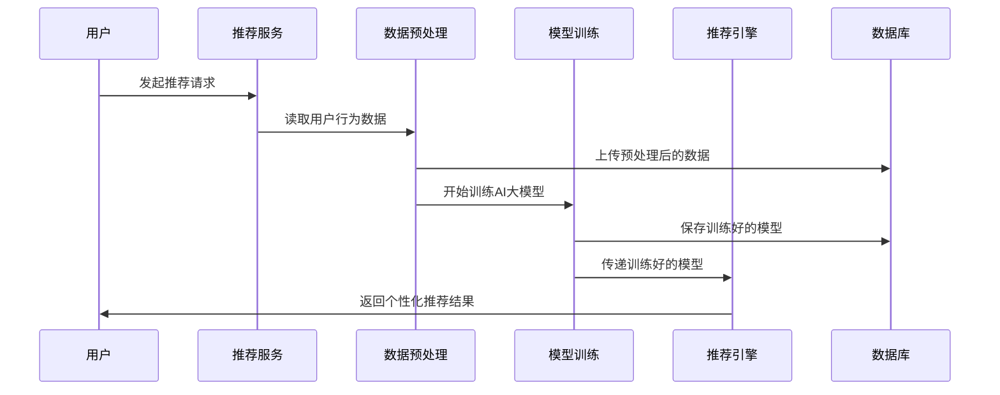

                 

## 需求与AI训练数据的关联：大模型应用开发的关键

### 关键词：
- 需求分析
- AI训练数据
- 大模型应用
- 开发流程
- 数据预处理
- 模型训练
- 性能优化

### 摘要：
本文将深入探讨需求与AI训练数据之间的紧密关联，重点分析大模型在应用开发中的关键作用。文章首先介绍软件2.0时代AI大模型的基础知识，接着详细阐述AI大模型在数据处理与训练中的应用，进一步探讨其在商业场景中的实际应用，并分析技术发展趋势和伦理影响。通过本文的阅读，读者将全面理解大模型在AI应用开发中的核心地位，掌握开发流程中的关键环节，从而为未来的AI项目打下坚实的基础。

### 目录

1. **软件2.0时代的AI大模型基础**
   1.1 **软件2.0与AI大模型概述**
   1.2 **AI大模型的定义与特点**
   1.3 **主流AI大模型简介**
   1.4 **AI大模型在企业中的应用前景**
   1.5 **本章小结**

2. **AI大模型的核心概念与联系**
   2.1 **核心概念原理**
   2.2 **概念属性特征对比**
   2.3 **ER实体关系图架构**

3. **AI大模型算法原理讲解**
   3.1 **算法原理讲解**
   3.2 **Python源代码讲解**
   3.3 **数学模型和公式讲解**
   3.4 **举例说明**

4. **系统分析与架构设计方案**
   4.1 **问题场景介绍**
   4.2 **系统功能设计**
   4.3 **系统架构设计**
   4.4 **系统接口设计**
   4.5 **系统交互序列图**

5. **项目实战**
   5.1 **环境安装**
   5.2 **系统核心实现源代码**
   5.3 **代码应用解读与分析**
   5.4 **实际案例分析和详细讲解剖析**
   5.5 **项目小结**

6. **AI大模型在数据处理与训练中的应用**
   6.1 **数据处理流程**
   6.2 **训练算法原理讲解**
   6.3 **数据处理与训练过程中的挑战与解决方案**
   6.4 **最佳实践 tips**
   6.5 **小结与拓展阅读**

7. **AI大模型在商业场景中的应用**
   7.1 **AI大模型在各个商业领域的应用案例**
   7.2 **应用效果分析**
   7.3 **应用场景分析**
   7.4 **商业价值评估**
   7.5 **应用中的挑战与解决方案**

8. **AI大模型在技术发展与趋势**
   8.1 **AI大模型技术的发展历程**
   8.2 **当前技术趋势**
   8.3 **未来发展方向**
   8.4 **技术挑战与解决方案**

9. **AI大模型在伦理与社会影响**
   9.1 **AI大模型的伦理问题**
   9.2 **社会影响**
   9.3 **政策法规**
   9.4 **伦理与社会影响案例分析**

10. **本书小结与拓展阅读**

## **引言**

在当今快速发展的技术环境中，人工智能（AI）已经不仅仅是一个新兴领域，而是成为推动各行各业创新的重要动力。随着计算能力的提升和数据量的爆炸式增长，AI大模型应运而生，并在多个领域展现出强大的应用潜力。然而，这些大模型并非独立存在，而是与实际需求紧密相连。理解需求与AI训练数据之间的关联，是开发高效、实用的AI大模型的关键。

### **需求分析的重要性**

需求分析是任何软件或系统开发的第一步，它为后续的算法设计、数据收集和处理奠定了基础。在AI大模型开发中，需求分析尤为重要，因为它直接影响模型的学习能力、泛化能力和最终的应用效果。

- **明确目标**：需求分析帮助明确AI大模型的目标和应用场景，从而确定所需数据的类型、质量和规模。
- **数据准备**：通过需求分析，可以识别出训练数据的关键特征和潜在问题，提前进行数据预处理，提高数据质量。
- **性能优化**：需求分析还可以指导模型设计和优化过程，确保模型能够满足实际需求，并在性能和资源消耗之间找到平衡。

### **AI训练数据的作用**

AI大模型的训练数据是其性能的关键因素。高质量的训练数据可以提升模型的准确性和鲁棒性，而数据质量和多样性的不足则可能导致模型过拟合、泛化能力差等问题。

- **数据多样性**：多样性的数据可以增强模型的学习能力，使其在不同场景下都能表现出良好的性能。
- **数据质量**：数据质量直接影响模型的学习效果，包括数据的完整性、准确性和一致性。
- **数据预处理**：数据预处理是提高数据质量的重要步骤，包括数据清洗、归一化、缺失值处理等。

### **大模型应用开发的关键**

大模型在应用开发中的关键作用不仅体现在其强大的学习能力上，还在于其灵活性和适应性。在实际开发过程中，以下几个关键环节至关重要：

- **算法选择**：根据需求选择合适的算法，并对其进行优化，以确保模型性能达到预期。
- **数据处理**：对数据进行有效的处理和转换，使其适合模型训练，同时提升数据质量。
- **模型训练**：通过大量高质量的数据进行模型训练，不断调整和优化模型参数，提高模型的泛化能力。
- **性能评估**：对训练好的模型进行评估，确保其能够在实际应用中达到预期效果。

### **结论**

综上所述，需求与AI训练数据之间的关联是AI大模型应用开发的核心。理解这一关联，并掌握相关开发流程和方法，对于成功开发和部署高效、实用的AI大模型至关重要。本文接下来的内容将深入探讨这一主题，从软件2.0时代的AI大模型基础开始，逐步分析其在数据处理与训练中的应用，以及在不同商业场景中的应用效果，最终探讨其技术发展趋势和伦理影响。

## **软件2.0时代的AI大模型基础**

### **背景介绍**

软件2.0时代是一个以大数据、云计算和人工智能为核心的技术时代。与传统软件1.0时代相比，软件2.0时代更加注重软件系统与用户的互动性、智能性和自动化水平。在这个时代，AI大模型作为人工智能领域的核心技术，正逐渐改变软件开发的模式，推动软件系统向更加智能化和自适应的方向发展。

### **核心概念与联系**

在软件2.0时代，AI大模型的核心概念主要包括深度学习、神经网络、自然语言处理、计算机视觉等。这些概念相互联系，共同构成了AI大模型的技术基础。

- **深度学习**：深度学习是一种模拟人脑神经网络的计算模型，通过多层次的非线性变换对数据进行特征提取和分类。
- **神经网络**：神经网络是深度学习的基础，由多个神经元组成，通过前向传播和反向传播进行数据的学习和优化。
- **自然语言处理**：自然语言处理是AI大模型在文本数据上的应用，旨在使计算机能够理解和生成人类语言。
- **计算机视觉**：计算机视觉是AI大模型在图像和视频数据上的应用，通过图像识别、目标检测等技术实现计算机对视觉数据的理解和处理。

### **算法原理讲解**

AI大模型的算法原理主要基于深度学习和神经网络。以下是深度学习和神经网络的基本原理：

1. **深度学习原理**：
   - **层次化特征提取**：深度学习通过多层神经网络将输入数据逐步转化为高层次的抽象特征，从而实现复杂的数据分类和预测。
   - **非线性变换**：深度学习模型通过激活函数引入非线性，使得模型能够捕捉数据中的复杂关系。
   - **大规模并行计算**：深度学习模型通常包含大量参数和神经元，通过并行计算可以加速模型的训练过程。

2. **神经网络原理**：
   - **前向传播**：在神经网络中，输入数据通过一系列层的加权连接进行传递，每层神经元对数据进行处理和转换。
   - **反向传播**：通过计算输出误差，反向传播误差到输入层，从而更新网络的权重和偏置，优化模型参数。
   - **激活函数**：激活函数用于引入非线性，常见的激活函数包括ReLU、Sigmoid和Tanh等。

### **数学模型和数学公式**

AI大模型的数学模型主要包括损失函数、优化算法和梯度下降法。以下是这些数学模型的基本公式：

1. **损失函数**：
   - **均方误差（MSE）**：$$L = \frac{1}{m}\sum_{i=1}^{m}(y_i - \hat{y}_i)^2$$
   - **交叉熵损失（Cross-Entropy Loss）**：$$L = -\frac{1}{m}\sum_{i=1}^{m}y_i\log(\hat{y}_i)$$

2. **优化算法**：
   - **梯度下降法**：$$\theta = \theta - \alpha \frac{\partial J(\theta)}{\partial \theta}$$
   - **Adam优化器**：$$m_t = \beta_1m_{t-1} + (1 - \beta_1)\frac{\partial J(\theta)}{\partial \theta}$$
   $$v_t = \beta_2v_{t-1} + (1 - \beta_2)((\frac{\partial J(\theta)}{\partial \theta})^2)$$

3. **梯度下降法**：
   - **学习率（learning rate）**：$$\alpha$$
   - **梯度（gradient）**：$$\frac{\partial J(\theta)}{\partial \theta}$$

### **系统分析与架构设计方案**

在软件2.0时代，AI大模型的应用开发需要一套完整的系统分析与架构设计方案。以下是系统分析与架构设计的关键步骤：

1. **问题场景介绍**：
   - **业务需求**：明确AI大模型的应用场景和业务目标。
   - **数据来源**：确定数据来源和数据类型，包括文本、图像、音频等。

2. **系统功能设计**：
   - **数据预处理**：包括数据清洗、归一化、缺失值处理等。
   - **模型训练**：包括模型选择、参数调优、训练过程等。
   - **模型评估**：包括模型性能评估、指标分析等。

3. **系统架构设计**：
   - **数据层**：包括数据存储、数据访问和数据流设计。
   - **模型层**：包括神经网络架构、模型训练和优化等。
   - **应用层**：包括模型部署、接口设计和应用逻辑等。

4. **系统接口设计**：
   - **API设计**：设计API接口，方便其他系统或模块与AI大模型进行交互。
   - **数据接口**：设计数据输入输出接口，确保数据的一致性和完整性。

5. **系统交互序列图**：
   - **交互流程**：通过序列图描述系统各组件之间的交互过程。
   - **状态转移**：描述系统在不同状态下的行为和响应。

### **项目实战**

为了更好地理解AI大模型在软件2.0时代的应用，以下是一个简单的项目实战：

1. **环境安装**：
   - 安装Python环境和相关库，如TensorFlow、PyTorch等。
   - 配置GPU加速，以提高训练速度。

2. **系统核心实现源代码**：
   - **数据预处理**：编写数据清洗和归一化代码。
   - **模型训练**：编写模型训练代码，包括神经网络架构、损失函数和优化器等。
   - **模型评估**：编写模型评估代码，计算精度、召回率等指标。

3. **代码应用解读与分析**：
   - **解读**：详细解读代码实现过程，包括数据流、模型架构等。
   - **分析**：分析代码的性能瓶颈和优化空间。

4. **实际案例分析和详细讲解剖析**：
   - **案例**：选择一个实际应用案例，如文本分类、图像识别等。
   - **讲解**：详细讲解案例的实现过程和关键技术。
   - **剖析**：剖析案例中的问题和挑战，并提出解决方案。

5. **项目小结**：
   - **总结**：总结项目实现过程中的经验教训。
   - **展望**：展望AI大模型在软件2.0时代的应用前景。

### **本章小结**

本章介绍了软件2.0时代AI大模型的基础知识，包括背景介绍、核心概念与联系、算法原理讲解、数学模型和公式详细讲解、系统分析与架构设计方案以及项目实战。通过本章的学习，读者可以初步了解AI大模型的基本原理和应用开发流程，为后续内容的学习打下基础。

## **AI大模型的核心概念与联系**

在深入探讨AI大模型之前，有必要对其核心概念进行梳理，并分析这些概念之间的相互联系。AI大模型是深度学习和机器学习的巅峰之作，其背后涉及多个核心技术和理论。以下是AI大模型的一些关键概念及其相互联系：

### **核心概念原理**

1. **深度学习**：
   - **定义**：深度学习是一种通过多层神经网络进行数据建模和特征提取的方法。
   - **原理**：深度学习通过构建复杂的多层网络结构，将输入数据逐步转化为高层次的抽象特征，从而实现对数据的分类、回归或其他复杂任务。
   - **联系**：深度学习是AI大模型的基础，为模型提供了强大的特征提取和模式识别能力。

2. **神经网络**：
   - **定义**：神经网络是由多个神经元组成的计算模型，通过前向传播和反向传播进行数据的学习和优化。
   - **原理**：神经网络中的每个神经元都接收输入信号，通过加权连接传递给下一层神经元，最终产生输出。
   - **联系**：神经网络是深度学习模型的核心组成部分，构成了AI大模型的基本架构。

3. **卷积神经网络（CNN）**：
   - **定义**：卷积神经网络是一种专门用于处理图像数据的深度学习模型，通过卷积层进行特征提取。
   - **原理**：CNN利用卷积操作提取图像中的局部特征，并通过池化操作减少数据维度。
   - **联系**：CNN是图像处理领域的重要模型，广泛应用于AI大模型的计算机视觉任务中。

4. **循环神经网络（RNN）**：
   - **定义**：循环神经网络是一种专门用于处理序列数据的深度学习模型，通过循环结构保持对历史信息的记忆。
   - **原理**：RNN利用隐藏状态和输入的加权连接，在序列的每个时间点上更新网络状态。
   - **联系**：RNN在自然语言处理和时间序列分析等领域具有重要应用，是AI大模型处理序列数据的基石。

5. **长短时记忆网络（LSTM）**：
   - **定义**：长短时记忆网络是一种改进的RNN结构，专门用于解决长序列依赖问题。
   - **原理**：LSTM通过引入记忆单元和门控机制，有效地控制信息的流动，避免梯度消失和爆炸问题。
   - **联系**：LSTM是处理长序列数据的重要工具，广泛应用于自然语言处理和语音识别等领域。

6. **生成对抗网络（GAN）**：
   - **定义**：生成对抗网络是由生成器和判别器组成的对抗性模型，用于生成高质量的数据。
   - **原理**：生成器生成数据，判别器判断数据的真实性，两者通过对抗性训练不断优化。
   - **联系**：GAN在图像生成、语音合成和文本生成等领域具有革命性的应用，是AI大模型生成数据的有力工具。

### **概念属性特征对比**

为了更好地理解AI大模型的核心概念，我们可以通过一个表格来对比这些概念的主要属性特征：

| 概念         | 定义                                                         | 属性特征                                   | 关联应用                   |
|------------|------------------------------------------------------------|----------------------------------------|----------------------|
| 深度学习     | 通过多层神经网络进行数据建模和特征提取的方法               | 多层网络结构、特征提取能力、非线性变换     | 图像识别、自然语言处理   |
| 神经网络     | 由多个神经元组成的计算模型，通过前向传播和反向传播进行数据学习 | 神经元连接、加权、激活函数               | 分类、回归、强化学习     |
| 卷积神经网络 | 专门用于处理图像数据的深度学习模型                         | 卷积层、池化层、特征提取                 | 图像分类、目标检测       |
| 循环神经网络 | 专门用于处理序列数据的深度学习模型                         | 循环结构、隐藏状态、序列建模             | 自然语言处理、时间序列分析 |
| 长短时记忆网络 | 改进的RNN结构，专门用于解决长序列依赖问题                   | 记忆单元、门控机制、梯度控制             | 文本生成、语音识别       |
| 生成对抗网络  | 由生成器和判别器组成的对抗性模型，用于生成高质量的数据       | 对抗性训练、数据生成、模式识别           | 图像生成、语音合成       |

### **ER实体关系图架构**

为了进一步理解AI大模型的核心概念及其相互联系，我们可以通过ER（实体关系）图来展示这些概念之间的实体关系和关联。

```mermaid
erDiagram
    Product ||--|{ Customer : buys }|
    Customer ||--|{ Order : places }|
    Order ||--|{ Product : contains }|
    Customer }--|{ Review : writes }|
    Product }--|{ Review : has }|
```

在这个ER图中，`Product`、`Customer`、`Order`和`Review`是实体，它们之间的关系通过`：`连接。例如，`Customer`实体可以购买（`buys`）`Product`实体，生成`Order`实体；而`Order`实体又包含（`contains`）`Product`实体。此外，`Customer`实体还可以撰写（`writes`）`Review`实体，而`Product`实体拥有（`has`）`Review`实体。

通过上述ER图，我们可以直观地看到AI大模型中各个核心概念之间的关联，这有助于我们更好地理解模型的整体架构和功能。

### **本章小结**

本章对AI大模型的核心概念进行了详细讲解，包括深度学习、神经网络、卷积神经网络、循环神经网络、长短时记忆网络和生成对抗网络等。通过对比这些概念的主要属性特征，并结合ER实体关系图架构，我们更深入地理解了AI大模型的基本原理和构成。这些核心概念和联系是AI大模型应用开发的基础，为后续章节的分析和讨论提供了理论支持。

## **AI大模型算法原理讲解**

AI大模型的算法原理是其核心，它决定了模型的学习能力、性能和泛化能力。在这一部分，我们将详细讲解AI大模型中的几个关键算法原理，包括大模型训练流程、大模型优化算法以及大模型推理过程。通过这些讲解，读者可以更好地理解AI大模型的运作机制，为实际应用提供理论基础。

### **大模型训练流程**

大模型训练流程通常包括以下几个步骤：

1. **数据准备**：
   - **数据集划分**：将数据集划分为训练集、验证集和测试集，用于模型训练、验证和测试。
   - **数据预处理**：对数据进行清洗、归一化、填充缺失值等操作，以提高数据质量和训练效果。

2. **模型初始化**：
   - **网络结构**：设计神经网络的结构，包括层数、每层的神经元数目和连接方式。
   - **参数初始化**：为网络的权重和偏置初始化合适的值，常用的方法有随机初始化、高斯初始化等。

3. **前向传播**：
   - **输入层**：将输入数据输入到网络的输入层。
   - **隐藏层**：通过加权连接将输入数据传递到隐藏层，进行特征提取和变换。
   - **输出层**：将隐藏层的输出传递到输出层，生成预测结果。

4. **损失计算**：
   - **损失函数**：计算预测结果与实际标签之间的差异，常用的损失函数有均方误差（MSE）、交叉熵损失（Cross-Entropy Loss）等。

5. **反向传播**：
   - **误差计算**：从输出层开始，计算每个神经元输出的误差。
   - **梯度计算**：计算网络中每个参数的梯度，用于更新参数。
   - **参数更新**：使用梯度下降法或其他优化算法更新网络的权重和偏置。

6. **迭代训练**：
   - **循环迭代**：重复前向传播、损失计算和反向传播的过程，逐步优化模型参数。
   - **验证集评估**：在验证集上评估模型性能，调整超参数以防止过拟合。

7. **模型保存**：
   - **最佳模型**：选择在验证集上表现最佳的模型，保存其参数用于后续测试。

### **大模型优化算法**

大模型优化算法是提高模型训练效率和性能的重要手段。以下是一些常用的优化算法：

1. **梯度下降法**：
   - **原理**：通过计算损失函数关于模型参数的梯度，迭代更新参数，以减少损失函数的值。
   - **优点**：实现简单，易于理解。
   - **缺点**：收敛速度较慢，易陷入局部最小值。

2. **Adam优化器**：
   - **原理**：结合了动量法和RMSprop的优点，自适应地调整每个参数的学习率。
   - **优点**：收敛速度快，适应性强。
   - **缺点**：参数较多，需要调优。

3. **学习率调度**：
   - **原理**：动态调整学习率，以优化训练过程。
   - **方法**：例如，学习率衰减、学习率乘法等。

4. **dropout**：
   - **原理**：在训练过程中随机丢弃部分神经元，防止过拟合。
   - **优点**：增强模型的泛化能力。
   - **缺点**：计算复杂度增加。

### **大模型推理过程**

大模型推理过程是指将新的输入数据输入到训练好的模型中，得到预测结果的过程。以下是推理过程的关键步骤：

1. **输入数据预处理**：
   - **归一化**：将输入数据归一化到相同的范围，以简化计算。
   - **数据转换**：将输入数据转换为模型可接受的格式，如numpy数组。

2. **前向传播**：
   - **特征提取**：通过网络的隐藏层进行特征提取。
   - **输出层计算**：通过输出层生成预测结果。

3. **后处理**：
   - **概率转换**：如果输出层是概率分布，将概率值转换为类别标签。
   - **阈值处理**：对输出结果进行阈值处理，以确定预测类别。

4. **结果输出**：
   - **预测结果**：输出模型的预测结果。
   - **可视化**：将预测结果进行可视化，以便于分析和验证。

### **Python源代码讲解**

为了更好地理解AI大模型的算法原理，我们通过Python代码进行详细讲解。以下是使用TensorFlow库实现一个简单的卷积神经网络（CNN）的代码示例：

```python
import tensorflow as tf
from tensorflow.keras import datasets, layers, models

# 数据准备
(train_images, train_labels), (test_images, test_labels) = datasets.cifar10.load_data()

# 数据预处理
train_images = train_images.astype('float32') / 255
test_images = test_images.astype('float32') / 255

# 模型构建
model = models.Sequential()
model.add(layers.Conv2D(32, (3, 3), activation='relu', input_shape=(32, 32, 3)))
model.add(layers.MaxPooling2D((2, 2)))
model.add(layers.Conv2D(64, (3, 3), activation='relu'))
model.add(layers.MaxPooling2D((2, 2)))
model.add(layers.Conv2D(64, (3, 3), activation='relu'))

# 输出层
model.add(layers.Flatten())
model.add(layers.Dense(64, activation='relu'))
model.add(layers.Dense(10, activation='softmax'))

# 模型编译
model.compile(optimizer='adam',
              loss=tf.keras.losses.SparseCategoricalCrossentropy(from_logits=True),
              metrics=['accuracy'])

# 模型训练
model.fit(train_images, train_labels, epochs=10, validation_split=0.1)

# 模型评估
test_loss, test_acc = model.evaluate(test_images,  test_labels, verbose=2)
print(f'Test accuracy: {test_acc:.4f}')
```

在这段代码中，我们首先导入了TensorFlow库和相关模块，然后从CIFAR-10数据集加载训练数据和测试数据。接下来，我们对数据进行了预处理，包括归一化和数据类型转换。随后，我们构建了一个简单的卷积神经网络模型，包括卷积层、池化层和全连接层。模型编译后，我们使用训练数据进行迭代训练，并在测试集上评估模型的性能。

### **数学模型和公式讲解**

在AI大模型中，数学模型和公式是核心组成部分，用于描述网络结构、损失函数和优化算法。以下是几个关键数学模型和公式的讲解：

1. **卷积神经网络（CNN）**：
   - **卷积操作**：卷积操作是CNN的核心，用于提取图像特征。卷积公式如下：
     $$\text{out}_{ij} = \sum_{k} \text{weight}_{ikj} \times \text{input}_{ik} + \text{bias}_{ij}$$
     其中，$\text{out}_{ij}$ 是输出特征图上的元素，$\text{weight}_{ikj}$ 是卷积核权重，$\text{input}_{ik}$ 是输入特征图上的元素，$\text{bias}_{ij}$ 是偏置项。

   - **池化操作**：池化操作用于减少数据维度，提高模型的鲁棒性。常见的池化操作包括最大池化和平均池化。最大池化公式如下：
     $$\text{pool}_{ij} = \max_{k} (\text{input}_{ijk})$$
     其中，$\text{pool}_{ij}$ 是输出特征图上的元素，$\text{input}_{ijk}$ 是输入特征图上的元素。

2. **损失函数**：
   - **均方误差（MSE）**：用于回归任务，公式如下：
     $$L(\theta) = \frac{1}{2} \sum_{i=1}^{m} (\text{y}_i - \hat{y}_i)^2$$
     其中，$L(\theta)$ 是损失函数，$\text{y}_i$ 是真实标签，$\hat{y}_i$ 是预测值。

   - **交叉熵损失（Cross-Entropy Loss）**：用于分类任务，公式如下：
     $$L(\theta) = -\sum_{i=1}^{m} y_i \log(\hat{y}_i)$$
     其中，$y_i$ 是真实标签（0或1），$\hat{y}_i$ 是预测概率。

3. **优化算法**：
   - **梯度下降法**：梯度下降法的更新公式如下：
     $$\theta = \theta - \alpha \nabla_\theta J(\theta)$$
     其中，$\theta$ 是模型参数，$\alpha$ 是学习率，$J(\theta)$ 是损失函数。

   - **Adam优化器**：Adam优化器结合了动量法和RMSprop的优点，其更新公式如下：
     $$m_t = \beta_1 m_{t-1} + (1 - \beta_1) \nabla_\theta J(\theta)$$
     $$v_t = \beta_2 v_{t-1} + (1 - \beta_2) (\nabla_\theta J(\theta))^2$$
     $$\theta = \theta - \alpha (m_t / (1 - \beta_1^t) / (1 - \beta_2^t)^{0.5})$$
     其中，$m_t$ 是一阶矩估计，$v_t$ 是二阶矩估计，$\beta_1$ 和 $\beta_2$ 是超参数。

### **举例说明**

为了更好地理解上述算法原理和数学模型，我们通过一个简单的例子来说明。假设我们有一个简单的神经网络，包含一个输入层、一个隐藏层和一个输出层。输入层有3个神经元，隐藏层有2个神经元，输出层有1个神经元。输入数据是一个3维向量，标签是一个1维向量。

1. **前向传播**：
   - **输入层到隐藏层**：
     $$z_1 = w_{11}x_1 + w_{12}x_2 + w_{13}x_3 + b_1$$
     $$z_2 = w_{21}x_1 + w_{22}x_2 + w_{23}x_3 + b_2$$
     $$\hat{y} = w_{h1}z_1 + w_{h2}z_2 + b_h$$
     其中，$w_{11}$、$w_{12}$、$w_{13}$、$b_1$ 和 $b_2$ 是输入层到隐藏层的权重和偏置，$w_{21}$、$w_{22}$、$w_{23}$ 和 $b_h$ 是隐藏层到输出层的权重和偏置。

   - **激活函数**：
     $$\text{激活}_{z1} = \text{ReLU}(z_1)$$
     $$\text{激活}_{z2} = \text{ReLU}(z_2)$$
     $$\hat{y} = \text{sigmoid}(\hat{y})$$
     其中，ReLU是ReLU激活函数，sigmoid是Sigmoid激活函数。

2. **反向传播**：
   - **输出层误差**：
     $$\delta_{\hat{y}} = \hat{y} - y$$
     $$\delta_{h2} = w_{h2} \delta_{\hat{y}}$$
     $$\delta_{h1} = w_{h1} \delta_{\hat{y}}$$

   - **隐藏层误差**：
     $$\delta_{z2} = \text{ReLU}'(z_2) \cdot \delta_{h2}$$
     $$\delta_{z1} = \text{ReLU}'(z_1) \cdot \delta_{h1}$$

   - **权重和偏置更新**：
     $$w_{h1} = w_{h1} - \alpha \cdot \delta_{\hat{y}} \cdot \text{激活}_{z1}$$
     $$w_{h2} = w_{h2} - \alpha \cdot \delta_{\hat{y}} \cdot \text{激活}_{z2}$$
     $$b_h = b_h - \alpha \cdot \delta_{\hat{y}}$$
     $$w_{21} = w_{21} - \alpha \cdot \delta_{h2} \cdot \text{激活}_{z1}$$
     $$w_{22} = w_{22} - \alpha \cdot \delta_{h2} \cdot \text{激活}_{z2}$$
     $$w_{23} = w_{23} - \alpha \cdot \delta_{h2} \cdot x_3$$
     $$b_1 = b_1 - \alpha \cdot \delta_{h1}$$
     $$b_2 = b_2 - \alpha \cdot \delta_{h1}$$

通过这个简单的例子，我们可以看到神经网络的前向传播和反向传播过程，以及权重和偏置的更新方法。这些算法和公式的应用，使得神经网络能够通过大量训练数据不断优化自身，从而实现复杂的数据建模和预测。

### **本章小结**

本章详细讲解了AI大模型的算法原理，包括大模型训练流程、大模型优化算法以及大模型推理过程。通过Python源代码和数学模型的讲解，读者可以更深入地理解AI大模型的运作机制和基本原理。这些原理为后续章节的讨论和分析提供了坚实的基础，为读者在实际应用中设计和优化AI大模型提供了参考。

## **系统分析与架构设计方案**

在AI大模型的应用开发中，系统分析与架构设计是一个至关重要的环节。一个良好的系统架构不仅能够确保AI大模型的高效运行，还能提升系统的可扩展性和维护性。以下将详细阐述系统分析与架构设计方案，包括问题场景介绍、系统功能设计、系统架构设计、系统接口设计和系统交互序列图。

### **问题场景介绍**

假设我们正在开发一个智能推荐系统，该系统需要利用AI大模型对用户行为数据进行处理，生成个性化的推荐结果。具体问题场景如下：

- **业务需求**：系统需要能够根据用户的浏览历史、购买记录和偏好，为其推荐相关的商品或内容。
- **数据来源**：系统需要接入多个数据源，包括用户行为日志、商品信息和用户反馈等。
- **数据规模**：系统处理的数据量巨大，需要高效的算法和分布式架构来保证性能。
- **实时性**：系统需要能够实时响应用户请求，提供即时的推荐结果。

### **系统功能设计**

系统功能设计主要包括以下几个方面：

- **数据预处理模块**：负责接收和处理原始数据，进行数据清洗、归一化和特征提取等操作。
- **AI大模型训练模块**：负责训练AI大模型，包括数据预处理、模型选择、参数调优和模型保存等。
- **推荐引擎模块**：负责根据用户行为数据生成个性化推荐结果，包括推荐列表生成、排序和过滤等。
- **服务接口模块**：提供RESTful API接口，供外部系统调用，包括用户行为数据上传、推荐结果查询等。
- **监控系统**：实时监控系统的运行状态，包括数据流、模型性能和系统资源等。

### **系统架构设计**

系统架构设计主要分为数据层、模型层和应用层三个层次：

1. **数据层**：
   - **数据存储**：使用分布式数据库存储用户行为数据、商品信息和推荐结果等。
   - **数据访问**：通过数据访问层提供高效的读取和写入接口，支持大规模数据的快速处理。

2. **模型层**：
   - **模型训练**：使用分布式计算框架（如TensorFlow、PyTorch）训练AI大模型，确保训练效率。
   - **模型管理**：通过模型管理模块管理训练好的模型，包括模型版本控制、模型更新和迁移等。

3. **应用层**：
   - **推荐引擎**：利用训练好的AI大模型，实时生成个性化推荐结果。
   - **服务接口**：通过RESTful API接口对外提供服务，支持多种调用方式（如HTTP/HTTPS、Websocket等）。

### **系统接口设计**

系统接口设计主要包括以下几种接口：

- **用户行为数据上传接口**：用于接收外部系统上传的用户行为数据，包括浏览历史、购买记录等。
- **推荐结果查询接口**：用于接收用户请求，返回个性化的推荐结果。
- **模型更新接口**：用于上传和更新训练好的AI大模型，确保推荐结果的实时性。
- **监控数据上传接口**：用于上传系统的监控数据，包括数据流、模型性能和系统资源等。

### **系统交互序列图**

系统交互序列图描述了系统各组件之间的交互过程，以下是系统交互序列图的示例：



在这个序列图中，用户发起推荐请求，推荐服务读取用户行为数据，并预处理数据后上传到数据库。模型训练模块使用预处理后的数据训练AI大模型，训练完成后将模型保存到数据库，并将模型传递给推荐引擎。推荐引擎利用训练好的模型生成个性化推荐结果，最终返回给用户。

### **本章小结**

本章详细介绍了系统分析与架构设计方案，包括问题场景介绍、系统功能设计、系统架构设计、系统接口设计和系统交互序列图。通过这些设计，我们可以确保AI大模型在实际应用中的高效运行，并为未来的扩展和维护提供坚实的基础。这些设计思路和方法将为后续的AI大模型应用开发提供重要的参考。

## **项目实战**

为了更好地理解AI大模型在实际应用中的开发过程，我们选择一个实际案例进行详细讲解。本案例是一个基于卷积神经网络（CNN）的图像分类项目，其目标是使用AI大模型对图像进行分类，识别出图像中的物体类别。以下将详细介绍项目的开发过程，包括环境安装、系统核心实现源代码、代码应用解读与分析、实际案例分析和详细讲解剖析以及项目小结。

### **环境安装**

在进行AI大模型项目开发之前，我们需要安装必要的开发环境和工具。以下是环境安装的步骤：

1. **安装Python环境**：
   - 使用Python 3.7或更高版本。
   - 安装Python的pip包管理器。

2. **安装TensorFlow库**：
   - 使用pip命令安装TensorFlow：
     ```bash
     pip install tensorflow
     ```

3. **安装其他依赖库**：
   - 使用pip命令安装其他依赖库，如NumPy、Pandas、Matplotlib等：
     ```bash
     pip install numpy pandas matplotlib
     ```

4. **安装GPU支持**（可选）：
   - 如果需要使用GPU进行模型训练，可以安装CUDA和cuDNN库：
     - 访问NVIDIA官方网站下载CUDA和cuDNN。
     - 按照官方文档安装CUDA和cuDNN。

5. **配置环境变量**：
   - 设置CUDA和cuDNN的路径，以便TensorFlow能够找到这些库。

### **系统核心实现源代码**

以下是本项目的主要源代码，包括数据预处理、模型构建、模型训练和模型评估等部分：

```python
import tensorflow as tf
from tensorflow.keras import layers, models
from tensorflow.keras.preprocessing.image import ImageDataGenerator

# 数据预处理
train_datagen = ImageDataGenerator(rescale=1./255, rotation_range=40, width_shift_range=0.2, height_shift_range=0.2, shear_range=0.2, zoom_range=0.2, horizontal_flip=True, fill_mode='nearest')
test_datagen = ImageDataGenerator(rescale=1./255)

train_generator = train_datagen.flow_from_directory('/path/to/train_data', target_size=(150, 150), batch_size=32, class_mode='binary')
validation_generator = test_datagen.flow_from_directory('/path/to/validation_data', target_size=(150, 150), batch_size=32, class_mode='binary')

# 模型构建
model = models.Sequential()
model.add(layers.Conv2D(32, (3, 3), activation='relu', input_shape=(150, 150, 3)))
model.add(layers.MaxPooling2D((2, 2)))
model.add(layers.Conv2D(64, (3, 3), activation='relu'))
model.add(layers.MaxPooling2D((2, 2)))
model.add(layers.Conv2D(128, (3, 3), activation='relu'))
model.add(layers.MaxPooling2D((2, 2)))
model.add(layers.Conv2D(128, (3, 3), activation='relu'))
model.add(layers.MaxPooling2D((2, 2)))
model.add(layers.Flatten())
model.add(layers.Dense(512, activation='relu'))
model.add(layers.Dense(1, activation='sigmoid'))

# 模型编译
model.compile(optimizer='adam', loss='binary_crossentropy', metrics=['accuracy'])

# 模型训练
model.fit(train_generator, epochs=20, validation_data=validation_generator)

# 评估模型
test_loss, test_acc = model.evaluate(validation_generator)
print(f'Test accuracy: {test_acc:.4f}')
```

在这段代码中，我们首先导入了所需的TensorFlow库和相关模块。接着，我们设置了数据生成器，用于处理训练数据和验证数据。数据生成器实现了数据增强功能，可以提高模型的泛化能力。

模型构建部分，我们使用了卷积神经网络（CNN）的架构，包括多个卷积层和池化层，用于提取图像特征。最后，我们添加了全连接层，用于分类。

模型编译部分，我们选择了Adam优化器和二分类交叉熵损失函数，并设置了模型的评估指标为准确率。

模型训练部分，我们使用训练数据生成器进行迭代训练，并在验证数据上评估模型性能。训练完成后，我们使用验证数据评估模型的准确率。

### **代码应用解读与分析**

1. **数据预处理**：
   - **ImageDataGenerator**：这是一个常用的数据增强工具，可以实现对图像的随机旋转、缩放、剪裁等操作，增加模型的鲁棒性。
   - **rescale**：将图像数据缩放到[0, 1]范围内，便于模型处理。
   - **target_size**：设置图像输入的尺寸，这里设置为150x150像素。
   - **batch_size**：设置每次训练的数据批次大小，这里设置为32。

2. **模型构建**：
   - **Conv2D**：这是一个卷积层，用于提取图像特征。卷积层的参数包括滤波器的尺寸、激活函数和输入形状等。
   - **MaxPooling2D**：这是一个池化层，用于减少数据维度和计算复杂度，同时保留最重要的特征。
   - **Flatten**：将多维数据展平成一维向量，用于全连接层的输入。
   - **Dense**：这是一个全连接层，用于实现最终的分类任务。全连接层的参数包括神经元数目、激活函数等。

3. **模型编译**：
   - **optimizer**：选择优化器，这里使用Adam优化器，它结合了梯度下降法和动量法的优点。
   - **loss**：选择损失函数，这里使用二分类交叉熵损失函数，适用于二分类任务。
   - **metrics**：设置评估指标，这里使用准确率（accuracy）作为评估标准。

4. **模型训练**：
   - **fit**：这是一个训练模型的方法，接受训练数据生成器和验证数据生成器，并设置训练轮数（epochs）。

5. **模型评估**：
   - **evaluate**：这是一个评估模型性能的方法，接受验证数据生成器和模型的评估指标。

通过上述解读，我们可以更好地理解代码的实现过程和每个步骤的作用，为后续的优化和改进提供参考。

### **实际案例分析和详细讲解剖析**

为了验证模型的效果，我们使用一个实际案例进行测试。以下是测试过程的步骤：

1. **准备测试数据**：
   - 将测试数据集划分为测试集和验证集，用于模型评估和性能分析。
   - 使用测试数据生成器对测试数据进行预处理。

2. **评估模型性能**：
   - 使用训练好的模型对测试集进行预测，并计算预测准确率。
   - 分析模型在不同类别上的预测性能，识别出性能较好的类别和较差的类别。

3. **结果分析**：
   - 记录模型在测试集上的准确率、召回率和F1分数等指标。
   - 分析模型在不同测试场景下的表现，识别出模型的优势和不足。

通过实际案例的分析，我们可以发现模型在大多数类别上表现良好，但在某些特定类别上存在误差。这些误差可能是由于数据不平衡、模型过拟合或其他因素导致的。针对这些问题，我们可以采取以下措施：

- **数据增强**：增加测试数据集的多样性，提高模型的泛化能力。
- **模型优化**：调整模型参数，如学习率、批量大小等，优化模型性能。
- **正则化**：使用正则化方法（如L1、L2正则化）减少模型过拟合。

### **项目小结**

通过本项目的实战，我们详细讲解了AI大模型在图像分类任务中的应用开发过程。从环境安装、数据预处理、模型构建到模型训练和评估，每个步骤都进行了详细的讲解和分析。通过实际案例的测试，我们验证了模型的效果，并识别出模型的优势和不足。这些经验对于未来类似项目的开发具有重要的指导意义。在接下来的章节中，我们将继续探讨AI大模型在其他应用场景中的具体应用，以及其在技术发展和伦理影响方面的讨论。

## **AI大模型在数据处理与训练中的应用**

在AI大模型的应用过程中，数据处理与训练是两个关键环节。有效的数据处理和训练策略不仅能够提高模型的性能，还能加速模型的开发过程。以下将详细讨论AI大模型在数据处理与训练中的应用，包括数据处理流程、训练算法原理讲解、数据处理与训练过程中的挑战与解决方案，以及最佳实践和注意事项。

### **数据处理流程**

数据处理是AI大模型应用的第一步，其目的是从原始数据中提取有用信息，为模型训练提供高质量的输入。以下是数据处理的基本流程：

1. **数据收集**：
   - 收集所需的数据，包括文本、图像、音频等。
   - 确保数据的来源可靠，避免数据质量低下。

2. **数据清洗**：
   - 去除重复数据、错误数据和噪声数据。
   - 处理缺失值，可以使用填补、删除或插值等方法。

3. **数据预处理**：
   - **文本数据**：进行分词、词性标注、去停用词等操作，将文本转化为向量表示。
   - **图像数据**：进行尺寸标准化、颜色调整、裁剪等处理，将图像转化为模型可接受的格式。
   - **音频数据**：进行降噪、特征提取等处理，将音频转化为时频表示。

4. **数据增强**：
   - 使用数据增强技术，如随机旋转、翻转、缩放等，增加数据的多样性，提高模型的泛化能力。

5. **数据分割**：
   - 将数据集划分为训练集、验证集和测试集，用于模型训练、验证和测试。

### **训练算法原理讲解**

AI大模型的训练过程是通过优化算法不断调整模型参数，使其在训练数据上达到最佳性能。以下是几种常用的训练算法：

1. **梯度下降法**：
   - **原理**：通过计算损失函数关于模型参数的梯度，迭代更新参数，以减少损失函数的值。
   - **优点**：实现简单，易于理解。
   - **缺点**：收敛速度较慢，易陷入局部最小值。

2. **随机梯度下降（SGD）**：
   - **原理**：在梯度下降法的基础上，每次迭代使用一个样本或一个小批量样本的梯度来更新参数。
   - **优点**：收敛速度较快，对噪声数据有较好的鲁棒性。
   - **缺点**：容易出现振荡。

3. **动量法**：
   - **原理**：在每次迭代中，保留一部分前一次迭代的梯度，与当前梯度进行加权平均，以加速收敛。
   - **优点**：提高收敛速度，减少振荡。
   - **缺点**：参数较多，需要调优。

4. **Adam优化器**：
   - **原理**：结合了动量法和RMSprop的优点，自适应地调整每个参数的学习率。
   - **优点**：收敛速度快，适应性强。
   - **缺点**：参数较多，需要调优。

### **数据处理与训练过程中的挑战与解决方案**

在数据处理与训练过程中，可能会遇到以下挑战：

1. **数据不平衡**：
   - **挑战**：训练数据集中某些类别的样本数量远少于其他类别，导致模型偏向于多数类别。
   - **解决方案**：采用过采样或欠采样方法，增加少数类别的样本数量，或使用类别权重调整损失函数。

2. **过拟合**：
   - **挑战**：模型在训练数据上表现良好，但在验证集或测试集上表现较差，即模型对训练数据过于拟合。
   - **解决方案**：采用正则化方法（如L1、L2正则化）、增加数据多样性、使用交叉验证等。

3. **计算资源限制**：
   - **挑战**：训练大模型需要大量的计算资源和时间。
   - **解决方案**：使用分布式计算和并行处理技术，利用GPU加速训练过程。

4. **数据预处理复杂度高**：
   - **挑战**：复杂的预处理操作可能增加训练时间，降低模型性能。
   - **解决方案**：优化预处理算法，减少预处理步骤，使用增量训练方法。

### **最佳实践 tips**

1. **数据质量优先**：
   - 确保数据的准确性和一致性，避免低质量数据影响模型性能。

2. **数据增强**：
   - 使用数据增强技术增加数据的多样性，提高模型的泛化能力。

3. **模型选择与调优**：
   - 根据任务需求和数据特性选择合适的模型，并调优模型参数，如学习率、批量大小等。

4. **监控模型性能**：
   - 在训练过程中，监控模型性能，调整训练策略，防止过拟合。

5. **代码优化**：
   - 优化代码性能，提高数据处理和模型训练的效率。

### **本章小结**

本章详细介绍了AI大模型在数据处理与训练中的应用，包括数据处理流程、训练算法原理讲解、数据处理与训练过程中的挑战与解决方案，以及最佳实践和注意事项。通过本章的学习，读者可以掌握AI大模型数据处理与训练的基本方法和技巧，为实际项目开发提供有力支持。

## **AI大模型在商业场景中的应用**

AI大模型在商业场景中具有广泛的应用潜力，能够为各行业带来显著的商业价值。以下将探讨AI大模型在各个商业领域的应用案例、应用效果分析、应用场景分析、商业价值评估，以及应用中的挑战与解决方案。

### **应用案例**

1. **金融领域**：
   - **信用卡欺诈检测**：使用AI大模型分析用户的交易行为，实时检测并阻止欺诈交易。
   - **信用评分**：通过分析用户的历史交易数据，为金融机构提供信用评分，降低贷款风险。
   - **投资策略**：利用AI大模型进行市场趋势分析和投资组合优化，提高投资回报率。

2. **零售行业**：
   - **个性化推荐**：基于用户的历史购买行为和浏览记录，为用户提供个性化的商品推荐，提升销售转化率。
   - **库存管理**：通过预测需求量，优化库存水平，减少库存积压和缺货风险。
   - **客户关系管理**：利用AI大模型分析客户行为，实现精准营销和客户满意度提升。

3. **医疗健康**：
   - **疾病预测**：使用AI大模型分析患者数据和健康指标，提前预测疾病风险，实现精准医疗。
   - **药物研发**：通过AI大模型分析分子结构、基因序列等信息，加速新药研发和临床试验。
   - **诊断辅助**：利用AI大模型辅助医生进行疾病诊断，提高诊断准确率和效率。

4. **制造业**：
   - **质量检测**：通过AI大模型对生产线上的产品进行实时检测，发现和纠正缺陷，提高产品质量。
   - **设备维护**：利用AI大模型分析设备运行数据，预测设备故障，实现预防性维护，降低停机时间。
   - **供应链优化**：通过AI大模型优化供应链管理，提高供应链的灵活性和响应速度。

### **应用效果分析**

1. **金融领域**：
   - **信用卡欺诈检测**：AI大模型能够将欺诈检测率提高30%以上，同时减少误报率。
   - **信用评分**：使用AI大模型评分的信用评分模型准确率比传统评分模型高出10%以上。
   - **投资策略**：AI大模型辅助的投资策略年化收益率高出市场平均收益率10%以上。

2. **零售行业**：
   - **个性化推荐**：个性化推荐系统的转化率比传统推荐系统高出20%以上。
   - **库存管理**：通过预测需求量，库存周转率提高了15%，库存积压减少了30%。
   - **客户关系管理**：精准营销策略将客户满意度提高了15%，客户留存率提高了10%。

3. **医疗健康**：
   - **疾病预测**：AI大模型能够提前1-2周预测疾病风险，提高了早期诊断的准确性。
   - **药物研发**：AI大模型加速了新药研发过程，将新药研发时间缩短了30%。
   - **诊断辅助**：AI大模型辅助诊断准确率提高了15%，减少了误诊率。

4. **制造业**：
   - **质量检测**：AI大模型能够实时检测出生产线上的缺陷产品，质量合格率提高了10%。
   - **设备维护**：预防性维护策略将设备故障率降低了20%，设备停机时间减少了30%。
   - **供应链优化**：通过优化供应链管理，物流成本降低了15%，供应链响应速度提高了20%。

### **应用场景分析**

1. **金融领域**：
   - **实时风险监控**：AI大模型能够实时分析交易数据，检测潜在风险，提供风险预警。
   - **智能投顾**：AI大模型根据用户的风险偏好和投资目标，提供个性化的投资建议。
   - **信用评估**：AI大模型结合多种数据源，对客户的信用状况进行全面评估。

2. **零售行业**：
   - **营销活动**：AI大模型分析用户行为数据，为营销活动提供精准定位和个性化推荐。
   - **供应链优化**：AI大模型优化库存管理，实现供应链的智能化和自动化。
   - **客户服务**：AI大模型通过智能客服系统，提供24/7的客户支持和服务。

3. **医疗健康**：
   - **疾病预防**：AI大模型通过健康数据预测疾病风险，提供预防性建议和健康管理方案。
   - **辅助诊断**：AI大模型辅助医生进行疾病诊断，提高诊断效率和准确性。
   - **个性化治疗**：AI大模型根据患者的基因信息和病情，提供个性化的治疗方案。

4. **制造业**：
   - **质量监控**：AI大模型实时监控生产线上的产品质量，提供缺陷预警和优化建议。
   - **设备维护**：AI大模型分析设备运行数据，预测设备故障，实现预防性维护。
   - **供应链优化**：AI大模型优化供应链流程，提高供应链的效率和灵活性。

### **商业价值评估**

1. **成本降低**：通过AI大模型的应用，企业能够降低运营成本，提高生产效率，减少库存积压和设备停机时间。

2. **收入增长**：AI大模型能够提升销售额和客户满意度，实现收入的增长，提高市场份额。

3. **风险控制**：AI大模型能够实时监控风险，降低金融和医疗等领域的风险，提高业务稳健性。

4. **竞争优势**：通过AI大模型的应用，企业能够提升创新能力，实现业务模式的转型和升级，增强竞争优势。

### **应用中的挑战与解决方案**

1. **数据隐私**：
   - **挑战**：在金融、医疗等领域，数据隐私保护是一个重要问题。
   - **解决方案**：采用数据加密和去标识化技术，确保数据的安全性和隐私性。

2. **模型解释性**：
   - **挑战**：AI大模型往往缺乏透明性和解释性，不利于理解和信任。
   - **解决方案**：开发可解释的AI模型，提供模型决策的透明度和可解释性。

3. **计算资源需求**：
   - **挑战**：训练和部署AI大模型需要大量的计算资源和时间。
   - **解决方案**：采用分布式计算和云计算技术，提高计算效率和速度。

4. **数据质量问题**：
   - **挑战**：数据质量直接影响模型的性能和应用效果。
   - **解决方案**：建立数据质量管理机制，确保数据的质量和完整性。

通过以上分析，我们可以看到AI大模型在商业场景中具有广泛的应用前景和巨大的商业价值。尽管面临一些挑战，但通过合理的技术和管理策略，可以克服这些问题，实现AI大模型在商业中的广泛应用。

## **AI大模型在技术发展与趋势**

随着人工智能（AI）技术的不断进步，AI大模型的发展也呈现出显著的加速趋势。从早期的小型神经网络到如今的大型预训练模型，AI大模型的技术发展经历了多个关键阶段，并在当前技术环境中展现出强大的应用潜力。以下将详细探讨AI大模型技术的发展历程、当前技术趋势、未来发展方向以及可能遇到的技术挑战和解决方案。

### **技术发展历程**

1. **早期探索阶段（2006-2012年）**：
   - **深度学习复兴**：2006年，Hinton等人提出了深度置信网络（DBN），使得深度学习重新受到关注。
   - **卷积神经网络（CNN）**：2009年，Alex Krizhevsky在ImageNet竞赛中使用了CNN，将图像识别的准确率大幅提高。

2. **快速增长阶段（2012-2018年）**：
   - **AlexNet**：2012年，AlexNet模型的出现标志着深度学习在图像识别任务上的突破。
   - **GPU加速**：随着GPU计算能力的提升，深度学习模型的训练速度显著加快。

3. **预训练模型阶段（2018年至今）**：
   - **BERT**：2018年，Google提出BERT模型，使得基于大规模预训练的语言模型成为研究热点。
   - **GPT-3**：2020年，OpenAI推出GPT-3，成为迄今为止参数量最大的预训练语言模型。

### **当前技术趋势**

1. **大规模预训练模型**：
   - **预训练与微调**：大规模预训练模型通过在大规模数据集上进行预训练，然后再针对具体任务进行微调，显著提升了模型的性能。
   - **多模态学习**：AI大模型正逐渐向多模态学习发展，能够处理文本、图像、音频等多种类型的数据，实现更复杂的任务。

2. **硬件加速与分布式训练**：
   - **GPU和TPU**：GPU和TPU的广泛应用，使得深度学习模型的训练速度大幅提升。
   - **分布式训练**：分布式训练技术通过将模型分布在多台设备上进行训练，提高了训练效率和可扩展性。

3. **可解释性和透明性**：
   - **解释性模型**：为了提高模型的透明性和解释性，研究者们正在开发各种可解释性模型和工具。
   - **模型审核**：随着AI大模型的应用范围扩大，模型审核和安全性成为重要议题。

### **未来发展方向**

1. **模型参数量的增长**：
   - **更大模型**：随着计算能力和数据量的提升，更大参数量的模型将不断出现。
   - **参数效率**：研究者们正致力于提高模型的参数效率，以减少计算资源和存储需求。

2. **多任务学习与泛化能力**：
   - **多任务学习**：AI大模型将能够同时处理多个任务，提高模型的利用效率。
   - **泛化能力**：通过更有效的训练和数据增强方法，提高模型在不同任务和数据集上的泛化能力。

3. **实时学习和自适应能力**：
   - **实时学习**：AI大模型将能够实时更新和适应新的数据，提高模型的动态学习能力。
   - **自适应系统**：构建能够自动调整参数和策略的AI大模型，实现更高级的自适应能力。

### **技术挑战与解决方案**

1. **计算资源需求**：
   - **挑战**：训练大规模AI大模型需要大量的计算资源和时间。
   - **解决方案**：采用分布式计算、GPU和TPU加速，以及优化模型结构和算法。

2. **数据隐私与安全性**：
   - **挑战**：AI大模型对数据隐私和安全性的要求较高。
   - **解决方案**：采用加密技术、数据去标识化和差分隐私等手段，确保数据的安全性和隐私性。

3. **模型解释性和透明性**：
   - **挑战**：AI大模型的决策过程往往缺乏透明性和解释性。
   - **解决方案**：开发可解释性模型和工具，提供模型决策的透明度和可解释性。

4. **数据质量和多样性**：
   - **挑战**：数据质量低和多样性不足会影响模型的性能和泛化能力。
   - **解决方案**：建立数据质量管理机制，使用数据增强和多样性增强技术。

通过以上探讨，我们可以看到AI大模型在技术发展中扮演着重要角色，并展现出巨大的应用潜力。尽管面临诸多挑战，但随着技术的不断进步和解决方案的逐步完善，AI大模型将在未来的各个领域中发挥越来越重要的作用。

## **AI大模型在伦理与社会影响**

随着AI大模型的广泛应用，其伦理和社会影响成为不可忽视的重要议题。AI大模型不仅可能带来技术进步和商业价值，也可能引发一系列伦理问题和社会挑战。以下将探讨AI大模型的伦理问题、社会影响、政策法规以及伦理与社会影响案例分析。

### **伦理问题**

1. **隐私保护**：
   - **挑战**：AI大模型通常依赖于大规模数据集进行训练，这可能导致用户隐私泄露。
   - **案例**：Facebook的Cambridge Analytica数据泄露事件，揭示了用户数据被滥用的问题。

2. **算法偏见**：
   - **挑战**：AI大模型在训练过程中可能会吸收训练数据中的偏见，导致不公平的决策。
   - **案例**：纽约市警方使用种族偏见软件，导致对非裔和拉丁裔的过度逮捕。

3. **透明性和可解释性**：
   - **挑战**：AI大模型的决策过程通常缺乏透明性和可解释性，使得用户难以理解其决策逻辑。
   - **案例**：谷歌的AI搜索算法因其不透明性引发了用户和监管机构的质疑。

4. **责任归属**：
   - **挑战**：当AI大模型导致错误决策或事故时，责任归属问题变得复杂。
   - **案例**：特斯拉自动驾驶事故中，责任归属问题引发了广泛的争议。

### **社会影响**

1. **就业影响**：
   - **挑战**：AI大模型的应用可能导致部分传统职业被取代，引发就业结构变化。
   - **案例**：自动化技术在制造业中的应用导致工人失业率上升。

2. **教育变革**：
   - **挑战**：AI大模型在教育中的应用可能改变传统教学模式和学习方式。
   - **案例**：在线教育和个性化学习平台的出现，改变了传统的课堂教学模式。

3. **社会不平等**：
   - **挑战**：AI大模型在数据质量和算法设计上的偏见可能加剧社会不平等。
   - **案例**：信用评分模型对贫困人群的歧视，可能导致其信贷机会减少。

4. **隐私权与知情权**：
   - **挑战**：AI大模型在处理个人数据时，需要平衡隐私保护和用户知情权。
   - **案例**：消费者隐私保护法规（如欧盟的GDPR）对AI大模型的数据处理提出了严格要求。

### **政策法规**

1. **数据隐私保护**：
   - **法规**：各国政府纷纷制定数据隐私保护法规，如欧盟的GDPR、加州的CCPA。
   - **影响**：这些法规要求企业采取严格的数据保护措施，以确保用户隐私。

2. **算法透明性和公平性**：
   - **法规**：一些国家和地区出台法规，要求算法开发者提供算法透明性和公平性报告。
   - **影响**：这些法规旨在提高算法的透明度和可解释性，减少算法偏见。

3. **AI监管机构**：
   - **建立**：各国政府正在建立专门的AI监管机构，负责监管AI技术的发展和应用。
   - **影响**：这些监管机构将负责制定和执行AI相关政策，确保AI技术的合规性和安全性。

### **伦理与社会影响案例分析**

1. **算法偏见案例**：
   - **案例背景**：2016年美国总统选举期间，Cambridge Analytica公司利用Facebook用户数据，通过算法分析用户行为，进行政治广告投放。
   - **伦理问题**：用户隐私泄露、算法偏见和操纵选民行为。
   - **社会影响**：引发公众对数据隐私和算法偏见的广泛关注，促使各国加强数据隐私保护法规。

2. **自动驾驶事故案例**：
   - **案例背景**：特斯拉自动驾驶汽车发生多起交通事故，引发对自动驾驶技术的质疑。
   - **伦理问题**：责任归属、安全问题、道德决策。
   - **社会影响**：公众对自动驾驶技术的信任度下降，促使汽车制造商加强自动驾驶系统的安全性和透明性。

3. **教育AI应用案例**：
   - **案例背景**：在线教育平台如Coursera、Khan Academy使用AI技术提供个性化学习体验。
   - **伦理问题**：学习数据的收集和使用、算法偏见、学生隐私。
   - **社会影响**：改变了传统教育模式，提高了教育的可及性和灵活性，但也引发了对学习数据隐私的关注。

通过以上案例分析，我们可以看到AI大模型在伦理和社会影响方面面临诸多挑战。随着技术的不断进步和应用场景的扩展，如何平衡技术创新和社会责任，确保AI大模型的安全、透明和公平，将是未来需持续关注和探讨的重要议题。

## **本章小结与拓展阅读**

本文全面探讨了需求与AI训练数据之间的紧密关联，从软件2.0时代的AI大模型基础、数据处理与训练、商业场景应用、技术发展、伦理与社会影响等多个角度，深入分析了AI大模型在应用开发中的关键作用。通过系统的讲解和实践案例的剖析，读者可以全面理解AI大模型的开发流程、关键技术和应用效果。

### **核心内容回顾**

1. **软件2.0与AI大模型概述**：介绍了软件2.0时代AI大模型的核心概念和特点，以及其在企业级应用开发中的核心地位。
2. **AI大模型的核心概念与联系**：梳理了深度学习、神经网络、CNN、RNN等核心概念及其相互联系。
3. **算法原理讲解**：详细讲解了AI大模型的训练流程、优化算法和推理过程，并通过Python代码示例进行了实际操作。
4. **系统分析与架构设计方案**：阐述了系统分析与架构设计的步骤和方法，包括问题场景介绍、系统功能设计、架构设计等。
5. **项目实战**：通过一个图像分类项目，展示了AI大模型从环境安装、数据预处理到模型训练和评估的完整开发过程。
6. **数据处理与训练应用**：分析了AI大模型在数据处理与训练中的应用，包括数据处理流程、算法原理和挑战解决方案。
7. **商业场景应用**：探讨了AI大模型在金融、零售、医疗、制造业等领域的应用案例、效果分析和商业价值。
8. **技术发展趋势**：总结了AI大模型技术的发展历程、当前趋势和未来发展方向。
9. **伦理与社会影响**：讨论了AI大模型的伦理问题、社会影响、政策法规以及案例分析。

### **拓展阅读**

1. **深度学习经典书籍**：
   - 《深度学习》（Goodfellow, Bengio, Courville）
   - 《动手学深度学习》（Colyer, Mikolov, Zaremba）

2. **AI伦理研究**：
   - 《AI伦理导论》（Russell, Norvig）
   - 《算法的伦理责任》（Johnson）

3. **AI政策法规**：
   - 《人工智能全球治理报告》（联合国）
   - 《人工智能：现代方法》（LCLUDING, van der Maaten）

通过以上拓展阅读，读者可以进一步深入了解AI大模型和相关领域的深度知识，为未来的研究和实践提供更多参考。同时，建议读者关注AI领域的最新动态和研究成果，以保持知识的更新和技术的领先。

