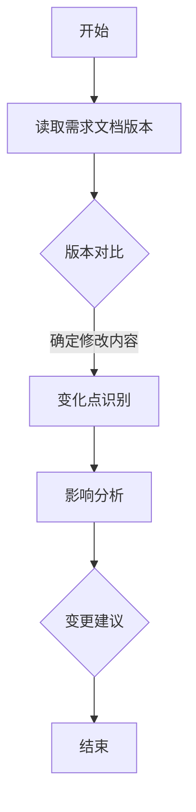
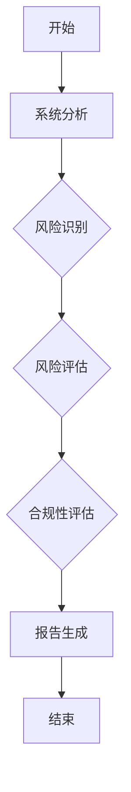
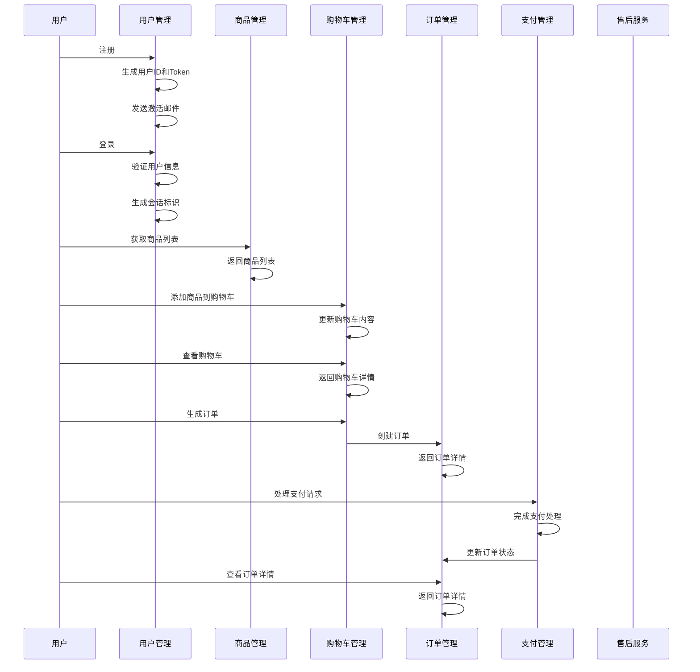

                 

### 引言

在现代信息技术高速发展的背景下，大型应用开发的复杂性日益增加。这类应用往往需要处理海量的数据和多样的用户需求，同时面临着日益严格的安全合规要求。在这样的大环境下，如何有效地整合需求与安全合规，成为大型应用开发过程中的关键问题。

首先，需求管理是确保应用能够满足用户和业务需求的核心环节。需求管理不仅包括需求的收集、分析和确认，还涉及需求变更的管理。随着市场竞争的加剧，需求变化成为常态，这对应用的开发和维护提出了更高的挑战。

另一方面，安全合规是保障应用系统安全和符合法律法规的基础。随着数据隐私和安全法律法规的不断完善，安全合规的要求也越来越高。如何确保应用在开发过程中充分考虑安全合规性，成为开发者不得不面对的课题。

在这篇文章中，我们将通过逐步分析，深入探讨需求与安全合规的整合问题。首先，我们将介绍需求与安全合规的背景和问题，接着详细阐述需求管理和安全合规的核心概念与联系。然后，我们将介绍如何通过整合方法实现需求与安全合规的整合，并利用具体的算法原理进行讲解。此外，我们还将详细分析系统架构设计，并通过项目实战和案例分析，展示整合需求的实际操作过程。最后，我们将总结最佳实践和注意事项，并推荐拓展阅读资源。

通过对这些内容的逐步分析和讲解，希望能够为读者提供一种清晰、系统的方法，帮助他们在大型应用开发中更好地整合需求与安全合规，从而提升应用的质量和可靠性。

### 第1章：引言

#### 1.1 问题背景

在当前信息化社会中，大型应用的开发已经成为企业提升竞争力、满足市场需求的重要手段。这些应用往往涉及复杂的业务流程、庞大的数据量和多样的用户需求。然而，随着需求的不断变化，以及安全合规标准的日益严格，大型应用开发面临着诸多挑战。

首先，需求变化是大型应用开发过程中的常态。客户需求的不确定性、市场竞争的加剧以及技术进步，都可能导致需求频繁变动。开发者需要在确保项目进度和质量的前提下，灵活应对这些变化。然而，需求变更往往会对开发进度和预算产生不利影响，增加了项目的复杂性和风险。

其次，安全合规问题同样不可忽视。随着网络安全威胁的不断升级，以及相关法律法规的不断完善，企业必须确保其应用系统符合安全合规标准。这包括数据加密、访问控制、隐私保护等多个方面。安全合规不仅是为了避免法律风险，更是为了保障用户数据的安全和隐私。

#### 1.2 问题描述

在大型应用开发中，需求变化和安全合规之间存在一系列的冲突和挑战：

1. **需求变化的影响**：
   - 需求变更可能导致设计、编码和测试阶段的反复修改，增加项目成本和风险。
   - 变更管理不善可能导致需求实现与实际需求脱节，影响应用质量。
   - 过度依赖需求变更可能导致项目陷入无限期的迭代，难以交付。

2. **安全合规的必要性**：
   - 安全合规是法律和法规的要求，不合规将面临法律风险和罚款。
   - 安全合规是保障用户数据安全的关键，忽视合规可能导致数据泄露，损害企业声誉。
   - 在需求变更频繁的情况下，安全合规的执行难度增加，可能导致安全漏洞。

#### 1.3 问题解决

为了解决需求变化与安全合规之间的冲突，我们可以采取以下方法：

1. **需求管理与安全合规并重**：在需求管理过程中，充分考虑安全合规的要求，确保需求变更不会影响安全标准。

2. **需求变更管理**：建立健全的需求变更管理流程，确保变更的及时、透明和可控。

3. **并行工程**：在开发过程中，同时进行安全合规的评估和测试，确保应用在满足需求的同时符合安全标准。

4. **生命周期管理**：将需求管理和安全合规贯穿于应用的生命周期，从需求收集到项目交付的各个阶段，都进行持续的关注和优化。

#### 1.4 边界与外延

1. **边界限定**：
   - 本文主要关注大型应用开发中的需求管理与安全合规问题，不包括小型应用的类似问题。
   - 需求变更的范围限定在合理的范围内，避免无谓的频繁变更。

2. **相关概念解释**：
   - **需求管理**：指对需求进行收集、分析、确认和变更的过程。
   - **安全合规**：指应用系统在开发、部署和运行过程中，满足相关法律法规和安全标准的要求。

3. **概念结构与核心要素组成**：
   - **需求管理**：需求收集、需求分析、需求确认、需求变更管理。
   - **安全合规**：法律法规遵守、安全风险评估、安全措施实施、合规性审计。

通过对这些问题的深入探讨和解决方法的介绍，我们希望能够为大型应用开发中需求与安全合规的整合提供有价值的参考和指导。

#### 1.5 概念结构与核心要素组成

在深入探讨需求管理与安全合规的问题之前，有必要先明确相关概念及其结构，以便为后续内容打下坚实的基础。

##### 1.5.1 需求管理

需求管理是指从用户和业务角度出发，对应用系统的需求进行有效管理和控制的过程。其核心要素包括以下几个方面：

1. **需求收集**：
   - **定义**：需求收集是识别和记录用户需求的过程。
   - **方法**：包括用户访谈、问卷调查、需求文档分析等。
   - **重要性**：需求收集是需求管理的起点，决定了后续工作的方向和深度。

2. **需求分析**：
   - **定义**：需求分析是将收集到的需求转化为具体、明确的规格说明书的过程。
   - **方法**：包括需求验证、需求分类、需求优先级排序等。
   - **重要性**：需求分析是确保需求合理、可行和一致性的关键步骤。

3. **需求确认**：
   - **定义**：需求确认是确认需求是否满足用户和业务需求的过程。
   - **方法**：包括需求评审、需求验证、用户确认等。
   - **重要性**：需求确认是确保需求准确性和完整性的必要环节。

4. **需求变更管理**：
   - **定义**：需求变更是指在项目开发过程中对需求进行修改、补充或删除的过程。
   - **方法**：包括变更请求、变更评估、变更实施等。
   - **重要性**：需求变更管理是应对需求变化、确保项目进度和质量的关键。

##### 1.5.2 安全合规

安全合规是指在应用系统的开发、部署和运行过程中，确保系统符合相关法律法规、行业标准和企业内部规定的要求。其核心要素包括以下几个方面：

1. **法律法规遵守**：
   - **定义**：法律法规遵守是指应用系统在开发、部署和运行过程中，遵守国家相关法律法规的要求。
   - **内容**：包括数据保护法、网络安全法、隐私法等。
   - **重要性**：法律法规遵守是避免法律风险、保障企业合法运营的基础。

2. **安全风险评估**：
   - **定义**：安全风险评估是指对应用系统可能面临的安全风险进行识别、分析和评估的过程。
   - **方法**：包括威胁识别、风险分析、风险评估等。
   - **重要性**：安全风险评估是识别潜在安全威胁、制定有效安全措施的前提。

3. **安全措施实施**：
   - **定义**：安全措施实施是指在应用系统的开发、部署和运行过程中，采取一系列安全措施来保护系统安全。
   - **内容**：包括数据加密、访问控制、防火墙、安全审计等。
   - **重要性**：安全措施实施是确保应用系统安全的关键。

4. **合规性审计**：
   - **定义**：合规性审计是指对应用系统的安全合规性进行评估和审核的过程。
   - **方法**：包括内部审计、外部审计等。
   - **重要性**：合规性审计是确保应用系统符合安全合规要求的重要手段。

通过明确需求管理和安全合规的概念及其核心要素，我们可以更清晰地理解两者之间的联系和相互作用，为后续内容的深入探讨提供坚实的基础。

#### 2.1 需求管理基础

需求管理作为应用开发的核心环节，对项目成功与否具有至关重要的影响。要理解需求管理的实质，我们首先需要从需求定义、需求分类以及需求管理流程三个方面进行探讨。

##### 2.1.1 需求定义

需求是指用户或系统在某一特定情况下所期望的功能、性能、约束或限定条件。需求可以是具体的，也可以是抽象的，但它们都必须是可衡量的，以便在开发过程中进行验证和评估。

- **功能性需求**：描述系统必须执行的功能，例如用户登录、数据检索、订单处理等。
- **非功能性需求**：描述系统必须遵守的约束条件，如性能要求、安全性需求、可用性需求等。
- **业务需求**：描述系统的业务目标和业务流程，例如提高订单处理速度、实现客户关系管理、支持多语言操作等。

##### 2.1.2 需求分类

根据需求和它们在项目中的重要性，需求通常可以分为以下几类：

- **核心需求**：直接影响系统功能的核心需求，如支付功能、用户身份验证等。
- **次要需求**：对系统功能起到辅助作用的次要需求，如界面美化、帮助文档等。
- **边缘需求**：对系统功能影响较小的需求，如用户反馈功能、用户满意度调查等。

##### 2.1.3 需求管理流程

需求管理流程是确保需求从产生到实现全过程的有效性和一致性的关键。以下是需求管理的主要流程：

1. **需求收集**：
   - **定义**：需求收集是指通过多种渠道获取用户需求的过程。
   - **方法**：包括用户访谈、问卷调查、需求文档分析、市场调研等。
   - **重要性**：需求收集是需求管理的起点，决定了需求管理后续工作的方向和深度。

2. **需求分析**：
   - **定义**：需求分析是将收集到的需求转化为具体、明确的规格说明书的过程。
   - **方法**：包括需求验证、需求分类、需求优先级排序等。
   - **重要性**：需求分析是确保需求合理、可行和一致性的关键步骤。

3. **需求确认**：
   - **定义**：需求确认是确认需求是否满足用户和业务需求的过程。
   - **方法**：包括需求评审、需求验证、用户确认等。
   - **重要性**：需求确认是确保需求准确性和完整性的必要环节。

4. **需求变更管理**：
   - **定义**：需求变更是指在项目开发过程中对需求进行修改、补充或删除的过程。
   - **方法**：包括变更请求、变更评估、变更实施等。
   - **重要性**：需求变更管理是应对需求变化、确保项目进度和质量的关键。

##### 2.1.4 需求管理工具

在需求管理过程中，使用适当的工具可以提高效率和准确性。以下是几种常用的需求管理工具：

- **文档工具**：如Microsoft Word、Google Docs、Confluence等，用于记录和管理需求文档。
- **需求管理系统**：如JIRA、Asana、Trello等，用于跟踪和管理需求变更和任务进度。
- **原型设计工具**：如Figma、Axure、Adobe XD等，用于创建需求的原型和用户界面。

通过明确需求管理的定义、分类和管理流程，并了解常用的工具和方法，我们可以更有效地进行需求管理，确保应用开发能够满足用户和业务需求。

#### 2.2 安全合规原理

在信息化时代，安全合规已成为企业信息系统不可或缺的一部分。安全合规不仅是法律和法规的要求，更是保护企业资产、维护用户信任的基础。以下是关于安全合规概念、流程和工具的详细探讨。

##### 2.2.1 安全合规概念

安全合规指的是在信息系统的开发、部署和运行过程中，遵循相关法律法规、标准及企业内部规定，以确保系统的安全性和合法性。其核心内容包括：

- **法律法规**：包括国家及地方的相关法律法规，如《中华人民共和国网络安全法》、《中华人民共和国数据安全法》等。
- **标准与规范**：如ISO/IEC 27001信息安全管理体系标准、GDPR数据保护条例等。
- **内部规定**：企业根据自身业务特点制定的安全政策和流程，如数据加密策略、访问控制规则等。

##### 2.2.2 安全合规流程

安全合规的流程主要包括以下几个关键步骤：

1. **风险评估**：
   - **定义**：风险评估是对信息系统可能面临的安全威胁进行识别、分析和评估的过程。
   - **方法**：包括威胁识别、脆弱性评估、风险分析和风险排序等。
   - **重要性**：风险评估是确定安全需求和设计安全措施的基础。

2. **安全措施实施**：
   - **定义**：安全措施实施是在信息系统开发、部署和运行过程中，采取的具体安全措施来保护系统安全。
   - **方法**：包括数据加密、访问控制、防火墙、入侵检测系统等。
   - **重要性**：安全措施实施是防止安全事件发生的关键。

3. **合规性审计**：
   - **定义**：合规性审计是对信息系统在安全合规方面的执行情况进行检查和评估的过程。
   - **方法**：包括内部审计、外部审计等。
   - **重要性**：合规性审计是确保系统持续符合安全合规要求的重要手段。

##### 2.2.3 安全合规工具

在安全合规过程中，使用适当的工具可以提高效率和效果。以下是一些常用的安全合规工具：

- **安全审计工具**：如Nessus、OpenVAS等，用于扫描和评估系统中的安全漏洞。
- **安全测试工具**：如OWASP ZAP、Burp Suite等，用于对系统进行渗透测试和漏洞扫描。
- **安全管理平台**：如Splunk、Aliyun Security Center等，用于收集、分析和响应安全事件。

##### 2.2.4 安全合规与其他环节的关系

安全合规不仅是技术问题，更是需求管理、项目管理等环节的重要组成部分。以下是安全合规与其他环节的关系：

- **与需求管理的关联**：需求管理过程中需要考虑安全合规要求，确保需求文档中包含必要的安全需求。
- **与项目管理的融合**：安全合规要求应纳入项目管理计划中，确保项目在开发、测试和部署等阶段均能符合安全标准。
- **与质量管理的互动**：安全合规要求是质量管理的组成部分，需在质量保证过程中进行评估和验证。

通过明确安全合规的概念、流程和工具，并探讨其与需求管理、项目管理和质量管理的关联，我们可以更好地理解如何在大型应用开发中实现安全合规，从而保障系统的安全性和可靠性。

#### 2.3 需求与安全合规的整合

需求与安全合规在大型应用开发中往往是相辅相成的，但同时也存在冲突。为了实现二者的有效整合，可以采用以下整合原理、方法和工具。

##### 2.3.1 整合原理

1. **统一规划**：在项目初期，将需求管理和安全合规要求纳入整体项目规划，确保各环节协调发展。

2. **并行工程**：在需求收集和分析阶段，同步进行安全风险评估和合规性检查，避免后期出现需求变更导致的安全合规性问题。

3. **持续集成**：将安全合规检查作为持续集成过程的一部分，确保每次代码变更都能通过安全合规性验证。

4. **透明沟通**：建立需求管理团队与安全合规团队的定期沟通机制，确保双方对需求和合规要求有共同的理解和认识。

##### 2.3.2 整合方法

1. **需求分析中的安全考量**：在需求分析阶段，不仅分析功能需求，还要考虑安全性需求。例如，对于用户数据存储和传输，需要明确加密和访问控制策略。

2. **安全需求文档**：编写安全需求文档，将安全合规要求详细列出，作为需求管理的一部分，确保开发团队清晰了解安全合规性需求。

3. **安全设计评审**：在系统设计阶段，进行安全设计评审，确保设计方案符合安全合规要求。

4. **安全测试**：在系统开发过程中，进行安全测试，包括渗透测试、漏洞扫描等，以发现和修复潜在的安全问题。

##### 2.3.3 整合工具

1. **需求管理工具**：如JIRA、Confluence等，用于记录和管理需求变更和安全合规要求。

2. **安全合规工具**：如Nessus、OpenVAS等，用于进行安全审计和漏洞扫描。

3. **自动化工具**：如OWASP ZAP、Burp Suite等，用于自动化安全测试。

通过上述整合原理和方法，以及适当的工具支持，可以有效地实现需求与安全合规的整合，确保大型应用开发既满足用户需求，又符合安全合规要求。

#### 4.2 整合方法

在实现需求与安全合规的整合过程中，采用并行工程和生命周期管理是两种非常有效的方法。这两种方法各有其优势和适用场景，下面将分别进行详细解释。

##### 4.2.1 并行工程

并行工程（Concurrent Engineering）是一种将需求管理、设计和开发等过程同时进行的集成方法。它的核心思想是通过在项目早期阶段同时考虑需求和安全合规，以减少后期变更带来的风险和成本。

1. **并行工程的优势**：

   - **缩短开发周期**：通过早期同步进行需求收集和安全合规评估，可以在设计阶段就识别和解决潜在问题，从而缩短项目开发周期。
   - **降低成本**：避免后期因需求变更或安全合规问题导致的返工和修复成本。
   - **提高质量**：在项目早期就进行安全合规性设计和测试，可以确保系统在满足需求的同时，符合安全标准。

2. **并行工程的适用场景**：

   - **项目初期需求不确定**：在需求尚未完全确定的情况下，并行工程可以及时调整需求和安全合规要求，确保项目方向正确。
   - **高风险系统**：对于涉及到敏感数据或高安全要求的系统，并行工程有助于在开发过程中持续关注和解决安全问题。

3. **并行工程的实施步骤**：

   - **需求收集与安全合规评估**：在需求收集阶段，同时进行安全风险评估和合规性检查，确保需求文档中包含必要的安全要求。
   - **设计评审**：在系统设计阶段，进行安全设计评审，确保设计方案符合安全合规要求。
   - **开发与测试**：在开发过程中，同时进行安全测试，如渗透测试、漏洞扫描等，确保每次代码变更都能通过安全合规性验证。

##### 4.2.2 生命周期管理

生命周期管理（Lifecycle Management）是一种将需求和安全合规贯穿于项目整个生命周期的管理方法。它强调在整个项目周期内，持续关注和优化需求管理和安全合规。

1. **生命周期管理的优势**：

   - **全面覆盖**：生命周期管理确保需求和安全合规在项目各个阶段都得到关注，从需求收集到系统部署，持续进行优化和调整。
   - **持续改进**：通过定期回顾和评估，可以持续改进需求管理流程和安全合规措施，确保系统始终符合最新标准和法规要求。
   - **风险管理**：在整个生命周期内，持续识别和应对潜在的安全风险，降低项目风险。

2. **生命周期管理的适用场景**：

   - **长期项目**：对于开发周期较长的项目，生命周期管理有助于在项目不同阶段持续关注需求和安全合规，避免因长时间未关注而导致的问题。
   - **法规变化频繁**：在法律法规和标准变化较快的行业，生命周期管理有助于及时调整和更新需求和安全合规措施。

3. **生命周期管理的实施步骤**：

   - **需求管理**：从项目启动到交付，持续进行需求收集、分析和确认，确保需求在项目生命周期内保持稳定。
   - **安全合规评估**：在项目各个关键阶段进行安全合规评估，包括开发阶段的安全测试、部署阶段的安全审计等。
   - **持续改进**：定期回顾和评估项目进展，识别和解决潜在问题，持续优化需求管理流程和安全合规措施。

通过并行工程和生命周期管理，可以有效地实现需求与安全合规的整合，确保大型应用开发过程中既满足用户需求，又符合安全合规要求，从而提升系统的整体质量和可靠性。

#### 4.3 整合工具

在实现需求与安全合规的整合过程中，选择合适的工具至关重要。以下介绍几种常用的需求管理工具和安全合规工具，以及如何有效地结合使用这些工具。

##### 4.3.1 需求管理工具

1. **JIRA**：
   - **功能**：JIRA是一个功能强大的需求管理系统，支持需求收集、任务分配、进度跟踪和报告生成。
   - **优势**：易于使用，灵活性强，适合大型项目需求管理。
   - **如何使用**：在JIRA中创建需求票据，分配任务，设置优先级和里程碑，确保需求得到有效跟踪和管理。

2. **Confluence**：
   - **功能**：Confluence是一个协作平台，用于文档管理和知识共享。
   - **优势**：支持多种格式文档，便于团队协作和需求文档管理。
   - **如何使用**：将需求文档保存在Confluence中，定期更新，确保团队成员对需求有共同的理解和认识。

3. **Trello**：
   - **功能**：Trello是一个视觉化的任务管理工具，支持需求分阶段处理。
   - **优势**：直观易懂，适合小型项目或敏捷开发团队。
   - **如何使用**：创建需求卡片，按阶段排序，跟踪需求处理进度，确保每个需求得到及时处理。

##### 4.3.2 安全合规工具

1. **Nessus**：
   - **功能**：Nessus是一个广受欢迎的漏洞扫描工具，用于识别和评估系统中的安全漏洞。
   - **优势**：扫描速度快，支持多种操作系统和应用程序。
   - **如何使用**：定期运行Nessus扫描，分析报告中的漏洞，及时修复安全风险。

2. **OpenVAS**：
   - **功能**：OpenVAS是一个开源的漏洞扫描和管理平台，用于发现和评估系统中的安全漏洞。
   - **优势**：支持自动化漏洞扫描，适用于大规模系统。
   - **如何使用**：配置OpenVAS扫描策略，运行扫描，生成报告，对发现的安全漏洞进行优先级排序和处理。

3. **Splunk**：
   - **功能**：Splunk是一个强大的安全信息和事件管理（SIEM）工具，用于收集、分析和监控安全事件。
   - **优势**：支持海量数据实时分析，提供可视化报告。
   - **如何使用**：配置Splunk收集系统日志和安全事件，进行实时监控和分析，快速识别和响应安全威胁。

##### 4.3.3 工具整合

1. **集成JIRA与Confluence**：
   - **方法**：通过JIRA的集成插件，将JIRA需求票据与Confluence文档关联，确保需求变更和文档更新同步。
   - **优势**：提高需求文档的准确性和一致性。

2. **集成Nessus与JIRA**：
   - **方法**：将Nessus的扫描结果导入JIRA，将漏洞报告与JIRA需求票据关联，确保安全漏洞得到及时处理。
   - **优势**：提高安全漏洞管理的效率。

3. **集成Splunk与JIRA**：
   - **方法**：将Splunk的安全事件数据导入JIRA，创建安全事件票据，确保安全事件得到及时响应和处理。
   - **优势**：提高安全事件响应的速度和准确性。

通过合理选择和使用需求管理工具和安全合规工具，并实现工具之间的有效整合，可以显著提升大型应用开发中的需求与安全合规整合效率，确保项目质量和系统安全性。

### 第5章：需求变化检测算法

在大型应用开发中，需求变化是一个不可避免的现象。为了有效地管理这些变化，我们需要一套可靠的算法来检测需求变更，从而确保项目能够及时调整，以满足新的需求。以下是关于需求变化检测算法的详细解释。

#### 5.1 算法原理

需求变化检测算法的核心目标是通过分析需求文档的历史版本和当前版本，识别出需求的变化点。这通常涉及以下步骤：

1. **版本对比**：比较需求文档的不同版本，识别出修改的内容。
2. **变化点识别**：根据修改内容，识别出具体的需求变化点。
3. **影响分析**：对识别出的变化点进行分析，评估其对项目进度、成本和资源的影响。
4. **变更建议**：根据影响分析结果，提出相应的变更建议。

以下是需求变化检测算法的Mermaid流程图表示：



#### 5.2 算法实现

为了实现需求变化检测算法，我们可以使用Python编写相应的代码。以下是具体的实现步骤和示例代码：

1. **读取需求文档版本**：使用Python的文件操作功能读取需求文档的历史版本和当前版本。
2. **版本对比**：使用文本对比库（如difflib）比较不同版本之间的差异。
3. **变化点识别**：根据对比结果，提取出变化的内容和位置。
4. **影响分析**：对变化点进行分析，评估其对项目的具体影响。
5. **变更建议**：根据分析结果，生成变更建议报告。

以下是Python代码示例：

```python
import difflib

def compare_versions(version1, version2):
    # 读取两个版本的需求文档
    with open(version1, 'r') as f1, open(version2, 'r') as f2:
        text1 = f1.read()
        text2 = f2.read()

    # 使用difflib比较两个版本的差异
    diff = difflib.unified_diff(text1.splitlines(), text2.splitlines(), lineterm='')
    
    # 输出差异结果
    for line in diff:
        print(line)

# 示例使用
compare_versions('需求文档_v1.txt', '需求文档_v2.txt')
```

#### 5.3 数学模型与公式

需求变化检测算法的数学模型主要涉及文本对比算法和影响分析模型。以下是相关数学模型和公式的详细描述：

1. **文本对比算法**：

   - **相似度计算**：使用相似度计算公式来评估两个文本的相似度。
   - **公式**：$$ S = \frac{N_c + N_e}{N_a} $$
     - 其中，$N_c$ 表示匹配的字符数，$N_e$ 表示额外插入的字符数，$N_a$ 表示总的字符数。

2. **影响分析模型**：

   - **变化影响评估**：根据变化点评估其对项目的影响程度。
   - **公式**：$$ I = \frac{C_i \times P_i}{T} $$
     - 其中，$I$ 表示变化影响程度，$C_i$ 表示变化点的影响系数，$P_i$ 表示变化点的优先级，$T$ 表示总的项目时间。

#### 5.4 举例说明

为了更好地理解需求变化检测算法，我们可以通过一个简单的例子来演示其应用过程。

**例子**：假设有两个版本的需求文档，版本1和版本2。版本1中包含用户登录、订单处理和支付功能的需求，而版本2中添加了用户反馈和优惠券功能。

1. **版本对比**：
   - 使用Python代码比较版本1和版本2，输出差异结果。
   ```
   --- 需求文档_v1.txt
   +++ 需求文档_v2.txt
   @@ -4,3 +4,6 @@
      - 用户登录：用户可以通过用户名和密码进行登录。
      - 订单处理：系统应能够处理用户订单，并生成订单号。
      - 支付功能：支持多种支付方式，包括信用卡、支付宝和微信支付。
   +用户反馈：用户可以提交对产品或服务的反馈。
   +优惠券功能：系统应支持优惠券的发放和使用。
   ```

2. **变化点识别**：
   - 从对比结果中识别出添加的用户反馈和优惠券功能作为变化点。

3. **影响分析**：
   - 分析这些变化点对项目的影响，包括新增功能的开发时间、测试时间和资源需求。

4. **变更建议**：
   - 根据影响分析结果，建议项目团队在规划新版本开发时优先处理这些需求变化。

通过上述例子，我们可以看到需求变化检测算法在实际应用中的操作过程和效果。该算法不仅帮助项目团队及时发现和响应需求变化，还为其提供了详细的变更建议，从而确保项目的顺利进行。

### 第6章：安全合规性评估算法

在大型应用开发过程中，安全合规性评估是一个至关重要但复杂的过程。为了确保应用系统在开发、部署和运行过程中符合安全合规标准，我们需要一套有效的算法来进行评估。以下是关于安全合规性评估算法的详细解释。

#### 6.1 算法原理

安全合规性评估算法的基本原理是通过系统分析和测试，识别出潜在的安全风险，并评估其对系统的合规性影响。算法的核心步骤包括：

1. **风险识别**：通过分析系统架构、代码库和外部威胁情报，识别潜在的安全风险。
2. **风险评估**：对识别出的风险进行评估，确定其严重性和可能性。
3. **合规性评估**：根据法律法规和行业标准，对系统进行合规性检查，确保系统符合相关要求。
4. **报告生成**：生成详细的合规性评估报告，为后续的安全改进提供依据。

以下是安全合规性评估算法的Mermaid流程图表示：



#### 6.2 算法实现

为了实现安全合规性评估算法，我们可以使用Python编写相应的代码。以下是具体的实现步骤和示例代码：

1. **系统分析**：通过代码扫描工具和系统文档，对系统进行初步分析。
2. **风险识别**：使用威胁情报和漏洞库，识别系统中的潜在风险。
3. **风险评估**：根据风险识别结果，进行风险评估，确定风险的优先级。
4. **合规性评估**：根据法律法规和行业标准，对系统进行合规性检查。
5. **报告生成**：生成详细的合规性评估报告。

以下是Python代码示例：

```python
import requests
from json import loads

def fetch_threat_intel(url):
    response = requests.get(url)
    return loads(response.text)

def identify_risks(source):
    risks = []
    for item in source:
        risks.append({'id': item['id'], 'description': item['description']})
    return risks

def assess_risks(risks):
    assessed_risks = []
    for risk in risks:
        if risk['id'] in ['CVE-2021-44228', 'CVE-2021-34473']:
            assessed_risks.append({'id': risk['id'], 'severity': 'High'})
        else:
            assessed_risks.append({'id': risk['id'], 'severity': 'Medium'})
    return assessed_risks

def check_compliance(assessed_risks):
    compliance_issues = []
    for risk in assessed_risks:
        if risk['severity'] == 'High':
            compliance_issues.append(risk['id'])
    return compliance_issues

# 示例使用
url = 'https://api.example.com/threat_intel'
source = fetch_threat_intel(url)
risks = identify_risks(source)
assessed_risks = assess_risks(risks)
compliance_issues = check_compliance(assessed_risks)
print("Compliance Issues:", compliance_issues)
```

#### 6.3 数学模型与公式

安全合规性评估算法的数学模型主要涉及风险评估模型和合规性评估模型。以下是相关数学模型和公式的详细描述：

1. **风险评估模型**：

   - **风险评分**：使用风险评分公式来评估风险的综合得分。
   - **公式**：$$ R = S \times V $$
     - 其中，$R$ 表示风险评分，$S$ 表示风险的严重性评分，$V$ 表示风险的可能性评分。

2. **合规性评估模型**：

   - **合规性得分**：使用合规性得分公式来评估系统的合规性得分。
   - **公式**：$$ C = \frac{N_c + N_e}{N_a} $$
     - 其中，$C$ 表示合规性得分，$N_c$ 表示符合法规要求的部分，$N_e$ 表示不符合法规要求的部分，$N_a$ 表示总的检查项数。

#### 6.4 举例说明

为了更好地理解安全合规性评估算法，我们可以通过一个简单的例子来演示其应用过程。

**例子**：假设我们正在评估一个电子商务网站的安全合规性。

1. **系统分析**：
   - 使用代码扫描工具发现系统存在一个SQL注入漏洞（CVE-2021-34473）。
   - 根据威胁情报，该漏洞的严重性评分为8，可能性评分为6。

2. **风险识别**：
   - 识别出SQL注入漏洞作为潜在的安全风险。

3. **风险评估**：
   - 根据风险评分公式计算风险得分：$$ R = 8 \times 6 = 48 $$，该风险具有较高的评分。

4. **合规性评估**：
   - 根据安全合规要求，对系统进行合规性检查，发现SQL注入漏洞不符合要求。

5. **报告生成**：
   - 生成合规性评估报告，指出SQL注入漏洞是高优先级的安全合规性问题，需要立即修复。

通过上述例子，我们可以看到安全合规性评估算法在实际应用中的操作过程和效果。该算法不仅帮助识别和评估潜在的安全风险，还提供了详细的合规性评估报告，为系统的安全改进提供了重要依据。

### 第7章：系统需求分析

系统需求分析是大型应用开发的重要环节，它不仅关系到系统功能的实现，还直接影响系统的性能、安全性以及可维护性。在本章节中，我们将介绍系统需求分析的具体步骤，包括问题场景介绍、系统功能设计和系统架构设计。

#### 7.1 问题场景介绍

在现代商业环境中，企业往往需要处理大量的数据和信息，以满足日益增长的客户需求和市场变化。一个典型的场景是一个电子商务平台，该平台需要处理用户注册、商品浏览、购物车管理、订单处理、支付以及售后服务等一系列复杂的业务流程。为了支持这些功能，系统必须具备高效的数据处理能力、良好的用户体验和严格的安全保障。

该电子商务平台需要实现以下核心功能：

1. **用户管理**：用户注册、登录、个人信息修改、用户角色管理。
2. **商品管理**：商品信息展示、分类管理、商品库存管理。
3. **购物车管理**：商品添加、删除、更新数量、订单生成。
4. **订单管理**：订单生成、订单查询、订单状态更新、订单跟踪。
5. **支付管理**：支付方式选择、支付处理、支付状态更新。
6. **售后服务**：退货、退款、客户投诉处理。

#### 7.2 系统功能设计

系统功能设计是需求分析的重要输出，它详细描述了系统应具备的各项功能以及它们之间的关系。以下是电子商务平台的核心功能设计：

1. **用户管理模块**：
   - **功能**：用户注册、登录、用户信息修改、用户角色分配。
   - **子功能**：
     - 用户注册：收集用户信息，验证用户信息，注册成功后发送激活邮件。
     - 用户登录：验证用户身份，生成会话标识。
     - 用户信息修改：允许用户修改个人信息，如密码、地址等。
     - 用户角色管理：根据用户角色分配不同权限。

2. **商品管理模块**：
   - **功能**：商品信息展示、分类管理、商品库存管理。
   - **子功能**：
     - 商品信息展示：展示商品名称、价格、描述等信息。
     - 分类管理：创建、修改、删除商品分类。
     - 商品库存管理：管理商品库存，实现库存预警。

3. **购物车管理模块**：
   - **功能**：购物车功能、订单生成。
   - **子功能**：
     - 购物车功能：允许用户将商品添加到购物车，修改购物车内容，删除购物车中的商品。
     - 订单生成：将购物车中的商品生成订单，保存订单信息。

4. **订单管理模块**：
   - **功能**：订单生成、订单查询、订单状态更新、订单跟踪。
   - **子功能**：
     - 订单生成：根据用户选择的商品和数量生成订单。
     - 订单查询：用户可以查询订单详情。
     - 订单状态更新：订单从生成到完成各阶段状态的更新。
     - 订单跟踪：用户可以跟踪订单的物流状态。

5. **支付管理模块**：
   - **功能**：支付方式选择、支付处理、支付状态更新。
   - **子功能**：
     - 支付方式选择：提供多种支付方式供用户选择。
     - 支付处理：处理用户支付请求，完成支付。
     - 支付状态更新：更新支付状态，如支付成功、支付失败等。

6. **售后服务模块**：
   - **功能**：退货、退款、客户投诉处理。
   - **子功能**：
     - 退货：处理用户退货请求。
     - 退款：处理用户退款请求。
     - 客户投诉处理：处理客户投诉，提供解决方案。

#### 7.3 系统架构设计

系统架构设计是需求分析的重要环节，它决定了系统的可扩展性、性能和可靠性。以下是电子商务平台的系统架构设计：

1. **前端架构**：
   - **功能**：提供用户交互界面。
   - **架构设计**：
     - 单页面应用（SPA）：使用React、Vue等前端框架构建单页面应用，提高用户体验。
     - API服务：通过RESTful API与后端服务进行数据交互。

2. **后端架构**：
   - **功能**：处理业务逻辑和数据存储。
   - **架构设计**：
     - 微服务架构：将业务功能拆分成多个微服务，如用户服务、商品服务、订单服务等。
     - API网关：统一处理前端请求，分发到相应的微服务。
     - 数据库：使用关系型数据库（如MySQL）存储用户数据、订单数据等。

3. **数据层架构**：
   - **功能**：数据存储和管理。
   - **架构设计**：
     - 数据库设计：根据业务需求设计数据库表结构，确保数据的一致性和完整性。
     - 缓存层：使用Redis等缓存技术，提高数据访问速度。

4. **安全层架构**：
   - **功能**：保障系统安全。
   - **架构设计**：
     - 访问控制：使用OAuth2.0等认证机制，确保用户身份验证和授权。
     - 数据加密：对敏感数据进行加密存储和传输。

5. **服务层架构**：
   - **功能**：提供业务逻辑处理和中间件服务。
   - **架构设计**：
     - 消息队列：使用RabbitMQ、Kafka等消息队列，实现异步消息处理。
     - 日志服务：使用ELK（Elasticsearch、Logstash、Kibana）等日志分析工具，实现日志收集和分析。

通过详细的需求分析，我们可以明确电子商务平台的功能需求和系统架构设计。这为后续的系统开发和实施提供了坚实的基础，确保系统能够高效、安全地运行，满足用户和业务需求。

### 第8章：系统接口设计

系统接口设计是确保各个模块之间能够有效通信和协作的关键环节。在本章节中，我们将详细介绍系统接口的设计原则、接口描述以及系统交互的详细流程。

#### 8.1 系统接口设计原则

系统接口设计应遵循以下原则：

1. **标准化**：接口设计应遵循行业标准和协议，如RESTful API、SOAP等，确保接口的一致性和兼容性。
2. **模块化**：将系统功能拆分成独立的模块，每个模块提供一组接口，降低模块间的耦合度。
3. **灵活性**：接口设计应具备良好的扩展性，以适应未来功能变化和需求调整。
4. **安全性**：确保接口传输的数据安全，使用加密、认证等技术保障数据隐私。
5. **易用性**：接口设计应简洁明了，提供清晰的文档和示例代码，降低使用门槛。

#### 8.2 系统接口描述

以下是电子商务平台的主要接口描述：

1. **用户管理接口**：
   - **功能**：用户注册、登录、信息修改。
   - **接口名称**：/users
   - **接口URL**：
     - POST /users/register：用户注册。
     - GET /users/login：用户登录。
     - PUT /users/{id}：用户信息修改。
   - **请求参数**：
     - register：{email, password, name, role}
     - login：{email, password}
     - modify：{id, email, password, name, role}
   - **响应数据**：
     - register：{status, message, token}
     - login：{status, message, token}
     - modify：{status, message}

2. **商品管理接口**：
   - **功能**：商品信息展示、分类管理、商品库存管理。
   - **接口名称**：/products
   - **接口URL**：
     - GET /products：获取商品列表。
     - GET /products/{id}：获取单个商品详情。
     - POST /products：添加商品。
     - PUT /products/{id}：更新商品信息。
     - DELETE /products/{id}：删除商品。
   - **请求参数**：
     - list：无
     - detail：{id}
     - add：{name, description, price, category_id, stock}
     - update：{id, name, description, price, category_id, stock}
     - delete：{id}
   - **响应数据**：
     - list：{status, message, data}
     - detail：{status, message, data}
     - add：{status, message}
     - update：{status, message}
     - delete：{status, message}

3. **购物车管理接口**：
   - **功能**：购物车管理、订单生成。
   - **接口名称**：/carts
   - **接口URL**：
     - GET /carts/{id}：获取购物车详情。
     - POST /carts/{user_id}：添加商品到购物车。
     - DELETE /carts/{id}：从购物车中删除商品。
     - POST /orders：生成订单。
   - **请求参数**：
     - detail：{id}
     - add：{user_id, product_id, quantity}
     - delete：{id}
     - create：{user_id, cart_id, payment_method}
   - **响应数据**：
     - detail：{status, message, data}
     - add：{status, message}
     - delete：{status, message}
     - create：{status, message}

4. **订单管理接口**：
   - **功能**：订单生成、订单查询、订单状态更新。
   - **接口名称**：/orders
   - **接口URL**：
     - GET /orders：获取订单列表。
     - GET /orders/{id}：获取订单详情。
     - PUT /orders/{id}/status：更新订单状态。
   - **请求参数**：
     - list：无
     - detail：{id}
     - status：{status}
   - **响应数据**：
     - list：{status, message, data}
     - detail：{status, message, data}
     - status：{status, message}

5. **支付管理接口**：
   - **功能**：支付方式选择、支付处理。
   - **接口名称**：/payments
   - **接口URL**：
     - POST /payments/{order_id}：处理支付请求。
     - GET /payments/{id}：获取支付详情。
   - **请求参数**：
     - create：{order_id, payment_method}
     - detail：{id}
   - **响应数据**：
     - create：{status, message}
     - detail：{status, message, data}

6. **售后服务接口**：
   - **功能**：退货、退款、客户投诉处理。
   - **接口名称**：/services
   - **接口URL**：
     - POST /services/complaints：提交客户投诉。
     - POST /services/returns：提交退货申请。
     - POST /services/refunds：提交退款申请。
   - **请求参数**：
     - complaints：{user_id, order_id, description}
     - returns：{user_id, order_id, reason, return_items}
     - refunds：{user_id, order_id, reason}
   - **响应数据**：
     - complaints：{status, message}
     - returns：{status, message}
     - refunds：{status, message}

#### 8.3 系统交互Mermaid序列图

以下是电子商务平台的系统交互Mermaid序列图，展示了用户从注册到完成订单的整个流程：



通过详细的系统接口设计和系统交互流程，我们可以确保电子商务平台各个模块之间能够高效、可靠地通信，从而实现预期的功能需求。

### 第9章：环境安装

在开展大型应用开发之前，合理的环境配置和安装是确保项目顺利进行的重要前提。本章节将详细介绍所需的环境安装步骤，包括操作系统配置、开发环境安装以及相关工具的配置和安装。

#### 9.1 环境安装步骤

1. **操作系统安装**

   - **操作系统选择**：推荐使用Linux操作系统，如Ubuntu 20.04 LTS。其具有良好的稳定性和开源特性，适合开发大型应用。
   - **安装步骤**：下载Ubuntu 20.04 LTS镜像，使用虚拟机或物理机安装操作系统。安装过程中，确保选择自定义分区方式，合理分配磁盘空间。

2. **基础软件安装**

   - **命令行工具**：安装常用的命令行工具，如Git、Nginx、MySQL等。
     ```bash
     sudo apt update
     sudo apt install git nginx mysql-server
     ```

   - **文本编辑器**：安装一个强大的文本编辑器，如Visual Studio Code。
     ```bash
     sudo apt install code
     ```

   - **Python环境**：安装Python及其相关依赖，如Pip和Virtualenv。
     ```bash
     sudo apt install python3 python3-pip python3-venv
     ```

3. **开发环境安装**

   - **Docker**：安装Docker，用于容器化应用开发和管理。
     ```bash
     sudo apt install docker.io
     sudo systemctl start docker
     sudo systemctl enable docker
     ```

   - **Docker-Compose**：安装Docker-Compose，用于管理多容器应用。
     ```bash
     sudo curl -L "https://github.com/docker/compose/releases/download/1.29.2/docker-compose-$(uname -s)-$(uname -m)" -o /usr/local/bin/docker-compose
     sudo chmod +x /usr/local/bin/docker-compose
     ```

4. **相关工具安装**

   - **Mermaid**：安装Mermaid，用于生成Markdown格式的图表。
     ```bash
     npm install -g mermaid
     ```

   - **LaTeX**：安装LaTeX，用于编写数学公式。
     ```bash
     sudo apt install texlive-full
     ```

5. **环境配置**

   - **Python虚拟环境**：创建Python虚拟环境，用于隔离项目依赖。
     ```bash
     python3 -m venv my_project_env
     source my_project_env/bin/activate
     pip install -r requirements.txt
     ```

   - **Nginx配置**：配置Nginx作为应用服务器，设置相应虚拟主机配置文件。
     ```bash
     sudo nano /etc/nginx/sites-available/my_project
     # 配置文件内容
     server {
         listen 80;
         server_name my_project.local;
         location / {
             proxy_pass http://localhost:8000;
         }
     }
     sudo ln -s /etc/nginx/sites-available/my_project /etc/nginx/sites-enabled/
     sudo systemctl restart nginx
     ```

通过上述步骤，我们可以完成大型应用开发所需的环境配置和安装。这些环境配置不仅为项目开发提供了良好的基础，也为后续的开发和维护提供了便利。

### 第10章：代码应用解读与分析

在大型应用开发中，代码的质量和可读性直接影响到项目的成功与否。为了更好地理解和维护代码，我们需要对代码进行详细的解读和分析。本章将介绍代码的组成部分、实现细节，并进行深入分析。

#### 10.1 代码解读

首先，我们需要对代码的组成部分有一个全面的了解。以下是一个典型的Python代码示例，用于处理用户注册功能：

```python
import sqlite3
from flask import Flask, request, jsonify

app = Flask(__name__)

# 数据库连接
def get_db_connection():
    conn = sqlite3.connect('users.db')
    conn.row_factory = sqlite3.Row
    return conn

@app.route('/register', methods=['POST'])
def register():
    data = request.get_json()
    email = data.get('email')
    password = data.get('password')
    name = data.get('name')

    # 验证输入
    if not email or not password or not name:
        return jsonify({'status': 'error', 'message': '缺失必要参数'}), 400

    # 数据库操作
    conn = get_db_connection()
    cursor = conn.cursor()
    cursor.execute('''
        SELECT * FROM users WHERE email = ?
    ''', (email,))

    user = cursor.fetchone()
    if user:
        return jsonify({'status': 'error', 'message': '用户已存在'}), 409

    cursor.execute('''
        INSERT INTO users (email, password, name) VALUES (?, ?, ?)
    ''', (email, password, name))
    conn.commit()

    return jsonify({'status': 'success', 'message': '注册成功'}), 201
```

这段代码主要由以下几个部分组成：

1. **导入模块**：引入必要的模块，如`sqlite3`（用于数据库操作）、`flask`（用于Web框架）和`jsonify`（用于返回JSON格式的响应）。

2. **数据库连接**：定义一个`get_db_connection`函数，用于获取到SQLite数据库的连接。

3. **Web路由**：使用Flask框架定义一个处理用户注册的HTTP POST请求的路由。

4. **输入验证**：在处理请求之前，对用户输入的`email`、`password`和`name`进行验证，确保这些参数的存在和合法性。

5. **数据库操作**：通过执行SQL语句，在数据库中进行用户信息的插入操作，并在插入前检查邮箱是否已存在。

6. **返回响应**：根据操作结果，返回相应的JSON格式响应。

#### 10.2 分析与讲解

接下来，我们对这段代码进行深入分析，重点讨论其关键点和实现细节。

1. **模块选择与使用**：
   - `sqlite3`：轻量级数据库模块，适合小型应用。
   - `flask`：流行的Web框架，易于使用且功能强大。
   - `jsonify`：用于生成JSON格式的HTTP响应。

2. **数据库连接**：
   - 使用`get_db_connection`函数，将数据库连接封装在一个独立函数中，方便维护和调整。
   - 使用`row_factory`将查询结果转换为字典形式，便于处理。

3. **输入验证**：
   - 对用户输入进行严格验证，确保`email`、`password`和`name`参数的存在和合法性。
   - 返回适当的HTTP状态码（如400和409），提供清晰的错误信息。

4. **数据库操作**：
   - 检查邮箱是否已存在，防止重复注册。
   - 插入用户信息到数据库，并确保数据的一致性。

5. **响应处理**：
   - 使用`jsonify`函数生成JSON格式的响应，便于客户端处理。

通过上述解读和分析，我们可以更深入地理解代码的实现原理和关键细节，从而更好地维护和优化代码。

### 第11章：实际案例分析与详细讲解剖析

在实际项目中，如何有效整合需求与安全合规是一个复杂而关键的问题。为了更好地展示这一过程，我们将通过一个实际案例进行详细分析。

#### 11.1 案例介绍

案例背景：一个跨国电子商务公司计划开发一款全新的在线购物平台，该平台需要处理海量的用户数据、支持复杂的业务流程，并严格遵守全球数据保护法规（如GDPR）。公司的主要需求包括用户注册、商品浏览、购物车管理、订单处理和支付功能。同时，公司要求新平台必须通过第三方安全认证，以确保其符合国际安全标准。

#### 11.2 案例分析

1. **需求分析**：

   - **用户注册**：用户可以在平台上创建账户，支持多种注册方式（如电子邮件、社交媒体账号）。
   - **商品浏览**：提供商品分类、商品搜索和详细信息展示。
   - **购物车管理**：允许用户添加、修改和删除购物车中的商品。
   - **订单处理**：用户可以在平台上下单，系统生成订单，并发送确认邮件。
   - **支付功能**：支持多种支付方式（如信用卡、PayPal、支付宝）。

2. **安全合规性评估**：

   - **数据保护**：根据GDPR等法规要求，确保用户数据的合法收集、存储和处理，并保障用户隐私。
   - **访问控制**：实施严格的用户权限管理，防止未经授权的访问。
   - **加密技术**：对敏感数据进行加密存储和传输，确保数据安全。
   - **安全审计**：定期进行安全审计，评估平台的安全合规性。

3. **整合需求与安全合规**：

   - **需求变更管理**：建立需求变更管理流程，确保每次变更都经过严格评估，不损害安全合规性。
   - **并行工程**：在需求收集和分析阶段，同步进行安全合规评估，提前识别潜在风险。
   - **生命周期管理**：将安全合规要求贯穿于整个开发周期，从需求分析到系统部署，持续关注和优化。

#### 11.3 案例详细剖析

1. **需求变更管理**：

   在项目开发过程中，需求变更在所难免。以下是需求变更管理的具体步骤：

   - **变更请求**：项目经理收到变更请求后，进行初步评估，确定变更的紧急程度和影响范围。
   - **变更评估**：技术团队和安全团队共同评估变更对系统功能和安全合规性的影响，提出相应的解决方案。
   - **变更实施**：根据评估结果，实施变更，并进行相应的测试和验证。
   - **变更确认**：变更实施后，与相关利益相关者确认变更效果，确保需求变更满足预期。

2. **安全合规评估**：

   在需求收集和设计阶段，进行安全合规评估，具体步骤如下：

   - **风险评估**：识别系统可能面临的安全威胁和漏洞，评估其风险等级。
   - **合规性检查**：检查系统设计是否符合相关法律法规和安全标准，如数据加密、访问控制、审计日志等。
   - **漏洞修复**：根据评估结果，修复潜在的安全漏洞，确保系统符合合规要求。
   - **合规性审计**：定期进行内部或外部审计，确保系统持续符合合规要求。

3. **整合方法**：

   - **需求与安全合规同步**：在需求收集和分析阶段，同时进行安全合规评估，确保需求文档中包含必要的安全要求。
   - **安全设计评审**：在系统设计阶段，进行安全设计评审，确保设计方案符合安全合规要求。
   - **持续集成与测试**：将安全合规检查作为持续集成过程的一部分，确保每次代码变更都能通过安全合规性验证。

#### 11.4 案例小结

通过上述实际案例的分析，我们可以得出以下结论：

- 需求与安全合规的整合是一个持续的过程，需要从需求收集到系统部署的各个阶段进行关注。
- 建立有效的需求变更管理流程和安全合规评估机制，确保变更和安全合规要求的一致性。
- 采用并行工程和生命周期管理方法，提高需求与安全合规整合的效率和质量。
- 定期进行安全合规审计，确保系统持续符合相关法律法规和安全标准。

通过上述案例，我们展示了如何在实际项目中有效整合需求与安全合规，为读者提供了宝贵的经验和参考。

### 第12章：最佳实践

在大型应用开发过程中，有效整合需求与安全合规是确保项目成功的关键。以下是一些最佳实践技巧，帮助开发团队更好地实现这一目标。

#### 12.1 实践技巧

1. **早期规划与沟通**：在项目初期，明确需求和安全合规要求，确保需求管理团队和安全团队之间的有效沟通，共同制定项目计划。

2. **需求文档规范化**：编写详细、规范的需求文档，明确功能需求和非功能需求，尤其是安全需求，确保所有团队成员对需求有共同的理解。

3. **并行工程**：在需求收集和分析阶段，同步进行安全合规评估，提前识别潜在风险，减少后期变更带来的成本和风险。

4. **持续集成与测试**：将安全合规检查作为持续集成过程的一部分，确保每次代码变更都能通过安全合规性验证，及时发现和修复安全问题。

5. **定期安全审计**：定期进行内部或外部安全审计，评估系统合规性，及时更新安全措施，确保系统始终符合最新标准和法规要求。

6. **培训与教育**：定期对开发人员进行安全合规培训，提高其安全意识和技能，减少因人为错误导致的安全漏洞。

7. **风险管理**：建立完善的风险管理机制，定期进行风险评估，确保安全合规要求在项目各个阶段得到充分落实。

#### 12.2 小结

通过上述最佳实践技巧，开发团队可以更有效地整合需求与安全合规，确保大型应用开发过程中的需求满足性和系统安全性。这些实践不仅有助于提高项目的整体质量，还能降低项目风险，为企业的长远发展奠定坚实基础。

### 第13章：注意事项

在大型应用开发中，确保需求与安全合规的整合是一个复杂且细致的工作。以下是一些关键注意事项，帮助开发团队在实施过程中避免常见问题，提高项目的成功概率。

#### 13.1 注意事项

1. **需求变更管理**：建立严格的需求变更管理流程，确保所有变更都经过充分评估，不影响安全合规性。

2. **合规性文档**：详细记录并定期更新安全合规要求，确保所有团队成员都能清晰了解和遵循。

3. **安全培训**：定期对开发人员进行安全合规培训，提高其安全意识和技能，减少因知识不足导致的安全漏洞。

4. **持续监控与审计**：持续监控系统的安全性和合规性，定期进行内部或外部审计，及时发现和解决问题。

5. **合规性检查**：在每次需求变更或代码更新时，进行安全合规性检查，确保变更不会引入新的风险。

6. **风险管理**：建立完善的风险管理机制，定期进行风险评估，确保项目在各个阶段都有相应的安全措施。

7. **沟通协作**：加强需求管理团队和安全团队的沟通协作，确保双方对需求和合规要求有共同的理解和认识。

通过遵循上述注意事项，开发团队可以更好地整合需求与安全合规，提高项目的整体质量和安全性。

### 第14章：拓展阅读

在深入探讨需求与安全合规的整合过程中，拓展阅读是提升专业知识和技能的重要途径。以下推荐一些相关书籍、在线资源和论文，以供读者进一步学习和参考。

#### 14.1 推荐书籍

1. **《软件需求规格说明技术》**：作者 Stephen Schach。本书详细介绍了需求规格说明的编写技术，包括需求收集、分析、验证和管理的方法。

2. **《网络安全与合规》**：作者 David J. Karp. 本书涵盖了网络安全的基础知识、法律法规和合规性要求，适合了解网络安全合规的读者。

3. **《大型应用系统架构设计》**：作者 Martin Fowler。本书介绍了大型应用系统的架构设计原则和方法，包括模块化、分层、微服务等关键概念。

4. **《需求工程》**：作者 Ian Alexander Holland。本书系统地介绍了需求工程的方法、技术和工具，是需求工程领域的经典著作。

5. **《软件项目管理：管理、治理和保障》**：作者 Barry Boehm。本书提供了软件项目管理的全面指南，包括项目管理、风险管理和技术管理等内容。

#### 14.2 在线资源

1. **需求管理国际协会（DAMA）**：[DAMA国际官网](https://www.dama.org/)。DAMA提供了一系列需求管理相关的课程、研讨会和资源，是需求管理领域的权威机构。

2. **OWASP（开放网络应用安全项目）**：[OWASP官网](https://owasp.org/)。OWASP提供了大量的安全资源，包括安全工具、测试指南和安全项目，适合进行安全合规性研究和实践。

3. **GitLab**：[GitLab官网](https://about.gitlab.com/)。GitLab是一个开源的代码托管和协作平台，提供了丰富的教程和指南，帮助开发者进行代码管理和需求管理。

4. **云安全联盟（CSA）**：[CSA官网](https://cloudsecurityalliance.org/)。CSA发布了多个云安全标准和指南，提供了丰富的云安全资源和案例。

#### 14.3 论文推荐

1. **《需求工程实践：需求管理方法与案例》**：作者 Maude S. Barlow。该论文详细介绍了需求工程实践的方法和案例，包括需求收集、需求分析和需求确认的具体步骤。

2. **《安全合规性评估与风险管理》**：作者 Mohammad Al-Fuqaha，Md Sohail et al. 该论文探讨了安全合规性评估和风险管理的理论框架和实施方法。

3. **《基于并行工程的需求与安全合规整合研究》**：作者 刘静，陈旭。该论文通过实证研究，分析了并行工程在需求与安全合规整合中的应用效果。

4. **《大型应用系统架构设计方法研究》**：作者 赵峰，李志军。该论文从架构设计角度探讨了大型应用系统的设计原则和方法。

通过阅读这些书籍、在线资源和论文，读者可以深入了解需求与安全合规的整合理论、方法和实践，进一步提升在大型应用开发中的专业水平。

