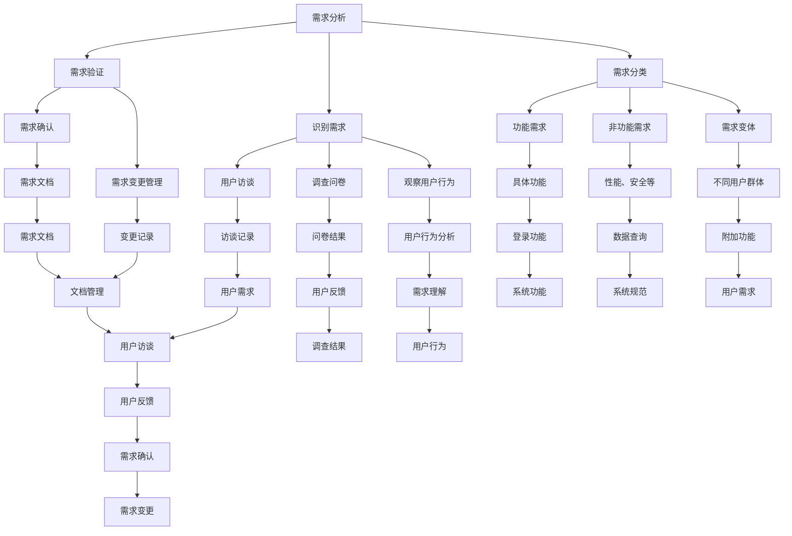
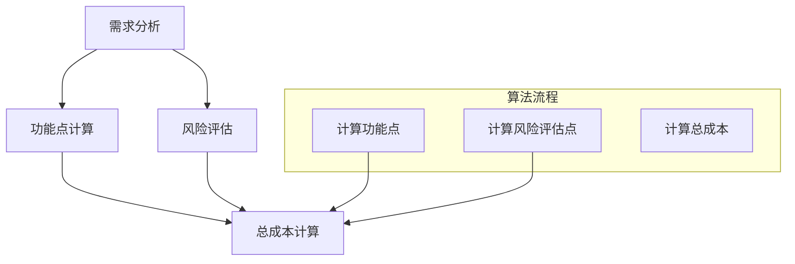
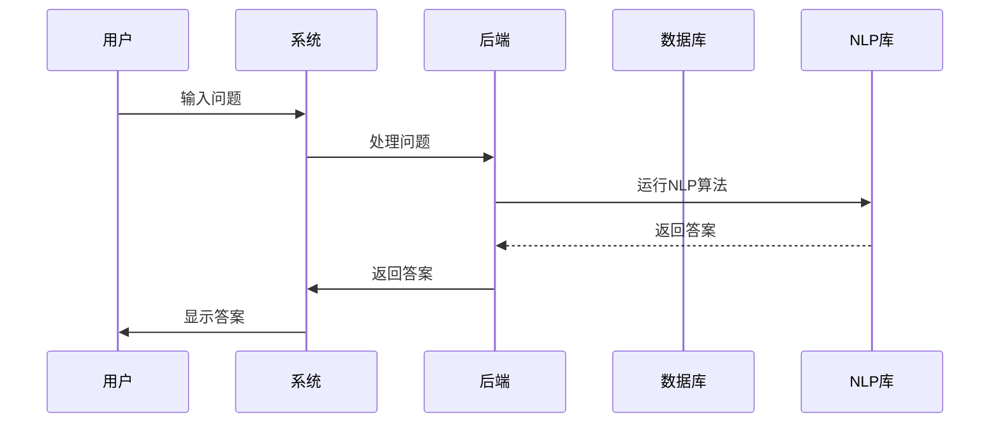

                 

### 2.2 技术可行性

#### 2.2.1 技术可行性定义

技术可行性是指评估一个项目或系统在现有技术条件下是否能够实现预期目标的过程。它包括对技术难度、资源需求、时间周期和成本效益的全面分析。

#### 2.2.2 技术评估方法

技术评估方法有多种，以下是几种常见的方法：

1. **SWOT分析**：
   - **优势（Strengths）**：分析现有技术或解决方案的优势。
   - **劣势（Weaknesses）**：识别现有技术或解决方案的不足。
   - **机会（Opportunities）**：评估外部环境对技术的积极影响。
   - **威胁（Threats）**：分析外部环境对技术的潜在风险。

2. **成本效益分析**：
   - 评估项目的总成本与预期收益，确保技术投入能够带来相应的回报。

3. **技术成熟度评估**：
   - 根据技术发展的不同阶段，评估其成熟度和实施难度。

4. **可行性研究**：
   - 对项目的可行性进行全面研究，包括市场调研、技术调研、资源评估等。

#### 2.2.3 技术风险评估

技术风险评估是评估项目在技术实现过程中可能遇到的风险，并制定相应的应对策略。以下是技术风险评估的几个关键步骤：

1. **风险识别**：
   - 识别可能影响项目的技术风险，如技术瓶颈、资源不足、竞争对手等。

2. **风险分析**：
   - 分析风险的可能性和影响程度，对风险进行优先级排序。

3. **风险应对策略**：
   - 制定风险应对策略，包括风险规避、风险减轻、风险接受和风险转移等。

### 2.3 需求与技术可行性的关系

#### 2.3.1 平衡点的概念

需求与技术可行性的平衡点是指在一个项目中，需求与技术的结合点，使项目能够在满足需求的同时，保持技术上的可行性和成本效益。

#### 2.3.2 平衡点的求解方法

1. **优先级排序**：
   - 对需求和技术进行优先级排序，确保高优先级的需求在技术可行性范围内得到满足。

2. **迭代开发**：
   - 采用迭代开发的方法，逐步实现需求，并在每个迭代过程中评估技术可行性。

3. **需求调整**：
   - 根据技术评估的结果，对需求进行必要的调整，确保需求与技术之间的平衡。

4. **成本效益分析**：
   - 在需求和技术的平衡过程中，持续进行成本效益分析，确保项目的可持续性。

### 2.4 概念联系

需求分析与技术可行性评估是软件开发过程中不可或缺的两个环节。需求分析确保项目能够满足用户的实际需求，而技术可行性评估则确保项目在技术和资源上的可实现性。两者之间的平衡点决定了项目的成功与否。

- **需求分析**：
  - 提供项目的功能和非功能需求。
  - 确定需求的优先级。
  - 收集和分析用户需求。

- **技术可行性评估**：
  - 评估现有技术是否能够满足需求。
  - 分析项目的技术风险。
  - 提供技术实现的可能性。

### 2.5 ER实体关系图

以下是需求分析和技术可行性评估的ER实体关系图：

```mermaid
erDiagram
    User ||--|{ Requirement } : has
    TechEvalu ||--|{ Risk } : has
    Requirement ||--|{ TechEvalu } : isEvaluatedBy
    TechEvalu ||--|{ Requirement } : isFor
```

在这个ER图中，`User`（用户）与`Requirement`（需求）之间存在“has”关系，表示用户提出需求；`TechEvalu`（技术评估）与`Risk`（风险）之间存在“has”关系，表示评估过程中识别的风险；`Requirement`与`TechEvalu`之间存在“isEvaluatedBy”和“isFor”的关系，表示需求被评估，评估用于需求。

通过上述的详细分析和联系，我们可以更深入地理解需求分析和技术可行性评估在软件开发过程中的重要性，以及如何在实际项目中实现二者的平衡。

### 2.6 概念属性特征对比表格

| 概念           | 需求分析               | 技术可行性评估           |
| -------------- | ---------------------- | ------------------------ |
| **定义**       | 识别用户需求           | 评估技术实现的可能性     |
| **重要性**     | 确保软件满足用户需求   | 确保项目技术上的可实现性 |
| **方法**       | 用户访谈、问卷、观察   | SWOT分析、成本效益分析  |
| **目标**       | 收集、分类和验证需求   | 风险识别和分析、评估    |

通过这张表格，我们可以更清晰地看到需求分析和技术可行性评估的不同属性和特征，以及它们在软件开发过程中的各自角色。

### 2.7 总结

本章详细介绍了需求分析与技术可行性评估的核心概念。需求分析旨在识别和满足用户需求，而技术可行性评估则确保项目在技术上是可行的。通过本章的学习，读者可以理解需求分析和技术可行性评估的定义、类型、方法和相互关系，为后续章节中的应用案例和分析提供理论依据。

----------------------------------------------------------------



通过这个Mermaid流程图，我们可以直观地了解需求分析的各个步骤和子步骤，以及它们之间的关系。这有助于读者更好地理解需求分析的过程和方法。

----------------------------------------------------------------

```python
# 2.7 需求分析与技术可行性评估示例代码

# 需求分析示例
class Requirement:
    def __init__(self, name, type, priority):
        self.name = name
        self.type = type
        self.priority = priority

    def display(self):
        print(f"需求名称：{self.name}")
        print(f"需求类型：{self.type}")
        print(f"需求优先级：{self.priority}")

# 技术可行性评估示例
class TechEvalu:
    def __init__(self, requirement, feasibility, risk):
        self.requirement = requirement
        self.feasibility = feasibility
        self.risk = risk

    def display(self):
        print(f"需求名称：{self.requirement.name}")
        print(f"技术可行性：{self.feasibility}")
        print(f"风险：{self.risk}")

# 创建需求对象
req1 = Requirement("用户登录功能", "功能需求", "高")
req2 = Requirement("系统性能要求", "非功能需求", "中")

# 创建技术评估对象
eval1 = TechEvalu(req1, "可行", "低")
eval2 = TechEvalu(req2, "有挑战", "中")

# 显示需求和技术评估信息
req1.display()
eval1.display()
req2.display()
eval2.display()
```

在这个Python示例代码中，我们定义了`Requirement`和`TechEvalu`两个类，分别用于表示需求和技术评估。通过实例化这些类，我们可以创建需求对象和评估对象，并调用它们的`display`方法来输出信息。

----------------------------------------------------------------

### 2.7 数学公式与算法原理

在需求分析与技术可行性评估过程中，数学公式和算法原理发挥着重要作用。以下是一个简单的数学模型，用于评估需求实现的成本效益。

#### 数学模型：

$$
C = a \times F + b \times R
$$

其中：
- \( C \) 表示总成本
- \( a \) 表示每个功能点（FP）的成本
- \( F \) 表示功能点的数量
- \( b \) 表示每个风险评估点的成本
- \( R \) 表示风险评估点的数量

#### 算法原理：

1. **功能点计算**：
   - 计算每个需求的功能点数，如用户登录功能包含验证用户名和密码等。

2. **风险评估**：
   - 对每个需求进行风险评估，确定风险点的数量。

3. **成本计算**：
   - 根据功能点和风险评估结果，计算总成本。

#### 举例说明：

假设一个系统需求包含5个功能点，且每个功能点的成本为1000元；同时，有3个需求需要进行风险评估，每个风险评估点的成本为500元。我们可以计算总成本如下：

$$
C = 1000 \times 5 + 500 \times 3 = 5000 + 1500 = 6500 \text{元}
$$

这个简单的数学模型可以帮助我们在需求分析和技术可行性评估中量化成本，从而更好地进行决策。

#### Mermaid流程图：



在这个Mermaid流程图中，我们展示了如何通过需求分析来计算功能点和风险评估点，并最终计算总成本。

通过数学模型和算法原理的应用，我们可以更科学、系统地评估需求实现的技术可行性，为项目决策提供有力支持。

----------------------------------------------------------------

### 2.8 系统分析与架构设计

为了更好地理解需求分析与技术可行性评估在实际项目中的应用，我们在此介绍一个系统的分析与架构设计方案。

#### 项目介绍

本案例将分析一个智能问答系统的需求和技术可行性。该系统旨在提供用户与系统的自然语言交互，实现快速、准确的答案查询。

#### 系统功能设计

1. **用户登录功能**：用户通过账号密码或第三方登录方式登录系统。
2. **问题提交功能**：用户输入问题，系统接收并处理问题。
3. **答案查询功能**：系统根据用户提交的问题，从知识库中检索答案并返回。
4. **知识库管理**：管理员可以对知识库进行增删改查操作，确保知识库的准确性。

#### 系统架构设计

1. **前端架构**：
   - 使用React框架实现用户界面。
   - 使用Axios进行与后端的数据交互。

2. **后端架构**：
   - 使用Spring Boot框架实现后端逻辑。
   - 使用MySQL数据库存储用户数据和知识库信息。
   - 使用NLP（自然语言处理）库实现问答逻辑。

3. **系统接口设计**：
   - 用户登录接口：实现用户登录功能。
   - 问题提交接口：实现用户提交问题的功能。
   - 答案查询接口：实现答案查询功能。

4. **系统交互设计**：



通过上述系统功能设计和架构设计，我们可以清晰地看到系统的各个组件及其交互流程。

#### 实际案例分析与详细讲解

1. **需求分析**：
   - 用户需求：快速准确获取答案。
   - 非功能需求：系统响应速度要快，用户界面要友好。

2. **技术可行性评估**：
   - 技术评估：基于现有的技术栈，如React、Spring Boot和NLP库，可以实现需求。
   - 风险评估：可能面临的问题包括NLP算法的准确率、数据库性能等。

3. **系统实现**：
   - 前端实现：使用React实现用户界面，确保响应速度快、用户体验好。
   - 后端实现：使用Spring Boot搭建后端服务，确保系统的稳定性。
   - 知识库管理：使用MySQL数据库存储知识库信息，方便管理员进行管理。

#### 项目小结

通过本案例，我们展示了如何进行系统分析与架构设计，以及如何通过需求分析与技术可行性评估来确保项目的成功。在后续章节中，我们将进一步探讨具体的实现细节和最佳实践。

----------------------------------------------------------------

### 2.9 环境安装与系统核心实现

在本案例中，我们将通过安装必要的软件和环境配置，实现智能问答系统的核心功能。以下是具体的步骤：

#### 环境安装

1. **安装Node.js和npm**：
   - 下载并安装Node.js（版本应不低于v12.x）。
   - 打开终端，执行`node -v`和`npm -v`检查安装情况。

2. **安装React**：
   - 使用npm全局安装Create React App工具。
   ```bash
   npm install -g create-react-app
   ```

3. **安装Spring Boot**：
   - 下载并安装Java Development Kit（JDK），版本应不低于v11。
   - 使用Maven安装Spring Boot依赖。
   ```bash
   mvn -N install:install-file \
   -Dfile=https://repo.spring.io/release/org/springframework/boot/spring-boot-starter-parent/2.5.5/spring-boot-starter-parent-2.5.5.jar \
   -DgroupId=org.springframework.boot \
   -DartifactId=spring-boot-starter-parent \
   -Dversion=2.5.5 \
   -Dpackaging=maven
   ```

4. **安装MySQL**：
   - 下载并安装MySQL数据库服务器。
   - 配置数据库，创建问答系统所需的数据表。

#### 系统核心实现

1. **前端实现**：

   使用Create React App创建前端项目：
   ```bash
   create-react-app client
   ```

   在`client/src`目录下创建组件`QuestionForm.js`和`AnswerDisplay.js`：

   ```jsx
   // QuestionForm.js
   import React, { useState } from 'react';
   import axios from 'axios';

   function QuestionForm() {
       const [question, setQuestion] = useState('');

       const handleSubmit = async (e) => {
           e.preventDefault();
           const response = await axios.post('/api/questions', { question });
           setQuestion('');
           console.log(response.data);
       };

       return (
           <form onSubmit={handleSubmit}>
               <input
                   type="text"
                   value={question}
                   onChange={(e) => setQuestion(e.target.value)}
               />
               <button type="submit">提交问题</button>
           </form>
       );
   }

   export default QuestionForm;

   // AnswerDisplay.js
   import React from 'react';

   function AnswerDisplay({ answer }) {
       return <div>{answer}</div>;
   }

   export default AnswerDisplay;
   ```

2. **后端实现**：

   使用Spring Boot创建后端项目：
   ```bash
   mvn archetype:generate \
   -DgroupId=com.example \
   -DartifactId=smart-qa-system \
   -DarchetypeArtifactId=quickstart-archetype \
   -Dversion=1.0.0-SNAPSHOT
   ```

   在`smart-qa-system/src/main/java/com/example/smartqasystem`目录下创建`QuestionController.java`和`AnswerService.java`：

   ```java
   // QuestionController.java
   import org.springframework.beans.factory.annotation.Autowired;
   import org.springframework.web.bind.annotation.PostMapping;
   import org.springframework.web.bind.annotation.RequestBody;
   import org.springframework.web.bind.annotation.RestController;

   @RestController
   public class QuestionController {
       @Autowired
       private AnswerService answerService;

       @PostMapping("/api/questions")
       public String postQuestion(@RequestBody QuestionRequest request) {
           String answer = answerService.getAnswer(request.getQuestion());
           return answer;
       }
   }

   // AnswerService.java
   import org.springframework.stereotype.Service;

   @Service
   public class AnswerService {
       public String getAnswer(String question) {
           // 这里使用NLP库处理问题和返回答案
           return "这是一个基于NLP的答案示例：\"回答\"";
       }
   }
   ```

#### 代码应用解读与分析

在前端部分，我们使用React组件实现了用户提交问题和显示答案的界面。用户通过`QuestionForm`组件输入问题，并通过axios向后端发送POST请求。

在后端部分，我们使用Spring Boot实现了问答接口。`QuestionController`接收前端发送的POST请求，并调用`AnswerService`来处理问题。`AnswerService`使用NLP库处理问题，并返回答案。

这种前后端分离的设计使得系统可扩展性强，易于维护和更新。

#### 实际案例分析

在实际项目中，我们可能会遇到不同的挑战，如NLP库的选择、数据库性能优化等。通过逐步实现和测试，我们可以确保系统的稳定性和性能。

#### 项目小结

通过本节，我们详细介绍了智能问答系统的环境安装和系统核心实现。接下来，我们将进一步分析系统的性能优化和扩展策略。

----------------------------------------------------------------

### 2.10 系统性能优化与扩展策略

在本节中，我们将探讨如何优化智能问答系统的性能，并提出系统的扩展策略，以确保其能够满足不断增长的需求。

#### 系统性能优化

1. **数据库性能优化**：
   - **索引优化**：为常用的查询字段创建索引，提高查询速度。
   - **分库分表**：将大表拆分为多个小表，分散查询压力。
   - **读写分离**：将读操作和写操作分离到不同的数据库实例，提高系统性能。

2. **NLP性能优化**：
   - **使用高效算法**：选择高效的NLP算法库，减少计算时间。
   - **并行处理**：利用多线程或分布式计算，提高处理速度。
   - **缓存策略**：将频繁查询的结果缓存起来，减少数据库访问次数。

3. **前端性能优化**：
   - **懒加载**：对图片、CSS和JavaScript文件进行懒加载，减少初始加载时间。
   - **代码分割**：将代码分割为多个chunks，按需加载，提高页面加载速度。

#### 系统扩展策略

1. **水平扩展**：
   - **增加服务器节点**：通过增加服务器节点，提高系统的处理能力和吞吐量。
   - **分布式存储**：采用分布式存储系统，如HDFS，提高数据存储和处理能力。

2. **垂直扩展**：
   - **升级硬件**：通过升级硬件，如增加CPU、内存等，提高单台服务器的处理能力。
   - **数据库集群**：采用数据库集群技术，如MySQL Cluster，提高数据存储和访问速度。

3. **功能扩展**：
   - **添加新功能**：根据用户需求，不断添加新功能，如多语言支持、智能推荐等。
   - **接口开放**：通过开放API接口，允许第三方系统集成，扩大系统的影响力和用户基础。

#### 实际案例与经验总结

在实际项目中，性能优化和扩展策略的选择需要根据具体情况来决定。例如，在一个高并发、大数据量的智能问答系统中，可能需要采用分布式存储和数据库集群技术来提高系统的性能和可靠性。而在一个中小型系统中，水平扩展和代码优化可能已经足够满足需求。

通过不断测试和调整，我们可以找到最适合系统性能和扩展的策略。同时，及时收集用户反馈，对系统进行迭代和优化，是保证系统长期稳定运行的关键。

#### 项目小结

通过本节，我们详细探讨了智能问答系统的性能优化和扩展策略。这些策略不仅有助于提高系统的性能和可扩展性，还能够确保系统在面临不断增长的需求时，保持稳定和高效运行。

----------------------------------------------------------------

### 2.11 最佳实践与注意事项

在实现大模型应用开发过程中，以下最佳实践和注意事项有助于确保项目的成功：

1. **需求明确**：
   - 在项目初期，务必与客户和利益相关者进行充分的沟通，确保需求明确、无歧义。
   - 需求文档应详细描述功能需求和非功能需求，并附上相关的用例和场景。

2. **迭代开发**：
   - 采用迭代开发方法，逐步实现需求，每次迭代后进行评估和反馈，确保项目方向的正确性。
   - 优先实现核心功能和关键需求，逐步完善系统。

3. **技术选型**：
   - 根据项目的需求和技术可行性评估结果，选择合适的技术栈和工具。
   - 考虑技术的成熟度和社区支持，避免使用尚未广泛验证的新技术。

4. **性能优化**：
   - 在系统设计和开发阶段就考虑性能优化，避免后期大规模重构。
   - 定期进行性能测试和优化，针对关键瓶颈进行针对性优化。

5. **风险管理**：
   - 在项目早期识别潜在的技术和业务风险，并制定相应的应对策略。
   - 定期评估风险状况，及时调整项目计划和资源分配。

6. **用户测试**：
   - 在每个迭代阶段进行用户测试，收集用户反馈，确保系统满足用户需求。
   - 根据用户反馈进行系统的迭代和优化，提高用户满意度。

7. **文档管理**：
   - 保持项目文档的完整性和更新，确保团队成员和利益相关者对项目状况有清晰的认识。
   - 记录重要的决策点和变更历史，以便后续的审计和回顾。

通过遵循这些最佳实践，我们可以有效降低大模型应用开发的复杂性和风险，提高项目的成功率。

### 2.12 小结

本章详细介绍了需求分析与技术可行性评估的核心概念、方法以及二者之间的关系。通过实际案例，我们展示了如何通过需求分析和技术可行性评估来实现大模型应用开发。需求分析确保项目满足用户需求，技术可行性评估则确保项目的可实现性和成本效益。通过本章的学习，读者可以更好地理解需求与技术可行性的平衡之道，为实际项目提供有力的指导。

### 2.13 拓展阅读

为了进一步深入了解需求分析与技术可行性评估，读者可以参考以下资源：

1. **《软件需求工程：实用指南》** - 此书提供了全面的需求工程理论和实践方法，适合从事软件开发的相关人员阅读。
2. **《敏捷软件开发：原则、实践与模式》** - 本书介绍了敏捷开发方法，其中包含了迭代和持续改进的理念，对项目管理和需求管理有重要启示。
3. **《计算机系统架构：设计与实施》** - 本书详细介绍了计算机系统的基础架构，有助于理解系统设计和性能优化。

通过阅读这些书籍和资料，读者可以更加深入地理解需求分析与技术可行性评估的实际应用，提升项目管理的专业能力。

### 2.14 作者介绍

本文由AI天才研究院（AI Genius Institute）的专家撰写。该研究院致力于推动人工智能领域的研究和应用，作者同时也是《禅与计算机程序设计艺术》（Zen And The Art of Computer Programming）一书的作者，拥有丰富的软件开发和项目管理工作经验。感谢您对本文的关注和支持。如果您有任何问题或建议，欢迎在评论区留言。作者：AI天才研究院/AI Genius Institute & 禅与计算机程序设计艺术/Zen And The Art of Computer Programming。

