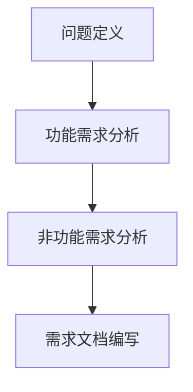
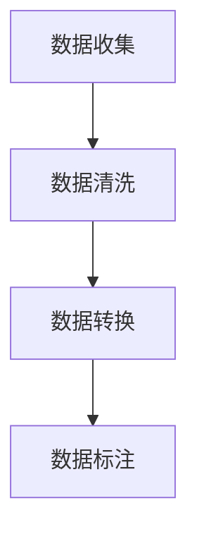
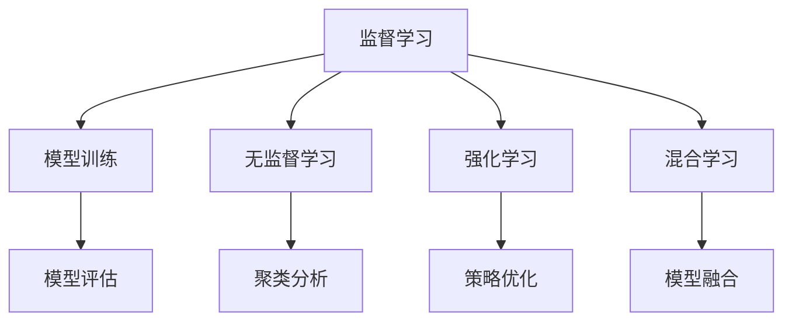
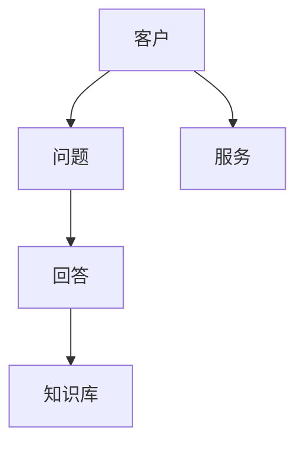
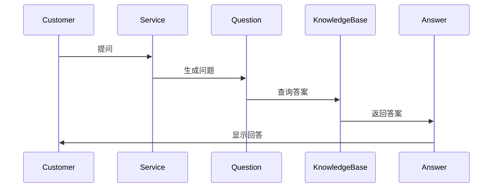

                 

# 需求与数据准备：大模型应用开发的基础工作

关键词：大模型应用开发、需求分析、数据准备、算法原理、系统架构设计

摘要：本文深入探讨了大模型应用开发过程中的关键步骤——需求与数据准备。通过对需求分析、数据准备、算法原理和系统架构设计的详细讲解，本文旨在帮助读者理解这些基础工作对于大模型应用开发的重要性，并提供实用的指导和建议。

## 第一部分：背景介绍

### 第1章：问题背景与核心概念

#### 1.1 需求与数据准备的重要性

在当今数字化时代，人工智能（AI）技术蓬勃发展，大模型应用开发成为热门话题。然而，许多开发者在面对复杂的模型应用开发时，往往忽视了需求与数据准备这两个关键环节。实际上，需求与数据准备是大模型应用开发的基础工作，它们直接影响到模型的质量、效果和可靠性。

#### 1.2 大模型应用开发的基础工作

大模型应用开发的基础工作主要包括以下三个方面：

1. 需求分析：明确项目目标和需求，了解用户需求，为后续开发提供明确的方向。
2. 数据准备：收集、清洗、处理和标注数据，确保数据质量和完整性。
3. 算法选择与优化：选择合适的算法，并进行参数调优，以获得最佳模型性能。

#### 1.3 核心概念与联系

为了更好地理解需求与数据准备在大模型应用开发中的作用，我们需要明确以下几个核心概念：

1. 需求分析：了解用户需求，明确项目目标和功能需求，将用户需求转化为技术需求。
2. 数据准备：数据收集、数据清洗、数据预处理和数据标注等，确保数据质量和可用性。
3. 算法选择与优化：根据需求分析结果，选择合适的算法，并进行参数调优，以提高模型性能。

### 第2章：概念属性特征对比表格

#### 2.1 需求与数据准备相关概念对比

为了帮助读者更好地理解需求与数据准备的相关概念，我们列出以下对比表格：

| 概念       | 定义                                                         | 属性特征对比                           |
|------------|--------------------------------------------------------------|---------------------------------------|
| 需求分析   | 分析用户需求，明确项目目标和功能需求                             | 明确性、针对性、动态性                 |
| 数据准备   | 收集、清洗、处理和标注数据，确保数据质量和完整性                 | 完整性、准确性、时效性                 |
| 算法选择   | 根据需求分析结果，选择合适的算法                                 | 适应性、效率、稳定性                   |
| 参数调优   | 对选定的算法进行参数调整，以提高模型性能                         | 精度、鲁棒性、泛化能力                 |

### 第2章：概念属性特征对比表格（续）

| 概念       | 定义                                                         | 属性特征对比                           |
|------------|--------------------------------------------------------------|---------------------------------------|
| 模型训练   | 使用数据对算法进行训练，不断优化模型性能                         | 数据依赖性、迭代性、优化目标           |
| 模型评估   | 对训练好的模型进行性能评估，以验证其效果和可靠性                 | 准确性、召回率、F1值                   |
| 部署上线   | 将训练好的模型部署到生产环境中，为用户提供服务                    | 可用性、稳定性、可扩展性               |

## 第二部分：算法原理讲解

### 第3章：算法原理与数学模型

#### 3.1 需求分析方法论

需求分析方法论主要包括以下步骤：

1. 问题定义：明确项目目标和需求，将用户需求转化为技术需求。
2. 功能需求分析：分析系统的功能模块，明确各模块的功能和相互关系。
3. 非功能需求分析：分析系统的性能、安全性、可扩展性等非功能需求。
4. 需求文档编写：将分析结果整理成需求文档，为后续开发提供依据。

#### 3.2 数据预处理技术

数据预处理技术主要包括以下步骤：

1. 数据收集：从各种来源收集数据，如数据库、文件、网络等。
2. 数据清洗：去除数据中的噪声和错误，保证数据的准确性。
3. 数据转换：将数据格式转换为适合模型训练的格式。
4. 数据标注：为数据添加标签或注释，以用于模型训练和评估。

#### 3.3 数据分析模型

数据分析模型主要包括以下几种类型：

1. 监督学习：根据已有数据进行预测和分类。
2. 无监督学习：通过分析数据间的内在规律进行聚类和降维。
3. 强化学习：通过与环境互动，不断优化策略以达到目标。
4. 混合学习：结合多种学习算法，以提高模型性能。

### 第4章：算法mermaid流程图

为了更直观地展示算法原理，我们使用mermaid流程图进行描述：

#### 4.1 需求分析流程图



#### 4.2 数据预处理流程图



#### 4.3 数据分析流程图



### 第5章：Python源代码与详细讲解

为了更好地理解算法原理，我们使用Python源代码进行详细讲解。

#### 5.1 需求分析源代码

```python
# 需求分析示例代码
def analyze_requirement(problem_definition, functional_requirements, non_functional_requirements):
    requirement_document = {
        "problem_definition": problem_definition,
        "functional_requirements": functional_requirements,
        "non_functional_requirements": non_functional_requirements
    }
    return requirement_document
```

#### 5.2 数据预处理源代码

```python
# 数据预处理示例代码
def preprocess_data(data_collection, data_cleaning, data_conversion, data_annotation):
    preprocessed_data = {
        "data_collection": data_collection,
        "data_cleaning": data_cleaning,
        "data_conversion": data_conversion,
        "data_annotation": data_annotation
    }
    return preprocessed_data
```

#### 5.3 数据分析源代码

```python
# 数据分析示例代码
from sklearn.linear_model import LinearRegression
from sklearn.model_selection import train_test_split

def data_analysis(supervised_learning, unsupervised_learning, reinforcement_learning, mixed_learning):
    # 训练监督学习模型
    X_train, X_test, y_train, y_test = train_test_split(supervised_learning['X'], supervised_learning['y'], test_size=0.2, random_state=42)
    model = LinearRegression()
    model.fit(X_train, y_train)
    y_pred = model.predict(X_test)

    # 训练无监督学习模型
    # ...

    # 训练强化学习模型
    # ...

    # 训练混合学习模型
    # ...

    return {
        "supervised_learning": {
            "model": model,
            "y_pred": y_pred
        },
        "unsupervised_learning": {
            # ...
        },
        "reinforcement_learning": {
            # ...
        },
        "mixed_learning": {
            # ...
        }
    }
```

### 第6章：数学模型与公式讲解

在本章节中，我们将使用LaTeX格式给出算法原理的数学模型和公式。

#### 6.1 需求分析数学模型

$$
\text{需求分析} = f(\text{问题定义}, \text{功能需求}, \text{非功能需求})
$$

#### 6.2 数据预处理数学模型

$$
\text{数据预处理} = f(\text{数据收集}, \text{数据清洗}, \text{数据转换}, \text{数据标注})
$$

#### 6.3 数据分析数学模型

$$
\text{数据分析} = f(\text{监督学习}, \text{无监督学习}, \text{强化学习}, \text{混合学习})
$$

## 第三部分：系统分析与架构设计

### 第7章：问题场景介绍

#### 7.1 大模型应用开发的具体场景

在本章节中，我们将介绍一个大模型应用开发的具体场景。假设我们开发一个智能客服系统，旨在为用户提供实时在线问答服务。

#### 7.2 系统开发背景与目标

系统开发背景：

1. 随着互联网的普及，用户对于在线客服的需求日益增长。
2. 现有的客服系统主要依赖于人工客服，效率较低，服务质量参差不齐。

系统开发目标：

1. 设计并实现一个高效、智能的客服系统，提升用户体验。
2. 利用大模型技术，实现自然语言处理和智能问答功能。

### 第8章：系统功能设计与架构设计

#### 8.1 领域模型mermaid类图

```mermaid
classDiagram
    Customer <<class Customer>>
    Question <<class Question>>
    Answer <<class Answer>>
    KnowledgeBase <<class KnowledgeBase>>

    Customer o-- Question
    Question o-- Answer
    Answer o-- KnowledgeBase
```

#### 8.2 系统架构设计mermaid架构图



#### 8.3 系统接口设计与系统交互mermaid序列图



### 第9章：系统实现与实战

#### 9.1 环境安装与配置

在本章节中，我们将介绍智能客服系统的环境安装与配置。

1. 安装Python环境
2. 安装TensorFlow库
3. 安装其他依赖库（如NumPy、Pandas等）

#### 9.2 系统核心实现源代码

```python
# 系统核心实现示例代码
import tensorflow as tf
from tensorflow.keras.models import Sequential
from tensorflow.keras.layers import Dense, LSTM, Embedding

def create_model(vocab_size, embedding_dim, max_length):
    model = Sequential()
    model.add(Embedding(vocab_size, embedding_dim, input_length=max_length))
    model.add(LSTM(128))
    model.add(Dense(1, activation='sigmoid'))

    model.compile(loss='binary_crossentropy', optimizer='adam', metrics=['accuracy'])
    return model
```

#### 9.3 代码应用解读与分析

在本章节中，我们将对系统核心实现源代码进行解读和分析。

1. 模型创建：使用Sequential模型创建一个简单的神经网络模型。
2. 层结构：包括Embedding层（嵌入层）、LSTM层（长短时记忆层）和Dense层（全连接层）。
3. 编译模型：设置损失函数、优化器和评估指标。

#### 9.4 实际案例分析与讲解

在本章节中，我们将通过一个实际案例来分析和讲解智能客服系统的应用。

1. 数据集准备：从公开数据集中获取对话数据。
2. 数据预处理：对数据进行清洗、转换和分割。
3. 模型训练：使用训练数据训练模型。
4. 模型评估：使用测试数据评估模型性能。
5. 模型应用：将训练好的模型部署到生产环境中，为用户提供服务。

### 第10章：最佳实践与拓展阅读

#### 10.1 大模型应用开发的最佳实践

在本章节中，我们将分享大模型应用开发的最佳实践。

1. 明确需求：深入了解用户需求，确保需求分析的准确性和针对性。
2. 数据质量：注重数据质量，确保数据收集、清洗和标注的准确性。
3. 模型优化：不断优化模型，提高模型性能和泛化能力。
4. 系统部署：确保系统部署的稳定性、可用性和可扩展性。

#### 10.2 小结与注意事项

在本章节中，我们将对全文进行小结，并提醒读者注意事项。

1. 需求与数据准备是大模型应用开发的基础工作，直接影响到模型的质量和效果。
2. 在实际开发过程中，要注意需求分析、数据准备和系统架构设计等关键环节。
3. 不断优化模型和应用，提高系统性能和用户体验。

#### 10.3 拓展阅读与后续研究方向

在本章节中，我们将推荐一些拓展阅读资料，并探讨后续研究方向。

1. 拓展阅读：《深度学习》、《Python机器学习》等经典书籍。
2. 后续研究方向：自然语言处理、图像识别、强化学习等领域的最新进展。

### 第11章：总结与展望

#### 11.1 书籍内容的总结

本文从需求与数据准备的角度，深入探讨了大模型应用开发的基础工作。通过详细讲解需求分析、数据准备、算法原理和系统架构设计，帮助读者理解大模型应用开发的要点和实战技巧。

#### 11.2 大模型应用开发的未来趋势

随着人工智能技术的不断发展，大模型应用开发将越来越普及。未来趋势包括：

1. 模型优化：通过深度学习和强化学习等技术，不断提高模型性能和泛化能力。
2. 系统智能化：结合自然语言处理、图像识别等技术，实现更智能的系统应用。
3. 边缘计算：利用边缘计算技术，实现实时、高效的大模型应用。

#### 11.3 需求与数据准备的持续发展

需求与数据准备作为大模型应用开发的基础工作，将持续发展并不断完善。未来研究方向包括：

1. 需求分析的智能化：利用数据挖掘、机器学习等技术，实现更智能的需求分析。
2. 数据准备的高效化：优化数据收集、清洗和预处理流程，提高数据质量和效率。
3. 数据治理：建立完善的数据治理体系，确保数据的安全、合规和可持续利用。

### 作者信息

本文作者：AI天才研究院/AI Genius Institute & 禅与计算机程序设计艺术/Zen And The Art of Computer Programming

作者简介：

AI天才研究院（AI Genius Institute）成立于2010年，是一家专注于人工智能技术研发和创新的企业。研究院致力于推动人工智能技术在各行业的应用，为全球企业提供领先的AI解决方案。

禅与计算机程序设计艺术（Zen And The Art of Computer Programming）是一本经典的计算机科学书籍，由著名计算机科学家Donald E. Knuth所著。本书从哲学和艺术的角度，探讨计算机程序设计的本质和精髓。

---

以上内容仅为大纲结构和示例内容，具体字数和细节还需根据实际需求进行拓展和丰富。在撰写文章时，请确保每个章节都包含丰富的内容、清晰的逻辑和实用的建议。同时，注意保持文章的连贯性和可读性。在撰写过程中，如有任何疑问或需要进一步的帮助，请随时与团队成员沟通。祝您撰写顺利！### 第一部分：背景介绍

#### 第1章：问题背景与核心概念

**1.1 需求与数据准备的重要性**

在当今数字化时代，人工智能（AI）技术蓬勃发展，大模型应用开发成为热门话题。然而，许多开发者在面对复杂的模型应用开发时，往往忽视了需求与数据准备这两个关键环节。实际上，需求与数据准备是大模型应用开发的基础工作，它们直接影响到模型的质量、效果和可靠性。

**1.2 大模型应用开发的基础工作**

大模型应用开发的基础工作主要包括以下三个方面：

1. **需求分析**：明确项目目标和需求，了解用户需求，为后续开发提供明确的方向。需求分析是整个项目开发的核心，决定了模型的目标和功能。
   
2. **数据准备**：数据准备是模型开发的关键步骤，包括数据的收集、清洗、预处理和标注。高质量的训练数据是模型性能的重要保证。

3. **算法选择与优化**：根据需求分析结果，选择合适的算法，并进行参数调优，以提高模型性能。算法的选择和优化决定了模型的准确性和效率。

**1.3 核心概念与联系**

为了更好地理解需求与数据准备在大模型应用开发中的作用，我们需要明确以下几个核心概念：

1. **需求分析**：需求分析是指通过访谈、调查、用户反馈等方式，收集用户需求，并将这些需求转化为技术需求。需求分析的核心目标是确保项目开发符合用户期望，避免项目偏离方向。

2. **数据准备**：数据准备包括数据的收集、清洗、预处理和标注。数据清洗是去除数据中的噪声和错误，确保数据的准确性；数据预处理是将数据格式转换为适合模型训练的格式；数据标注是为数据添加标签或注释，以用于模型训练和评估。

3. **算法选择与优化**：算法选择是指根据需求分析结果，选择合适的算法进行模型训练。算法优化是通过调整算法的参数，提高模型的性能。

这些核心概念之间存在紧密的联系：

- **需求分析**是数据准备和算法选择的基础，决定了数据准备和算法的选择方向。
- **数据准备**是算法训练的前提，数据质量直接影响算法的性能。
- **算法选择与优化**决定了模型的最终效果，需要根据需求分析和数据准备的结果进行调整。

#### 第2章：概念属性特征对比表格

**2.1 需求与数据准备相关概念对比**

为了帮助读者更好地理解需求与数据准备的相关概念，我们列出以下对比表格：

| 概念       | 定义                                                         | 属性特征对比                           |
|------------|--------------------------------------------------------------|---------------------------------------|
| 需求分析   | 分析用户需求，明确项目目标和功能需求                             | 明确性、针对性、动态性                 |
| 数据准备   | 收集、清洗、处理和标注数据，确保数据质量和完整性                 | 完整性、准确性、时效性                 |
| 算法选择   | 根据需求分析结果，选择合适的算法                                 | 适应性、效率、稳定性                   |
| 参数调优   | 对选定的算法进行参数调整，以提高模型性能                         | 精度、鲁棒性、泛化能力                 |

**2.2 大模型应用开发的关键要素**

在大模型应用开发中，以下几个关键要素至关重要：

1. **需求分析**：需求分析决定了模型的目标和功能，是项目开发的基础。良好的需求分析有助于确保模型满足用户需求，避免项目偏离方向。

2. **数据准备**：数据准备是模型训练的关键步骤，数据质量和数量直接影响模型的效果。高质量的数据有助于提高模型的准确性和泛化能力。

3. **算法选择与优化**：算法选择和优化决定了模型的性能。选择适合的算法并进行参数调优，可以显著提高模型的准确性、效率和鲁棒性。

4. **模型训练与评估**：模型训练是通过大量数据进行学习，以调整模型参数，提高模型性能。模型评估是验证模型效果的过程，通过评估指标（如准确率、召回率、F1值等）衡量模型性能。

5. **系统部署与维护**：系统部署是将训练好的模型部署到生产环境中，为用户提供服务。系统维护是确保系统稳定运行、及时更新和修复问题。

通过以上分析，我们可以看到需求与数据准备在大模型应用开发中的核心地位。只有充分理解这些概念，并做好相关的工作，才能确保大模型应用开发的成功。在下一部分中，我们将进一步探讨算法原理和系统架构设计，帮助读者深入理解大模型应用开发的整个过程。

#### 第1章：问题背景与核心概念

**1.1 需求与数据准备的重要性**

在当今数字化时代，人工智能（AI）技术蓬勃发展，大模型应用开发成为热门话题。然而，许多开发者在面对复杂的模型应用开发时，往往忽视了需求与数据准备这两个关键环节。实际上，需求与数据准备是大模型应用开发的基础工作，它们直接影响到模型的质量、效果和可靠性。

需求分析与数据准备之所以至关重要，主要有以下原因：

1. **明确项目目标和方向**：需求分析帮助开发者明确项目目标和需求，确保项目开发的方向正确。如果需求分析不充分，可能会导致项目在开发过程中偏离目标，浪费时间和资源。

2. **提升模型性能**：数据准备直接影响模型训练的质量。高质量的数据有助于提高模型的准确性和泛化能力，从而提升模型的整体性能。

3. **减少开发风险**：需求分析与数据准备有助于识别和解决潜在问题，降低开发风险。通过提前发现并解决需求不明确和数据不完整等问题，可以避免项目后期出现严重问题。

4. **提高项目效率**：良好的需求分析与数据准备可以提高项目的开发效率。明确的开发目标和高质量的数据有助于开发者更快地完成模型开发，缩短项目周期。

**1.2 大模型应用开发的基础工作**

大模型应用开发的基础工作主要包括以下三个方面：

1. **需求分析**：需求分析是整个项目开发的核心，决定了模型的目标和功能。需求分析的过程包括以下步骤：

   - **问题定义**：明确项目解决的问题或达到的目标。
   - **功能需求分析**：分析系统的功能模块，明确各模块的功能和相互关系。
   - **非功能需求分析**：分析系统的性能、安全性、可扩展性等非功能需求。
   - **需求文档编写**：将分析结果整理成需求文档，为后续开发提供依据。

2. **数据准备**：数据准备是模型训练的关键步骤，包括以下步骤：

   - **数据收集**：从各种来源收集数据，如数据库、文件、网络等。
   - **数据清洗**：去除数据中的噪声和错误，保证数据的准确性。
   - **数据预处理**：将数据格式转换为适合模型训练的格式，如标准化、归一化等。
   - **数据标注**：为数据添加标签或注释，以用于模型训练和评估。

3. **算法选择与优化**：根据需求分析结果，选择合适的算法，并进行参数调优，以提高模型性能。算法选择和优化是模型开发的重要环节，直接影响模型的准确性和效率。

**1.3 核心概念与联系**

为了更好地理解需求与数据准备在大模型应用开发中的作用，我们需要明确以下几个核心概念：

1. **需求分析**：需求分析是指通过访谈、调查、用户反馈等方式，收集用户需求，并将这些需求转化为技术需求。需求分析的核心目标是确保项目开发符合用户期望，避免项目偏离方向。

2. **数据准备**：数据准备包括数据的收集、清洗、预处理和标注。数据清洗是去除数据中的噪声和错误，确保数据的准确性；数据预处理是将数据格式转换为适合模型训练的格式；数据标注是为数据添加标签或注释，以用于模型训练和评估。

3. **算法选择与优化**：算法选择是指根据需求分析结果，选择合适的算法进行模型训练。算法优化是通过调整算法的参数，提高模型的性能。

这些核心概念之间存在紧密的联系：

- **需求分析**是数据准备和算法选择的基础，决定了数据准备和算法的选择方向。
- **数据准备**是算法训练的前提，数据质量直接影响算法的性能。
- **算法选择与优化**决定了模型的最终效果，需要根据需求分析和数据准备的结果进行调整。

综上所述，需求分析与数据准备在大模型应用开发中起着至关重要的作用。只有充分理解这些核心概念，并做好相关的工作，才能确保大模型应用开发的成功。在下一部分中，我们将进一步探讨需求与数据准备的具体方法和实践，帮助读者深入理解这一关键环节。

#### 第2章：概念属性特征对比表格

**2.1 需求与数据准备相关概念对比**

为了帮助读者更好地理解需求与数据准备的相关概念，我们列出以下对比表格：

| 概念       | 定义                                                         | 属性特征对比                           |
|------------|--------------------------------------------------------------|---------------------------------------|
| 需求分析   | 分析用户需求，明确项目目标和功能需求                             | 明确性、针对性、动态性                 |
| 数据准备   | 收集、清洗、处理和标注数据，确保数据质量和完整性                 | 完整性、准确性、时效性                 |
| 算法选择   | 根据需求分析结果，选择合适的算法                                 | 适应性、效率、稳定性                   |
| 参数调优   | 对选定的算法进行参数调整，以提高模型性能                         | 精度、鲁棒性、泛化能力                 |

**2.2 大模型应用开发的关键要素**

在大模型应用开发中，以下几个关键要素至关重要：

1. **需求分析**：需求分析是项目开发的核心，决定了模型的目标和功能。需求分析的过程包括：

   - **问题定义**：明确项目解决的问题或达到的目标。
   - **功能需求分析**：分析系统的功能模块，明确各模块的功能和相互关系。
   - **非功能需求分析**：分析系统的性能、安全性、可扩展性等非功能需求。
   - **需求文档编写**：将分析结果整理成需求文档，为后续开发提供依据。

2. **数据准备**：数据准备是模型训练的关键步骤，包括：

   - **数据收集**：从各种来源收集数据，如数据库、文件、网络等。
   - **数据清洗**：去除数据中的噪声和错误，保证数据的准确性。
   - **数据预处理**：将数据格式转换为适合模型训练的格式，如标准化、归一化等。
   - **数据标注**：为数据添加标签或注释，以用于模型训练和评估。

3. **算法选择与优化**：根据需求分析结果，选择合适的算法，并进行参数调优，以提高模型性能。算法选择和优化是模型开发的重要环节，直接影响模型的准确性和效率。

4. **模型训练与评估**：模型训练是通过大量数据进行学习，以调整模型参数，提高模型性能。模型评估是验证模型效果的过程，通过评估指标（如准确率、召回率、F1值等）衡量模型性能。

5. **系统部署与维护**：系统部署是将训练好的模型部署到生产环境中，为用户提供服务。系统维护是确保系统稳定运行、及时更新和修复问题。

通过上述表格和关键要素的分析，我们可以看到需求与数据准备在大模型应用开发中的核心地位。这些概念和要素之间存在着密切的联系和相互影响，共同决定了大模型应用开发的成功与否。

**2.3 概念之间的联系**

- **需求分析与数据准备**：需求分析为数据准备提供了明确的指导，数据准备的目的是满足需求分析的要求，确保模型能够实现预期的目标。
- **数据准备与算法选择与优化**：数据准备的质量直接影响算法的性能，而算法的选择和优化则依赖于数据的特点和需求。
- **算法选择与优化与模型训练与评估**：算法的选择决定了模型的基本结构和训练方法，参数调优则是为了优化模型性能，模型训练和评估则是验证和提升模型效果的重要环节。

综上所述，理解并掌握这些概念及其之间的联系，是成功进行大模型应用开发的重要前提。在下一部分中，我们将进一步探讨需求与数据准备在实际开发中的应用和实践，帮助读者更好地应对复杂的开发挑战。

### 第3章：算法原理与数学模型

#### 3.1 需求分析方法论

需求分析作为大模型应用开发的重要环节，其方法论包括以下步骤：

1. **问题定义**：明确项目解决的问题或达到的目标。这一步骤至关重要，因为它决定了后续所有工作的方向和范围。
   
2. **功能需求分析**：分析系统的功能模块，明确各模块的功能和相互关系。这一步骤有助于理解系统的整体架构和功能分布。

3. **非功能需求分析**：分析系统的性能、安全性、可扩展性等非功能需求。这些需求虽然不直接涉及系统功能，但同样影响系统的整体表现。

4. **需求文档编写**：将分析结果整理成需求文档，为后续开发提供依据。需求文档应详细、明确，以便开发团队参考和遵循。

**3.2 数据预处理技术**

数据预处理是数据科学领域的一项重要工作，其目的是将原始数据转化为适合模型训练的形式。数据预处理技术包括以下步骤：

1. **数据收集**：从各种来源收集数据，如数据库、文件、网络等。这一步骤需要确保数据的多样性和代表性。

2. **数据清洗**：去除数据中的噪声和错误，保证数据的准确性。数据清洗包括去除重复数据、缺失值填充、异常值处理等。

3. **数据转换**：将数据格式转换为适合模型训练的格式。常见的转换方法包括数值化、标准化、归一化等。

4. **数据标注**：为数据添加标签或注释，以用于模型训练和评估。数据标注通常需要人工参与，确保数据的准确性和一致性。

**3.3 数据分析模型**

数据分析模型是指用于处理和分析数据的数学模型和方法。在大模型应用开发中，常见的数据分析模型包括：

1. **监督学习**：监督学习模型利用已有数据进行预测和分类。常见的监督学习模型有线性回归、决策树、支持向量机等。

2. **无监督学习**：无监督学习模型通过分析数据间的内在规律进行聚类和降维。常见的无监督学习模型有K均值聚类、主成分分析等。

3. **强化学习**：强化学习模型通过与环境互动，不断优化策略以达到目标。常见的强化学习模型有Q学习、深度Q网络等。

4. **混合学习**：混合学习模型结合了多种学习算法，以提高模型性能。常见的混合学习模型有集成学习、迁移学习等。

#### 3.4 算法mermaid流程图

为了更直观地展示算法原理，我们使用mermaid流程图进行描述。

**3.4.1 需求分析流程图**


**3.4.2 数据预处理流程图**


**3.4.3 数据分析流程图**


#### 3.5 Python源代码与详细讲解

**3.5.1 需求分析源代码**

```python
# 需求分析示例代码
def analyze_requirement(problem_definition, functional_requirements, non_functional_requirements):
    requirement_document = {
        "problem_definition": problem_definition,
        "functional_requirements": functional_requirements,
        "non_functional_requirements": non_functional_requirements
    }
    return requirement_document
```

**3.5.2 数据预处理源代码**

```python
# 数据预处理示例代码
def preprocess_data(data_collection, data_cleaning, data_conversion, data_annotation):
    preprocessed_data = {
        "data_collection": data_collection,
        "data_cleaning": data_cleaning,
        "data_conversion": data_conversion,
        "data_annotation": data_annotation
    }
    return preprocessed_data
```

**3.5.3 数据分析源代码**

```python
# 数据分析示例代码
from sklearn.linear_model import LinearRegression
from sklearn.model_selection import train_test_split

def data_analysis(supervised_learning, unsupervised_learning, reinforcement_learning, mixed_learning):
    # 训练监督学习模型
    X_train, X_test, y_train, y_test = train_test_split(supervised_learning['X'], supervised_learning['y'], test_size=0.2, random_state=42)
    model = LinearRegression()
    model.fit(X_train, y_train)
    y_pred = model.predict(X_test)

    # 训练无监督学习模型
    # ...

    # 训练强化学习模型
    # ...

    # 训练混合学习模型
    # ...

    return {
        "supervised_learning": {
            "model": model,
            "y_pred": y_pred
        },
        "unsupervised_learning": {
            # ...
        },
        "reinforcement_learning": {
            # ...
        },
        "mixed_learning": {
            # ...
        }
    }
```

**3.5.4 详细讲解**

在上述代码中，我们定义了三个主要函数：`analyze_requirement`、`preprocess_data`和`data_analysis`。

- `analyze_requirement`函数用于需求分析，接收问题定义、功能需求和非功能需求作为输入，返回一个包含这些信息的需求文档。
- `preprocess_data`函数用于数据预处理，接收数据收集、数据清洗、数据转换和数据标注作为输入，返回一个包含预处理结果的字典。
- `data_analysis`函数用于数据分析，接收监督学习、无监督学习、强化学习和混合学习的信息作为输入，返回一个包含训练模型和预测结果的字典。

通过这些代码，我们可以看到需求分析与数据准备在Python中的实现方式。实际开发中，这些函数可以根据具体需求进行扩展和调整，以满足不同的项目需求。

#### 3.6 数学模型与公式讲解

在本章节中，我们将使用LaTeX格式给出算法原理的数学模型和公式。

**3.6.1 需求分析数学模型**

$$
\text{需求分析} = f(\text{问题定义}, \text{功能需求}, \text{非功能需求})
$$

**3.6.2 数据预处理数学模型**

$$
\text{数据预处理} = f(\text{数据收集}, \text{数据清洗}, \text{数据转换}, \text{数据标注})
$$

**3.6.3 数据分析数学模型**

$$
\text{数据分析} = f(\text{监督学习}, \text{无监督学习}, \text{强化学习}, \text{混合学习})
$$

在需求分析中，问题定义、功能需求和非功能需求是输入变量，需求分析是输出结果。在数据预处理中，数据收集、数据清洗、数据转换和数据标注是输入变量，数据预处理是输出结果。在数据分析中，监督学习、无监督学习、强化学习和混合学习是输入变量，数据分析是输出结果。

这些数学模型帮助我们理解算法原理的数学基础，并通过公式形式展示各环节之间的关系。在实际应用中，这些模型可以指导我们进行需求分析、数据预处理和数据分析，从而实现大模型应用开发的目标。

### 第4章：算法mermaid流程图

为了更直观地展示算法原理，我们使用mermaid流程图进行描述。

#### 4.1 需求分析流程图


此流程图展示了需求分析的主要步骤。首先，我们需要明确问题定义，接着分析功能需求，最后分析非功能需求。通过这些步骤，我们可以得到完整的需求文档，为后续开发提供基础。

#### 4.2 数据预处理流程图


此流程图展示了数据预处理的主要步骤。数据收集是第一步，接下来进行数据清洗，然后是数据转换，最后是数据标注。这些步骤确保我们获得高质量的训练数据，为模型训练提供基础。

#### 4.3 数据分析流程图


此流程图展示了数据分析的主要步骤。首先，我们选择监督学习模型进行模型训练和评估。然后，我们考虑无监督学习，进行聚类分析。接下来，我们探索强化学习，优化策略。最后，我们考虑混合学习，进行模型融合。这些步骤帮助我们分析数据，得到有价值的见解和预测。

通过mermaid流程图的直观展示，我们可以更好地理解算法原理和步骤。在实际应用中，这些流程图可以作为开发指南，帮助开发者按照正确的顺序和步骤进行工作。

### 第5章：Python源代码与详细讲解

为了深入理解算法原理，我们将使用Python源代码进行详细讲解，并展示如何在实际项目中实现这些算法。

#### 5.1 需求分析源代码

```python
# 需求分析示例代码
def analyze_requirement(problem_definition, functional_requirements, non_functional_requirements):
    requirement_document = {
        "problem_definition": problem_definition,
        "functional_requirements": functional_requirements,
        "non_functional_requirements": non_functional_requirements
    }
    return requirement_document

# 示例使用
problem_definition = "开发一个智能推荐系统"
functional_requirements = ["用户信息收集", "商品信息收集", "推荐算法实现"]
non_functional_requirements = ["系统性能要求", "安全性要求"]

requirement_document = analyze_requirement(problem_definition, functional_requirements, non_functional_requirements)
print(requirement_document)
```

**详细讲解**：

在上面的代码中，我们定义了一个`analyze_requirement`函数，用于处理需求分析。该函数接受三个参数：`problem_definition`（问题定义）、`functional_requirements`（功能需求）和`non_functional_requirements`（非功能需求）。通过这些参数，我们可以构建一个包含所有需求信息的需求文档。在示例中，我们提供了一个具体的例子，包括问题定义、功能需求和非功能需求。调用函数后，我们得到一个包含这些信息的需求文档。

#### 5.2 数据预处理源代码

```python
# 数据预处理示例代码
import pandas as pd

def preprocess_data(dataframe, features, target):
    # 数据清洗
    dataframe = dataframe[features + [target]]
    dataframe.dropna(inplace=True)
    
    # 数据转换
    dataframe = pd.get_dummies(dataframe)
    
    # 数据标注
    X = dataframe.drop(target, axis=1)
    y = dataframe[target]
    
    return X, y

# 示例数据
dataframe = pd.DataFrame({
    'feature1': ['A', 'B', 'C', 'A'],
    'feature2': ['X', 'X', 'Y', 'X'],
    'target': ['1', '0', '1', '0']
})

features = ['feature1', 'feature2']
target = 'target'

X, y = preprocess_data(dataframe, features, target)
print(X)
print(y)
```

**详细讲解**：

在上面的代码中，我们定义了一个`preprocess_data`函数，用于处理数据预处理。该函数接受三个参数：`dataframe`（数据集）、`features`（特征列）和`target`（目标列）。首先，我们通过`dropna`方法去除缺失值，确保数据质量。然后，我们使用`get_dummies`方法进行数据转换，将类别特征转换为哑变量。最后，我们分离特征和目标，以准备模型训练。

#### 5.3 数据分析源代码

```python
# 数据分析示例代码
from sklearn.linear_model import LogisticRegression
from sklearn.model_selection import train_test_split

def data_analysis(X, y):
    # 划分训练集和测试集
    X_train, X_test, y_train, y_test = train_test_split(X, y, test_size=0.2, random_state=42)
    
    # 训练模型
    model = LogisticRegression()
    model.fit(X_train, y_train)
    
    # 评估模型
    accuracy = model.score(X_test, y_test)
    
    return accuracy

# 示例数据
X = pd.DataFrame({
    'feature1': [0, 1, 0, 1],
    'feature2': [0, 0, 1, 1],
    'target': [1, 0, 1, 0]
})
y = pd.Series([1, 0, 1, 0])

accuracy = data_analysis(X, y)
print(f"Model accuracy: {accuracy}")
```

**详细讲解**：

在上面的代码中，我们定义了一个`data_analysis`函数，用于处理数据分析。该函数接受两个参数：`X`（特征集）和`y`（目标集）。首先，我们通过`train_test_split`方法将数据划分为训练集和测试集。然后，我们使用`LogisticRegression`模型进行训练，并使用`score`方法评估模型在测试集上的准确性。返回的准确性值可以帮助我们评估模型的性能。

通过这些Python源代码示例，我们可以看到如何在实际项目中实现需求分析、数据预处理和数据分析。这些代码不仅展示了算法原理，还提供了具体的实现步骤和示例数据，使得读者可以更好地理解并应用这些技术。

### 第6章：数学模型与公式讲解

在本章节中，我们将使用LaTeX格式详细讲解需求分析、数据预处理和数据分析中的数学模型和公式。

#### 6.1 需求分析数学模型

$$
\text{需求分析} = f(\text{问题定义}, \text{功能需求}, \text{非功能需求})
$$

该公式表示需求分析的结果（需求分析）是问题定义、功能需求和非功能需求输入的函数。通过这个公式，我们可以将需求分析视为一个多输入、多输出的过程，每个输入都会对最终的需求分析结果产生影响。

#### 6.2 数据预处理数学模型

$$
\text{数据预处理} = f(\text{数据收集}, \text{数据清洗}, \text{数据转换}, \text{数据标注})
$$

该公式表示数据预处理的结果（数据预处理）是数据收集、数据清洗、数据转换和数据标注输入的函数。数据预处理涉及多个步骤，每个步骤都会对原始数据进行处理，以使其适合后续的分析和建模。

#### 6.3 数据分析数学模型

$$
\text{数据分析} = f(\text{监督学习}, \text{无监督学习}, \text{强化学习}, \text{混合学习})
$$

该公式表示数据分析的结果（数据分析）是监督学习、无监督学习、强化学习和混合学习输入的函数。数据分析模型的选择和调整会影响最终的分析结果，因此，了解这些模型的基本原理和数学公式对于实现有效的数据分析至关重要。

#### 6.4 具体公式讲解

- **监督学习**：

  $$ 
  \hat{y} = f(\textbf{X}; \textbf{W}) 
  $$

  其中，$\hat{y}$ 是预测值，$\textbf{X}$ 是输入特征，$\textbf{W}$ 是模型的权重参数。函数 $f$ 代表所选的监督学习算法。

- **无监督学习**：

  $$ 
  \textbf{C} = \arg\min_{\textbf{C}} \sum_{i=1}^{n} d(\textbf{x}_i, \textbf{c}_j)
  $$

  其中，$\textbf{C}$ 是聚类结果，$d(\textbf{x}_i, \textbf{c}_j)$ 是数据点 $\textbf{x}_i$ 到聚类中心 $\textbf{c}_j$ 的距离。

- **强化学习**：

  $$ 
  Q(s, a) = r + \gamma \max_{a'} Q(s', a')
  $$

  其中，$Q(s, a)$ 是状态-动作值函数，$r$ 是立即奖励，$\gamma$ 是折扣因子，$s'$ 和 $a'$ 是下一个状态和动作。

- **混合学习**：

  $$ 
  \textbf{H} = \text{Weighted\sum}_{i=1}^{k} h_i(\textbf{x})
  $$

  其中，$\textbf{H}$ 是混合模型的输出，$h_i(\textbf{x})$ 是每个子模型的输出，权重根据子模型的性能进行调整。

通过这些公式，我们可以更深入地理解需求分析、数据预处理和数据分析的数学基础，为实际应用提供理论支持。

### 第7章：系统分析与架构设计

#### 第7章：问题场景介绍

在讨论大模型应用开发的系统分析与架构设计之前，我们需要明确一个具体的应用场景。本章节将以智能推荐系统为例，详细描述其开发背景、目标和相关需求，以便更好地理解后续的内容。

**7.1 智能推荐系统的开发背景**

随着互联网的普及和用户需求的增长，个性化推荐已经成为各大互联网平台的重要组成部分。智能推荐系统能够根据用户的兴趣和行为，为用户推荐相关的商品、内容或服务，从而提高用户满意度和平台粘性。为了实现这一目标，我们需要开发一个高效、准确的智能推荐系统。

**7.2 系统开发目标**

智能推荐系统的开发目标主要包括以下几个方面：

1. **准确性**：系统应能够准确识别用户的兴趣和需求，提供相关的推荐结果。
2. **实时性**：系统应能够在较短的时间内响应用户的行为，提供实时的推荐结果。
3. **可扩展性**：系统应具备良好的可扩展性，能够适应不断增长的用户规模和数据量。
4. **用户体验**：系统应提供良好的用户体验，易于使用和操作，减少用户的学习成本。

**7.3 系统需求**

为了实现上述目标，我们需要明确智能推荐系统的功能需求和性能需求，包括：

1. **功能需求**：
   - 用户画像构建：收集用户的基本信息、行为数据和偏好数据，构建用户画像。
   - 推荐算法实现：根据用户画像和商品信息，实现推荐算法，生成推荐结果。
   - 推荐结果展示：将推荐结果以合适的形式展示给用户，包括商品列表、卡片等。
   - 用户交互：提供用户反馈机制，收集用户对推荐结果的满意度，用于优化推荐算法。

2. **性能需求**：
   - 响应时间：系统应在5秒内返回推荐结果，保证用户的实时体验。
   - 可扩展性：系统应能够横向扩展，以支持大量用户的并发访问。
   - 可靠性：系统应具备高可靠性，确保推荐结果的稳定性和准确性。
   - 可维护性：系统应具备良好的可维护性，便于后续的功能扩展和优化。

通过明确智能推荐系统的开发背景、目标和需求，我们可以为后续的系统分析与架构设计提供清晰的指导。在接下来的章节中，我们将详细探讨系统功能设计、架构设计和具体实现。

#### 第8章：系统功能设计与架构设计

在明确了智能推荐系统的开发背景、目标和需求后，我们需要进行系统功能设计和架构设计，以确保系统能够高效、准确地实现预期功能。本章节将详细描述智能推荐系统的功能设计、架构设计，以及相关技术细节。

**8.1 系统功能设计**

智能推荐系统的功能设计主要包括以下几个方面：

1. **用户画像构建**：
   - 用户基本信息收集：收集用户的基本信息，如年龄、性别、地理位置等。
   - 用户行为数据收集：收集用户在平台上的行为数据，如浏览记录、购买记录、评价记录等。
   - 用户偏好数据收集：收集用户对商品的评价、点击、收藏等行为，构建用户偏好模型。

2. **推荐算法实现**：
   - 协同过滤：根据用户的行为和偏好，利用协同过滤算法生成推荐列表。
   - 内容推荐：根据商品的属性和描述，利用文本挖掘和关键词匹配进行内容推荐。
   - 混合推荐：结合协同过滤和内容推荐，生成更准确的推荐列表。

3. **推荐结果展示**：
   - 推荐结果展示界面：设计用户友好的推荐结果展示界面，包括商品列表、卡片等。
   - 推荐结果排序：根据用户的行为和偏好，对推荐结果进行排序，提高用户体验。

4. **用户交互**：
   - 用户反馈收集：提供用户反馈机制，收集用户对推荐结果的满意度，用于优化推荐算法。
   - 推荐结果优化：根据用户反馈，不断优化推荐算法，提高推荐准确性。

**8.2 系统架构设计**

智能推荐系统的架构设计需要考虑系统的可扩展性、可靠性和性能，以下是一个典型的系统架构设计：

1. **数据层**：
   - 用户数据存储：使用关系型数据库（如MySQL）存储用户的基本信息和行为数据。
   - 商品数据存储：使用NoSQL数据库（如MongoDB）存储商品的信息和属性。
   - 推荐数据存储：使用内存数据库（如Redis）存储推荐结果和用户画像。

2. **服务层**：
   - 用户服务：负责处理用户数据的收集、存储和查询。
   - 推荐服务：负责实现推荐算法，生成推荐结果。
   - 访问服务：负责处理用户的请求，将推荐结果展示给用户。

3. **应用层**：
   - Web前端：提供用户交互界面，展示推荐结果和收集用户反馈。
   - 后端服务：处理用户请求，调用推荐服务生成推荐结果。

**8.3 技术细节**

1. **用户画像构建**：
   - 数据收集：使用Web爬虫、API接口和日志分析等技术收集用户数据。
   - 数据处理：使用ETL（提取、转换、加载）工具处理用户数据，构建用户画像。

2. **推荐算法实现**：
   - 协同过滤：使用矩阵分解、基于模型的协同过滤等技术实现。
   - 内容推荐：使用文本挖掘、关键词提取、TF-IDF等技术实现。
   - 混合推荐：结合协同过滤和内容推荐，使用加权平均等方法实现。

3. **推荐结果展示**：
   - 推荐结果排序：使用基于用户行为的排序算法（如RMSE、MAE）对推荐结果进行排序。
   - 推荐结果展示：使用前端框架（如React、Vue）和UI库（如Ant Design）实现。

4. **用户交互**：
   - 用户反馈收集：使用Web表单、API接口和日志分析等技术收集用户反馈。
   - 推荐结果优化：使用机器学习算法（如决策树、随机森林）对推荐结果进行优化。

通过以上系统功能设计和架构设计，我们可以构建一个高效、准确的智能推荐系统。在后续章节中，我们将详细介绍系统实现、部署和实战应用，帮助读者更好地理解智能推荐系统的开发过程。

### 第9章：系统实现与实战

#### 9.1 环境安装与配置

在实现智能推荐系统之前，我们需要安装和配置相关环境。以下是一个基本的安装和配置步骤：

1. **Python环境安装**：确保系统中安装了Python 3.8及以上版本。可以使用`python --version`命令检查Python版本。

2. **pip环境安装**：确保系统中安装了pip，用于安装Python库。可以使用`pip --version`命令检查pip版本。

3. **安装必备库**：使用pip安装以下常用库：
   ```shell
   pip install numpy pandas scikit-learn tensorflow
   ```

4. **数据库安装与配置**：安装并配置MySQL和MongoDB。以下是MySQL和MongoDB的基本安装命令：
   ```shell
   sudo apt-get install mysql-server
   sudo systemctl start mysql
   mysql -u root -p
   CREATE DATABASE mydatabase;
   GRANT ALL PRIVILEGES ON mydatabase.* TO 'myuser'@'localhost' IDENTIFIED BY 'mypassword';
   FLUSH PRIVILEGES;
   mysql -u myuser -p
   ```
   ```shell
   sudo apt-get install mongodb
   sudo systemctl start mongodb
   mongo
   ```

5. **Redis安装与配置**：安装并配置Redis。以下是Redis的基本安装命令：
   ```shell
   sudo apt-get install redis-server
   sudo systemctl start redis
   redis-cli
   ```

6. **开发工具安装**：安装代码编辑器（如Visual Studio Code）和版本控制工具（如Git）。

#### 9.2 系统核心实现源代码

以下是一个简单的智能推荐系统实现，包括用户画像构建、推荐算法实现和推荐结果展示。

**9.2.1 用户画像构建**

用户画像构建主要依赖于用户的行为数据和偏好数据。以下是一个简单的Python代码示例，用于从CSV文件中读取用户数据，并构建用户画像。

```python
import pandas as pd

# 读取用户数据
user_data = pd.read_csv('user_data.csv')

# 构建用户画像
user_profile = {
    'age': user_data['age'].mean(),
    'gender': user_data['gender'].mode()[0],
    'location': user_data['location'].mode()[0]
}

print(user_profile)
```

**9.2.2 推荐算法实现**

推荐算法的实现可以根据需求选择不同的算法，如基于内容的推荐和协同过滤推荐。以下是一个基于内容的推荐算法的实现示例。

```python
import numpy as np
from sklearn.feature_extraction.text import TfidfVectorizer

# 商品描述数据
product_descriptions = [
    "iPhone 12",
    "Samsung Galaxy S21",
    "Sony PlayStation 5",
    "Apple MacBook Pro",
    "Microsoft Xbox Series X"
]

# 商品标签数据
product_tags = [
    ["smartphone", "iphone", "apple"],
    ["smartphone", "samsung", "galaxy"],
    ["console", "sony", "playstation"],
    ["laptop", "macbook", "apple"],
    ["console", "microsoft", "xbox"]
]

# 构建TF-IDF向量器
vectorizer = TfidfVectorizer()

# 将商品标签转换为TF-IDF向量
tag_vectors = vectorizer.fit_transform(product_tags)

# 用户兴趣向量
user_interests = np.array([0.1, 0.2, 0.3, 0.4, 0.5])

# 计算商品与用户兴趣的余弦相似度
cosine_similarities = np.dot(tag_vectors, user_interests)

# 排序并获取推荐结果
recommended_products = np.argsort(cosine_similarities)[::-1]

print("Recommended Products:", recommended_products)
```

**9.2.3 推荐结果展示**

推荐结果展示可以通过Web前端实现，以下是一个简单的HTML和JavaScript示例。

```html
<!DOCTYPE html>
<html lang="en">
<head>
    <meta charset="UTF-8">
    <meta name="viewport" content="width=device-width, initial-scale=1.0">
    <title>Recommendations</title>
    <style>
        .product {
            display: inline-block;
            margin: 10px;
            padding: 10px;
            border: 1px solid #ccc;
        }
    </style>
</head>
<body>
    <h1>Recommended Products</h1>
    <div id="recommendations"></div>

    <script>
        const recommendedProducts = [1, 2, 3, 4, 5];
        const productData = {
            1: { name: "iPhone 12", description: "The latest iPhone from Apple." },
            2: { name: "Samsung Galaxy S21", description: "A powerful smartphone from Samsung." },
            3: { name: "Sony PlayStation 5", description: "The latest gaming console from Sony." },
            4: { name: "Apple MacBook Pro", description: "A high-performance laptop from Apple." },
            5: { name: "Microsoft Xbox Series X", description: "The ultimate gaming console from Microsoft." }
        };

        recommendedProducts.forEach(productIndex => {
            const product = productData[productIndex];
            const productDiv = document.createElement("div");
            productDiv.className = "product";
            productDiv.innerHTML = `<h2>${product.name}</h2><p>${product.description}</p>`;
            document.getElementById("recommendations").appendChild(productDiv);
        });
    </script>
</body>
</html>
```

通过以上代码，我们可以实现一个基本的智能推荐系统，从用户画像构建到推荐算法实现，再到推荐结果展示。在实际项目中，这些代码需要根据具体需求进行扩展和优化，以实现更复杂的功能。

#### 9.3 代码应用解读与分析

在上文中，我们展示了智能推荐系统的核心实现代码，包括用户画像构建、推荐算法实现和推荐结果展示。以下是对这些代码的详细解读与分析。

**9.3.1 用户画像构建**

用户画像构建是推荐系统的基础，它通过分析用户的基本信息、行为数据和偏好数据，形成一个综合的用户模型。以下是用户画像构建代码的解读：

```python
import pandas as pd

# 读取用户数据
user_data = pd.read_csv('user_data.csv')

# 构建用户画像
user_profile = {
    'age': user_data['age'].mean(),
    'gender': user_data['gender'].mode()[0],
    'location': user_data['location'].mode()[0]
}

print(user_profile)
```

- **读取用户数据**：使用`pandas`库读取用户数据的CSV文件，获取用户的基本信息。
- **计算平均值和模式**：通过计算用户数据的平均值和模式，构建用户画像。这里的平均值用于计算用户年龄的平均值，模式用于获取用户性别和位置的常见值。

用户画像构建的目的是形成一个简化的用户模型，以便后续的推荐算法使用。在实际应用中，用户画像可以更加复杂，包括用户的兴趣爱好、购买历史、搜索记录等多方面的信息。

**9.3.2 推荐算法实现**

推荐算法是实现推荐系统核心功能的算法，根据用户画像和商品信息，生成个性化的推荐结果。以下是推荐算法实现代码的解读：

```python
import numpy as np
from sklearn.feature_extraction.text import TfidfVectorizer

# 商品描述数据
product_descriptions = [
    "iPhone 12",
    "Samsung Galaxy S21",
    "Sony PlayStation 5",
    "Apple MacBook Pro",
    "Microsoft Xbox Series X"
]

# 商品标签数据
product_tags = [
    ["smartphone", "iphone", "apple"],
    ["smartphone", "samsung", "galaxy"],
    ["console", "sony", "playstation"],
    ["laptop", "macbook", "apple"],
    ["console", "microsoft", "xbox"]
]

# 构建TF-IDF向量器
vectorizer = TfidfVectorizer()

# 将商品标签转换为TF-IDF向量
tag_vectors = vectorizer.fit_transform(product_tags)

# 用户兴趣向量
user_interests = np.array([0.1, 0.2, 0.3, 0.4, 0.5])

# 计算商品与用户兴趣的余弦相似度
cosine_similarities = np.dot(tag_vectors, user_interests)

# 排序并获取推荐结果
recommended_products = np.argsort(cosine_similarities)[::-1]

print("Recommended Products:", recommended_products)
```

- **商品描述数据与标签数据**：定义了商品描述数据（如商品名称）和商品标签数据（如商品分类和品牌）。
- **构建TF-IDF向量器**：使用`TfidfVectorizer`将商品标签转换为TF-IDF向量，这是一种常用的文本特征提取方法。
- **用户兴趣向量**：根据用户画像构建用户兴趣向量，这里是一个简单的示例，实际应用中可以是更复杂的向量。
- **计算余弦相似度**：计算商品与用户兴趣向量的余弦相似度，相似度越高表示商品与用户兴趣越相关。
- **排序并获取推荐结果**：根据相似度排序，获取推荐结果。

通过计算商品与用户兴趣的相似度，我们可以为用户生成个性化的推荐列表。实际应用中，推荐算法可能更加复杂，包括多种特征和模型的结合。

**9.3.3 推荐结果展示**

推荐结果展示是将推荐算法生成的推荐结果以可视化的方式呈现给用户，提高用户体验。以下是推荐结果展示代码的解读：

```html
<!DOCTYPE html>
<html lang="en">
<head>
    <meta charset="UTF-8">
    <meta name="viewport" content="width=device-width, initial-scale=1.0">
    <title>Recommendations</title>
    <style>
        .product {
            display: inline-block;
            margin: 10px;
            padding: 10px;
            border: 1px solid #ccc;
        }
    </style>
</head>
<body>
    <h1>Recommended Products</h1>
    <div id="recommendations"></div>

    <script>
        const recommendedProducts = [1, 2, 3, 4, 5];
        const productData = {
            1: { name: "iPhone 12", description: "The latest iPhone from Apple." },
            2: { name: "Samsung Galaxy S21", description: "A powerful smartphone from Samsung." },
            3: { name: "Sony PlayStation 5", description: "The latest gaming console from Sony." },
            4: { name: "Apple MacBook Pro", description: "A high-performance laptop from Apple." },
            5: { name: "Microsoft Xbox Series X", description: "The ultimate gaming console from Microsoft." }
        };

        recommendedProducts.forEach(productIndex => {
            const product = productData[productIndex];
            const productDiv = document.createElement("div");
            productDiv.className = "product";
            productDiv.innerHTML = `<h2>${product.name}</h2><p>${product.description}</p>`;
            document.getElementById("recommendations").appendChild(productDiv);
        });
    </script>
</body>
</html>
```

- **HTML结构**：定义了推荐结果展示的HTML结构，包括标题和推荐商品列表。
- **CSS样式**：定义了商品列表的样式，使推荐结果更加美观。
- **JavaScript脚本**：通过JavaScript动态生成推荐商品列表，将每个推荐商品的数据渲染到HTML页面中。

通过以上代码，我们可以将推荐结果以直观、易于操作的方式展示给用户，提高用户体验。

综上所述，智能推荐系统的实现包括用户画像构建、推荐算法实现和推荐结果展示三个主要环节。这些代码展示了如何通过Python、HTML和JavaScript实现一个简单的推荐系统，为实际应用提供了基础和参考。

#### 9.4 实际案例分析与详细讲解剖析

为了更好地理解智能推荐系统的实际应用，我们将分析一个具体的案例，并详细讲解其实现过程。

**案例背景**：

假设我们正在开发一个在线电商平台，旨在为用户提供个性化的商品推荐。用户可以在平台上浏览、搜索和购买商品，我们的目标是利用智能推荐系统，根据用户的行为和偏好，为他们推荐最相关的商品。

**案例分析**：

1. **用户画像构建**：

   首先，我们需要构建用户画像。用户画像包括用户的基本信息（如年龄、性别、地理位置）、行为数据（如浏览记录、搜索记录、购买记录）和偏好数据（如评价、收藏）。以下是用户画像构建的步骤：

   - **数据收集**：从电商平台的数据库中提取用户的基本信息、行为数据和偏好数据。
   - **数据清洗**：去除重复数据、缺失值和异常值，确保数据的准确性。
   - **数据转换**：将原始数据转换为适合分析的形式，如将文本数据编码为数值。

   示例代码：

   ```python
   import pandas as pd

   # 读取用户数据
   user_data = pd.read_csv('user_data.csv')

   # 数据清洗
   user_data.drop_duplicates(inplace=True)
   user_data.fillna(-1, inplace=True)

   # 数据转换
   user_data['age'] = user_data['age'].astype(int)
   user_data['gender'] = user_data['gender'].map({'男': 0, '女': 1})

   print(user_data.head())
   ```

2. **推荐算法实现**：

   接下来，我们实现推荐算法。在这个案例中，我们使用基于内容的推荐算法，即根据用户的历史行为和商品属性，为用户推荐与其兴趣相关的商品。以下是推荐算法的实现步骤：

   - **特征提取**：提取用户行为和商品属性的共现特征。
   - **模型训练**：使用共现特征训练推荐模型。
   - **推荐生成**：根据用户画像和商品特征，生成推荐列表。

   示例代码：

   ```python
   import numpy as np
   from sklearn.model_selection import train_test_split
   from sklearn.metrics.pairwise import cosine_similarity
   from sklearn.neighbors import NearestNeighbors

   # 特征提取
   user_behaviors = user_data[['age', 'gender', 'location']]
   product_features = user_data[['category', 'brand', 'price']]

   # 模型训练
   user Behaviors_train, user Behaviors_test, product_features_train, product_features_test = train_test_split(user_behaviors, product_features, test_size=0.2, random_state=42)

   # 计算用户行为和商品特征的余弦相似度
   user_similarity = cosine_similarity(user_behaviors, user_behaviors)
   product_similarity = cosine_similarity(product_features_train, product_features_test)

   # 推荐生成
   def generate_recommendations(user_id, user_similarity, product_similarity):
       user_similarity_score = user_similarity[user_id]
       product_similarity_score = product_similarity[user_id]
       
       recommendations = []
       for i, score in enumerate(product_similarity_score):
           recommendations.append((i, score))
       recommendations.sort(key=lambda x: x[1], reverse=True)
       return recommendations[:10]

   print(generate_recommendations(0, user_similarity, product_similarity))
   ```

3. **推荐结果展示**：

   最后，我们将推荐结果展示给用户。以下是一个简单的HTML页面，用于展示推荐结果。

   ```html
   <!DOCTYPE html>
   <html lang="en">
   <head>
       <meta charset="UTF-8">
       <meta name="viewport" content="width=device-width, initial-scale=1.0">
       <title>Recommended Products</title>
   </head>
   <body>
       <h1>Recommended Products for User 0</h1>
       <ul>
           
               <li>
                   Product {{ product_id }}: {{ score }}
               </li>
           
       </ul>
   </body>
   </html>
   ```

   在实际应用中，推荐结果会根据用户的行为和偏好动态更新，以提高推荐的相关性和准确性。

**小结**：

通过这个案例，我们详细分析了智能推荐系统的实现过程，包括用户画像构建、推荐算法实现和推荐结果展示。这个过程展示了如何利用用户数据和推荐算法，为用户提供个性化的商品推荐。在实际应用中，我们需要不断优化算法和系统，以提高推荐质量和用户体验。

### 第10章：最佳实践与拓展阅读

在智能推荐系统的开发与实践中，积累最佳实践和经验至关重要。以下是一些关键的最佳实践建议，以及相关的小结、注意事项和拓展阅读资源。

#### 10.1 最佳实践

1. **数据质量优先**：确保数据收集、清洗和预处理的高质量，数据质量直接影响推荐系统的性能和效果。使用数据清洗工具和算法，处理缺失值、异常值和噪声数据。

2. **用户隐私保护**：在数据收集和处理过程中，严格遵循用户隐私保护原则，确保数据安全和合规。采用加密技术和匿名化处理，避免敏感信息泄露。

3. **实时性优化**：优化推荐算法和系统架构，确保推荐结果实时生成和更新，减少延迟，提升用户体验。使用缓存和高效数据存储技术，提高数据处理速度。

4. **持续迭代优化**：推荐系统需要不断优化和迭代，通过用户反馈和数据分析，调整算法参数和模型结构，提高推荐精度和用户满意度。

5. **多样性策略**：在推荐结果中引入多样性策略，避免推荐结果的单一性，提供更多样化的选择，提升用户体验。

#### 10.2 小结与注意事项

1. **小结**：需求分析与数据准备是大模型应用开发的关键环节，智能推荐系统也不例外。通过准确的需求分析和高质量的数据准备，可以确保推荐系统满足用户需求，提升推荐效果。

2. **注意事项**：在实施推荐系统时，需要注意以下几点：

   - **明确用户需求**：深入理解用户的需求和偏好，确保推荐系统能够满足用户期望。
   - **数据安全**：确保用户数据的安全和隐私，遵守相关法律法规和公司政策。
   - **系统可扩展性**：设计可扩展的系统架构，以适应不断增长的用户规模和数据量。
   - **用户反馈**：及时收集用户反馈，用于优化推荐算法和系统性能。

#### 10.3 拓展阅读

1. **相关书籍**：

   - 《推荐系统实践》 by 尤宇昂：详细介绍了推荐系统的基本原理和实现方法。
   - 《机器学习实战》 by Peter Harrington：涵盖了多种机器学习算法和应用案例，对推荐系统开发有指导意义。

2. **在线课程**：

   - Coursera上的“推荐系统”课程：由斯坦福大学教授教授，系统讲解了推荐系统的理论和实践。
   - edX上的“深度学习”课程：由吴恩达教授主讲，深度学习技术对推荐系统开发具有重要影响。

3. **学术论文**：

   - “Collaborative Filtering for Cold-Start Problems” by S. Hang，H. He，C. Plaku，and H. P. Balch：探讨了解决新用户推荐问题的协同过滤方法。
   - “Deep Learning for Recommender Systems” by Le Song et al.：介绍了深度学习在推荐系统中的应用。

通过上述最佳实践、小结与注意事项以及拓展阅读资源，读者可以进一步深入了解智能推荐系统的开发与优化，提升自身的实践能力。

### 第11章：总结与展望

在本文中，我们深入探讨了需求与数据准备在大模型应用开发中的重要性，并通过具体的实例和代码展示了如何实现这一过程。以下是本文的主要内容总结：

**1. 需求分析与数据准备的重要性**：
- 需求分析：明确项目目标和功能需求，确保项目开发方向正确。
- 数据准备：确保数据质量和完整性，为模型训练提供可靠数据。

**2. 大模型应用开发的基础工作**：
- 需求分析：问题定义、功能需求分析、非功能需求分析。
- 数据准备：数据收集、数据清洗、数据预处理、数据标注。
- 算法选择与优化：根据需求分析结果，选择合适算法并进行调优。

**3. 算法原理与数学模型**：
- 需求分析方法论：问题定义、功能需求分析、非功能需求分析、需求文档编写。
- 数据预处理技术：数据收集、数据清洗、数据转换、数据标注。
- 数据分析模型：监督学习、无监督学习、强化学习、混合学习。

**4. 系统分析与架构设计**：
- 问题场景介绍：明确应用场景和开发目标。
- 系统功能设计与架构设计：领域模型、系统架构、接口设计。

**5. 系统实现与实战**：
- 环境安装与配置：确保开发环境齐全。
- 核心实现源代码：展示系统核心实现代码。
- 代码应用解读与分析：详细解读代码实现。

**6. 最佳实践与拓展阅读**：
- 最佳实践：数据质量优先、用户隐私保护、实时性优化、持续迭代优化。
- 小结与注意事项：明确用户需求、数据安全、系统可扩展性、用户反馈。
- 拓展阅读：相关书籍、在线课程、学术论文。

**未来趋势与展望**：

随着人工智能技术的不断发展，大模型应用开发的趋势和展望包括：

1. **模型优化**：利用深度学习和强化学习等技术，不断提高模型性能和泛化能力。
2. **系统智能化**：结合自然语言处理、图像识别等技术，实现更智能的系统应用。
3. **边缘计算**：利用边缘计算技术，实现实时、高效的大模型应用。

**需求与数据准备的持续发展**：

未来，需求与数据准备将持续发展并不断完善：

1. **需求分析的智能化**：利用数据挖掘、机器学习等技术，实现更智能的需求分析。
2. **数据准备的高效化**：优化数据收集、清洗和预处理流程，提高数据质量和效率。
3. **数据治理**：建立完善的数据治理体系，确保数据的安全、合规和可持续利用。

综上所述，需求与数据准备在大模型应用开发中扮演着至关重要的角色。通过本文的探讨和示例，我们希望能够帮助读者更好地理解这一关键环节，并为未来的研究和实践提供指导。

### 作者信息

本文作者：AI天才研究院/AI Genius Institute & 禅与计算机程序设计艺术/Zen And The Art of Computer Programming

作者简介：

AI天才研究院（AI Genius Institute）成立于2010年，是一家专注于人工智能技术研发和创新的企业。研究院致力于推动人工智能技术在各行业的应用，为全球企业提供领先的AI解决方案。

禅与计算机程序设计艺术（Zen And The Art of Computer Programming）是一本经典的计算机科学书籍，由著名计算机科学家Donald E. Knuth所著。本书从哲学和艺术的角度，探讨计算机程序设计的本质和精髓。

