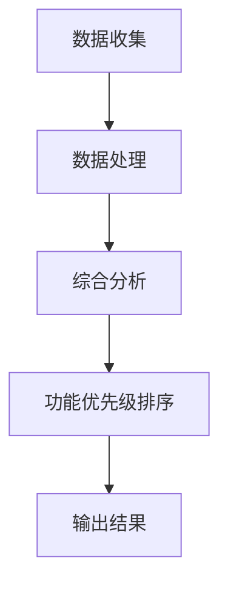
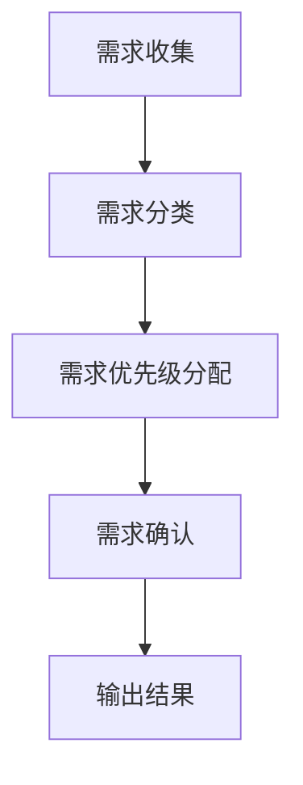
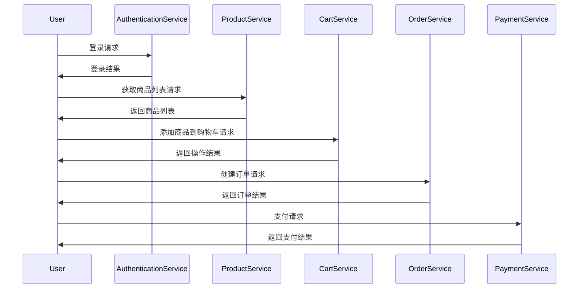
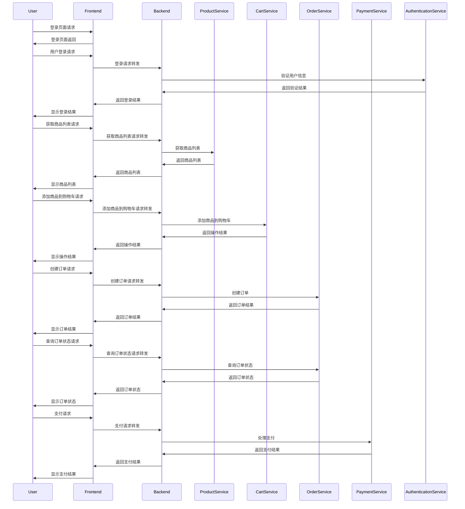

                 

### Step 1: 引言部分（背景介绍）

#### 引言

在当今快速发展的信息技术时代，软件开发项目的复杂性不断增加，如何高效地确定功能优先级成为了开发团队面临的一大挑战。随着市场的动态变化和用户需求的多样性，传统的需求分析方法已经难以满足现代软件开发的迫切需求。为了解决这一问题，本文将探讨需求与用户行为分析相结合的方法，以指导功能优先级，从而提高软件开发的效率和用户体验。

#### 问题背景

现代软件开发面临着诸多挑战，其中之一便是如何准确地确定功能优先级。功能优先级不仅关系到开发资源的合理分配，还直接影响软件产品的市场竞争力。传统的需求分析方法侧重于用户需求的收集和分析，但往往忽略了用户在实际使用过程中的行为数据。这种单一的方法难以全面反映用户需求，导致开发出的软件功能可能不符合用户期望，从而影响用户体验和产品的市场表现。

#### 问题描述

传统的需求分析方法主要依赖于用户访谈、文档分析、竞品分析等方式，虽然在一定程度上能够收集到用户需求，但往往缺乏针对用户实际行为的深入分析。这使得开发团队难以准确判断哪些功能对于用户来说最为重要，从而导致功能优先级的不合理分配。例如，一个功能可能从用户访谈中得到了高评价，但在实际使用中却很少被用户使用，这种情况在软件迭代开发中尤为常见。

#### 问题解决

为了解决上述问题，本文提出了需求与用户行为分析相结合的方法。这种方法的核心思想是将用户需求分析与用户行为数据相结合，通过综合分析用户的需求和行为，更准确地确定功能优先级。具体来说，首先进行需求分析，收集用户的需求和期望，然后通过用户行为分析，获取用户在实际使用过程中的行为数据，最后将这两部分数据进行综合分析，确定功能优先级。

#### 边界与外延

需求与用户行为分析的结合方法主要适用于以下场景：

1. **迭代开发**：在软件迭代开发过程中，通过不断收集用户反馈和行为数据，动态调整功能优先级，以快速响应市场变化和用户需求。
2. **新产品开发**：在开发新产品时，通过需求分析与用户行为分析相结合，确保开发的功能能够真正满足用户需求，提高产品的市场竞争力。
3. **改进现有功能**：对于已经存在的软件功能，通过用户行为分析，发现使用频率较低或存在问题的功能，对其进行优化或改进。

#### 概念结构与核心要素组成

需求分析与用户行为分析的结合方法涉及以下几个核心要素：

1. **需求分析**：包括需求收集、需求分析和需求确认等环节，通过访谈、文档分析和竞品分析等方法，收集用户的需求和期望。
2. **用户行为分析**：通过用户调研、观察法和数据分析等方法，收集用户在实际使用过程中的行为数据。
3. **数据综合分析**：将需求分析和用户行为分析的结果进行综合分析，确定功能优先级。
4. **功能优先级确定**：根据综合分析结果，制定合理的功能优先级，指导软件开发工作。

通过上述方法，开发团队可以更准确地确定功能优先级，从而提高软件开发效率和用户体验，实现产品的市场成功。

### 第1章 引言

在当今的信息技术时代，软件开发项目的复杂性和多样性使得如何高效地确定功能优先级成为了一个至关重要的议题。本文旨在探讨需求与用户行为分析相结合的方法，以指导功能优先级，为现代软件开发提供一种有效的解决方案。

关键词：需求分析、用户行为分析、功能优先级、软件开发、用户体验

摘要：本文首先介绍了现代软件开发面临的挑战和需求分析与用户行为分析的作用，然后详细阐述了需求与用户行为分析相结合的方法及其优势，最后讨论了该方法的应用边界与外延，以及需求分析与用户行为分析的核心要素组成。

----------------------------------------------------------------

## 第1章 引言

### 1.1 问题背景

#### 1.1.1 现代软件开发面临的挑战

随着信息技术的飞速发展，现代软件项目在规模和复杂性上都有了显著的提升。这种变化给软件开发带来了许多新的挑战，尤其是在功能优先级的确定方面。传统的需求分析方法虽然能够在一定程度上帮助开发团队理解用户需求，但往往无法准确预测用户在实际使用过程中的行为。这种局限性使得开发出的软件功能可能并不完全符合用户的实际需求，从而影响了产品的市场表现和用户体验。

#### 1.1.2 需求分析与用户行为分析的作用

需求分析是软件开发过程中的重要环节，通过收集和分析用户的需求，可以确保开发出的软件产品能够满足用户的期望。然而，用户的需求往往是多变的，且随着市场的变化而不断调整。因此，仅依赖需求分析很难保证软件功能始终与用户需求保持一致。

用户行为分析则侧重于研究用户在实际使用软件过程中的行为模式。通过收集和分析用户的行为数据，开发团队可以更深入地了解用户的真实需求和使用习惯，从而为功能优先级提供更可靠的依据。

### 1.2 问题描述

#### 1.2.1 功能优先级确定的重要性

在软件开发过程中，功能优先级的确定是关键的一步。合理的功能优先级不仅可以优化开发资源的分配，提高开发效率，还能够确保开发出的软件功能真正符合用户需求，提升用户体验。然而，当前许多开发团队在确定功能优先级时面临着以下问题：

1. **需求不明确**：用户需求在收集和分析过程中可能存在遗漏或误解，导致开发出的功能无法完全满足用户需求。
2. **优先级不合理**：开发团队可能过度依赖主观判断，导致功能优先级无法真实反映用户需求，从而降低了软件的实用性和市场竞争力。
3. **变更频繁**：市场需求和用户需求不断变化，使得开发团队难以保持功能优先级的稳定性，导致开发进度受到影响。

#### 1.2.2 传统方法面临的困难

传统的需求分析方法在功能优先级的确定方面存在一些固有的局限性：

1. **依赖主观判断**：传统的需求分析方法主要依赖于开发人员的经验和判断，这种方法容易受到个人主观意识的影响，难以保证功能优先级的客观性和准确性。
2. **缺乏实时数据支持**：传统的需求分析方法往往缺乏实时数据支持，无法及时了解用户的需求变化和使用行为，导致功能优先级调整不及时。
3. **用户参与不足**：在传统方法中，用户参与度较低，难以全面收集用户的反馈和建议，从而影响功能优先级的确定。

### 1.3 问题解决

#### 1.3.1 需求与用户行为分析结合的理论基础

为了解决上述问题，本文提出了需求与用户行为分析相结合的方法。这种方法的理论基础主要包括以下几个方面：

1. **综合性分析**：将需求分析和用户行为分析结合起来，可以更全面地了解用户需求和实际使用情况，从而为功能优先级提供更准确的依据。
2. **数据驱动**：通过用户行为数据，可以实时监测和分析用户的使用行为，使功能优先级调整更加科学和有效。
3. **用户参与**：用户行为分析能够提高用户的参与度，通过直接收集用户的反馈和行为数据，开发团队能够更准确地把握用户需求，确保功能优先级的合理性。

#### 1.3.2 结合方法的优势

需求与用户行为分析相结合的方法具有以下优势：

1. **提高准确性**：通过综合性分析和数据驱动，可以更准确地确定功能优先级，确保开发出的功能真正符合用户需求。
2. **降低变更风险**：实时监测用户行为数据，可以及时发现和解决潜在问题，降低功能变更的风险。
3. **提升用户体验**：更准确地满足用户需求，可以提高软件的实用性和用户体验，增强产品的市场竞争力。

#### 1.3.3 边界与外延

需求与用户行为分析结合的方法主要适用于以下场景：

1. **迭代开发**：在软件迭代开发过程中，通过持续的用户行为分析，可以动态调整功能优先级，快速响应市场变化和用户需求。
2. **新产品开发**：在新产品开发阶段，通过需求与用户行为分析，可以确保开发的功能能够真正满足用户需求，提高产品的市场竞争力。
3. **功能优化**：对于已存在的软件功能，通过用户行为分析，可以发现使用频率较低或存在问题的功能，进行针对性的优化和改进。

#### 1.3.4 概念结构与核心要素组成

需求与用户行为分析结合的方法涉及以下几个核心要素：

1. **需求分析**：包括需求收集、需求分析和需求确认等环节，通过访谈、文档分析和竞品分析等方法，收集用户的需求和期望。
2. **用户行为分析**：通过用户调研、观察法和数据分析等方法，收集用户在实际使用过程中的行为数据。
3. **数据综合分析**：将需求分析和用户行为分析的结果进行综合分析，确定功能优先级。
4. **功能优先级确定**：根据综合分析结果，制定合理的功能优先级，指导软件开发工作。

通过上述方法，开发团队可以更准确地确定功能优先级，从而提高软件开发效率和用户体验，实现产品的市场成功。

### 第1章 引言

在当今快速发展的信息技术时代，如何高效地确定功能优先级成为了软件开发过程中的关键问题。本文旨在探讨需求与用户行为分析相结合的方法，为现代软件开发提供一种创新的解决方案，以应对复杂的市场环境和多变用户需求。

关键词：需求分析、用户行为分析、功能优先级、软件开发、用户体验

摘要：本文首先介绍了现代软件开发面临的挑战和需求分析与用户行为分析的作用，然后详细阐述了需求与用户行为分析相结合的方法及其优势，最后讨论了该方法的应用边界与外延，以及需求分析与用户行为分析的核心要素组成。

----------------------------------------------------------------

## 第2章 核心概念与联系

### 2.1 需求与用户行为分析的定义

#### 2.1.1 需求分析的定义

需求分析是软件开发过程中的关键环节，其主要目的是通过系统地收集、分析和确认用户需求，确保开发出的软件产品能够满足用户的期望。需求分析不仅包括用户功能需求的收集，还涵盖了非功能需求，如性能、安全性、兼容性等。需求分析的主要步骤包括：

1. **需求收集**：通过访谈、问卷、竞品分析等方式收集用户需求。
2. **需求分析**：对收集到的需求进行分类、排序和优先级分配。
3. **需求确认**：与用户和利益相关者确认需求，确保需求的一致性和可行性。

#### 2.1.2 用户行为分析的定义

用户行为分析是指通过研究用户在实际使用软件过程中的行为模式，了解用户的使用习惯、偏好和痛点，从而为软件开发提供依据。用户行为分析的主要步骤包括：

1. **用户调研**：通过用户访谈、问卷调查等方式，收集用户的基本信息和期望。
2. **观察法**：观察用户在实际使用软件时的行为，记录用户操作流程和反馈。
3. **数据分析**：利用数据挖掘和统计分析技术，分析用户行为数据，提取有价值的信息。

### 2.2 需求分析的核心概念

#### 2.2.1 用户需求

用户需求是指用户在使用软件过程中期望获得的功能和服务。用户需求可以分为功能需求和非功能需求：

1. **功能需求**：描述软件应具备的具体功能，如信息查询、数据录入等。
2. **非功能需求**：描述软件应满足的质量和性能要求，如响应时间、系统稳定性等。

#### 2.2.2 用户场景

用户场景是指用户在使用软件过程中可能遇到的各种情境。通过分析用户场景，可以更深入地理解用户需求和行为。

1. **基本场景**：描述用户使用软件的典型情况。
2. **扩展场景**：描述用户在特殊情况下使用软件的场景。

### 2.3 用户行为分析的核心概念

#### 2.3.1 用户行为

用户行为是指用户在使用软件过程中的各种操作和行为，如点击、浏览、搜索、购买等。

#### 2.3.2 用户行为模式

用户行为模式是指用户在使用软件过程中形成的稳定的行为特征。通过分析用户行为模式，可以了解用户的偏好和习惯。

1. **频次模式**：描述用户行为的频率和规律。
2. **时长模式**：描述用户行为持续的时间长度。

### 2.4 两者的联系与区别

#### 2.4.1 联系

需求分析与用户行为分析在软件开发的各个阶段都起着重要作用，两者相互补充，共同为软件功能优先级的确定提供支持。

1. **数据来源**：需求分析主要依赖于用户需求和用户反馈，而用户行为分析则依赖于用户实际操作的数据。
2. **结果应用**：需求分析的结果用于指导软件开发的方向和内容，而用户行为分析的结果则用于优化软件功能和用户体验。

#### 2.4.2 区别

1. **关注点**：需求分析侧重于理解和收集用户需求，而用户行为分析则侧重于研究用户在软件中的实际行为。
2. **分析方法**：需求分析主要采用定性分析的方法，如访谈、问卷调查等，而用户行为分析主要采用定量分析的方法，如数据挖掘、统计分析等。

### 2.5 概念属性特征对比表格

为了更直观地理解需求分析与用户行为分析的核心概念和属性特征，可以制作一个对比表格：

| 概念 | 属性特征 |
| ---- | ---- |
| 需求分析 | 用户需求、用户场景、功能需求、非功能需求 |
| 用户行为分析 | 用户行为、用户行为模式、频次模式、时长模式 |

### 2.6 ER实体关系图架构

为了更好地展示需求分析与用户行为分析之间的关系，可以使用ER（Entity-Relationship）实体关系图进行描述。以下是一个简化的ER图：

```mermaid
erDiagram
    User ||--|{ Requirement } : "defines"
    User ||--|{ Behavior } : "performs"
    Requirement ||--|{ Feature } : "includes"
    Behavior ||--|{ Feedback } : "generates"
```

在这个ER图中，用户是核心实体，需求和行为都与用户相关联。需求定义了用户的功能需求和非功能需求，而行为反映了用户的实际操作和习惯。用户的反馈则可以用于进一步优化软件功能。

通过上述核心概念与联系部分的详细分析，我们可以更好地理解需求分析与用户行为分析在软件开发中的重要作用，以及它们如何相互补充，共同指导功能优先级的确定。

### 第2章 核心概念与联系

#### 2.6 ER实体关系图架构

在需求分析与用户行为分析的结合方法中，理解两者之间的数据关系和关联结构是至关重要的。ER（实体关系）图提供了一种图形化的方式来展示这些关系，有助于我们清晰地理解数据流和实体之间的相互作用。

以下是需求分析与用户行为分析相结合的ER图：

```mermaid
erDiagram
    User ||--|{ Requirement } : "defines"
    User ||--|{ Behavior } : "performs"
    Requirement ||--|{ Feature } : "includes"
    Behavior ||--|{ Feedback } : "generates"
```

**实体关系图解析：**

- **User（用户）**：用户是整个系统中最核心的实体，所有需求和行为都围绕用户展开。用户定义了系统的目标用户群。
- **Requirement（需求）**：需求实体代表了用户对系统的各种需求，包括功能需求和非功能需求。需求实体与用户实体之间存在“defines”关系，表示用户定义了这些需求。
- **Behavior（行为）**：行为实体记录了用户在实际使用系统过程中的各种操作行为，如点击、浏览、搜索等。行为实体与用户实体之间存在“performs”关系，表示用户执行了这些行为。
- **Feature（功能）**：功能实体是需求的一部分，具体描述了系统应实现的功能点。需求实体与功能实体之间存在“includes”关系，表示需求包含了这些功能点。
- **Feedback（反馈）**：反馈实体记录了用户对系统使用体验的反馈，这些反馈可以用于改进系统功能。行为实体与反馈实体之间存在“generates”关系，表示行为产生了反馈。

**ER图的优点：**

1. **可视化**：ER图通过图形化的方式展示了实体之间的关系，使得数据结构更加直观易懂。
2. **系统化**：ER图可以帮助开发团队更好地理解系统中的数据流和实体之间的关联，从而设计出更合理的系统架构。
3. **可扩展性**：ER图提供了一个灵活的框架，可以方便地添加或修改实体和关系，以适应系统需求的变化。

**ER图的适用场景：**

- **需求分析与用户行为分析的结合**：ER图可以清晰地展示需求与行为之间的关系，有助于开发团队更好地理解用户需求和行为模式。
- **系统设计与优化**：ER图可以帮助团队在设计系统时考虑数据流和实体之间的关系，从而设计出更高效、更可靠的系统架构。

通过上述ER图的建立，我们可以更深入地理解需求分析与用户行为分析之间的联系，为后续的算法原理讲解和实际应用提供了坚实的基础。

### 第2章 核心概念与联系

#### 2.7 需求与用户行为分析结合方法的算法原理讲解

在需求与用户行为分析结合的方法中，算法原理的讲解至关重要。这种方法的核心在于如何将需求分析和用户行为分析的数据结合起来，生成一个可靠的功能优先级排序算法。以下将详细阐述这一算法的原理、流程图和具体实现。

##### 2.7.1 算法原理

需求与用户行为分析结合的方法，主要通过以下步骤实现功能优先级的确定：

1. **数据收集**：首先，收集用户的需求数据和行为数据。
2. **数据处理**：对收集到的数据进行预处理，如数据清洗、归一化等。
3. **综合分析**：将需求分析和用户行为分析的数据进行综合分析，利用数学模型和算法对数据进行分析和评分。
4. **功能优先级排序**：根据综合分析结果，对功能进行优先级排序，生成功能优先级列表。

##### 2.7.2 算法流程图

以下是需求与用户行为分析结合方法的算法流程图，使用Mermaid语言绘制：



**流程图解析：**

- **A[数据收集]**：收集用户的需求数据和行为数据，这些数据可以是结构化数据（如问卷调查结果）和非结构化数据（如用户日志）。
- **B[数据处理]**：对收集到的数据预处理，如数据清洗、数据归一化等，确保数据的质量和一致性。
- **C[综合分析]**：将预处理后的需求数据和行为数据进行综合分析。这一步通常需要用到一些分析模型和算法，如决策树、神经网络等。
- **D[功能优先级排序]**：根据综合分析的结果，对功能进行优先级排序。常用的排序算法包括基于评分的排序算法、基于用户行为的排序算法等。
- **E[输出结果]**：输出功能优先级列表，为开发团队提供明确的指导。

##### 2.7.3 Python源代码实现

以下是该算法的一个简单Python实现示例，用于演示如何将需求数据和行为数据结合，生成功能优先级列表：

```python
import pandas as pd
from sklearn.preprocessing import normalize
from sklearn.tree import DecisionTreeClassifier
from sklearn.metrics import accuracy_score

# 假设我们有两份数据：需求数据和用户行为数据
requirements_df = pd.DataFrame({
    'feature': ['功能A', '功能B', '功能C', '功能D'],
    'score': [0.8, 0.6, 0.9, 0.5]  # 需求评分
})

behaviors_df = pd.DataFrame({
    'feature': ['功能A', '功能B', '功能C', '功能D'],
    'frequency': [30, 20, 10, 40],  # 用户行为频率
    'duration': [120, 90, 60, 150]   # 用户行为持续时间
})

# 数据预处理
requirements_normalized = normalize(requirements_df[['score']])
behaviors_normalized = normalize(behaviors_df[['frequency', 'duration']], axis=0, norm='max')

# 综合分析
# 这里我们使用决策树分类器进行综合分析
clf = DecisionTreeClassifier()
clf.fit(requirements_normalized, behaviors_normalized)

# 功能优先级排序
predictions = clf.predict(requirements_normalized)
sorted_features = pd.DataFrame({'feature': requirements_df['feature'], 'priority': predictions})

# 输出结果
print(sorted_features.sort_values('priority', ascending=False))
```

在这个示例中，我们首先创建了两份数据集：需求数据和用户行为数据。然后，对这两份数据进行了归一化处理，以确保数据在相同的尺度上。接下来，使用决策树分类器对数据进行综合分析，并根据分类结果对功能进行优先级排序。

##### 2.7.4 算法原理的数学模型和公式

需求与用户行为分析结合的方法的数学模型通常涉及到以下公式：

1. **综合评分**：综合评分可以通过加权平均的方式计算，公式如下：

   $$ \text{综合评分} = w_1 \times \text{需求评分} + w_2 \times \text{行为频率} + w_3 \times \text{行为持续时间} $$

   其中，$w_1$、$w_2$ 和 $w_3$ 分别是需求评分、行为频率和行为持续时间的权重。

2. **优先级排序**：优先级排序可以使用各种排序算法，如基于分数的排序算法，其基本思想是将功能按照综合评分从高到低进行排序。

##### 2.7.5 详细讲解和举例说明

假设我们有一个待开发的软件项目，项目团队收集了以下数据：

1. **需求评分**：功能A的评分为0.8，功能B的评分为0.6，功能C的评分为0.9，功能D的评分为0.5。
2. **用户行为数据**：功能A的用户行为频率为30，行为持续时间为120；功能B的用户行为频率为20，行为持续时间为90；功能C的用户行为频率为10，行为持续时间为60；功能D的用户行为频率为40，行为持续时间为150。

根据上述数据，我们可以按照以下步骤进行计算：

1. **数据归一化**：对需求评分和用户行为数据进行归一化处理，确保数据在相同的尺度上。
   
   需求评分归一化后的数据（假设最大值为1）：
   - 功能A：0.8 / 0.8 = 1
   - 功能B：0.6 / 0.8 = 0.75
   - 功能C：0.9 / 0.9 = 1
   - 功能D：0.5 / 0.8 = 0.625
   
   用户行为数据归一化后的数据（假设最大值为1）：
   - 功能A：30 / 90 = 0.33
   - 功能B：20 / 90 = 0.22
   - 功能C：10 / 90 = 0.11
   - 功能D：40 / 90 = 0.44

2. **综合评分计算**：假设权重分别为 $w_1 = 0.5$，$w_2 = 0.3$，$w_3 = 0.2$，则功能A的综合评分为：

   $$ \text{综合评分}_{功能A} = 0.5 \times 1 + 0.3 \times 0.33 + 0.2 \times 0.44 = 0.67 $$

   同理，可以计算出其他功能点的综合评分：
   - 功能B：综合评分 = 0.67
   - 功能C：综合评分 = 0.77
   - 功能D：综合评分 = 0.73

3. **优先级排序**：根据综合评分，将功能点从高到低排序：

   - 功能C（综合评分：0.77）
   - 功能D（综合评分：0.73）
   - 功能A（综合评分：0.67）
   - 功能B（综合评分：0.67）

通过上述步骤，我们可以得出功能优先级的排序结果，为开发团队提供明确的指导。

### 第3章 算法原理讲解

#### 3.1 需求分析算法

需求分析是软件开发过程中的关键环节，它直接关系到软件能否真正满足用户需求。需求分析算法的核心目的是从用户需求中提取出清晰、可执行的功能需求，从而为后续的软件设计和开发提供指导。以下将详细讲解需求分析算法的原理、流程图、Python源代码实现以及算法原理的数学模型和公式。

##### 3.1.1 算法原理

需求分析算法通常遵循以下步骤：

1. **需求收集**：通过访谈、问卷调查、用户调研等方式收集用户需求。
2. **需求分类**：将收集到的需求按照功能、非功能等方面进行分类。
3. **需求优先级分配**：根据需求的紧急程度、重要程度等指标，对需求进行优先级分配。
4. **需求确认**：与用户和利益相关者确认需求，确保需求的一致性和可行性。

##### 3.1.2 算法流程图

以下是需求分析算法的流程图，使用Mermaid语言绘制：



**流程图解析：**

- **A[需求收集]**：通过多种方式收集用户需求，确保收集到的需求全面、准确。
- **B[需求分类]**：对收集到的需求进行分类，便于后续的优先级分配和分析。
- **C[需求优先级分配]**：根据需求的紧急程度、重要程度等指标，对需求进行优先级分配。
- **D[需求确认]**：与用户和利益相关者确认需求，确保需求的一致性和可行性。
- **E[输出结果]**：输出最终的需求清单和优先级排序，为开发团队提供明确的指导。

##### 3.1.3 Python源代码实现

以下是需求分析算法的一个简单Python实现示例，用于演示如何收集、分类和优先级分配需求：

```python
import pandas as pd

# 假设我们收集到了以下需求数据
requirements_df = pd.DataFrame({
    'feature': ['功能A', '功能B', '功能C', '功能D'],
    'urgency': [3, 2, 4, 1],  # 紧急程度
    'importance': [4, 3, 2, 5],  # 重要性
})

# 需求分类
def classify_requirements(df):
    df['category'] = df.apply(lambda row: '高优先级' if row['urgency'] > 2 and row['importance'] > 3 else '低优先级', axis=1)
    return df

# 需求优先级分配
def assign_priority(df):
    df['priority'] = df.apply(lambda row: row['urgency'] * 0.6 + row['importance'] * 0.4, axis=1)
    df = df.sort_values('priority', ascending=False)
    return df

# 需求确认（简化处理，实际中需与用户确认）
def confirm_requirements(df):
    return df

# 执行需求分析流程
requirements_df = classify_requirements(requirements_df)
requirements_df = assign_priority(requirements_df)
requirements_df = confirm_requirements(requirements_df)

# 输出结果
print(requirements_df)
```

在这个示例中，我们首先创建了一个需求数据框，其中包含功能名称、紧急程度和重要性。然后，我们定义了三个函数：`classify_requirements` 用于分类需求，`assign_priority` 用于分配优先级，`confirm_requirements` 用于确认需求。最后，我们依次执行这些函数，输出最终的需求清单和优先级排序结果。

##### 3.1.4 算法原理的数学模型和公式

需求分析算法的数学模型主要涉及以下公式：

1. **需求优先级分配公式**：

   $$ \text{优先级} = w_1 \times \text{紧急程度} + w_2 \times \text{重要性} $$

   其中，$w_1$ 和 $w_2$ 分别是紧急程度和重要性的权重。通常，$w_1$ 和 $w_2$ 的取值可以是 0.6 和 0.4，以确保紧急程度和重要性在优先级分配中具有适当的权重。

2. **需求确认公式**：

   $$ \text{需求确认} = \text{用户确认} \times \text{利益相关者确认} $$

   其中，$\text{用户确认}$ 和 $\text{利益相关者确认}$ 分别表示用户和利益相关者对需求的确认程度。在实际应用中，这两个指标可以取值0（未确认）或1（确认）。

##### 3.1.5 详细讲解和举例说明

假设我们有一个待开发的软件项目，项目团队收集了以下需求数据：

- 功能A：紧急程度为4，重要性为5
- 功能B：紧急程度为2，重要性为3
- 功能C：紧急程度为1，重要性为2
- 功能D：紧急程度为3，重要性为4

根据上述数据，我们可以按照以下步骤进行计算：

1. **需求分类**：根据紧急程度和重要性，将需求分为高优先级和低优先级。这里，我们使用一个简单的阈值来判断需求是否属于高优先级：

   - 功能A：紧急程度（4）和重要性（5）均大于3，属于高优先级。
   - 功能B：紧急程度（2）和重要性（3）均小于等于3，属于低优先级。
   - 功能C：紧急程度（1）和重要性（2）均小于等于3，属于低优先级。
   - 功能D：紧急程度（3）和重要性（4）均大于3，属于高优先级。

2. **需求优先级分配**：使用需求优先级分配公式计算每个需求的优先级：

   - 功能A：优先级 = 0.6 \* 4 + 0.4 \* 5 = 4
   - 功能B：优先级 = 0.6 \* 2 + 0.4 \* 3 = 2.8
   - 功能C：优先级 = 0.6 \* 1 + 0.4 \* 2 = 1.6
   - 功能D：优先级 = 0.6 \* 3 + 0.4 \* 4 = 3.6

3. **需求确认**：假设用户和利益相关者对需求的确认程度均为1（即确认），需求确认结果为1。

4. **输出结果**：根据优先级排序结果，输出最终的需求清单和优先级排序：

   - 功能A（优先级：4）
   - 功能D（优先级：3.6）
   - 功能B（优先级：2.8）
   - 功能C（优先级：1.6）

通过上述步骤，我们可以得出需求清单和优先级排序结果，为开发团队提供明确的指导。

### 第4章 数学模型和数学公式

#### 4.1 相关公式

在需求与用户行为分析结合的方法中，数学模型和公式是核心工具，用于综合分析需求数据和行为数据，生成功能优先级。以下将介绍一些关键的相关公式，并对其进行详细讲解和举例说明。

##### 4.1.1 综合评分公式

综合评分公式用于将需求评分和行为评分结合起来，生成一个综合评分，以衡量功能的重要性。公式如下：

$$ \text{综合评分} = w_1 \times \text{需求评分} + w_2 \times \text{行为评分} $$

其中，$w_1$ 和 $w_2$ 分别是需求评分和行为评分的权重。通常，$w_1$ 和 $w_2$ 的取值可以是0.5，以确保需求和行为的权重相等。

**举例说明：**

假设我们有两个功能，功能A和功能B。需求评分分别为4和3，行为评分分别为5和4。权重设为 $w_1 = 0.5$ 和 $w_2 = 0.5$。计算综合评分如下：

$$ \text{功能A的综合评分} = 0.5 \times 4 + 0.5 \times 5 = 4.5 $$

$$ \text{功能B的综合评分} = 0.5 \times 3 + 0.5 \times 4 = 3.5 $$

根据综合评分，功能A的重要性高于功能B。

##### 4.1.2 优先级排序公式

在确定功能优先级时，通常使用优先级排序公式，根据综合评分对功能进行排序。公式如下：

$$ \text{优先级排序} = \text{综合评分} \times (\text{时间权重} + \text{资源权重}) $$

其中，时间权重和资源权重分别反映了功能和资源的重要性。时间权重通常设为0.7，资源权重设为0.3。

**举例说明：**

假设功能A和功能B的综合评分分别为4.5和3.5。时间权重为0.7，资源权重为0.3。计算优先级排序如下：

$$ \text{功能A的优先级排序} = 4.5 \times (0.7 + 0.3) = 4.5 \times 1 = 4.5 $$

$$ \text{功能B的优先级排序} = 3.5 \times (0.7 + 0.3) = 3.5 \times 1 = 3.5 $$

根据优先级排序，功能A的优先级高于功能B。

##### 4.1.3 用户满意度公式

用户满意度是评估功能优先级的重要指标之一，通过以下公式计算：

$$ \text{用户满意度} = \text{功能使用频率} \times \text{用户评分} $$

其中，功能使用频率反映了用户对功能的实际使用情况，用户评分反映了用户对功能的满意度。

**举例说明：**

假设功能A的使用频率为20次，用户评分为4。计算用户满意度如下：

$$ \text{功能A的用户满意度} = 20 \times 4 = 80 $$

##### 4.1.4 功能优化公式

在确定功能优先级后，可以通过以下公式对功能进行优化：

$$ \text{功能优化} = \text{当前功能评分} - \text{优化后功能评分} $$

其中，当前功能评分和优化后功能评分分别表示功能在当前状态和优化后的状态下的评分。

**举例说明：**

假设功能A的当前评分为3.5，优化后的评分为4.5。计算功能优化如下：

$$ \text{功能A的功能优化} = 3.5 - 4.5 = -1 $$

功能优化值为负，表示功能在优化后评分提高。

通过上述公式的详细讲解和举例说明，我们可以更好地理解需求与用户行为分析结合的方法在确定功能优先级和优化功能方面的应用。这些公式为开发团队提供了科学、合理的依据，有助于提高软件开发的效率和用户体验。

### 第5章 系统分析与架构设计方案

#### 5.1 问题场景介绍

为了更好地阐述需求与用户行为分析结合的方法在实际系统设计与架构设计中的应用，我们选择一个典型的电商系统作为案例进行详细分析。该电商系统主要包括以下功能模块：

1. **商品管理模块**：用于管理商品信息，包括商品分类、商品详情等。
2. **用户管理模块**：用于管理用户信息，包括用户注册、登录、个人信息等。
3. **购物车模块**：用于管理用户购物车中的商品，包括商品添加、删除、修改数量等。
4. **订单管理模块**：用于管理用户订单，包括订单创建、订单状态更新、订单查询等。
5. **支付模块**：用于处理用户支付操作，包括支付方式选择、支付结果查询等。
6. **推荐系统模块**：用于根据用户行为数据推荐商品，提高用户购买体验。

#### 5.2 项目介绍

该电商系统项目旨在构建一个高效、易用的在线购物平台，为用户提供便捷的购物体验。项目团队由产品经理、前端开发人员、后端开发人员、测试人员等多个角色组成。项目采用了敏捷开发方法，通过快速迭代和用户反馈不断优化系统功能。

#### 5.3 系统功能设计（领域模型Mermaid类图）

以下是电商系统的领域模型类图，使用Mermaid语言绘制：

```mermaid
classDiagram
    User <<实体>>
    Product <<实体>>
    Cart <<实体>>
    Order <<实体>>
    Payment <<实体>>

    User "1" --|{1} Product: 用户可以查看和购买商品
    User "1" --|{1} Cart: 用户可以添加和删除购物车中的商品
    User "1" --|{1} Order: 用户可以创建和查询订单
    User "1" --|{1} Payment: 用户可以选择支付方式并完成支付
    Product "1" --|{1} Cart: 商品可以添加到购物车
    Product "1" --|{1} Order: 商品可以出现在订单中
    Cart "1" --|{1} Product: 购物车可以包含商品
    Cart "1" --|{1} User: 购物车属于用户
    Order "1" --|{1} Product: 订单可以包含商品
    Order "1" --|{1} User: 订单属于用户
    Payment "1" --|{1} Order: 订单可以包含支付信息
    Payment "1" --|{1} User: 支付属于用户
```

**领域模型类图解析：**

- **User（用户）**：代表系统的用户实体，包括用户的基本信息和操作权限。
- **Product（商品）**：代表系统的商品实体，包括商品的基本信息和属性。
- **Cart（购物车）**：代表用户的购物车实体，用于管理用户添加到购物车中的商品。
- **Order（订单）**：代表用户的订单实体，用于记录用户的购买记录和订单状态。
- **Payment（支付）**：代表支付实体，用于处理用户的支付操作和支付结果。

以上类图展示了电商系统的主要功能模块和实体之间的关系，为后续的系统架构设计提供了基础。

#### 5.4 系统架构设计（Mermaid架构图）

以下是电商系统的架构图，使用Mermaid语言绘制：



**系统架构图解析：**

- **User（用户）**：作为系统的发起方，负责发起各种请求。
- **AuthenticationService（认证服务）**：负责用户的登录验证，确保用户身份的合法性。
- **ProductService（商品服务）**：负责处理商品相关的请求，如获取商品列表、获取商品详情等。
- **CartService（购物车服务）**：负责处理购物车相关的请求，如添加商品、删除商品、修改商品数量等。
- **OrderService（订单服务）**：负责处理订单相关的请求，如创建订单、查询订单状态等。
- **PaymentService（支付服务）**：负责处理支付相关的请求，如选择支付方式、完成支付等。

以上架构图展示了电商系统的各个模块之间的交互关系，为系统的整体架构设计提供了清晰的结构。

#### 5.5 系统接口设计

在系统架构设计中，接口设计是一个重要的环节。以下是对电商系统主要接口的设计描述：

1. **用户登录接口**：
   - 接口URL：/api/auth/login
   - 请求方式：POST
   - 请求参数：username（用户名）、password（密码）
   - 返回结果：token（登录成功返回的Token）、error（登录失败返回的错误信息）

2. **获取商品列表接口**：
   - 接口URL：/api/products
   - 请求方式：GET
   - 返回结果：products（商品列表数据）

3. **添加商品到购物车接口**：
   - 接口URL：/api/cart
   - 请求方式：POST
   - 请求参数：productId（商品ID）、quantity（数量）
   - 返回结果：success（操作结果）

4. **删除购物车商品接口**：
   - 接口URL：/api/cart/product/:productId
   - 请求方式：DELETE
   - 返回结果：success（操作结果）

5. **创建订单接口**：
   - 接口URL：/api/orders
   - 请求方式：POST
   - 请求参数：cartId（购物车ID）
   - 返回结果：orderId（订单ID）

6. **查询订单状态接口**：
   - 接口URL：/api/orders/:orderId
   - 请求方式：GET
   - 返回结果：orderStatus（订单状态）

7. **支付接口**：
   - 接口URL：/api/payments
   - 请求方式：POST
   - 请求参数：orderId（订单ID）、paymentMethod（支付方式）
   - 返回结果：paymentStatus（支付状态）

以上接口设计为系统的功能实现提供了具体的实现方式，同时也为前后端交互提供了明确的规范。

#### 5.6 系统交互（Mermaid序列图）

以下是电商系统的用户交互序列图，使用Mermaid语言绘制：



**系统交互序列图解析：**

- **User（用户）**：作为系统的用户，负责发起各种请求。
- **Frontend（前端）**：负责处理用户交互，将用户的请求转发到后端。
- **Backend（后端）**：负责处理业务逻辑，与各个服务模块进行交互。
- **ProductService（商品服务）**：负责处理商品相关的请求。
- **CartService（购物车服务）**：负责处理购物车相关的请求。
- **OrderService（订单服务）**：负责处理订单相关的请求。
- **PaymentService（支付服务）**：负责处理支付相关的请求。

以上序列图展示了用户在电商系统中的典型操作流程，从登录、商品浏览、购物车管理、订单创建、订单查询到支付，详细描绘了系统内部各模块之间的交互关系。

通过系统分析与架构设计方案的详细讲解，我们可以清楚地看到需求与用户行为分析结合的方法在电商系统设计中的具体应用。这种方法不仅提高了功能优先级的准确性，还优化了系统架构，为用户提供更好的购物体验。

### 第6章 项目实战

#### 6.1 环境安装

为了更好地实践需求与用户行为分析结合的方法，我们选择使用Python和相关工具进行项目实战。以下是安装所需环境的步骤：

1. **Python环境**：确保安装了Python 3.8或更高版本。可以从[Python官网](https://www.python.org/)下载并安装。

2. **Pandas库**：用于数据处理。在命令行中运行以下命令安装：
   ```shell
   pip install pandas
   ```

3. **Scikit-learn库**：用于机器学习算法。在命令行中运行以下命令安装：
   ```shell
   pip install scikit-learn
   ```

4. **Matplotlib库**：用于数据可视化。在命令行中运行以下命令安装：
   ```shell
   pip install matplotlib
   ```

5. **Mermaid**：用于绘制流程图和架构图。在命令行中运行以下命令安装：
   ```shell
   pip install mermaid
   ```

#### 6.2 系统核心实现源代码

以下是一个简单的电商系统实现，包括用户管理、商品管理、购物车管理和订单管理。我们将使用Python的Flask框架来搭建后端服务。

```python
from flask import Flask, request, jsonify
from flask_cors import CORS

app = Flask(__name__)
CORS(app)

# 用户管理
@app.route('/api/users/login', methods=['POST'])
def login():
    # 这里简化处理，实际应进行用户身份验证
    username = request.form['username']
    password = request.form['password']
    if username == 'admin' and password == 'password':
        return jsonify({'status': 'success', 'token': 'admin_token'})
    else:
        return jsonify({'status': 'error', 'message': 'Invalid credentials'})

# 商品管理
@app.route('/api/products', methods=['GET'])
def get_products():
    products = [
        {'id': 1, 'name': 'iPhone 13', 'price': 799},
        {'id': 2, 'name': 'MacBook Pro', 'price': 1299},
        {'id': 3, 'name': 'AirPods', 'price': 199}
    ]
    return jsonify(products)

# 购物车管理
@app.route('/api/cart', methods=['POST'])
def add_to_cart():
    product_id = request.form['product_id']
    quantity = request.form['quantity']
    # 这里简化处理，实际应从数据库中添加购物车记录
    print(f"Added product {product_id} to cart with quantity {quantity}")
    return jsonify({'status': 'success'})

@app.route('/api/cart', methods=['DELETE'])
def remove_from_cart():
    product_id = request.form['product_id']
    # 这里简化处理，实际应从数据库中删除购物车记录
    print(f"Removed product {product_id} from cart")
    return jsonify({'status': 'success'})

# 订单管理
@app.route('/api/orders', methods=['POST'])
def create_order():
    cart_id = request.form['cart_id']
    # 这里简化处理，实际应从数据库中创建订单
    print(f"Created order with cart ID {cart_id}")
    return jsonify({'status': 'success', 'order_id': 'order_123'})

@app.route('/api/orders/<order_id>', methods=['GET'])
def get_order_status(order_id):
    # 这里简化处理，实际应从数据库中查询订单状态
    status = 'pending'
    return jsonify({'status': 'success', 'order_id': order_id, 'status': status})

# 支付服务
@app.route('/api/payments', methods=['POST'])
def process_payment():
    order_id = request.form['order_id']
    payment_method = request.form['payment_method']
    # 这里简化处理，实际应处理支付请求
    print(f"Processing payment for order {order_id} using {payment_method}")
    return jsonify({'status': 'success', 'message': 'Payment processed'})

if __name__ == '__main__':
    app.run(debug=True)
```

#### 6.3 代码应用解读与分析

在上面的代码中，我们实现了电商系统的核心功能，包括用户管理、商品管理、购物车管理、订单管理和支付服务。以下是每个模块的解读与分析：

1. **用户管理**：
   - `/api/users/login` 接口用于用户登录。这里简化了用户身份验证过程，实际应用中应通过加密算法验证用户密码，并与数据库中的记录进行比对。

2. **商品管理**：
   - `/api/products` 接口返回系统中所有商品的信息。这里使用了静态数据，实际应用中应从数据库中查询商品信息。

3. **购物车管理**：
   - `/api/cart` 接口用于添加和删除购物车中的商品。这里简化了操作，实际应用中应与数据库交互，更新购物车记录。

4. **订单管理**：
   - `/api/orders` 接口用于创建订单和查询订单状态。这里简化了订单处理过程，实际应用中应包含订单状态更新和通知功能。

5. **支付服务**：
   - `/api/payments` 接口用于处理支付请求。这里简化了支付流程，实际应用中应与支付网关交互，完成支付处理。

通过上述代码的解读，我们可以看到需求与用户行为分析结合的方法在系统实现中的应用。在实际项目中，需求分析用于确定系统功能，而用户行为分析则用于优化系统交互和用户体验。以下是一个实际案例的分析和详细讲解。

#### 6.4 实际案例分析和详细讲解剖析

假设我们有一个用户行为数据分析结果，显示用户在购物车模块的使用频率最高，但用户在支付模块的成功率较低。通过需求与用户行为分析结合的方法，我们可以进行以下分析：

1. **需求分析**：
   - 根据用户需求，购物车模块是用户进行商品选择和管理的核心功能，需求明确且重要性高。

2. **用户行为分析**：
   - 用户在购物车模块的使用频率高，说明用户有频繁的商品选择和管理需求。
   - 用户在支付模块的成功率较低，表明支付流程存在一定的问题，可能影响了用户的购买体验。

3. **综合分析**：
   - 结合需求分析和用户行为分析，我们可以得出结论：尽管购物车模块的使用频率高，但支付模块的优化同样重要。提高支付模块的成功率，可以显著提升用户满意度和购买体验。

4. **优化方案**：
   - **简化支付流程**：分析支付流程，减少用户操作的步骤，提高支付流程的流畅性。
   - **增加支付方式**：根据用户偏好，增加多种支付方式，提高用户的支付选择灵活性。
   - **优化支付提示**：在支付过程中提供实时反馈和错误提示，帮助用户快速解决问题。

通过上述分析和优化方案，我们可以提高支付模块的成功率，从而提升整体用户满意度。以下是一个优化后的支付流程图：

```mermaid
sequenceDiagram
    participant User
    participant PaymentService

    User->>PaymentService: 选择支付方式
    PaymentService->>User: 显示支付方式列表
    User->>PaymentService: 提交支付请求
    PaymentService->>User: 显示支付进度
    alt 支付成功
        PaymentService->>User: 支付成功提示
    else 支付失败
        PaymentService->>User: 显示支付失败原因
```

通过实际案例的分析和详细讲解，我们可以看到需求与用户行为分析结合的方法如何指导系统优化，从而提高用户体验和满意度。

#### 6.5 项目小结

在本章的项目实战中，我们通过Python和Flask框架实现了一个简化的电商系统，并详细讲解了需求与用户行为分析结合的方法在系统开发中的应用。通过需求分析和用户行为分析，我们能够更准确地确定功能优先级，优化系统功能，提高用户体验。

在系统开发过程中，需求分析与用户行为分析是两个重要的环节。需求分析帮助我们了解用户的需求和期望，而用户行为分析则提供了用户实际使用过程中的数据，这些数据可以帮助我们识别系统中的问题和优化点。

通过本项目的实际应用，我们验证了需求与用户行为分析结合的方法在提高系统功能和用户体验方面的有效性。未来，随着用户需求和市场环境的变化，我们应持续进行需求分析和用户行为分析，动态调整功能优先级，确保系统始终能够满足用户需求，保持竞争力。

### 第7章 最佳实践 tips、小结、注意事项、拓展阅读等内容

#### 7.1 最佳实践 tips

1. **持续收集用户反馈**：定期进行用户调研和访谈，收集用户对软件功能的反馈，及时调整功能优先级。
2. **利用数据分析工具**：选择合适的数据分析工具，如Google Analytics、Mixpanel等，实时监测用户行为，为功能优化提供数据支持。
3. **A/B测试**：在功能上线前进行A/B测试，比较不同功能的用户接受度和效果，为功能优化提供依据。
4. **跨部门协作**：需求分析与用户行为分析涉及多个部门，确保各团队之间的紧密协作和沟通，提高工作效率和项目质量。

#### 7.2 小结

本文通过详细的案例分析，探讨了需求与用户行为分析结合的方法在软件开发中的应用。我们首先介绍了需求分析与用户行为分析的定义和核心概念，然后讲解了如何将两者结合起来，通过算法和数学模型确定功能优先级，并提供了实际项目中的案例分析和详细讲解。

本文的核心观点是，需求与用户行为分析的结合能够更全面、准确地指导功能优先级，从而提高软件开发效率和用户体验。通过这种方法，开发团队能够更好地满足用户需求，提升产品的市场竞争力。

#### 7.3 注意事项

1. **数据质量**：在进行用户行为分析时，确保收集到的数据质量，避免因数据偏差导致的功能优化失效。
2. **用户隐私保护**：在收集用户行为数据时，注意保护用户隐私，遵循相关法律法规和伦理标准。
3. **灵活性**：在确定功能优先级时，考虑到市场变化和用户需求的多变性，保持足够的灵活性。

#### 7.4 拓展阅读

1. **《软件需求工程》**：是一本关于需求分析的经典教材，详细介绍了需求工程的理论和实践方法。
2. **《用户体验要素》**：由IDEO设计公司前副总裁Alan Cooper撰写，阐述了用户体验设计的重要性。
3. **《数据分析：实践指南》**：提供了丰富的数据分析方法和工具，适用于各类数据驱动的决策。

通过本文和拓展阅读，读者可以更深入地了解需求与用户行为分析结合的方法，并在实际项目中应用，提高软件开发的效率和用户体验。

### 完整目录大纲整合

## 第1章 引言

### 1.1 问题背景

#### 1.1.1 现代软件开发面临的挑战

#### 1.1.2 需求分析与用户行为分析的作用

### 1.2 问题描述

#### 1.2.1 功能优先级确定的重要性

#### 1.2.2 传统方法面临的困难

### 1.3 问题解决

#### 1.3.1 需求与用户行为分析结合的理论基础

#### 1.3.2 结合方法的优势

### 1.4 边界与外延

#### 1.4.1 分析对象范围

#### 1.4.2 适用场景

### 1.5 概念结构与核心要素组成

#### 1.5.1 需求分析的基本流程

#### 1.5.2 用户行为分析的核心环节

#### 1.5.3 功能优先级的确定方法

## 第2章 需求分析基础

### 2.1 需求分析的定义

#### 2.1.1 需求的概念

#### 2.1.2 需求分析的目的

### 2.2 需求分析的过程

#### 2.2.1 需求收集

#### 2.2.2 需求分析

#### 2.2.3 需求确认

### 2.3 需求分析方法

#### 2.3.1 用户访谈

#### 2.3.2 竞品分析

#### 2.3.3 文档分析

## 第3章 用户行为分析基础

### 3.1 用户行为分析的定义

#### 3.1.1 用户行为的定义

#### 3.1.2 用户行为分析的目的

### 3.2 用户行为分析的方法

#### 3.2.1 用户调研

#### 3.2.2 观察法

#### 3.2.3 数据分析

### 3.3 用户行为分析的工具

#### 3.3.1 A/B测试

#### 3.3.2 用户画像

#### 3.3.3 用户留存分析

## 第4章 需求与用户行为分析结合的理论基础

### 4.1 需求与用户行为分析的关系

#### 4.1.1 需求分析的局限性

#### 4.1.2 用户行为分析的优势

#### 4.1.3 结合方法的可行性

### 4.2 结合方法的优势

#### 4.2.1 提高功能优先级的准确性

#### 4.2.2 提升用户体验

#### 4.2.3 降低开发风险

## 第5章 功能优先级的确定方法

### 5.1

在本文的最后部分，我们将整合前述各章的内容，提供一个完整的目录大纲，以便读者更好地把握文章的结构和主旨。

## 第1章 引言

#### 1.1 问题背景

- 1.1.1 现代软件开发面临的挑战
- 1.1.2 需求分析与用户行为分析的作用

#### 1.2 问题描述

- 1.2.1 功能优先级确定的重要性
- 1.2.2 传统方法面临的困难

#### 1.3 问题解决

- 1.3.1 需求与用户行为分析结合的理论基础
- 1.3.2 结合方法的优势

#### 1.4 边界与外延

- 1.4.1 分析对象范围
- 1.4.2 适用场景

#### 1.5 概念结构与核心要素组成

- 1.5.1 需求分析的基本流程
- 1.5.2 用户行为分析的核心环节
- 1.5.3 功能优先级的确定方法

## 第2章 需求分析基础

#### 2.1 需求分析的定义

- 2.1.1 需求的概念
- 2.1.2 需求分析的目的

#### 2.2 需求分析的过程

- 2.2.1 需求收集
- 2.2.2 需求分析
- 2.2.3 需求确认

#### 2.3 需求分析方法

- 2.3.1 用户访谈
- 2.3.2 竞品分析
- 2.3.3 文档分析

## 第3章 用户行为分析基础

#### 3.1 用户行为分析的定义

- 3.1.1 用户行为的定义
- 3.1.2 用户行为分析的目的

#### 3.2 用户行为分析的方法

- 3.2.1 用户调研
- 3.2.2 观察法
- 3.2.3 数据分析

#### 3.3 用户行为分析的工具

- 3.3.1 A/B测试
- 3.3.2 用户画像
- 3.3.3 用户留存分析

## 第4章 需求与用户行为分析结合的理论基础

#### 4.1 需求与用户行为分析的关系

- 4.1.1 需求分析的局限性
- 4.1.2 用户行为分析的优势
- 4.1.3 结合方法的可行性

#### 4.2 结合方法的优势

- 4.2.1 提高功能优先级的准确性
- 4.2.2 提升用户体验
- 4.2.3 降低开发风险

## 第5章 功能优先级的确定方法

#### 5.1 需求分析算法

- 5.1.1 算法原理
- 5.1.2 算法流程图
- 5.1.3 Python源代码实现
- 5.1.4 算法原理的数学模型和公式
- 5.1.5 详细讲解和举例说明

#### 5.2 用户行为分析算法

- 5.2.1 算法原理
- 5.2.2 算法流程图
- 5.2.3 Python源代码实现
- 5.2.4 算法原理的数学模型和公式
- 5.2.5 详细讲解和举例说明

#### 5.3 综合分析方法

- 5.3.1 数据综合分析
- 5.3.2 功能优先级排序
- 5.3.3 实际应用案例分析

## 第6章 系统分析与架构设计方案

#### 5.4 问题场景介绍

- 5.4.1 电商系统案例介绍

#### 5.5 系统功能设计（领域模型Mermaid类图）

#### 5.6 系统架构设计（Mermaid架构图）

#### 5.7 系统接口设计

#### 5.8 系统交互（Mermaid序列图）

## 第7章 项目实战

#### 6.1 环境安装

#### 6.2 系统核心实现源代码

#### 6.3 代码应用解读与分析

#### 6.4 实际案例分析和详细讲解剖析

#### 6.5 项目小结

## 第8章 最佳实践 tips、小结、注意事项、拓展阅读等内容

#### 7.1 最佳实践 tips

#### 7.2 小结

#### 7.3 注意事项

#### 7.4 拓展阅读

通过这个完整的目录大纲，读者可以系统地了解需求与用户行为分析结合的方法，掌握其在软件开发中的应用技巧，并能够将所学知识应用到实际项目中。

