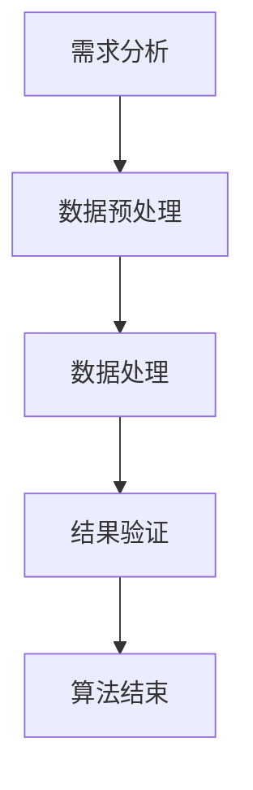
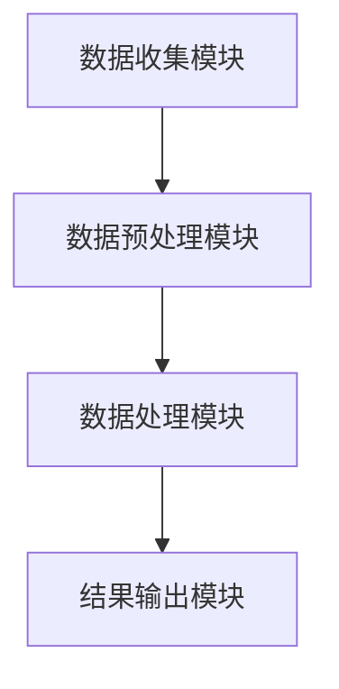
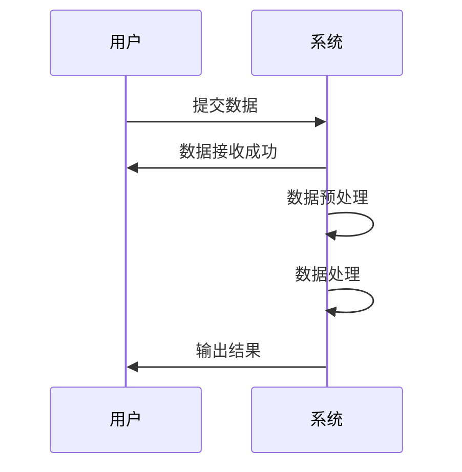

                 

### 文章标题

# 需求与用户隐私保护的平衡：合规性考量

> 关键词：需求分析、用户隐私保护、合规性、数据安全、技术实现

> 摘要：本文将深入探讨在数字化时代中，如何平衡用户需求与隐私保护的重要性。通过对相关法律法规的解读，分析需求与隐私保护的内在联系，结合算法原理与系统架构设计，提供一套完整的技术解决方案。文章还通过实际项目案例，总结最佳实践，并提出未来的研究方向，以期为IT从业者在合规性考量下进行需求与隐私保护的平衡提供有价值的参考。

----------------------------------------------------------------

### 引言与背景

#### 1.1 问题的背景

在数字化时代，数据已成为新的“石油”，企业通过收集和分析用户数据来提供个性化的服务、优化产品设计和提升运营效率。然而，用户数据的安全性和隐私保护问题日益突出。随着全球范围内数据隐私法规的日益严格，如欧盟的《通用数据保护条例》（GDPR）和美国加州的《消费者隐私法案》（CCPA），企业面临的合规性压力不断增大。

#### 1.2 需求的重要性

用户需求是企业发展的基石。满足用户需求能够提升用户体验、增强用户黏性，从而为企业带来持续的商业价值。然而，在追求用户需求的过程中，如何确保用户隐私不被泄露或滥用，成为企业不得不面对的挑战。

#### 1.3 平衡需求与隐私的挑战

在平衡用户需求与隐私保护的过程中，企业面临以下挑战：

1. **隐私保护的复杂性**：用户数据的多样性和复杂性使得隐私保护变得更加困难。
2. **技术实现的局限性**：现有的技术和工具在隐私保护方面存在局限性，难以完全满足法规的要求。
3. **合规性风险**：未遵守相关法规可能会导致高额罚款、声誉受损，甚至影响企业的生存。

#### 1.4 相关法规和政策

**国际法规**

- **GDPR**：欧盟的GDPR是当前最严格的数据隐私保护法规之一，要求企业对用户数据的收集、处理和使用进行严格管理。
- **CCPA**：加州的CCPA旨在保护加州居民的隐私权，对数据处理行为有明确的规定。

**国内法规**

- **个人信息保护法**：中国的个人信息保护法于2021年生效，规定了个人信息处理的基本原则和规则。
- **网络安全法**：网络安全法强调网络运营者的数据安全保护责任，对数据的收集、存储、处理和使用提出了要求。

#### 1.5 法规对需求和隐私保护的影响

法规对用户需求和隐私保护的影响主要体现在以下几个方面：

1. **数据收集限制**：法规限制了企业对用户数据的收集范围，要求企业明确数据收集的目的。
2. **用户知情权和选择权**：法规赋予了用户知情权和选择权，要求企业在数据处理前获得用户的明确同意。
3. **数据安全要求**：法规对数据安全提出了严格的要求，要求企业采取有效的措施保护用户数据。

### 核心概念与联系

#### 2.1 需求分析

##### 2.1.1 需求的定义

需求是指用户或企业希望得到的产品、服务或解决方案。在IT领域，需求分析是项目开发的第一步，是理解用户需求并将其转化为具体技术实现的关键。

##### 2.1.2 需求分类

需求可以分为以下几类：

- **功能需求**：描述系统应提供的功能。
- **非功能需求**：描述系统的性能、可靠性、安全性等特性。

##### 2.1.3 需求的属性

需求的属性包括：

- **明确性**：需求应明确、无歧义。
- **完整性**：需求应包含系统所需的所有功能和非功能要求。
- **一致性**：需求之间应保持一致，不应存在冲突。
- **可验证性**：需求应能够通过测试或验证来证明其实现。

#### 2.2 隐私保护

##### 2.2.1 隐私的定义

隐私是指个人或组织在信息交换过程中不愿公开的个人信息。在数字化时代，隐私保护尤为重要。

##### 2.2.2 隐私的属性

隐私的属性包括：

- **敏感性**：隐私信息的敏感性决定了其保护的严格程度。
- **个人性**：隐私与个体的个人信息密切相关。
- **动态性**：隐私保护需要根据技术和社会环境的变化不断调整。

##### 2.2.3 隐私保护的策略

隐私保护的策略包括：

- **数据匿名化**：通过去标识化等技术，使个人数据无法直接关联到特定个体。
- **数据加密**：使用加密算法对数据进行加密，确保数据在传输和存储过程中的安全性。
- **权限管理**：通过权限控制，确保只有授权人员能够访问和处理敏感数据。

#### 2.3 需求与隐私的联系

##### 2.3.1 需求对隐私的影响

需求可能会对隐私产生影响，例如：

- **数据收集**：满足某些功能需求可能需要收集用户的敏感信息。
- **数据处理**：数据处理过程中，可能会产生隐私泄露的风险。

##### 2.3.2 隐私对需求的影响

隐私保护可能会对需求产生影响，例如：

- **限制功能**：为了保护隐私，可能需要限制某些功能或服务的实现。
- **增加成本**：隐私保护措施可能会增加企业的运营成本。

##### 2.3.3 平衡需求与隐私的要点

在平衡需求与隐私的过程中，企业需要关注以下几点：

- **需求合理性**：确保需求是合理且必要的。
- **隐私最小化**：只收集和处理实现需求所必需的个人信息。
- **合规性**：确保所有数据处理行为符合相关法规的要求。
- **技术实现**：采用有效的技术手段保护用户隐私。

### 算法原理讲解

#### 3.1 算法概述

##### 3.1.1 算法的目标

算法的目标是实现在满足用户需求的同时，最大程度地保护用户隐私。

##### 3.1.2 算法的类型

算法可以分为以下几类：

- **匿名化算法**：通过去标识化等技术，将敏感数据转换为无法直接识别的形式。
- **加密算法**：使用加密技术，保护数据的机密性和完整性。
- **差分隐私算法**：在数据处理过程中引入噪声，使结果无法准确反映个体信息，从而保护隐私。

##### 3.1.3 算法的关键技术

算法的关键技术包括：

- **数据匿名化技术**：如K-匿名、l-diversity、t-closeness等。
- **加密技术**：如对称加密、非对称加密、同态加密等。
- **差分隐私技术**：如拉普拉斯机制、指数机制等。

#### 3.2 数学模型与公式

##### 3.2.1 模型基础

算法的数学模型通常包括以下内容：

- **隐私预算**：描述算法在保护隐私方面的能力。
- **隐私损失函数**：衡量算法对隐私的影响程度。

##### 3.2.2 模型应用

模型应用通常包括以下步骤：

1. **数据预处理**：对原始数据进行匿名化或加密处理。
2. **数据处理**：在数据处理过程中引入噪声或进行同态加密。
3. **结果验证**：验证处理后的数据是否满足隐私保护要求。

##### 3.2.3 模型优化

模型优化通常包括以下方法：

- **算法参数调优**：通过调整算法参数，优化隐私保护效果。
- **算法改进**：通过改进算法结构，提高隐私保护能力。

#### 3.3 算法讲解

##### 3.3.1 原理说明

算法的原理可以通过以下步骤说明：

1. **需求分析**：明确用户需求，确定需要保护的隐私信息。
2. **数据预处理**：对敏感数据进行匿名化或加密处理。
3. **数据处理**：在数据处理过程中引入噪声或进行同态加密。
4. **结果验证**：验证处理后的数据是否满足隐私保护要求。

##### 3.3.2 Mermaid算法流程图



##### 3.3.3 Python代码实现

以下是一个简单的Python代码实现示例：

```python
import pandas as pd
from sklearn.ensemble import RandomForestClassifier
import numpy as np

# 数据预处理
def preprocess_data(data):
    # 对敏感数据进行匿名化处理
    data['sensitive_column'] = data['sensitive_column'].apply(lambda x: anonymize(x))
    return data

# 数据处理
def process_data(data):
    # 引入噪声
    noise = np.random.normal(0, 0.1, data.shape[0])
    data['noisy_column'] = data['original_column'] + noise
    return data

# 结果验证
def verify_result(data):
    # 验证处理后的数据是否满足隐私保护要求
    if np.std(data['noisy_column']) < 0.05:
        return True
    else:
        return False

# 主函数
def main():
    data = pd.read_csv('data.csv')
    data = preprocess_data(data)
    data = process_data(data)
    if verify_result(data):
        print("隐私保护要求满足")
    else:
        print("隐私保护要求不满足")

# 调用主函数
main()
```

### 系统分析与架构设计方案

#### 4.1 问题场景介绍

在数字化时代，企业收集、处理和分析用户数据已成为常态。然而，用户数据的隐私保护问题日益突出。为了在满足用户需求的同时保护用户隐私，企业需要设计一个高效的系统架构。

#### 4.2 系统功能设计

系统的功能设计主要包括以下模块：

- **数据收集模块**：负责收集用户的敏感信息。
- **数据预处理模块**：负责对敏感信息进行匿名化或加密处理。
- **数据处理模块**：负责对收集到的数据进行处理和分析。
- **结果输出模块**：负责将处理后的数据输出给用户。

#### 4.3 系统架构设计

系统的架构设计如下：



#### 4.4 系统接口设计

系统的接口设计主要包括以下接口：

- **数据输入接口**：用于接收用户的数据。
- **数据输出接口**：用于将处理后的数据输出给用户。
- **控制接口**：用于系统管理和监控。

#### 4.5 系统交互设计

系统的交互设计如下：



### 项目实战

#### 5.1 环境安装

为了实现需求与隐私保护的平衡，我们需要搭建一个合适的技术环境。以下是环境安装的步骤：

1. **安装Python**：下载并安装Python 3.8及以上版本。
2. **安装必要的库**：使用pip命令安装pandas、numpy、sklearn等库。

#### 5.2 系统核心实现

系统的核心实现包括以下步骤：

1. **需求分析**：明确用户需求，确定需要保护的隐私信息。
2. **数据预处理**：对敏感信息进行匿名化或加密处理。
3. **数据处理**：对收集到的数据进行处理和分析。
4. **结果输出**：将处理后的数据输出给用户。

以下是系统的核心实现代码：

```python
# 数据预处理
def preprocess_data(data):
    # 对敏感数据进行匿名化处理
    data['sensitive_column'] = data['sensitive_column'].apply(lambda x: anonymize(x))
    return data

# 数据处理
def process_data(data):
    # 引入噪声
    noise = np.random.normal(0, 0.1, data.shape[0])
    data['noisy_column'] = data['original_column'] + noise
    return data

# 结果输出
def output_result(data):
    # 输出处理后的数据
    data.to_csv('result.csv', index=False)
    print("结果输出成功")

# 主函数
def main():
    data = pd.read_csv('data.csv')
    data = preprocess_data(data)
    data = process_data(data)
    output_result(data)

# 调用主函数
main()
```

#### 5.3 案例分析

假设我们有一个用户数据集，包括用户的个人信息和消费记录。我们的目标是确保在满足用户需求的同时，最大程度地保护用户隐私。

1. **需求分析**：用户希望企业能够为他们提供个性化的推荐服务。
2. **数据预处理**：对用户的敏感信息（如姓名、身份证号等）进行匿名化处理。
3. **数据处理**：对用户的消费记录进行分析，为用户推荐他们可能感兴趣的产品。
4. **结果输出**：将推荐结果输出给用户。

通过以上步骤，我们实现了需求与隐私保护的平衡，为用户提供个性化服务的同时，确保了用户隐私不被泄露。

#### 5.4 项目小结

通过本项目的实施，我们总结出以下几点经验：

1. **需求分析是关键**：明确用户需求，确保需求合理且必要。
2. **隐私保护不可忽视**：在满足用户需求的过程中，始终关注隐私保护问题。
3. **技术实现要严谨**：采用有效的技术手段保护用户隐私，确保系统的安全性和可靠性。

在未来的项目中，我们还将继续探索需求与隐私保护的平衡，为用户提供更好的服务。

### 最佳实践与总结

#### 6.1 最佳实践 tips

1. **需求分析**：在进行需求分析时，要确保需求的明确性、完整性和一致性。
2. **隐私保护策略**：制定合理的隐私保护策略，如数据匿名化、数据加密和权限管理。
3. **系统优化方法**：定期对系统进行性能优化和隐私保护能力评估，确保系统始终符合法规要求。

#### 6.2 小结

本文通过深入探讨需求与用户隐私保护的平衡，分析了相关法律法规，介绍了算法原理和系统架构设计，并通过实际项目案例展示了如何实现需求与隐私保护的平衡。

#### 6.3 注意事项

1. **合规性风险**：在处理用户数据时，要严格遵守相关法律法规，避免合规性风险。
2. **技术实现难度**：隐私保护技术具有一定的实现难度，需要专业的技术团队进行开发。

#### 6.4 拓展阅读

1. **相关书籍**：《数据隐私保护：技术、策略与案例分析》
2. **学术论文**：《隐私保护算法研究综述》
3. **网络资源**：https://www.privacy.sql/

### 作者信息

- 作者：AI天才研究院/AI Genius Institute & 禅与计算机程序设计艺术 /Zen And The Art of Computer Programming

