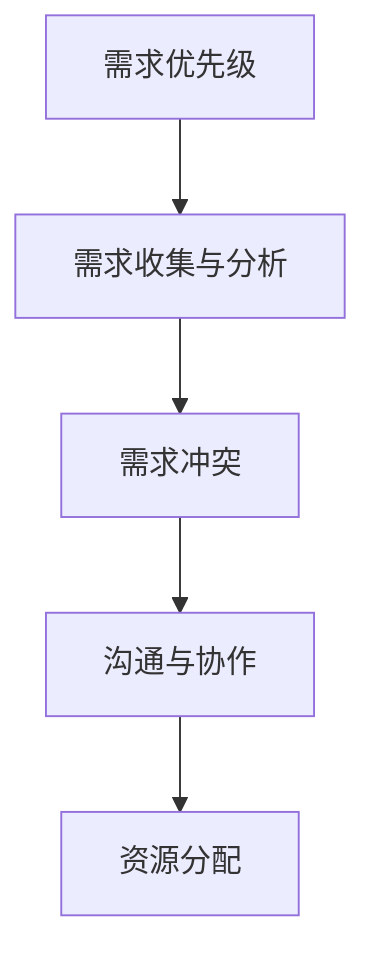

                 

# 需求优先级冲突解决：大型应用开发中的挑战

## 关键词
需求优先级、冲突解决、大型应用开发、项目管理和架构设计

## 摘要
在大型应用开发中，需求优先级冲突是常见的挑战。本文将深入探讨这一问题，从背景介绍、核心概念与联系、算法原理讲解、系统分析与架构设计、项目实战等多个角度，系统地阐述如何有效地解决需求优先级冲突，提供实用的最佳实践和注意事项。

---

### 引言

在当今快速发展的信息技术领域，大型应用开发已经成为企业竞争力的重要标志。然而，随着项目的规模不断扩大，需求数量的激增以及业务环境的变化，需求优先级冲突成为困扰开发团队的一个重大问题。本文将围绕这一主题，通过系统化的分析，提供解决需求优先级冲突的实用策略和方法。

### 第1章 大型应用开发中的需求优先级冲突

#### 1.1 问题背景
在大型应用开发中，需求的多样性和复杂性是不可避免的。企业通常面临来自多个部门、用户群体和市场趋势的多方面需求。这些需求往往具有不同的优先级，并且在实际开发过程中可能会产生冲突。如何平衡和解决这些冲突，是项目成功的关键。

#### 1.2 问题描述
需求优先级冲突的具体表现包括：
- 不同需求之间的资源争夺，如人力、资金和时间等；
- 各方对需求重要性的不同理解和期望；
- 项目进度和成本控制中的决策分歧；
- 技术实现上的矛盾和妥协。

#### 1.3 问题解决
解决需求优先级冲突需要采取系统性、持续性的管理策略。以下是一些基本的解决思路：

- **明确需求优先级**：通过有效的需求收集和分析，明确每个需求的优先级，确保资源分配的合理性和高效性；
- **加强沟通与协作**：建立跨部门的需求沟通机制，促进各方理解和共识；
- **灵活调整**：在项目进行过程中，根据实际情况灵活调整需求优先级，以适应快速变化的市场和技术环境；
- **风险管理和预案**：对潜在的需求冲突进行风险评估，制定相应的应对预案，以减少冲突带来的负面影响。

#### 1.4 边界与外延
需求优先级冲突的解决不仅限于技术层面，还涉及到项目管理、组织文化和团队协作等多个方面。因此，解决需求优先级冲突需要全局视角和多维度的策略。

#### 1.5 概念结构与核心要素组成
本章节的核心概念包括需求优先级、需求收集与分析、需求冲突、沟通与协作、资源分配等。核心要素组成图如下：

### 第2章 需求优先级的定义与评估

#### 2.1 需求优先级的定义
需求优先级是指根据需求的重要性和紧迫性对需求进行排序的过程。通常，优先级越高，需求被满足的时间越紧迫。

#### 2.2 评估方法与工具
评估需求优先级的方法和工具包括：

- **Kano模型**：根据用户需求的满足程度和满意度进行优先级排序；
- **MoSCoW模型**：将需求分为必须（Must）、应该（Should）、可以（Could）和不会（Will not）实现四个类别；
- **工作量评估工具**：如任务列表、甘特图和敏捷开发中的迭代计划等；
- **风险评估工具**：如风险矩阵、蒙特卡罗模拟等。

#### 2.3 优先级评估案例分析
假设我们正在开发一个电商平台，以下是几个典型需求及其优先级评估：

| 需求 | 描述 | Kano模型 | MoSCoW模型 | 优先级 |
| ---- | ---- | ------- | ---------- | ------ |
| 1 | 用户注册 | 基础 | 必须实现 | 高 |
| 2 | 商品浏览 | 一致 | 必须实现 | 高 |
| 3 | 购物车功能 | 一致 | 应该实现 | 中 |
| 4 | 订单支付 | 一致 | 可以实现 | 低 |

通过上述评估，我们可以确定用户注册和商品浏览的优先级最高，因为它们是电商平台的核心功能。

### 第3章 冲突解决策略与方法

#### 3.1 冲突解决原则
解决需求优先级冲突时，应遵循以下原则：

- **平衡利益**：在权衡各方利益的基础上，寻找最优解决方案；
- **透明决策**：确保决策过程公开透明，增加信任和共识；
- **灵活调整**：根据项目进展和外部环境变化，及时调整需求优先级；
- **系统思维**：将冲突解决纳入整个项目管理体系，形成持续改进机制。

#### 3.2 传统解决方法
传统解决需求优先级冲突的方法包括：

- **需求排序**：按照优先级对需求进行排序，确保关键需求得到优先满足；
- **协商与谈判**：通过多方协商和谈判，达成共识；
- **利益补偿**：对受影响方提供一定的利益补偿，以缓解冲突。

#### 3.3 创新性解决方法
随着技术的发展，一些创新性的解决方法逐渐应用于需求优先级冲突的解决：

- **敏捷开发**：通过迭代和增量的方式，灵活调整需求优先级，提高响应速度和适应能力；
- **需求建模与仿真**：利用仿真技术，评估不同需求优先级方案的影响，选择最优方案；
- **博弈论**：通过博弈论模型，分析各方的决策和收益，寻找合作共赢的解决方案。

#### 3.4 方法评估与选择
在选择冲突解决方法时，应综合考虑以下因素：

- **冲突性质**：冲突的严重程度和类型；
- **资源限制**：项目预算、时间和技术资源；
- **团队文化**：组织文化和团队协作方式；
- **技术成熟度**：新方法和技术的成熟度和可行性。

### 第4章 实际案例分析

#### 4.1 案例一：项目背景
某大型电商平台在项目开发过程中，由于不同部门对需求优先级存在分歧，导致项目进度严重滞后。

#### 4.2 案例二：需求冲突
市场营销部门要求优先上线新促销活动模块，以提高用户活跃度；而技术部门认为应先完成订单支付系统的优化，确保交易安全。

#### 4.3 案例三：解决过程
通过以下步骤，项目团队成功解决了需求优先级冲突：

1. **需求收集与分析**：收集各部门的需求，使用Kano模型进行评估；
2. **协商与谈判**：组织跨部门会议，进行需求优先级的协商和谈判；
3. **利益补偿**：对市场营销部门承诺在一定时间内优先考虑其需求；
4. **敏捷开发**：采用敏捷开发方法，灵活调整需求优先级，确保关键需求得到满足。

#### 4.4 案例总结
通过有效的需求优先级冲突解决，项目团队成功实现了项目目标，提高了用户满意度，并为未来项目提供了宝贵的经验。

### 第5章 最佳实践与总结

#### 5.1 最佳实践
- **建立需求管理机制**：明确需求收集、分析、评估和优先级调整的流程和责任人；
- **加强团队协作**：通过跨部门会议、沟通工具和敏捷方法，促进需求优先级共识的形成；
- **持续培训与改进**：定期对团队成员进行需求管理和冲突解决培训，持续优化解决方法。

#### 5.2 经验总结
- **明确需求优先级**：是解决需求优先级冲突的关键；
- **协商与谈判**：是解决冲突的有效手段；
- **敏捷开发**：有助于提高项目适应性和响应速度。

#### 5.3 注意事项
- **避免过度依赖某种方法**：应根据具体情况进行选择和组合；
- **关注项目进度和成本**：在解决冲突时，确保项目进度和成本不受影响；
- **尊重团队文化和价值观**：确保冲突解决方法与团队文化和价值观相符。

#### 5.4 未来发展趋势
- **智能化需求管理**：利用人工智能和大数据技术，提高需求优先级的评估和预测能力；
- **灵活多样的解决方案**：随着技术的发展，出现更多创新性的解决方法。

### 第6章 拓展阅读

#### 6.1 相关文献
- [《敏捷软件开发：原则、实践与模式》](http://www.amazon.com/dp/0321575215)
- [《需求工程：需求分析和需求管理》](http://www.amazon.com/dp/0123820029)
- [《项目管理知识体系指南》](http://www.amazon.com/dp/193558799X)

#### 6.2 相关工具
- **JIRA**：用于需求收集、分析和项目管理的工具；
- **Confluence**：用于团队协作和知识管理的工具；
- **Trello**：用于任务管理和需求优先级排序的工具。

#### 6.3 相关技术发展
- **机器学习与需求预测**：利用机器学习技术，对需求进行智能预测和优化；
- **区块链与需求管理**：利用区块链技术，提高需求管理的透明度和安全性；
- **云计算与需求弹性**：利用云计算技术，实现需求优先级的动态调整和资源优化。

---

**作者：AI天才研究院/AI Genius Institute & 禅与计算机程序设计艺术 /Zen And The Art of Computer Programming**

---

通过上述章节的内容，我们可以系统地了解大型应用开发中需求优先级冲突的解决策略和方法。希望本文能为读者提供有价值的参考和启示，助力项目成功。在接下来的章节中，我们将进一步探讨相关的最佳实践和注意事项。让我们继续深入思考，解决大型应用开发中的挑战。

