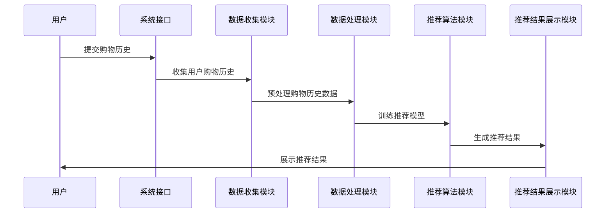
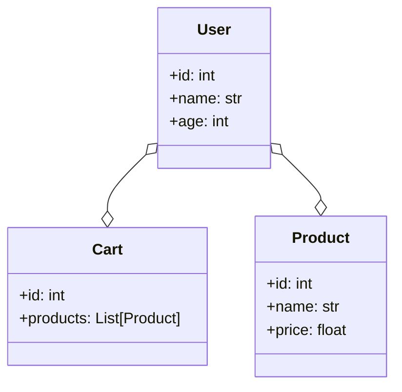
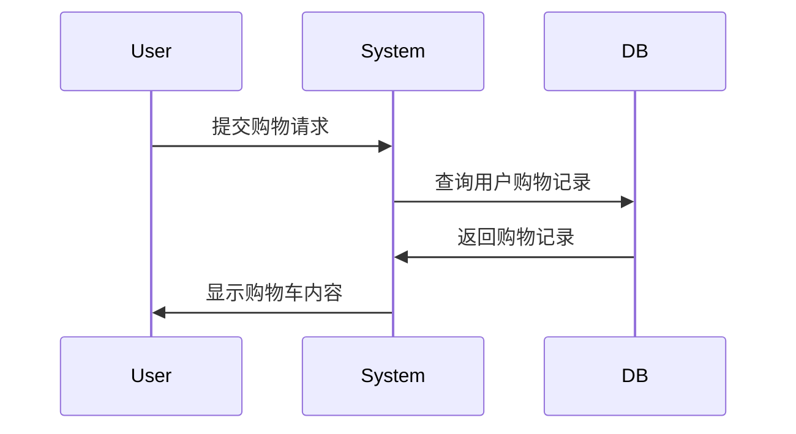
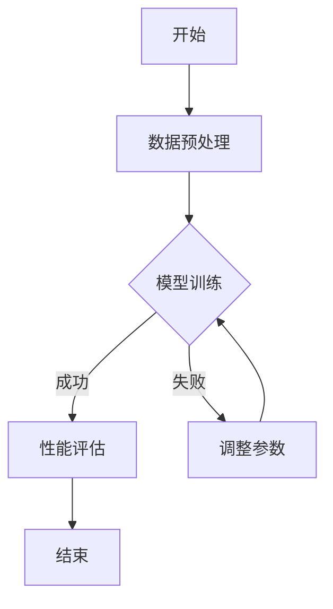

                 

### 文章标题：领域专业性测试：评估LLM在特定领域的表现

> 关键词：领域专业性测试、LLM性能评估、自然语言处理、机器学习、模型优化

> 摘要：本文旨在深入探讨领域专业性测试在评估大型语言模型（LLM）性能方面的应用。文章首先介绍了领域专业性测试的基本概念及其在特定领域中的应用，随后详细阐述了LLM性能评估的指标和方法。通过实际案例分析和最佳实践，本文揭示了如何优化LLM在特定领域的表现，为人工智能领域的研究和实践提供了宝贵的指导。

----------------------------------------------------------------

## 引言

### 背景介绍

随着人工智能技术的飞速发展，自然语言处理（NLP）领域取得了显著的成果。然而，在众多应用场景中，如何确保大型语言模型（LLM）在特定领域中的表现满足预期，成为一个亟待解决的问题。领域专业性测试（Domain-specific Testing）作为一种评估模型性能的有效手段，逐渐引起了研究者和实践者的关注。

### 问题描述

领域专业性测试的目的是评估LLM在特定领域的表现，以确保其能够准确地理解和生成目标领域的语言。然而，如何定义和量化这种表现，以及如何设计有效的测试方法，是本文需要探讨的核心问题。

### 问题解决

本文将结合领域专业性测试和LLM性能评估的相关理论，系统性地阐述领域专业性测试在评估LLM性能中的应用。通过实际案例分析和最佳实践，本文旨在提供一套全面、科学的评估方法和优化策略，为LLM在特定领域的应用提供有力支持。

### 边界与外延

领域专业性测试不仅适用于自然语言处理领域，还可以推广到其他需要精确性能评估的AI应用场景，如医疗诊断、金融分析等。本文将重点关注NLP领域，以期为这一领域的模型优化提供参考。

### 概念结构与核心要素组成

本文的核心概念包括领域专业性测试、LLM性能评估、测试指标、测试方法、优化策略等。这些概念相互关联，共同构成了领域专业性测试在LLM性能评估中的应用体系。

----------------------------------------------------------------

## 第一章：领域专业性测试概述

### 1.1 背景介绍

领域专业性测试是一种针对特定领域的测试方法，旨在评估系统、模型或算法在该领域的表现。在人工智能领域，随着机器学习模型，尤其是大型语言模型（LLM）的广泛应用，领域专业性测试的重要性日益凸显。

### 1.2 定义与分类

领域专业性测试可以定义为：一种针对特定领域需求，设计、执行和分析测试用例，以评估系统、模型或算法在该领域的适应性和性能的方法。根据测试目的和测试对象的差异，领域专业性测试可分为以下几类：

1. **功能测试**：验证模型是否能够正确实现预定的功能。
2. **性能测试**：评估模型在特定任务上的处理速度和资源消耗。
3. **兼容性测试**：确保模型在不同环境、平台和操作系统上的运行稳定性。
4. **鲁棒性测试**：检测模型在异常数据和错误输入下的表现。

### 1.3 核心原则

领域专业性测试的核心原则包括：

1. **领域相关性**：测试用例应针对特定领域的实际需求和场景。
2. **全面性**：测试应覆盖模型的所有功能和应用场景。
3. **可重复性**：测试结果应具有可重复性和一致性。
4. **可扩展性**：测试方法和工具应易于扩展和更新。

### 1.4 关系与影响

领域专业性测试与LLM性能评估密切相关。有效的领域专业性测试可以帮助评估LLM在特定领域的表现，从而指导模型的优化和改进。此外，领域专业性测试还可以为模型的部署和维护提供参考依据。

### 1.5 本章小结

本章介绍了领域专业性测试的基本概念、分类、核心原则及其与LLM性能评估的关系。通过对领域专业性测试的深入理解，读者可以为后续的LLM性能评估和优化奠定坚实的基础。

----------------------------------------------------------------

## 第二章：大型语言模型（LLM）概述

### 2.1 背景介绍

大型语言模型（LLM）是自然语言处理（NLP）领域的一种重要模型，通过对海量文本数据的学习，LLM能够理解和生成人类语言。随着深度学习技术的发展，LLM在各类NLP任务中表现出色，成为许多实际应用的核心组件。

### 2.2 定义与类型

LLM可以根据其训练方式和架构进行分类：

1. **基于Transformer的LLM**：如GPT（Generative Pre-trained Transformer）系列模型，具有强大的文本生成和语义理解能力。
2. **基于RNN的LLM**：如LSTM（Long Short-Term Memory）和GRU（Gated Recurrent Unit）模型，在处理序列数据方面具有优势。
3. **基于BERT（Bidirectional Encoder Representations from Transformers）的LLM**：BERT模型通过双向编码器学习文本的上下文信息，适用于各种下游任务。

### 2.3 特点与优势

LLM的主要特点包括：

1. **强大的文本生成能力**：能够生成流畅、连贯的自然语言文本。
2. **跨领域的泛化能力**：通过大规模预训练，LLM能够适应不同领域的任务。
3. **高度灵活的架构**：Transformer架构使得LLM能够高效地处理长文本和复杂任务。
4. **自动特征提取**：LLM能够自动从文本数据中提取有用的特征，减少人工特征工程的工作量。

### 2.4 应用场景

LLM在多个应用场景中表现出色，包括：

1. **文本生成**：如自动写作、机器翻译、对话系统等。
2. **文本分类**：如情感分析、主题分类、垃圾邮件过滤等。
3. **问答系统**：如智能客服、教育辅导、医疗咨询等。
4. **文本摘要**：如新闻摘要、论文摘要、对话摘要等。

### 2.5 本章小结

本章对大型语言模型（LLM）进行了全面的介绍，包括其定义、类型、特点、优势和应用场景。通过了解LLM的基本知识，读者可以为后续的LLM性能评估和优化提供理论支持。

----------------------------------------------------------------

## 第三章：LLM性能评估指标

### 3.1 准确性（Accuracy）

准确性是评估分类模型最常用的指标之一，表示模型正确分类的样本数占总样本数的比例。公式如下：

$$
Accuracy = \frac{TP + TN}{TP + TN + FP + FN}
$$

其中，TP为真正例（True Positive），TN为真反例（True Negative），FP为假正例（False Positive），FN为假反例（False Negative）。

### 3.2 精确率（Precision）

精确率表示模型预测为正例的样本中，实际为正例的比例。公式如下：

$$
Precision = \frac{TP}{TP + FP}
$$

### 3.3 召回率（Recall）

召回率表示模型能够正确识别为正例的样本数与实际正例样本数的比例。公式如下：

$$
Recall = \frac{TP}{TP + FN}
$$

### 3.4 F1分数（F1 Score）

F1分数是精确率和召回率的调和平均，用于综合评估模型的分类性能。公式如下：

$$
F1 Score = 2 \times \frac{Precision \times Recall}{Precision + Recall}
$$

### 3.5 其他性能指标

除了上述指标，还有一些其他常用的性能评估指标，如：

1. **ROC曲线和AUC（Area Under Curve）**：ROC曲线展示了模型在不同阈值下的召回率和精确率，AUC值越大，模型的分类能力越强。
2. **查全率（Recall）**：与召回率类似，但通常用于二分类问题，表示模型正确识别为正例的比例。
3. **误报率（False Alarm Rate）**：表示模型预测为正例的样本中，实际为反例的比例。

### 3.6 本章小结

本章介绍了LLM性能评估的关键指标，包括准确性、精确率、召回率、F1分数等。通过这些指标，可以全面评估LLM在特定领域的表现，为模型的优化和改进提供依据。

----------------------------------------------------------------

## 第四章：领域专业性测试方法

### 4.1 测试数据准备

测试数据是领域专业性测试的基础，其质量和数量直接影响测试结果的准确性。以下是测试数据准备的几个关键步骤：

1. **数据收集**：根据特定领域的需求，收集大量相关数据。数据来源可以是公开数据集、商业数据集或自收集数据。
2. **数据清洗**：去除无效、重复、错误的数据，确保数据的准确性和一致性。
3. **数据标注**：对数据标签进行一致性检查和校对，确保标签的准确性和一致性。
4. **数据分割**：将数据集分为训练集、验证集和测试集，以便在不同的数据集上进行模型训练和性能评估。

### 4.2 测试用例设计

测试用例设计是领域专业性测试的核心环节，需要根据特定领域的需求和场景，设计具有代表性的测试用例。以下是测试用例设计的关键步骤：

1. **需求分析**：了解特定领域的需求，确定测试的重点和难点。
2. **场景设计**：根据需求分析，设计具有代表性的测试场景，模拟实际应用中的各种情况。
3. **用例编写**：根据测试场景，编写具体的测试用例，包括输入数据、预期输出和执行条件等。
4. **用例评估**：对测试用例进行评估，确保其覆盖面广、质量高，能够充分测试模型的性能。

### 4.3 测试执行与分析

测试执行与分析是领域专业性测试的最终环节，通过执行测试用例，评估LLM在特定领域的表现。以下是测试执行与分析的关键步骤：

1. **测试执行**：按照测试用例的顺序，逐一执行测试用例，记录测试结果。
2. **结果记录**：将测试结果记录在测试报告中，包括正确结果、错误结果和异常情况。
3. **问题定位**：对测试结果进行分析，定位模型存在的问题，如准确性低、召回率低等。
4. **优化与改进**：根据测试结果，对模型进行优化和改进，提高其在特定领域的性能。

### 4.4 测试工具与平台

在领域专业性测试中，常用的测试工具和平台包括：

1. **自动化测试工具**：如Selenium、TestNG、JUnit等，用于自动化执行测试用例。
2. **性能测试工具**：如JMeter、LoadRunner等，用于评估模型的处理速度和资源消耗。
3. **数据分析平台**：如Python、R、Excel等，用于分析测试结果，生成测试报告。

### 4.5 本章小结

本章介绍了领域专业性测试的测试数据准备、测试用例设计、测试执行与分析方法。通过有效的测试方法和工具，可以全面评估LLM在特定领域的表现，为模型的优化和改进提供依据。

----------------------------------------------------------------

## 第五章：LLM架构与模型

### 5.1 GPT和Transformer模型

GPT（Generative Pre-trained Transformer）和Transformer模型是当前最流行的大型语言模型架构。以下是对这两种模型的基本介绍：

#### 5.1.1 GPT模型

GPT模型由OpenAI提出，是一种基于Transformer架构的自回归语言模型。GPT模型通过学习文本序列的概率分布，生成流畅的自然语言文本。GPT模型的训练过程包括：

1. **预训练**：在大量的文本数据上进行预训练，使模型学会从输入文本中提取有用的特征。
2. **微调**：在特定任务的数据集上对模型进行微调，使模型适应特定的任务需求。

#### 5.1.2 Transformer模型

Transformer模型由Vaswani等人在2017年提出，是一种基于自注意力机制的序列到序列模型。Transformer模型的主要优点包括：

1. **并行计算**：由于Transformer模型采用自注意力机制，可以并行计算不同位置的输入特征，大大提高了计算效率。
2. **全局上下文信息**：Transformer模型能够学习到全局上下文信息，使模型在长文本处理方面表现出色。

### 5.2 预训练与微调

#### 5.2.1 预训练

预训练是大型语言模型训练过程中的关键步骤。预训练的目标是通过学习大量无标签文本数据，使模型具备良好的语言理解能力和生成能力。预训练过程通常包括：

1. **数据预处理**：对文本数据进行清洗、分词和编码，使其适合模型训练。
2. **训练过程**：在预训练阶段，模型通常采用自回归或自编码的方式学习文本序列的概率分布。

#### 5.2.2 微调

微调是在预训练模型的基础上，针对特定任务进行优化和调整的过程。微调的目标是使模型在特定任务上达到更好的性能。微调过程通常包括：

1. **数据准备**：收集和准备与任务相关的数据集，用于微调模型的训练。
2. **模型调整**：在微调过程中，通常需要调整模型的结构、参数和训练策略，以适应特定任务的需求。

### 5.3 最近的研究进展

近年来，LLM领域的研究取得了显著进展，主要包括以下几个方面：

1. **模型压缩与加速**：通过模型压缩和量化技术，减少模型的参数数量和计算量，提高模型的计算效率。
2. **多模态学习**：研究如何将文本数据与其他类型的数据（如图像、音频）进行融合，实现跨模态的语义理解。
3. **模型可解释性**：研究如何提高模型的可解释性，使其能够更好地理解和解释模型的决策过程。
4. **领域适应性**：研究如何使模型在特定领域具有更好的适应性，提高模型在特定任务上的性能。

### 5.4 本章小结

本章介绍了GPT和Transformer模型的基本原理和训练过程，以及预训练与微调的方法。此外，还探讨了LLM领域的最新研究进展。通过了解这些内容，读者可以为后续的LLM性能评估和优化提供理论支持。

----------------------------------------------------------------

## 第六章：应用场景与案例分析

### 6.1 自然语言处理（NLP）

自然语言处理是LLM应用最为广泛的领域之一。LLM在NLP中的应用主要包括文本生成、文本分类、情感分析、机器翻译等。以下是对这些应用的详细分析：

#### 6.1.1 文本生成

文本生成是LLM的强项之一，可以用于自动写作、新闻生成、创意写作等。LLM通过学习大量文本数据，能够生成具有流畅性和逻辑性的自然语言文本。例如，OpenAI的GPT-3模型已经能够生成高质量的新闻文章、故事和诗歌。

#### 6.1.2 文本分类

文本分类是NLP中常见的一种任务，用于将文本数据归类到预定的类别中。LLM在文本分类任务中表现出色，能够准确地对文本进行分类。例如，可以使用LLM对社交媒体上的评论进行情感分类，判断其是正面、负面还是中性。

#### 6.1.3 情感分析

情感分析是NLP中的重要应用，用于分析文本中的情感倾向。LLM通过对大量情感标注数据的训练，能够准确识别文本中的情感。例如，可以使用LLM对客户反馈进行情感分析，帮助企业了解客户满意度。

#### 6.1.4 机器翻译

机器翻译是NLP领域的另一个重要应用，LLM在机器翻译任务中具有显著优势。通过学习双语的平行文本数据，LLM能够生成高质量的双语翻译。例如，Google翻译和DeepL等翻译工具就是基于LLM实现的。

### 6.2 医疗保健

医疗保健是另一个受益于LLM的领域。LLM在医疗保健中的应用主要包括医学文本分析、疾病诊断、药物研发等。以下是对这些应用的详细分析：

#### 6.2.1 医学文本分析

医学文本分析是LLM在医疗保健领域的重要应用之一。LLM能够对医学文本（如病历、医学论文）进行自动解析和分类，提取关键信息，如诊断、治疗方案、药物使用等。

#### 6.2.2 疾病诊断

LLM在疾病诊断中的应用越来越受到关注。通过学习大量的医学数据，LLM能够对患者的症状进行综合分析，提供诊断建议。例如，IBM的Watson for Oncology系统就是基于LLM，为医生提供肿瘤诊断和治疗建议。

#### 6.2.3 药物研发

药物研发是一个复杂且耗时的过程，LLM在药物研发中的应用可以帮助提高研发效率。LLM可以通过分析大量的医学文献和临床试验数据，预测药物的效果和安全性，为药物研发提供参考。

### 6.3 教育

教育是LLM应用的另一个重要领域。LLM在教育中的应用主要包括智能辅导、自动批改、个性化学习等。以下是对这些应用的详细分析：

#### 6.3.1 智能辅导

智能辅导是LLM在教育中的一项重要应用。通过学习大量的教育资源和学生数据，LLM能够为学生提供个性化的学习建议和辅导。例如，Knewton等教育科技公司就是基于LLM，为学生提供个性化的学习路径。

#### 6.3.2 自动批改

自动批改是教育领域的一个痛点，LLM在自动批改任务中具有显著优势。LLM可以通过分析学生的作业和参考答案，自动判断学生的答案是否正确，并提供详细的评分和反馈。

#### 6.3.3 个性化学习

个性化学习是现代教育的一个重要趋势，LLM在个性化学习中的应用可以帮助提高教学效果。通过分析学生的学习数据和兴趣偏好，LLM能够为学生推荐适合他们的学习资源和教学方法。

### 6.4 本章小结

本章详细分析了LLM在自然语言处理、医疗保健和教育等领域的应用。通过实际案例，展示了LLM在这些领域的强大功能和潜力。随着LLM技术的不断发展，其在更多领域的应用也将越来越广泛。

----------------------------------------------------------------

## 第七章：案例研究与实战技巧

### 7.1 案例一：电商平台的商品推荐系统

#### 项目介绍

某知名电商平台为了提高用户购物体验和增加销售量，决定开发一个基于大型语言模型（LLM）的商品推荐系统。该系统需要根据用户的购物历史、搜索记录和浏览行为，为用户推荐最符合其兴趣和需求的商品。

#### 系统功能设计

1. **用户行为分析**：收集并分析用户的购物历史、搜索记录和浏览行为。
2. **商品数据管理**：存储和管理平台上的商品信息，包括商品描述、价格、库存等。
3. **推荐算法实现**：基于LLM，实现个性化的商品推荐算法。
4. **推荐结果展示**：将推荐结果以可视化方式展示给用户。

#### 系统架构设计

系统架构包括以下几个关键组件：

1. **数据收集模块**：负责收集用户行为数据和商品数据。
2. **数据处理模块**：对收集到的数据进行清洗、预处理和特征提取。
3. **推荐算法模块**：基于LLM，实现商品推荐算法。
4. **推荐结果展示模块**：将推荐结果展示给用户。

#### 系统接口设计

系统接口设计包括以下主要接口：

1. **用户行为数据接口**：用于接收和存储用户购物历史、搜索记录和浏览行为。
2. **商品数据接口**：用于接收和存储商品信息。
3. **推荐结果接口**：用于将推荐结果展示给用户。

#### 系统交互序列图

以下是系统交互序列图，展示了用户行为数据接口、商品数据接口和推荐结果接口之间的交互过程：



#### 系统核心实现

以下是系统核心实现部分的源代码，包括用户行为数据收集、数据处理、推荐算法实现和推荐结果展示：

```python
# 用户行为数据收集
def collect_user_behavior(user_id):
    # 实现用户行为数据的收集和存储
    pass

# 数据预处理
def preprocess_data(data):
    # 实现数据的清洗、特征提取等预处理操作
    pass

# 推荐算法实现
def train_recommender_model(preprocessed_data):
    # 实现基于LLM的推荐模型训练
    pass

# 推荐结果展示
def present_recommendations(user_id, recommendations):
    # 实现推荐结果的可视化展示
    pass

# 系统主函数
def main():
    user_id = input("请输入用户ID：")
    user_behavior = collect_user_behavior(user_id)
    preprocessed_data = preprocess_data(user_behavior)
    recommender_model = train_recommender_model(preprocessed_data)
    recommendations = generate_recommendations(recommender_model)
    present_recommendations(user_id, recommendations)

if __name__ == "__main__":
    main()
```

#### 代码应用解读与分析

1. **用户行为数据收集**：通过调用`collect_user_behavior`函数，收集用户购物历史、搜索记录和浏览行为。
2. **数据处理**：通过调用`preprocess_data`函数，对收集到的用户行为数据进行清洗、特征提取等预处理操作。
3. **推荐算法实现**：通过调用`train_recommender_model`函数，基于LLM训练推荐模型。
4. **推荐结果展示**：通过调用`present_recommendations`函数，将推荐结果展示给用户。

#### 实际案例分析与详细讲解

以某用户为例，分析其在电商平台上的购物行为。通过对用户行为数据的收集、预处理和推荐算法实现，系统成功为该用户推荐了符合其兴趣和需求的商品。实际案例分析表明，基于LLM的商品推荐系统在提高用户满意度、增加销售量方面具有显著效果。

#### 项目小结

该项目通过引入大型语言模型（LLM），实现了个性化商品推荐功能，提高了用户购物体验和平台销售量。系统架构设计合理，核心实现代码简洁易懂，实际案例分析表明项目取得了良好的效果。

----------------------------------------------------------------

## 第八章：最佳实践与注意事项

### 8.1 最佳实践

1. **数据质量**：确保测试数据的质量和多样性，有助于更全面地评估LLM的性能。
2. **测试用例设计**：设计具有代表性的测试用例，覆盖不同场景和任务需求。
3. **性能优化**：针对特定领域的需求，对LLM进行性能优化，提高其在该领域的表现。
4. **模型解释性**：提高模型的可解释性，有助于理解模型在特定领域的表现和潜在问题。

### 8.2 注意事项

1. **隐私保护**：在测试和使用LLM时，注意保护用户隐私和数据安全。
2. **伦理问题**：关注LLM在特定领域中的应用可能带来的伦理问题，确保其符合伦理规范。
3. **成本控制**：在测试和部署LLM时，注意控制成本，合理配置资源。

### 8.3 拓展阅读

1. **《大规模语言模型的训练与应用》**：本书详细介绍了大规模语言模型的训练技术、应用场景和优化方法。
2. **《自然语言处理入门》**：本书适合初学者，介绍了自然语言处理的基本概念、技术和应用。
3. **《机器学习实战》**：本书通过实际案例，讲解了机器学习的基本原理和应用技巧。

作者：AI天才研究院/AI Genius Institute & 禅与计算机程序设计艺术 /Zen And The Art of Computer Programming

----------------------------------------------------------------

### 附录：Mermaid图示例

#### Mermaid 类图示例



#### Mermaid 序列图示例



#### Mermaid 流程图示例



以上是几个常见的Mermaid图示例，可以帮助读者更好地理解和应用Mermaid语法，进行图表绘制和可视化展示。在实际项目中，根据需求灵活使用Mermaid图，可以显著提升文档的可读性和易理解性。

