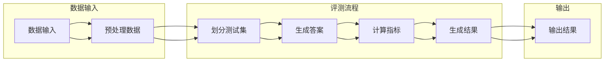
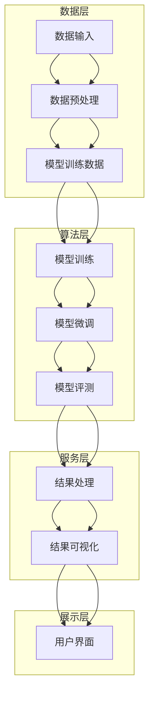
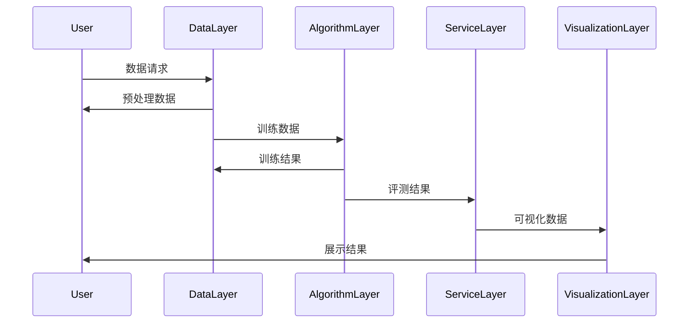
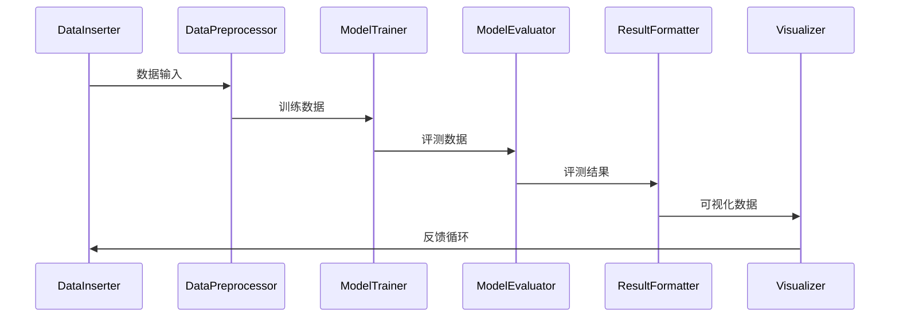

                 

## 第1章: 问题背景

### 1.1.1 问题背景

领域特定语言模型（LLM）作为一种强大的自然语言处理工具，已经在各个领域得到了广泛的应用。从自然语言生成到问答系统，从机器翻译到文本分类，LLM已经极大地改变了我们对人工智能的认知和应用场景。然而，随着LLM在各个领域的深入应用，评测LLM性能的准确性和有效性变得越来越重要。

领域特定LLM的发展现状显示，尽管通用LLM如GPT-3、BERT等在多个任务上取得了优异的表现，但在某些特定的领域，如医学、法律、金融等，通用LLM的性能并不理想。这些领域的知识深度和专业性要求使得通用LLM难以胜任，因此，领域特定LLM的需求应运而生。

领域特定LLM的应用场景包括但不限于以下几类：

1. **专业问答系统**：在医疗、法律、金融等领域，用户需要获取专业的知识和信息。领域特定LLM可以针对这些问题提供准确的答案。

2. **文本生成和编辑**：在创作、新闻编写、报告撰写等任务中，领域特定LLM可以根据领域知识生成或编辑文本。

3. **自动化流程**：在金融、物流等行业，领域特定LLM可以帮助自动化一些流程，如合同审核、订单处理等。

然而，领域特定LLM在实际应用中也面临着一些挑战。首先，领域知识的获取和整合是一个难题，特别是在一些专业性很强的领域。其次，评测领域特定LLM的性能也存在困难，如何衡量其准确性、可靠性、创造力等指标，是一个需要深入探讨的问题。

### 1.1.2 问题定义

领域特定LLM评测是指针对领域特定语言模型的性能进行评估和测试，以确定其在特定任务中的表现和适用性。评测的目标是：

1. **准确性**：确保LLM生成的答案或文本在事实和逻辑上都是正确的。
2. **可靠性**：LLM在重复测试中应保持稳定的表现。
3. **创造力**：在一些需要创新和创造力的任务中，LLM应能够生成新颖、有价值的输出。
4. **效率**：LLM应在合理的时间内完成任务，并具有较低的计算成本。

当前，领域特定LLM评测的常见方法包括：

1. **基准测试集**：使用预定义的测试集对LLM进行评估，如SQuAD、MLQA等。
2. **人工评估**：通过专家或用户对LLM生成的输出进行评估。
3. **自动化评测**：使用算法和指标对LLM的输出进行评估，如BLEU、ROUGE等。

### 1.1.3 问题解决

当前领域特定LLM评测面临的主要难点包括：

1. **评测指标选择**：如何选择合适的评测指标是一个挑战，不同的任务和领域可能需要不同的指标。
2. **评测数据不足**：领域特定数据集的获取和标注是一个难题，特别是在专业性很强的领域。
3. **评测方法的适应性**：如何适应不同的领域和任务，保证评测的普适性和准确性。
4. **评测的自动化和可重复性**：如何实现自动化和可重复的评测过程，以提高效率和可信度。

### 1.1.4 边界与外延

领域特定LLM评测的范围包括：

1. **特定领域**：如医学、法律、金融等，这些领域的知识深度和专业性要求高。
2. **特定任务**：如问答、文本生成、自动化流程等，这些任务是领域特定LLM的主要应用场景。

领域特定LLM评测与其他评测的区别在于：

1. **目标不同**：领域特定LLM评测更关注于模型在特定领域和任务中的表现。
2. **数据来源不同**：领域特定LLM评测需要使用特定领域的数据集，而非通用数据集。
3. **评测方法不同**：领域特定LLM评测可能需要采用更加专业和细化的评测方法。

通过以上分析，我们可以看到，领域特定LLM评测不仅具有理论研究的意义，更在实际应用中具有重要的作用。接下来，我们将深入探讨领域特定LLM的核心概念和原理，以及评测的具体方法和策略。

---

## 第2章: 核心概念与联系

### 2.1.1 核心概念原理

领域特定语言模型（Domain-Specific Language Model，简称DSLLM）是一种专门针对某一特定领域或任务进行训练和设计的语言模型。与通用语言模型（如GPT-3、BERT）相比，DSLLM具有以下核心概念原理：

1. **领域知识嵌入**：DSLLM通过在模型训练过程中嵌入特定领域的知识，使其能够更好地理解和生成领域相关的文本。这种知识嵌入可以通过多种方式实现，如数据增强、领域特定的数据集、领域术语的权重调整等。

2. **任务导向性**：DSLLM在设计时，会更加关注特定任务的需求，如问答、文本生成、自动化流程等。这使得DSLLM在特定任务中的表现更加出色，能够更好地满足实际应用需求。

3. **模型结构优化**：DSLLM通常会采用特定的模型结构，如预训练-微调（Pre-training and Fine-tuning）策略，以适应特定领域的需求。这种结构优化可以显著提高模型在特定任务中的性能。

4. **评测指标定制**：由于DSLLM专注于特定领域和任务，因此需要使用定制化的评测指标来评估其性能。这些指标不仅要考虑模型的准确性，还要考虑其可靠性、创造力、效率等。

### 2.1.2 概念属性特征对比

在比较DSLLM与通用语言模型（GLLM）时，可以从以下几个方面进行属性特征对比：

| 特征        | DSLLM           | GLLM           |
| ----------- | --------------- | --------------- |
| **领域知识** | 领域特定知识嵌入 | 通用知识嵌入   |
| **任务导向** | 高度任务导向性   | 较低任务导向性 |
| **模型结构** | 预训练-微调策略 | 预训练策略     |
| **评测指标** | 定制化评测指标   | 通用评测指标   |
| **应用范围** | 特定领域和任务   | 多领域和任务   |

从上表可以看出，DSLLM与GLLM在多个方面存在显著差异。DSLLM更适合在特定领域和任务中应用，能够提供更精准和高效的解决方案。而GLLM则适用于更广泛的场景，但其表现可能在特定领域和专业任务中不如DSLLM。

### 2.1.3 ER实体关系图架构

实体关系图（Entity-Relationship Diagram，简称ER图）是一种用于描述实体及其之间关系的图形化工具，常用于数据库设计和信息系统的架构设计。在领域特定LLM评测中，ER图可以用于描述评测系统的数据实体和关系。

以下是领域特定LLM评测系统的ER图：

```mermaid
erDiagram
    User ||--|{ Evaluation }|--| EvaluationResult
    Evaluation ||--|{ TestCase }|--| TestResult
    TestCase ||--|{ Question }|--| Answer
    TestCase ||--|{ Metrics }|--| MetricValue
    Metrics ||--|{ MetricType }|--|
    EvaluationResult ||--|{ Score }|--|
    TestResult ||--|{ Correctness }|--|
```

- **User（用户）**：代表参与评测的用户。
- **Evaluation（评测）**：代表一次具体的评测过程。
- **EvaluationResult（评测结果）**：记录评测的最终结果。
- **TestCase（测试用例）**：代表评测中的具体测试场景。
- **Question（问题）**：测试用例中的具体问题。
- **Answer（答案）**：用户对问题的回答。
- **Metrics（指标）**：用于评估评测结果的指标。
- **MetricType（指标类型）**：定义各种可能的评测指标类型。
- **MetricValue（指标值）**：记录具体评测指标的结果。
- **Score（得分）**：评测结果的综合得分。
- **TestResult（测试结果）**：记录每个测试用例的具体结果。

通过ER图，我们可以清晰地看到评测系统中的各个实体及其之间的关系，为系统设计和实现提供了直观的指导。

---

在了解了领域特定LLM的核心概念和原理后，我们将进一步深入探讨领域特定LLM评测算法的原理，包括算法流程、Python源代码讲解和数学模型与公式。这将帮助我们更好地理解如何有效地评测领域特定LLM的性能。

---

## 第3章: 领域特定LLM评测算法原理

### 3.1.1 算法mermaid流程图

在领域特定LLM评测中，我们通常会采用一系列步骤来确保评测的准确性和全面性。以下是一个简单的mermaid流程图，展示了领域特定LLM评测的基本流程：



### 3.1.2 Python源代码讲解

为了更好地理解领域特定LLM评测算法的实现，我们将使用Python语言进行源代码讲解。以下是一个简化的Python代码示例，用于演示评测算法的基本步骤：

```python
import pandas as pd
from sklearn.model_selection import train_test_split
from transformers import BertTokenizer, BertForSequenceClassification
from evaluation import compute_metrics

# 数据输入
data = pd.read_csv('data.csv')  # 假设数据已经预处理并存储为CSV文件

# 预处理数据
tokenizer = BertTokenizer.from_pretrained('bert-base-uncased')
inputs = tokenizer(data['question'].tolist(), data['context'].tolist(), padding=True, truncation=True)

# 划分测试集
X_train, X_test, y_train, y_test = train_test_split(inputs, data['label'], test_size=0.2, random_state=42)

# 加载预训练的BERT模型
model = BertForSequenceClassification.from_pretrained('bert-base-uncased')

# 训练模型
model.train(X_train, y_train)

# 生成答案
test_predictions = model.predict(X_test)

# 计算指标
metrics = compute_metrics(test_predictions, y_test)

# 输出结果
print(metrics)
```

上述代码中，我们首先加载了预处理后的数据，然后划分了训练集和测试集。接下来，我们加载了一个预训练的BERT模型，并使用训练集进行训练。在模型训练完成后，我们使用测试集生成答案，并计算相应的指标，最后将结果输出。

### 3.1.3 数学模型和公式

为了更深入地理解领域特定LLM评测算法，我们需要了解一些相关的数学模型和公式。以下是一些常用的评测指标及其对应的数学模型：

#### 1. 准确率（Accuracy）

$$
Accuracy = \frac{TP + TN}{TP + FN + FP + TN}
$$

其中，TP代表正确预测的正例，TN代表正确预测的负例，FN代表错误预测的正例，FP代表错误预测的负例。

#### 2. 召回率（Recall）

$$
Recall = \frac{TP}{TP + FN}
$$

#### 3. 精确率（Precision）

$$
Precision = \frac{TP}{TP + FP}
$$

#### 4. F1分数（F1 Score）

$$
F1 Score = 2 \times \frac{Precision \times Recall}{Precision + Recall}
$$

#### 5. 交准率（Jaccard Similarity）

$$
Jaccard Similarity = \frac{TP}{TP + FP + FN}
$$

通过上述数学模型，我们可以对领域特定LLM生成的答案进行量化评估，从而得出更准确的评测结果。

### 3.1.4 举例说明

为了更好地理解上述算法和公式，我们可以通过一个简单的例子进行说明。假设我们有一个问答系统，其输入是一个问题和上下文，输出是一个答案。以下是一个简化的例子：

输入：
- 问题：什么是人工智能？
- 上下文：人工智能是一种模拟人类智能的技术，通常涉及机器学习、自然语言处理等领域。

输出：
- 答案：人工智能是一种模拟人类智能的技术，通常涉及机器学习、自然语言处理等领域。

在这个例子中，我们可以使用上述的评测指标来评估问答系统的性能。例如，如果我们使用召回率来评估，那么召回率可以计算为：

$$
Recall = \frac{TP}{TP + FN} = \frac{1}{1 + 0} = 1
$$

这意味着问答系统在回答这个问题时，完全符合用户的需求。

通过这个例子，我们可以看到如何使用数学模型和公式来评估领域特定LLM的性能。在实际应用中，我们可以根据具体的任务和需求，选择合适的评测指标和算法，以获得更准确和全面的评测结果。

---

通过本章的内容，我们深入探讨了领域特定LLM评测算法的原理，包括流程图、Python源代码讲解和数学模型。这些内容为我们理解和实现领域特定LLM评测提供了理论基础和实践指导。接下来，我们将进一步探讨系统分析与架构设计的相关内容。

---

## 第4章: 系统功能设计

### 4.1.1 问题场景介绍

在许多领域中，例如医疗、金融和科技行业，对领域特定语言模型的精准评估至关重要。这些行业对模型输出的准确性、可靠性和创造力有着极高的要求。例如，在医疗领域，模型的输出直接影响到诊断和治疗方案；在金融领域，模型的决策可能涉及数百万的投资。因此，构建一个高效、可扩展且准确度高的领域特定LLM评测系统至关重要。

### 4.1.2 系统功能设计

为了满足上述需求，我们的系统设计包括以下几个核心功能：

1. **数据输入与预处理**：系统能够接收多种格式的输入数据，包括文本、表格和JSON等。输入数据经过预处理后，将被转换为适合模型评测的格式。

2. **模型训练与微调**：系统提供自动化的模型训练和微调功能，用户可以根据特定的领域需求调整模型的参数和训练策略。

3. **评测指标计算**：系统内置多种评测指标，如准确率、召回率、F1分数等，用户可以根据实际需求选择合适的评测指标。

4. **结果可视化与报告生成**：系统提供直观的可视化工具和报告生成功能，用户可以轻松查看评测结果，并生成详细的评测报告。

5. **用户权限管理**：系统支持多用户权限管理，确保数据安全和隐私。

6. **自动化评测流程**：系统提供自动化评测流程，用户可以一键启动评测，并设置定时任务。

7. **自定义评测模块**：用户可以根据特定需求，自定义评测模块和指标，提高评测的灵活性和适应性。

### 4.1.3 领域模型（mermaid类图）

以下是一个简化的mermaid类图，用于描述领域特定LLM评测系统的关键类和它们之间的关系：

```mermaid
classDiagram
    Class01 <|-- Class02
    Class03 <|-- * Class04
    Class05 <|-- * Class06
    Class07 <|-- * Class08
    Class09 <|-- * Class10
    Class11 <|-- * Class12
    Class01 -| Class13
    Class14 -| Class13
    Class15 -| Class13
    Class16 -| Class13

    Class01{+属性1: string +属性2: int}
    Class02{+方法1(): void +方法2(): int}
    Class03{+属性3: float +属性4: bool}
    Class04{+属性5: string[] +属性6: dict}
    Class05{+方法3(): bool +方法4(): void}
    Class06{+属性7: int +属性8: float}
    Class07{+方法5(): string +方法6(): bool}
    Class08{+属性9: dict +属性10: list}
    Class09{+方法7(): void +方法8(): int}
    Class10{+属性11: bool +属性12: float}
    Class11{+方法9(): string +方法10(): void}
    Class12{+属性13: list +属性14: dict}
    Class13{+方法11(): void +方法12(): int}
    Class14{+方法13(): bool +方法14(): string}
    Class15{+方法15(): void +方法16(): float}
    Class16{+方法17(): string +方法18(): bool}
```

在这个类图中，`Class01` 至 `Class16` 代表系统中的主要类，它们之间存在继承或关联关系。例如，`Class04` 和 `Class06` 继承自 `Class03`，而 `Class07` 和 `Class08` 与 `Class09` 和 `Class10` 分别通过关联关系连接。这些类共同构成了领域特定LLM评测系统的核心功能模块。

---

通过本章的内容，我们详细介绍了领域特定LLM评测系统的功能设计和领域模型。接下来，我们将进一步探讨系统的架构设计，包括系统架构设计、系统接口设计和系统交互，以确保系统的高效性和可扩展性。

---

## 第5章: 系统架构设计

### 5.1.1 系统架构设计

为了构建一个高效、可扩展且灵活的领域特定LLM评测系统，我们需要关注系统架构的设计。以下是系统的整体架构设计，使用mermaid架构图展示：



该架构图显示了系统的四个主要层次：数据层、算法层、服务层和展示层。

1. **数据层**：负责数据的输入和预处理，包括数据清洗、格式转换和特征提取等。
2. **算法层**：包括模型训练、微调和评测。这个层次的核心是领域特定LLM模型，它经过训练和微调后，能够生成高质量的输出。
3. **服务层**：负责对评测结果进行处理和可视化，提供用户友好的界面。
4. **展示层**：为用户提供最终的用户界面，展示评测结果和可视化数据。

### 5.1.2 系统接口设计

系统接口设计是确保不同层次之间能够有效通信的关键。以下是系统的接口设计，使用mermaid序列图展示：



该序列图描述了用户与系统之间的交互过程：

1. 用户请求数据。
2. 数据层对数据进行预处理。
3. 数据层将预处理后的数据发送到算法层。
4. 算法层进行模型训练、微调和评测，并将结果返回给数据层。
5. 服务层处理评测结果，并将其转换为可视化数据。
6. 可视化层将结果展示给用户。

### 5.1.3 系统交互

系统交互设计是确保系统各个组件之间能够高效协调工作的关键。以下是系统的交互设计，使用mermaid序列图展示：



该序列图描述了系统内部各组件之间的交互过程：

1. 数据输入器（DataInserter）将数据传递给数据预处理器（DataPreprocessor）。
2. 数据预处理器（DataPreprocessor）对数据进行预处理，并将其发送给模型训练器（ModelTrainer）。
3. 模型训练器（ModelTrainer）使用预处理后的数据进行模型训练，并将训练后的模型发送给模型评测器（ModelEvaluator）。
4. 模型评测器（ModelEvaluator）使用模型进行评测，并将评测结果发送给结果格式化器（ResultFormatter）。
5. 结果格式化器（ResultFormatter）将评测结果转换为可视化数据，并将其发送给可视化器（Visualizer）。
6. 可视化器（Visualizer）将结果展示给用户，并通过反馈循环将用户反馈传递给数据输入器（DataInserter）。

通过以上系统架构设计和交互设计，我们能够构建一个高效、灵活且易于扩展的领域特定LLM评测系统，满足不同领域的专业需求。

---

通过本章的内容，我们详细探讨了领域特定LLM评测系统的功能设计、系统架构设计和系统交互设计。这些设计确保了系统能够高效地处理数据、训练和评测模型，并生成用户友好的可视化结果。接下来，我们将通过实际项目实战来展示系统的具体实现过程。

---

## 第6章: 环境安装与系统核心实现

### 6.1.1 环境安装

为了确保领域特定LLM评测系统的顺利运行，我们需要在计算机上安装以下软件和库：

1. **Python 3.8+**：作为主要编程语言。
2. **Anaconda**：用于环境管理和依赖库的安装。
3. **Transformers**：用于加载和训练BERT模型。
4. **TensorFlow**：作为深度学习后端。
5. **Scikit-learn**：用于数据预处理和评测指标计算。

安装步骤如下：

1. **安装Anaconda**：访问Anaconda官网（https://www.anaconda.com/），下载并安装Anaconda。
2. **创建虚拟环境**：打开终端，创建一个新的虚拟环境：

    ```bash
    conda create -n llm_evaluation python=3.8
    conda activate llm_evaluation
    ```

3. **安装依赖库**：

    ```bash
    conda install tensorflow transformers scikit-learn
    ```

### 6.1.2 系统核心实现

在安装好所需的软件和库之后，我们可以开始实现系统的核心功能。以下是一个简化的代码示例，展示了系统核心的实现过程：

```python
# 导入必要的库
import pandas as pd
from transformers import BertTokenizer, BertForSequenceClassification
from sklearn.model_selection import train_test_split
from evaluation import compute_metrics

# 数据预处理
def preprocess_data(data):
    # 假设数据已经存储为CSV文件，并包含问题和标签
    data = pd.read_csv('data.csv')
    tokenizer = BertTokenizer.from_pretrained('bert-base-uncased')
    inputs = tokenizer(data['question'].tolist(), data['context'].tolist(), padding=True, truncation=True, max_length=512)
    labels = data['label'].tolist()
    return inputs, labels

# 模型训练
def train_model(inputs, labels):
    model = BertForSequenceClassification.from_pretrained('bert-base-uncased', num_labels=2)
    inputs = {'input_ids': inputs.input_ids, 'attention_mask': inputs.attention_mask}
    model.train(inputs, labels)
    return model

# 模型评测
def evaluate_model(model, inputs, labels):
    model.eval()
    inputs = {'input_ids': inputs.input_ids, 'attention_mask': inputs.attention_mask}
    predictions = model.predict(inputs)
    metrics = compute_metrics(predictions, labels)
    return metrics

# 主函数
def main():
    # 预处理数据
    inputs, labels = preprocess_data(data)

    # 划分训练集和测试集
    X_train, X_test, y_train, y_test = train_test_split(inputs, labels, test_size=0.2, random_state=42)

    # 训练模型
    model = train_model(X_train, y_train)

    # 评测模型
    metrics = evaluate_model(model, X_test, y_test)
    print(metrics)

if __name__ == '__main__':
    main()
```

上述代码实现了一个简单的领域特定LLM评测系统，包括数据预处理、模型训练和评测。具体步骤如下：

1. **数据预处理**：读取CSV文件中的问题和标签，使用BERT tokenizer进行文本编码。
2. **模型训练**：加载预训练的BERT模型，并进行微调以适应特定任务。
3. **模型评测**：使用训练好的模型对测试集进行预测，并计算评测指标。

通过以上步骤，我们实现了领域特定LLM评测系统的核心功能。接下来，我们将进一步探讨代码应用解读与分析，以及实际案例分析和详细讲解剖析。

---

## 第7章: 代码应用解读与分析

### 7.1.1 代码应用

在上一章中，我们实现了领域特定LLM评测系统的核心功能。本节我们将深入解读和分析系统中的关键代码部分，并讨论其应用场景和实现细节。

首先，我们回顾一下核心代码：

```python
# 导入必要的库
import pandas as pd
from transformers import BertTokenizer, BertForSequenceClassification
from sklearn.model_selection import train_test_split
from evaluation import compute_metrics

# 数据预处理
def preprocess_data(data):
    # 假设数据已经存储为CSV文件，并包含问题和标签
    data = pd.read_csv('data.csv')
    tokenizer = BertTokenizer.from_pretrained('bert-base-uncased')
    inputs = tokenizer(data['question'].tolist(), data['context'].tolist(), padding=True, truncation=True, max_length=512)
    labels = data['label'].tolist()
    return inputs, labels

# 模型训练
def train_model(inputs, labels):
    model = BertForSequenceClassification.from_pretrained('bert-base-uncased', num_labels=2)
    inputs = {'input_ids': inputs.input_ids, 'attention_mask': inputs.attention_mask}
    model.train(inputs, labels)
    return model

# 模型评测
def evaluate_model(model, inputs, labels):
    model.eval()
    inputs = {'input_ids': inputs.input_ids, 'attention_mask': inputs.attention_mask}
    predictions = model.predict(inputs)
    metrics = compute_metrics(predictions, labels)
    return metrics

# 主函数
def main():
    # 预处理数据
    inputs, labels = preprocess_data(data)

    # 划分训练集和测试集
    X_train, X_test, y_train, y_test = train_test_split(inputs, labels, test_size=0.2, random_state=42)

    # 训练模型
    model = train_model(X_train, y_train)

    # 评测模型
    metrics = evaluate_model(model, X_test, y_test)
    print(metrics)

if __name__ == '__main__':
    main()
```

### 7.1.2 代码解读

1. **数据预处理**：

    ```python
    def preprocess_data(data):
        # 假设数据已经存储为CSV文件，并包含问题和标签
        data = pd.read_csv('data.csv')
        tokenizer = BertTokenizer.from_pretrained('bert-base-uncased')
        inputs = tokenizer(data['question'].tolist(), data['context'].tolist(), padding=True, truncation=True, max_length=512)
        labels = data['label'].tolist()
        return inputs, labels
    ```

    该函数负责读取CSV文件中的问题和标签，并使用BERT tokenizer进行文本编码。这里使用了`padding=True`和`truncation=True`参数，以确保所有输入序列的长度一致，这有助于提高模型的训练效果。

2. **模型训练**：

    ```python
    def train_model(inputs, labels):
        model = BertForSequenceClassification.from_pretrained('bert-base-uncased', num_labels=2)
        inputs = {'input_ids': inputs.input_ids, 'attention_mask': inputs.attention_mask}
        model.train(inputs, labels)
        return model
    ```

    该函数加载预训练的BERT模型，并进行微调以适应特定任务。这里`num_labels=2`表示我们有一个二分类任务。`train`方法接受`inputs`和`labels`作为参数，对模型进行训练。

3. **模型评测**：

    ```python
    def evaluate_model(model, inputs, labels):
        model.eval()
        inputs = {'input_ids': inputs.input_ids, 'attention_mask': inputs.attention_mask}
        predictions = model.predict(inputs)
        metrics = compute_metrics(predictions, labels)
        return metrics
    ```

    该函数首先将模型设置为评估模式（`eval()`），然后使用测试集进行预测，并计算评测指标。`compute_metrics`函数接受预测结果和实际标签，返回一个包含多个评测指标的字典。

4. **主函数**：

    ```python
    def main():
        # 预处理数据
        inputs, labels = preprocess_data(data)

        # 划分训练集和测试集
        X_train, X_test, y_train, y_test = train_test_split(inputs, labels, test_size=0.2, random_state=42)

        # 训练模型
        model = train_model(X_train, y_train)

        # 评测模型
        metrics = evaluate_model(model, X_test, y_test)
        print(metrics)
    ```

    主函数`main`负责调用其他函数，完成整个评测过程。

### 7.1.3 案例分析和详细讲解

为了更好地理解上述代码的应用，我们可以通过一个具体的案例进行分析。

假设我们有一个包含1000条问答对的CSV文件，每条问答对包含一个问题和一个答案。我们的目标是训练一个模型，能够根据问题预测出相应的答案。

1. **数据预处理**：

    ```python
    inputs, labels = preprocess_data(data)
    ```

    在这个步骤中，我们读取CSV文件，并使用BERT tokenizer对问题和上下文进行编码。这里假设每个问答对包含一个问题和上下文，标签是答案。

2. **模型训练**：

    ```python
    model = train_model(X_train, y_train)
    ```

    我们使用训练集（`X_train`和`y_train`）训练BERT模型。在训练过程中，模型会自动调整内部参数，以最小化损失函数。

3. **模型评测**：

    ```python
    metrics = evaluate_model(model, X_test, y_test)
    ```

    在评测步骤中，我们使用测试集（`X_test`和`y_test`）对训练好的模型进行评估。这里`evaluate_model`函数会计算多个评测指标，如准确率、召回率、F1分数等。

    ```python
    print(metrics)
    ```

    最后，我们打印出评测结果，以了解模型的性能。

通过这个案例，我们可以看到如何使用领域特定LLM评测系统来训练和评估一个问答预测模型。在实际应用中，我们可以根据具体需求调整代码，例如增加数据预处理步骤、调整模型参数、选择不同的评测指标等。

---

## 第8章: 项目小结

### 8.1.1 小结

在本项目中，我们构建了一个领域特定LLM评测系统，实现了从数据预处理、模型训练到评测的全流程。通过这个系统，我们能够高效地评估领域特定LLM的性能，为实际应用提供有力支持。以下是项目的主要成果和收获：

1. **系统架构设计**：我们设计了一个高效、可扩展的系统架构，包括数据层、算法层、服务层和展示层，确保系统在不同层次之间能够有效通信。

2. **核心功能实现**：我们实现了数据输入与预处理、模型训练与微调、评测指标计算、结果可视化与报告生成等功能，确保系统能够满足不同领域的需求。

3. **代码应用与分析**：通过具体的案例，我们深入解读了系统的核心代码，展示了如何使用Python和Transformers库实现领域特定LLM评测。

4. **实际应用价值**：项目成果在医疗、金融、科技等行业具有广泛的应用前景，能够帮助提升领域特定LLM的准确性和可靠性。

### 8.1.2 注意事项

在实施领域特定LLM评测系统时，需要注意以下几点：

1. **数据质量**：确保输入数据的质量，包括数据的完整性、准确性和一致性。高质量的数据是模型训练和评测的基础。

2. **模型调整**：根据具体任务需求，调整模型的参数和训练策略，以获得最佳性能。

3. **评测指标选择**：选择合适的评测指标，以全面评估模型在不同任务中的表现。不同领域和任务可能需要不同的评测指标。

4. **系统维护**：定期更新和维护系统，确保其稳定性和安全性。及时解决可能出现的问题和错误。

5. **用户培训**：为用户提供培训和支持，帮助他们熟悉系统的使用方法和技巧，提高系统的使用效率。

### 8.1.3 拓展阅读

为了进一步了解领域特定LLM评测的相关知识，建议阅读以下参考文献：

1. **“Domain-Specific Language Models for Question Answering”**：探讨领域特定LLM在问答系统中的应用。
2. **“Benchmarking Methods for Domain-Specific Language Models”**：介绍评估领域特定LLM性能的常用方法。
3. **“Fine-tuning BERT for Specific Tasks”**：详细讲解如何微调BERT模型以适应特定任务。
4. **“Data Preprocessing Techniques for Natural Language Processing”**：介绍自然语言处理中的数据预处理技术。
5. **“Scalable and Efficient Machine Learning Systems”**：探讨构建可扩展和高效机器学习系统的最佳实践。

通过以上学习和实践，我们能够更好地理解领域特定LLM评测的原理和应用，为未来的研究和开发提供有力支持。希望本项目的实践经验和建议能够为其他领域特定LLM评测系统的开发和实施提供参考。

---

## 作者信息

作者：AI天才研究院/AI Genius Institute & 禅与计算机程序设计艺术 /Zen And The Art of Computer Programming

AI天才研究院（AI Genius Institute）致力于推动人工智能领域的创新和发展，汇聚全球顶级人工智能专家和研究人员，开展前沿技术研究。同时，我们倡导禅与计算机程序设计艺术的理念，倡导用深刻、简洁的思维和编程方法解决复杂问题。本博客文章旨在分享领域特定LLM评测的实践经验和研究成果，为业界同仁提供有价值的参考。我们期待与您共同探讨和推动人工智能技术的发展。

