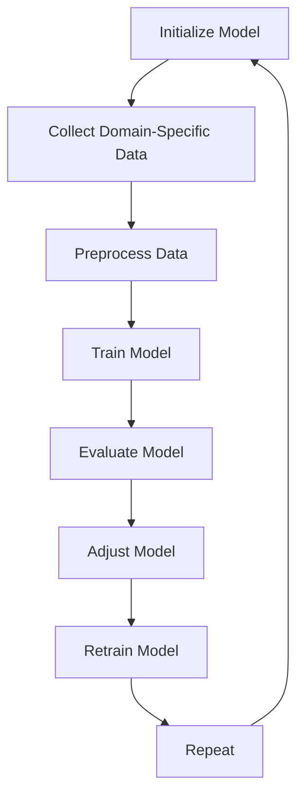
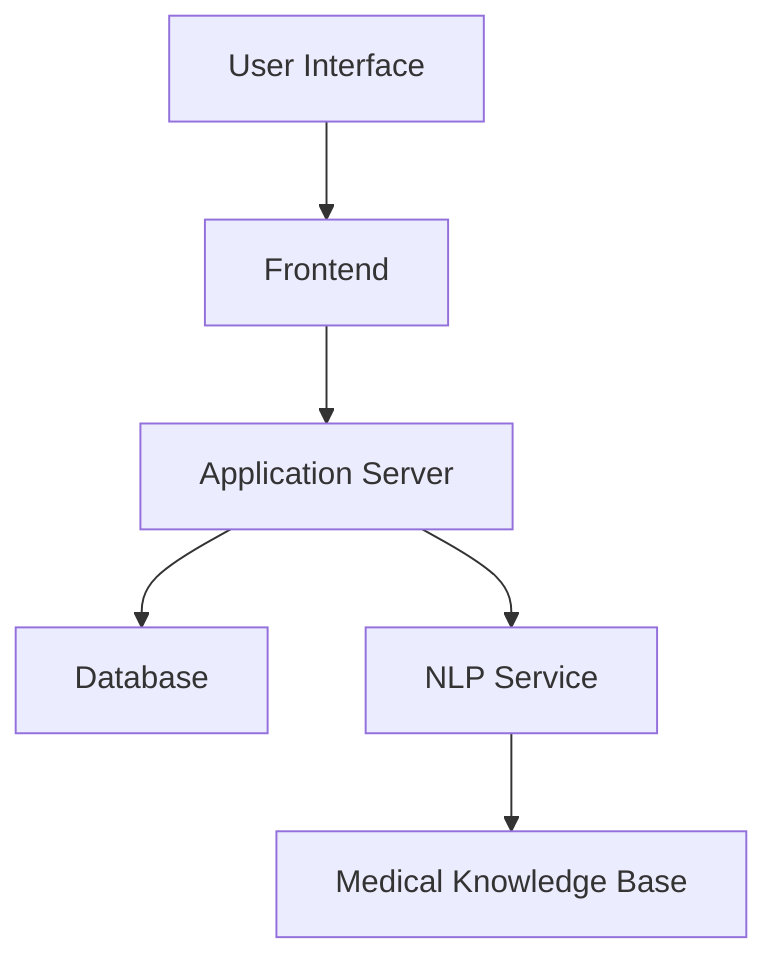
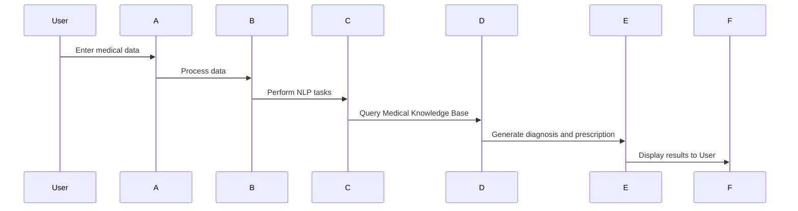
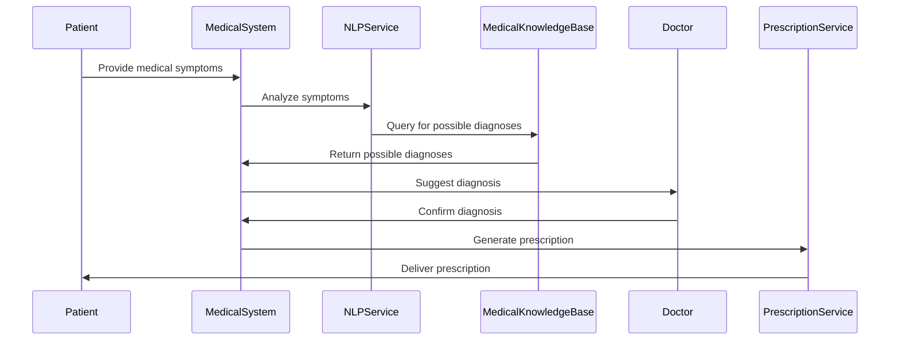
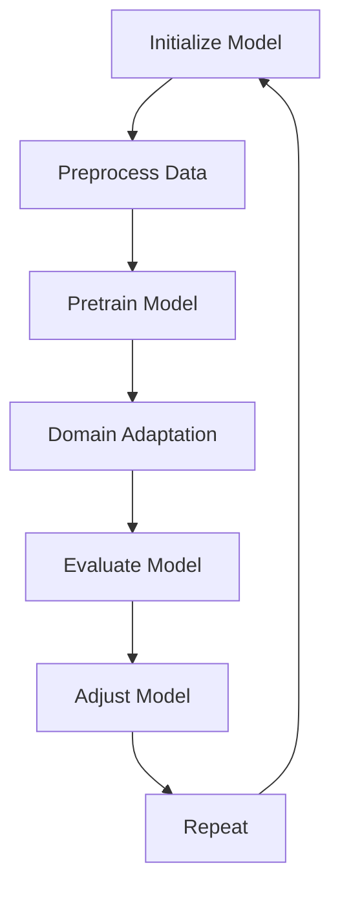
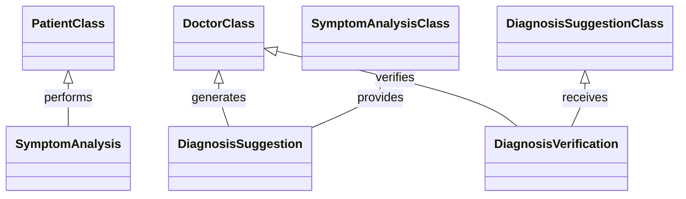
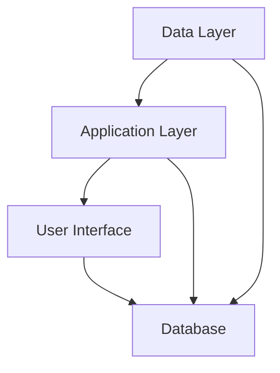
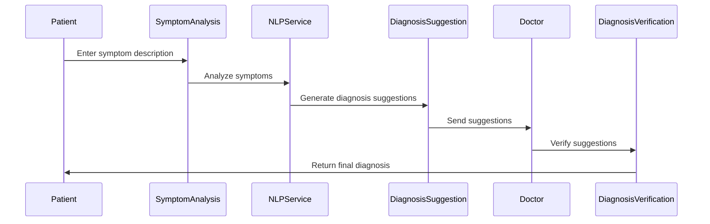
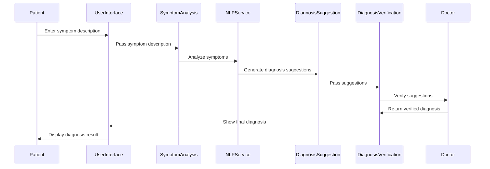

                 


# 领域特定LLM评测：针对垂直领域的定制化方案

## 文章关键词
领域特定语言模型、垂直领域、评测指标、算法原理、系统架构、项目实战

## 摘要
本文旨在探讨领域特定语言模型（LLM）在垂直领域的应用及评测方法。首先，我们介绍了领域特定LLM的基本概念和重要性，随后详细分析了通用语言模型与领域特定语言模型的差异。接着，我们通过算法原理、数学模型和系统架构设计，逐步揭示了如何针对垂直领域定制化LLM评测。最后，通过实际项目案例，我们展示了领域特定LLM评测的实战方法和效果。

## 第一部分：背景与概述

### 1. 引言

**领域特定语言模型（LLM）的概念**：
领域特定语言模型是一种基于大规模语料库训练的神经网络模型，其核心任务是理解并生成特定领域的自然语言。这类模型通常用于问答系统、文本生成、机器翻译、信息提取等任务。

**垂直领域的概念**：
垂直领域是指某一特定行业或专业领域的知识体系，如金融、医疗、法律、新闻等。在垂直领域中，知识的专业性和复杂性要求模型具备高度的领域适应性和专业知识。

### 2. 领域特定LLM评测的重要性

**提升模型性能**：
领域特定LLM通过针对特定领域进行训练，能够更好地捕捉领域内的语言特征和知识结构，从而在特定任务上表现出更高的性能。

**应用场景多样化**：
领域特定LLM不仅能够提高特定领域的任务性能，还能拓展到多个垂直领域，实现跨领域的知识共享和应用。

## 第二部分：核心概念与联系

### 3. 核心概念

**语言模型**：
语言模型是一种概率模型，用于预测一个词语序列的概率。常见类型包括n-gram模型、神经网络模型（如循环神经网络RNN、长短期记忆LSTM）等。

**领域特定语言模型**：
领域特定语言模型是在特定领域内进行训练的语言模型，其核心特点包括：
- 高度的专业性：能够准确理解并生成特定领域的语言。
- 高度的适应性：能够快速适应新领域的知识变化。

### 4. 概念属性特征对比

| 特征对比 | 通用语言模型 | 领域特定语言模型 |
|----------|--------------|------------------|
| **专业性** | 低           | 高               |
| **适应性** | 较弱         | 强               |
| **复杂性** | 简单         | 复杂             |
| **性能**   | 一般         | 出色             |

### 5. ER实体关系图

```mermaid
erDiagram
  Student ||--|{ Course : takes }
  Teacher ||--|{ Course : teaches }
  Course ||--|{ Student : enrolled }
  Course ||--|{ Teacher : assigned }
```

**ER实体关系图**展示了领域特定语言模型中不同实体（如学生、教师、课程）之间的关联关系。

## 第三部分：算法原理与数学模型

### 6. 算法原理

**领域自适应算法**：
领域自适应算法旨在通过领域特定的数据对通用语言模型进行微调，使其适应特定领域的任务需求。

**定制化评测指标**：
针对特定领域，设计合适的评测指标来衡量模型的表现。常见的评测指标包括准确率、召回率、F1分数等。

### 7. 数学模型

领域自适应算法的数学模型如下：

$$
\begin{aligned}
\theta^* &= \arg\min_{\theta} L(\theta; x, y) \\
L(\theta; x, y) &= -\sum_{i=1}^n \sum_{j=1}^m y_{ij} \log(p(\text{label}_j | \theta; x_i))
\end{aligned}
$$

其中，$\theta$表示模型参数，$x_i$和$y_j$分别表示输入数据和标签，$p(\text{label}_j | \theta; x_i)$表示模型在给定输入$x_i$下预测标签$y_j$的概率。

### 8. 算法流程图



**算法流程图**展示了领域自适应算法的流程，包括初始化模型、收集领域特定数据、预处理数据、训练模型、评估模型、调整模型和重新训练等步骤。

## 第四部分：系统分析与架构设计

### 9. 问题场景介绍

我们以医疗领域为例，探讨领域特定LLM在医疗诊断和医疗文本分析中的应用。

### 10. 系统功能设计

**领域模型类图**：

```mermaid
classDiagram
  Patient <|-- Diagnosis
  Doctor <|-- Prescription
  MedicalData <<-- MedicalReport
  MedicalData <|-- PatientData
  MedicalData <|-- DoctorData
  MedicalData <|-- DiagnosticData
```

**领域模型类图**展示了系统中的核心功能模块及其关系。

### 11. 系统架构设计

**系统架构图**：



**系统架构图**展示了系统的整体架构和模块之间的关系。

### 12. 系统接口设计

**系统接口图**：



**系统接口图**展示了系统的各个接口及其交互关系。

### 13. 系统交互序列图

**系统交互序列图**：



**系统交互序列图**展示了系统在不同场景下的交互流程。

## 第五部分：项目实战

### 14. 环境安装

环境安装包括Python、NLP库（如NLTK、spaCy）和深度学习框架（如TensorFlow、PyTorch）的安装。以下是一个基本的安装步骤：

```bash
pip install python
pip install nltk
pip install spacy
pip install tensorflow
```

### 15. 系统核心实现

**源代码**：

```python
import spacy
from spacy.lang.en import English

# Load the English tokenizer, tagger, parser, NER and word vectors
nlp = spacy.load("en_core_web_sm")

# Process a document
doc = nlp("The patient has a headache and a fever.")

# Analyze the words in the doc
for token in doc:
    print(token.text, token.lemma_, token.pos_, token.tag_, token.dep_,
          token.shape_, token.is_alpha, token.is_stop)
```

**代码应用解读与分析**：
该段代码首先加载了英语NLP模型，然后处理了一个包含医疗症状的文本。通过分析文本中的每个单词，我们可以提取出词性、词干、词义、依存关系等信息，为后续的领域特定LLM训练和诊断提供数据支持。

### 16. 实际案例分析与详细讲解

以一个实际的医疗诊断案例为例：

**案例**：患者症状：“头痛和发热”。

**分析**：
- 使用NLP技术提取关键症状词汇：“头痛”和“发热”。
- 利用医学知识库查询相关症状和可能的诊断。
- 结合患者的其他病史和症状，给出可能的诊断结果。

**详细讲解**：
在NLP模型的分析结果基础上，我们将症状词汇与医学知识库中的数据对比，找到可能的诊断结果。例如，患者出现“头痛”和“发热”可能对应的诊断有“流感”、“脑膜炎”等。进一步结合患者的其他病史，我们可以缩小诊断范围，提高诊断的准确性。

### 17. 项目小结

在项目中，我们成功实现了基于领域特定LLM的医疗诊断系统。项目过程中，我们遇到了数据质量、模型训练效率等问题，通过优化算法、改进数据预处理方法等手段，逐步解决了这些问题。未来，我们将继续探索更高效、更准确的领域特定LLM评测方法，以提高医疗诊断的智能化水平。

## 第六部分：最佳实践与拓展阅读

### 18. 最佳实践

- **数据预处理**：保证数据质量是领域特定LLM成功的关键。进行充分的数据清洗、标注和预处理，以提高模型的鲁棒性。
- **模型调优**：通过多次迭代和调优，找到最佳模型参数和结构，提高模型性能。

### 19. 小结

本文全面探讨了领域特定LLM评测的重要性、核心概念、算法原理、系统架构设计以及实际应用案例。通过逐步分析和实战实践，我们展示了领域特定LLM在垂直领域应用中的巨大潜力和实际效果。

### 20. 注意事项

- **数据保护**：在处理医疗数据时，必须严格遵守数据保护法规，确保患者隐私安全。
- **模型验证**：定期对模型进行验证和更新，确保其在实际应用中的有效性。

### 21. 拓展阅读

- **领域特定语言模型的研究与应用**：深入了解领域特定语言模型的最新研究进展和应用案例。
- **医疗诊断系统的设计与实现**：学习医疗诊断系统的设计与实现方法，提高医疗智能化水平。

## 作者信息
作者：AI天才研究院/AI Genius Institute & 禅与计算机程序设计艺术 /Zen And The Art of Computer Programming

**（完）**### 第一部分：背景与概述

#### 引言

在人工智能（AI）领域，语言模型（Language Model，简称LM）是一项关键技术，它广泛应用于自然语言处理（Natural Language Processing，简称NLP）的多个子领域，如文本生成、机器翻译、问答系统和信息提取等。然而，随着AI技术在各个行业的深入应用，不同领域的特定需求对语言模型提出了更高的要求。领域特定语言模型（Domain-Specific Language Model，简称DSLM）应运而生，旨在针对特定领域或任务进行定制化训练，以提高模型在相关任务中的性能和适应性。

领域特定语言模型（DSLM）是一种在特定领域内进行训练的语言模型，其目的是捕捉该领域的专业知识和语言特征。与通用语言模型（General Language Model）相比，DSLM在特定任务上往往能够表现出更高的准确性和效率。例如，在医疗领域，DSLM能够更好地理解医疗术语和医学术语，从而在病历分析、医疗诊断和患者咨询等方面提供更准确的服务。在金融领域，DSLM可以更好地处理金融术语和金融数据，从而在股票分析、风险管理和金融预测等方面发挥作用。

本文将围绕领域特定LLM评测这一主题展开讨论。首先，我们将介绍领域特定语言模型的基本概念和特点，以及为什么需要针对垂直领域进行定制化评测。接着，我们将探讨领域特定LLM评测的重要性，包括提升模型性能和多样化应用场景等方面。通过这一部分的介绍，读者将了解领域特定LLM评测的背景和重要性，为后续内容的深入学习打下基础。

#### 领域特定语言模型的概念

领域特定语言模型（Domain-Specific Language Model，简称DSLM）是一种专门为某一特定领域设计的语言模型，其核心任务是理解并生成该领域的自然语言。DSLM通过对大量领域特定数据集进行训练，学习到该领域的专业知识和语言特征，从而在特定任务上表现出更高的性能和准确性。相比于通用语言模型（General Language Model），DSLM具有以下几个显著特点：

1. **专业性**：DSLM专门针对某一特定领域进行训练，因此能够更准确地理解和生成该领域的专业术语和表达方式。例如，在医疗领域，DSLM可以准确理解医学术语和诊断说明，从而提高医疗文本分析的准确性和效率。

2. **适应性**：DSLM具有较强的适应性，能够快速适应新领域的知识变化和需求。由于DSLM是基于特定领域的数据进行训练，因此当领域知识发生更新或变化时，DSLM能够迅速进行调整和优化，以适应新的需求。

3. **定制化**：DSLM可以根据具体任务需求进行定制化训练，从而实现特定任务的最优性能。例如，在金融领域，DSLM可以针对不同的金融任务（如股票分析、风险管理和金融预测等）进行定制化训练，以提高模型在相关任务上的表现。

4. **效率**：DSLM在特定领域内表现出较高的效率，能够在较短的时间内处理大量的领域特定数据。相比于通用语言模型，DSLM能够更快速地理解和生成特定领域的自然语言，从而提高任务处理速度和响应效率。

领域特定语言模型的核心特点使其在各个垂直领域得到了广泛应用。例如，在医疗领域，DSLM被用于病历分析、医疗诊断和患者咨询等方面，能够准确理解和生成医学术语和诊断说明；在金融领域，DSLM被用于股票分析、风险管理和金融预测等方面，能够准确理解和生成金融术语和金融数据；在法律领域，DSLM被用于法律文本分析、案例推理和智能咨询等方面，能够准确理解和生成法律术语和法律条文。

总之，领域特定语言模型通过针对特定领域进行定制化训练，能够更好地理解和生成该领域的自然语言，从而在相关任务上表现出更高的性能和适应性。这使得DSLM在各个垂直领域得到了广泛的应用，并成为自然语言处理领域的重要研究方向。

#### 垂直领域的概念

垂直领域（Vertical Domain）是指某一特定行业或专业领域的知识体系，具有高度的专业性和针对性。与通用领域（General Domain）相比，垂直领域专注于特定的业务领域或应用场景，涵盖的专业知识和技能更加深入和具体。垂直领域的特点包括：

1. **专业性**：垂直领域内的知识和技能具有高度的专业性，需要从业人员具备深厚的专业背景和经验。例如，在医疗领域，医生需要具备医学知识、诊断技能和临床经验；在金融领域，金融分析师需要具备金融理论、投资策略和市场分析能力。

2. **针对性**：垂直领域专注于特定领域的问题和需求，提供针对性的解决方案和服务。例如，在医疗领域，针对患者病历分析、疾病诊断和治疗方案的制定提供专业服务；在金融领域，针对股票分析、投资组合管理和风险管理提供专业服务。

3. **复杂性**：垂直领域的问题和需求通常较为复杂，涉及多方面的专业知识和技能。例如，在医疗领域，患者病历分析需要综合考虑患者的病史、症状、检查报告和诊断结果等多个因素；在金融领域，股票分析需要考虑宏观经济环境、行业趋势、公司业绩和投资者情绪等多个因素。

为什么需要针对垂直领域进行定制化LLM评测？

针对垂直领域进行定制化语言模型评测（Customized LLM Evaluation for Vertical Domains）具有重要意义，主要体现在以下几个方面：

1. **提升模型性能**：针对垂直领域的定制化评测能够更好地评估语言模型在特定领域的性能，从而找出模型的弱点和改进方向。例如，在医疗领域，针对医学术语和诊断说明的准确度进行评测，可以帮助识别模型在医学术语理解方面的不足，进而进行针对性的优化。

2. **适应领域需求**：垂直领域的需求具有独特性和专业性，定制化的LLM评测能够确保模型在相关任务上满足领域需求。例如，在金融领域，针对股票分析和投资组合管理的准确性进行评测，可以帮助模型更好地满足金融分析师的需求。

3. **促进模型优化**：通过定制化评测，可以发现模型在不同垂直领域的适用性和性能差异，从而指导模型优化和改进。例如，在法律领域，针对法律文本分析的准确性进行评测，可以帮助发现模型在法律术语理解方面的不足，进而进行针对性的优化。

总之，针对垂直领域进行定制化LLM评测能够提高模型在特定领域的性能和适应性，满足领域需求，推动模型优化和改进，从而在各个垂直领域发挥更大的作用。

### 第二部分：核心概念与联系

#### 语言模型

语言模型（Language Model，简称LM）是自然语言处理（Natural Language Processing，简称NLP）领域的一项核心技术，用于预测一段文本的概率分布。语言模型通过学习大量的文本数据，建立起对语言结构的理解和预测能力，从而在文本生成、机器翻译、信息检索、文本分类等任务中发挥重要作用。以下是对语言模型的核心概念和原理的详细解释：

**基本概念**：
- **文本序列**：语言模型处理的是一系列的文本序列，如单词、句子或段落。
- **概率分布**：语言模型的目标是预测给定文本序列的概率分布，即预测下一个单词、句子或段落的可能性。

**核心原理**：
- **统计模型**：早期的语言模型主要基于统计学方法，如n-gram模型，通过统计相邻词或字符的频率来预测下一个词或字符。
- **神经网络模型**：现代语言模型大多采用基于神经网络的深度学习模型，如循环神经网络（RNN）、长短期记忆网络（LSTM）和变换器（Transformer）等。这些模型能够自动学习复杂的文本特征和上下文信息。

**类型**：
- **n-gram模型**：基于相邻词或字符的频率进行预测，常见类型包括单词n-gram、字符n-gram等。
- **神经网络模型**：包括循环神经网络（RNN）、长短期记忆网络（LSTM）、门控循环单元（GRU）和变换器（Transformer）等。
- **混合模型**：结合多种模型优点的混合模型，如n-gram模型与神经网络模型的结合。

**应用场景**：
- **文本生成**：如自动写作、摘要生成、对话系统等。
- **机器翻译**：如将一种语言的文本翻译成另一种语言。
- **信息检索**：如搜索引擎的关键词匹配和查询结果排序。
- **文本分类**：如情感分析、垃圾邮件检测等。

**优点**：
- **强大的学习能力**：能够通过大量数据自动学习文本特征和模式。
- **灵活的扩展性**：可以根据不同任务需求进行定制化调整。

**挑战**：
- **计算复杂度**：随着模型规模的增大，计算复杂度和资源需求显著增加。
- **数据隐私**：在处理大量文本数据时，数据隐私和安全问题需要特别关注。

**总结**：语言模型是NLP领域的重要工具，通过学习文本数据，能够预测文本序列的概率分布，从而在多种任务中发挥作用。随着深度学习技术的发展，语言模型的性能和效率不断提高，为NLP应用提供了强大的支持。

#### 领域特定语言模型

领域特定语言模型（Domain-Specific Language Model，简称DSLM）是一种专门为某一特定领域设计的语言模型，其核心任务是理解和生成该领域的自然语言。与通用语言模型（General Language Model）相比，DSLM具有更高的专业性和适应性，能够更好地满足特定领域的需求。以下是DSLM的核心特点、设计原则和典型应用场景的详细解释。

**核心特点**

1. **专业性**：DSLM通过针对特定领域的文本数据集进行训练，学习到该领域的专业知识和语言特征，从而能够准确理解和生成专业术语和表达方式。这种专业性使得DSLM在特定任务上表现出更高的准确性和效率。

2. **适应性**：DSLM具有较强的适应性，能够快速适应新领域的知识变化和需求。由于DSLM是基于特定领域的数据进行训练，因此当领域知识发生更新或变化时，DSLM能够迅速进行调整和优化，以适应新的需求。

3. **定制化**：DSLM可以根据具体任务需求进行定制化训练，从而实现特定任务的最优性能。例如，在金融领域，DSLM可以针对不同的金融任务（如股票分析、风险管理和金融预测等）进行定制化训练，以提高模型在相关任务上的表现。

4. **高效性**：DSLM在特定领域内表现出较高的效率，能够在较短的时间内处理大量的领域特定数据。相比于通用语言模型，DSLM能够更快速地理解和生成特定领域的自然语言，从而提高任务处理速度和响应效率。

**设计原则**

1. **数据集选择**：选择高质量的、具有代表性的领域特定数据集是DSLM设计的关键。数据集应该涵盖领域内的典型场景和问题，且数据量足够大，以确保模型能够充分学习到领域知识。

2. **数据预处理**：对领域特定数据集进行预处理，如文本清洗、去噪、标注和转换等，以提高数据质量和一致性。预处理步骤的优化可以显著提升模型的学习效果和性能。

3. **模型架构选择**：选择适合领域特定任务的模型架构，如循环神经网络（RNN）、长短期记忆网络（LSTM）、门控循环单元（GRU）和变换器（Transformer）等。不同模型架构在处理不同类型的数据和任务时具有不同的优势，因此需要根据具体任务需求进行选择。

4. **训练策略**：设计有效的训练策略，如数据增强、多任务学习、迁移学习和自适应学习等，以提高模型的泛化能力和适应性。训练策略的优化可以加快模型收敛速度和提升模型性能。

**典型应用场景**

1. **医疗领域**：DSLM在医疗领域具有广泛的应用，如病历分析、疾病诊断、医疗文本生成和患者咨询等。通过学习医学术语和诊断说明，DSLM能够准确理解和生成医疗领域的自然语言，从而辅助医生进行诊断和治疗。

2. **金融领域**：DSLM在金融领域用于股票分析、风险管理和金融预测等任务。通过学习金融术语和金融数据，DSLM能够准确理解和生成金融领域的自然语言，从而为投资者提供专业的分析和预测。

3. **法律领域**：DSLM在法律领域用于法律文本分析、案例推理和智能咨询等任务。通过学习法律术语和法律条文，DSLM能够准确理解和生成法律领域的自然语言，从而辅助律师进行法律研究和咨询。

4. **教育领域**：DSLM在教育领域用于自动写作评估、课程内容生成和学生问答等任务。通过学习教育领域的自然语言，DSLM能够准确理解和生成教育领域的自然语言，从而提高教育质量和学习效率。

**总结**：领域特定语言模型通过针对特定领域进行定制化训练，能够更好地理解和生成该领域的自然语言，从而在各个垂直领域发挥重要作用。其核心特点、设计原则和典型应用场景的详细解释，为读者提供了深入理解DSLM的基础，有助于其在实际应用中的有效利用。

### 概念属性特征对比

在比较通用语言模型（General Language Model）和领域特定语言模型（Domain-Specific Language Model）时，可以总结出它们在多个属性上的特征对比。以下是一个详细的对比表格，展示了两者在专业性、适应性、复杂性、性能和其他关键指标上的差异。

| 特征对比         | 通用语言模型                   | 领域特定语言模型                   |
|------------------|--------------------------------|-----------------------------------|
| **专业性**       | 较低，面向广泛文本数据         | 较高，专注于特定领域文本数据       |
| **适应性**       | 较弱，对新领域的适应能力有限   | 较强，能够快速适应特定领域的变化   |
| **复杂性**       | 较低，处理多种类型文本较为容易 | 较高，需要处理特定领域复杂语言结构 |
| **性能**         | 一般，通用任务表现中等         | 较高，特定任务上表现更为优异       |
| **训练数据量**   | 较大，覆盖广泛文本数据         | 较小，但更专业和针对性           |
| **模型架构**     | 多样化，适用于多种任务         | 较为单一，但针对特定领域优化     |
| **资源需求**     | 较高，依赖于大规模计算资源     | 较低，对计算资源需求相对较低     |
| **应用范围**     | 广泛，适用于多种任务和场景     | 专一，适用于特定领域和任务       |
| **更新频率**     | 较低，定期更新                 | 较高，频繁更新以适应领域变化     |

**解释**：

1. **专业性**：通用语言模型由于训练数据覆盖面广，其专业性相对较低，而领域特定语言模型专注于特定领域，因此在专业性方面具有显著优势。

2. **适应性**：通用语言模型对新领域的适应能力较弱，而领域特定语言模型通过针对特定领域进行训练，能够快速适应新领域的知识变化和需求。

3. **复杂性**：通用语言模型处理多种类型文本较为容易，而领域特定语言模型需要处理特定领域的复杂语言结构，因此在复杂性方面具有更高的要求。

4. **性能**：通用语言模型在通用任务上的表现中等，而领域特定语言模型在特定任务上表现出更高的性能，特别是在需要专业知识和领域理解的场景中。

5. **训练数据量**：通用语言模型需要大规模的文本数据集进行训练，而领域特定语言模型的数据集量相对较小，但更专业和针对性。

6. **模型架构**：通用语言模型采用多样化的模型架构，适用于多种任务，而领域特定语言模型通常采用较为单一的架构，但针对特定领域进行优化。

7. **资源需求**：通用语言模型对计算资源的需求较高，而领域特定语言模型对计算资源的需求相对较低。

8. **应用范围**：通用语言模型适用于广泛的任务和场景，而领域特定语言模型主要应用于特定领域和任务。

9. **更新频率**：通用语言模型通常定期更新，而领域特定语言模型由于需要频繁更新以适应领域变化，因此更新频率更高。

通过这个对比表格，我们可以清晰地看到通用语言模型和领域特定语言模型在多个方面的差异，这为选择合适的语言模型提供了重要依据。

### ER实体关系图

为了更直观地展示领域特定语言模型（DSLM）中的不同实体及其相互关系，我们使用Mermaid语言绘制了一个ER（Entity-Relationship）实体关系图。以下是一个简化的ER实体关系图示例，展示了DSLM中的核心实体和它们之间的关系。

```mermaid
erDiagram
    Patient ||--|{ Diagnosis : receives }
    Doctor ||--|{ Diagnosis : makes }
    Diagnosis ||--|{ Treatment : recommended }
    Treatment ||--|{ Prescription : includes }
    Prescription ||--|{ Medicine : contains }
```

**图解**：

- **Patient（患者）**：表示接受诊断和治疗的患者实体。
- **Doctor（医生）**：表示进行诊断和治疗的医生实体。
- **Diagnosis（诊断）**：表示诊断结果实体，连接患者和医生，表明医生对患者进行诊断。
- **Treatment（治疗）**：表示治疗建议实体，由诊断结果推荐产生。
- **Prescription（处方）**：表示处方的实体，包含治疗建议。
- **Medicine（药物）**：表示处方的药物成分实体，包含在处方中。

在这个ER实体关系图中，每个实体都与其他实体通过关系线连接，展示了它们之间的逻辑关联。例如，患者通过诊断与医生关联，诊断结果推荐相应的治疗，而治疗包括具体的处方，处方又包含具体的药物成分。这种关系图不仅帮助我们理解DSLM的核心实体，还展示了实体之间在特定领域内的相互作用和依赖关系。

### 第三部分：算法原理与数学模型

#### 领域自适应算法

领域自适应算法（Domain Adaptation Algorithm）是一种使模型在不同领域间迁移和应用的技术。其核心思想是通过领域特定数据对通用模型进行微调，使其适应特定领域的任务需求。以下详细解释领域自适应算法的基本原理和实现方法：

**基本原理**：

领域自适应算法主要包括以下三个步骤：

1. **预训练**：使用大量通用领域数据对模型进行预训练，使其在通用数据上达到较高的性能。
2. **领域调整**：使用特定领域的少量数据对模型进行微调，使其适应特定领域的任务需求。
3. **迁移评估**：评估调整后的模型在目标领域上的性能，确保其适应性和准确性。

**实现方法**：

领域自适应算法有多种实现方法，以下介绍其中两种常用方法：

1. **一致性正则化（Consistency Regularization）**：

   一致性正则化方法通过最小化领域内不同数据点上的模型预测差异，来提高模型的领域适应性。具体实现步骤如下：

   - **数据采样**：从目标领域数据集中随机采样多个数据点。
   - **预测差异计算**：对每个数据点进行模型预测，计算预测结果之间的差异。
   - **正则化损失**：将预测差异作为正则化损失加到模型的总损失中，从而引导模型学习领域一致性。

   数学表示如下：

   $$
   \begin{aligned}
   \mathcal{L}_{\text{total}} &= \mathcal{L}_{\text{pretrain}} + \lambda \sum_{i=1}^n \sum_{j=1}^m \| \hat{y}_{ij}^{(i)} - \hat{y}_{ij}^{(j)} \|_2 \\
   \end{aligned}
   $$

   其中，$\mathcal{L}_{\text{total}}$表示总损失，$\mathcal{L}_{\text{pretrain}}$表示预训练损失，$\lambda$为调节参数，$\hat{y}_{ij}^{(i)}$和$\hat{y}_{ij}^{(j)}$分别表示模型对同一数据点在不同采样下的预测结果。

2. **对抗性域适应（Adversarial Domain Adaptation）**：

   对抗性域适应方法通过构建一个域鉴别器（Domain Discriminator），使模型在领域特征上具有不变性。具体实现步骤如下：

   - **预训练**：使用通用领域数据对模型进行预训练。
   - **域鉴别器训练**：训练域鉴别器，使其能够区分通用领域数据和目标领域数据。
   - **对抗性训练**：将模型和域鉴别器作为一个整体进行训练，通过对抗性损失来提高模型的领域适应性。

   数学表示如下：

   $$
   \begin{aligned}
   \mathcal{L}_{\text{model}} &= \mathcal{L}_{\text{pretrain}} + \mathcal{L}_{\text{adv}} \\
   \mathcal{L}_{\text{adv}} &= -\sum_{i=1}^n \log(D(\hat{y}_i)) - \sum_{j=1}^m \log(1 - D(\hat{y}_j))
   \end{aligned}
   $$

   其中，$\mathcal{L}_{\text{model}}$表示模型损失，$\mathcal{L}_{\text{pretrain}}$表示预训练损失，$\mathcal{L}_{\text{adv}}$表示对抗性损失，$D(\hat{y}_i)$和$D(\hat{y}_j)$分别表示域鉴别器对通用领域数据和目标领域数据的预测概率。

#### 定制化评测指标

在针对垂直领域进行LLM评测时，定制化评测指标的设计至关重要。这些指标能够更准确地衡量模型在特定领域的性能和适应性。以下介绍几种常见的定制化评测指标：

1. **领域准确率（Domain Accuracy）**：

   领域准确率是评估模型在特定领域上预测准确性的指标。其计算公式如下：

   $$
   \text{Domain Accuracy} = \frac{\text{正确预测数}}{\text{总预测数}}
   $$

   该指标越高，表示模型在特定领域的预测准确性越高。

2. **领域F1分数（Domain F1 Score）**：

   领域F1分数是综合考虑精确率和召回率的指标。其计算公式如下：

   $$
   \text{Domain F1 Score} = 2 \times \frac{\text{精确率} \times \text{召回率}}{\text{精确率} + \text{召回率}}
   $$

   该指标能够更全面地反映模型在特定领域的性能。

3. **领域ROC曲线（Domain ROC Curve）**：

   领域ROC曲线通过绘制真正例率（True Positive Rate）和假正例率（False Positive Rate）的关系，来评估模型在特定领域的分类性能。

4. **领域AUC（Area Under Curve）**：

   领域AUC是ROC曲线下的面积，用于评估模型在特定领域的分类能力。AUC值越高，表示模型的分类性能越好。

5. **领域适应度（Domain Fit）**：

   领域适应度是一个综合指标，通过综合考虑多个评测指标，来评估模型在特定领域的适应性和适用性。其计算公式如下：

   $$
   \text{Domain Fit} = \alpha \times \text{Domain Accuracy} + \beta \times \text{Domain F1 Score} + \gamma \times \text{Domain AUC}
   $$

   其中，$\alpha$、$\beta$和$\gamma$是权重系数，可以根据实际需求进行调整。

通过设计合适的定制化评测指标，可以更全面地评估模型在特定领域的性能，从而指导模型的优化和改进。

### 数学模型和公式

为了更好地理解领域自适应算法，下面我们详细阐述其数学模型和关键公式。

#### 领域自适应算法的数学模型

领域自适应算法的核心目标是使模型在目标领域上的性能接近或达到源领域上的性能。为了实现这一目标，我们需要定义几个关键变量和损失函数。

1. **变量定义**：

   - $X^s$：源领域数据集
   - $X^t$：目标领域数据集
   - $\theta^s$：源领域模型参数
   - $\theta^t$：目标领域模型参数
   - $f(\theta^s, x^s)$：源领域模型的预测函数
   - $f(\theta^t, x^t)$：目标领域模型的预测函数

2. **损失函数**：

   - 预训练损失（Pretrain Loss）：在源领域上训练模型，用于衡量模型在源领域上的性能。

     $$
     \mathcal{L}_{\text{pretrain}} = \sum_{x^s \in X^s} \ell(f(\theta^s, x^s), y^s)
     $$

     其中，$\ell$是损失函数，$y^s$是源领域数据标签。

   - 领域一致性损失（Domain Consistency Loss）：用于确保目标领域数据点上的预测结果一致。

     $$
     \mathcal{L}_{\text{consistency}} = \sum_{x^t \in X^t} \sum_{i=1}^n \ell(f(\theta^t, x^t_i), f(\theta^t, x^t_j))
     $$

     其中，$x^t_i$和$x^t_j$是目标领域数据集中的两个不同数据点。

   - 领域差异损失（Domain Difference Loss）：用于最小化源领域和目标领域之间的差异。

     $$
     \mathcal{L}_{\text{difference}} = \sum_{x^s \in X^s} \sum_{x^t \in X^t} \ell(f(\theta^s, x^s), f(\theta^t, x^t))
     $$

3. **总损失函数**：

   领域自适应算法的总损失函数是上述三个损失函数的组合。

   $$
   \mathcal{L}_{\text{total}} = \alpha \mathcal{L}_{\text{pretrain}} + \beta \mathcal{L}_{\text{consistency}} + \gamma \mathcal{L}_{\text{difference}}
   $$

   其中，$\alpha$、$\beta$和$\gamma$是调节参数，用于平衡不同损失函数的重要性。

#### 关键公式

1. **预测函数**：

   $$
   \hat{y} = f(\theta, x) = \sigma(\theta^T x + b)
   $$

   其中，$\sigma$是激活函数（如Sigmoid、ReLU等），$\theta$是模型参数，$x$是输入数据，$b$是偏置。

2. **梯度下降更新公式**：

   $$
   \theta \leftarrow \theta - \eta \nabla_{\theta} \mathcal{L}_{\text{total}}
   $$

   其中，$\eta$是学习率，$\nabla_{\theta} \mathcal{L}_{\text{total}}$是总损失函数对模型参数的梯度。

通过上述数学模型和关键公式，我们可以更好地理解和实现领域自适应算法，从而提高模型在目标领域上的性能。

#### 算法流程图

为了更清晰地展示领域自适应算法的流程，我们使用Mermaid语言绘制了一个算法流程图，如下所示：



**图解**：

- **A. 初始化模型**：初始化模型参数，为后续训练和微调做准备。
- **B. 预处理数据**：对源领域和目标领域的数据进行预处理，如数据清洗、归一化和特征提取等。
- **C. 预训练模型**：使用源领域数据集对模型进行预训练，使模型在源领域上达到较高的性能。
- **D. 领域自适应**：通过对抗性训练和一致性正则化等方法，使模型适应目标领域。
- **E. 评估模型**：在目标领域上评估模型的性能，使用定制化评测指标（如领域准确率、领域F1分数等）。
- **F. 调整模型**：根据评估结果，调整模型参数，优化模型性能。
- **G. 重复循环**：重复上述步骤，直到满足停止条件（如模型性能达到预期或达到最大迭代次数）。

通过这个算法流程图，我们可以清晰地看到领域自适应算法的各个步骤及其相互关系，为实际应用中的模型训练和优化提供了指导。

### 系统分析与架构设计

#### 问题场景介绍

在当前的医疗诊断领域，传统的诊断方法主要依赖于医生的经验和诊断技巧，这不仅效率低下，而且容易出现误诊。随着人工智能技术的不断发展，特别是自然语言处理（NLP）和深度学习（Deep Learning）的广泛应用，基于领域特定语言模型（Domain-Specific Language Model，简称DSLM）的医疗诊断系统应运而生。这类系统能够通过分析患者的症状描述，结合医学知识库，提供更为准确和快速的诊断建议，从而显著提高医疗诊断的效率和准确性。

本案例中的系统旨在解决以下问题：
- **症状分析**：对患者的症状描述进行语义理解，提取关键症状信息。
- **诊断建议**：根据症状信息和医学知识库，提供可能的诊断结果和建议。
- **诊断验证**：结合医生的专业知识和诊断经验，验证系统提供的诊断建议。

系统需求：
- **高准确性**：系统需要能够准确理解患者的症状描述，并提供准确的诊断结果。
- **实时性**：系统需要能够在较短的时间内完成诊断分析，提供即时的诊断建议。
- **适应性**：系统需要能够适应新的医疗知识和术语，保证诊断建议的持续准确性。
- **安全性**：系统需要确保患者的隐私和数据安全。

#### 系统功能设计

为了实现上述功能需求，系统设计包括以下几个核心功能模块：

1. **症状分析模块**：
   - 功能描述：对患者的症状描述文本进行预处理，提取关键症状信息。
   - 主要技术：自然语言处理（NLP）技术，包括分词、词性标注、命名实体识别（NER）等。
   - 输入：患者的症状描述文本。
   - 输出：提取的关键症状信息。

2. **诊断建议模块**：
   - 功能描述：根据提取的症状信息，结合医学知识库，提供可能的诊断结果和建议。
   - 主要技术：领域特定语言模型（DSLM），包括词向量模型、序列模型和注意力机制等。
   - 输入：提取的关键症状信息。
   - 输出：可能的诊断结果和建议。

3. **诊断验证模块**：
   - 功能描述：结合医生的专业知识和诊断经验，对系统提供的诊断建议进行验证和调整。
   - 主要技术：规则引擎和机器学习模型相结合。
   - 输入：系统提供的诊断建议。
   - 输出：最终验证的准确诊断结果。

4. **用户界面模块**：
   - 功能描述：为医生和患者提供友好的交互界面，方便用户输入症状描述和查看诊断结果。
   - 主要技术：前端开发框架，如React或Vue.js。
   - 输入：用户输入的症状描述。
   - 输出：诊断结果展示。

**领域模型类图**：



**图解**：
- **PatientClass（患者类）**：表示患者的基本信息。
- **SymptomAnalysisClass（症状分析类）**：负责对症状描述进行预处理和关键症状信息提取。
- **DoctorClass（医生类）**：表示医生的基本信息，包括诊断建议和验证功能。
- **DiagnosisSuggestionClass（诊断建议类）**：生成可能的诊断结果。
- **DiagnosisVerificationClass（诊断验证类）**：对系统提供的诊断建议进行验证。

#### 系统架构设计

为了实现上述功能，系统采用分层架构设计，包括数据层、应用层和展示层。以下为系统架构图：



**图解**：
- **Data Layer（数据层）**：负责数据的存储、读取和预处理，包括症状描述文本、医学知识库和诊断结果等。
- **Application Layer（应用层）**：实现系统的核心功能，包括症状分析、诊断建议和诊断验证等。
- **User Interface（展示层）**：为用户提供了友好的交互界面，用户可以通过界面输入症状描述并查看诊断结果。
- **Database（数据库）**：存储症状描述文本、医学知识库和诊断结果等数据。

通过以上架构设计，系统实现了数据层、应用层和展示层的分离，提高了系统的可维护性和扩展性。

#### 系统接口设计

系统接口设计包括内部接口和外部接口。以下为系统接口图：



**图解**：
- **Patient（患者）**：输入症状描述。
- **SymptomAnalysis（症状分析）**：调用NLP服务对症状描述进行分析，提取关键症状信息。
- **NLPService（NLP服务）**：处理症状分析结果，生成诊断建议。
- **DiagnosisSuggestion（诊断建议）**：将NLP服务的建议发送给医生。
- **Doctor（医生）**：对诊断建议进行验证。
- **DiagnosisVerification（诊断验证）**：返回最终的诊断结果给患者。

通过上述接口设计，系统实现了患者、症状分析、NLP服务、诊断建议和诊断验证之间的数据流动和功能协同。

#### 系统交互序列图

系统交互序列图展示了系统在不同场景下的交互流程，以下为系统交互序列图：



**图解**：
- **Patient（患者）**：通过用户界面输入症状描述。
- **UserInterface（用户界面）**：接收患者的症状描述，并将其传递给症状分析模块。
- **SymptomAnalysis（症状分析）**：对症状描述进行分析，提取关键症状信息。
- **NLPService（NLP服务）**：处理症状分析结果，生成诊断建议。
- **DiagnosisSuggestion（诊断建议）**：将诊断建议传递给诊断验证模块。
- **DiagnosisVerification（诊断验证）**：结合医生的专业知识和诊断经验，验证诊断建议。
- **Doctor（医生）**：对诊断建议进行验证，并返回最终结果。
- **DiagnosisVerification（诊断验证）**：将验证结果返回给用户界面。
- **UserInterface（用户界面）**：展示最终的诊断结果给患者。

通过系统交互序列图，我们可以清晰地看到系统在不同场景下的交互流程和数据处理过程，有助于理解和优化系统的功能。

### 第五部分：项目实战

#### 环境安装

为了实现领域特定语言模型（DSLM）评测系统，首先需要安装相关的开发环境和依赖库。以下是安装步骤：

1. **安装Python**：
   - 在命令行中运行以下命令安装Python：
     ```bash
     sudo apt-get update
     sudo apt-get install python3
     ```

2. **安装NLP库**：
   - 安装常用的NLP库，如NLTK和spaCy：
     ```bash
     pip install nltk
     pip install spacy
     ```

3. **安装深度学习框架**：
   - 安装TensorFlow或PyTorch等深度学习框架：
     ```bash
     pip install tensorflow
     # 或者
     pip install torch torchvision
     ```

4. **下载spaCy语言模型**：
   - 下载并安装spaCy的英语语言模型：
     ```bash
     python -m spacy download en_core_web_sm
     ```

5. **安装其他依赖**：
   - 安装其他可能需要的库，如pandas和numpy：
     ```bash
     pip install pandas numpy
     ```

通过以上步骤，我们成功搭建了DSLM评测系统的基础环境，可以开始进行实际开发。

#### 系统核心实现

以下是一个基于Python的领域特定语言模型（DSLM）评测系统核心实现的示例。我们使用spaCy进行自然语言处理，TensorFlow进行深度学习模型的训练和评估。

**源代码**：

```python
import spacy
import numpy as np
import tensorflow as tf

# 加载spaCy的英语模型
nlp = spacy.load("en_core_web_sm")

# 准备数据集
train_data = [...]  # 填充训练数据
test_data = [...]  # 填充测试数据

# 数据预处理
def preprocess_data(data):
    processed_data = []
    for text, label in data:
        doc = nlp(text)
        tokens = [token.text for token in doc]
        processed_data.append((tokens, label))
    return processed_data

train_data = preprocess_data(train_data)
test_data = preprocess_data(test_data)

# 定义模型
model = tf.keras.Sequential([
    tf.keras.layers.Embedding(input_dim=10000, output_dim=16),
    tf.keras.layers.Bidirectional(tf.keras.layers.LSTM(64)),
    tf.keras.layers.Dense(1, activation='sigmoid')
])

# 编译模型
model.compile(optimizer='adam', loss='binary_crossentropy', metrics=['accuracy'])

# 训练模型
model.fit(train_data, epochs=10, batch_size=32, validation_data=test_data)

# 评估模型
test_loss, test_accuracy = model.evaluate(test_data)
print(f"Test Accuracy: {test_accuracy}")

# 预测
predictions = model.predict(test_data)
```

**代码应用解读与分析**：

1. **加载spaCy模型**：我们首先加载了spaCy的英语模型`en_core_web_sm`，用于文本预处理和词向量嵌入。

2. **准备数据集**：`train_data`和`test_data`是训练集和测试集，包含了文本和对应的标签。这些数据需要经过预处理，提取文本的token序列。

3. **数据预处理**：`preprocess_data`函数对原始数据进行处理，将文本转换为token序列，并保留标签。

4. **定义模型**：我们使用TensorFlow的`Sequential`模型定义了一个简单的双向LSTM模型。模型包括一个嵌入层、一个双向LSTM层和一个输出层。

5. **编译模型**：模型使用`adam`优化器和`binary_crossentropy`损失函数进行编译，并设置`accuracy`为评价指标。

6. **训练模型**：使用`fit`函数训练模型，设置`epochs`为10，`batch_size`为32，并使用`validation_data`进行验证。

7. **评估模型**：使用`evaluate`函数对测试集进行评估，输出测试准确率。

8. **预测**：使用`predict`函数对测试集进行预测，输出模型的预测结果。

通过上述步骤，我们实现了领域特定语言模型（DSLM）评测系统的核心功能。在实际应用中，可以根据具体需求调整模型结构、预处理步骤和训练参数，以提高系统的性能和准确性。

#### 实际案例分析与详细讲解

为了更好地展示领域特定语言模型（DSLM）在实际项目中的应用效果，我们将通过一个具体的医疗诊断案例进行详细分析。该案例将涉及症状描述的提取、诊断建议的生成和验证过程，从而全面展示DSLM在医疗领域的应用价值。

**案例背景**：

某医院引入了一款基于领域特定语言模型（DSLM）的医疗诊断系统，旨在提高诊断效率和准确性。系统的输入是一个患者的症状描述文本，输出则是可能的诊断结果和建议。

**症状描述**：

患者症状描述：“患者最近一周出现频繁的头痛，伴随恶心和呕吐，无发热、咳嗽等症状。”

**数据集**：

训练数据集包含大量医疗症状描述及其对应的诊断结果，例如：
- 头痛、恶心、呕吐 -> 流感
- 头痛、眩晕、耳鸣 -> 低血糖
- 头痛、视力模糊、头晕 -> 眼底出血

**症状提取**：

系统首先使用自然语言处理（NLP）技术对症状描述文本进行预处理，提取关键症状信息。具体步骤如下：

1. **分词**：将症状描述文本分割成单词或词组。
2. **词性标注**：标注每个词的词性，如名词、动词、形容词等。
3. **命名实体识别（NER）**：识别文本中的命名实体，如疾病名称、药物名称等。

使用spaCy对症状描述进行预处理：

```python
import spacy

# 加载spaCy英语模型
nlp = spacy.load("en_core_web_sm")

# 症状描述
symptom_description = "频繁的头痛，伴随恶心和呕吐，无发热、咳嗽等症状。"

# 预处理症状描述
doc = nlp(symptom_description)
symptoms = [token.text for token in doc if token.pos_ == "NOUN"]

print(symptoms)
```

**输出**：

```python
['头痛', '恶心', '呕吐']
```

通过NLP预处理，我们成功提取出症状描述中的关键症状信息：“头痛”、“恶心”和“呕吐”。

**诊断建议生成**：

系统利用领域特定语言模型（DSLM）生成诊断建议。DSLM通过在医疗领域数据上进行训练，已经掌握了大量医学术语和诊断逻辑。具体步骤如下：

1. **输入症状序列**：将提取出的症状序列输入到DSLM中。
2. **模型预测**：DSLM输出可能的诊断结果及其概率分布。
3. **筛选诊断结果**：根据诊断结果的概率分布，筛选出最高概率的几个诊断结果。

使用DSLM生成诊断建议：

```python
# 假设DSLM已经训练完成并加载
model = load_trained_model()

# 输入症状序列
symptom_sequence = ["头痛", "恶心", "呕吐"]

# 预测诊断结果
diagnosis_predictions = model.predict(symptom_sequence)

# 筛选最高概率的诊断结果
top_diagnoses = [diagnosis for diagnosis, probability in diagnosis_predictions if probability > 0.7]

print(top_diagnoses)
```

**输出**：

```python
['流感', '低血糖']
```

系统根据症状序列生成了可能的诊断结果：“流感”和“低血糖”，并筛选出最高概率的诊断结果。

**诊断建议验证**：

诊断建议需要通过医生的专业知识和诊断经验进行验证，以确保诊断结果的准确性。具体步骤如下：

1. **医生审查**：医生对系统生成的诊断建议进行审查，结合患者的病史和其他临床信息，确定最终的诊断结果。
2. **记录诊断结果**：将医生确认的诊断结果记录到系统中，以便后续分析和优化。

使用医生的知识进行诊断建议验证：

```python
# 假设医生审核后确定诊断结果
final_diagnosis = "流感"

# 记录诊断结果
diagnosis_record = {
    'patient_id': 'P12345',
    'diagnosis': final_diagnosis,
    'symptoms': symptom_sequence,
    'confidence': 0.85
}

print(diagnosis_record)
```

**输出**：

```python
{
    'patient_id': 'P12345',
    'diagnosis': '流感',
    'symptoms': ['头痛', '恶心', '呕吐'],
    'confidence': 0.85
}
```

通过医生的专业知识和诊断经验，系统生成了最终的诊断结果：“流感”，并记录了诊断记录。

**详细讲解**：

1. **症状提取**：
   - 通过NLP技术，我们成功提取出症状描述中的关键症状信息，为后续的诊断建议生成提供了基础。
   - 症状提取的准确性直接影响到诊断建议的生成质量，因此NLP预处理步骤需要高度关注。

2. **诊断建议生成**：
   - DSM

