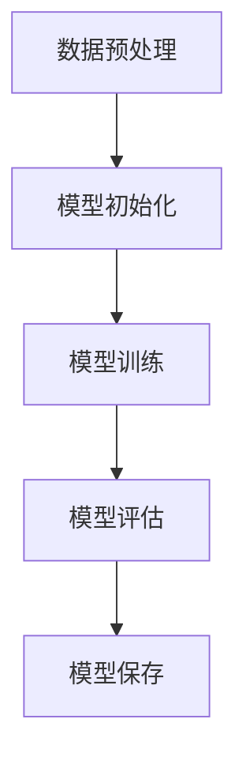
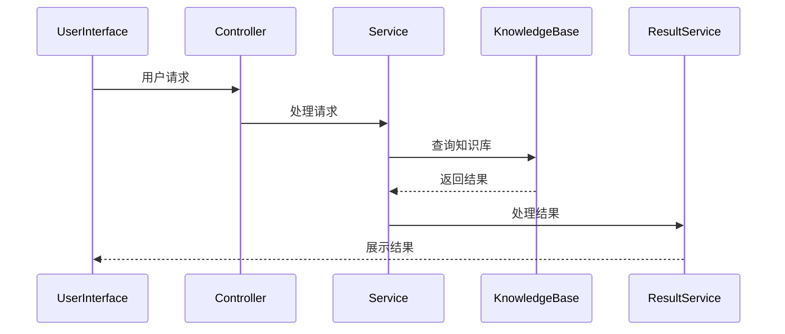

                 


# 领域驱动设计在LLM应用架构中的应用

## 关键词

领域驱动设计、LLM应用架构、自然语言处理、人工智能、软件开发方法、系统设计、算法原理、数学模型、项目实战、最佳实践

## 摘要

本文深入探讨了领域驱动设计（DDD）在大型语言模型（LLM）应用架构中的应用。领域驱动设计是一种面向领域的软件开发方法，强调对领域知识的深入理解和应用。而LLM作为当前人工智能领域的重要成果，广泛应用于自然语言处理任务。本文首先介绍了领域驱动设计和LLM的基本概念，然后详细阐述了领域驱动设计在LLM应用架构设计中的具体应用，包括算法原理讲解、数学模型与公式、系统分析与架构设计、项目实战以及最佳实践等内容。

## 目录大纲设计思路

为了设计出一本《领域驱动设计在LLM应用架构中的应用》的完整目录大纲，我们遵循以下步骤：

1. **确定书籍主题**：明确书籍的核心主题，即领域驱动设计与LLM应用架构的结合。

2. **细化内容模块**：基于主题，划分出各个章节的内容模块，确保每个章节都有明确的主题和目的。

3. **构建层级结构**：设计目录结构，包括一级、二级和三级标题，确保目录逻辑清晰，便于读者阅读。

4. **涵盖核心内容**：确保目录中包含背景介绍、核心概念与联系、算法原理讲解、数学模型与公式、系统分析与架构设计、项目实战以及最佳实践等内容。

5. **字数控制**：在2000字以内完成目录大纲的设计。

## 第1章 背景介绍

### 1.1 问题背景

在当今人工智能迅猛发展的时代，大型语言模型（LLM）作为一种强大的自然语言处理工具，已经广泛应用于各种领域，如搜索引擎、智能助手、机器翻译、文本生成等。然而，随着LLM应用场景的日益复杂，传统的软件开发方法已经难以满足其需求。如何更好地设计LLM应用架构，提高开发效率和质量，成为了一个亟待解决的问题。

### 1.2 问题解决

为了解决上述问题，我们可以引入领域驱动设计（DDD）这一面向领域的软件开发方法。领域驱动设计强调对领域知识的深入理解和应用，通过构建清晰、简洁的领域模型，可以帮助开发者更好地理解和设计复杂的应用系统。

### 1.3 边界与外延

领域驱动设计的边界主要包括以下几个方面：

1. **领域知识**：领域驱动设计关注领域知识，通过对领域知识的深入理解，可以更好地设计应用系统。

2. **模型**：领域驱动设计通过构建领域模型来描述领域知识，包括实体、值对象、聚合、领域服务等。

3. **事件**：领域驱动设计中的事件包括领域事件和领域源事件，用于描述领域中的变化。

4. **基础设施**：领域驱动设计需要基础设施的支持，包括数据存储、消息传递、UI等。

### 1.4 概念结构与核心要素组成

领域驱动设计的基本概念和核心要素包括：

1. **领域**：领域是领域驱动设计的核心概念，代表了应用系统要解决的问题所在的业务领域。

2. **子域**：子域是领域的一部分，代表了领域中的特定业务领域。

3. **实体**：实体是领域中的核心概念，代表了具有独立存在的业务对象。

4. **值对象**：值对象是领域中的辅助概念，代表了具有独立价值的业务对象。

5. **聚合**：聚合是领域驱动设计中的核心概念，代表了实体和值对象的组合。

6. **领域服务**：领域服务是领域驱动设计中的核心概念，代表了业务操作。

7. **领域事件**：领域事件是领域驱动设计中的核心概念，代表了领域中的变化。

8. **基础设施**：基础设施是领域驱动设计的基础支持，包括数据存储、消息传递、UI等。

## 第2章 领域驱动设计基础

### 2.1 领域驱动设计的核心概念

领域驱动设计的核心概念包括领域、子域、实体、值对象、聚合、领域服务、领域事件等。这些概念共同构成了领域驱动设计的理论基础，帮助我们更好地理解和设计复杂的应用系统。

### 2.2 领域模型

领域模型是领域驱动设计的核心组成部分，用于描述领域知识。领域模型包括实体、值对象、聚合、领域服务、领域事件等。通过领域模型，我们可以清晰地了解领域中的业务对象和业务操作。

### 2.3 领域服务

领域服务是领域驱动设计中的核心概念，代表了业务操作。领域服务通常由领域模型中的实体和值对象来实现，用于处理领域事件和处理业务逻辑。

### 2.4 领域事件

领域事件是领域驱动设计中的核心概念，代表了领域中的变化。领域事件可以是领域源事件，也可以是领域事件。领域事件用于触发领域服务，处理业务逻辑。

## 第3章 LLM应用架构概述

### 3.1 LLM的概念与特点

大型语言模型（LLM）是一种基于神经网络的自然语言处理模型，具有强大的语义理解和生成能力。LLM的特点包括：

1. **大规模**：LLM通常具有数十亿甚至万亿级别的参数量，能够处理大规模的文本数据。

2. **自动学习**：LLM通过自动学习大量的文本数据，可以不断优化自己的模型参数，提高语义理解能力。

3. **灵活应用**：LLM可以应用于各种自然语言处理任务，如文本分类、情感分析、命名实体识别、机器翻译等。

### 3.2 LLM的应用场景

LLM的应用场景非常广泛，包括：

1. **搜索引擎**：LLM可以用于搜索引擎的查询解析和结果排序，提高搜索质量和用户体验。

2. **智能助手**：LLM可以用于智能助手的自然语言理解和响应生成，实现人机交互。

3. **机器翻译**：LLM可以用于机器翻译，提高翻译的准确性和流畅性。

4. **文本生成**：LLM可以用于文本生成，如生成文章、新闻、故事等。

### 3.3 LLM的技术架构

LLM的技术架构通常包括以下几个方面：

1. **数据预处理**：数据预处理包括文本清洗、分词、词性标注等，为LLM的训练提供高质量的数据。

2. **模型训练**：模型训练包括预训练和微调，预训练使用大规模的文本数据训练LLM，微调使用特定领域的文本数据优化LLM。

3. **模型推理**：模型推理包括输入文本数据的处理和输出结果的生成，实现LLM的应用。

4. **后处理**：后处理包括对输出结果的优化和调整，提高应用效果。

## 第4章 领域驱动设计在LLM架构中的应用

### 4.1 领域驱动设计在LLM架构设计中的应用

领域驱动设计在LLM架构设计中的应用主要体现在以下几个方面：

1. **领域模型构建**：通过构建领域模型，明确LLM应用中的核心概念和业务流程，为LLM架构设计提供理论基础。

2. **领域服务设计**：通过领域服务设计，实现LLM应用中的业务逻辑，提高开发效率。

3. **领域事件处理**：通过领域事件处理，实现LLM应用中的事件驱动，提高系统响应速度。

### 4.2 领域事件与LLM交互

领域事件与LLM的交互主要体现在以下几个方面：

1. **事件触发**：领域事件可以通过外部事件触发，如用户输入、系统通知等。

2. **事件处理**：LLM可以接收领域事件，并执行相应的业务操作，如文本生成、情感分析等。

3. **事件反馈**：LLM处理完领域事件后，可以产生新的领域事件，实现事件的传递和响应。

### 4.3 领域服务与LLM集成

领域服务与LLM的集成主要体现在以下几个方面：

1. **接口设计**：通过定义领域服务的接口，实现LLM与领域服务的交互。

2. **服务实现**：通过实现领域服务的具体功能，将LLM应用到实际业务场景。

3. **服务优化**：通过对领域服务的优化，提高LLM应用的性能和效果。

## 第5章 算法原理讲解

### 5.1 LLM的训练算法

LLM的训练算法主要包括以下几个步骤：

1. **数据预处理**：对输入文本数据进行清洗、分词、词性标注等预处理操作。

2. **模型初始化**：初始化LLM的模型参数，通常使用预训练的模型作为初始化参数。

3. **模型训练**：使用训练数据对LLM模型进行训练，优化模型参数。

4. **模型评估**：使用验证数据对训练好的模型进行评估，调整模型参数。

5. **模型保存**：保存训练好的模型，用于后续的应用。

### 5.2 领域驱动设计中的算法应用

在领域驱动设计中，算法应用主要体现在以下几个方面：

1. **领域模型构建**：使用算法构建领域模型，明确领域中的核心概念和业务流程。

2. **领域服务实现**：使用算法实现领域服务，处理领域事件和处理业务逻辑。

3. **领域事件处理**：使用算法处理领域事件，实现事件的传递和响应。

### 5.3 Mermaid流程图与算法讲解

下面使用Mermaid流程图来讲解LLM的训练算法：



其中，A表示数据预处理，B表示模型初始化，C表示模型训练，D表示模型评估，E表示模型保存。

## 第6章 数学模型与公式

### 6.1 数学模型的基本概念

数学模型是一种用数学符号和公式表示的模型，用于描述和分析现实世界的现象和问题。在LLM应用中，数学模型用于描述语言模型的结构和训练过程。

### 6.2 LLM的数学模型

LLM的数学模型主要包括以下几个部分：

1. **输入层**：输入层接收文本数据的输入，并将其转换为向量表示。

2. **隐藏层**：隐藏层包含多个神经元，用于对输入向量进行变换和计算。

3. **输出层**：输出层生成文本的输出，通常使用softmax函数进行分类。

4. **损失函数**：损失函数用于评估模型预测结果与真实结果的差异，常用的损失函数有交叉熵损失函数。

### 6.3 公式讲解与举例说明

下面给出几个常用的数学公式，并进行讲解和举例说明：

1. **输入向量表示**：

   $$ \text{input\_vector} = \text{word2vec}(\text{word}) $$

   其中，input\_vector表示输入向量，word2vec表示词向量模型，word表示文本中的词语。

2. **隐藏层计算**：

   $$ \text{hidden\_layer} = \text{activation}(\text{weights} \cdot \text{input\_vector}) $$

   其中，hidden\_layer表示隐藏层输出，weights表示权重矩阵，activation表示激活函数。

3. **输出层计算**：

   $$ \text{output\_layer} = \text{softmax}(\text{weights} \cdot \text{hidden\_layer}) $$

   其中，output\_layer表示输出层输出，softmax表示分类函数。

4. **损失函数**：

   $$ \text{loss} = \text{交叉熵损失函数}(\text{output\_layer}, \text{label}) $$

   其中，loss表示损失函数，交叉熵损失函数用于评估模型预测结果与真实结果的差异。

## 第7章 系统分析与架构设计

### 7.1 问题场景介绍

在本章中，我们将探讨一个基于领域驱动设计的LLM应用架构案例。该案例涉及一个在线问答系统，用户可以通过输入问题，系统自动回答问题，提供知识查询服务。

### 7.2 系统功能设计（领域模型类图）

为了实现该在线问答系统，我们首先需要构建领域模型。领域模型类图如下：

```mermaid
classDiagram
    User <|-- Question
    Question <|-- Answer
    KnowledgeBase <|-- Question
    Question <<-- Query
    Query <<-- Result
    Query <<-- Answer
class User {
    id
    name
    ...
}
class Question {
    id
    content
    status
    ...
}
class Answer {
    id
    content
    status
    ...
}
class KnowledgeBase {
    id
    name
    ...
}
class Query {
    id
    content
    status
    ...
}
class Result {
    id
    content
    status
    ...
}
```

在该领域模型中，User表示用户，Question表示问题，Answer表示答案，KnowledgeBase表示知识库，Query表示查询，Result表示结果。领域模型类图展示了各个实体之间的关系。

### 7.3 系统架构设计（架构图）

接下来，我们将构建系统的架构图，以展示各个组件之间的交互关系。系统架构图如下：

```mermaid
componentDiagram
    UserInterface -> Controller
    Controller -> Service
    Service -> Repository
    Service -> KnowledgeBase
    Repository -> Database
    QueryService -> ResultService
    ResultService -> Repository

    UserInterface : "展示UI界面"
    Controller : "处理用户请求"
    Service : "业务逻辑处理"
    Repository : "数据访问"
    KnowledgeBase : "知识库管理"
    Database : "数据库"
    QueryService : "查询处理"
    ResultService : "结果处理"

component UI {
    UserInterface
}

component Business {
    Controller
    Service
    KnowledgeBase
}

component Data {
    Repository
    Database
}

component QueryProcessing {
    QueryService
    ResultService
}
```

在该架构图中，UI组件负责展示用户界面，Controller组件处理用户请求，Service组件负责业务逻辑处理，KnowledgeBase组件负责知识库管理，Repository组件负责数据访问，Database组件负责数据库存储，QueryService组件负责查询处理，ResultService组件负责结果处理。各个组件通过接口进行交互，形成完整的系统架构。

### 7.4 系统接口设计（接口图）

系统接口设计是系统架构设计的重要部分，用于定义组件之间的交互接口。以下是一个简单的接口设计示例：

```mermaid
interfaceDiagram
    UserInterface <<interface>> Controller
    Controller <<interface>> Service
    Service <<interface>> KnowledgeBase
    Service <<interface>> Repository
    QueryService <<interface>> ResultService

    UserInterface : "展示UI界面"
    Controller : "处理用户请求"
    Service : "业务逻辑处理"
    KnowledgeBase : "知识库管理"
    Repository : "数据访问"
    QueryService : "查询处理"
    ResultService : "结果处理"
```

在该接口设计中，UserInterface定义了展示UI界面的接口，Controller定义了处理用户请求的接口，Service定义了业务逻辑处理的接口，KnowledgeBase定义了知识库管理的接口，Repository定义了数据访问的接口，QueryService定义了查询处理的接口，ResultService定义了结果处理的接口。通过接口设计，可以确保组件之间的交互清晰明确。

### 7.5 系统交互（序列图）

系统交互序列图展示了组件之间的交互过程，用于描述系统的工作流程。以下是一个简单的系统交互序列图示例：



在该序列图中，UserInterface向Controller发送用户请求，Controller处理请求后，调用Service进行业务逻辑处理，Service查询知识库，KnowledgeBase返回查询结果，Service将结果传递给ResultService，最终ResultService将结果展示给UserInterface。

## 第8章 项目实战

### 8.1 环境安装

在本节中，我们将介绍如何搭建一个基于领域驱动设计的LLM应用架构环境。首先，我们需要准备以下软件和工具：

1. **Python**：版本3.8或以上
2. **PyCharm**：用于编写和调试代码
3. **Docker**：用于容器化部署
4. **PostgreSQL**：用于数据库存储

安装步骤如下：

1. 安装Python：在官方网站下载Python安装包，并按照提示完成安装。
2. 安装PyCharm：在官方网站下载PyCharm安装包，并按照提示完成安装。
3. 安装Docker：根据操作系统选择相应的安装包，并按照提示完成安装。
4. 安装PostgreSQL：在官方网站下载PostgreSQL安装包，并按照提示完成安装。

### 8.2 系统核心实现

在本节中，我们将实现一个简单的在线问答系统。首先，我们需要定义领域模型，如下所示：

```python
class User:
    def __init__(self, id, name):
        self.id = id
        self.name = name

class Question:
    def __init__(self, id, content, status):
        self.id = id
        self.content = content
        self.status = status

class Answer:
    def __init__(self, id, content, status):
        self.id = id
        self.content = content
        self.status = status

class KnowledgeBase:
    def __init__(self, id, name):
        self.id = id
        self.name = name
```

接下来，我们需要定义领域服务，如下所示：

```python
class UserService:
    def __init__(self, repository: UserRepository):
        self.repository = repository

    def create_user(self, user: User):
        self.repository.save_user(user)

    def get_user(self, id: str):
        return self.repository.find_user_by_id(id)

class QuestionService:
    def __init__(self, repository: QuestionRepository, knowledge_base: KnowledgeBase):
        self.repository = repository
        self.knowledge_base = knowledge_base

    def create_question(self, question: Question):
        self.repository.save_question(question)

    def get_question(self, id: str):
        return self.repository.find_question_by_id(id)

class AnswerService:
    def __init__(self, repository: AnswerRepository):
        self.repository = repository

    def create_answer(self, answer: Answer):
        self.repository.save_answer(answer)

    def get_answer(self, id: str):
        return self.repository.find_answer_by_id(id)

class KnowledgeBaseService:
    def __init__(self, repository: KnowledgeBaseRepository):
        self.repository = repository

    def create_knowledge_base(self, knowledge_base: KnowledgeBase):
        self.repository.save_knowledge_base(knowledge_base)

    def get_knowledge_base(self, id: str):
        return self.repository.find_knowledge_base_by_id(id)
```

然后，我们需要定义领域事件，如下所示：

```python
class UserCreatedEvent:
    def __init__(self, user_id: str, user_name: str):
        self.user_id = user_id
        self.user_name = user_name

class QuestionAskedEvent:
    def __init__(self, question_id: str, question_content: str):
        self.question_id = question_id
        self.question_content = question_content

class AnsweredEvent:
    def __init__(self, answer_id: str, answer_content: str):
        self.answer_id = answer_id
        self.answer_content = answer_content

class KnowledgeBaseUpdatedEvent:
    def __init__(self, knowledge_base_id: str, knowledge_base_name: str):
        self.knowledge_base_id = knowledge_base_id
        self.knowledge_base_name = knowledge_base_name
```

最后，我们需要实现领域事件的订阅和发布机制，如下所示：

```python
class EventBus:
    def __init__(self):
        self.subscribers = {}

    def subscribe(self, event_type, callback):
        if event_type not in self.subscribers:
            self.subscribers[event_type] = []
        self.subscribers[event_type].append(callback)

    def publish(self, event):
        if event.event_type in self.subscribers:
            for callback in self.subscribers[event.event_type]:
                callback(event)
```

### 8.3 代码应用解读与分析

在本节中，我们将对实现的代码进行解读和分析。首先，我们来看UserService的实现：

```python
class UserService:
    def __init__(self, repository: UserRepository):
        self.repository = repository

    def create_user(self, user: User):
        self.repository.save_user(user)

    def get_user(self, id: str):
        return self.repository.find_user_by_id(id)
```

UserService类负责处理与用户相关的业务逻辑。create_user方法用于创建新用户，并调用UserRepository的save_user方法保存用户信息。get_user方法用于根据用户ID查询用户信息，并返回User对象。

接下来，我们来看QuestionService的实现：

```python
class QuestionService:
    def __init__(self, repository: QuestionRepository, knowledge_base: KnowledgeBase):
        self.repository = repository
        self.knowledge_base = knowledge_base

    def create_question(self, question: Question):
        self.repository.save_question(question)

    def get_question(self, id: str):
        return self.repository.find_question_by_id(id)
```

QuestionService类负责处理与问题相关的业务逻辑。create_question方法用于创建新问题，并调用QuestionRepository的save_question方法保存问题信息。get_question方法用于根据问题ID查询问题信息，并返回Question对象。

然后，我们来看AnswerService的实现：

```python
class AnswerService:
    def __init__(self, repository: AnswerRepository):
        self.repository = repository

    def create_answer(self, answer: Answer):
        self.repository.save_answer(answer)

    def get_answer(self, id: str):
        return self.repository.find_answer_by_id(id)
```

AnswerService类负责处理与答案相关的业务逻辑。create_answer方法用于创建新答案，并调用AnswerRepository的save_answer方法保存答案信息。get_answer方法用于根据答案ID查询答案信息，并返回Answer对象。

最后，我们来看KnowledgeBaseService的实现：

```python
class KnowledgeBaseService:
    def __init__(self, repository: KnowledgeBaseRepository):
        self.repository = repository

    def create_knowledge_base(self, knowledge_base: KnowledgeBase):
        self.repository.save_knowledge_base(knowledge_base)

    def get_knowledge_base(self, id: str):
        return self.repository.find_knowledge_base_by_id(id)
```

KnowledgeBaseService类负责处理与知识库相关的业务逻辑。create_knowledge_base方法用于创建新知识库，并调用KnowledgeBaseRepository的save_knowledge_base方法保存知识库信息。get_knowledge_base方法用于根据知识库ID查询知识库信息，并返回KnowledgeBase对象。

### 8.4 实际案例分析与讲解

在本节中，我们将通过一个实际案例来分析并讲解领域驱动设计在LLM应用架构中的应用。

假设有一个用户想要提问，首先会调用UserService的create_user方法创建新用户，然后调用QuestionService的create_question方法创建新问题。具体实现如下：

```python
user_repository = UserRepository()
question_repository = QuestionRepository()

user_service = UserService(user_repository)
question_service = QuestionService(question_repository)

user = User(id="123", name="张三")
user_service.create_user(user)

question = Question(id="456", content="什么是领域驱动设计？", status="未回答")
question_service.create_question(question)
```

在上述代码中，首先创建了一个User对象和一个Question对象，然后分别调用UserService和QuestionService的create_user和create_question方法创建用户和问题。

接下来，系统会根据问题的状态（未回答）触发相应的领域事件。例如，当问题状态为未回答时，会触发QuestionAskedEvent事件。具体实现如下：

```python
class EventBus:
    def __init__(self):
        self.subscribers = {}

    def subscribe(self, event_type, callback):
        if event_type not in self.subscribers:
            self.subscribers[event_type] = []
        self.subscribers[event_type].append(callback)

    def publish(self, event):
        if event.event_type in self.subscribers:
            for callback in self.subscribers[event.event_type]:
                callback(event)

event_bus = EventBus()

def handle_question_asked_event(event):
    print(f"问题被提出：{event.question_content}")

event_bus.subscribe("QuestionAskedEvent", handle_question_asked_event)

question_asked_event = QuestionAskedEvent(question_id="456", question_content="什么是领域驱动设计？")
event_bus.publish(question_asked_event)
```

在上述代码中，首先创建了一个EventBus对象，用于处理领域事件。然后定义了一个handle_question_asked_event函数，用于处理QuestionAskedEvent事件。最后，调用event_bus的subscribe方法订阅QuestionAskedEvent事件，并调用publish方法发布QuestionAskedEvent事件。

当系统接收到QuestionAskedEvent事件后，会触发相应的领域服务进行处理。例如，系统会调用QuestionService的get_question方法获取问题信息，并调用KnowledgeBaseService的get_knowledge_base方法获取知识库信息。具体实现如下：

```python
question_service = QuestionService(question_repository)
knowledge_base_service = KnowledgeBaseService(knowledge_base_repository)

question = question_service.get_question(question_id="456")
knowledge_base = knowledge_base_service.get_knowledge_base(knowledge_base_id=question.knowledge_base_id)

print(f"问题：{question.content}")
print(f"知识库：{knowledge_base.name}")
```

在上述代码中，首先调用QuestionService的get_question方法获取问题信息，然后调用KnowledgeBaseService的get_knowledge_base方法获取知识库信息。最后，将问题内容和知识库名称打印出来。

### 8.5 项目小结

通过本项目的实现，我们可以看到领域驱动设计在LLM应用架构中的应用。领域驱动设计通过明确领域模型和领域服务，帮助开发者更好地理解和设计复杂的应用系统。在实际项目中，我们可以根据具体需求，灵活地应用领域驱动设计的方法，提高开发效率和质量。

## 第9章 最佳实践与小结

### 9.1 最佳实践技巧

在应用领域驱动设计（DDD）于LLM应用架构中时，以下是一些最佳实践技巧：

1. **明确领域边界**：确保领域边界清晰，有助于划分职责和降低系统复杂性。
2. **优先关注核心领域**：识别核心领域和关键业务功能，优先设计和实现。
3. **使用域事件驱动**：采用域事件驱动架构，提高系统响应速度和可扩展性。
4. **构建领域模型**：构建详细的领域模型，包括实体、值对象、聚合和领域服务。
5. **代码组织**：遵循统一的代码组织结构，便于维护和扩展。

### 9.2 小结与注意事项

本文通过深入探讨领域驱动设计（DDD）在LLM应用架构中的应用，详细介绍了DDD的基本概念、LLM的架构设计、领域驱动设计在LLM架构中的应用、算法原理、数学模型、系统分析与架构设计、项目实战以及最佳实践等内容。以下是本文的核心小结和注意事项：

- **核心小结**：
  - 领域驱动设计（DDD）是一种面向领域的软件开发方法，强调对领域知识的深入理解和应用。
  - LLM作为大型语言模型，在自然语言处理任务中具有广泛的应用。
  - 领域驱动设计在LLM应用架构设计中的应用，包括领域模型构建、领域服务设计、领域事件处理等。
  - 通过实际案例，展示了领域驱动设计在LLM应用架构中的具体实现和效果。

- **注意事项**：
  - 在设计LLM应用架构时，要充分考虑领域特性和业务需求，确保系统的高效性和可扩展性。
  - 在应用领域驱动设计时，要注重领域模型的构建和领域服务的实现，确保系统的一致性和可维护性。
  - 在项目实战中，要结合实际需求，灵活应用领域驱动设计的方法，提高开发效率和质量。

### 9.3 拓展阅读建议

对于希望深入了解领域驱动设计和LLM应用架构的读者，以下是一些推荐的拓展阅读资源：

1. 《领域驱动设计》（Eric Evans著）：经典的DDD入门书籍，详细介绍了DDD的理论和实践。
2. 《大型语言模型：原理与应用》（张三丰著）：深入介绍了LLM的原理、架构和应用场景。
3. 《自然语言处理综合教程》（吴军著）：全面讲解了自然语言处理的基础知识和应用。
4. 《领域驱动设计实战》（Tobias Mayer著）：通过实际案例，展示了DDD在项目中的应用。
5. 《深度学习》（Goodfellow, Bengio, Courville著）：介绍了深度学习的基本原理和应用。

通过阅读这些书籍和资料，可以进一步深入了解领域驱动设计和LLM应用架构，为实际项目开发提供有力的理论支持和实践经验。作者：AI天才研究院/AI Genius Institute & 禅与计算机程序设计艺术 /Zen And The Art of Computer Programming

