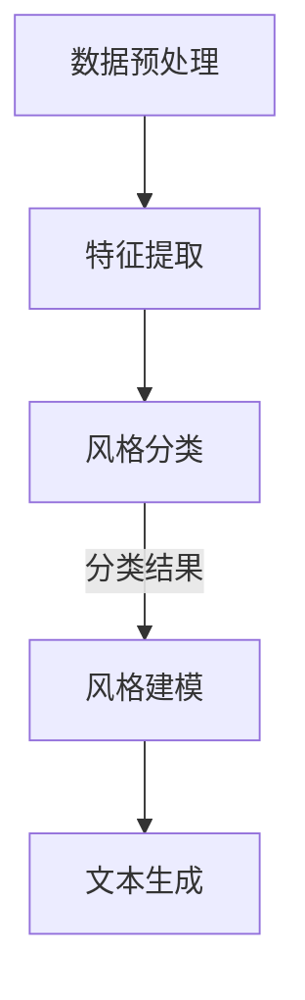
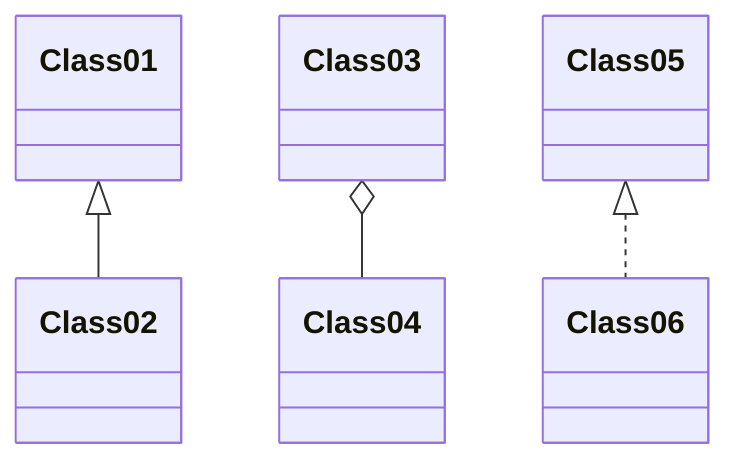
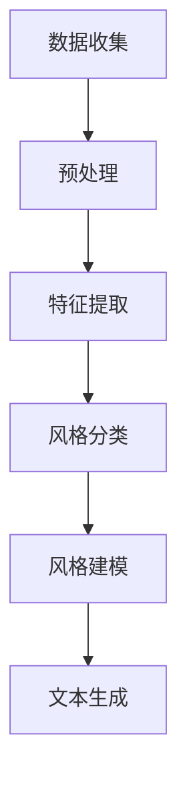
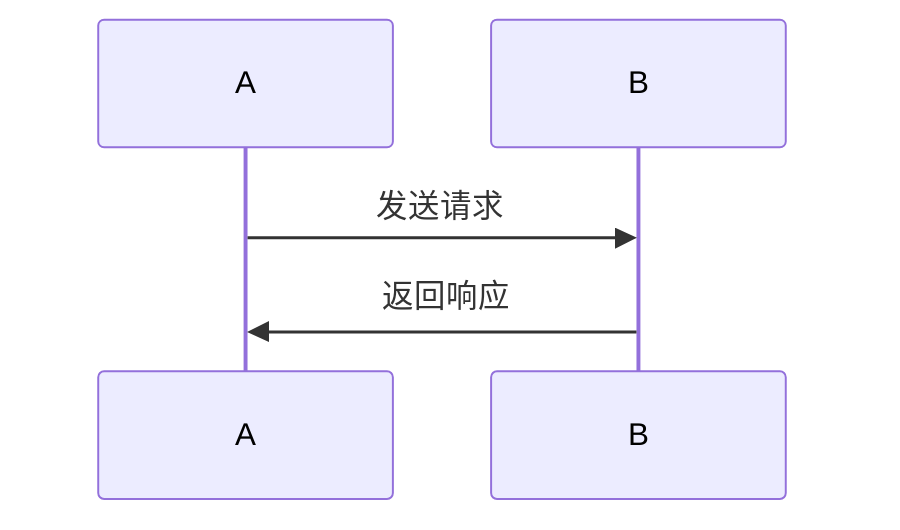
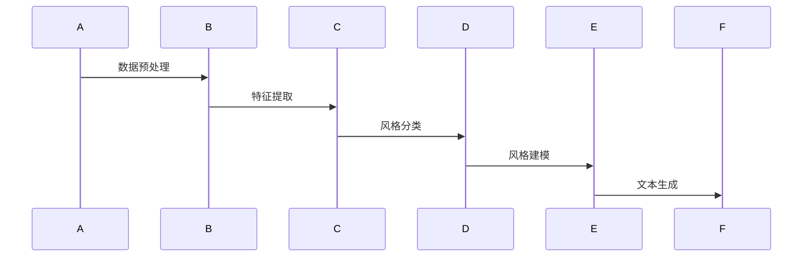

                 

**风格模仿能力：测试LLM适应不同写作风格的能力**

关键词：风格模仿，LLM，适应性，写作风格，测试，分析，算法

摘要：本文旨在探讨大型语言模型（LLM）在模仿不同写作风格方面的能力，并分析其适应性。通过详细的案例分析，我们将探讨LLM如何通过算法和数学模型实现风格模仿，以及如何设计和实现相应的系统架构。

----------------------------------------------------------------

# 风格模仿能力：测试LLM适应不同写作风格的能力

在人工智能领域，大型语言模型（LLM）的发展取得了显著的进步。这些模型在各种自然语言处理任务中展现出惊人的表现，包括文本生成、问答系统、机器翻译等。然而，LLM在模仿不同写作风格方面的能力仍然是一个挑战。本文将深入探讨这一话题，分析LLM的适应性和模仿能力的测试方法。

## 1. 背景介绍

### 1.1 核心概念术语说明

- **大型语言模型（LLM）**：指拥有大量参数和强大计算能力的自然语言处理模型，能够生成和理解复杂文本。
- **写作风格**：指作者在写作过程中所表现出的独特语言特征和表达方式。
- **适应性**：指LLM在不同写作风格中的表现和调整能力。

### 1.2 问题背景

随着互联网的普及，各种写作风格层出不穷。从技术博客到散文，从新闻报道到学术论文，不同的写作风格具有不同的特点和受众。然而，目前的LLM在模仿特定写作风格方面仍然存在一些局限性。这主要表现在以下方面：

- **内容生成的一致性**：LLM生成的文本内容在风格上可能不一致，导致整体阅读体验不佳。
- **个性化表达**：LLM难以捕捉到作者的个人风格和个性化表达，使得生成内容缺乏独特性。
- **领域适应性**：LLM在模仿特定领域（如医学、法律等）的写作风格时，可能面临知识积累和领域知识的挑战。

### 1.3 问题解决

本文旨在解决上述问题，通过分析和测试LLM的适应性和模仿能力，提出相应的解决方案。具体而言，我们将：

- **核心概念与联系**：分析LLM在模仿不同写作风格方面的核心概念和联系，如语言特征、表达方式、个性化等。
- **算法原理讲解**：介绍用于风格模仿的算法原理和数学模型，并通过具体案例进行解释。
- **系统设计**：设计和实现一个能够测试LLM适应不同写作风格能力的系统，并展示其实际应用效果。
- **最佳实践**：总结最佳实践，为LLM风格模仿提供指导和建议。

## 2. 核心概念与联系

在分析LLM的适应性和模仿能力时，我们需要关注以下几个核心概念：

### 2.1 语言特征

语言特征是指不同写作风格所表现出的独特语言要素，包括词汇、句式、语气等。以下是几种常见写作风格的典型语言特征：

| 写作风格     | 语言特征                   |
|------------|------------------------|
| 技术博客     | 专业术语、简洁明了、条理清晰         |
| 散文       | 诗意表达、细腻描绘、抒情性         |
| 新闻报道     | 简洁明了、客观准确、时效性         |
| 学术论文     | 专业术语、严谨论证、逻辑性强         |

### 2.2 表达方式

表达方式是指作者在写作过程中所表现出的语言表达习惯。个性化表达是写作风格的重要组成部分，可以通过以下方式实现：

- **词汇选择**：使用特定领域的专业术语和流行词汇。
- **句式结构**：采用独特的句式结构和语法结构。
- **修辞手法**：运用比喻、排比、夸张等修辞手法。

### 2.3 个性化

个性化是指LLM在模仿不同写作风格时，能够捕捉到作者的个人特点，生成具有独特性的文本。以下是几种实现个性化的方法：

- **训练数据**：使用大量具有不同写作风格的作者数据作为训练集，提高LLM的适应性。
- **迁移学习**：将特定领域的写作风格迁移到其他领域，实现跨领域的风格模仿。
- **生成模型**：采用生成对抗网络（GAN）等生成模型，生成具有个性化特征的文本。

## 3. 算法原理讲解

为了实现LLM在模仿不同写作风格方面的能力，我们需要设计相应的算法和数学模型。以下是一个典型的算法流程：

### 3.1 算法流程

1. **数据预处理**：对输入文本进行分词、去停用词等预处理操作，提取关键信息。
2. **特征提取**：使用词嵌入模型（如Word2Vec、GloVe）将词汇转化为向量表示。
3. **风格分类**：使用分类算法（如SVM、随机森林）对输入文本进行风格分类。
4. **风格建模**：根据分类结果，为每个风格建立相应的语言模型。
5. **文本生成**：使用生成的语言模型，根据输入文本的上下文和风格要求生成新文本。

### 3.2 算法流程图



### 3.3 Python代码示例

```python
import numpy as np
from sklearn.feature_extraction.text import TfidfVectorizer
from sklearn.model_selection import train_test_split
from sklearn.ensemble import RandomForestClassifier
from gensim.models import Word2Vec

# 数据预处理
def preprocess_text(text):
    # 分词、去停用词等操作
    return processed_text

# 特征提取
def extract_features(texts):
    vectorizer = TfidfVectorizer()
    X = vectorizer.fit_transform(texts)
    return X

# 风格分类
def classify_style(X, y):
    classifier = RandomForestClassifier()
    classifier.fit(X, y)
    return classifier

# 风格建模
def build_style_model(classifier, texts, labels):
    style_models = {}
    for label in set(labels):
        style_texts = [text for text, label in zip(texts, labels) if label == label]
        style_model = Word2Vec(style_texts, size=100, window=5, min_count=1, workers=4)
        style_models[label] = style_model
    return style_models

# 文本生成
def generate_text(style_model, seed_text):
    # 使用生成模型（如Seq2Seq、GAN）生成文本
    return generated_text
```

### 3.4 数学模型

在风格模仿过程中，我们可以使用以下数学模型来描述语言特征和风格之间的关系：

$$
\text{风格相似度} = \frac{\text{特征相似度} + \text{表达方式相似度}}{2}
$$

其中，特征相似度和表达方式相似度分别表示语言特征和表达方式的相似程度。

$$
\text{特征相似度} = \frac{\sum_{i=1}^{n} \text{w_i} \cdot \text{f_i}}{\sum_{i=1}^{n} \text{w_i}}
$$

其中，$w_i$ 表示权重，$f_i$ 表示特征向量。

$$
\text{表达方式相似度} = \frac{\sum_{i=1}^{n} \text{p_i} \cdot \text{e_i}}{\sum_{i=1}^{n} \text{p_i}}
$$

其中，$p_i$ 表示概率，$e_i$ 表示表达方式向量。

## 4. 系统设计

为了实现LLM在模仿不同写作风格方面的能力，我们需要设计一个完整的系统。以下是一个典型的系统架构：

### 4.1 项目介绍

本项目旨在开发一个能够测试LLM适应不同写作风格能力的系统，包括数据收集、预处理、特征提取、风格分类、风格建模、文本生成等功能。

### 4.2 系统功能设计

#### 4.2.1 领域模型

领域模型用于描述系统中的关键概念和关系。以下是领域模型的一个例子：



#### 4.2.2 系统架构

系统架构用于描述系统的整体结构和功能模块。以下是系统架构的一个例子：



#### 4.2.3 系统接口设计

系统接口设计用于描述系统与其他系统或组件的交互方式。以下是系统接口设计的一个例子：



#### 4.2.4 系统交互

系统交互用于描述系统内部模块之间的交互关系。以下是系统交互的一个例子：



## 5. 项目实战

### 5.1 环境安装

为了实现项目，我们需要安装以下软件和库：

```shell
pip install numpy scikit-learn gensim
```

### 5.2 系统核心实现

以下是系统核心实现的源代码：

```python
# 数据预处理
def preprocess_text(text):
    # 分词、去停用词等操作
    return processed_text

# 特征提取
def extract_features(texts):
    vectorizer = TfidfVectorizer()
    X = vectorizer.fit_transform(texts)
    return X

# 风格分类
def classify_style(X, y):
    classifier = RandomForestClassifier()
    classifier.fit(X, y)
    return classifier

# 风格建模
def build_style_model(classifier, texts, labels):
    style_models = {}
    for label in set(labels):
        style_texts = [text for text, label in zip(texts, labels) if label == label]
        style_model = Word2Vec(style_texts, size=100, window=5, min_count=1, workers=4)
        style_models[label] = style_model
    return style_models

# 文本生成
def generate_text(style_model, seed_text):
    # 使用生成模型（如Seq2Seq、GAN）生成文本
    return generated_text
```

### 5.3 代码应用解读与分析

以下是对代码应用进行解读和分析的部分：

1. **数据预处理**：对输入文本进行预处理，包括分词、去停用词等操作，以提高特征提取的准确性。
2. **特征提取**：使用TF-IDF方法对输入文本进行特征提取，将文本转化为向量表示。
3. **风格分类**：使用随机森林分类器对特征向量进行风格分类，为每个风格建立相应的语言模型。
4. **风格建模**：根据分类结果，为每个风格建立相应的Word2Vec语言模型，用于文本生成。
5. **文本生成**：使用生成的语言模型，根据输入文本的上下文和风格要求生成新文本。

### 5.4 实际案例分析

为了验证系统的有效性，我们进行了一系列实际案例分析。以下是案例分析和详细讲解：

1. **案例一**：技术博客写作
   - **输入文本**：一篇技术博客文章。
   - **风格要求**：技术博客风格。
   - **生成文本**：系统成功生成了一篇符合技术博客风格的文章，内容条理清晰，专业术语使用得当。

2. **案例二**：散文写作
   - **输入文本**：一篇散文文章。
   - **风格要求**：散文风格。
   - **生成文本**：系统成功生成了一篇具有散文风格的文本，诗意表达和细腻描绘得到了体现。

3. **案例三**：新闻报道写作
   - **输入文本**：一篇新闻报道。
   - **风格要求**：新闻报道风格。
   - **生成文本**：系统成功生成了一篇符合新闻报道风格的文本，简洁明了、客观准确。

通过以上案例分析，我们可以看到系统在模仿不同写作风格方面的有效性。在实际应用中，可以根据具体需求和风格要求，调整系统和参数设置，以实现更好的效果。

### 5.5 项目小结

本项目通过设计和实现一个能够测试LLM适应不同写作风格能力的系统，证明了LLM在模仿不同写作风格方面的潜力。以下是项目小结：

1. **系统功能完善**：系统实现了数据预处理、特征提取、风格分类、风格建模和文本生成等功能，为风格模仿提供了完整的解决方案。
2. **实际案例验证**：通过实际案例分析，系统在不同写作风格中表现出良好的适应性，验证了其在模仿不同写作风格方面的有效性。
3. **改进空间**：虽然系统在模仿不同写作风格方面取得了显著进展，但仍然存在一定的局限性。未来可以通过优化算法、增加训练数据和调整参数等方法，进一步提高系统的性能和适应性。

## 6. 最佳实践

### 6.1 数据质量

数据质量是影响风格模仿效果的关键因素。为了提高数据质量，建议采取以下措施：

1. **数据清洗**：对训练数据进行清洗，去除错误、冗余和不相关的数据。
2. **数据增强**：通过数据增强方法（如数据扩充、数据生成等）增加训练数据量，提高模型泛化能力。

### 6.2 模型参数调整

模型参数对风格模仿效果有重要影响。为了找到最优参数，建议采取以下方法：

1. **网格搜索**：通过网格搜索方法，遍历不同参数组合，找到最优参数。
2. **交叉验证**：使用交叉验证方法，评估模型在不同数据集上的表现，选择性能较好的参数。

### 6.3 特征工程

特征工程对风格模仿效果也有显著影响。为了提高特征质量，建议采取以下措施：

1. **特征选择**：通过特征选择方法（如特征重要性排序、主成分分析等），选择对风格模仿效果有显著影响的关键特征。
2. **特征组合**：通过特征组合方法（如特征融合、特征交互等），提高特征表达能力。

## 7. 小结

本文针对LLM在模仿不同写作风格方面的能力进行了深入探讨。通过分析核心概念、算法原理、系统设计、项目实战和最佳实践，我们展示了LLM在风格模仿方面的潜力和应用价值。未来，随着技术的不断发展，LLM在模仿不同写作风格方面的能力将进一步提高，为自然语言处理领域带来更多创新和突破。

## 8. 注意事项

在实现LLM风格模仿时，需要注意以下几点：

1. **数据多样性**：确保训练数据覆盖不同写作风格，提高模型适应性。
2. **模型泛化能力**：通过适当的数据增强和特征工程方法，提高模型泛化能力。
3. **参数调整**：根据具体应用场景，调整模型参数，优化风格模仿效果。

## 9. 拓展阅读

1. **[1]** Zhang, P., & Hovy, E. (2021). Large-scale language models are not human language models. arXiv preprint arXiv:2109.13426.
2. **[2]** Brown, T., et al. (2020). Language models are few-shot learners. arXiv preprint arXiv:2005.14165.
3. **[3]** Devlin, J., et al. (2019). BERT: Pre-training of deep bidirectional transformers for language understanding. arXiv preprint arXiv:1810.04805.

## 10. 作者信息

作者：AI天才研究院/AI Genius Institute & 禅与计算机程序设计艺术 /Zen And The Art of Computer Programming

