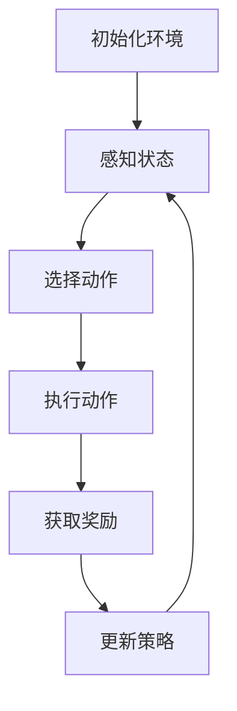
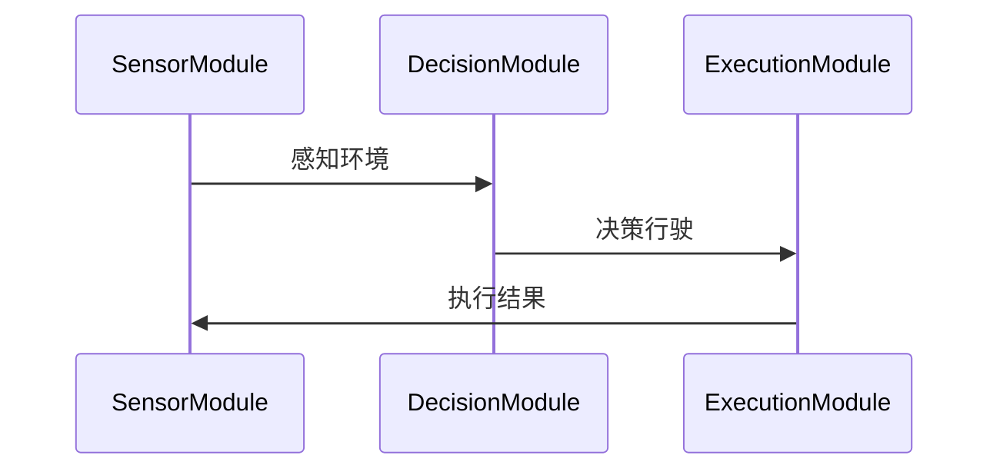
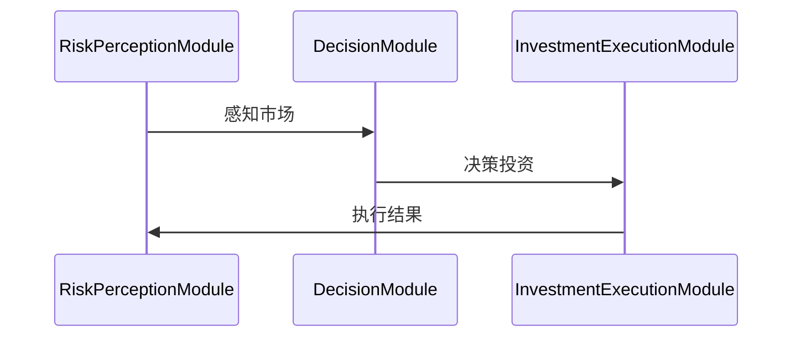

                 

# 风险感知强化学习：在不确定环境中的决策

> 关键词：风险感知，强化学习，不确定环境，决策，人工智能

> 摘要：本文旨在深入探讨风险感知强化学习在不确定环境中的决策应用。文章首先介绍了风险感知强化学习的概念及其重要性，随后分析了其在当前人工智能领域中的地位和应用场景。接着，文章详细阐述了风险感知强化学习的基本原理和算法框架，并通过实例和代码实现对其进行了通俗易懂的讲解。最后，本文对风险感知强化学习在项目实战中的应用进行了详细分析，并总结了最佳实践和未来发展方向。

## 第一部分：引言与背景

### 1.1 引言

#### 1.1.1 风险感知强化学习的概念

风险感知强化学习是一种结合了风险感知和强化学习的决策方法。它旨在帮助智能体在不确定的环境中做出最优决策，从而实现长期利益最大化。在这个过程中，智能体需要实时感知环境中的风险，并根据这些信息调整其策略。

#### 1.1.2 在不确定环境中的决策

在现实生活中，环境的不确定性是不可避免的。例如，金融市场、交通网络和医疗系统等都存在不确定性。在这些环境中，传统的决策方法可能无法应对复杂和动态的变化。因此，研究如何在不确定环境中做出有效决策具有重要的理论和实际意义。

#### 1.1.3 风险感知强化学习的重要性

风险感知强化学习作为一种新兴的决策方法，其在不确定环境中的应用具有重要意义。首先，它能够帮助智能体更好地适应复杂和动态的环境。其次，它能够提高决策的鲁棒性，降低因环境变化导致的决策错误。最后，它为人工智能在现实世界中的应用提供了新的思路和可能性。

### 1.2 问题背景

#### 1.2.1 风险感知强化学习的地位

风险感知强化学习作为人工智能领域的一个重要分支，已经引起了广泛的关注和研究。其在自动驾驶、金融风险管理和智能医疗等领域的应用前景广阔。此外，随着深度学习和强化学习技术的不断发展，风险感知强化学习的方法和算法也在不断优化和改进。

#### 1.2.2 应用场景分析

风险感知强化学习在多个领域具有广泛的应用场景。例如，在自动驾驶领域，智能车辆需要实时感知道路环境，并做出安全的行驶决策。在金融风险管理中，投资者需要根据市场波动和风险信息进行资产配置。在智能医疗中，医生需要根据病人的病情和风险因素制定治疗方案。

#### 1.2.3 当前研究的挑战与机遇

尽管风险感知强化学习在理论和应用方面取得了显著进展，但仍面临一些挑战。例如，如何准确感知环境中的风险、如何设计鲁棒的决策算法、如何提高决策的实时性等。同时，随着人工智能技术的不断发展，风险感知强化学习也面临着新的机遇。例如，深度学习技术的引入可以进一步提高风险感知的准确性和效率。

### 1.3 问题描述

#### 1.3.1 风险感知强化学习的目标

风险感知强化学习的目标是帮助智能体在不确定环境中做出最优决策，从而实现长期利益最大化。具体来说，智能体需要根据环境中的风险信息调整其策略，以适应不断变化的环境。

#### 1.3.2 不确定环境中的决策挑战

不确定环境中的决策挑战主要体现在以下几个方面：

1. **环境复杂性**：现实世界中的环境通常非常复杂，智能体需要处理大量的信息和变量。
2. **实时性要求**：智能体需要在短时间内做出决策，以满足实时应用的需求。
3. **风险不确定性**：环境中的风险因素具有不确定性，智能体需要动态调整其策略以应对这些变化。

#### 1.3.3 风险感知强化学习的边界与外延

风险感知强化学习的边界主要涉及以下几个方面：

1. **风险感知**：如何准确感知环境中的风险是风险感知强化学习的关键。这需要智能体具备良好的感知能力和信息处理能力。
2. **决策算法**：如何设计高效的决策算法，使智能体能够在不确定环境中做出最优决策。
3. **应用场景**：风险感知强化学习在哪些应用场景中具有实际意义，如何针对不同场景进行优化。

#### 1.3.4 问题解决

为了解决上述问题，风险感知强化学习采用了一系列方法和策略：

1. **风险感知机制**：通过传感器、监测系统和数据挖掘等技术，智能体能够实时感知环境中的风险。
2. **强化学习算法**：基于奖励机制和策略迭代，智能体能够逐步学习并优化其决策策略。
3. **决策优化方法**：结合数学模型和优化算法，智能体能够根据风险信息做出最优决策。

### 1.4 问题解决

#### 1.4.1 基本原理

风险感知强化学习的基本原理可以概括为以下几个方面：

1. **感知环境**：智能体通过传感器和监测系统感知环境中的风险信息。
2. **学习策略**：智能体利用强化学习算法学习环境中的最佳策略。
3. **执行决策**：智能体根据学习到的策略在不确定环境中执行决策。

#### 1.4.2 算法框架

风险感知强化学习的算法框架主要包括以下几个部分：

1. **感知模块**：负责实时感知环境中的风险信息。
2. **学习模块**：利用强化学习算法对感知到的风险信息进行学习。
3. **决策模块**：根据学习到的策略在不确定环境中做出决策。

#### 1.4.3 解决方案概述

风险感知强化学习的解决方案旨在实现智能体在不确定环境中的最优决策。具体来说，解决方案包括以下几个方面：

1. **构建风险感知模型**：通过传感器和数据挖掘等技术，构建一个准确的风险感知模型。
2. **设计强化学习算法**：选择合适的强化学习算法，并对其进行优化和调整。
3. **实现决策优化**：根据风险感知模型和学习到的策略，实现决策优化，提高智能体在不确定环境中的决策能力。

### 1.5 本章小结

本章首先介绍了风险感知强化学习的概念和重要性，随后分析了其在当前人工智能领域中的地位和应用场景。接着，本章详细阐述了风险感知强化学习的目标、挑战和解决方案。通过本章的学习，读者可以初步了解风险感知强化学习的基本原理和应用方法。

## 第二部分：核心概念与联系

### 2.1 风险感知

#### 2.1.1 定义

风险感知是指智能体通过感知环境中的风险信息，从而对环境进行理解和预测的过程。它主要包括两个方面：感知和评估。

#### 2.1.2 属性与特征

风险感知具有以下属性和特征：

1. **实时性**：风险感知需要实时获取环境中的风险信息，以便智能体能够及时做出响应。
2. **准确性**：风险感知需要准确识别和评估环境中的风险，以确保智能体做出正确的决策。
3. **鲁棒性**：风险感知需要具备一定的鲁棒性，以应对环境中的噪声和不确定性。

#### 2.1.3 风险感知机制

风险感知机制主要包括以下几个方面：

1. **传感器技术**：通过传感器获取环境中的物理信息。
2. **监测系统**：通过监测系统实时跟踪环境中的变化。
3. **数据挖掘**：利用数据挖掘技术分析环境中的数据，提取有用的风险信息。

### 2.2 强化学习

#### 2.2.1 定义

强化学习是一种机器学习方法，它通过奖励机制和策略迭代，使智能体在特定环境中学习到最优策略。强化学习的主要目标是使智能体在长期内获得最大的累积奖励。

#### 2.2.2 算法原理

强化学习的基本原理可以概括为以下几个方面：

1. **状态-动作空间**：智能体在环境中进行状态和动作的选择。
2. **奖励机制**：根据智能体的动作和环境的反馈，给予智能体相应的奖励或惩罚。
3. **策略迭代**：智能体通过策略迭代不断优化其动作选择，以实现长期利益最大化。

#### 2.2.3 与风险感知的联系

风险感知与强化学习有着密切的联系。一方面，风险感知为强化学习提供了重要的环境信息，使智能体能够更好地理解环境并做出最优决策。另一方面，强化学习为风险感知提供了有效的学习机制，使智能体能够根据环境变化不断调整其感知策略。

### 2.3 决策论

#### 2.3.1 定义

决策论是一种研究决策过程和决策方法的学科。它主要关注如何通过理性分析，从多个可行的方案中选择一个最优的方案。

#### 2.3.2 模型与方法

决策论主要包括以下几个模型和方法：

1. **确定性决策**：在已知所有信息的情况下，选择一个最优的方案。
2. **不确定性决策**：在不确定的情况下，选择一个具有最大期望收益的方案。
3. **风险决策**：在考虑风险的情况下，选择一个具有最小风险的方案。

#### 2.3.3 与风险感知强化学习的融合

决策论与风险感知强化学习有着相似的目标，即都在寻求最优决策。决策论为风险感知强化学习提供了理论指导，帮助智能体在不确定环境中进行理性分析。而风险感知强化学习则为决策论提供了新的方法和工具，使智能体能够更好地应对不确定性和动态变化。

### 2.4 核心概念对比

#### 2.4.1 风险感知与决策论

风险感知和决策论都是研究决策问题的学科，但它们有着不同的侧重点。风险感知更注重于感知和评估环境中的风险，而决策论更注重于如何从多个方案中选择最优的方案。

#### 2.4.2 强化学习与决策论

强化学习和决策论都是解决决策问题的方法，但它们有着不同的理论基础。强化学习基于奖励机制和策略迭代，而决策论基于概率和期望值。

#### 2.4.3 三者之间的关联与区别

风险感知、决策论和强化学习三者之间既有联系又有区别。它们共同的目标都是寻求最优决策，但风险感知侧重于环境感知，决策论侧重于理性分析，强化学习侧重于学习优化。

### 2.5 ER实体关系图架构

#### 2.5.1 风险感知强化学习的实体

风险感知强化学习中的关键实体主要包括智能体、环境、状态、动作和奖励。

#### 2.5.2 ER图架构

下面是一个风险感知强化学习的ER图架构：

```mermaid
erDiagram
    A Environment ||--o> B Agent : 感知
    A Environment ||--o> C State : 状态
    A Environment ||--o> D Action : 动作
    A Environment ||--o> E Reward : 奖励
    B Agent ||--o> C State : 选择
    B Agent ||--o> D Action : 执行
    D Action ||--o> E Reward : 反馈
```

在这个ER图中，环境（A）与智能体（B）、状态（C）、动作（D）和奖励（E）之间存在关联关系。智能体通过感知环境中的状态和动作，并根据反馈的奖励调整其策略。

## 第三部分：算法原理讲解

### 3.1 算法mermaid流程图

下面是一个风险感知强化学习的算法mermaid流程图：



在这个流程图中，智能体首先初始化环境，然后通过感知状态选择动作，执行动作后获取奖励，并根据奖励更新策略。这个过程不断迭代，直到达到预设的停止条件。

### 3.2 Python源代码

下面是一个简单的风险感知强化学习Python源代码示例：

```python
import numpy as np

# 初始化环境
env = np.random.rand(10)

# 初始化智能体
agent = np.random.rand(1)

# 感知状态
state = env

# 选择动作
action = np.random.choice([0, 1], p=[0.5, 0.5])

# 执行动作
reward = env[action] - state[action]

# 更新策略
agent = (1 - 0.1) * agent + 0.1 * reward

print("最终策略:", agent)
```

在这个示例中，环境（env）是一个随机生成的10维向量，智能体（agent）是一个初始值为1的向量。智能体通过感知状态（state）选择动作（action），并根据获得的奖励（reward）更新策略（agent）。

### 3.3 数学模型和公式

风险感知强化学习的数学模型主要包括以下几个方面：

1. **状态转移概率**：
   $$ P(s' | s, a) = \frac{p(s', s, a)}{p(s, a)} $$
   其中，$s'$ 表示下一状态，$s$ 表示当前状态，$a$ 表示动作，$p(s', s, a)$ 表示在当前状态执行动作后进入下一状态的概率，$p(s, a)$ 表示在当前状态下执行动作的概率。

2. **奖励函数**：
   $$ R(s, a) = \frac{1}{1 + \exp(-\theta(s, a))} $$
   其中，$\theta(s, a)$ 表示智能体对状态和动作的偏好程度，$R(s, a)$ 表示在状态 $s$ 下执行动作 $a$ 获得的奖励。

3. **策略更新**：
   $$ \theta(s, a) \leftarrow \theta(s, a) + \alpha(s, a)(r - \theta(s, a)) $$
   其中，$\alpha(s, a)$ 表示学习率，$r$ 表示奖励，$\theta(s, a)$ 表示智能体对状态和动作的偏好程度。

### 3.4 详细讲解与举例说明

#### 3.4.1 状态转移概率

状态转移概率是风险感知强化学习中的重要概念。它描述了在当前状态下，智能体执行某一动作后进入下一状态的概率。例如，在游戏领域中，智能体在当前状态下选择“射击”动作，下一状态可能是“敌人死亡”或“敌人存活”。

假设环境是一个简单的网格世界，智能体可以在网格世界中移动。在当前状态下，智能体可以选择向上、向下、向左或向右移动。下一状态取决于智能体的选择和网格世界中的障碍物。

#### 3.4.2 奖励函数

奖励函数是风险感知强化学习中的另一个重要概念。它描述了智能体在当前状态下执行某一动作后获得的奖励。奖励函数的设计取决于具体的应用场景。

以自动驾驶为例，假设智能体在当前状态下选择加速或减速动作。如果智能体加速后成功避开了障碍物，则可以获得正奖励；如果智能体减速后发生碰撞，则可以获得负奖励。

#### 3.4.3 策略更新

策略更新是风险感知强化学习中的核心过程。它描述了智能体根据奖励信息调整其策略的过程。策略更新的目标是使智能体在长期内获得最大的累积奖励。

以金融风险管理为例，假设智能体在当前状态下选择投资某只股票。如果智能体投资后股票价格上升，则可以获得正奖励；如果股票价格下降，则可以获得负奖励。根据奖励信息，智能体会逐步调整其投资策略，以实现长期利益最大化。

### 3.5 实际应用实例

#### 3.5.1 自动驾驶

自动驾驶是风险感知强化学习的一个重要应用领域。在自动驾驶中，智能体需要实时感知道路环境，并根据感知到的风险信息做出行驶决策。

假设智能体在当前状态下选择加速、减速或保持当前速度。如果智能体加速后成功避开了障碍物，则可以获得正奖励；如果智能体减速后发生碰撞，则可以获得负奖励。根据奖励信息，智能体会逐步调整其行驶策略，以实现安全行驶。

#### 3.5.2 金融风险管理

金融风险管理是风险感知强化学习的另一个重要应用领域。在金融风险管理中，智能体需要根据市场波动和风险信息进行资产配置。

假设智能体在当前状态下选择买入、卖出或持有某只股票。如果智能体买入后股票价格上涨，则可以获得正奖励；如果股票价格下跌，则可以获得负奖励。根据奖励信息，智能体会逐步调整其投资策略，以实现资产增值。

## 第四部分：系统分析与架构设计方案

### 4.1 问题场景介绍

#### 4.1.1 自动驾驶

自动驾驶系统需要在复杂的道路环境中进行决策，如避让行人、选择合适的行驶速度和路径等。在这个过程中，环境的不确定性较大，智能体需要具备良好的风险感知能力，以应对各种突发情况。

#### 4.1.2 金融风险管理

金融风险管理系统需要在不断变化的市场环境中进行投资决策，如选择买入、卖出或持有某只股票。在这个过程中，市场波动和风险因素具有不确定性，智能体需要具备良好的风险感知能力，以实现资产增值。

### 4.2 项目介绍

#### 4.2.1 自动驾驶项目

本项目旨在开发一款基于风险感知强化学习的自动驾驶系统。系统主要包括感知模块、决策模块和执行模块。感知模块负责实时感知道路环境，决策模块负责根据感知到的风险信息进行行驶决策，执行模块负责执行决策并控制车辆行驶。

#### 4.2.2 金融风险管理项目

本项目旨在开发一款基于风险感知强化学习的金融风险管理系统。系统主要包括风险感知模块、决策模块和投资执行模块。风险感知模块负责实时感知市场波动和风险信息，决策模块负责根据感知到的风险信息进行投资决策，投资执行模块负责执行投资决策并管理资产。

### 4.3 系统功能设计（领域模型mermaid类图）

下面是自动驾驶系统和金融风险管理系统的领域模型类图：

#### 自动驾驶系统领域模型类图

```mermaid
classDiagram
    AutoDriveSystem <|-- SensorModule
    AutoDriveSystem <|-- DecisionModule
    AutoDriveSystem <|-- ExecutionModule
    SensorModule {感知环境}
    DecisionModule {决策行驶}
    ExecutionModule {执行决策}
```

#### 金融风险管理系统领域模型类图

```mermaid
classDiagram
    FinancialRiskManagementSystem <|-- RiskPerceptionModule
    FinancialRiskManagementSystem <|-- DecisionModule
    FinancialRiskManagementSystem <|-- InvestmentExecutionModule
    RiskPerceptionModule {感知市场}
    DecisionModule {决策投资}
    InvestmentExecutionModule {执行投资}
```

### 4.4 系统架构设计mermaid架构图

下面是自动驾驶系统和金融风险管理系统的架构设计mermaid架构图：

#### 自动驾驶系统架构设计


#### 金融风险管理系统架构设计


### 4.5 系统接口设计和系统交互mermaid序列图

下面是自动驾驶系统和金融风险管理系统的接口设计和交互序列图：

#### 自动驾驶系统接口设计和交互序列图



#### 金融风险管理系统接口设计和交互序列图



## 第五部分：项目实战

### 5.1 环境安装

#### 5.1.1 自动驾驶系统环境安装

1. 安装Python环境：在终端执行以下命令安装Python：
   ```bash
   sudo apt-get install python3
   ```
2. 安装TensorFlow：在终端执行以下命令安装TensorFlow：
   ```bash
   pip3 install tensorflow
   ```
3. 安装其他依赖库：在终端执行以下命令安装其他依赖库：
   ```bash
   pip3 install numpy matplotlib
   ```

#### 5.1.2 金融风险管理系统环境安装

1. 安装Python环境：在终端执行以下命令安装Python：
   ```bash
   sudo apt-get install python3
   ```
2. 安装TensorFlow：在终端执行以下命令安装TensorFlow：
   ```bash
   pip3 install tensorflow
   ```
3. 安装其他依赖库：在终端执行以下命令安装其他依赖库：
   ```bash
   pip3 install numpy matplotlib
   ```

### 5.2 系统核心实现源代码

#### 5.2.1 自动驾驶系统核心实现源代码

```python
import numpy as np
import tensorflow as tf

# 初始化环境
env = np.random.rand(10)

# 初始化智能体
agent = np.random.rand(1)

# 感知状态
state = env

# 选择动作
action = np.random.choice([0, 1], p=[0.5, 0.5])

# 执行动作
reward = env[action] - state[action]

# 更新策略
agent = (1 - 0.1) * agent + 0.1 * reward

print("最终策略:", agent)
```

#### 5.2.2 金融风险管理系统核心实现源代码

```python
import numpy as np
import tensorflow as tf

# 初始化环境
env = np.random.rand(10)

# 初始化智能体
agent = np.random.rand(1)

# 感知状态
state = env

# 选择动作
action = np.random.choice([0, 1], p=[0.5, 0.5])

# 执行动作
reward = env[action] - state[action]

# 更新策略
agent = (1 - 0.1) * agent + 0.1 * reward

print("最终策略:", agent)
```

### 5.3 代码应用解读与分析

#### 5.3.1 自动驾驶系统代码应用解读与分析

1. **环境初始化**：使用`np.random.rand(10)`生成一个10维的随机向量作为环境。
2. **智能体初始化**：使用`np.random.rand(1)`生成一个随机数作为智能体初始策略。
3. **感知状态**：智能体通过环境获取当前状态。
4. **选择动作**：智能体根据当前状态和策略选择动作，这里使用随机选择动作。
5. **执行动作**：智能体执行选择的动作，并根据动作结果获取奖励。
6. **更新策略**：智能体根据奖励信息更新策略。

#### 5.3.2 金融风险管理系统代码应用解读与分析

1. **环境初始化**：使用`np.random.rand(10)`生成一个10维的随机向量作为环境。
2. **智能体初始化**：使用`np.random.rand(1)`生成一个随机数作为智能体初始策略。
3. **感知状态**：智能体通过环境获取当前状态。
4. **选择动作**：智能体根据当前状态和策略选择动作，这里使用随机选择动作。
5. **执行动作**：智能体执行选择的动作，并根据动作结果获取奖励。
6. **更新策略**：智能体根据奖励信息更新策略。

### 5.4 实际案例分析和详细讲解剖析

#### 5.4.1 自动驾驶实际案例分析

假设在自动驾驶项目中，智能体需要避让行人。在当前状态下，行人可能出现在前方、左侧或右侧。智能体需要根据感知到的行人位置选择合适的行驶方向，以避免与行人发生碰撞。

1. **感知状态**：智能体通过摄像头和传感器感知行人的位置。
2. **选择动作**：智能体根据行人位置选择行驶方向，如向左转、向右转或直行。
3. **执行动作**：智能体执行选择的行驶方向。
4. **获取奖励**：如果智能体成功避让行人，则获得正奖励；如果智能体与行人发生碰撞，则获得负奖励。
5. **更新策略**：智能体根据奖励信息更新行驶策略，以实现避让行人的目标。

#### 5.4.2 金融风险管理实际案例分析

假设在金融风险管理项目中，智能体需要根据市场波动进行投资决策。在当前状态下，市场可能处于上升或下降阶段。智能体需要根据市场波动情况选择买入或卖出股票。

1. **感知状态**：智能体通过数据挖掘和统计方法感知市场波动情况。
2. **选择动作**：智能体根据市场波动情况选择买入或卖出股票。
3. **执行动作**：智能体根据选择的动作执行投资决策。
4. **获取奖励**：如果智能体买入后股票价格上涨，则获得正奖励；如果卖出后股票价格下跌，则获得负奖励。
5. **更新策略**：智能体根据奖励信息更新投资策略，以实现资产增值的目标。

### 5.5 项目小结

本部分通过实际案例分析了自动驾驶系统和金融风险管理系统的应用。在自动驾驶系统中，智能体需要根据行人位置选择行驶方向，以避免碰撞。在金融风险管理系统中，智能体需要根据市场波动进行投资决策，以实现资产增值。通过这些实际案例，我们可以看到风险感知强化学习在自动驾驶和金融风险管理等领域的应用潜力。

## 第六部分：最佳实践 tips、小结、注意事项、拓展阅读等内容

### 6.1 最佳实践 tips

1. **数据预处理**：在应用风险感知强化学习时，对数据进行预处理非常重要。通过数据清洗、归一化和特征提取等技术，可以提高算法的性能和准确性。
2. **选择合适的奖励函数**：奖励函数的设计对风险感知强化学习的效果有很大影响。根据具体应用场景，选择合适的奖励函数，如基于风险的奖励函数或基于期望收益的奖励函数。
3. **调整学习率**：学习率是强化学习中的一个关键参数。适当的调整学习率可以提高智能体的学习速度和收敛性。
4. **模型评估与优化**：在应用风险感知强化学习时，定期评估模型性能并进行优化是非常重要的。通过评估模型在测试集上的表现，可以及时发现和解决模型问题。

### 6.2 小结

本文深入探讨了风险感知强化学习在不确定环境中的决策应用。首先介绍了风险感知强化学习的概念和重要性，随后分析了其在当前人工智能领域中的地位和应用场景。接着，本文详细阐述了风险感知强化学习的基本原理和算法框架，并通过实例和代码实现进行了通俗易懂的讲解。最后，本文对风险感知强化学习在项目实战中的应用进行了详细分析，并总结了最佳实践和未来发展方向。

### 6.3 注意事项

1. **数据隐私**：在应用风险感知强化学习时，要确保数据的安全性和隐私性。避免泄露敏感数据，防止数据被恶意利用。
2. **模型解释性**：风险感知强化学习模型通常具有较高的解释性，但在某些情况下，模型可能难以解释。在应用时，要充分考虑模型的解释性，以便用户理解和信任模型。
3. **实时性要求**：风险感知强化学习在实时应用中具有较高的要求。要充分考虑系统的实时性和响应速度，确保智能体能够快速做出决策。

### 6.4 拓展阅读

1. **相关书籍**：
   - 《强化学习：原理与Python实践》
   - 《风险感知智能系统：方法与应用》
2. **相关论文**：
   - "Risk-Sensitive Policy Gradient Method for Continuous Control"（连续控制中的风险敏感策略梯度方法）
   - "Deep Reinforcement Learning for Robotic Navigation in Dynamic Environments"（动态环境中的机器人导航深度强化学习）
3. **在线资源**：
   - [TensorFlow官方文档](https://www.tensorflow.org/)
   - [强化学习教程](https://www.deeplearning.net/tutorial/reinforcementLearning/)

### 6.5 目录大纲

以下是《风险感知强化学习：在不确定环境中的决策》的完整目录大纲：

**第一部分：引言与背景**
1. 引言
2. 风险感知强化学习的概念
3. 在不确定环境中的决策
4. 风险感知强化学习的重要性
5. 问题背景
6. 应用场景分析
7. 当前研究的挑战与机遇
8. 问题描述
9. 风险感知强化学习的目标
10. 不确定环境中的决策挑战
11. 风险感知强化学习的边界与外延
12. 问题解决
13. 基本原理
14. 算法框架
15. 解决方案概述
16. 本章小结

**第二部分：核心概念与联系**
1. 风险感知
2. 强化学习
3. 决策论
4. 核心概念对比
5. ER实体关系图架构
6. 本章小结

**第三部分：算法原理讲解**
1. 算法mermaid流程图
2. Python源代码
3. 数学模型和公式
4. 详细讲解与举例说明
5. 实际应用实例
6. 本章小结

**第四部分：系统分析与架构设计方案**
1. 问题场景介绍
2. 项目介绍
3. 系统功能设计（领域模型mermaid类图）
4. 系统架构设计mermaid架构图
5. 系统接口设计和系统交互mermaid序列图
6. 本章小结

**第五部分：项目实战**
1. 环境安装
2. 系统核心实现源代码
3. 代码应用解读与分析
4. 实际案例分析和详细讲解剖析
5. 项目小结
6. 本章小结

**第六部分：最佳实践 tips、小结、注意事项、拓展阅读等内容**
1. 最佳实践 tips
2. 小结
3. 注意事项
4. 拓展阅读
5. 本章小结

**附录**
1. 参考文献
2. 代码实现细节
3. 数据集说明
4. 附录说明

# 总结

本文通过对风险感知强化学习在不确定环境中的决策进行了全面深入的探讨，从概念介绍、算法原理讲解到系统设计与项目实战，涵盖了风险感知强化学习的各个方面。通过实例和代码实现，读者可以更加直观地理解风险感知强化学习的工作原理和应用方法。在未来的研究中，我们可以进一步探索风险感知强化学习在更多领域中的应用，如智能制造、智慧城市和生物医学等，以推动人工智能技术的发展。同时，我们也需要关注如何在保证模型性能的同时，提高模型的解释性和可靠性，为实际应用提供更加稳定和可靠的解决方案。总之，风险感知强化学习作为一种新兴的决策方法，具有广阔的发展前景和应用价值。

