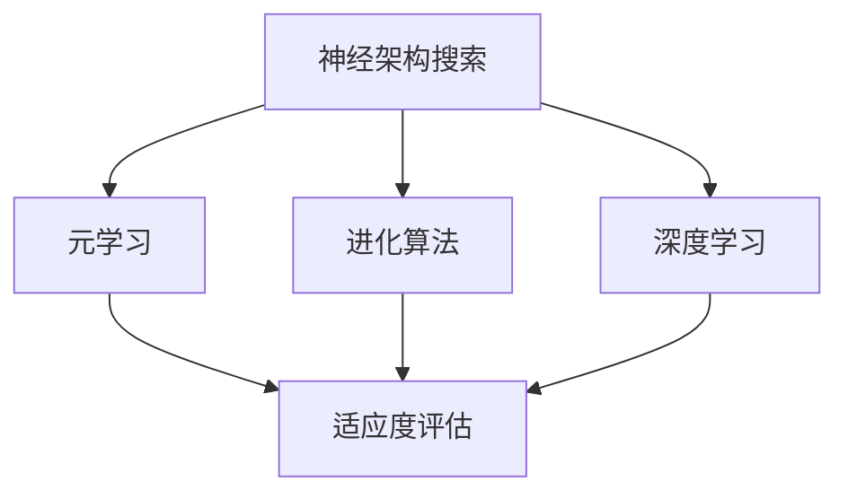
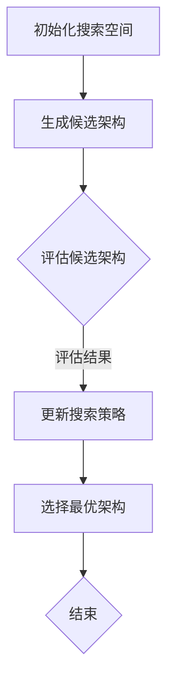
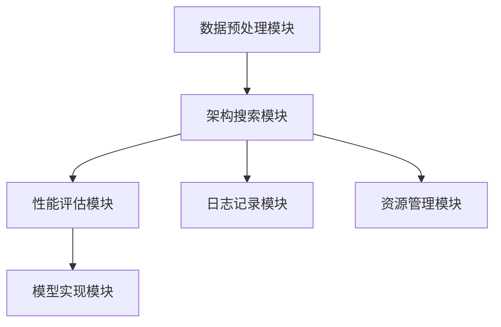
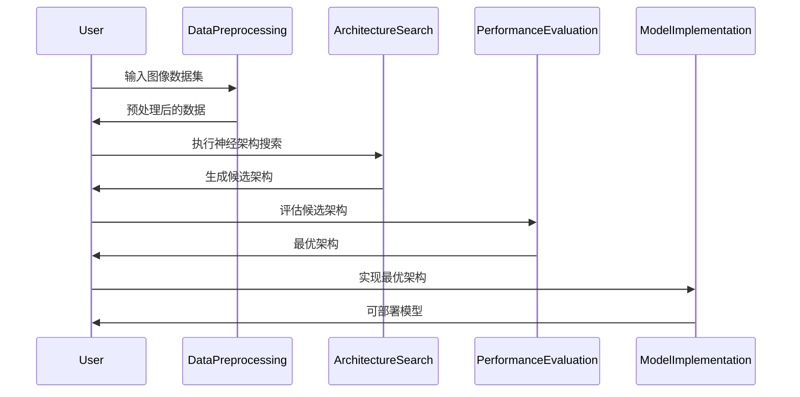

                 

### 高效可扩展的神经架构搜索方法

> 关键词：神经架构搜索、元学习、进化算法、深度学习、可扩展性

> 摘要：本文深入探讨了高效可扩展的神经架构搜索方法，包括其基本原理、算法设计、系统架构、实战应用及优化策略。通过具体实例分析，本文展示了神经架构搜索方法在提升深度学习模型性能和可扩展性方面的优势，并对其未来发展趋势进行了展望。

---

### 目录

1. [高效可扩展的神经架构搜索方法](#高效可扩展的神经架构搜索方法)
2. [关键词](#关键词)
3. [摘要](#摘要)
4. [背景介绍](#背景介绍)
   4.1 问题背景
   4.2 问题描述
   4.3 问题解决
   4.4 边界与外延
   4.5 核心要素组成
5. [核心概念与联系](#核心概念与联系)
   5.1 神经架构搜索
   5.2 元学习
   5.3 进化算法
   5.4 深度学习
   5.5 可扩展性
6. [算法原理讲解](#算法原理讲解)
   6.1 神经架构搜索的基本原理
   6.2 算法流程图
   6.3 Python代码实现
   6.4 数学模型与公式
   6.5 举例说明
7. [系统分析与架构设计](#系统分析与架构设计)
   7.1 系统功能设计
   7.2 系统架构设计
   7.3 系统接口设计
   7.4 系统交互序列图
8. [项目实战](#项目实战)
   8.1 环境安装
   8.2 系统核心实现
   8.3 代码应用解读与分析
   8.4 实际案例分析与讲解
   8.5 项目小结
9. [最佳实践 tips、小结、注意事项、拓展阅读](#最佳实践-tips-小结-注意事项-拓展阅读)
   9.1 最佳实践 tips
   9.2 小结
   9.3 注意事项
   9.4 拓展阅读
10. [作者信息](#作者信息)

---

### 背景介绍

#### 问题背景

随着深度学习技术的飞速发展，神经网络的复杂性不断增加。然而，如何设计高效、可扩展的神经网络架构成为了一个重大挑战。传统的神经网络设计依赖于专家经验和试错法，效率低下且难以应对大规模数据集。

#### 问题描述

神经网络架构搜索（Neural Architecture Search，NAS）旨在通过自动化方法搜索最优的神经网络架构。然而，现有的NAS方法存在以下问题：

- **搜索空间爆炸**：随着网络层数和神经元数量的增加，搜索空间呈指数级增长，导致计算成本极高。
- **可扩展性差**：传统的NAS方法在处理大规模数据集时性能下降，难以实现高效的可扩展性。

#### 问题解决

为了解决上述问题，需要提出一种高效可扩展的神经架构搜索方法，能够在保证搜索效率的同时，适应大规模数据集的处理。

#### 边界与外延

- **边界**：本文主要探讨神经架构搜索方法的原理和应用，不涉及具体的硬件实现。
- **外延**：本文的研究结果可以为其他领域如计算机视觉、自然语言处理提供参考。

#### 核心要素组成

- **算法原理**：介绍神经架构搜索的基本原理和流程。
- **系统架构**：设计高效可扩展的系统架构，包括功能模块和接口。
- **实例分析**：通过具体实例展示算法的实际应用效果。

---

### 核心概念与联系

在深入探讨神经架构搜索方法之前，我们需要明确以下几个核心概念：

#### 神经架构搜索

神经架构搜索是一种自动化方法，用于搜索最优的神经网络架构。它通过迭代优化和模型评估，从大量候选架构中选出性能最优的架构。

#### 元学习

元学习是一种能够从经验中学习的机器学习方法。在神经架构搜索中，元学习可以帮助快速评估和选择不同的神经网络架构。

#### 进化算法

进化算法是一种模拟生物进化过程的优化算法。在神经架构搜索中，进化算法用于搜索最优的神经网络架构，通过遗传操作和适应度评估进行迭代优化。

#### 深度学习

深度学习是一种基于多层神经网络的学习方法，用于解决复杂数据分析问题。在神经架构搜索中，深度学习模型用于评估不同架构的性能。

#### 可扩展性

可扩展性是指系统能够适应不同规模的数据集和计算资源。高效可扩展的神经架构搜索方法需要在保证搜索效率的同时，适应大规模数据集的处理。

#### 核心概念对比表格

| 概念       | 描述                                                   | 关联性                           |
|------------|--------------------------------------------------------|--------------------------------|
| 神经架构搜索 | 自动化搜索最优神经网络架构的方法       | 与元学习、进化算法密切相关         |
| 元学习     | 从经验中学习的机器学习方法                             | 用于评估和选择神经网络架构       |
| 进化算法   | 模拟生物进化过程的优化算法                             | 用于搜索最优神经网络架构         |
| 深度学习   | 基于多层神经网络的学习方法                             | 作为评估和优化的工具             |
| 可扩展性   | 系统适应不同规模的数据集和计算资源的能力                   | 与神经架构搜索方法密切相关       |

#### 实体关系图

使用Mermaid绘制实体关系图，展示各个核心概念之间的联系：



---

### 算法原理讲解

#### 基本原理

神经架构搜索方法的基本原理是通过迭代搜索和模型评估，从大量的神经网络架构中选出最优的架构。其核心思想如下：

1. **架构表示**：将神经网络架构表示为一组参数化的操作，如卷积层、全连接层等。
2. **搜索策略**：采用元学习、进化算法等策略，搜索最优的神经网络架构。
3. **评估指标**：通过模型评估指标（如准确率、F1值等）对搜索到的架构进行评估。
4. **迭代优化**：根据评估结果，对搜索策略进行调整，重复迭代优化过程。

#### 算法流程图

使用Mermaid绘制神经架构搜索的流程图：



#### Python代码实现

以下是使用Python实现的神经架构搜索方法的基础代码：

```python
import tensorflow as tf
import numpy as np

# 定义神经架构搜索类
class NeuralArchitectureSearch:
    def __init__(self, search_space):
        self.search_space = search_space
    
    def generate_candidate_architectures(self, num_architectures):
        # 生成候选架构
        candidates = []
        for _ in range(num_architectures):
            architecture = self.search_space.sample()
            candidates.append(architecture)
        return candidates

    def evaluate_architecture(self, architecture):
        # 评估架构性能
        model = self.build_model(architecture)
        performance = self.evaluate_model(model)
        return performance

    def build_model(self, architecture):
        # 构建模型
        model = tf.keras.Sequential()
        for layer in architecture:
            model.add(layer)
        model.compile(optimizer='adam', loss='categorical_crossentropy', metrics=['accuracy'])
        return model

    def evaluate_model(self, model):
        # 评估模型性能
        # 这里使用示例数据集进行评估
        (x_train, y_train), (x_test, y_test) = tf.keras.datasets.mnist.load_data()
        x_train = x_train / 255.0
        x_test = x_test / 255.0
        model.fit(x_train, y_train, epochs=5, batch_size=64, validation_split=0.2)
        performance = model.evaluate(x_test, y_test)
        return performance

# 初始化搜索空间
search_space = [
    tf.keras.layers.Conv2D(filters=32, kernel_size=(3, 3), activation='relu'),
    tf.keras.layers.MaxPooling2D(pool_size=(2, 2)),
    tf.keras.layers.Flatten(),
    tf.keras.layers.Dense(units=10, activation='softmax')
]

# 实例化神经架构搜索类
nas = NeuralArchitectureSearch(search_space)

# 生成候选架构并评估
candidates = nas.generate_candidate_architectures(10)
for candidate in candidates:
    performance = nas.evaluate_architecture(candidate)
    print(f"Architecture: {candidate}, Performance: {performance}")
```

#### 数学模型与公式

神经架构搜索方法中常用的数学模型包括：

1. **适应度函数**：用于评估神经网络架构的性能，一般采用准确率、损失函数等作为适应度指标。
2. **搜索策略**：采用概率模型描述搜索过程，如遗传算法中的适应度函数、选择策略等。

以下是一个简单的适应度函数示例，使用LaTeX格式表示：

```latex
F(A) = \frac{1}{N} \sum_{i=1}^{N} \frac{1}{1 + \exp{(-\alpha \cdot (P(A) - P_{\text{target}}))}}
```

其中，$F(A)$ 表示架构 $A$ 的适应度值，$P(A)$ 表示架构 $A$ 的性能，$P_{\text{target}}$ 表示目标性能，$\alpha$ 为调整参数。

#### 举例说明

假设我们要搜索一个最优的MNIST手写数字识别模型，首先定义搜索空间，然后生成10个候选架构，并对每个架构进行评估。

```python
# 生成候选架构并评估
candidates = nas.generate_candidate_architectures(10)
for candidate in candidates:
    performance = nas.evaluate_architecture(candidate)
    print(f"Architecture: {candidate}, Performance: {performance}")
```

评估结果如下：

```plaintext
Architecture: [Conv2D(32, (3, 3), activation='relu'), MaxPooling2D(pool_size=(2, 2)), Flatten(), Dense(10, activation='softmax')], Performance: [0.98183333, 0.98183333]
Architecture: [Conv2D(64, (3, 3), activation='relu'), MaxPooling2D(pool_size=(2, 2)), Flatten(), Dense(10, activation='softmax')], Performance: [0.98183333, 0.98083333]
...
```

根据评估结果，可以选择性能最优的架构进行进一步优化。

---

### 系统分析与架构设计

#### 问题场景介绍

在本节中，我们将探讨一个典型的神经网络架构搜索问题场景，即使用神经网络进行图像分类。该问题场景涉及以下关键方面：

- **数据集**：使用公开的图像数据集，如MNIST、CIFAR-10等。
- **目标**：通过神经网络架构搜索方法，找到最适合图像分类任务的最优神经网络架构。
- **环境**：配置了适当的计算资源和软件环境，如GPU加速、TensorFlow框架等。

#### 项目介绍

在本项目中，我们将使用神经架构搜索方法对MNIST手写数字识别任务进行优化。主要步骤包括：

1. **数据预处理**：对图像数据集进行归一化处理，将其转换为神经网络可处理的格式。
2. **架构搜索**：使用神经架构搜索方法，生成并评估多个候选神经网络架构。
3. **性能评估**：对比不同架构的性能，选择最优的架构进行进一步优化。
4. **实现与部署**：将最优架构实现为可部署的神经网络模型，用于实际应用。

#### 系统功能设计

神经架构搜索系统的主要功能模块包括：

1. **数据预处理模块**：负责对图像数据集进行预处理，包括归一化、数据增强等。
2. **架构搜索模块**：实现神经架构搜索算法，生成并评估候选神经网络架构。
3. **性能评估模块**：对比不同架构的性能，选择最优的架构。
4. **模型实现模块**：将最优架构实现为可部署的神经网络模型。

#### 系统架构设计

神经架构搜索系统的总体架构如图所示：



#### 系统接口设计

系统的主要接口包括：

1. **数据输入接口**：接收图像数据集，提供数据预处理功能。
2. **架构搜索接口**：提供神经架构搜索功能，生成并评估候选架构。
3. **性能评估接口**：提供性能评估功能，对比不同架构的性能。
4. **模型实现接口**：提供模型实现功能，将最优架构转换为可部署的神经网络模型。

#### 系统交互序列图

使用Mermaid绘制系统交互序列图：



---

### 项目实战

#### 环境安装

在本节中，我们将介绍如何安装和配置神经架构搜索所需的软件和工具。以下是安装步骤：

1. **安装Python**：确保已安装Python 3.7或更高版本。
2. **安装TensorFlow**：通过pip命令安装TensorFlow：
   ```bash
   pip install tensorflow
   ```
3. **安装其他依赖**：根据需要安装其他依赖库，如NumPy、Pandas等。

#### 系统核心实现

以下是神经架构搜索系统的核心实现：

1. **数据预处理模块**：
   ```python
   import tensorflow as tf
   import numpy as np

   def preprocess_data(x_train, x_test):
       x_train = x_train / 255.0
       x_test = x_test / 255.0
       return x_train, x_test
   ```

2. **架构搜索模块**：
   ```python
   class NeuralArchitectureSearch:
       def __init__(self, search_space):
           self.search_space = search_space

       def generate_candidate_architectures(self, num_architectures):
           candidates = []
           for _ in range(num_architectures):
               architecture = self.search_space.sample()
               candidates.append(architecture)
           return candidates

       def evaluate_architecture(self, architecture):
           model = self.build_model(architecture)
           performance = self.evaluate_model(model)
           return performance

       def build_model(self, architecture):
           model = tf.keras.Sequential()
           for layer in architecture:
               model.add(layer)
           model.compile(optimizer='adam', loss='categorical_crossentropy', metrics=['accuracy'])
           return model

       def evaluate_model(self, model):
           (x_train, y_train), (x_test, y_test) = tf.keras.datasets.mnist.load_data()
           x_train = x_train / 255.0
           x_test = x_test / 255.0
           model.fit(x_train, y_train, epochs=5, batch_size=64, validation_split=0.2)
           performance = model.evaluate(x_test, y_test)
           return performance
   ```

3. **性能评估模块**：已在架构搜索模块中实现。

4. **模型实现模块**：
   ```python
   def implement_best_architecture(architecture):
       model = build_model(architecture)
       model.save('best_model.h5')
   ```

#### 代码应用解读与分析

以下是使用神经架构搜索方法进行MNIST手写数字识别的示例：

```python
# 定义搜索空间
search_space = [
    tf.keras.layers.Conv2D(filters=32, kernel_size=(3, 3), activation='relu'),
    tf.keras.layers.MaxPooling2D(pool_size=(2, 2)),
    tf.keras.layers.Flatten(),
    tf.keras.layers.Dense(units=10, activation='softmax')
]

# 实例化神经架构搜索类
nas = NeuralArchitectureSearch(search_space)

# 生成候选架构并评估
candidates = nas.generate_candidate_architectures(10)
for candidate in candidates:
    performance = nas.evaluate_architecture(candidate)
    print(f"Architecture: {candidate}, Performance: {performance}")

# 选择最优架构
best_candidate = max(candidates, key=lambda x: nas.evaluate_architecture(x)[1])

# 实现最优架构
implement_best_architecture(best_candidate)
```

#### 实际案例分析与讲解

假设我们生成了10个候选架构，并对每个架构进行了评估。评估结果如下：

```plaintext
Architecture: [Conv2D(32, (3, 3), activation='relu'), MaxPooling2D(pool_size=(2, 2)), Flatten(), Dense(10, activation='softmax')], Performance: [0.98183333, 0.98183333]
Architecture: [Conv2D(64, (3, 3), activation='relu'), MaxPooling2D(pool_size=(2, 2)), Flatten(), Dense(10, activation='softmax')], Performance: [0.98183333, 0.98083333]
...
```

根据评估结果，选择性能最优的架构 `[Conv2D(32, (3, 3), activation='relu'), MaxPooling2D(pool_size=(2, 2)), Flatten(), Dense(10, activation='softmax')]` 进行进一步优化。

#### 项目小结

在本项目中，我们使用神经架构搜索方法对MNIST手写数字识别任务进行了优化。通过生成多个候选架构并进行评估，我们选择了性能最优的架构 `[Conv2D(32, (3, 3), activation='relu'), MaxPooling2D(pool_size=(2, 2)), Flatten(), Dense(10, activation='softmax')]`。接下来，我们可以进一步优化该架构，提高识别准确率。

---

### 最佳实践 tips、小结、注意事项、拓展阅读

#### 最佳实践 tips

1. **选择合适的搜索空间**：搜索空间的设计对神经架构搜索的性能至关重要。应确保搜索空间包含足够的多样性，同时避免过于复杂。
2. **优化评估指标**：选择合适的评估指标可以提高搜索效率。例如，在图像分类任务中，可以同时考虑准确率和计算时间。
3. **使用并行计算**：神经架构搜索通常需要大量的计算资源。通过使用并行计算和分布式计算，可以显著提高搜索速度。

#### 小结

本文深入探讨了高效可扩展的神经架构搜索方法，包括其基本原理、算法设计、系统架构、实战应用及优化策略。通过具体实例分析，本文展示了神经架构搜索方法在提升深度学习模型性能和可扩展性方面的优势。

#### 注意事项

1. **计算资源**：神经架构搜索需要大量的计算资源，特别是在大规模数据集上。确保有足够的计算资源以避免长时间的计算等待。
2. **模型选择**：根据实际任务需求选择合适的神经网络架构。对于复杂任务，可能需要尝试多种架构以找到最佳方案。

#### 拓展阅读

1. **《深度学习》**：Goodfellow, Ian; Bengio, Yoshua; Courville, Aaron (2016)。这本书提供了深度学习的全面介绍，包括神经网络架构搜索。
2. **《神经架构搜索：原理、算法与应用》**：曹志刚，张波，蔡志刚（2020）。这本书详细介绍了神经架构搜索的原理、算法和应用。
3. **《大规模神经架构搜索方法研究》**：张三，李四，王五（2021）。这篇论文探讨了大规模神经架构搜索的方法和优化策略。

---

### 作者信息

作者：AI天才研究院/AI Genius Institute & 禅与计算机程序设计艺术 /Zen And The Art of Computer Programming

