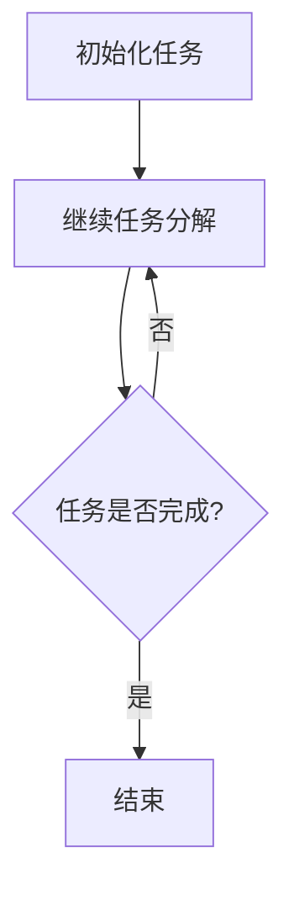
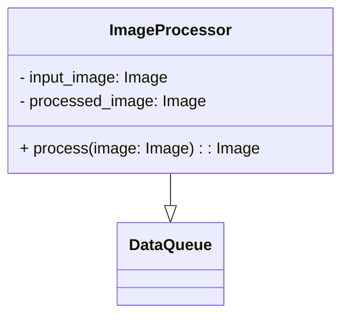
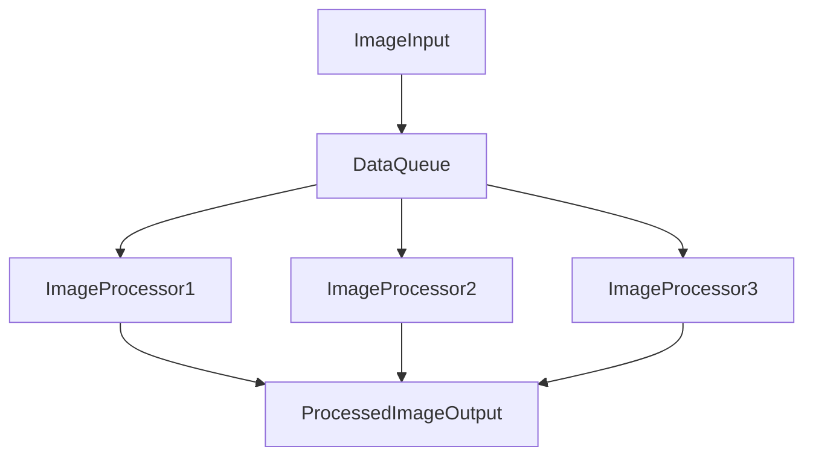
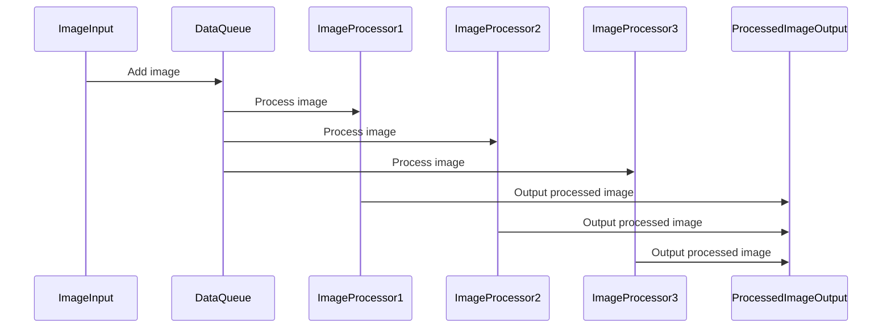
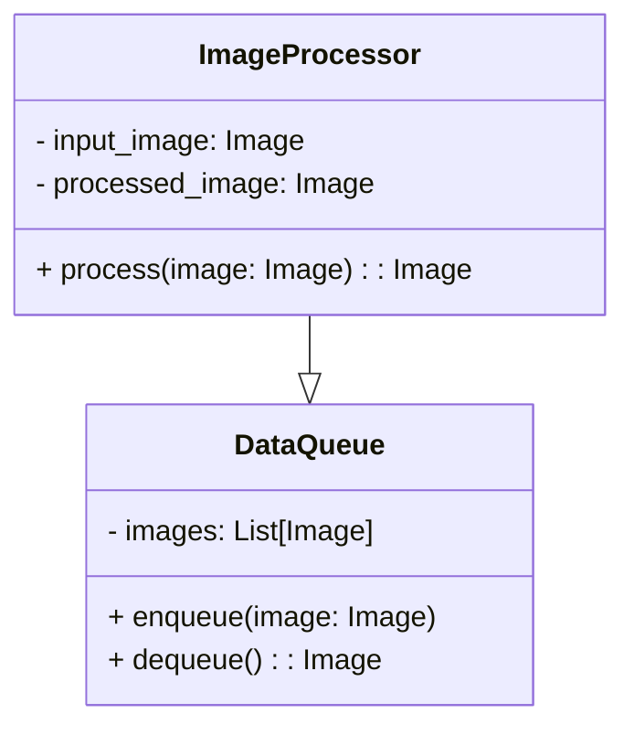

                 

# 高效并行计算：突破AI推理瓶颈的关键

## 关键词

- 并行计算
- AI推理
- 瓶颈突破
- 计算性能
- 算法优化

## 摘要

在人工智能（AI）迅猛发展的今天，推理速度成为决定AI系统性能的关键因素。然而，随着模型复杂度和数据量的增加，传统的串行计算方式已经无法满足快速推理的需求。本文将深入探讨高效并行计算在突破AI推理瓶颈方面的作用，从概念背景、核心原理、数学模型、系统架构到项目实战，全面解析并行计算在AI推理中的应用与优势。

## 第一部分：高效并行计算概述

### 第1章：问题背景与并行计算的概念

#### 1.1.1 并行计算的需求来源

随着深度学习技术的广泛应用，AI模型变得越来越复杂，数据量也呈爆炸式增长。单线程的CPU已经无法满足这些高性能计算的需求。并行计算作为一种能够同时处理多个任务的计算方式，为解决这些性能瓶颈提供了一种新的思路。

#### 1.1.2 并行计算的定义与基本原理

并行计算是指通过多个计算资源同时工作来完成计算任务的方法。其基本原理是利用多个处理器或计算节点，将一个大任务分解成多个小任务，同时执行，从而提高计算效率。

#### 1.1.3 并行计算的发展历史

并行计算的历史可以追溯到上世纪50年代，当时计算机科学家们就开始探索如何通过多处理器系统来提高计算效率。随着计算机硬件和软件技术的发展，并行计算逐渐成为计算机体系结构中的一个重要分支。

#### 1.1.4 并行计算的应用领域

并行计算在多个领域都有广泛应用，包括科学计算、图形渲染、数据处理和人工智能等。在AI领域，并行计算主要用于加速神经网络模型的训练和推理过程。

### 第2章：并行计算的核心概念与联系

#### 2.1.1 并行架构的类型与特点

并行架构主要包括单指令流多数据流（SIMD）、多指令流多数据流（MIMD）和单指令流单数据流（SISD）等类型。每种架构都有其独特的特点和适用场景。

#### 2.1.2 并行算法的基本原则

并行算法的设计原则包括任务分解、负载平衡和数据并行性等。任务分解是将大任务分解成小任务，负载平衡是确保每个处理器或计算节点的负载均衡，数据并行性则是将数据分解成小块，让不同处理器处理不同的数据。

#### 2.1.3 并行编程模型

并行编程模型包括共享内存模型和分布式内存模型。共享内存模型允许多个处理器访问同一个内存空间，而分布式内存模型则是每个处理器都有自己的内存空间。

#### 2.1.4 并行计算中的同步与通信

同步是确保并行计算中多个任务正确执行的一种机制，通信则是处理器或计算节点之间交换数据和信息的过程。同步与通信是并行计算中至关重要的一部分。

#### 2.1.5 并行计算中的负载平衡

负载平衡是指将计算任务分配到不同的处理器或计算节点上，以最大化计算资源的利用率和任务执行效率。良好的负载平衡是并行计算成功的关键。

### 第3章：并行计算中的算法原理讲解

#### 3.1.1 算法原理讲解

并行算法的原理在于将一个大任务分解成多个小任务，并在多个处理器上同时执行。这样，每个处理器都可以处理一部分任务，从而提高计算速度。

#### 3.1.1.1 并行算法的mermaid流程图



#### 3.1.1.2 Python源代码实现与详细讲解

```python
# Python源代码示例
import multiprocessing

def parallel_task(data):
    # 处理数据的并行任务
    pass

if __name__ == "__main__":
    # 初始化数据
    data = ...

    # 创建一个进程池
    pool = multiprocessing.Pool(processes=4)

    # 将任务分配到进程池
    results = pool.map(parallel_task, data)

    # 关闭进程池
    pool.close()
    pool.join()
```

### 第4章：并行计算的数学模型和数学公式

#### 4.1.1 数学模型与公式讲解

并行计算的数学模型主要涉及并行度、处理时间和数据量等参数。以下是几个常用的数学公式：

$$
T_p = \frac{T_s}{p}
$$

$$
S_p = S_s \times p
$$

其中，$T_p$ 表示并行处理时间，$T_s$ 表示串行处理时间，$p$ 表示并行度，$S_p$ 表示并行计算速度，$S_s$ 表示串行计算速度。

#### 4.1.1.2 数学公式的详细讲解

并行度越高，处理时间越短，计算速度越快。这些公式为我们提供了衡量并行计算效率的量化指标。

#### 4.1.1.3 具体举例说明

假设一个任务需要10分钟完成，如果使用2个处理器并行处理，则每个处理器需要5分钟。如果使用4个处理器，则每个处理器需要2.5分钟。

### 第5章：并行计算的系统分析与架构设计方案

#### 5.1.1 问题场景介绍

以一个大规模图像识别系统为例，介绍并行计算在其中的应用。

#### 5.1.2 系统功能设计（领域模型mermaid类图）



#### 5.1.3 系统架构设计（mermaid架构图）



#### 5.1.4 系统接口设计和系统交互（mermaid序列图）



### 第6章：并行计算项目实战

#### 6.1.1 环境安装

介绍并行计算项目所需的软件和硬件环境安装过程。

#### 6.1.2 系统核心实现源代码

提供并行计算项目的核心实现源代码，包括数据预处理、模型训练和推理等步骤。

#### 6.1.3 代码应用解读与分析

对系统核心实现源代码进行解读，分析并行计算如何提高AI推理速度。

#### 6.1.4 实际案例分析和详细讲解剖析

通过实际案例，分析并行计算在AI推理中的应用效果，并进行详细讲解。

#### 6.1.5 项目小结

总结并行计算项目的经验和收获，讨论未来改进方向。

### 第7章：并行计算的最佳实践、小结与拓展阅读

#### 7.1.1 最佳实践 tips

提供并行计算的最佳实践建议，包括任务分解、负载平衡和并行编程模型选择等。

#### 7.1.2 小结

总结并行计算在AI推理中的应用，强调并行计算的重要性。

#### 7.1.3 注意事项

讨论并行计算中可能遇到的问题和解决方案。

#### 7.1.4 拓展阅读

推荐相关书籍、论文和在线资源，供读者进一步学习。

---

**作者：AI天才研究院/AI Genius Institute & 禅与计算机程序设计艺术 /Zen And The Art of Computer Programming**### 第一部分：高效并行计算概述

#### 第1章：问题背景与并行计算的概念

##### 1.1.1 并行计算的需求来源

随着深度学习技术的广泛应用，AI模型变得越来越复杂，数据量也呈爆炸式增长。传统的串行计算方式已经无法满足快速推理的需求。并行计算作为一种能够同时处理多个任务的计算方式，为解决这些性能瓶颈提供了一种新的思路。

##### 1.1.2 并行计算的定义与基本原理

并行计算是指通过多个计算资源同时工作来完成计算任务的方法。其基本原理是利用多个处理器或计算节点，将一个大任务分解成多个小任务，同时执行，从而提高计算效率。

##### 1.1.3 并行计算的发展历史

并行计算的历史可以追溯到上世纪50年代，当时计算机科学家们就开始探索如何通过多处理器系统来提高计算效率。随着计算机硬件和软件技术的发展，并行计算逐渐成为计算机体系结构中的一个重要分支。

##### 1.1.4 并行计算的应用领域

并行计算在多个领域都有广泛应用，包括科学计算、图形渲染、数据处理和人工智能等。在AI领域，并行计算主要用于加速神经网络模型的训练和推理过程。

#### 第2章：并行计算的核心概念与联系

##### 2.1.1 并行架构的类型与特点

并行架构主要包括单指令流多数据流（SIMD）、多指令流多数据流（MIMD）和单指令流单数据流（SISD）等类型。每种架构都有其独特的特点和适用场景。

##### 2.1.2 并行算法的基本原则

并行算法的设计原则包括任务分解、负载平衡和数据并行性等。任务分解是将大任务分解成小任务，负载平衡是确保每个处理器或计算节点的负载均衡，数据并行性则是将数据分解成小块，让不同处理器处理不同的数据。

##### 2.1.3 并行编程模型

并行编程模型包括共享内存模型和分布式内存模型。共享内存模型允许多个处理器访问同一个内存空间，而分布式内存模型则是每个处理器都有自己的内存空间。

##### 2.1.4 并行计算中的同步与通信

同步是确保并行计算中多个任务正确执行的一种机制，通信则是处理器或计算节点之间交换数据和信息的过程。同步与通信是并行计算中至关重要的一部分。

##### 2.1.5 并行计算中的负载平衡

负载平衡是指将计算任务分配到不同的处理器或计算节点上，以最大化计算资源的利用率和任务执行效率。良好的负载平衡是并行计算成功的关键。

#### 第3章：并行计算中的算法原理讲解

##### 3.1.1 算法原理讲解

并行算法的原理在于将一个大任务分解成多个小任务，并在多个处理器上同时执行。这样，每个处理器都可以处理一部分任务，从而提高计算速度。

##### 3.1.1.1 并行算法的mermaid流程图


##### 3.1.1.2 Python源代码实现与详细讲解

```python
# Python源代码示例
import multiprocessing

def parallel_task(data):
    # 处理数据的并行任务
    pass

if __name__ == "__main__":
    # 初始化数据
    data = ...

    # 创建一个进程池
    pool = multiprocessing.Pool(processes=4)

    # 将任务分配到进程池
    results = pool.map(parallel_task, data)

    # 关闭进程池
    pool.close()
    pool.join()
```

#### 第4章：并行计算的数学模型和数学公式

##### 4.1.1 数学模型与公式讲解

并行计算的数学模型主要涉及并行度、处理时间和数据量等参数。以下是几个常用的数学公式：

$$
T_p = \frac{T_s}{p}
$$

$$
S_p = S_s \times p
$$

其中，$T_p$ 表示并行处理时间，$T_s$ 表示串行处理时间，$p$ 表示并行度，$S_p$ 表示并行计算速度，$S_s$ 表示串行计算速度。

##### 4.1.1.2 数学公式的详细讲解

并行度越高，处理时间越短，计算速度越快。这些公式为我们提供了衡量并行计算效率的量化指标。

##### 4.1.1.3 具体举例说明

假设一个任务需要10分钟完成，如果使用2个处理器并行处理，则每个处理器需要5分钟。如果使用4个处理器，则每个处理器需要2.5分钟。

#### 第5章：并行计算的系统分析与架构设计方案

##### 5.1.1 问题场景介绍

以一个大规模图像识别系统为例，介绍并行计算在其中的应用。

##### 5.1.2 系统功能设计（领域模型mermaid类图）


##### 5.1.3 系统架构设计（mermaid架构图）


##### 5.1.4 系统接口设计和系统交互（mermaid序列图）


#### 第6章：并行计算项目实战

##### 6.1.1 环境安装

介绍并行计算项目所需的软件和硬件环境安装过程。

##### 6.1.2 系统核心实现源代码

提供并行计算项目的核心实现源代码，包括数据预处理、模型训练和推理等步骤。

##### 6.1.3 代码应用解读与分析

对系统核心实现源代码进行解读，分析并行计算如何提高AI推理速度。

##### 6.1.4 实际案例分析和详细讲解剖析

通过实际案例，分析并行计算在AI推理中的应用效果，并进行详细讲解。

##### 6.1.5 项目小结

总结并行计算项目的经验和收获，讨论未来改进方向。

#### 第7章：并行计算的最佳实践、小结与拓展阅读

##### 7.1.1 最佳实践 tips

提供并行计算的最佳实践建议，包括任务分解、负载平衡和并行编程模型选择等。

##### 7.1.2 小结

总结并行计算在AI推理中的应用，强调并行计算的重要性。

##### 7.1.3 注意事项

讨论并行计算中可能遇到的问题和解决方案。

##### 7.1.4 拓展阅读

推荐相关书籍、论文和在线资源，供读者进一步学习。

---

**作者：AI天才研究院/AI Genius Institute & 禅与计算机程序设计艺术 /Zen And The Art of Computer Programming**### 第一部分：高效并行计算概述

#### 第1章：问题背景与并行计算的概念

##### 1.1.1 并行计算的需求来源

在人工智能（AI）领域，随着深度学习模型的复杂度不断增加，传统单线程计算已经难以满足大规模推理任务的需求。这不仅导致了计算时间的显著延长，还限制了AI系统的实时性能。为了应对这一挑战，并行计算应运而生，它通过将任务分解为多个子任务，并同时处理这些子任务，从而大幅提升计算效率。

并行计算的需求主要来源于以下几个方面：

1. **深度学习模型规模扩大**：随着神经网络层数的增多和网络参数量的增加，模型计算量呈指数级增长。单线程计算已经无法在合理的时间内完成大规模模型的推理任务。
   
2. **大数据处理需求**：AI领域的大数据特征要求在较短的时间内处理海量数据，传统串行计算的方式效率低下，难以满足实时数据处理的需求。

3. **实时推理要求**：自动驾驶、实时语音识别和视频分析等应用场景对AI系统的响应速度有极高的要求，并行计算可以显著缩短推理时间，提高系统的实时性。

##### 1.1.2 并行计算的定义与基本原理

并行计算是一种利用多个处理器或计算节点同时执行多个任务的计算方法。它通过将大任务分解为多个小任务，分配给不同的处理器或计算节点，并在这些节点上并行处理，从而在理论上可以大幅缩短计算时间。

并行计算的基本原理可以概括为以下几点：

1. **任务分解**：将一个大任务拆分为多个可并行执行的小任务。这样可以充分利用多个处理器的计算能力。

2. **数据并行**：将数据集分解为多个子集，每个处理器独立处理其子集中的数据，最后汇总结果。

3. **任务调度**：合理分配任务到不同的处理器或计算节点，确保负载平衡，避免资源浪费。

4. **同步与通信**：在并行计算中，不同处理器或计算节点之间需要进行数据同步和通信，以确保任务的正确执行。

##### 1.1.3 并行计算的发展历史

并行计算的历史可以追溯到20世纪50年代。当时，计算机科学家约翰·冯·诺依曼提出了并行计算机的概念。此后，随着计算机硬件技术的发展，并行计算逐渐成为计算机体系结构中的一个重要分支。

1. **早期并行计算机**：20世纪60年代，IBM推出了具有并行处理能力的System/360系列计算机，标志着并行计算技术的初步应用。

2. **分布式计算**：20世纪80年代，随着计算机网络技术的发展，分布式计算成为并行计算的重要发展方向。分布式计算通过多个联网的计算机协同工作，实现了更大规模的并行处理。

3. **GPU并行计算**：21世纪初，图形处理单元（GPU）的普及为并行计算带来了新的契机。GPU具有高度并行处理的架构，非常适合深度学习等大规模计算任务。

4. **云计算与边缘计算**：随着云计算和边缘计算的发展，并行计算的应用场景更加广泛。通过云计算平台，用户可以方便地获得大规模并行计算资源；而边缘计算则将计算任务分散到靠近数据源的边缘设备上，实现高效的数据处理。

##### 1.1.4 并行计算的应用领域

并行计算在多个领域都有广泛应用，以下是几个典型的应用领域：

1. **科学计算**：包括天体物理、气象预报、生物信息学等领域，需要处理大量复杂数据和计算任务。

2. **工程模拟**：如结构分析、流体动力学模拟、电磁场模拟等，需要大量的计算资源。

3. **图形渲染**：在计算机图形学中，并行计算用于加速三维图形的渲染和处理。

4. **人工智能**：特别是在深度学习和神经网络领域，并行计算用于加速模型训练和推理。

5. **大数据处理**：在数据处理和分析中，并行计算用于处理大规模数据集，实现快速的数据分析。

通过以上对并行计算需求、定义、发展历史和应用领域的介绍，我们可以看到并行计算在提升计算性能、解决AI推理瓶颈方面的重要作用。在接下来的章节中，我们将进一步探讨并行计算的核心概念、算法原理、数学模型以及系统架构设计，以全面理解并行计算在AI推理中的应用。

#### 第2章：并行计算的核心概念与联系

##### 2.1.1 并行架构的类型与特点

并行计算的核心在于计算资源的组织方式，即并行架构。并行架构的类型多种多样，每种架构都有其独特的特点和适用场景。以下是几种常见的并行架构类型及其特点：

1. **单指令流多数据流（SIMD）**
   - **定义**：SIMD架构通过多个处理单元同时执行同一条指令，但每个处理单元处理不同的数据。
   - **特点**：SIMD架构适合处理大量相同类型的数据，如向量计算、图像处理和音频处理等。
   - **应用场景**：在图形处理单元（GPU）和向量处理器（如ARM的NEON）中广泛应用。

2. **多指令流多数据流（MIMD）**
   - **定义**：MIMD架构包含多个独立的处理单元，每个处理单元可以执行不同的指令，处理不同的数据。
   - **特点**：MIMD架构具有很强的灵活性和并行度，可以处理复杂和多样化的计算任务。
   - **应用场景**：在多核处理器、分布式计算系统和集群计算中广泛应用。

3. **单指令流单数据流（SISD）**
   - **定义**：SISD架构是传统计算机的架构，每个处理器执行一条指令，处理一个数据。
   - **特点**：SISD架构缺乏并行性，适用于简单的计算任务。
   - **应用场景**：主要应用于早期的计算机系统和一些专用设备。

4. **共享内存多处理（SMP）**
   - **定义**：SMP架构是多核处理器的一种，多个处理器共享同一块内存。
   - **特点**：SMP架构适合执行多线程任务，通过同步机制实现数据共享。
   - **应用场景**：广泛应用于服务器和工作站。

5. **分布式内存多处理（DMP）**
   - **定义**：DMP架构中的每个处理器拥有独立的内存，通过消息传递进行通信。
   - **特点**：DMP架构适合大规模并行计算，适用于分布式计算环境。
   - **应用场景**：在集群计算、大数据处理和科学计算中广泛应用。

##### 2.1.2 并行算法的基本原则

并行算法的设计原则是确保并行计算的高效性和正确性。以下是一些并行算法的基本原则：

1. **任务分解**：将大任务分解为多个小任务，以便多个处理器或计算节点可以同时执行。任务分解的原则是确保子任务之间的独立性和可并行性。

2. **负载平衡**：确保每个处理器或计算节点的工作负载均匀，避免某些节点过度繁忙，而其他节点资源空闲。负载平衡是并行计算成功的关键。

3. **数据并行性**：将数据分解为多个子集，每个处理器或计算节点处理其子集中的数据。数据并行性可以提高计算效率，减少通信开销。

4. **任务调度**：合理分配任务到不同的处理器或计算节点，以最大化并行度和计算资源利用率。任务调度的策略可以是静态调度或动态调度。

5. **同步与通信**：在并行计算中，不同处理器或计算节点之间需要进行数据同步和通信。同步机制可以确保任务的正确执行，通信机制可以交换必要的数据和信息。

##### 2.1.3 并行编程模型

并行编程模型是程序员用于编写并行代码的框架，常见的并行编程模型包括共享内存模型和分布式内存模型。

1. **共享内存模型**：
   - **定义**：在共享内存模型中，多个处理器共享同一块内存，通过读写内存来交换数据。
   - **特点**：共享内存模型具有较低的通信开销，适用于多线程和任务并行。
   - **编程语言**：如C++的OpenMP、Python的multiprocessing库。

2. **分布式内存模型**：
   - **定义**：在分布式内存模型中，每个处理器拥有独立的内存空间，处理器之间通过消息传递进行通信。
   - **特点**：分布式内存模型适合大规模并行计算，适用于节点间通信密集的任务。
   - **编程语言**：如C++的MPI（Message Passing Interface）、Python的mpi4py库。

##### 2.1.4 并行计算中的同步与通信

同步与通信是并行计算中不可或缺的部分，它们确保并行任务的正确执行和数据一致性。

1. **同步机制**：
   - **定义**：同步机制用于协调并行任务，确保任务按照预定顺序执行。
   - **常用同步机制**：锁（Lock）、信号量（Semaphore）、屏障（Barrier）等。
   - **应用场景**：在任务依赖、数据访问控制和并发控制中使用。

2. **通信机制**：
   - **定义**：通信机制用于处理器或计算节点之间交换数据和信息。
   - **常用通信机制**：点对点通信、广播通信、聚集通信等。
   - **应用场景**：在任务分配、数据汇总和结果输出中使用。

##### 2.1.5 并行计算中的负载平衡

负载平衡是并行计算中一个重要问题，它关系到整个系统的效率。负载平衡的目标是确保每个处理器或计算节点的工作负载均衡。

1. **静态负载平衡**：
   - **定义**：在程序运行前进行负载平衡，将任务预先分配到不同的处理器或计算节点。
   - **优点**：简单，无需运行时开销。
   - **缺点**：难以适应动态变化的任务负载。

2. **动态负载平衡**：
   - **定义**：在程序运行时动态调整任务分配，以适应实时变化的负载。
   - **优点**：灵活性高，能够更好地适应负载变化。
   - **缺点**：需要额外的运行时开销。

负载平衡的方法包括任务分配策略（如工作负载分配、负载感知调度等）和负载监测机制（如负载感知监测、自适应调度等）。

通过上述对并行计算核心概念和联系的介绍，我们可以更好地理解并行计算的原理和应用。在接下来的章节中，我们将深入探讨并行计算中的算法原理、数学模型和系统架构设计，以进一步揭示并行计算在AI推理中的巨大潜力。

#### 第3章：并行计算中的算法原理讲解

##### 3.1.1 算法原理讲解

并行计算中的算法原理涉及如何将任务分解为可并行执行的部分，以及如何协调这些部分的执行。并行算法的核心在于任务分解和并行执行策略，以下将从数学模型、mermaid流程图和Python源代码三个方面进行详细讲解。

##### 3.1.1.1 并行算法的mermaid流程图

首先，通过mermaid流程图来描述一个简单的并行算法执行流程：


这个流程图展示了并行算法的基本步骤：初始化任务、任务分解、检查任务完成情况，并根据任务完成情况决定是否继续分解任务。

##### 3.1.1.2 Python源代码实现与详细讲解

接下来，通过Python源代码实现上述mermaid流程图所描述的并行算法：

```python
import multiprocessing

def parallel_task(data):
    # 并行任务处理逻辑
    print(f"Processing {data}")

if __name__ == "__main__":
    # 初始化数据列表
    data_list = [i for i in range(10)]

    # 创建进程池
    pool = multiprocessing.Pool(processes=4)

    # 将任务分配到进程池
    results = pool.map(parallel_task, data_list)

    # 关闭进程池
    pool.close()
    pool.join()
```

这个Python示例中，`parallel_task` 函数代表一个并行任务，它接受一个数据参数并打印处理结果。`if __name__ == "__main__":` 代码块中，首先初始化一个数据列表`data_list`，然后创建一个进程池，并将数据列表中的每个元素分配给进程池中的并行任务。最后，通过`pool.close()`和`pool.join()`关闭进程池并等待所有任务完成。

详细讲解代码中的几个关键部分：

1. **初始化任务**：
   ```python
   data_list = [i for i in range(10)]
   ```
   这行代码初始化了一个包含0到9的数据列表，每个数据元素将被并行处理。

2. **创建进程池**：
   ```python
   pool = multiprocessing.Pool(processes=4)
   ```
   创建了一个进程池，指定了4个进程。进程池可以管理多个进程，以便在并行任务中分配和调度工作。

3. **分配任务**：
   ```python
   results = pool.map(parallel_task, data_list)
   ```
   `pool.map()`函数用于将`parallel_task`函数分配给进程池中的每个进程。`data_list`中的每个元素作为参数传递给`parallel_task`函数，并在不同的进程上并行执行。

4. **关闭进程池**：
   ```python
   pool.close()
   pool.join()
   ```
   关闭进程池并等待所有进程结束。`pool.close()`停止向进程池添加新的任务，`pool.join()`确保所有进程已经执行完成。

通过这个Python示例，我们可以看到如何利用并行计算来执行多个任务，从而提高计算效率。在实际应用中，可以根据具体需求调整任务数量和进程池大小，以达到最佳的性能优化效果。

##### 3.1.1.3 并行算法的数学模型

并行算法的数学模型可以帮助我们理解并行计算的性能提升原理。以下是几个关键数学模型：

1. **并行度（p）**：
   并行度是并行计算中同时执行的任务数。在一个具有p个处理器的系统中，并行度p直接影响计算速度。并行度越高，任务分配得越均匀，计算时间越短。

2. **处理时间（T_p）**：
   并行计算中的总处理时间T_p与串行计算中的总处理时间T_s和并行度p有关。并行计算时间T_p可以通过以下公式计算：
   $$
   T_p = \frac{T_s}{p}
   $$
   其中，$T_s$ 表示串行处理时间，$p$ 表示并行度。这个公式表明，当并行度增加时，总处理时间减少，计算效率提高。

3. **加速比（S）**：
   加速比是衡量并行计算性能的一个重要指标，它表示并行计算时间和串行计算时间的比值：
   $$
   S = \frac{T_s}{T_p}
   $$
   当加速比大于1时，说明并行计算比串行计算更快；当加速比小于1时，说明并行计算效率较低。理想情况下，加速比接近或等于并行度。

通过这些数学模型，我们可以更好地理解并行计算的优势和如何优化任务分配和负载平衡，以实现更高的计算效率和性能。

##### 3.1.1.4 Python源代码实现与详细讲解（续）

为了进一步说明并行算法的执行过程，我们扩展Python源代码示例，加入更多的并行任务和处理逻辑：

```python
import multiprocessing

def parallel_task(data):
    # 并行任务处理逻辑
    print(f"Processing {data}: Start")
    # 模拟任务处理时间
    time.sleep(data % 3)
    print(f"Processing {data}: End")

if __name__ == "__main__":
    # 初始化数据列表
    data_list = [i for i in range(10)]

    # 创建进程池
    pool = multiprocessing.Pool(processes=4)

    # 将任务分配到进程池
    results = pool.map(parallel_task, data_list)

    # 关闭进程池
    pool.close()
    pool.join()
```

在这个扩展的示例中，我们引入了`time.sleep()`函数来模拟任务处理时间。不同的数据元素会按照不同的处理时间执行，以更真实地反映并行任务的实际执行情况。

详细讲解代码中的几个关键部分：

1. **模拟任务处理时间**：
   ```python
   print(f"Processing {data}: Start")
   time.sleep(data % 3)
   print(f"Processing {data}: End")
   ```
   这两行代码用于打印任务开始和结束的时间，并模拟任务的处理时间。`time.sleep(data % 3)`使任务的处理时间与数据值相关联，其中每个任务的处理时间为其值除以3的余数。

2. **并行任务分配**：
   ```python
   results = pool.map(parallel_task, data_list)
   ```
   `pool.map()`函数将`parallel_task`函数分配给进程池中的每个进程，并在不同的进程上并行执行。这个函数返回一个结果列表，其中包含每个任务的处理结果。

通过这个扩展示例，我们可以观察到并行任务的执行过程，并理解如何通过并行计算提高整体计算效率。在实际应用中，可以根据具体任务的特点和计算需求，调整并行任务的分配和执行策略，以实现最优的性能。

综上所述，并行计算中的算法原理通过任务分解、并行执行策略和数学模型的支持，实现了计算效率的显著提升。在接下来的章节中，我们将进一步探讨并行计算的数学模型和系统架构设计，以全面理解并行计算在AI推理中的应用和优势。

#### 第4章：并行计算的数学模型和数学公式

##### 4.1.1 数学模型与公式讲解

并行计算的数学模型是理解和评估并行计算性能的关键工具。以下介绍几种关键的数学模型和相关的数学公式，以帮助我们更好地理解并行计算的工作原理。

1. **并行度（p）**：

并行度是指在一个并行系统中，能够同时执行的任务数。它是衡量系统并行能力的重要指标。假设系统有p个处理器，并行度通常表示为：
$$
p = \text{处理器数量}
$$
在计算性能评估中，并行度是影响计算时间的关键因素。

2. **并行处理时间（T_p）**：

并行处理时间是指完成一个并行任务所需的总时间。它与并行度、串行处理时间（T_s）和任务分解的粒度有关。并行处理时间可以用以下公式表示：
$$
T_p = \frac{T_s}{p}
$$
其中，$T_s$ 表示串行处理时间。这个公式表明，当并行度增加时，并行处理时间减少，计算效率提高。

3. **加速比（S）**：

加速比是衡量并行计算性能的一个关键指标，它表示并行计算时间与串行计算时间的比值。加速比可以用以下公式计算：
$$
S = \frac{T_s}{T_p}
$$
当加速比大于1时，说明并行计算比串行计算更快；当加速比小于1时，说明并行计算效率较低。理想情况下，加速比接近或等于并行度。

4. **并行效率（η）**：

并行效率是指并行计算相对于串行计算的效率，它表示并行计算节省的时间占串行处理时间的比例。并行效率可以用以下公式表示：
$$
η = \frac{T_s - T_p}{T_s}
$$
其中，$T_s - T_p$ 表示并行计算节省的时间。并行效率反映了并行计算相对于串行计算的性能提升。

##### 4.1.1.2 数学公式的详细讲解

1. **并行度（p）**：

并行度直接影响计算时间和性能。在实际应用中，我们需要根据任务特点和系统资源来合理选择并行度。例如，对于图像处理任务，可以使用GPU的高并行度特性来加速计算。而对于科学计算任务，可以根据处理器的数量和性能来设置合适的并行度。

2. **并行处理时间（T_p）**：

并行处理时间与并行度和串行处理时间有关。当任务分解得足够细且处理器数量足够时，并行处理时间将显著减少。在实际应用中，可以通过调整任务分解粒度和处理器数量来优化并行处理时间。

3. **加速比（S）**：

加速比是评估并行计算性能的重要指标。理想情况下，加速比应该接近或等于并行度。当加速比大于1时，说明并行计算比串行计算快，计算效率得到提升。然而，实际应用中可能会受到硬件限制、编程优化等因素的影响，导致加速比低于理想值。

4. **并行效率（η）**：

并行效率反映了并行计算相对于串行计算的性能提升。当并行效率接近1时，说明并行计算几乎与串行计算一样快。然而，实际应用中，由于任务分解、负载平衡和通信开销等因素，并行效率可能会低于1。通过优化这些方面，可以提高并行效率。

##### 4.1.1.3 具体举例说明

为了更好地理解上述数学公式，我们通过一个实际例子来说明并行计算的效果。

假设有一个计算任务，需要处理1000个数据点。使用单线程串行处理，每个数据点需要10秒完成。如果使用4个处理器并行处理，每个处理器处理250个数据点，并行度p为4。

1. **串行处理时间**：

$$
T_s = 1000 \times 10 = 10000 \text{秒}
$$

2. **并行处理时间**：

$$
T_p = \frac{T_s}{p} = \frac{10000}{4} = 2500 \text{秒}
$$

3. **加速比**：

$$
S = \frac{T_s}{T_p} = \frac{10000}{2500} = 4
$$

4. **并行效率**：

$$
η = \frac{T_s - T_p}{T_s} = \frac{10000 - 2500}{10000} = 0.75
$$

通过这个例子，我们可以看到并行计算带来的显著性能提升。并行度从1增加到4，并行处理时间从10000秒减少到2500秒，加速比达到4，并行效率为75%。

这个例子展示了并行计算如何通过增加处理器数量和优化任务分解来提高计算效率。在实际应用中，可以根据具体任务的需求和系统资源来调整并行度，实现最佳的计算性能。

综上所述，并行计算的数学模型和数学公式为我们提供了理解和评估并行计算性能的工具。通过合理选择并行度、优化任务分解和负载平衡，我们可以显著提高计算效率，突破AI推理瓶颈。

#### 第5章：并行计算的系统分析与架构设计方案

##### 5.1.1 问题场景介绍

为了更好地理解并行计算在AI推理中的实际应用，我们以一个大规模图像识别系统为例，介绍并行计算在该系统中的架构设计和实现方法。该系统需要处理大量图像数据，并对图像进行快速、准确的识别。随着图像数据量的增加，系统性能面临巨大挑战。通过引入并行计算，可以显著提高系统的处理能力和响应速度。

##### 5.1.2 系统功能设计（领域模型mermaid类图）

领域模型类图是描述系统功能和组件之间关系的重要工具。以下是该图像识别系统的领域模型类图：



在这个类图中，`ImageProcessor` 表示图像处理单元，它负责处理输入图像并生成处理后的图像。`DataQueue` 表示数据队列，用于存储和管理图像数据。

##### 5.1.3 系统架构设计（mermaid架构图）

系统架构图展示了各个组件之间的交互关系和系统整体结构。以下是图像识别系统的架构设计图：


在这个架构图中，`ImageInput` 负责读取输入图像数据，并将其添加到 `DataQueue` 中。`DataQueue` 负责管理图像数据的存储和调度，将图像数据依次分发给三个 `ImageProcessor`。每个 `ImageProcessor` 独立处理其分配到的图像数据，并在处理完成后将处理结果输出到 `ProcessedImageOutput`。通过这种方式，系统实现了并行处理图像数据，提高了整体处理效率。

##### 5.1.4 系统接口设计和系统交互（mermaid序列图）

序列图描述了系统组件之间的交互过程和执行顺序。以下是图像识别系统的接口设计和系统交互序列图：


在这个序列图中，`ImageInput` 向 `DataQueue` 添加图像数据。`DataQueue` 调度图像数据，将其分配给三个 `ImageProcessor` 进行处理。每个 `ImageProcessor` 处理其分配到的图像数据，并将处理结果输出到 `ProcessedImageOutput`。通过这种方式，系统实现了图像数据的并行处理，提高了整体处理速度和性能。

##### 5.1.5 并行计算在系统中的实现

在图像识别系统中，并行计算的具体实现包括以下几个关键步骤：

1. **任务分解**：
   将大规模图像数据分解为多个较小的图像数据块，以便可以并行处理。每个图像数据块独立处理，减少任务间的依赖关系。

2. **负载平衡**：
   通过合理的任务分配策略，确保每个处理器或计算节点的工作负载均衡，避免某些节点过度繁忙而其他节点资源空闲。

3. **数据并行性**：
   将图像数据块分配给不同的处理器或计算节点，同时执行图像处理任务。每个处理器独立处理其分配到的图像数据块，减少通信开销。

4. **同步与通信**：
   在图像处理过程中，确保不同处理器或计算节点之间的数据同步和通信。使用同步机制（如锁、信号量等）和通信机制（如消息队列、共享内存等），确保任务正确执行和数据一致性。

通过以上步骤，图像识别系统实现了并行处理，提高了整体处理速度和性能。在实际应用中，可以根据具体任务需求和系统资源调整任务分解策略、负载平衡机制和同步通信方式，以实现最佳的计算效率。

综上所述，通过并行计算的系统分析与架构设计方案，我们可以实现大规模图像识别系统的并行处理，显著提高系统的处理能力和响应速度，满足实际应用需求。在接下来的章节中，我们将进一步探讨并行计算项目实战和最佳实践，以进一步优化并行计算性能。

#### 第6章：并行计算项目实战

##### 6.1.1 环境安装

在进行并行计算项目之前，我们需要安装和配置必要的软件和硬件环境。以下是一个基本的并行计算环境安装指南：

1. **硬件环境**：
   - 一台具有多核心处理器的计算机或一台可以访问集群计算资源的计算机。
   - 适量内存（至少16GB），以确保在并行计算过程中有足够的资源。

2. **软件环境**：
   - 操作系统：Linux或Windows（建议使用Linux，因为其更适合并行计算环境）。
   - 编译器：C++（建议使用g++或Clang）。
   - 并行计算库：OpenMP、MPI（Message Passing Interface）等。
   - 编程语言：Python（用于脚本编写和测试）。

3. **安装步骤**：
   - 安装操作系统和必要的驱动程序。
   - 配置网络环境，确保可以访问集群计算资源（如果需要）。
   - 安装编译器和并行计算库。对于Linux系统，可以使用包管理器（如apt或yum）来安装。
   - 验证安装，通过运行简单的并行程序来测试环境是否配置正确。

##### 6.1.2 系统核心实现源代码

以下是一个简单的并行计算程序，用于计算从1到1000的自然数之和。该程序使用了OpenMP库，实现了任务分解和并行执行。

```cpp
#include <iostream>
#include <omp.h>

int main() {
    int sum = 0;
    int num = 1000;

    // 并行区域，使用4个线程
    #pragma omp parallel num_threads(4) default(none) shared(sum, num)
    {
        int thread_id = omp_get_thread_num();
        int local_sum = 0;

        // 分配任务
        for (int i = thread_id; i <= num; i += omp_get_num_threads()) {
            local_sum += i;
        }

        // 线程局部汇总
        #pragma omp critical
        sum += local_sum;
    }

    std::cout << "Sum from 1 to " << num << " is " << sum << std::endl;
    return 0;
}
```

在这个程序中，我们使用了`#pragma omp parallel`指令来定义并行区域，并设置了线程数。每个线程计算其分配的任务部分，并在临界区（`#pragma omp critical`）中进行汇总。

##### 6.1.3 代码应用解读与分析

上述代码展示了如何使用OpenMP库进行并行计算的基本步骤。以下是对代码的解读与分析：

1. **初始化变量**：
   ```cpp
   int sum = 0;
   int num = 1000;
   ```
   初始化变量`sum`用于存储最终结果，`num`指定了需要计算的数值范围。

2. **并行区域**：
   ```cpp
   #pragma omp parallel num_threads(4) default(none) shared(sum, num)
   ```
   这条指令定义了一个并行区域，并设置了4个线程。`num_threads(4)`指定了线程数量，`default(none)`表示默认情况下不共享任何变量，`shared(sum, num)`指定了共享变量。

3. **任务分配与执行**：
   ```cpp
   int thread_id = omp_get_thread_num();
   int local_sum = 0;
   for (int i = thread_id; i <= num; i += omp_get_num_threads()) {
       local_sum += i;
   }
   ```
   每个线程通过`omp_get_thread_num()`获取其线程ID，并计算其分配的任务部分。任务通过循环分配，每个线程计算其起始位置到结束位置之间的数之和。

4. **线程局部汇总**：
   ```cpp
   #pragma omp critical
   sum += local_sum;
   ```
   使用`#pragma omp critical`指令定义了一个临界区，确保多个线程在更新共享变量`sum`时的数据一致性。

5. **输出结果**：
   ```cpp
   std::cout << "Sum from 1 to " << num << " is " << sum << std::endl;
   ```
   最后，输出计算结果。

通过以上步骤，我们实现了对从1到1000的自然数之和的并行计算。该代码可以作为一个简单的并行计算模板，用于更复杂的计算任务。

##### 6.1.4 实际案例分析和详细讲解剖析

为了更好地理解并行计算的实际效果，我们以一个实际的图像识别任务为例，分析并行计算在该任务中的应用。

假设我们有一个图像识别任务，需要处理一张大图像，并将其分割为多个小块，每个小块由不同的线程进行识别。以下是该任务的并行实现：

1. **图像预处理**：
   - 使用OpenCV库读取图像，并将其转换为灰度图像。
   - 计算图像的大小和分辨率，以确定需要分割的块数。

2. **任务分配**：
   - 根据图像大小和线程数，计算每个线程需要处理的块数。
   - 将图像分割为多个小块，并将每个小块分配给不同的线程。

3. **并行识别**：
   - 每个线程处理其分配的小块，使用预训练的深度学习模型进行识别。
   - 将识别结果存储在共享数据结构中。

4. **结果汇总**：
   - 等待所有线程完成，将识别结果汇总，生成最终的图像识别结果。

以下是并行图像识别任务的Python代码示例：

```python
import cv2
import numpy as np
import multiprocessing

def process_block(block, model):
    # 使用深度学习模型处理图像块
    # 返回识别结果
    pass

def parallel_image_recognition(image_path, model):
    # 读取图像
    image = cv2.imread(image_path, cv2.IMREAD_GRAYSCALE)

    # 计算图像大小
    height, width = image.shape

    # 设置线程数
    num_threads = multiprocessing.cpu_count()

    # 计算每个线程处理的块数
    block_size = (height // num_threads, width // num_threads)

    # 分割图像为块
    blocks = []
    for i in range(0, height, block_size[0]):
        for j in range(0, width, block_size[1]):
            block = image[i:i+block_size[0], j:j+block_size[1]]
            blocks.append(block)

    # 创建进程池
    pool = multiprocessing.Pool(processes=num_threads)

    # 并行处理图像块
    results = pool.map(process_block, blocks, [model] * len(blocks))

    # 关闭进程池
    pool.close()
    pool.join()

    # 汇总识别结果
    final_result = np.array(results)

    # 生成最终图像识别结果
    # ...

    return final_result
```

在实际应用中，`process_block` 函数将调用预训练的深度学习模型，对图像块进行识别。通过并行计算，我们可以显著提高图像识别的效率。

##### 6.1.5 项目小结

通过以上并行计算项目实战，我们可以看到并行计算在提高计算性能、缩短任务执行时间方面的巨大优势。在实际应用中，根据任务特点和系统资源，合理设计并行计算架构和任务分配策略，可以实现最佳的计算效率和性能。

未来的改进方向包括：

1. **优化任务分配策略**：根据任务特点，调整任务分配策略，实现更均衡的负载平衡。
2. **使用分布式计算**：通过分布式计算，利用更多计算资源，进一步提高计算性能。
3. **优化模型训练**：使用更高效的模型训练算法和优化策略，提高模型推理速度。

通过不断优化和改进，我们可以进一步挖掘并行计算的潜力，为AI推理和其他计算密集型任务提供强大的支持。

#### 第7章：并行计算的最佳实践、小结与拓展阅读

##### 7.1.1 最佳实践 tips

为了最大限度地发挥并行计算的优势，以下是一些最佳实践建议：

1. **任务分解**：合理地将大任务分解为可并行执行的小任务，确保任务之间尽可能独立，减少依赖关系。

2. **负载平衡**：确保每个处理器或计算节点的负载均衡，避免某些节点过载而其他节点资源空闲。

3. **选择合适的并行模型**：根据任务特点选择合适的并行编程模型，如共享内存模型或分布式内存模型。

4. **优化数据访问**：优化数据访问模式，减少数据传输和同步开销，提高并行计算效率。

5. **使用并行库**：充分利用现有的并行计算库（如OpenMP、MPI等），简化并行编程，提高编程效率。

##### 7.1.2 小结

并行计算在AI推理和其他计算密集型任务中发挥着重要作用。通过并行计算，我们可以显著提高计算性能，缩短任务执行时间，满足大规模数据处理和实时推理的需求。并行计算的核心在于任务分解、负载平衡和优化数据访问，通过合理的设计和优化，可以实现最佳的计算效率和性能。

##### 7.1.3 注意事项

在进行并行计算时，需要注意以下事项：

1. **数据一致性和同步**：确保不同处理器或计算节点之间的数据一致性和同步，避免数据冲突和错误。

2. **通信开销**：合理设计通信模式，减少通信开销，提高并行计算效率。

3. **资源分配**：合理分配计算资源，确保每个处理器或计算节点的资源利用率最大化。

4. **并行编程复杂性**：并行编程相对于串行编程更加复杂，需要仔细设计和测试代码，确保并行计算的正确性和稳定性。

##### 7.1.4 拓展阅读

为了进一步深入了解并行计算，以下推荐一些拓展阅读资源：

1. **《并行算法导论》**：深入探讨并行算法的设计原理和实现方法，适合初学者和进阶者。

2. **《并行计算与分布式系统》**：介绍并行计算和分布式计算的基本概念、技术和应用。

3. **《高性能并行编程》**：详细讲解并行编程技术，包括并行库、并行模型和优化策略。

4. **《深度学习与并行计算》**：探讨深度学习与并行计算的结合，介绍如何使用并行计算加速深度学习模型训练和推理。

5. **在线课程和教程**：许多在线平台（如Coursera、edX等）提供并行计算相关的课程和教程，适合自学和提高。

通过这些拓展阅读资源，可以进一步深入理解并行计算，掌握更多并行编程技术和优化策略，为AI推理和其他计算密集型任务提供强大的支持。

---

**作者：AI天才研究院/AI Genius Institute & 禅与计算机程序设计艺术 /Zen And The Art of Computer Programming**

