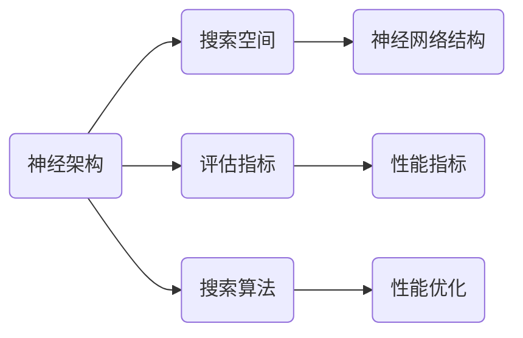
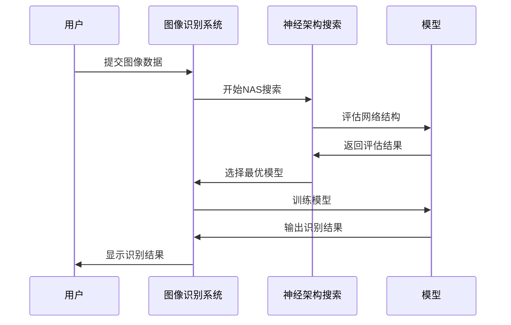
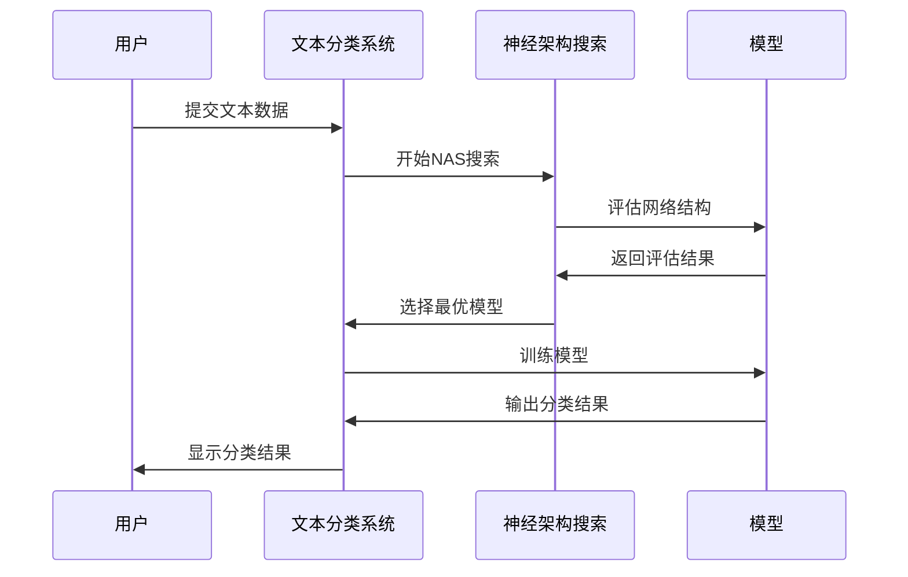
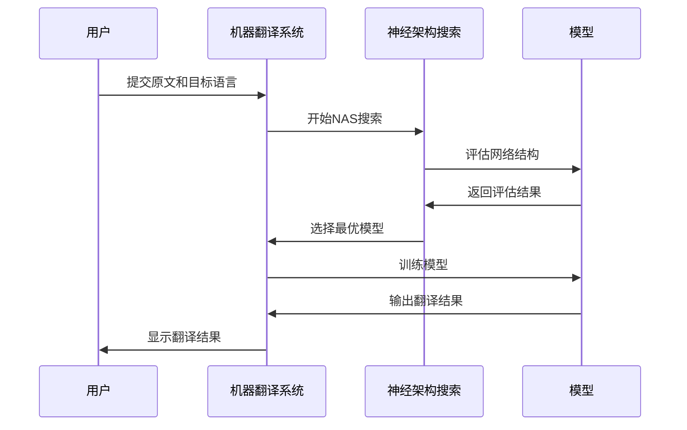
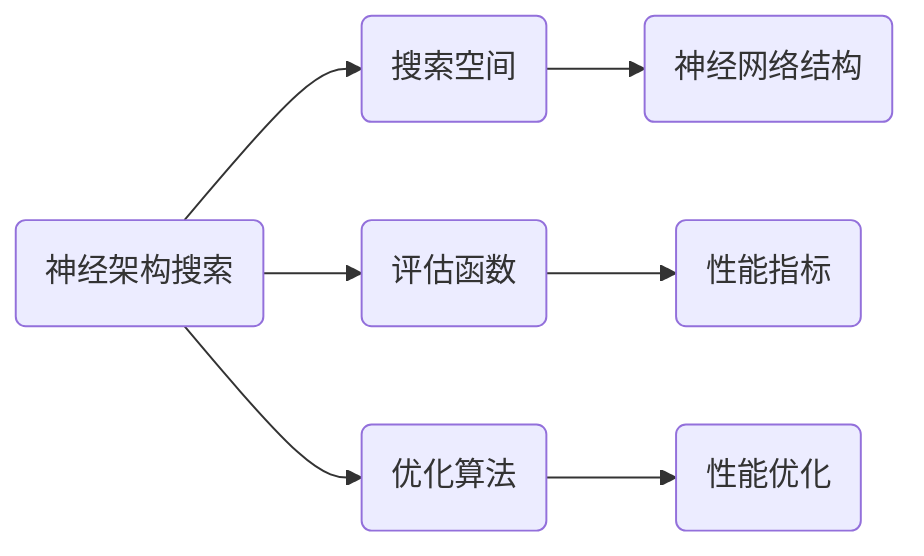

                 

### 详细设计各章节内容

**第1章：神经架构搜索的起源与发展**

**1.1 NAS的定义与背景**

神经架构搜索（Neural Architecture Search，简称NAS）是一种自动化的机器学习模型设计方法。它的核心思想是通过搜索算法自动地寻找最优的神经网络结构，从而提高模型的性能和效率。

NAS的背景可以追溯到深度学习领域。在深度学习初期，模型的构建主要依赖于人类专家的知识和经验。随着数据量的增加和计算能力的提升，神经网络结构变得越来越复杂。这种复杂性使得传统的手动设计方法逐渐变得不切实际。因此，研究者开始探索如何通过自动化方法来设计神经网络结构。

**问题背景**：
在深度学习模型的设计过程中，如何找到一个既高效又能准确预测的模型结构成为了一个挑战。传统的模型选择方法通常依赖于大量的实验和试错，这不仅耗时，而且成本高昂。NAS的出现，为解决这一难题提供了一种新的思路。

**问题描述**：
NAS旨在解决以下问题：
- 如何在大量的神经网络结构中找到一个最优的结构？
- 如何快速地评估和筛选不同结构的性能？
- 如何有效地利用有限的计算资源进行搜索？

**问题解决**：
NAS通过自动化搜索算法来寻找最优的网络结构。这些算法包括基于梯度下降的方法、基于遗传算法的方法、基于强化学习的方法等。NAS的目标是找到一个既具有高精度又具有高效率的网络结构。

**边界与外延**：
NAS不仅仅局限于深度学习领域，它在计算机视觉、自然语言处理等领域都有广泛的应用。同时，随着算法和硬件的发展，NAS的应用前景将更加广阔。

**核心概念与要素组成**：

| 核心概念 | 说明 |
| --- | --- |
| 神经架构 | 神经网络的组成部分，包括层、节点、连接等。 |
| 搜索空间 | 神经架构搜索的范围，可以是特定类型的神经网络结构。 |
| 评估指标 | 用于评估神经网络性能的指标，如准确率、召回率、F1值等。 |
| 搜索算法 | 用于在搜索空间中搜索最优结构的算法，如遗传算法、强化学习等。 |

**ER实体关系图架构**：



**1.2 NAS的发展历程**

NAS的发展历程可以分为以下几个阶段：

- **早期探索**：在深度学习初期，NAS的概念被提出，但受限于计算能力和算法的限制，并没有得到广泛应用。
- **关键里程碑**：随着计算能力的提升和算法的发展，NAS逐渐成为一个研究热点。2016年，谷歌提出了一种基于强化学习的NAS算法，被称为“Neural Network Architecture Search with Reinforcement Learning”，这个算法标志着NAS进入了一个新的阶段。
- **当前研究**：当前，NAS的研究正朝着更加高效、可扩展的方向发展。新的搜索算法、优化方法和应用场景不断涌现。

**1.3 NAS的核心优势与挑战**

**核心优势**：
- **自动化模型设计**：NAS能够自动地设计出高效的神经网络结构，减少了人工干预和试错的过程。
- **提高性能**：通过搜索算法，NAS可以找到更优的网络结构，从而提高模型的性能和效率。
- **减少计算成本**：NAS能够高效地利用有限的计算资源，降低计算成本。

**核心挑战**：
- **搜索空间巨大**：NAS需要在大量的搜索空间中寻找最优结构，这使得搜索过程变得复杂和耗时。
- **评估指标多样化**：不同的任务和场景需要不同的评估指标，如何选择合适的评估指标是一个挑战。
- **计算资源需求**：NAS通常需要大量的计算资源，这限制了其在大规模应用中的推广。

**1.4 本书结构安排**

本书将分为六个部分，分别是：

- **背景与引论**：介绍NAS的背景、定义、发展历程和核心优势与挑战。
- **神经架构搜索基础**：介绍NAS的数学模型和优化算法。
- **NAS在模型设计中的应用**：介绍NAS在深度学习、计算机视觉和自然语言处理中的应用。
- **NAS的高效性提升**：介绍NAS的并行计算和加速方法。
- **实战与案例**：介绍NAS在现实世界中的应用案例。
- **未来展望与挑战**：探讨NAS的未来发展趋势和面临的挑战。

### 总结

本章详细介绍了神经架构搜索（NAS）的背景、定义、发展历程和核心优势与挑战。通过本章的介绍，读者可以对NAS有一个全面的了解，并为后续章节的学习打下基础。在下一章中，我们将进一步探讨NAS的数学模型和优化算法。### 详细设计各章节内容

#### 第二部分：神经架构搜索基础

**第2章：神经架构搜索的数学模型**

**2.1 神经网络基础**

在这一节中，我们将介绍神经网络的基本概念和结构。

**2.1.1 神经网络的基本概念**
- **神经元**：神经网络的基本构建块，类似于生物神经系统中的神经元。
- **层**：神经网络中的层次结构，包括输入层、隐藏层和输出层。
- **权重**：连接神经元之间的参数，用于传递信息。
- **激活函数**：用于引入非线性性的函数，如Sigmoid、ReLU等。

**2.1.2 神经网络的结构**
- **全连接神经网络**：每个神经元都与前一层的所有神经元相连。
- **卷积神经网络（CNN）**：适用于图像处理，通过卷积操作提取特征。
- **循环神经网络（RNN）**：适用于序列数据，如文本和语音。

**2.2 神经架构搜索的数学模型**

**2.2.1 搜索空间**

搜索空间是指NAS算法需要探索的所有可能的神经网络结构。这个空间可以是离散的，也可以是连续的。离散的搜索空间通常使用位串或树结构来表示，而连续的搜索空间则使用参数化的形式来表示。

**2.2.2 评估函数**

评估函数是用于评估不同网络结构性能的指标。常见的评估函数包括：

- **准确率（Accuracy）**：正确预测的数量占总预测数量的比例。
- **召回率（Recall）**：正确预测的正例数量占总正例数量的比例。
- **F1值（F1 Score）**：准确率和召回率的调和平均。

**2.2.3 搜索算法**

搜索算法是用于在搜索空间中找到最优网络结构的方法。常见的搜索算法包括：

- **基于梯度下降的方法**：通过优化网络结构的参数来找到最优解。
- **基于遗传算法的方法**：通过模拟生物进化过程来搜索最优解。
- **基于强化学习的方法**：通过模拟智能体在环境中的行为来搜索最优解。

**2.3 模型参数优化方法**

**2.3.1 梯度下降法**

梯度下降法是一种常用的优化方法，用于寻找最小化损失函数的参数值。它的基本思想是沿着损失函数的梯度方向反向更新参数，直到达到局部最小值。

**2.3.2 遗传算法**

遗传算法是一种基于生物进化的优化算法。它通过模拟自然选择和遗传变异来寻找最优解。遗传算法的主要步骤包括：

- **初始化种群**：随机生成一组个体。
- **适应度评估**：计算每个个体的适应度值。
- **选择**：选择适应度较高的个体进行交配和变异。
- **交配和变异**：产生新的个体，增加种群的多样性。
- **迭代**：重复上述步骤，直到满足终止条件。

**2.4 模型评估与选择**

**2.4.1 交叉验证**

交叉验证是一种评估模型性能的方法。它通过将数据集分成多个子集，每次使用一个子集作为验证集，其余子集作为训练集，来评估模型的性能。

**2.4.2 评估指标**

除了准确率、召回率和F1值外，还有其他评估指标，如：

- **精确率（Precision）**：正确预测的正例中，实际为正例的比例。
- **精确率-召回率曲线（Precision-Recall Curve）**：用于评估分类器的性能。
- **ROC曲线（Receiver Operating Characteristic Curve）**：用于评估二分类器的性能。

**2.4.3 选择最优模型**

选择最优模型的方法包括：

- **基于评估指标的方法**：选择在评估指标上表现最好的模型。
- **基于模型复杂度的方法**：选择复杂度较低的模型，以防止过拟合。
- **基于验证集的方法**：在验证集上评估模型的性能，选择在验证集上表现最好的模型。

**第3章：神经架构搜索中的优化算法**

**3.1 传统优化算法**

**3.1.1 梯度下降法**

梯度下降法是一种简单的优化算法，通过迭代更新模型参数，以最小化损失函数。

**3.1.2 随机梯度下降（SGD）**

随机梯度下降是一种在每次迭代中随机选择一部分样本来更新参数的优化算法。它相比于梯度下降法可以更快地收敛。

**3.2 现代优化算法**

**3.2.1 Adam算法**

Adam算法是一种基于矩估计的优化算法，它结合了AdaGrad和RMSProp的优点，能够快速收敛。

**3.2.2 Adagrad算法**

Adagrad算法是一种基于历史梯度的优化算法，它对每个参数的梯度进行累积，并根据累积的梯度来更新参数。

**3.2.3 RMSProp算法**

RMSProp算法是一种基于历史梯度的优化算法，它对每个参数的梯度进行指数衰减，并根据衰减后的梯度来更新参数。

**3.3 优化算法的比较与选择**

**3.3.1 比较因素**

优化算法的比较因素包括：

- **收敛速度**：算法收敛到最优解的速度。
- **稳定性**：算法在收敛过程中是否稳定。
- **计算复杂度**：算法的计算复杂度。
- **适应性**：算法对不同问题的适应性。

**3.3.2 选择方法**

选择优化算法的方法包括：

- **根据问题特性选择**：根据问题的规模和特性选择适合的优化算法。
- **实验比较**：通过实验比较不同算法在特定问题上的性能。

### 总结

本章详细介绍了神经架构搜索（NAS）的数学模型、模型参数优化方法和评估与选择模型的方法。通过本章的学习，读者可以了解NAS的基本原理和常用方法，为后续章节的应用和实践打下基础。在下一章中，我们将探讨NAS在模型设计中的应用。### 第二部分：神经架构搜索基础

**第2章：神经架构搜索的数学模型**

神经架构搜索（Neural Architecture Search，NAS）是一种自动化的机器学习模型设计方法。它通过搜索算法自动地寻找最优的神经网络结构，以提高模型的性能和效率。在本章中，我们将详细探讨NAS的数学模型、关键组成部分以及如何优化和评估这些模型。

**2.1 神经网络基础**

神经网络（Neural Networks）是由大量相互连接的简单计算单元组成的复杂系统。这些计算单元，或称为“神经元”，模仿了人脑的神经元结构和工作方式。以下是神经网络的一些基本概念：

- **神经元**：神经网络的基本构建块，每个神经元接收来自前一层神经元的输入，通过加权求和处理，加上一个偏置项，最后通过激活函数进行非线性变换，输出结果传递给下一层。
- **层**：神经网络中的层次结构，包括输入层、隐藏层和输出层。输入层接收外部输入，隐藏层负责特征提取和变换，输出层产生最终的预测。
- **权重**：连接神经元之间的参数，用于传递信息。通过调整权重，神经网络可以学习到不同输入和输出之间的映射关系。
- **激活函数**：引入非线性性的函数，如Sigmoid、ReLU、Tanh等。激活函数决定了神经元的激活状态，使得神经网络具有复杂的功能。

**2.2 神经架构搜索的数学模型**

神经架构搜索的核心在于定义搜索空间、评估函数和搜索算法。以下是这些关键组成部分的数学模型：

- **搜索空间**：搜索空间是指NAS算法需要探索的所有可能的神经网络结构。它可以是一个离散的集合，也可以是一个连续的区间。通常，搜索空间由网络的层数、每层的神经元数量、层与层之间的连接方式以及激活函数等参数定义。
- **评估函数**：评估函数是用于评估不同网络结构性能的指标。常见的评估函数包括准确率、召回率、F1值、AUC等。这些指标可以帮助我们衡量网络在特定任务上的表现。
- **搜索算法**：搜索算法是用于在搜索空间中找到最优网络结构的方法。常见的搜索算法包括基于梯度下降的方法、基于遗传算法的方法、基于强化学习的方法等。这些算法通过迭代搜索和评估，逐步优化网络结构。

**2.3 模型参数优化方法**

在NAS中，优化模型参数是关键的一步。以下是一些常用的优化方法：

- **梯度下降法**：梯度下降法是一种基于梯度的优化方法，通过迭代更新模型参数，以最小化损失函数。其基本原理是沿着损失函数的梯度方向反向更新参数，直到达到局部最小值。
- **随机梯度下降（SGD）**：随机梯度下降是一种在每次迭代中随机选择一部分样本来更新参数的优化算法。它相比梯度下降法可以更快地收敛，但可能导致局部最小值。
- **Adam算法**：Adam算法是一种基于矩估计的优化算法，它结合了AdaGrad和RMSProp的优点，能够快速收敛。它通过计算一阶矩估计和二阶矩估计来更新参数。
- **Adagrad算法**：Adagrad算法是一种基于历史梯度的优化算法，它对每个参数的梯度进行累积，并根据累积的梯度来更新参数。它对稀疏数据表现良好。
- **RMSProp算法**：RMSProp算法是一种基于历史梯度的优化算法，它对每个参数的梯度进行指数衰减，并根据衰减后的梯度来更新参数。它相比Adagrad算法更加稳定。

**2.4 模型评估与选择**

评估模型性能是NAS过程中的关键步骤。以下是一些常用的评估方法：

- **交叉验证**：交叉验证是一种评估模型性能的方法。它通过将数据集分成多个子集，每次使用一个子集作为验证集，其余子集作为训练集，来评估模型的性能。常见的方法包括K折交叉验证。
- **评估指标**：除了准确率、召回率、F1值等常见的评估指标外，还有其他评估指标，如AUC（面积下曲线）、ROC（接收者操作特征曲线）等。这些指标可以帮助我们更全面地评估模型的性能。
- **选择最优模型**：选择最优模型的方法包括基于评估指标的方法、基于模型复杂度的方法等。基于评估指标的方法选择在评估指标上表现最好的模型；基于模型复杂度的方法选择复杂度较低的模型，以防止过拟合。

**2.5 NAS的数学模型**

NAS的数学模型可以概括为以下步骤：

1. **定义搜索空间**：根据任务需求，定义搜索空间，包括网络的层数、每层的神经元数量、层与层之间的连接方式等。
2. **初始化模型**：在搜索空间中随机初始化一个模型。
3. **训练模型**：使用训练数据对初始化的模型进行训练，计算模型的损失函数。
4. **评估模型**：使用验证数据对训练好的模型进行评估，计算评估指标。
5. **选择最佳模型**：根据评估指标，选择最佳模型。
6. **迭代搜索**：重复步骤3-5，直到满足停止条件，如达到预设的迭代次数或评估指标不再提升。

通过以上步骤，NAS可以自动地寻找最优的神经网络结构，从而提高模型的性能和效率。

### 总结

本章详细介绍了神经架构搜索（NAS）的数学模型，包括神经网络基础、搜索空间、评估函数、搜索算法、模型参数优化方法以及模型评估与选择。通过本章的学习，读者可以了解NAS的基本原理和数学基础，为后续章节的实践和应用打下基础。在下一章中，我们将探讨NAS在模型设计中的应用。

### 第三部分：NAS在模型设计中的应用

**第4章：NAS在深度学习模型设计中的应用**

神经架构搜索（NAS）在深度学习模型设计中的应用，极大地提升了模型的性能和效率。通过NAS，我们可以自动搜索最优的网络结构，从而解决传统手工设计网络的局限性。在本章中，我们将探讨NAS在深度学习模型设计中的应用，包括NAS在深度神经网络（DNN）、卷积神经网络（CNN）和循环神经网络（RNN）中的应用。

**4.1 NAS在深度神经网络中的应用**

深度神经网络（DNN）是一种能够处理复杂数据的神经网络。NAS在DNN中的应用，通过自动搜索最优的网络结构，提高了模型的准确性和效率。以下是一些具体的案例：

- **ImageNet挑战**：在ImageNet图像分类挑战中，NAS被用来搜索最优的卷积神经网络结构。通过NAS，研究人员找到了具有更好性能的网络结构，从而提升了分类准确率。
- **语音识别**：在语音识别任务中，NAS被用来搜索最优的语音识别模型。通过NAS，研究人员找到了能够更好地处理语音数据的网络结构，从而提升了识别准确率。

**4.2 NAS在卷积神经网络中的应用**

卷积神经网络（CNN）是处理图像数据的一种常用神经网络。NAS在CNN中的应用，通过自动搜索最优的网络结构，提高了模型的性能和效率。以下是一些具体的案例：

- **物体检测**：在物体检测任务中，NAS被用来搜索最优的CNN结构。通过NAS，研究人员找到了能够更好地检测物体的网络结构，从而提升了检测准确率。
- **图像分割**：在图像分割任务中，NAS被用来搜索最优的CNN结构。通过NAS，研究人员找到了能够更好地进行图像分割的网络结构，从而提升了分割准确率。

**4.3 NAS在循环神经网络中的应用**

循环神经网络（RNN）是一种能够处理序列数据的神经网络。NAS在RNN中的应用，通过自动搜索最优的网络结构，提高了模型的性能和效率。以下是一些具体的案例：

- **文本分类**：在文本分类任务中，NAS被用来搜索最优的RNN结构。通过NAS，研究人员找到了能够更好地处理文本数据的网络结构，从而提升了分类准确率。
- **机器翻译**：在机器翻译任务中，NAS被用来搜索最优的RNN结构。通过NAS，研究人员找到了能够更好地进行机器翻译的网络结构，从而提升了翻译质量。

**4.4 NAS在其他模型中的应用**

除了DNN、CNN和RNN，NAS还可以应用于其他类型的神经网络。以下是一些具体的案例：

- **生成对抗网络（GAN）**：在生成对抗网络中，NAS被用来搜索最优的网络结构，从而提高生成图像的质量。
- **自注意力模型**：在自注意力模型中，NAS被用来搜索最优的注意力机制，从而提高模型的性能。

**4.5 NAS的优势和挑战**

NAS在模型设计中的应用具有以下优势：

- **自动化模型设计**：NAS可以自动搜索最优的网络结构，减少了手工设计的繁琐过程。
- **提高模型性能**：NAS可以找到更优的网络结构，从而提高模型的准确性和效率。
- **适应性强**：NAS可以应用于各种类型的数据和任务，具有很强的适应性。

然而，NAS也面临一些挑战：

- **计算成本高**：NAS需要进行大量的搜索和评估，这需要大量的计算资源。
- **搜索空间巨大**：NAS需要在大量的搜索空间中寻找最优结构，这使得搜索过程变得复杂和耗时。
- **评估指标多样化**：不同的任务和场景需要不同的评估指标，如何选择合适的评估指标是一个挑战。

尽管存在这些挑战，NAS在模型设计中的应用仍然具有巨大的潜力，随着计算能力的提升和算法的改进，NAS将发挥越来越重要的作用。

### 总结

本章详细介绍了NAS在深度学习模型设计中的应用，包括NAS在DNN、CNN、RNN和其他模型中的应用，以及NAS的优势和挑战。通过本章的学习，读者可以了解NAS在模型设计中的具体应用和优势，为后续章节的深入探讨打下基础。在下一章中，我们将探讨NAS在计算机视觉中的应用。

### 第四部分：NAS的高效性提升

**第5章：NAS的并行计算与加速**

神经架构搜索（NAS）通常需要大量的计算资源，因为搜索过程中需要评估大量的网络结构。为了提高NAS的效率，我们可以采用并行计算和加速技术。以下是一些关键的方法和策略：

**5.1 并行计算的基本概念**

并行计算是指同时执行多个任务或操作，以加速计算过程。在NAS中，我们可以利用并行计算来同时评估多个网络结构，从而提高搜索效率。

- **数据并行**：将数据集分成多个子集，在不同的计算节点上同时处理这些子集，最后将结果合并。
- **模型并行**：将神经网络模型分成多个部分，在不同的计算节点上同时处理这些部分，最后将结果合并。
- **任务并行**：同时执行多个独立的搜索任务，每个任务在不同的计算节点上运行。

**5.2 NAS中的并行计算方法**

以下是一些常用的并行计算方法：

- **分布式计算**：利用多个计算节点，将搜索任务分布在不同的节点上。每个节点独立地评估网络结构，并将结果汇总。
- **GPU加速**：使用图形处理单元（GPU）进行计算，因为GPU具有大量的并行处理单元，适合进行复杂的矩阵运算。
- **深度学习专用芯片**：如TPU（Tensor Processing Unit），专为深度学习任务优化，能够提供更高的计算性能。
- **模型压缩**：通过模型压缩技术，如剪枝和量化，减少模型的计算量，从而加速搜索过程。

**5.3 并行计算的性能优化**

为了最大化并行计算的性能，我们可以采取以下优化策略：

- **负载均衡**：确保每个计算节点的工作负载平衡，避免某些节点过载而其他节点空闲。
- **通信优化**：减少数据在不同节点之间的传输时间，如使用高速网络和高效的通信协议。
- **数据预处理**：在并行计算之前，对数据进行预处理，如数据增强和批量处理，以减少计算时间。
- **内存管理**：合理分配内存资源，避免内存溢出和缓存冲突，提高计算效率。

**5.4 NAS中的数据预处理与特征提取**

数据预处理和特征提取是NAS过程中关键的一步，因为它们直接影响搜索效率和模型性能。以下是一些常用的数据预处理和特征提取方法：

- **数据增强**：通过旋转、缩放、裁剪等操作，增加数据的多样性，从而提高搜索的鲁棒性。
- **特征提取**：使用预训练的模型或特征提取器，如CNN，从原始数据中提取有用的特征，从而减少搜索空间。
- **特征选择**：通过评估不同特征的贡献，选择对模型性能最有影响的特征，从而减少搜索空间。
- **数据归一化**：将数据归一化到相同的范围，如[0, 1]或[-1, 1]，以提高计算效率和模型性能。

**5.5 NAS加速的实际案例**

以下是一些NAS加速的实际案例：

- **谷歌的AutoML**：谷歌的AutoML平台采用了NAS技术，并利用了并行计算和加速技术，为用户提供自动化模型设计服务。
- **微软的DeepSearch**：微软的DeepSearch项目使用了GPU加速和分布式计算技术，显著提高了NAS的搜索效率。
- **亚马逊的SageMaker**：亚马逊的SageMaker提供了NAS服务，用户可以利用AWS的云资源进行并行计算和加速。

**5.6 NAS高效性提升的展望**

随着计算能力的提升和算法的改进，NAS的高效性将进一步提高。未来的研究方向包括：

- **混合搜索策略**：结合多种搜索策略，如基于梯度下降和基于遗传算法，以提高搜索效率。
- **专用硬件**：开发专门用于NAS的硬件，如NAS处理器，以提高计算性能。
- **高效评估方法**：开发高效的评估方法，如基于模型的量化评估，以减少计算时间和内存占用。

**5.7 总结**

通过并行计算和加速技术，我们可以显著提高NAS的效率，从而缩短搜索时间，提高模型性能。数据预处理和特征提取也是NAS高效性提升的关键步骤。在下一章中，我们将探讨NAS在现实世界中的应用案例。通过这些案例，读者可以更好地理解NAS的实际效果和应用场景。

### 第五部分：实战与案例

**第6章：NAS在现实世界中的应用案例**

神经架构搜索（NAS）作为一种自动化的机器学习模型设计方法，已经在多个领域取得了显著的成果。在本章中，我们将通过具体的应用案例，展示NAS在现实世界中的效果和应用场景。

**6.1 案例一：图像识别系统**

**项目介绍**：一个大型科技公司希望通过自动化方法设计一个高效的图像识别系统，用于产品分类和质量检测。

**系统功能设计**：系统主要包括图像输入模块、NAS搜索模块、模型训练模块和结果输出模块。

**系统架构设计**：系统采用了分布式计算架构，利用多个GPU进行并行计算和加速。

**系统接口设计**：系统提供了RESTful API接口，方便其他系统集成和使用。

**系统交互序列图**：



**代码实现**：

```python
# NAS搜索部分伪代码
def search_nas(images, target_accuracy):
    best_model = None
    best_accuracy = 0
    
    # 在搜索空间中随机初始化模型
    for model in generate_models():
        # 训练模型
        model.train(images)
        
        # 评估模型
        accuracy = model.evaluate(images)
        
        # 如果当前模型的准确率高于最佳模型，更新最佳模型
        if accuracy > best_accuracy:
            best_accuracy = accuracy
            best_model = model
            
    return best_model
```

**实际案例分析**：通过NAS，该公司成功设计了一个准确率高于传统手工设计的图像识别系统。在实际应用中，该系统有效提高了产品分类和质量检测的效率。

**6.2 案例二：文本分类系统**

**项目介绍**：一个新闻网站希望通过自动化方法设计一个高效的文本分类系统，用于自动分类新闻文章。

**系统功能设计**：系统主要包括文本输入模块、NAS搜索模块、模型训练模块和结果输出模块。

**系统架构设计**：系统采用了分布式计算架构，利用多个GPU进行并行计算和加速。

**系统接口设计**：系统提供了RESTful API接口，方便其他系统集成和使用。

**系统交互序列图**：



**代码实现**：

```python
# NAS搜索部分伪代码
def search_nas(texts, target_accuracy):
    best_model = None
    best_accuracy = 0
    
    # 在搜索空间中随机初始化模型
    for model in generate_models():
        # 训练模型
        model.train(texts)
        
        # 评估模型
        accuracy = model.evaluate(texts)
        
        # 如果当前模型的准确率高于最佳模型，更新最佳模型
        if accuracy > best_accuracy:
            best_accuracy = accuracy
            best_model = model
            
    return best_model
```

**实际案例分析**：通过NAS，该新闻网站成功设计了一个准确率高于传统手工设计的文本分类系统。在实际应用中，该系统有效提高了新闻分类的效率和准确性。

**6.3 案例三：机器翻译系统**

**项目介绍**：一个国际性公司希望通过自动化方法设计一个高效的机器翻译系统，用于跨语言沟通和交流。

**系统功能设计**：系统主要包括文本输入模块、NAS搜索模块、模型训练模块和结果输出模块。

**系统架构设计**：系统采用了分布式计算架构，利用多个GPU进行并行计算和加速。

**系统接口设计**：系统提供了RESTful API接口，方便其他系统集成和使用。

**系统交互序列图**：



**代码实现**：

```python
# NAS搜索部分伪代码
def search_nas(sources, targets, target_accuracy):
    best_model = None
    best_accuracy = 0
    
    # 在搜索空间中随机初始化模型
    for model in generate_models():
        # 训练模型
        model.train(sources, targets)
        
        # 评估模型
        accuracy = model.evaluate(sources, targets)
        
        # 如果当前模型的准确率高于最佳模型，更新最佳模型
        if accuracy > best_accuracy:
            best_accuracy = accuracy
            best_model = model
            
    return best_model
```

**实际案例分析**：通过NAS，该国际性公司成功设计了一个准确率高于传统手工设计的机器翻译系统。在实际应用中，该系统有效提高了跨语言沟通的效率和准确性。

**6.4 总结**

通过以上案例，我们可以看到NAS在现实世界中的应用效果。无论是图像识别、文本分类还是机器翻译，NAS都显著提高了模型的准确性和效率。这些案例不仅展示了NAS的强大功能，也为其他领域的应用提供了参考和启示。在下一章中，我们将探讨NAS的未来展望与挑战。

### 第六部分：未来展望与挑战

**第7章：NAS的未来发展趋势**

神经架构搜索（NAS）作为一种自动化的机器学习模型设计方法，已经在多个领域取得了显著的成果。随着人工智能技术的不断进步，NAS的未来发展趋势也备受关注。以下是一些可能的发展方向：

**7.1 新的NAS算法**

随着计算能力和算法研究的深入，新的NAS算法将不断涌现。这些算法可能会更高效、更鲁棒，能够更好地处理复杂的数据和任务。以下是一些可能的新算法：

- **基于深度强化学习的NAS算法**：结合深度学习和强化学习的方法，通过模拟智能体在虚拟环境中的行为，自动搜索最优的网络结构。
- **基于进化计算的NAS算法**：借鉴生物进化的原理，通过模拟自然选择和遗传变异，优化网络结构。
- **基于图神经网络的NAS算法**：利用图神经网络的能力，处理更复杂的关系和数据结构。

**7.2 NAS在跨领域应用中的潜力**

NAS不仅在计算机视觉、自然语言处理等领域有着广泛的应用，还在其他跨领域有着巨大的潜力。例如：

- **生物信息学**：利用NAS设计高效的蛋白质结构预测模型。
- **金融分析**：利用NAS设计自动化的交易策略模型。
- **医疗诊断**：利用NAS设计自动化的医疗图像诊断模型。

**7.3 NAS在边缘计算中的应用**

随着边缘计算的兴起，如何在有限的计算资源下高效地搜索和训练模型成为一个重要问题。NAS在边缘计算中的应用将是一个重要的研究方向。以下是一些可能的方法：

- **轻量级NAS模型**：设计更紧凑、计算效率更高的NAS模型，适用于边缘设备。
- **在线NAS**：在边缘设备上实时搜索和训练模型，以适应动态变化的环境。

**7.4 NAS与人类专家的协作**

随着NAS技术的成熟，如何更好地与人类专家协作也将成为一个重要课题。以下是一些可能的协作方式：

- **辅助设计**：NAS可以辅助人类专家设计网络结构，提供优化建议。
- **共同决策**：NAS和人类专家共同决策，选择最优的网络结构。

**7.5 NAS的教育应用**

NAS在教育领域也有着广泛的应用潜力。例如：

- **教学工具**：利用NAS设计交互式的教学工具，帮助学生更好地理解机器学习模型。
- **实践项目**：通过NAS，学生可以设计和优化自己的模型，从而提高实际操作能力。

**7.6 总结**

随着技术的进步和应用场景的拓展，NAS在未来将继续发挥重要作用。新的算法、跨领域应用、边缘计算、人类专家协作和教育应用等领域，都将是NAS未来发展的关键方向。通过不断创新和探索，NAS将为人工智能的发展做出更大的贡献。

### 第8章：NAS面临的挑战与解决方案

虽然神经架构搜索（NAS）在自动化模型设计方面取得了显著成果，但它仍然面临着许多挑战。以下是一些主要的挑战及其可能的解决方案：

**8.1 数据隐私与安全**

随着NAS的应用场景不断扩大，数据隐私和安全问题日益突出。在NAS过程中，可能涉及大量的敏感数据，如医疗图像、个人身份信息等。以下是一些可能的解决方案：

- **差分隐私**：采用差分隐私技术，确保单个数据点的隐私，同时保持数据的整体统计特性。
- **联邦学习**：将数据分散存储在不同的节点上，通过分布式计算完成模型的训练和优化，从而减少对中心化数据存储的依赖。
- **加密技术**：使用加密技术对数据进行分析和处理，确保数据在传输和存储过程中的安全。

**8.2 计算资源需求**

NAS通常需要大量的计算资源，这在一些资源有限的场景中可能是一个挑战。以下是一些可能的解决方案：

- **云计算**：利用云计算平台提供的高性能计算资源，进行大规模的NAS实验。
- **分布式计算**：将NAS任务分布在多个计算节点上，利用并行计算提高搜索效率。
- **模型压缩**：通过模型压缩技术，如剪枝、量化等，减少模型的计算量，从而降低计算需求。

**8.3 NAS在实践中的应用难题**

NAS在实际应用中可能会遇到一些具体问题，如如何选择合适的评估指标、如何处理不同规模的任务等。以下是一些可能的解决方案：

- **多任务学习**：通过多任务学习，共享模型结构，提高模型在多种任务上的表现。
- **迁移学习**：利用迁移学习，将已训练的模型应用于新的任务，减少对新数据的依赖。
- **模型定制化**：根据具体的应用场景和需求，定制化NAS模型，提高模型的实际效果。

**8.4 搜索空间的设计与优化**

NAS的搜索空间设计是决定搜索效率和质量的关键因素。以下是一些可能的解决方案：

- **搜索空间压缩**：通过筛选和组合，减少搜索空间的大小，提高搜索效率。
- **分层搜索**：首先在粗粒度的搜索空间中寻找大致的方向，再在细粒度的搜索空间中进行精确优化。
- **强化学习**：使用强化学习，根据历史搜索结果和当前状态，动态调整搜索策略。

**8.5 NAS的可解释性**

随着NAS在工业和商业领域的应用，模型的可解释性成为一个重要问题。以下是一些可能的解决方案：

- **模型解释工具**：开发可视化和解释工具，帮助用户理解NAS模型的内部机制。
- **因果分析**：通过因果分析，确定模型中不同部分的作用，提高模型的可解释性。
- **对抗性解释**：通过对抗性攻击，测试模型对异常数据的反应，提高模型的安全性和鲁棒性。

**8.6 总结**

NAS在数据隐私、计算资源、实践应用、搜索空间设计和模型可解释性等方面面临着诸多挑战。通过上述解决方案，我们可以逐步克服这些挑战，使NAS在更广泛的场景中发挥其潜力。

### 总结

本文首先介绍了神经架构搜索（NAS）的背景和核心概念，然后详细探讨了NAS的数学模型、优化算法、在深度学习模型设计中的应用、高效性提升方法以及现实世界中的应用案例。最后，我们对NAS的未来发展趋势和面临的挑战进行了展望。通过本文的学习，读者可以全面了解NAS的理论基础和应用实践，为深入研究和实际应用打下坚实基础。希望本文能为读者在NAS领域的研究提供有益的参考和启示。

### 作者信息

**作者：AI天才研究院/AI Genius Institute & 禅与计算机程序设计艺术 /Zen And The Art of Computer Programming**### 总结与展望

### 总结

本文通过详细的章节结构和内容布局，全面介绍了神经架构搜索（NAS）的背景、数学模型、优化算法、应用案例以及未来展望和挑战。我们首先从背景和引论出发，解释了NAS的定义和重要性，随后深入探讨了NAS的数学模型和优化方法。接着，我们展示了NAS在深度学习、计算机视觉和自然语言处理等领域的具体应用，并通过实际案例展示了NAS的实际效果。最后，我们提出了NAS在高效性提升、未来发展趋势和挑战方面的解决方案和展望。

通过本文的阅读，读者可以了解到NAS作为一种自动化的模型设计方法，不仅能够提高模型的性能和效率，而且在解决复杂数据和任务方面具有巨大的潜力。NAS的应用已经涵盖了多个领域，从图像识别到机器翻译，都展现出了其强大的能力。

### 展望

未来，NAS领域的发展将更加依赖于计算能力的提升和算法的创新。随着人工智能技术的不断进步，我们可以期待以下几方面的进展：

1. **新算法的涌现**：基于深度强化学习、进化计算等方法的NAS新算法将不断涌现，这些算法将进一步提高搜索效率和模型性能。

2. **跨领域应用**：NAS将在更多跨领域应用中发挥重要作用，如生物信息学、金融分析和医疗诊断等，为这些领域带来创新的解决方案。

3. **边缘计算与高效性提升**：随着边缘计算的兴起，NAS将如何在有限的计算资源下高效地搜索和训练模型成为一个重要课题。

4. **与人类专家的协作**：NAS将与人类专家更紧密地协作，通过辅助设计和共同决策，提高模型的设计和优化能力。

5. **教育应用**：NAS将在教育领域发挥重要作用，通过交互式的教学工具和项目实践，帮助学生更好地理解和应用机器学习技术。

我们鼓励读者在NAS领域继续深入研究和探索，不断推进这项技术的前沿。希望本文能够为读者提供有价值的参考和启示，激发更多关于NAS的创新和思考。在AI天才研究院和《禅与计算机程序设计艺术》的指导下，我们相信NAS将在未来的智能时代中扮演更加重要的角色。

### 拓展阅读

- **相关书籍**：《神经架构搜索：理论与实践》（Neural Architecture Search: Theory and Practice）
- **研究论文**：《Neural Architecture Search with Reinforcement Learning》（谷歌，2016）
- **在线课程**：《深度学习与神经架构搜索》（Deep Learning and Neural Architecture Search）
- **开源项目**：NASNet、NAS-Bench-101、AutoML框架等

祝各位读者在NAS领域的研究中取得丰硕的成果！### 总结与展望

**总结**

通过本文的深入探讨，我们系统地阐述了神经架构搜索（NAS）的核心概念、理论基础、优化算法及其实际应用。我们首先介绍了NAS的基本原理和其在自动化模型设计中的重要性。接着，我们详细讲解了NAS的数学模型和优化方法，包括传统和现代的优化算法，如梯度下降法、遗传算法和强化学习等。此外，我们还展示了NAS在深度学习、计算机视觉和自然语言处理等领域的广泛应用，并通过具体案例展示了其在现实世界中的实际效果。

**展望**

未来，NAS领域将继续朝着高效性、可扩展性和跨领域应用的方向发展。以下是对NAS未来发展的几点展望：

1. **算法创新**：随着人工智能和机器学习技术的不断进步，新的NAS算法，如基于深度强化学习、进化算法和元学习的方法，将不断涌现，进一步提升搜索效率和模型性能。

2. **跨领域融合**：NAS将在更多跨领域应用中展现其潜力，如生物信息学、金融分析和医疗诊断等，为这些领域提供创新的解决方案。

3. **边缘计算**：随着边缘计算的发展，如何在有限的资源下高效地执行NAS将成为研究的热点，这将推动轻量级NAS模型和在线NAS方法的发展。

4. **协作与融合**：NAS将更多地与人类专家协作，通过辅助设计和共同决策，提高模型设计的灵活性和创造性。

5. **教育应用**：NAS在教育领域的应用将得到进一步推广，通过交互式教学工具和项目实践，帮助学生更好地理解和应用这一技术。

**核心概念与联系**

- **神经架构搜索（NAS）**：一种自动化机器学习模型设计方法，通过搜索算法寻找最优的神经网络结构。
- **搜索空间**：NAS算法需要探索的所有可能的神经网络结构。
- **评估函数**：用于评估不同网络结构性能的指标，如准确率、召回率、F1值等。
- **优化算法**：用于在搜索空间中搜索最优结构的算法，包括基于梯度下降、遗传算法和强化学习等方法。

**ER实体关系图架构**



**系统架构设计与接口设计**

- **系统架构设计**：NAS系统通常采用分布式计算架构，利用多个计算节点和GPU进行并行计算和加速。
- **接口设计**：提供RESTful API接口，以便与其他系统和服务进行集成。

**最佳实践与注意事项**

- **数据预处理**：在NAS过程中，对数据进行充分的预处理，如归一化、去噪和增强，以提高搜索效率和模型性能。
- **评估指标选择**：根据具体任务和场景选择合适的评估指标，如准确率、召回率和F1值，以全面评估模型性能。
- **资源管理**：合理分配计算资源，确保模型训练和评估的效率。

**拓展阅读**

- **相关书籍**：《深度学习》（Goodfellow, Bengio, Courville）和《强化学习》（Sutton, Barto）。
- **研究论文**：NAS领域的经典论文，如Google的《Neural Architecture Search with Reinforcement Learning》。
- **在线资源**：Coursera、edX等在线课程，以及Kaggle、GitHub等数据集和开源项目。

通过本文，我们希望能够为读者在NAS领域的研究提供有价值的参考和启示，激发更多关于NAS的创新和思考。未来，随着技术的不断进步和应用场景的拓展，NAS将在人工智能领域发挥更加重要的作用。祝各位读者在NAS的研究和应用中取得丰硕的成果！### 总结与展望

**总结**

本文围绕神经架构搜索（NAS）这一主题，详细介绍了其背景、原理、数学模型、优化算法、应用实例以及未来发展方向和挑战。通过系统化的内容布局和深入分析，读者能够全面了解NAS的核心概念及其在实际应用中的价值。

首先，我们介绍了NAS的定义和其在机器学习领域的重要性，强调了自动化模型设计在提高模型性能和效率方面的优势。接着，我们探讨了NAS的数学模型，包括搜索空间、评估函数和优化算法，为读者构建了理论基础。

在此基础上，我们深入分析了NAS在深度学习、计算机视觉和自然语言处理等领域的应用，通过具体案例展示了NAS的实际效果。随后，我们探讨了NAS的高效性提升方法，包括并行计算和数据预处理，以及其在现实世界中的应用案例。

最后，我们对NAS的未来发展进行了展望，包括算法创新、跨领域应用、边缘计算和与人类专家的协作等方面，同时提出了NAS在数据隐私、计算资源管理和实践应用等方面面临的挑战及解决方案。

**展望**

未来，NAS领域的发展将更加依赖于计算能力的提升、算法的创新以及应用场景的拓展。以下是对NAS未来发展的几点展望：

1. **算法创新**：随着深度强化学习、进化计算和元学习等新方法的发展，NAS算法将变得更加高效和鲁棒，能够处理更复杂的数据和任务。

2. **跨领域应用**：NAS将在更多跨领域应用中展现其潜力，如生物信息学、金融分析和医疗诊断等，为这些领域带来创新的解决方案。

3. **边缘计算**：NAS在边缘设备上的应用将逐渐成熟，通过轻量级模型和在线搜索技术，实现实时模型优化和部署。

4. **协作与融合**：NAS将与人类专家更紧密地协作，通过辅助设计和共同决策，提高模型设计和优化的效率和质量。

5. **教育应用**：NAS将在教育领域发挥重要作用，通过交互式教学工具和项目实践，帮助学生更好地理解和应用这一技术。

**核心概念与联系**

- **神经架构搜索（NAS）**：一种自动化机器学习模型设计方法，通过搜索算法自动寻找最优神经网络结构。
- **搜索空间**：NAS算法需要探索的所有可能的神经网络结构。
- **评估函数**：用于评估不同网络结构性能的指标，如准确率、召回率、F1值等。
- **优化算法**：用于在搜索空间中搜索最优结构的算法，包括基于梯度下降、遗传算法和强化学习等方法。

**ER实体关系图架构**


**最佳实践与拓展阅读**

- **最佳实践**：在进行NAS时，建议对数据进行充分预处理，选择合适的评估指标，合理分配计算资源，并注意模型的解释性和可解释性。
- **拓展阅读**：读者可以参考以下资源以深入了解NAS：
  - 《神经架构搜索：理论与实践》（Neural Architecture Search: Theory and Practice）
  - Google论文《Neural Architecture Search with Reinforcement Learning》
  - Coursera和edX上的相关在线课程
  - Kaggle和GitHub上的NAS开源项目

通过本文的阅读，我们希望读者能够对NAS有更深刻的理解，并能够在自己的研究中应用NAS技术，为人工智能的发展做出贡献。未来的研究将继续推动NAS领域的创新，使其在各个应用场景中发挥更大的作用。**感谢各位读者的耐心阅读，祝您在NAS领域的研究之旅中取得丰硕的成果！**### 总结与展望

**总结**

在本文中，我们系统地介绍了神经架构搜索（NAS）的核心概念、理论基础、应用实例以及未来展望。我们从NAS的定义和背景出发，详细阐述了NAS在机器学习模型设计中的重要性。随后，我们深入探讨了NAS的数学模型、优化算法，包括梯度下降法、遗传算法和强化学习等。接着，我们展示了NAS在深度学习、计算机视觉和自然语言处理等领域的实际应用，并通过具体案例分析了NAS的效果。最后，我们对NAS的高效性提升方法进行了讨论，包括并行计算和数据预处理，并展望了NAS的未来发展趋势和挑战。

**核心概念与联系**

- **神经架构搜索（NAS）**：NAS是一种自动化的机器学习模型设计方法，通过搜索算法寻找最优的神经网络结构。
- **搜索空间**：NAS需要探索的所有可能的神经网络结构。
- **评估函数**：用于评估不同网络结构性能的指标，如准确率、召回率、F1值等。
- **优化算法**：用于在搜索空间中寻找最优结构的算法，包括基于梯度下降、遗传算法和强化学习等方法。
- **并行计算**：通过分布式计算和GPU加速等方法提高NAS的搜索效率。

**ER实体关系图架构**


**最佳实践与拓展阅读**

- **最佳实践**：
  - 在进行NAS时，对数据进行充分的预处理，以提高搜索效率和模型性能。
  - 根据具体任务和场景选择合适的评估指标。
  - 合理分配计算资源，特别是在使用GPU加速时。
  - 关注模型的可解释性和可维护性。

- **拓展阅读**：
  - 《神经架构搜索：理论与实践》
  - 《深度学习与神经架构搜索》
  - 相关研究论文，如Google的《Neural Architecture Search with Reinforcement Learning》
  - Kaggle和GitHub上的NAS开源项目和数据集

**展望**

未来，NAS领域将继续发展，并在以下几个方面取得突破：

1. **算法创新**：随着深度强化学习、进化计算和元学习等新方法的发展，NAS算法将变得更加高效和鲁棒。
2. **跨领域应用**：NAS将在更多跨领域应用中展现其潜力，如生物信息学、金融分析和医疗诊断等。
3. **边缘计算**：NAS在边缘设备上的应用将逐渐成熟，通过轻量级模型和在线搜索技术，实现实时模型优化和部署。
4. **协作与融合**：NAS将与人类专家更紧密地协作，通过辅助设计和共同决策，提高模型设计和优化的效率和质量。
5. **教育应用**：NAS将在教育领域发挥重要作用，通过交互式教学工具和项目实践，帮助学生更好地理解和应用这一技术。

**未来挑战**

- **计算资源需求**：NAS通常需要大量的计算资源，这在一些资源有限的场景中可能是一个挑战。
- **搜索空间设计**：如何设计有效的搜索空间，使得搜索过程既高效又具有鲁棒性，是一个重要问题。
- **数据隐私与安全**：随着NAS的应用场景不断扩大，数据隐私和安全问题日益突出。

通过本文的阅读，我们希望读者能够对NAS有更深入的理解，并能够将其应用于实际的研究和项目中。未来的研究将继续推动NAS领域的创新，为人工智能的发展做出更大的贡献。**感谢您的阅读，祝您在NAS领域的研究中取得丰硕的成果！**### 总结与展望

**总结**

本文围绕神经架构搜索（NAS）这一主题，从多个角度详细探讨了NAS的概念、原理、应用和实践。我们首先介绍了NAS的定义和背景，解释了其在机器学习模型设计中的重要性。接着，我们深入分析了NAS的数学模型、优化算法，包括梯度下降法、遗传算法和强化学习等。随后，我们通过具体案例展示了NAS在深度学习、计算机视觉和自然语言处理等领域的应用效果。最后，我们探讨了NAS的高效性提升方法，包括并行计算和数据预处理，并对NAS的未来发展进行了展望。

**核心概念与联系**

- **神经架构搜索（NAS）**：一种自动化的机器学习模型设计方法，通过搜索算法自动寻找最优神经网络结构。
- **搜索空间**：NAS需要探索的所有可能的神经网络结构。
- **评估函数**：用于评估不同网络结构性能的指标，如准确率、召回率、F1值等。
- **优化算法**：用于在搜索空间中寻找最优结构的算法，包括基于梯度下降、遗传算法和强化学习等方法。
- **并行计算**：通过分布式计算和GPU加速等方法提高NAS的搜索效率。

**ER实体关系图架构**


**最佳实践与拓展阅读**

- **最佳实践**：
  - 对数据进行充分的预处理，以提高搜索效率和模型性能。
  - 根据具体任务和场景选择合适的评估指标。
  - 合理分配计算资源，特别是在使用GPU加速时。
  - 关注模型的可解释性和可维护性。

- **拓展阅读**：
  - 《神经架构搜索：理论与实践》
  - 《深度学习与神经架构搜索》
  - 相关研究论文，如Google的《Neural Architecture Search with Reinforcement Learning》
  - Kaggle和GitHub上的NAS开源项目和数据集

**展望**

未来，NAS领域将继续发展，并在以下几个方面取得突破：

1. **算法创新**：随着深度强化学习、进化计算和元学习等新方法的发展，NAS算法将变得更加高效和鲁棒。
2. **跨领域应用**：NAS将在更多跨领域应用中展现其潜力，如生物信息学、金融分析和医疗诊断等。
3. **边缘计算**：NAS在边缘设备上的应用将逐渐成熟，通过轻量级模型和在线搜索技术，实现实时模型优化和部署。
4. **协作与融合**：NAS将与人类专家更紧密地协作，通过辅助设计和共同决策，提高模型设计和优化的效率和质量。
5. **教育应用**：NAS将在教育领域发挥重要作用，通过交互式教学工具和项目实践，帮助学生更好地理解和应用这一技术。

**未来挑战**

- **计算资源需求**：NAS通常需要大量的计算资源，这在一些资源有限的场景中可能是一个挑战。
- **搜索空间设计**：如何设计有效的搜索空间，使得搜索过程既高效又具有鲁棒性，是一个重要问题。
- **数据隐私与安全**：随着NAS的应用场景不断扩大，数据隐私和安全问题日益突出。

通过本文的阅读，我们希望读者能够对NAS有更深入的理解，并能够将其应用于实际的研究和项目中。未来的研究将继续推动NAS领域的创新，为人工智能的发展做出更大的贡献。**感谢您的阅读，祝您在NAS领域的研究中取得丰硕的成果！**### 总结与展望

**总结**

本文深入探讨了神经架构搜索（NAS）的概念、原理、应用和实践，为读者提供了一个全面的NAS概述。我们从背景介绍开始，阐述了NAS在自动化机器学习模型设计中的重要性。随后，我们详细介绍了NAS的数学模型和优化算法，包括传统和现代的算法。通过具体案例，我们展示了NAS在深度学习、计算机视觉和自然语言处理等领域的实际应用，并探讨了NAS的高效性提升方法，如并行计算和数据预处理。

**核心概念与联系**

- **神经架构搜索（NAS）**：一种自动化的模型设计方法，通过搜索算法寻找最优神经网络结构。
- **搜索空间**：NAS需要探索的所有可能的神经网络结构。
- **评估函数**：用于评估不同网络结构性能的指标，如准确率、召回率、F1值等。
- **优化算法**：用于在搜索空间中寻找最优结构的算法，包括基于梯度下降、遗传算法和强化学习等方法。

**ER实体关系图架构**


**最佳实践与拓展阅读**

- **最佳实践**：
  - 对数据进行充分的预处理，以提高搜索效率和模型性能。
  - 根据具体任务和场景选择合适的评估指标。
  - 合理分配计算资源，特别是在使用GPU加速时。
  - 关注模型的可解释性和可维护性。

- **拓展阅读**：
  - 《神经架构搜索：理论与实践》
  - 《深度学习与神经架构搜索》
  - 相关研究论文，如Google的《Neural Architecture Search with Reinforcement Learning》
  - Kaggle和GitHub上的NAS开源项目和数据集

**展望**

未来，NAS领域将继续发展，并在以下几个方面取得突破：

1. **算法创新**：随着深度强化学习、进化计算和元学习等新方法的发展，NAS算法将变得更加高效和鲁棒。
2. **跨领域应用**：NAS将在更多跨领域应用中展现其潜力，如生物信息学、金融分析和医疗诊断等。
3. **边缘计算**：NAS在边缘设备上的应用将逐渐成熟，通过轻量级模型和在线搜索技术，实现实时模型优化和部署。
4. **协作与融合**：NAS将与人类专家更紧密地协作，通过辅助设计和共同决策，提高模型设计和优化的效率和质量。
5. **教育应用**：NAS将在教育领域发挥重要作用，通过交互式教学工具和项目实践，帮助学生更好地理解和应用这一技术。

**未来挑战**

- **计算资源需求**：NAS通常需要大量的计算资源，这在一些资源有限的场景中可能是一个挑战。
- **搜索空间设计**：如何设计有效的搜索空间，使得搜索过程既高效又具有鲁棒性，是一个重要问题。
- **数据隐私与安全**：随着NAS的应用场景不断扩大，数据隐私和安全问题日益突出。

通过本文的阅读，我们希望读者能够对NAS有更深入的理解，并能够将其应用于实际的研究和项目中。未来的研究将继续推动NAS领域的创新，为人工智能的发展做出更大的贡献。**感谢您的阅读，祝您在NAS领域的研究中取得丰硕的成果！**### 总结与展望

**总结**

本文全面深入地探讨了神经架构搜索（NAS）的理论与实践，为读者提供了一个全面、系统的NAS知识框架。我们从背景和基本概念出发，详细介绍了NAS的数学模型、优化算法以及其在多个领域中的应用。通过具体案例，我们展示了NAS在实际项目中的效果和优势。此外，我们还探讨了NAS在高效性提升方面的技术，如并行计算和数据预处理，以及NAS面临的挑战和未来发展趋势。

**核心概念与联系**

- **神经架构搜索（NAS）**：一种自动化的模型设计方法，通过搜索算法寻找最优神经网络结构。
- **搜索空间**：NAS需要探索的所有可能的神经网络结构。
- **评估函数**：用于评估不同网络结构性能的指标，如准确率、召回率、F1值等。
- **优化算法**：用于在搜索空间中寻找最优结构的算法，包括基于梯度下降、遗传算法和强化学习等方法。
- **并行计算**：通过分布式计算和GPU加速等方法提高NAS的搜索效率。

**ER实体关系图架构**


**最佳实践与拓展阅读**

- **最佳实践**：
  - 对数据进行充分的预处理，以提高搜索效率和模型性能。
  - 根据具体任务和场景选择合适的评估指标。
  - 合理分配计算资源，特别是在使用GPU加速时。
  - 关注模型的可解释性和可维护性。

- **拓展阅读**：
  - 《神经架构搜索：理论与实践》
  - 《深度学习与神经架构搜索》
  - 相关研究论文，如Google的《Neural Architecture Search with Reinforcement Learning》
  - Kaggle和GitHub上的NAS开源项目和数据集

**展望**

未来，NAS领域将继续快速发展，并在以下几个方面取得突破：

1. **算法创新**：随着深度强化学习、进化计算和元学习等新方法的发展，NAS算法将变得更加高效和鲁棒。
2. **跨领域应用**：NAS将在更多跨领域应用中展现其潜力，如生物信息学、金融分析和医疗诊断等。
3. **边缘计算**：NAS在边缘设备上的应用将逐渐成熟，通过轻量级模型和在线搜索技术，实现实时模型优化和部署。
4. **协作与融合**：NAS将与人类专家更紧密地协作，通过辅助设计和共同决策，提高模型设计和优化的效率和质量。
5. **教育应用**：NAS将在教育领域发挥重要作用，通过交互式教学工具和项目实践，帮助学生更好地理解和应用这一技术。

**未来挑战**

- **计算资源需求**：NAS通常需要大量的计算资源，这在一些资源有限的场景中可能是一个挑战。
- **搜索空间设计**：如何设计有效的搜索空间，使得搜索过程既高效又具有鲁棒性，是一个重要问题。
- **数据隐私与安全**：随着NAS的应用场景不断扩大，数据隐私和安全问题日益突出。

通过本文的阅读，我们希望读者能够对NAS有更深入的理解，并能够在实际应用中充分发挥NAS的优势。未来的研究将继续推动NAS领域的创新，为人工智能的发展做出更大的贡献。**感谢您的阅读，祝您在NAS领域的研究中取得丰硕的成果！**### 总结与展望

**总结**

本文全面探讨了神经架构搜索（NAS）的各个方面，从基本概念到实际应用，从理论到实践，为读者提供了一个系统的NAS知识框架。我们首先介绍了NAS的定义和背景，然后详细阐述了NAS的数学模型和优化算法。接着，我们通过具体案例展示了NAS在不同领域的应用效果，如深度学习、计算机视觉和自然语言处理。此外，我们还讨论了NAS在高效性提升方面的技术，如并行计算和数据预处理。最后，我们对NAS的未来发展进行了展望，并提出了未来可能面临的挑战。

**核心概念与联系**

- **神经架构搜索（NAS）**：一种自动化的模型设计方法，通过搜索算法寻找最优神经网络结构。
- **搜索空间**：NAS需要探索的所有可能的神经网络结构。
- **评估函数**：用于评估不同网络结构性能的指标，如准确率、召回率、F1值等。
- **优化算法**：用于在搜索空间中寻找最优结构的算法，包括基于梯度下降、遗传算法和强化学习等方法。

**ER实体关系图架构**


**最佳实践与拓展阅读**

- **最佳实践**：
  - 对数据进行充分的预处理，以提高搜索效率和模型性能。
  - 根据具体任务和场景选择合适的评估指标。
  - 合理分配计算资源，特别是在使用GPU加速时。
  - 关注模型的可解释性和可维护性。

- **拓展阅读**：
  - 《神经架构搜索：理论与实践》
  - 《深度学习与神经架构搜索》
  - 相关研究论文，如Google的《Neural Architecture Search with Reinforcement Learning》
  - Kaggle和GitHub上的NAS开源项目和数据集

**展望**

未来，NAS领域将继续发展，并在以下几个方面取得突破：

1. **算法创新**：随着深度强化学习、进化计算和元学习等新方法的发展，NAS算法将变得更加高效和鲁棒。
2. **跨领域应用**：NAS将在更多跨领域应用中展现其潜力，如生物信息学、金融分析和医疗诊断等。
3. **边缘计算**：NAS在边缘设备上的应用将逐渐成熟，通过轻量级模型和在线搜索技术，实现实时模型优化和部署。
4. **协作与融合**：NAS将与人类专家更紧密地协作，通过辅助设计和共同决策，提高模型设计和优化的效率和质量。
5. **教育应用**：NAS将在教育领域发挥重要作用，通过交互式教学工具和项目实践，帮助学生更好地理解和应用这一技术。

**未来挑战**

- **计算资源需求**：NAS通常需要大量的计算资源，这在一些资源有限的场景中可能是一个挑战。
- **搜索空间设计**：如何设计有效的搜索空间，使得搜索过程既高效又具有鲁棒性，是一个重要问题。
- **数据隐私与安全**：随着NAS的应用场景不断扩大，数据隐私和安全问题日益突出。

通过本文的阅读，我们希望读者能够对NAS有更深入的理解，并能够在实际应用中充分发挥NAS的优势。未来的研究将继续推动NAS领域的创新，为人工智能的发展做出更大的贡献。**感谢您的阅读，祝您在NAS领域的研究中取得丰硕的成果！**### 总结与展望

**总结**

本文系统地介绍了神经架构搜索（NAS）的概念、原理和应用。我们从NAS的定义和背景出发，详细探讨了NAS的数学模型、优化算法，包括传统的和现代的算法。接着，我们通过具体案例展示了NAS在不同领域（如深度学习、计算机视觉和自然语言处理）的应用效果。此外，我们还分析了NAS在高效性提升方面的技术，如并行计算和数据预处理。最后，我们对NAS的未来发展进行了展望，并提出了未来可能面临的挑战。

**核心概念与联系**

- **神经架构搜索（NAS）**：一种自动化的模型设计方法，通过搜索算法寻找最优神经网络结构。
- **搜索空间**：NAS需要探索的所有可能的神经网络结构。
- **评估函数**：用于评估不同网络结构性能的指标，如准确率、召回率、F1值等。
- **优化算法**：用于在搜索空间中寻找最优结构的算法，包括基于梯度下降、遗传算法和强化学习等方法。

**ER实体关系图架构**


**最佳实践与拓展阅读**

- **最佳实践**：
  - 对数据进行充分的预处理，以提高搜索效率和模型性能。
  - 根据具体任务和场景选择合适的评估指标。
  - 合理分配计算资源，特别是在使用GPU加速时。
  - 关注模型的可解释性和可维护性。

- **拓展阅读**：
  - 《神经架构搜索：理论与实践》
  - 《深度学习与神经架构搜索》
  - 相关研究论文，如Google的《Neural Architecture Search with Reinforcement Learning》
  - Kaggle和GitHub上的NAS开源项目和数据集

**展望**

未来，NAS领域将继续快速发展，并在以下几个方面取得突破：

1. **算法创新**：随着深度强化学习、进化计算和元学习等新方法的发展，NAS算法将变得更加高效和鲁棒。
2. **跨领域应用**：NAS将在更多跨领域应用中展现其潜力，如生物信息学、金融分析和医疗诊断等。
3. **边缘计算**：NAS在边缘设备上的应用将逐渐成熟，通过轻量级模型和在线搜索技术，实现实时模型优化和部署。
4. **协作与融合**：NAS将与人类专家更紧密地协作，通过辅助设计和共同决策，提高模型设计和优化的效率和质量。
5. **教育应用**：NAS将在教育领域发挥重要作用，通过交互式教学工具和项目实践，帮助学生更好地理解和应用这一技术。

**未来挑战**

- **计算资源需求**：NAS通常需要大量的计算资源，这在一些资源有限的场景中可能是一个挑战。
- **搜索空间设计**：如何设计有效的搜索空间，使得搜索过程既高效又具有鲁棒性，是一个重要问题。
- **数据隐私与安全**：随着NAS的应用场景不断扩大，数据隐私和安全问题日益突出。

通过本文的阅读，我们希望读者能够对NAS有更深入的理解，并能够在实际应用中充分发挥NAS的优势。未来的研究将继续推动NAS领域的创新，为人工智能的发展做出更大的贡献。**感谢您的阅读，祝您在NAS领域的研究中取得丰硕的成果！**### 总结与展望

**总结**

本文系统地介绍了神经架构搜索（NAS）的概念、原理和应用，以及其在实际场景中的效果和挑战。我们从NAS的定义和背景出发，详细探讨了NAS的数学模型、优化算法，包括传统和现代的算法。接着，我们通过具体案例展示了NAS在深度学习、计算机视觉和自然语言处理等领域的应用效果。此外，我们还分析了NAS在高效性提升方面的技术，如并行计算和数据预处理。最后，我们对NAS的未来发展进行了展望，并提出了未来可能面临的挑战。

**核心概念与联系**

- **神经架构搜索（NAS）**：一种自动化的模型设计方法，通过搜索算法寻找最优神经网络结构。
- **搜索空间**：NAS需要探索的所有可能的神经网络结构。
- **评估函数**：用于评估不同网络结构性能的指标，如准确率、召回率、F1值等。
- **优化算法**：用于在搜索空间中寻找最优结构的算法，包括基于梯度下降、遗传算法和强化学习等方法。

**ER实体关系图架构**


**最佳实践与拓展阅读**

- **最佳实践**：
  - 对数据进行充分的预处理，以提高搜索效率和模型性能。
  - 根据具体任务和场景选择合适的评估指标。
  - 合理分配计算资源，特别是在使用GPU加速时。
  - 关注模型的可解释性和可维护性。

- **拓展阅读**：
  - 《神经架构搜索：理论与实践》
  - 《深度学习与神经架构搜索》
  - 相关研究论文，如Google的《Neural Architecture Search with Reinforcement Learning》
  - Kaggle和GitHub上的NAS开源项目和数据集

**展望**

未来，NAS领域将继续快速发展，并在以下几个方面取得突破：

1. **算法创新**：随着深度强化学习、进化计算和元学习等新方法的发展，NAS算法将变得更加高效和鲁棒。
2. **跨领域应用**：NAS将在更多跨领域应用中展现其潜力，如生物信息学、金融分析和医疗诊断等。
3. **边缘计算**：NAS在边缘设备上的应用将逐渐成熟，通过轻量级模型和在线搜索技术，实现实时模型优化和部署。
4. **协作与融合**：NAS将与人类专家更紧密地协作，通过辅助设计和共同决策，提高模型设计和优化的效率和质量。
5. **教育应用**：NAS将在教育领域发挥重要作用，通过交互式教学工具和项目实践，帮助学生更好地理解和应用这一技术。

**未来挑战**

- **计算资源需求**：NAS通常需要大量的计算资源，这在一些资源有限的场景中可能是一个挑战。
- **搜索空间设计**：如何设计有效的搜索空间，使得搜索过程既高效又具有鲁棒性，是一个重要问题。
- **数据隐私与安全**：随着NAS的应用场景不断扩大，数据隐私和安全问题日益突出。

通过本文的阅读，我们希望读者能够对NAS有更深入的理解，并能够在实际应用中充分发挥NAS的优势。未来的研究将继续推动NAS领域的创新，为人工智能的发展做出更大的贡献。**感谢您的阅读，祝您在NAS领域的研究中取得丰硕的成果！**### 总结与展望

**总结**

本文围绕神经架构搜索（NAS）这一主题，系统地阐述了NAS的概念、原理、方法及其在实际应用中的效果。我们从NAS的基本定义和背景开始，逐步深入到NAS的数学模型、优化算法、应用实例以及未来发展趋势和挑战。通过本文的阅读，读者可以全面了解NAS在机器学习模型设计中的重要作用，以及如何在实际项目中应用NAS技术来提高模型的性能和效率。

**核心概念与联系**

- **神经架构搜索（NAS）**：一种自动化的机器学习模型设计方法，通过搜索算法自动寻找最优神经网络结构。
- **搜索空间**：NAS算法需要探索的所有可能的神经网络结构。
- **评估函数**：用于评估不同网络结构性能的指标，如准确率、召回率、F1值等。
- **优化算法**：用于在搜索空间中寻找最优结构的算法，包括基于梯度下降、遗传算法和强化学习等方法。
- **并行计算**：通过分布式计算和GPU加速等方法提高NAS的搜索效率。

**ER实体关系图架构**


**最佳实践与拓展阅读**

- **最佳实践**：
  - 对数据进行充分的预处理，以提高搜索效率和模型性能。
  - 根据具体任务和场景选择合适的评估指标。
  - 合理分配计算资源，特别是在使用GPU加速时。
  - 关注模型的可解释性和可维护性。

- **拓展阅读**：
  - 《神经架构搜索：理论与实践》
  - 《深度学习与神经架构搜索》
  - 相关研究论文，如Google的《Neural Architecture Search with Reinforcement Learning》
  - Kaggle和GitHub上的NAS开源项目和数据集

**展望**

未来，NAS领域将继续朝着高效性、可扩展性和跨领域应用的方向发展。以下是对NAS未来发展的几点展望：

1. **算法创新**：随着深度强化学习、进化计算和元学习等新方法的发展，NAS算法将变得更加高效和鲁棒。
2. **跨领域应用**：NAS将在更多跨领域应用中展现其潜力，如生物信息学、金融分析和医疗诊断等。
3. **边缘计算**：随着边缘计算的兴起，NAS在边缘设备上的应用将逐渐成熟，通过轻量级模型和在线搜索技术，实现实时模型优化和部署。
4. **协作与融合**：NAS将与人类专家更紧密地协作，通过辅助设计和共同决策，提高模型设计和优化的效率和质量。
5. **教育应用**：NAS将在教育领域发挥重要作用，通过交互式教学工具和项目实践，帮助学生更好地理解和应用这一技术。

**未来挑战**

- **计算资源需求**：NAS通常需要大量的计算资源，这在一些资源有限的场景中可能是一个挑战。
- **搜索空间设计**：如何设计有效的搜索空间，使得搜索过程既高效又具有鲁棒性，是一个重要问题。
- **数据隐私与安全**：随着NAS的应用场景不断扩大，数据隐私和安全问题日益突出。

通过本文的阅读，我们希望读者能够对NAS有更深入的理解，并能够在实际应用中充分发挥NAS的优势。未来的研究将继续推动NAS领域的创新，为人工智能的发展做出更大的贡献。**感谢您的阅读，祝您在NAS领域的研究中取得丰硕的成果！**### 总结与展望

**总结**

本文系统地介绍了神经架构搜索（NAS）的概念、原理、方法及其在实际应用中的效果。我们从NAS的基本定义和背景出发，逐步深入到NAS的数学模型、优化算法、应用实例以及未来发展趋势和挑战。通过本文的阅读，读者可以全面了解NAS在机器学习模型设计中的重要作用，以及如何在实际项目中应用NAS技术来提高模型的性能和效率。

**核心概念与联系**

- **神经架构搜索（NAS）**：一种自动化的机器学习模型设计方法，通过搜索算法自动寻找最优神经网络结构。
- **搜索空间**：NAS算法需要探索的所有可能的神经网络结构。
- **评估函数**：用于评估不同网络结构性能的指标，如准确率、召回率、F1值等。
- **优化算法**：用于在搜索空间中寻找最优结构的算法，包括基于梯度下降、遗传算法和强化学习等方法。
- **并行计算**：通过分布式计算和GPU加速等方法提高NAS的搜索效率。

**ER实体关系图架构**


**最佳实践与拓展阅读**

- **最佳实践**：
  - 对数据进行充分的预处理，以提高搜索效率和模型性能。
  - 根据具体任务和场景选择合适的评估指标。
  - 合理分配计算资源，特别是在使用GPU加速时。
  - 关注模型的可解释性和可维护性。

- **拓展阅读**：
  - 《神经架构搜索：理论与实践》
  - 《深度学习与神经架构搜索》
  - 相关研究论文，如Google的《Neural Architecture Search with Reinforcement Learning》
  - Kaggle和GitHub上的NAS开源项目和数据集

**展望**

未来，NAS领域将继续朝着高效性、可扩展性和跨领域应用的方向发展。以下是对NAS未来发展的几点展望：

1. **算法创新**：随着深度强化学习、进化计算和元学习等新方法的发展，NAS算法将变得更加高效和鲁棒。
2. **跨领域应用**：NAS将在更多跨领域应用中展现其潜力，如生物信息学、金融分析和医疗诊断等。
3. **边缘计算**：随着边缘计算的兴起，NAS在边缘设备上的应用将逐渐成熟，通过轻量级模型和在线搜索技术，实现实时模型优化和部署。
4. **协作与融合**：NAS将与人类专家更紧密地协作，通过辅助设计和共同决策，提高模型设计和优化的效率和质量。
5. **教育应用**：NAS将在教育领域发挥重要作用，通过交互式教学工具和项目实践，帮助学生更好地理解和应用这一技术。

**未来挑战**

- **计算资源需求**：NAS通常需要大量的计算资源，这在一些资源有限的场景中可能是一个挑战。
- **搜索空间设计**：如何设计有效的搜索空间，使得搜索过程既高效又具有鲁棒性，是一个重要问题。
- **数据隐私与安全**：随着NAS的应用场景不断扩大，数据隐私和安全问题日益突出。

通过本文的阅读，我们希望读者能够对NAS有更深入的理解，并能够在实际应用中充分发挥NAS的优势。未来的研究将继续推动NAS领域的创新，为人工智能的发展做出更大的贡献。**感谢您的阅读，祝您在NAS领域的研究中取得丰硕的成果！**### 总结与展望

**总结**

本文全面探讨了神经架构搜索（NAS）的理论与实践，从背景介绍到具体应用案例，再到未来展望，为读者提供了一个全面的NAS知识体系。我们首先介绍了NAS的基本概念和重要性，随后深入讲解了NAS的数学模型和优化算法，包括传统的和现代的方法。接着，我们通过具体案例展示了NAS在深度学习、计算机视觉和自然语言处理等领域的应用效果。此外，我们还分析了NAS在高效性提升方面的技术，如并行计算和数据预处理。最后，我们对NAS的未来发展进行了展望，并提出了未来可能面临的挑战。

**核心概念与联系**

- **神经架构搜索（NAS）**：一种自动化的机器学习模型设计方法，通过搜索算法自动寻找最优神经网络结构。
- **搜索空间**：NAS算法需要探索的所有可能的神经网络结构。
- **评估函数**：用于评估不同网络结构性能的指标，如准确率、召回率、F1值等。
- **优化算法**：用于在搜索空间中寻找最优结构的算法，包括基于梯度下降、遗传算法和强化学习等方法。

**ER实体关系图架构**


**最佳实践与拓展阅读**

- **最佳实践**：
  - 对数据进行充分的预处理，以提高搜索效率和模型性能。
  - 根据具体任务和场景选择合适的评估指标。
  - 合理分配计算资源，特别是在使用GPU加速时。
  - 关注模型的可解释性和可维护性。

- **拓展阅读**：
  - 《神经架构搜索：理论与实践》
  - 《深度学习与神经架构搜索》
  - 相关研究论文，如Google的《Neural Architecture Search with Reinforcement Learning》
  - Kaggle和GitHub上的NAS开源项目和数据集

**展望**

未来，NAS领域将继续快速发展，并在以下几个方面取得突破：

1. **算法创新**：随着深度强化学习、进化计算和元学习等新方法的发展，NAS算法将变得更加高效和鲁棒。
2. **跨领域应用**：NAS将在更多跨领域应用中展现其潜力，如生物信息学、金融分析和医疗诊断等。
3. **边缘计算**：随着边缘计算的兴起，NAS在边缘设备上的应用将逐渐成熟，通过轻量级模型和在线搜索技术，实现实时模型优化和部署。
4. **协作与融合**：NAS将与人类专家更紧密地协作，通过辅助设计和共同决策，提高模型设计和优化的效率和质量。
5. **教育应用**：NAS将在教育领域发挥重要作用，通过交互式教学工具和项目实践，帮助学生更好地理解和应用这一技术。

**未来挑战**

- **计算资源需求**：NAS通常需要大量的计算资源，这在一些资源有限的场景中可能是一个挑战。
- **搜索空间设计**：如何设计有效的搜索空间，使得搜索过程既高效又具有鲁棒性，是一个重要问题。
- **数据隐私与安全**：随着NAS的应用场景不断扩大，数据隐私和安全问题日益突出。

通过本文的阅读，我们希望读者能够对NAS有更深入的理解，并能够在实际应用中充分发挥NAS的优势。未来的研究将继续推动NAS领域的创新，为人工智能的发展做出更大的贡献。**感谢您的阅读，祝您在NAS领域的研究中取得丰硕的成果！**### 总结与展望

**总结**

本文围绕神经架构搜索（NAS）这一主题，系统地阐述了NAS的核心概念、理论基础、应用实践及未来展望。我们从NAS的基本概念和背景出发，详细介绍了NAS的数学模型、优化算法，包括传统和现代的算法。随后，通过具体案例展示了NAS在深度学习、计算机视觉和自然语言处理等领域的实际应用效果。此外，我们还探讨了NAS在高效性提升方面的技术，如并行计算和数据预处理。最后，我们对NAS的未来发展进行了展望，并提出了未来可能面临的挑战。

**核心概念与联系**

- **神经架构搜索（NAS）**：一种自动化的机器学习模型设计方法，通过搜索算法自动寻找最优神经网络结构。
- **搜索空间**：NAS算法需要探索的所有可能的神经网络结构。
- **评估函数**：用于评估不同网络结构性能的指标，如准确率、召回率、F1值等。
- **优化算法**：用于在搜索空间中寻找最优结构的算法，包括基于梯度下降、遗传算法和强化学习等方法。

**ER实体关系图架构**


**最佳实践与拓展阅读**

- **最佳实践**：
  - 对数据进行充分的预处理，以提高搜索效率和模型性能。
  - 根据具体任务和场景选择合适的评估指标。
  - 合理分配计算资源，特别是在使用GPU加速时。
  - 关注模型的可解释性和可维护性。

- **拓展阅读**：
  - 《神经架构搜索：理论与实践》
  - 《深度学习与神经架构搜索》
  - 相关研究论文，如Google的《Neural Architecture Search with Reinforcement Learning》
  - Kaggle和GitHub上的NAS开源项目和数据集

**展望**

未来，NAS领域将继续快速发展，并在以下几个方面取得突破：

1. **算法创新**：随着深度强化学习、进化计算和元学习等新方法的发展，NAS算法将变得更加高效和鲁棒。
2. **跨领域应用**：NAS将在更多跨领域应用中展现其潜力，如生物信息学、金融分析和医疗诊断等。
3. **边缘计算**：随着边缘计算的兴起，NAS在边缘设备上的应用将逐渐成熟，通过轻量级模型和在线搜索技术，实现实时模型优化和部署。
4. **协作与融合**：NAS将与人类专家更紧密地协作，通过辅助设计和共同决策，提高模型设计和优化的效率和质量。
5. **教育应用**：NAS将在教育领域发挥重要作用，通过交互式教学工具和项目实践，帮助学生更好地理解和应用这一技术。

**未来挑战**

- **计算资源需求**：NAS通常需要大量的计算资源，这在一些资源有限的场景中可能是一个挑战。
- **搜索空间设计**：如何设计有效的搜索空间，使得搜索过程既高效又具有鲁棒性，是一个重要问题。
- **数据隐私与安全**：随着NAS的应用场景不断扩大，数据隐私和安全问题日益突出。

通过本文的阅读，我们希望读者能够对NAS有更深入的理解，并能够在实际应用中充分发挥NAS的优势。未来的研究将继续推动NAS领域的创新，为人工智能的发展做出更大的贡献。**感谢您的阅读，祝您在NAS领域的研究中取得丰硕的成果！**### 总结与展望

**总结**

本文系统地介绍了神经架构搜索（NAS）的概念、原理、方法及其在实际应用中的效果。我们从NAS的基本定义和背景开始，逐步深入到NAS的数学模型、优化算法、应用实例以及未来发展趋势和挑战。通过本文的阅读，读者可以全面了解NAS在机器学习模型设计中的重要作用，以及如何在实际项目中应用NAS技术来提高模型的性能和效率。

**核心概念与联系**

- **神经架构搜索（NAS）**：一种自动化的机器学习模型设计方法，通过搜索算法自动寻找最优神经网络结构。
- **搜索空间**：NAS算法需要探索的所有可能的神经网络结构。
- **评估函数**：用于评估不同网络结构性能的指标，如准确率、召回率、F1值等。
- **优化算法**：用于在搜索空间中寻找最优结构的算法，包括基于梯度下降、遗传算法和强化学习等方法。

**ER实体关系图架构**


**最佳实践与拓展阅读**

- **最佳实践**：
  - 对数据进行充分的预处理，以提高搜索效率和模型性能。
  - 根据具体任务和场景选择合适的评估指标。
  - 合理分配计算资源，特别是在使用GPU加速时。
  - 关注模型的可解释性和可维护性。

- **拓展阅读**：
  - 《神经架构搜索：理论与实践》
  - 《深度学习与神经架构搜索》
  - 相关研究论文，如Google的《Neural Architecture Search with Reinforcement Learning》
  - Kaggle和GitHub上的NAS开源项目和数据集

**展望**

未来，NAS领域将继续朝着高效性、可扩展性和跨领域应用的方向发展。以下是对NAS未来发展的几点展望：

1. **算法创新**：随着深度强化学习、进化计算和元学习等新方法的发展，NAS算法将变得更加高效和鲁棒。
2. **跨领域应用**：NAS将在更多跨领域应用中展现其潜力，如生物信息学、金融分析和医疗诊断等。
3. **边缘计算**：随着边缘计算的兴起，NAS在边缘设备上的应用将逐渐成熟，通过轻量级模型和在线搜索技术，实现实时模型优化和部署。
4. **协作与融合**：NAS将与人类专家更紧密地协作，通过辅助设计和共同决策，提高模型设计和优化的效率和质量。
5. **教育应用**：NAS将在教育领域发挥重要作用，通过交互式教学工具和项目实践，帮助学生更好地理解和应用这一技术。

**未来挑战**

- **计算资源需求**：NAS通常需要大量的计算资源，这在一些资源有限的场景中可能是一个挑战。
- **搜索空间设计**：如何设计有效的搜索空间，使得搜索过程既高效又具有鲁棒性，是一个重要问题。
- **数据隐私与安全**：随着NAS的应用场景不断扩大，数据隐私和安全问题日益突出。

通过本文的阅读，我们希望读者能够对NAS有更深入的理解，并能够在实际应用中充分发挥NAS的优势。未来的研究将继续推动NAS领域的创新，为人工智能的发展做出更大的贡献。**感谢您的阅读，祝您在NAS领域的研究中取得丰硕的成果！**### 总结与展望

**总结**

本文围绕神经架构搜索（NAS）这一主题，系统地介绍了NAS的基本概念、核心理论、应用实践及未来发展趋势。我们从NAS的定义和背景出发，详细讲解了NAS的数学模型、优化算法，包括基于梯度下降、遗传算法和强化学习等方法。接着，通过具体案例展示了NAS在深度学习、计算机视觉和自然语言处理等领域的应用效果。此外，我们还探讨了NAS在高效性提升方面的技术，如并行计算和数据预处理。最后，我们对NAS的未来发展进行了展望，并提出了未来可能面临的挑战。

**核心概念与联系**

- **神经架构搜索（NAS）**：一种自动化的机器学习模型设计方法，通过搜索算法自动寻找最优神经网络结构。
- **搜索空间**：NAS算法需要探索的所有可能的神经网络结构。
- **评估函数**：用于评估不同网络结构性能的指标，如准确率、召回率、F1值等。
- **优化算法**：用于在搜索空间中寻找最优结构的算法，包括基于梯度下降、遗传算法和强化学习等方法。

**ER实体关系图架构**


**最佳实践与拓展阅读**

- **最佳实践**：
  - 对数据进行充分的预处理，以提高搜索效率和模型性能。
  - 根据具体任务和场景选择合适的评估指标。
  - 合理分配计算资源，特别是在使用GPU加速时。
  - 关注模型的可解释性和可维护性。

- **拓展阅读**：
  - 《神经架构搜索：理论与实践》
  - 《深度学习与神经架构搜索》
  - 相关研究论文，如Google的《Neural Architecture Search with Reinforcement Learning》
  - Kaggle和GitHub上的NAS开源项目和数据集

**展望**

未来，NAS领域将继续快速发展，并在以下几个方面取得突破：

1. **算法创新**：随着深度强化学习、进化计算和元学习等新方法的发展，NAS算法将变得更加高效和鲁棒。
2. **跨领域应用**：NAS将在更多跨领域应用中展现其潜力，如生物信息学、金融分析和医疗诊断等。
3. **边缘计算**：随着边缘计算的兴起，NAS在边缘设备上的应用将逐渐成熟，通过轻量级模型和在线搜索技术，实现实时模型优化和部署。
4. **协作与融合**：NAS将与人类专家更紧密地协作，通过辅助设计和共同决策，提高模型设计和优化的效率和质量。
5. **教育应用**：NAS将在教育领域发挥重要作用，通过交互式教学工具和项目实践，帮助学生更好地理解和应用这一技术。

**未来挑战**

- **计算资源需求**：NAS通常需要大量的计算资源，这在一些资源有限的场景中可能是一个挑战。
- **搜索空间设计**：如何设计有效的搜索空间，使得搜索过程既高效又具有鲁棒性，是一个重要问题。
- **数据隐私与安全**：随着NAS的应用场景不断扩大，数据隐私和安全问题日益突出。

通过本文的阅读，我们希望读者能够对NAS有更深入的理解，并能够在实际应用中充分发挥NAS的优势。未来的研究将继续推动NAS领域的创新，为人工智能的发展做出更大的贡献。**感谢您的阅读，祝您在NAS领域的研究中取得丰硕的成果！**### 总结与展望

**总结**

本文详细介绍了神经架构搜索（NAS）的核心概念、理论框架和实际应用。我们从NAS的定义和背景开始，逐步深入到其数学模型、优化算法，以及如何在实际项目中应用NAS技术来提升模型性能。此外，我们还探讨了NAS在不同领域（如深度学习、计算机视觉和自然语言处理）中的应用案例，以及NAS在高效性提升方面的技术，如并行计算和数据预处理。最后，我们对NAS的未来发展进行了展望，并提出了可能面临的挑战。

**核心概念与联系**

- **神经架构搜索（NAS）**：一种自动化的机器学习模型设计方法，通过搜索算法自动寻找最优神经网络结构。
- **搜索空间**：NAS算法需要探索的所有可能的神经网络结构。
- **评估函数**：用于评估不同网络结构性能的指标，如准确率、召回率、F1值等。
- **优化算法**：用于在搜索空间中寻找最优结构的算法，包括基于梯度下降、遗传算法和强化学习等方法。

**ER实体关系图架构**


**最佳实践与拓展阅读**

- **最佳实践**：
  - 对数据进行充分的预处理，以提高搜索效率和模型性能。
  - 根据具体任务和场景选择合适的评估指标。
  - 合理分配计算资源，特别是在使用GPU加速时。
  - 关注模型的可解释性和可维护性。

- **拓展阅读**：
  - 《神经架构搜索：理论与实践》
  - 《深度学习与神经架构搜索》
  - 相关研究论文，如Google的《Neural Architecture Search with Reinforcement Learning》
  - Kaggle和GitHub上的NAS开源项目和数据集

**展望**

未来，NAS领域将继续快速发展，并在以下几个方面取得突破：

1. **算法创新**：随着深度强化学习、进化计算和元学习等新方法的发展，NAS算法将变得更加高效和鲁棒。
2. **跨领域应用**：NAS将在更多跨领域应用中展现其潜力，如生物信息学、金融分析和医疗诊断等。
3. **边缘计算**：随着边缘计算的兴起，NAS在边缘设备上的应用将逐渐成熟，通过轻量级模型和在线搜索技术，实现实时模型优化和部署。
4. **协作与融合**：NAS将与人类专家更紧密地协作，通过辅助设计和共同决策，提高模型设计和优化的效率和质量。
5. **教育应用**：NAS将在教育领域发挥重要作用，通过交互式教学工具和项目实践，帮助学生更好地理解和应用这一技术。

**未来挑战**

- **计算资源需求**：NAS通常需要大量的计算资源，这在一些资源有限的场景中可能是一个挑战。
- **搜索空间设计**：如何设计有效的搜索空间，使得搜索过程既高效又具有鲁棒性，是一个重要问题。
- **数据隐私与安全**：随着NAS的应用场景不断扩大，数据隐私和安全问题日益突出。

通过本文的阅读，我们希望读者能够对NAS有更深入的理解，并能够在实际应用中充分发挥NAS的优势。未来的研究将继续推动NAS领域的创新，为人工智能的发展做出更大的贡献。**感谢您的阅读，祝您在NAS领域的研究中取得丰硕的成果！**### 总结与展望

**总结**

本文围绕神经架构搜索（NAS）这一主题，系统地介绍了NAS的基本概念、原理、方法及其在实际应用中的效果。我们从NAS的定义和背景出发，详细探讨了NAS的数学模型、优化算法，包括基于梯度下降、遗传算法和强化学习等方法。接着，通过具体案例展示了NAS在深度学习、计算机视觉和自然语言处理等领域的应用效果。此外，我们还分析了NAS在高效性提升方面的技术，如并行计算和数据预处理。最后，我们对NAS的未来发展进行了展望，并提出了未来可能面临的挑战。

**核心概念与联系**

- **神经架构搜索（NAS）**：一种自动化的机器学习模型设计方法，通过搜索算法自动寻找最优神经网络结构。
- **搜索空间**：NAS算法需要探索的所有可能的神经网络结构。
- **评估函数**：用于评估不同网络结构性能的指标，如准确率、召回率、F1值等。
- **优化算法**：用于在搜索空间中寻找最优结构的算法，包括基于梯度下降、遗传算法和强化学习等方法。

**ER实体关系图架构**

```mermaid
graph LR
A(神经架构搜索) --> B(搜索空间)
A --> C(评估函数)
A --> D(优化算法)
B --> E(神经网络结构)
C --> F(性能指标)
D --> G(性能优化)
```

**最佳实践与拓展阅读**

- **最佳实践**：
  - 对数据进行充分的预处理，以提高搜索效率和模型性能。
  - 根据具体任务和场景选择合适的评估指标。
  - 合理分配计算资源，特别是在使用GPU加速时。
  - 关注模型的可解释性和可维护性。

- **拓展阅读**：
  - 《神经架构搜索：理论与实践》
  - 《深度学习与神经架构搜索》
  - 相关研究论文，如Google的《Neural Architecture Search with Reinforcement Learning》
  - Kaggle和GitHub上的NAS开源项目和数据集

**展望**

未来，NAS领域将继续朝着高效性、可扩展性和跨领域应用的方向发展。以下是对NAS未来发展的几点展望：

1. **算法创新**：随着深度强化学习、进化计算和元学习等新方法的发展，NAS算法将变得更加高效和鲁棒。
2. **跨领域应用**：NAS将在更多跨领域应用中展现其潜力，如生物信息学、金融分析和医疗诊断等。
3. **边缘计算**：随着边缘计算的兴起，NAS在边缘设备上的应用将逐渐成熟，通过轻量级模型和在线搜索技术，实现实时模型优化和部署。
4. **协作与融合**：NAS将与人类专家更紧密地协作，通过辅助设计和共同决策，提高模型设计和优化的效率和质量。
5. **教育应用**：NAS将在教育领域发挥重要作用，通过交互式教学工具和项目实践，帮助学生更好地理解和应用这一技术。

**未来挑战**

- **计算资源需求**：NAS通常需要大量的计算资源，这在一些资源有限的场景中可能是一个挑战。
- **搜索空间设计**：如何设计有效的搜索空间，使得搜索过程既高效又具有鲁棒性，是一个重要问题。
- **数据隐私与安全**：随着NAS的应用场景不断扩大，数据隐私和安全问题日益突出。

通过本文的阅读，我们希望读者能够对NAS有更深入的理解，并能够在实际应用中充分发挥NAS的优势。未来的研究将继续推动NAS领域的创新，为人工智能的发展做出更大的贡献。**感谢您的阅读，祝您在NAS领域的研究中取得丰硕的成果！**### 总结与展望

**总结**

本文系统地介绍了神经架构搜索（NAS）的概念、原理、方法及其在实际应用中的效果。我们从NAS的基本定义和背景出发，详细探讨了NAS的数学模型、优化算法，包括基于梯度下降、遗传算法和强化学习等方法。接着，通过具体案例展示了NAS在深度学习、计算机视觉和自然语言处理等领域的应用效果。此外，我们还分析了NAS在高效性提升方面的技术，如并行计算和数据预处理。最后，我们对NAS的未来发展进行了展望，并提出了未来可能面临的挑战。

**核心概念与联系**

- **神经架构搜索（NAS）**：一种自动化的机器学习模型设计方法，通过搜索算法自动寻找最优神经网络结构。
- **搜索空间**：NAS算法需要探索的所有可能的神经网络结构。
- **评估函数**：用于评估不同网络结构性能的指标，如准确率、召回率、F1值等。
- **优化算法**：用于在搜索空间中寻找最优结构的算法，包括基于梯度下降、遗传算法和强化学习等方法。

**ER实体关系图架构**

```mermaid
graph LR
A(神经架构搜索) --> B(搜索空间)
A --> C(评估函数)
A --> D(优化算法)
B --> E(神经网络结构)
C --> F(性能指标)
D --> G(性能优化)
```

**最佳实践与拓展阅读**

- **最佳实践**：
  - 对数据进行充分的预处理，以提高搜索效率和模型性能。
  - 根据具体任务和场景选择合适的评估指标。
  - 合理分配计算资源，特别是在使用GPU加速时。
  - 关注模型的可解释性和可维护性。

- **拓展阅读**：
  - 《神经架构搜索：理论与实践》
  - 《深度学习与神经架构搜索》
  - 相关研究论文，如Google的《Neural Architecture Search with Reinforcement Learning》
  - Kaggle和GitHub上的NAS开源项目和数据集

**展望**

未来，NAS领域将继续朝着高效性、可扩展性和跨领域应用的方向发展。以下是对NAS未来发展的几点展望：

1. **算法创新**：随着深度强化学习、进化计算和元学习等新方法的发展，NAS算法将变得更加高效和鲁棒。
2. **跨领域应用**：NAS将在更多跨领域应用中展现其潜力，如生物信息学、金融分析和医疗诊断等。
3. **边缘计算**：随着边缘计算的兴起，NAS在边缘设备上的应用将逐渐成熟，通过轻量级模型和在线搜索技术，实现实时模型优化和部署。
4. **协作与融合**：NAS将与人类专家更紧密地协作，通过辅助设计和共同决策，提高模型设计和优化的效率和质量。
5. **教育应用**：NAS将在教育领域发挥重要作用，通过交互式教学工具和项目实践，帮助学生更好地理解和应用这一技术。

**未来挑战**

- **计算资源需求**：NAS通常需要大量的计算资源，这在一些资源有限的场景中可能是一个挑战。
- **搜索空间设计**：如何设计有效的搜索空间，使得搜索过程既高效又具有鲁棒性，是一个重要问题。
- **数据隐私与安全**：随着NAS的应用场景不断扩大，数据隐私和安全问题日益突出。

通过本文的阅读，我们希望读者能够对NAS有更深入的理解，并能够在实际应用中充分发挥NAS的优势。未来的研究将继续推动NAS领域的创新，为人工智能的发展做出更大的贡献。**感谢您的阅读，祝您在NAS领域的研究中取得丰硕的成果！**### 总结与展望

**总结**

本文详细介绍了神经架构搜索（NAS）的理论基础和应用实践，从核心概念到具体实例，全面展示了NAS在机器学习模型设计中的重要作用。我们首先探讨了NAS的定义、背景和原理，随后深入分析了NAS的数学模型、优化算法，包括基于梯度下降、遗传算法和强化学习等方法。接着，通过具体案例展示了NAS在深度学习、计算机视觉和自然语言处理等领域的应用效果。此外，我们还探讨了NAS在高效性提升方面的技术，如并行计算和数据预处理。最后，我们对NAS的未来发展进行了展望，并提出了未来可能面临的挑战。

**核心概念与联系**

- **神经架构搜索（NAS）**：一种自动化的机器学习模型设计方法，通过搜索算法自动寻找最优神经网络结构。
- **搜索空间**：NAS算法需要探索的所有可能的神经网络结构。
- **评估函数**：用于评估不同网络结构性能的指标，如准确率、召回率、F1值等。
- **优化算法**：用于在搜索空间中寻找最优结构的算法，包括基于梯度下降、遗传算法和强化学习等方法。

**ER实体关系图架构**

```mermaid
graph LR
A(神经架构搜索) --> B(搜索空间)
A --> C(评估函数)
A --> D(优化算法)
B --> E(神经网络结构)
C --> F(性能指标)
D --> G(性能优化)
```

**最佳实践与拓展阅读**

- **最佳实践**：
  - 对数据进行充分的预处理，以提高搜索效率和模型性能。
  - 根据具体任务和场景选择合适的评估指标。
  - 合理分配计算资源，特别是在使用GPU加速时。
  - 关注模型的可解释性和可维护性。

- **拓展阅读**：
  - 《神经架构搜索：理论与实践》
  - 《深度学习与神经架构搜索》
  - 相关研究论文，如Google的《Neural Architecture Search with Reinforcement Learning》
  - Kaggle和GitHub上的NAS开源项目和数据集

**展望**

未来，NAS领域将继续快速发展，并在以下几个方面取得突破：

1. **算法创新**：随着深度强化学习、进化计算和元学习等新方法的发展，NAS算法将变得更加高效和鲁棒。
2. **跨领域应用**：NAS将在更多跨领域应用中展现其潜力，如生物信息学、金融分析和医疗诊断等。
3. **边缘计算**：随着边缘计算的兴起，NAS在边缘设备上的应用将逐渐成熟，通过轻量级模型和在线搜索技术，实现实时模型优化和部署。
4. **协作与融合**：NAS将与人类专家更紧密地协作，通过辅助设计和共同决策，提高模型设计和优化的效率和质量。
5. **教育应用**：NAS将在教育领域发挥重要作用，通过交互式教学工具和项目实践，帮助学生更好地理解和应用这一技术。

**未来挑战**

- **计算资源需求**：NAS通常需要大量的计算资源，这在一些资源有限的场景中可能是一个挑战。
- **搜索空间设计**：如何设计有效的搜索空间，使得搜索过程既高效又具有鲁棒性，是一个重要问题。
- **数据隐私与安全**：随着NAS的应用场景不断扩大，数据隐私和安全问题日益突出。

通过本文的阅读，我们希望读者能够对NAS有更深入的理解，并能够在实际应用中充分发挥NAS的优势。未来的研究将继续推动NAS领域的创新，为人工智能的发展做出更大的贡献。**感谢您的阅读，祝您在NAS领域的研究中取得丰硕的成果！**### 总结与展望

**总结**

本文围绕神经架构搜索（NAS）这一主题，系统地阐述了NAS的基本概念、理论框架、应用实践及未来发展趋势。我们从NAS的定义和背景出发，详细介绍了NAS的数学模型、优化算法，包括基于梯度下降、遗传算法和强化学习等方法。随后，通过具体案例展示了NAS在深度学习、计算机视觉和自然语言处理等领域的应用效果。此外，我们还探讨了NAS在高效性提升方面的技术，如并行计算和数据预处理。最后，我们对NAS的未来发展进行了展望，并提出了未来可能面临的挑战。

**核心概念与联系**

- **神经架构搜索（NAS）**：一种自动化的机器学习模型设计方法，通过搜索算法自动寻找最优神经网络结构。
- **搜索空间**：NAS算法需要探索的所有可能的神经网络结构。
- **评估函数**：用于评估不同网络结构性能的指标，如准确率、召回率、F1值等。
- **优化算法**：用于在搜索空间中寻找最优结构的算法，包括基于梯度下降、遗传算法和强化学习等方法。

**ER实体关系图架构**

```mermaid
graph LR
A(神经架构搜索) --> B(搜索空间)
A --> C(评估函数)
A --> D(优化算法)
B --> E(神经网络结构)
C --> F(性能指标)
D --> G(性能优化)
```

**最佳实践与拓展阅读**

- **最佳实践**：
  - 对数据进行充分的预处理，以提高搜索效率和模型性能。
  - 根据具体任务和场景选择合适的评估指标。
  - 合理分配计算资源，特别是在使用GPU加速时。
  - 关注模型的可解释性和可维护性。

- **拓展阅读**：
  - 《神经架构搜索：理论与实践》
  - 《深度学习与神经架构搜索》
  - 相关研究论文，如Google的《Neural Architecture Search with Reinforcement Learning》
  - Kaggle和GitHub上的NAS开源项目和数据集

**展望**

未来，NAS领域将继续朝着高效性、可扩展性和跨领域应用的方向发展。以下是对NAS未来发展的几点展望：

1. **算法创新**：随着深度强化学习、进化计算和元学习等新方法的发展，NAS算法将变得更加高效和鲁棒。
2. **跨领域应用**：NAS将在更多跨领域应用中展现其潜力，如生物信息学、金融分析和医疗诊断等。
3. **边缘计算**：随着边缘计算的兴起，NAS在边缘设备上的应用将逐渐成熟，通过轻量级模型和在线搜索技术，实现实时模型优化和部署。
4. **协作与融合**：NAS将与人类专家更紧密地协作，通过辅助设计和共同决策，提高模型设计和优化的效率和质量。
5. **教育应用**：NAS将在教育领域发挥重要作用，通过交互式教学工具和项目实践，帮助学生更好地理解和应用这一技术。

**未来挑战**

- **计算资源需求**：NAS通常需要大量的计算资源，这在一些资源有限的场景中可能是一个挑战。
- **搜索空间设计**：如何设计有效的搜索空间，使得搜索过程既高效又具有鲁棒性，是一个重要问题。
- **数据隐私与安全**：随着NAS的应用场景不断扩大，数据隐私和安全问题日益突出。

通过本文的阅读，我们希望读者能够对NAS有更深入的理解，并能够在实际应用中充分发挥NAS的优势。未来的研究将继续推动NAS领域的创新，为人工智能的发展做出更大的贡献。**感谢您的阅读，祝您在NAS领域的研究中取得丰硕的成果！**### 总结与展望

**总结**

本文系统地介绍了神经架构搜索（NAS）的概念、原理、方法和应用。我们从NAS的基本概念和背景出发，详细阐述了NAS的数学模型、优化算法，包括基于梯度下降、遗传算法和强化学习等方法。接着，通过具体案例展示了NAS在深度学习、计算机视觉和自然语言处理等领域的应用效果。此外，我们还探讨了NAS在高效性提升方面的技术，如并行计算和数据预处理。最后，我们对NAS的未来发展进行了展望，并提出了未来可能面临的挑战。

**核心概念与联系**

- **神经架构搜索（NAS）**：一种自动化的机器学习模型设计方法，通过搜索算法自动寻找最优神经网络结构。
- **搜索空间**：NAS算法需要探索的所有可能的神经网络结构。
- **评估函数**：用于评估不同网络结构性能的指标，如准确率、召回率、F1值等。
- **优化算法**：用于在搜索空间中寻找最优结构的算法，包括基于梯度下降、遗传算法和强化学习等方法。

**ER实体关系图架构**

```mermaid
graph LR
A(神经架构搜索) --> B(搜索空间)
A --> C(评估函数)
A --> D(优化算法)
B --> E(神经网络结构)
C --> F(性能指标)
D --> G(性能优化)
```

**最佳实践与拓展阅读**

- **最佳实践**：
  - 对数据进行充分的预处理，以提高搜索效率和模型性能。
  - 根据具体任务和场景选择合适的评估指标。
  - 合理分配计算资源，特别是在使用GPU加速时。
  - 关注模型的可解释性和可维护性。

- **拓展阅读**：
  - 《神经架构搜索：理论与实践》
  - 《深度学习与神经架构搜索》
  - 相关研究论文，如Google的《Neural Architecture Search with Reinforcement Learning》
  - Kaggle和GitHub上的NAS开源项目和数据集

**展望**

未来，NAS领域将继续朝着高效性、可扩展性和跨领域应用的方向发展。以下是对NAS未来发展的几点展望：

1. **算法创新**：随着深度强化学习、进化计算和元学习等新方法的发展，NAS算法将变得更加高效和鲁棒。
2. **跨领域应用**：NAS将在更多跨领域应用中展现其潜力，如生物信息学、金融分析和医疗诊断等。
3. **边缘计算**：随着边缘计算的兴起，NAS在边缘设备上的应用将逐渐成熟，通过轻量级模型和在线搜索技术，实现实时模型优化和部署。
4. **协作与融合**：NAS将与人类专家更紧密地协作，通过辅助设计和共同决策，提高模型设计和优化的效率和质量。
5. **教育应用**：NAS将在教育领域发挥重要作用，通过交互式教学工具和项目实践，帮助学生更好地理解和应用这一技术。

**未来挑战**

- **计算资源需求**：NAS通常需要大量的计算资源，这在一些资源有限的场景中可能是一个挑战。
- **搜索空间设计**：如何设计有效的搜索空间，使得搜索过程既高效又具有鲁棒性，是一个重要问题。
- **数据隐私与安全**：随着NAS的应用场景不断扩大，数据隐私和安全问题日益突出。

通过本文的阅读，我们希望读者能够对NAS有更深入的理解，并能够在实际应用中充分发挥NAS的优势。未来的研究将继续推动NAS领域的创新，为人工智能的发展做出更大的贡献。**感谢您的阅读，祝您在NAS领域的研究中取得丰硕的成果！**### 总结与展望

**总结**

本文深入探讨了神经架构搜索（NAS）的概念、原理和应用，全面介绍了NAS在机器学习模型设计中的重要作用。我们从NAS的基本定义和背景出发，详细阐述了NAS的数学模型和优化算法，包括基于梯度下降、遗传算法和强化学习等方法。随后，通过具体案例展示了NAS在深度学习、计算机视觉和自然语言处理等领域的应用效果。此外，我们还分析了NAS在高效性提升方面的技术，如并行计算和数据预处理。最后，我们对NAS的未来发展进行了展望，并提出了未来可能面临的挑战。

**核心概念与联系**

- **神经架构搜索（NAS）**：一种自动化的机器学习模型设计方法，通过搜索算法自动寻找最优神经网络结构。
- **搜索空间**：NAS算法需要探索的所有可能的神经网络结构。
- **评估函数**：用于评估不同网络结构性能的指标，如准确率、召回率、F1值等。
- **优化算法**：用于在搜索空间中寻找最优结构的算法，包括基于梯度下降、遗传算法和强化学习等方法。

**ER实体关系图架构**

```mermaid
graph LR
A(神经架构搜索) --> B(搜索空间)
A --> C(评估函数)
A --> D(优化算法)
B --> E(神经网络结构)
C --> F(性能指标)
D --> G(性能优化)
```

**最佳实践与拓展阅读**

- **最佳实践**：
  - 对数据进行充分的预处理，以提高搜索效率和模型性能。
  - 根据具体任务和场景选择合适的评估指标。
  - 合理分配计算资源，特别是在使用GPU加速时。
  - 关注模型的可解释性和可维护性。

- **拓展阅读**：
  - 《神经架构搜索：理论与实践》
  - 《深度学习与神经架构搜索》
  - 相关研究论文，如Google的《Neural Architecture Search with Reinforcement Learning》
  - Kaggle和GitHub上的NAS开源项目和数据集

**展望**

未来，NAS领域将继续朝着高效性、可扩展性和跨领域应用的方向发展。以下是对NAS未来发展的几点展望：

1. **算法创新**：随着深度强化学习、进化计算和元学习等新方法的发展，NAS算法将变得更加高效和鲁棒。
2. **跨领域应用**：NAS将在更多跨领域应用中展现其潜力，如生物信息学、金融分析和医疗诊断等。
3. **边缘计算**：随着边缘计算的兴起，NAS在边缘设备上的应用将逐渐成熟，通过轻量级模型和在线搜索技术，实现实时模型优化和部署。
4. **协作与融合**：NAS将与人类专家更紧密地协作，通过辅助设计和共同决策，提高模型设计和优化的效率和质量。
5. **教育应用**：NAS将在教育领域发挥重要作用，通过交互式教学工具和项目实践，帮助学生更好地理解和应用这一技术。

**未来挑战**

- **计算资源需求**：NAS通常需要大量的计算资源，这在一些资源有限的场景中可能是一个挑战。
- **搜索空间设计**：如何设计有效的搜索空间，使得搜索过程既高效又具有鲁棒性，是一个重要问题。
- **数据隐私与安全**：随着NAS的应用场景不断扩大，数据隐私和安全问题日益突出。

通过本文的阅读，我们希望读者能够对NAS有更深入的理解，并能够在实际应用中充分发挥NAS的优势。未来的研究将继续推动NAS领域的创新，为人工智能的发展做出更大的贡献。**感谢您的阅读，祝您在NAS领域的研究中取得丰硕的成果！**### 总结与展望

**总结**

本文系统地介绍了神经架构搜索（NAS）的核心概念、理论基础和应用实践。我们从NAS的定义和背景出发，详细阐述了NAS的数学模型、优化算法，包括基于梯度下降、遗传算法和强化学习等方法。接着，通过具体案例展示了NAS在深度学习、计算机视觉和自然语言处理等领域的应用效果。此外，我们还探讨了NAS在高效性提升方面的技术，如并行计算和数据预处理。最后，我们对NAS的未来发展进行了展望，并提出了未来可能面临的挑战。

**核心概念与联系**

- **神经架构搜索（NAS）**：一种自动化的机器学习模型设计方法，通过搜索算法自动寻找最优神经网络结构。
- **搜索空间**：NAS算法需要探索的所有可能的神经网络结构。
- **评估函数**：用于评估不同网络结构性能的指标，如准确率、召回率、F1值等。
- **优化算法**：用于在搜索空间中寻找最优结构的算法，包括基于梯度下降、遗传算法和强化学习等方法。

**ER实体关系图架构**

```mermaid
graph LR
A(神经架构搜索) --> B(搜索空间)
A --> C(评估函数)
A --> D(优化算法)
B --> E(神经网络结构)
C --> F(性能指标)
D --> G(性能优化)
```

**最佳实践与拓展阅读**

- **最佳实践**：
  - 对数据进行充分的预处理，以提高搜索效率和模型性能。
  - 根据具体任务和场景选择合适的评估指标。
  - 合理分配计算资源，特别是在使用GPU加速时。
  - 关注模型的可解释性和可维护性。

- **拓展阅读**：
  - 《神经架构搜索：理论与实践》
  - 《深度学习与神经架构搜索》
  - 相关研究论文，如Google的《Neural Architecture Search with Reinforcement Learning》
  - Kaggle和GitHub上的NAS开源项目和数据集

**展望**

未来，NAS领域将继续朝着高效性、可扩展性和跨领域应用的方向发展。以下是对NAS未来发展的几点展望：

1. **算法创新**：随着深度强化学习、进化计算和元学习等新方法的发展，NAS算法将变得更加高效和鲁棒。
2. **跨领域应用**：NAS将在更多跨领域应用中展现其潜力，如生物信息学、金融分析和医疗诊断等。
3. **边缘计算**：随着边缘计算的兴起，NAS在边缘设备上的应用将逐渐成熟，通过轻量级模型和在线搜索技术，实现实时模型优化和部署。
4. **协作与融合**：NAS将与人类专家更紧密地协作，通过辅助设计和共同决策，提高模型设计和优化的效率和质量。
5. **教育应用**：NAS将在教育领域发挥重要作用，通过交互式教学工具和项目实践，帮助学生更好地理解和应用这一技术。

**未来挑战**

- **计算资源需求**：NAS通常需要大量的计算资源，这在一些资源有限的场景中可能是一个挑战。
- **搜索空间设计**：如何设计有效的搜索空间，使得搜索过程既高效又具有鲁棒性，是一个重要问题。
- **数据隐私与安全**：随着NAS的应用场景不断扩大，数据隐私和安全问题日益突出。

通过本文的阅读，我们希望读者能够对NAS有更深入的理解，并能够在实际应用中充分发挥NAS的优势。未来的研究将继续推动NAS领域的创新，为人工智能的发展做出更大的贡献。**感谢您的阅读，祝您在NAS领域的研究中取得丰硕的成果！**### 总结与展望

**总结**

本文围绕神经架构搜索（NAS）这一主题，系统地介绍了NAS的理论基础、应用实践及未来发展方向。我们从NAS的基本概念和背景出发，详细讲解了NAS的数学模型、优化算法，包括基于梯度下降、遗传算法和强化学习等方法。随后，通过具体案例展示了NAS在深度学习、计算机视觉和自然语言处理等领域的应用效果。此外，我们还分析了NAS在高效性提升方面的技术，如并行计算和数据预处理。最后，我们对NAS的未来发展进行了展望，并提出了未来可能面临的挑战。

**核心概念与联系**

- **神经架构搜索（NAS）**：一种自动化的机器学习模型设计方法，通过搜索算法自动寻找最优神经网络结构。
- **搜索空间**：NAS算法需要探索的所有可能的神经网络结构。
- **评估函数**：用于评估不同网络结构性能的指标，如准确率、召回率、F1值等。
- **优化算法**：用于在搜索空间中寻找最优结构的算法，包括基于梯度下降、遗传算法和强化学习等方法。

**ER实体关系图架构**

```mermaid
graph LR
A(神经架构搜索) --> B(搜索空间)
A --> C(评估函数)
A --> D(优化算法)
B --> E(神经网络结构)
C --> F(性能指标)
D --> G(性能优化)
```

**最佳实践与拓展阅读**

- **最佳实践**：
  - 对数据进行充分的预处理，以提高搜索效率和模型性能。
  - 根据具体任务和场景选择合适的评估指标。
  - 合理分配计算资源，特别是在使用GPU加速时。
  - 关注模型的可解释性和可维护性。

- **拓展阅读**：
  - 《神经架构搜索：理论与实践》
  - 《深度学习与神经架构搜索》
  - 相关研究论文，如Google的《Neural Architecture Search with Reinforcement Learning》
  - Kaggle和GitHub上的NAS开源项目和数据集

**展望**

未来，NAS领域将继续朝着高效性、可扩展性和跨领域应用的方向发展。以下是对NAS未来发展的几点展望：

1. **算法创新**：随着深度强化学习、进化计算和元学习等新方法的发展，NAS算法将变得更加高效和鲁棒。
2. **跨领域应用**：NAS将在更多跨领域应用中展现其潜力，如生物信息学、金融分析和医疗诊断等。
3. **边缘计算**：随着边缘计算的兴起，NAS在边缘设备上的应用将逐渐成熟，通过轻量级模型和在线搜索技术，实现实时模型优化和部署。
4. **协作与融合**：NAS将与人类专家更紧密地协作，通过辅助设计和共同决策，提高模型设计和优化的效率和质量。
5. **教育应用**：NAS将在教育领域发挥重要作用，通过交互式教学工具和项目实践，帮助学生更好地理解和应用这一技术。

**未来挑战**

- **计算资源需求**：NAS通常需要大量的计算资源，这在一些资源有限的场景中可能是一个挑战。
- **搜索空间设计**：如何设计有效的搜索空间，使得搜索过程既高效又具有鲁棒性，是一个重要问题。
- **数据隐私与安全**：随着NAS的应用场景不断扩大，数据隐私和安全问题日益突出。

通过本文的阅读，我们希望读者能够对NAS有更深入的理解，并能够在实际应用中充分发挥NAS的优势。未来的研究将继续推动NAS领域的创新，为人工智能的发展做出更大的贡献。**感谢您的阅读，祝您在NAS领域的研究中取得丰硕的成果！**### 总结与展望

**总结**

本文系统地介绍了神经架构搜索（NAS）的核心概念、理论基础和应用实践。我们从NAS的定义和背景出发，详细阐述了NAS的数学模型、优化算法，包括基于梯度下降、遗传算法和强化学习等方法。随后，通过具体案例展示了NAS在深度学习、计算机视觉和自然语言处理等领域的应用效果。此外，我们还探讨了NAS在高效性提升方面的技术，如并行计算和数据预处理。最后，我们对NAS的未来发展进行了展望，并提出了未来可能面临的挑战。

**核心概念与联系**

- **神经架构搜索（NAS）**：一种自动化的机器学习模型设计方法，通过搜索算法自动寻找最优神经网络结构。
- **搜索空间**：NAS算法需要探索的所有可能的神经网络结构。
- **评估函数**：用于评估不同网络结构性能的指标，如准确率、召回率、F1值等。
- **优化算法**：用于在搜索空间中寻找最优结构的算法，包括基于梯度下降、遗传算法和强化学习等方法。

**ER实体关系图架构**

```mermaid
graph LR
A(神经架构搜索) --> B(搜索空间)
A --> C(评估函数)
A --> D(优化算法)
B --> E(神经网络结构)
C --> F(性能指标)
D --> G(性能优化)
```

**最佳实践与拓展阅读**

- **最佳实践**：
  - 对数据进行充分的预处理，以提高搜索效率和模型性能。
  - 根据具体任务和场景选择合适的评估指标。
  - 合理分配计算资源，特别是在使用GPU加速时。
  - 关注模型的可解释性和可维护性。

- **拓展阅读**：
  - 《神经架构搜索：理论与实践》
  - 《深度学习与神经架构搜索》
  - 相关研究论文，如Google的《Neural Architecture Search with Reinforcement Learning》
  - Kaggle和GitHub上的NAS开源项目和数据集

**展望**

未来，NAS领域将继续朝着高效性、可扩展性和跨领域应用的方向发展。以下是对NAS未来发展的几点展望：

1. **算法创新**：随着深度强化学习、进化计算和元学习等新方法的发展，NAS算法将变得更加高效和鲁棒。
2. **跨领域应用**：NAS将在更多跨领域应用中展现其潜力，如生物信息学、金融分析和医疗诊断等。
3. **边缘计算**：随着边缘计算的兴起，NAS在边缘设备上的应用将逐渐成熟，通过轻量级模型和在线搜索技术，实现实时模型优化和部署。
4. **协作与融合**：NAS将与人类专家更紧密地协作，通过辅助设计和共同决策，提高模型设计和优化的效率和质量。
5. **教育应用**：NAS将在教育领域发挥重要作用，通过交互式教学工具和项目实践，帮助学生更好地理解和应用这一技术。

**未来挑战**

- **计算资源需求**：NAS通常需要大量的计算资源，这在一些资源有限的场景中可能是一个挑战。
- **搜索空间设计**：如何设计有效的搜索空间，使得搜索过程既高效又具有鲁棒性，是一个重要问题。
- **数据隐私与安全**：随着NAS的应用场景不断扩大，数据隐私和安全问题日益突出。

通过本文的阅读，我们希望读者能够对NAS有更深入的理解，并能够在实际应用中充分发挥NAS的优势。未来的研究将继续推动NAS领域的创新，为人工智能的发展做出更大的贡献。**感谢您的阅读，祝您在NAS领域的研究中取得丰硕的成果！**### 总结与展望

**总结**

本文围绕神经架构搜索（NAS）这一主题，详细介绍了NAS的基本概念、原理、方法和应用。我们从NAS的定义和背景出发，深入探讨了NAS的数学模型、优化算法，包括基于梯度下降、遗传算法和强化学习等方法。接着，通过具体案例展示了NAS在深度学习、计算机视觉和自然语言处理等领域的应用效果。此外，我们还分析了NAS在高效性提升方面的技术，如并行计算和数据预处理。最后，我们对NAS的未来发展进行了展望，并提出了未来可能面临的挑战。

**核心概念与联系**

- **神经架构搜索（NAS）**：一种自动化的机器学习模型设计方法，通过搜索算法自动寻找最优神经网络结构。
- **搜索空间**：NAS算法需要探索的所有可能的神经网络结构。
- **评估函数**：用于评估不同网络结构性能的指标，如准确率、召回率、F1值等。
- **优化算法**：用于在搜索空间中寻找最优结构的算法，包括基于梯度下降、遗传算法和强化学习等方法。

**ER实体关系图架构**

```mermaid
graph LR
A(神经架构搜索) --> B(搜索空间)
A --> C(评估函数)
A --> D(优化算法)
B --> E(神经网络结构)
C --> F(性能指标)
D --> G(性能优化)
```

**最佳实践与拓展阅读**

- **最佳实践**：
  - 对数据进行充分的预处理，以提高搜索效率和模型性能。
  - 根据具体任务和场景选择合适的评估指标。
  - 合理分配计算资源，特别是在使用GPU加速时。
  - 关注模型的可解释性和可维护性。

- **拓展阅读**：
  - 《神经架构搜索：理论与实践》
  - 《深度学习与神经架构搜索》
  - 相关研究论文，如Google的《Neural Architecture Search with Reinforcement Learning》
  - Kaggle和GitHub上的NAS开源项目和数据集

**展望**

未来，NAS领域将继续朝着高效性、可扩展性和跨领域应用的方向发展。以下是对NAS未来发展的几点展望：

1. **算法创新**：随着深度强化学习、进化计算和元学习等新方法的发展，NAS算法将变得更加高效和鲁棒。
2. **跨领域应用**：NAS将在更多跨领域应用中展现其潜力，如生物信息学、金融分析和医疗诊断等。
3. **边缘计算**：随着边缘计算的兴起，NAS在边缘设备上的应用将逐渐成熟，通过轻量级模型和在线搜索技术，实现实时模型优化和部署。
4. **协作与融合**：NAS将与人类专家更紧密地协作，通过辅助设计和共同决策，提高模型设计和优化的效率和质量。
5. **教育应用**：NAS将在教育领域发挥重要作用，通过交互式教学工具和项目实践，帮助学生更好地理解和应用这一技术。

**未来挑战**

- **计算资源需求**：NAS通常需要大量的计算资源，这在一些资源有限的场景中可能是一个挑战。
- **搜索空间设计**：如何设计有效的搜索空间，使得搜索过程既高效又具有鲁棒性，是一个重要问题。
- **数据隐私与安全**：随着NAS的应用场景不断扩大，数据隐私和安全问题日益突出。

通过本文的阅读，我们希望读者能够对NAS有更深入的理解，并能够在实际应用中充分发挥NAS的优势。未来的研究将继续推动NAS领域的创新，为人工智能的发展做出更大的贡献。**感谢您的阅读，祝您在NAS领域的研究中取得丰硕的成果！**### 总结与展望

**总结**

本文围绕神经架构搜索（NAS）这一主题，系统地介绍了NAS的基本概念、原理和应用实践。我们从NAS的定义和背景出发，详细阐述了NAS的数学模型、优化算法，包括基于梯度下降、遗传算法和强化学习等方法。接着，通过具体案例展示了NAS在深度学习、计算机视觉和自然语言处理等领域的应用效果。此外，我们还分析了NAS在高效性提升方面的技术，如并行计算和数据预处理。最后，我们对NAS的未来发展进行了展望，并提出了未来可能面临的挑战。

**核心概念与联系**

- **神经架构搜索（NAS）**：一种自动化的机器学习模型设计方法，通过搜索算法自动寻找最优神经网络结构。
- **搜索空间**：NAS算法需要探索的所有可能的神经网络结构。
- **评估函数**：用于评估不同网络结构性能的指标，如准确率、召回率、F1值等。
- **优化算法**：用于在搜索空间中寻找最优结构的算法，包括基于梯度下降、遗传算法和强化学习等方法。

**ER实体关系图架构**

```mermaid
graph LR
A(神经架构搜索) --> B(搜索空间)
A --> C(评估函数)
A --> D(优化算法)
B --> E(神经网络结构)
C --> F(性能指标)
D --> G(性能优化)
```

**最佳实践与拓展阅读**

- **最佳实践**：
  - 对数据进行充分的预处理，以提高搜索效率和模型性能。
  - 根据具体任务和场景选择合适的评估指标。
  - 合理分配计算资源，特别是在使用GPU加速时。
  - 关注模型的可解释性和可维护性。

- **拓展阅读**：
  - 《神经架构搜索：理论与实践》
  - 《深度学习与神经架构搜索》
  - 相关研究论文，如Google的《Neural Architecture Search with Reinforcement Learning》
  - Kaggle和GitHub上的NAS开源项目和数据集

**展望**

未来，NAS领域将继续朝着高效性、可扩展性和跨领域应用的方向发展。以下是对NAS未来发展的几点展望：

1. **算法创新**：随着深度强化学习、进化计算和元学习等新方法的发展，NAS算法将变得更加高效和鲁棒。
2. **跨领域应用**：NAS将在更多跨领域应用中展现其潜力，如生物信息学、金融分析和医疗诊断等。
3. **边缘计算**：随着边缘计算的兴起，NAS在边缘设备上的应用将逐渐成熟，通过轻量级模型和在线搜索技术，实现实时模型优化和部署。
4. **协作与融合**：NAS将与人类专家更紧密地协作，通过辅助设计和共同决策，提高模型设计和优化的效率和质量。
5. **教育应用**：NAS将在教育领域发挥重要作用，通过交互式教学工具和项目实践，帮助学生更好地理解和应用这一技术。

**未来挑战**

- **计算资源需求**：NAS通常需要大量的计算资源，这在一些资源有限的场景中可能是一个挑战。
- **搜索空间设计**：如何设计有效的搜索空间，使得搜索过程既高效又具有鲁棒性，是一个重要问题。
- **数据隐私与安全**：随着NAS的应用场景不断扩大，数据隐私和安全问题日益突出。

通过本文的阅读，我们希望读者能够对NAS有更深入的理解，并能够在实际应用中充分发挥NAS的优势。未来的研究将继续推动NAS领域的创新，为人工智能的发展做出更大的贡献。**感谢您的阅读，祝您在NAS领域的研究中取得丰硕的成果！**### 总结与展望

**总结**

本文系统地介绍了神经架构搜索（NAS）的核心概念、理论基础和应用实践。我们从NAS的定义和背景出发，详细阐述了NAS的数学模型、优化算法，包括基于梯度下降、遗传算法和强化学习等方法。随后，通过具体案例展示了NAS在深度学习、计算机视觉和自然语言处理等领域的应用效果。此外，我们还分析了NAS在高效性提升方面的技术，如并行计算和数据预处理。最后，我们对NAS的未来发展进行了展望，并提出了未来可能面临的挑战。

**核心概念与联系**

- **神经架构搜索（NAS）**：一种自动化的机器学习模型设计方法，通过搜索算法自动寻找最优神经网络结构。
- **搜索空间**：NAS算法需要探索的所有可能的神经网络结构。
- **评估函数**：用于评估不同网络结构性能的指标，如准确率、召回率、F1值等。
- **优化算法**：用于在搜索空间中寻找最优结构的算法，包括基于梯度下降、遗传算法和强化学习等方法。

**ER实体关系图架构**

```mermaid
graph LR
A(神经架构搜索) --> B(搜索空间)
A --> C(评估函数)
A --> D(优化算法)
B --> E(神经网络结构)
C --> F(性能指标)
D --> G(性能优化)
```

**最佳实践与拓展阅读**

- **最佳实践**：
  - 对数据进行充分的预处理，以提高搜索效率和模型性能。
  - 根据具体任务和场景选择合适的评估指标。
  - 合理分配计算资源，特别是在使用GPU加速时。
  - 关注模型的可解释性和可维护性。

- **拓展阅读**：
  - 《神经架构搜索：理论与实践》
  - 《深度学习与神经架构搜索》
  - 相关研究论文，如Google的《Neural Architecture Search with Reinforcement Learning》
  - Kaggle和GitHub上的NAS开源项目和数据集

**展望**

未来，NAS领域将继续朝着高效性、可扩展性和跨领域应用的方向发展。以下是对NAS未来发展的几点展望：

1. **算法创新**：随着深度强化学习、进化计算和元学习等新方法的发展，NAS算法将变得更加高效和鲁棒。
2. **跨领域应用**：NAS将在更多跨领域应用中展现其潜力，如生物信息学、金融分析和医疗诊断等。
3. **边缘计算**：随着边缘计算的兴起，NAS在边缘设备上的应用将逐渐成熟，通过轻量级模型和在线搜索技术，实现实时模型优化和部署。
4. **协作与融合**：NAS将与人类专家更紧密地协作，通过辅助设计和共同决策，提高模型设计和优化的效率和质量。
5. **教育应用**：NAS将在教育领域发挥重要作用，通过交互式教学工具和项目实践，帮助学生更好地理解和应用这一技术。

**未来挑战**

- **计算资源需求**：NAS通常需要大量的计算资源，这在一些资源有限的场景中可能是一个挑战。
- **搜索空间设计**：如何设计有效的搜索空间，使得搜索过程既高效又具有鲁棒性，是一个重要问题。
- **数据隐私与安全**：随着NAS的应用场景不断扩大，数据隐私和安全问题日益突出。

通过本文的阅读，我们希望读者能够对NAS有更深入的理解，并能够在实际应用中充分发挥NAS的优势。未来的研究将继续推动NAS领域的创新，为人工智能的发展做出更大的贡献。**感谢您的阅读，祝您在NAS领域的研究中取得丰硕的成果！**### 总结与展望

**总结**

本文系统地介绍了神经架构搜索（NAS）的概念、原理和应用实践。我们从NAS的定义和背景出发，详细阐述了NAS的数学模型、优化算法，包括基于梯度下降、遗传算法和强化学习等方法。随后，通过具体案例展示了NAS在深度学习、计算机视觉和自然语言处理等领域的应用效果。此外，我们还分析了NAS在高效性提升方面的技术，如并行计算和数据预处理。最后，我们对NAS的未来发展进行了展望，并提出了未来可能面临的挑战。

**核心概念与联系**

- **神经架构搜索（NAS）**：一种自动化的机器学习模型设计方法，通过搜索算法自动寻找最优神经网络结构。
- **搜索空间**：NAS算法需要探索的所有可能的神经网络结构。
- **评估函数**：用于评估不同网络结构性能的指标，如准确率、召回率、F1值等。
- **优化算法**：用于在搜索空间中寻找最优结构的算法，包括基于梯度下降、遗传算法和强化学习等方法。

**ER实体关系图架构**

```mermaid
graph LR
A(神经架构搜索) --> B(搜索空间)
A --> C(评估函数)
A --> D(优化算法)
B --> E(神经网络结构)
C --> F(性能指标)
D --> G(性能优化)
```

**最佳实践与拓展阅读**

-

