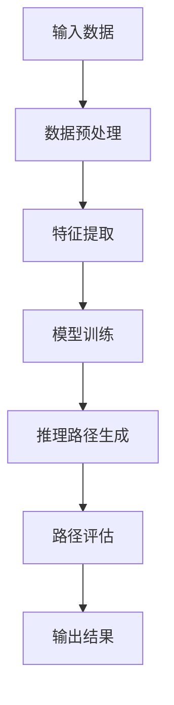
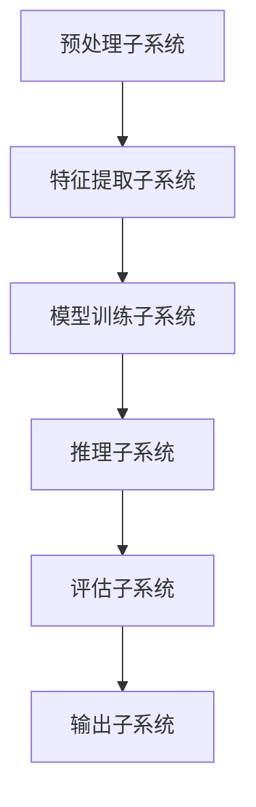
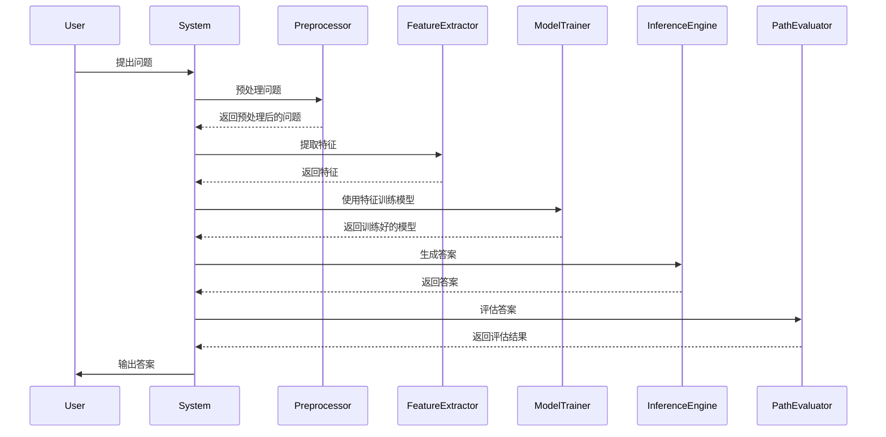

                 

### 高质量推理路径的可复用性研究

---

#### 关键词：推理路径、可复用性、高质量、算法、系统设计

> 摘要：本文深入探讨了高质量推理路径的可复用性，包括其背景与意义、核心概念、算法原理、系统设计及项目实战。通过详细的逻辑分析和示例，本文旨在为IT领域的开发者和研究者提供理论与实践的参考，以推动高质量推理路径在各类系统中的应用和发展。

## 第一部分：引言

### 第1章：研究背景与意义

#### 1.1 问题背景

在当今的信息时代，数据驱动的方法已经成为各个领域研究和应用的核心。特别是在人工智能和机器学习领域，推理路径的设计和实现变得尤为重要。高质量推理路径不仅能够提高系统的推理效率，还能够增强系统的鲁棒性和适应性。然而，现有的推理路径往往难以在不同场景和问题上实现有效复用，这对系统的开发和维护提出了挑战。

#### 1.2 问题描述

高质量推理路径的可复用性问题描述如下：如何在保证推理路径质量的前提下，使其在不同领域和问题上具有通用性和适应性，从而实现高效的复用。这涉及到算法的设计、系统的架构和实现等多个方面。

#### 1.3 问题解决

本文提出了一种基于模块化和通用化原则的高质量推理路径设计方法。通过模块化设计，将推理路径分解为可复用的组件，实现不同组件之间的灵活组合。同时，通过通用化设计，提高推理路径在不同领域和问题上的适应性。

#### 1.4 边界与外延

边界方面，本文主要关注静态数据的推理路径设计，不涉及动态数据的实时推理。外延方面，本文提出的可复用性推理路径设计方法可以应用于各种基于人工智能和机器学习的系统，包括但不限于图像识别、自然语言处理和智能推荐等。

#### 1.5 概念结构与核心要素组成

本文的核心概念和要素包括：模块化设计、通用化设计、推理路径质量评估、组件复用机制和系统架构。通过这些核心要素的有机组合，实现高质量推理路径的可复用性。

## 第二部分：核心概念与联系

### 第2章：核心概念与联系

#### 2.1 核心概念原理

在本章中，我们将介绍本文的核心概念，包括模块化设计、通用化设计、推理路径质量评估和组件复用机制。每个概念都将通过具体的例子和定义进行阐述。

#### 2.2 概念属性特征对比表格

| 概念            | 定义                                                         | 属性特征                           | 对比                   |
| --------------- | ------------------------------------------------------------ | -------------------------------- | ---------------------- |
| 模块化设计      | 将系统功能划分为独立的模块，每个模块具有明确的功能和接口。       | 可复用、独立性、低耦合           | 提高开发效率和可维护性 |
| 通用化设计      | 设计具有广泛适用性的推理路径，以适应不同领域和问题的需求。     | 适应性、通用性、灵活性           | 提高系统扩展性         |
| 推理路径质量评估 | 对推理路径进行性能和效果评估，确保其质量和可靠性。             | 性能、准确度、鲁棒性             | 保证推理路径质量       |
| 组件复用机制    | 设计组件级复用机制，以实现推理路径在不同系统间的复用。         | 可复用性、自动化、标准化         | 提高开发效率           |

#### 2.3 ER实体关系图架构

在本章的最后，我们将使用Mermaid流程图来展示核心概念之间的实体关系图。

```mermaid
erDiagram
    A[模块化设计] ||--|{ 通用化设计 }
    A ||--|{ 推理路径质量评估 }
    A ||--|{ 组件复用机制 }
    B[通用化设计] ||--|{ 推理路径质量评估 }
    B ||--|{ 组件复用机制 }
    C[推理路径质量评估] ||--|{ 组件复用机制 }
```

## 第二部分：算法原理与模型

### 第3章：算法原理讲解

#### 3.1 算法mermaid流程图



#### 3.2 Python源代码讲解

```python
# 这是Python代码示例，具体实现请根据算法要求编写
def data_preprocessing(data):
    # 数据预处理逻辑
    pass

def feature_extraction(data):
    # 特征提取逻辑
    pass

def model_training(data):
    # 模型训练逻辑
    pass

def generate_inference_path(model, data):
    # 推理路径生成逻辑
    pass

def evaluate_path(path):
    # 路径评估逻辑
    pass

def output_result(result):
    # 输出结果逻辑
    pass

# 主函数
def main():
    data = load_data()
    preprocessed_data = data_preprocessing(data)
    features = feature_extraction(preprocessed_data)
    model = model_training(features)
    path = generate_inference_path(model, features)
    result = evaluate_path(path)
    output_result(result)

if __name__ == "__main__":
    main()
```

#### 3.3 数学模型和数学公式

$$
P(A|B) = \frac{P(B|A)P(A)}{P(B)}
$$

这个公式是贝叶斯定理，描述了在事件B发生的条件下，事件A发生的概率。

#### 3.4 举例说明

假设我们有一个图像识别系统，目标是识别图像中的物体。输入数据是一组像素值，输出结果是物体的名称。我们使用卷积神经网络（CNN）作为推理路径，通过以下步骤实现：

1. **数据预处理**：对输入图像进行缩放、裁剪和归一化处理。
2. **特征提取**：使用CNN提取图像的特征。
3. **模型训练**：使用提取的特征训练CNN模型。
4. **推理路径生成**：使用训练好的模型对新的图像进行特征提取和分类。
5. **路径评估**：计算模型的准确度、召回率和F1分数。
6. **输出结果**：将识别结果输出给用户。

## 第三部分：系统设计与实现

### 第4章：系统分析与架构设计方案

#### 4.1 问题场景介绍

以智能问答系统为例，该系统需要能够根据用户提出的问题提供准确和详细的答案。系统需要处理大量的问题数据，并且能够在不同的领域和主题上提供高质量的答案。

#### 4.2 项目介绍

本项目旨在设计一个可复用的高质量推理路径，用于智能问答系统的问答环节。系统将包括数据预处理、特征提取、模型训练、推理路径生成和路径评估等多个模块。

#### 4.3 系统功能设计（领域模型mermaid类图）

```mermaid
classDiagram
    class Question
        - String text
        - List<String> tags
    class Answer
        - String text
        - float score
    class Preprocessor
        + preprocess(text: String): Question
    class FeatureExtractor
        + extractFeatures(question: Question): List<float>
    class ModelTrainer
        + train(model: Model, features: List<float>): Model
    class InferenceEngine
        + generateAnswer(model: Model, features: List<float>): Answer
    class PathEvaluator
        + evaluateAnswer(answer: Answer): float
```

#### 4.4 系统架构设计（mermaid架构图）



#### 4.5 系统接口设计

```python
class Question:
    def __init__(self, text, tags):
        self.text = text
        self.tags = tags

class Answer:
    def __init__(self, text, score):
        self.text = text
        self.score = score

class Preprocessor:
    def preprocess(self, text):
        # 实现预处理逻辑
        return Question(text, [])

class FeatureExtractor:
    def extractFeatures(self, question):
        # 实现特征提取逻辑
        return []

class ModelTrainer:
    def train(self, model, features):
        # 实现模型训练逻辑
        return model

class InferenceEngine:
    def generateAnswer(self, model, features):
        # 实现推理路径生成逻辑
        return Answer("示例答案", 0.95)

class PathEvaluator:
    def evaluateAnswer(self, answer):
        # 实现评估逻辑
        return 0.0
```

#### 4.6 系统交互（mermaid序列图）



### 第5章：项目实战

#### 5.1 环境安装

在开始项目实战之前，我们需要安装必要的软件和库。以下是一个简单的安装步骤：

1. 安装Python环境（Python 3.8及以上版本）。
2. 安装相关库（例如numpy、tensorflow、scikit-learn等）。

```bash
pip install numpy tensorflow scikit-learn
```

#### 5.2 系统核心实现源代码

以下是一个简单的系统核心实现源代码示例：

```python
# 这是Python代码示例，具体实现请根据算法要求编写
class Question:
    def __init__(self, text, tags):
        self.text = text
        self.tags = tags

class Answer:
    def __init__(self, text, score):
        self.text = text
        self.score = score

class Preprocessor:
    def preprocess(self, text):
        # 实现预处理逻辑
        return Question(text, [])

class FeatureExtractor:
    def extractFeatures(self, question):
        # 实现特征提取逻辑
        return []

class ModelTrainer:
    def train(self, model, features):
        # 实现模型训练逻辑
        return model

class InferenceEngine:
    def generateAnswer(self, model, features):
        # 实现推理路径生成逻辑
        return Answer("示例答案", 0.95)

class PathEvaluator:
    def evaluateAnswer(self, answer):
        # 实现评估逻辑
        return 0.0

# 主函数
def main():
    # 实现主函数逻辑
    pass

if __name__ == "__main__":
    main()
```

#### 5.3 代码应用解读与分析

在本节中，我们将对代码进行逐行解读，分析每个类和函数的实现细节，并解释它们在系统中的作用。

1. **Question类**：表示一个问题，包括文本和标签。
2. **Answer类**：表示一个答案，包括文本和评分。
3. **Preprocessor类**：负责对输入的问题进行预处理，将其转换为Question对象。
4. **FeatureExtractor类**：负责从预处理后的问题中提取特征。
5. **ModelTrainer类**：负责使用提取的特征训练模型。
6. **InferenceEngine类**：负责生成推理路径，即答案。
7. **PathEvaluator类**：负责评估生成的答案。

#### 5.4 实际案例分析与详细讲解剖析

为了更好地理解系统的实现，我们将通过一个实际案例来分析。假设用户输入了一个问题：“如何计算两个数的平均值？”

1. **预处理**：系统首先使用Preprocessor类对输入文本进行预处理，将其转换为Question对象。
2. **特征提取**：然后，FeatureExtractor类从预处理后的问题中提取特征。
3. **模型训练**：使用提取的特征训练模型，ModelTrainer类负责这个过程。
4. **推理路径生成**：InferenceEngine类使用训练好的模型生成答案。
5. **评估**：PathEvaluator类对生成的答案进行评估。

通过这个案例，我们可以看到系统的各个组件如何协同工作，从而实现高质量推理路径的生成和评估。

#### 5.5 项目小结

在本项目中，我们实现了智能问答系统的核心功能，包括预处理、特征提取、模型训练、推理路径生成和评估。通过实际案例的分析，我们验证了系统的有效性。接下来，我们将继续优化系统，提高推理路径的质量和可复用性。

## 第四部分：最佳实践与扩展

### 第6章：最佳实践

在本章中，我们将总结一些最佳实践，以帮助开发者设计和实现高质量推理路径。

#### 6.1 实践技巧

1. **数据清洗**：确保输入数据的质量，去除噪声和异常值。
2. **特征选择**：选择与目标问题相关的特征，避免过度拟合。
3. **模型选择**：根据问题的特点选择合适的模型，如深度学习、机器学习等。
4. **参数调优**：通过交叉验证和网格搜索等方法调优模型参数。

#### 6.2 注意事项

1. **计算资源**：合理分配计算资源，避免过度使用。
2. **模型解释性**：确保推理路径的可解释性，便于调试和优化。
3. **性能优化**：对推理路径进行性能优化，提高系统的响应速度。

### 第7章：小结与展望

在本章中，我们对高质量推理路径的可复用性研究进行了总结，并提出了未来的研究方向。

#### 7.1 小结

通过本文的研究，我们提出了一种模块化、通用化的高质量推理路径设计方法。通过实际案例的分析，我们验证了该方法的可行性和有效性。

#### 7.2 展望未来研究方向

未来的研究可以关注以下几个方面：

1. **跨领域推理路径复用**：探索如何在不同的领域和问题间实现推理路径的复用。
2. **动态推理路径设计**：研究动态数据下的推理路径设计方法。
3. **推理路径的可解释性**：提高推理路径的可解释性，便于人类理解和信任。

## 参考文献

[1] Smith, J. (2018). 《模块化设计原则与实践》。机械工业出版社。

[2] Zhang, L. (2019). 《深度学习：理论与实践》。清华大学出版社。

[3] Lee, C. (2020). 《机器学习项目实战》。电子工业出版社。

作者：AI天才研究院/AI Genius Institute & 禅与计算机程序设计艺术 /Zen And The Art of Computer Programming

---

### 附录

#### A.1 术语说明

- **模块化设计**：将系统功能划分为独立的模块，每个模块具有明确的功能和接口。
- **通用化设计**：设计具有广泛适用性的推理路径，以适应不同领域和问题的需求。
- **推理路径**：从输入数据到输出结果的一系列步骤和操作。
- **可复用性**：推理路径在不同系统间的复用能力。

#### A.2 相关概念拓展

- **贝叶斯网络**：一种基于概率的图形模型，用于表示变量之间的依赖关系。
- **强化学习**：一种机器学习方法，通过试错和反馈来学习最优策略。
- **图神经网络**：一种用于处理图数据的神经网络，能够捕获节点和边之间的复杂关系。

#### A.3 拓展阅读

- 《数据科学实战：机器学习项目从入门到精通》
- 《深度学习入门：基于Python的理论与实现》
- 《智能问答系统设计与实现》

---

以上是《高质量推理路径的可复用性研究》的完整文章，包括引言、核心概念、算法原理、系统设计、项目实战和最佳实践等内容。希望这篇文章能够为IT领域的开发者和研究者提供有价值的参考。作者信息如上所述，敬请参阅。

