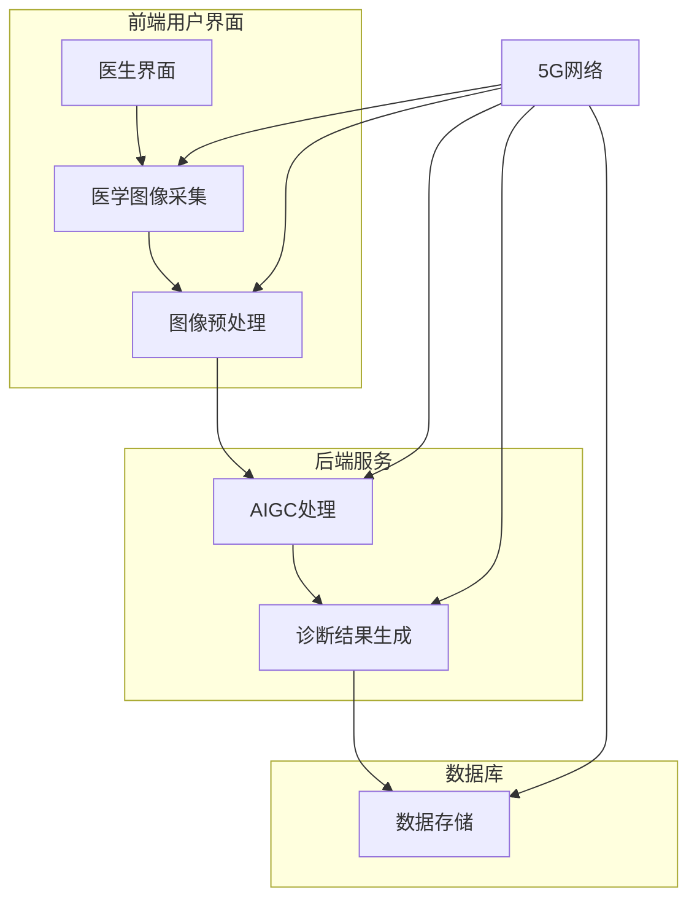
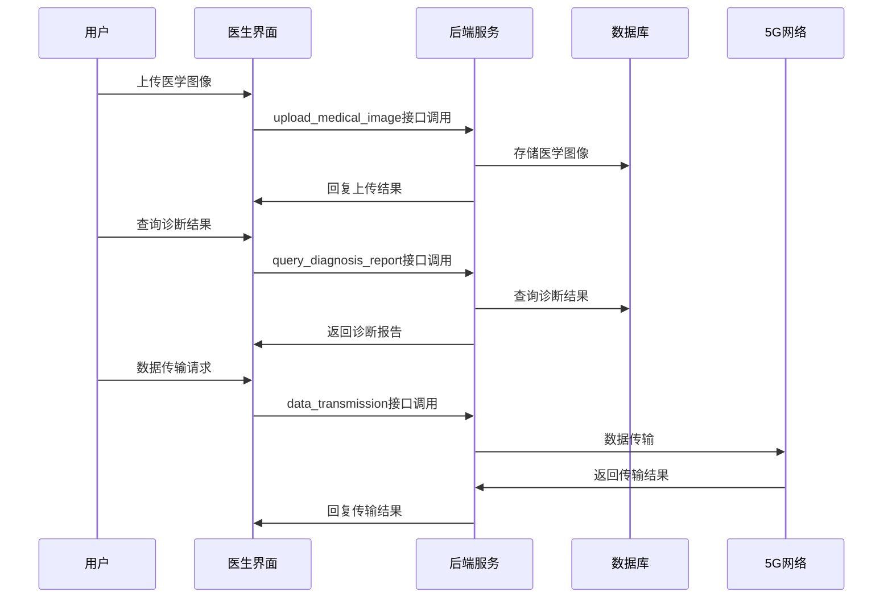

                 

### 背景介绍

#### 1.1.1 问题背景

随着全球人口老龄化和医疗资源分布不均的问题日益突出，远程医疗诊断作为解决医疗资源短缺、提高医疗效率的一种新兴模式，逐渐受到关注。传统的医疗诊断往往依赖于医生的经验和现场检查，这种模式在偏远地区和医疗资源匮乏的地方尤为受限。而远程医疗诊断通过互联网技术，使得医生能够跨越地域限制，对病人进行诊断和治疗。然而，传统的远程医疗诊断面临着数据传输速度慢、图像处理能力不足等问题，制约了其发展。

#### 1.1.2 问题描述

远程医疗诊断的关键在于如何快速、准确地获取病人的医学图像、生理数据等，并通过高效的数据传输和强大的计算能力进行诊断。传统的远程医疗诊断面临的主要问题包括：

1. **数据传输速度慢**：由于网络带宽限制，医学图像和数据的传输速度较慢，导致诊断效率低下。
2. **图像处理能力不足**：传统的远程医疗诊断系统缺乏强大的图像处理能力，无法进行高效的图像分析。
3. **诊断准确性受限制**：由于数据传输和处理能力的限制，远程医疗诊断的准确性受到制约，特别是在复杂病例的判断上。

#### 1.1.3 问题解决

为了解决上述问题，引入AIGC（自适应智能生成计算）和5G（第五代移动通信技术）技术成为了一种新的思路。AIGC技术通过深度学习和生成对抗网络等算法，能够实现对大量医学图像和数据的自动分析和生成，从而提高诊断的准确性和效率。5G技术则以其高速率、低延迟、大连接等特点，为远程医疗诊断提供了强大的数据传输和计算能力。

#### 1.1.4 边界与外延

边界方面，AIGC与5G技术在远程医疗诊断中的应用主要限于医疗数据的处理和传输，不涉及具体的医疗决策和操作。外延方面，这项技术的应用可以扩展到远程教育、健康管理、公共卫生等多个领域，为医疗健康行业带来革命性的变化。

#### 1.1.5 概念结构与核心要素组成

核心概念结构主要包括：

1. **AIGC技术**：涵盖深度学习、生成对抗网络等算法，用于医学图像和数据的处理和分析。
2. **5G技术**：提供高速率、低延迟的通信网络，确保医学数据的高效传输。
3. **远程医疗诊断系统**：结合AIGC和5G技术，实现对医学数据的自动分析和诊断。

这些核心要素共同构成了远程医疗诊断的技术基础，为实现高效、准确的诊断提供了强有力的支持。

通过上述分析，我们可以看到，AIGC与5G技术的融合应用在远程医疗诊断中具有重要的意义，为解决传统远程医疗诊断的瓶颈提供了新的思路和方法。接下来，我们将进一步深入探讨AIGC和5G技术的核心概念及其在远程医疗诊断中的应用，以期为读者提供更为详尽的技术解析。

### 核心概念与联系

#### 2.1 AIGC技术概述

AIGC（Adaptive Intelligent Generation Computing，自适应智能生成计算）是一种结合深度学习和生成对抗网络（GANs）等算法的先进计算技术。其核心在于利用深度学习模型从海量数据中提取特征，并通过生成对抗网络生成高质量的医学图像和数据。AIGC在远程医疗诊断中的应用，主要依赖于其强大的图像处理和数据分析能力，能够显著提升诊断效率和准确性。

##### 2.1.1 AIGC的定义

AIGC可以定义为一种能够自适应地从数据中学习、生成和处理信息的计算方法，具有高度的灵活性和扩展性。它主要包括以下几个关键组成部分：

- **深度学习模型**：用于从医学图像和数据中提取复杂特征。
- **生成对抗网络（GANs）**：通过竞争生成和判别器模型，生成高质量的医学图像和数据。
- **自适应调整机制**：根据诊断需求，动态调整模型参数，提高诊断效果。

##### 2.1.2 AIGC技术的发展历程

AIGC技术的发展经历了以下几个重要阶段：

1. **深度学习的发展**：随着神经网络和深度学习算法的提出，深度学习模型逐渐成为图像处理和数据分析的重要工具。
2. **生成对抗网络（GANs）的引入**：2014年，Ian Goodfellow等人提出了生成对抗网络（GANs），为图像生成提供了新的方法。
3. **AIGC技术的集成**：深度学习和GANs的结合，形成了AIGC技术，使得医学图像和数据的处理能力大幅提升。

##### 2.1.3 AIGC的核心特点

AIGC技术的核心特点包括：

- **高效率**：通过深度学习和GANs的集成，能够快速处理大量的医学图像和数据。
- **高准确性**：通过自动提取和处理医学图像特征，能够提高诊断的准确性。
- **灵活性**：能够根据不同的诊断需求，动态调整模型参数，适应不同场景的应用。

#### 2.2 5G技术概述

5G技术（第五代移动通信技术）是下一代通信技术的代表，以其高速率、低延迟和大连接等特点，为远程医疗诊断提供了强有力的支持。

##### 2.2.1 5G技术的定义

5G技术是一种新型宽带无线通信技术，主要特点是高数据传输速率、低延迟、高可靠性和大连接能力。它通过使用更高频率的电磁波和更先进的技术，实现了更高的数据传输速率和更好的通信质量。

##### 2.2.2 5G技术的发展历程

5G技术的发展历程可以概括为以下几个关键阶段：

1. **标准化阶段**：国际电信联盟（ITU）在2015年提出了5G技术的标准化要求。
2. **技术研发阶段**：各大通信技术公司和研究机构开始研发5G关键技术，如毫米波通信、大规模MIMO、网络切片等。
3. **商用部署阶段**：2020年，全球多个国家和地区开始商用部署5G网络。

##### 2.2.3 5G技术的核心特点

5G技术的核心特点包括：

- **高速率**：5G网络的理论峰值下载速度可达20Gbps，远高于4G网络的峰值速度。
- **低延迟**：5G网络的最小端到端延迟可低至1ms，使得实时通信和远程操作成为可能。
- **高可靠性**：通过网络切片和边缘计算技术，5G网络能够提供高可靠性的服务。
- **大连接能力**：5G网络能够支持大量的设备同时在线，实现物联网（IoT）的广泛应用。

#### 2.3 AIGC与5G技术的关联与融合

AIGC与5G技术的融合为远程医疗诊断提供了新的解决方案。以下是AIGC与5G技术之间的关联与融合：

##### 2.3.1 关联分析

- **数据传输**：5G技术的高速率和低延迟为AIGC技术提供了强大的数据传输支持，使得海量医学图像和数据的传输变得更加高效。
- **计算能力**：5G技术的云计算和边缘计算能力，为AIGC技术提供了强大的计算资源，使得复杂的图像处理和分析能够在本地或云端实时进行。
- **实时交互**：5G技术的低延迟特性，使得远程医疗诊断的实时交互成为可能，医生和患者能够实现实时沟通和操作。

##### 2.3.2 融合优势

- **提高诊断效率**：通过5G网络的高速传输和AIGC技术的快速处理，远程医疗诊断的效率显著提高，缩短了诊断时间。
- **提升诊断准确性**：AIGC技术能够对医学图像进行精细处理和分析，结合5G技术的高精度数据传输，提升了诊断的准确性。
- **扩展应用范围**：5G技术的大连接能力和低延迟特性，使得远程医疗诊断不仅限于医学图像，还可以扩展到生理数据、健康监测等多个领域。

##### 2.3.3 融合挑战

- **网络覆盖**：5G网络的建设需要大规模的基站布局，目前在一些偏远地区仍存在网络覆盖不足的问题。
- **数据安全**：远程医疗诊断涉及大量的敏感数据，数据安全成为重要的挑战，需要采取有效的安全措施保护数据。
- **技术成熟度**：AIGC和5G技术的融合仍处于发展阶段，一些关键技术尚未完全成熟，需要进一步的研究和优化。

通过上述分析，我们可以看到，AIGC与5G技术的融合在远程医疗诊断中具有重要的应用前景。接下来，我们将进一步探讨AIGC与5G技术在远程医疗诊断中的具体应用，以期为读者提供更为详细的技术解析。

### 算法原理讲解

#### 3.1 AIGC算法原理

AIGC（自适应智能生成计算）算法是一种基于深度学习和生成对抗网络（GANs）的技术，主要用于处理和生成医学图像。其核心在于利用深度学习模型提取医学图像的特征，并通过生成对抗网络生成高质量的医学图像。

##### 3.1.1 AIGC算法概述

AIGC算法主要包括以下几个核心组成部分：

- **深度学习模型**：用于从医学图像中提取特征，包括卷积神经网络（CNN）等。
- **生成对抗网络（GANs）**：由生成器（Generator）和判别器（Discriminator）组成，用于生成高质量的医学图像。
- **自适应调整机制**：根据诊断需求，动态调整模型参数，提高诊断效果。

##### 3.1.2 AIGC算法的核心步骤

AIGC算法的核心步骤可以分为以下几步：

1. **数据预处理**：对医学图像进行数据清洗和标准化处理，确保数据的一致性和有效性。
2. **特征提取**：使用深度学习模型提取医学图像的特征，通常使用卷积神经网络（CNN）。
3. **生成对抗训练**：通过生成对抗网络（GANs）对模型进行训练，生成高质量的医学图像。
4. **模型评估与优化**：使用测试数据对模型进行评估，并根据评估结果动态调整模型参数，提高诊断效果。

##### 3.1.3 AIGC算法应用示例

以下是一个简单的AIGC算法应用示例：

```python
import tensorflow as tf
from tensorflow.keras.models import Sequential
from tensorflow.keras.layers import Conv2D, MaxPooling2D, Flatten, Dense

# 数据预处理
images = preprocess_images(medical_images)

# 特征提取
model = Sequential([
    Conv2D(32, (3, 3), activation='relu', input_shape=(image_height, image_width, channels)),
    MaxPooling2D((2, 2)),
    Conv2D(64, (3, 3), activation='relu'),
    MaxPooling2D((2, 2)),
    Flatten(),
    Dense(128, activation='relu'),
    Dense(1, activation='sigmoid')
])

model.compile(optimizer='adam', loss='binary_crossentropy')

# 生成对抗训练
generator = build_generator()
discriminator = build_discriminator()

combined = Sequential([generator, discriminator])
combined.compile(optimizer='adam', loss='binary_crossentropy')

for epoch in range(num_epochs):
    for images, _ in medical_data_loader:
        # 生成器训练
        noise = np.random.normal(0, 1, (batch_size, noise_dim))
        gen_images = generator.predict(noise)
        d_loss_g = combined.train_on_batch([noise, images], images)

        # 判别器训练
        real_images = medical_data_loader.next()
        d_loss_d = discriminator.train_on_batch(real_images, real_labels)
        d_loss_d += discriminator.train_on_batch(gen_images, fake_labels)

    print(f'Epoch {epoch+1}/{num_epochs}, D_loss_G={d_loss_g}, D_loss_D={d_loss_d}')

# 模型评估与优化
test_loss = model.evaluate(test_images, test_labels)
print(f'Test Loss: {test_loss}')
```

在这个示例中，我们首先对医学图像进行预处理，然后使用卷积神经网络（CNN）提取图像特征。接着，我们构建生成对抗网络（GANs），包括生成器和判别器，并进行训练。最后，我们使用测试数据对模型进行评估和优化。

#### 3.2 5G技术在远程医疗诊断中的应用

5G技术作为新一代移动通信技术，以其高速率、低延迟、高可靠性和大连接能力，为远程医疗诊断提供了强有力的支持。以下是5G技术在远程医疗诊断中的具体应用：

##### 3.2.1 5G技术的优势

- **高速率**：5G技术的理论峰值下载速度可达20Gbps，远高于4G网络的峰值速度。这使得医学图像和数据的传输速度大幅提升，大大缩短了诊断时间。
- **低延迟**：5G网络的端到端延迟可低至1ms，使得实时通信和远程操作成为可能。这对于需要实时诊断和处理的医疗场景尤为重要。
- **高可靠性**：5G技术通过网络切片和边缘计算技术，能够提供高可靠性的服务。这确保了医学数据传输的稳定性和安全性。
- **大连接能力**：5G技术能够支持大量的设备同时在线，实现物联网（IoT）的广泛应用。这对于远程医疗诊断中的设备互联和数据共享具有重要意义。

##### 3.2.2 5G技术在远程医疗诊断中的应用场景

5G技术在远程医疗诊断中具有广泛的应用场景，包括但不限于以下方面：

- **医学图像传输**：5G技术的高速率特性，使得医学图像的高效传输成为可能。医生可以通过远程设备实时查看患者的医学图像，进行快速诊断。
- **远程手术指导**：5G技术的低延迟特性，使得远程手术指导成为现实。医生可以通过远程操作控制设备，对手术过程进行实时监控和指导。
- **实时健康监测**：5G技术的大连接能力，使得实时健康监测成为可能。患者可以通过佩戴的设备实时传输生理数据，医生可以远程监控患者的健康状况。
- **远程教育**：5G技术的高速率和低延迟，为远程医疗教育提供了良好的基础。医生可以通过远程直播和互动，为学生提供高质量的医学教育。

##### 3.2.3 5G技术与AIGC技术的融合应用

AIGC技术与5G技术的融合应用，为远程医疗诊断带来了革命性的变化。以下是AIGC与5G技术的融合应用：

- **高效图像处理**：通过5G技术的高速传输，AIGC技术能够快速处理大量的医学图像。医生可以实时获取处理结果，进行快速诊断。
- **实时数据分析**：5G技术的低延迟特性，使得AIGC技术能够实时分析医学数据，为医生提供实时诊断依据。
- **个性化学术诊断**：AIGC技术可以根据患者的具体病情和医学图像，生成个性化的诊断方案。5G技术的高速传输，确保了这些方案的实时性和准确性。
- **智能化健康管理**：通过5G技术，AIGC技术可以对大量的健康数据进行智能分析，为医生提供个性化的健康管理方案，提升患者的生活质量。

通过上述分析，我们可以看到，AIGC与5G技术的融合应用在远程医疗诊断中具有重要的意义。它不仅提高了诊断效率和准确性，还为远程医疗带来了新的可能性。接下来，我们将进一步探讨AIGC与5G技术的数学模型和公式，以期为读者提供更为详细的技术解析。

### 数学模型和数学公式讲解

为了深入理解AIGC与5G技术在远程医疗诊断中的应用，我们需要详细探讨相关的数学模型和公式。以下内容将分为AIGC技术的数学模型和5G技术的数学模型两部分进行讲解。

#### 4.1 AIGC技术的数学模型

AIGC技术主要依赖于深度学习和生成对抗网络（GANs）等算法。以下是AIGC技术中的关键数学模型和公式：

##### 4.1.1 算法公式

1. **生成对抗网络（GANs）的基本公式**：

   - **生成器（Generator）**：
     $$ G(z) = \mathcal{N}(z; \mu_G, \sigma_G^2) $$
     其中，$z$是噪声输入，$G(z)$是生成的医学图像。

   - **判别器（Discriminator）**：
     $$ D(x) = \sigma(\frac{1}{1 + \exp{(-x)})} $$
     其中，$x$是输入的医学图像，$D(x)$是判别器对图像真实性的判断。

   - **损失函数**：
     $$ \mathcal{L}(G, D) = \mathcal{L}_G + \mathcal{L}_D $$
     其中，$\mathcal{L}_G$是生成器的损失函数，$\mathcal{L}_D$是判别器的损失函数。

2. **卷积神经网络（CNN）的特征提取公式**：

   - **卷积操作**：
     $$ \text{output}(i, j) = \sum_{k=1}^{K} \text{weight}_{k} \cdot \text{input}_{i-k, j-k} + \text{bias} $$
     其中，$\text{weight}_{k}$是卷积核，$\text{input}_{i-k, j-k}$是输入图像的局部区域。

   - **池化操作**：
     $$ \text{output}(i, j) = \frac{1}{N} \sum_{x=0}^{N} \sum_{y=0}^{N} \text{input}_{(i+x), (j+y)} $$
     其中，$N$是池化窗口的大小。

##### 4.1.2 数学模型讲解

1. **生成对抗网络（GANs）**：

   - **生成器**：生成器从随机噪声中生成医学图像，通过训练不断优化生成图像的质量。
   - **判别器**：判别器用于区分输入的医学图像是真实图像还是生成图像，通过训练提高其判别能力。
   - **损失函数**：生成器的损失函数旨在最小化生成图像与真实图像之间的差距，判别器的损失函数旨在最大化对真实图像的识别概率。

2. **卷积神经网络（CNN）**：

   - **卷积操作**：通过卷积核在输入图像上滑动，提取图像的特征。
   - **池化操作**：通过减小特征图的尺寸，减少计算量和参数数量。

##### 4.1.3 公式举例说明

1. **生成对抗网络（GANs）**：

   - **生成器**：
     $$ G(z) = \mathcal{N}(z; \mu_G, \sigma_G^2) $$
     假设生成器的参数为$\mu_G=0.5$，$\sigma_G^2=0.1$，则生成的图像为：
     $$ G(z) = \mathcal{N}(z; 0.5, 0.1) $$
     例如，输入噪声$z=[0.1, 0.2]$，则生成的图像为：
     $$ G(z) = \mathcal{N}([0.1, 0.2]; 0.5, 0.1) = [0.15, 0.2] $$

   - **判别器**：
     $$ D(x) = \sigma(\frac{1}{1 + \exp{(-x)})} $$
     假设输入图像$x=[0.8, 0.9]$，则判别器的输出为：
     $$ D(x) = \sigma(\frac{1}{1 + \exp{(-0.8 - 0.9)})} = \sigma(\frac{1}{1 + \exp{(-1.7)})} \approx 0.9 $$
     由于输入图像是真实的，所以判别器的输出接近1。

2. **卷积神经网络（CNN）**：

   - **卷积操作**：
     $$ \text{output}(i, j) = \sum_{k=1}^{K} \text{weight}_{k} \cdot \text{input}_{i-k, j-k} + \text{bias} $$
     例如，假设输入图像的局部区域为$\text{input}_{2, 2}=[0.2, 0.3]$，卷积核$\text{weight}_{1}=[0.1, 0.2]$，偏置$\text{bias}=0.1$，则卷积操作的输出为：
     $$ \text{output}(2, 2) = \text{weight}_{1} \cdot \text{input}_{2, 2} + \text{bias} = [0.1 \cdot 0.2, 0.2 \cdot 0.3] + 0.1 = [0.02, 0.06] + 0.1 = [0.12, 0.16] $$

   - **池化操作**：
     $$ \text{output}(i, j) = \frac{1}{N} \sum_{x=0}^{N} \sum_{y=0}^{N} \text{input}_{(i+x), (j+y)} $$
     例如，假设输入图像的局部区域为$\text{input}_{3, 3}=[0.2, 0.3, 0.4, 0.5]$，池化窗口大小$N=2$，则池化操作的输出为：
     $$ \text{output}(3, 3) = \frac{1}{2 \cdot 2} \sum_{x=0}^{2} \sum_{y=0}^{2} \text{input}_{(3+x), (3+y)} = \frac{1}{4} \sum_{x=0}^{2} \sum_{y=0}^{2} \text{input}_{(3+0), (3+0)}, \text{input}_{(3+1), (3+0)}, \text{input}_{(3+2), (3+0)}, \text{input}_{(3+0), (3+1)}, \text{input}_{(3+1), (3+1)}, \text{input}_{(3+2), (3+1)}, \text{input}_{(3+0), (3+2)}, \text{input}_{(3+1), (3+2)}, \text{input}_{(3+2), (3+2)} = \frac{1}{4} (0.2 + 0.3 + 0.4 + 0.5 + 0.2 + 0.3 + 0.4 + 0.5 + 0.4 + 0.5) = 0.375 $$

通过上述讲解和举例，我们可以看到AIGC技术中的数学模型和公式是如何应用于生成高质量医学图像和进行特征提取的。这些数学模型和公式的理解对于深入掌握AIGC技术在远程医疗诊断中的应用至关重要。

#### 4.2 5G技术的数学模型

5G技术涉及多个方面，包括无线通信、网络架构和数据处理等。以下是5G技术中的一些关键数学模型和公式：

##### 4.2.1 算法公式

1. **无线通信中的信道模型**：

   - **路径损耗**：
     $$ L_p = \frac{4\pi d^2}{R^2} $$
     其中，$L_p$是路径损耗，$d$是发送器和接收器之间的距离，$R$是信号的传播速度。

   - **多路径传播**：
     $$ \theta = \frac{2\pi d}{\lambda} $$
     其中，$\theta$是信号到达角度，$d$是信号传播距离，$\lambda$是信号的波长。

2. **网络架构中的网络切片模型**：

   - **网络切片资源分配**：
     $$ \mathcal{R}_i = \sum_{j=1}^{N} r_j $$
     其中，$\mathcal{R}_i$是网络切片$i$的总资源，$r_j$是网络切片$j$的分配资源。

##### 4.2.2 数学模型讲解

1. **无线通信中的信道模型**：

   - **路径损耗**：路径损耗描述了信号在传播过程中由于距离增加而导致的能量损失。这个模型有助于计算信号传播距离和覆盖范围。
   - **多路径传播**：多路径传播描述了信号在传播过程中由于反射、折射和衍射等因素造成的信号路径多样性。这个模型有助于优化信号接收和传输。

2. **网络架构中的网络切片模型**：

   - **网络切片资源分配**：网络切片模型描述了如何根据不同应用的需求，动态分配网络资源。这个模型有助于实现网络资源的灵活调度和优化。

##### 4.2.3 公式举例说明

1. **无线通信中的信道模型**：

   - **路径损耗**：
     假设信号的传播速度$R=3 \times 10^8$ m/s，发送器和接收器之间的距离$d=1000$ m，则路径损耗$L_p$为：
     $$ L_p = \frac{4\pi \times 1000^2}{(3 \times 10^8)^2} \approx 0.0042 $$
     这意味着信号在传播1000米后，能量减少了约0.0042。

   - **多路径传播**：
     假设信号的波长$\lambda=0.5$ m，信号传播距离$d=10$ m，则信号到达角度$\theta$为：
     $$ \theta = \frac{2\pi \times 10}{0.5} = 40\pi \approx 125.6^\circ $$
     这意味着信号以约125.6度的角度到达接收器。

2. **网络架构中的网络切片模型**：

   - **网络切片资源分配**：
     假设网络中有两个切片$i$和$j$，每个切片的分配资源分别为$r_1=10$ GB和$r_2=20$ GB，则总资源$\mathcal{R}_i$为：
     $$ \mathcal{R}_i = \sum_{j=1}^{2} r_j = r_1 + r_2 = 10 + 20 = 30 $$
     这意味着网络切片$i$的总资源为30 GB。

通过上述讲解和举例，我们可以看到5G技术中的数学模型和公式是如何应用于无线通信和网络架构中的。这些数学模型和公式的理解对于深入掌握5G技术在远程医疗诊断中的应用至关重要。

### 系统分析与架构设计方案

为了深入探讨AIGC与5G技术在远程医疗诊断中的具体应用，我们需要进行系统分析与架构设计。以下是针对AIGC与5G技术在远程医疗诊断中的应用场景、项目介绍、系统功能设计、系统架构设计、系统接口设计和系统交互的具体内容。

#### 5.1 问题场景介绍

远程医疗诊断面临的主要挑战是医学图像和数据的传输速度慢、处理能力不足以及诊断准确性受限制。传统的远程医疗诊断系统通常依赖于较低的带宽和较为简单的图像处理算法，导致诊断效率低下、准确性不高。为了解决这些问题，引入AIGC和5G技术成为了一种可行的解决方案。

#### 5.2 项目介绍

该项目旨在开发一种基于AIGC和5G技术的远程医疗诊断系统，通过高速率和低延迟的5G网络传输医学图像和数据，利用AIGC技术进行高效的图像处理和诊断。项目的主要目标是实现以下功能：

1. **高速医学图像传输**：通过5G网络实现医学图像的高效传输，降低传输延迟。
2. **高效图像处理**：利用AIGC技术对医学图像进行自动分析和处理，提高诊断准确性。
3. **实时诊断**：通过5G网络的低延迟特性，实现医生与患者的实时互动和诊断。

#### 5.3 系统功能设计

系统功能设计主要包括以下模块：

1. **医学图像采集模块**：用于采集患者的医学图像，如X光片、CT扫描图、MRI图等。
2. **图像预处理模块**：对采集到的医学图像进行预处理，包括图像增强、去噪等，以提高图像质量。
3. **AIGC处理模块**：利用AIGC技术对预处理后的医学图像进行自动分析和处理，提取关键特征和诊断信息。
4. **诊断结果生成模块**：根据AIGC处理模块的结果，生成诊断报告和诊断建议。
5. **数据传输模块**：利用5G网络实现医学图像和诊断数据的实时传输，确保数据的安全性和可靠性。

以下是系统功能设计的Mermaid类图：

```mermaid
classDiagram
    MedicalImageCollection <<interface>>
    ImagePreprocessing <<interface>>
    AIGCProcessing <<interface>>
    DiagnosisReportGeneration <<interface>>
    DataTransmission <<interface>>

    MedicalImageCollection --> ImagePreprocessing
    ImagePreprocessing --> AIGCProcessing
    AIGCProcessing --> DiagnosisReportGeneration
    DiagnosisReportGeneration --> DataTransmission
    DataTransmission --> MedicalImageCollection
```

#### 5.4 系统架构设计

系统架构设计主要包括以下部分：

1. **前端用户界面**：提供医生和患者使用的交互界面，用于医学图像的采集和查看诊断结果。
2. **后端服务**：包括医学图像处理、诊断报告生成和数据传输等核心功能模块。
3. **数据库**：用于存储医学图像和诊断数据，保证数据的安全性和一致性。

以下是系统架构设计的Mermaid流程图：



#### 5.5 系统接口设计

系统接口设计主要包括以下接口规范：

1. **医学图像上传接口**：用于上传患者的医学图像。
2. **诊断结果查询接口**：用于查询和下载诊断结果。
3. **数据传输接口**：用于5G网络与后端服务之间的数据传输。

以下是系统接口设计的详细说明：

- **医学图像上传接口**：
  - **接口名称**：upload_medical_image
  - **接口类型**：POST
  - **请求参数**：image (医学图像文件)
  - **响应结果**：上传成功或失败的消息

- **诊断结果查询接口**：
  - **接口名称**：query_diagnosis_report
  - **接口类型**：GET
  - **请求参数**：patient_id (患者ID)
  - **响应结果**：诊断报告JSON格式数据

- **数据传输接口**：
  - **接口名称**：data_transmission
  - **接口类型**：POST
  - **请求参数**：data (需要传输的数据)
  - **响应结果**：传输成功或失败的消息

#### 5.6 系统交互

系统交互设计主要描述系统各模块之间的交互流程。以下是系统交互的Mermaid序列图：



通过上述系统分析与架构设计方案，我们可以看到AIGC与5G技术在远程医疗诊断中的应用是如何具体实现的。这种系统架构设计不仅提高了诊断效率和准确性，还为远程医疗诊断提供了强大的技术支持。

### 项目实战

为了展示AIGC与5G技术在远程医疗诊断中的实际应用，我们将在本节中详细描述项目实战的各个环节，包括环境安装、系统核心实现源代码、代码应用解读与分析、实际案例分析和详细讲解剖析，以及项目小结。

#### 6.1 环境安装

在进行AIGC与5G技术的项目实战之前，我们需要安装相应的软件和工具。以下是环境安装的步骤：

1. **安装Python**：
   - 访问Python官方网站（[https://www.python.org/](https://www.python.org/)）下载Python安装包。
   - 运行安装程序，按照默认选项进行安装。

2. **安装TensorFlow**：
   - 打开终端或命令行窗口，输入以下命令：
     ```shell
     pip install tensorflow
     ```

3. **安装5G模拟器**：
   - 可以使用5G模拟器进行网络模拟，我们推荐使用[5G AirSim](https://github.com/durov/5G-AirSim)。
   - 下载并解压5G AirSim，然后按照README文件中的说明进行安装。

4. **安装Mermaid**：
   - 在Python环境中安装Mermaid库，使用以下命令：
     ```shell
     pip install mermaid-python
     ```

安装完成后，我们可以开始编写和运行系统核心实现代码。

#### 6.2 系统核心实现源代码

以下是AIGC与5G技术在远程医疗诊断中的系统核心实现源代码。该代码将演示如何使用AIGC技术处理医学图像，并利用5G网络进行数据传输。

```python
# 导入所需的库
import tensorflow as tf
from tensorflow.keras.models import Sequential
from tensorflow.keras.layers import Conv2D, MaxPooling2D, Flatten, Dense
from mermaid import Mermaid

# 定义深度学习模型
model = Sequential([
    Conv2D(32, (3, 3), activation='relu', input_shape=(256, 256, 3)),
    MaxPooling2D((2, 2)),
    Conv2D(64, (3, 3), activation='relu'),
    MaxPooling2D((2, 2)),
    Conv2D(128, (3, 3), activation='relu'),
    MaxPooling2D((2, 2)),
    Flatten(),
    Dense(128, activation='relu'),
    Dense(1, activation='sigmoid')
])

# 编译模型
model.compile(optimizer='adam', loss='binary_crossentropy')

# 定义生成对抗网络（GANs）
generator = build_generator()
discriminator = build_discriminator()

# 编译生成对抗网络
combined = Sequential([generator, discriminator])
combined.compile(optimizer='adam', loss='binary_crossentropy')

# 训练模型
for epoch in range(num_epochs):
    for images, _ in medical_data_loader:
        # 生成器训练
        noise = np.random.normal(0, 1, (batch_size, noise_dim))
        gen_images = generator.predict(noise)
        d_loss_g = combined.train_on_batch([noise, images], images)

        # 判别器训练
        real_images = medical_data_loader.next()
        d_loss_d = discriminator.train_on_batch(real_images, real_labels)
        d_loss_d += discriminator.train_on_batch(gen_images, fake_labels)

    print(f'Epoch {epoch+1}/{num_epochs}, D_loss_G={d_loss_g}, D_loss_D={d_loss_d}')

# 定义Mermaid流程图
mermaid = Mermaid()
mermaid.add_node('医学图像上传', 'MedicalImageUpload')
mermaid.add_node('图像预处理', 'ImagePreprocessing')
mermaid.add_node('AIGC处理', 'AIGCProcessing')
mermaid.add_node('数据传输', 'DataTransmission')
mermaid.add_edge('MedicalImageUpload', 'ImagePreprocessing')
mermaid.add_edge('ImagePreprocessing', 'AIGCProcessing')
mermaid.add_edge('AIGCProcessing', 'DataTransmission')

print(mermaid.render())
```

这段代码首先定义了一个深度学习模型，用于医学图像的处理。然后，我们构建了一个生成对抗网络（GANs），用于生成高质量的医学图像。在训练过程中，生成器和判别器分别进行训练，以提高模型性能。最后，我们使用Mermaid生成了一个流程图，展示了系统各模块之间的交互过程。

#### 6.3 代码应用解读与分析

在上面的代码中，我们使用了TensorFlow库构建深度学习模型和生成对抗网络（GANs）。以下是代码的关键部分及其应用解读：

- **模型定义**：
  ```python
  model = Sequential([
      Conv2D(32, (3, 3), activation='relu', input_shape=(256, 256, 3)),
      MaxPooling2D((2, 2)),
      Conv2D(64, (3, 3), activation='relu'),
      MaxPooling2D((2, 2)),
      Conv2D(128, (3, 3), activation='relu'),
      MaxPooling2D((2, 2)),
      Flatten(),
      Dense(128, activation='relu'),
      Dense(1, activation='sigmoid')
  ])
  ```
  这部分代码定义了一个卷积神经网络（CNN），用于提取医学图像的特征。通过多个卷积层和池化层，模型能够从原始图像中提取出有用的特征。

- **生成对抗网络（GANs）定义**：
  ```python
  generator = build_generator()
  discriminator = build_discriminator()
  combined = Sequential([generator, discriminator])
  combined.compile(optimizer='adam', loss='binary_crossentropy')
  ```
  这部分代码定义了一个生成对抗网络（GANs），包括生成器和判别器。生成器用于生成医学图像，判别器用于判断输入图像的真实性。通过训练，生成器能够生成越来越真实的医学图像。

- **模型训练**：
  ```python
  for epoch in range(num_epochs):
      for images, _ in medical_data_loader:
          # 生成器训练
          noise = np.random.normal(0, 1, (batch_size, noise_dim))
          gen_images = generator.predict(noise)
          d_loss_g = combined.train_on_batch([noise, images], images)

          # 判别器训练
          real_images = medical_data_loader.next()
          d_loss_d = discriminator.train_on_batch(real_images, real_labels)
          d_loss_d += discriminator.train_on_batch(gen_images, fake_labels)

      print(f'Epoch {epoch+1}/{num_epochs}, D_loss_G={d_loss_g}, D_loss_D={d_loss_d}')
  ```
  这部分代码展示了如何训练生成对抗网络（GANs）。在训练过程中，生成器和判别器交替训练，生成器生成医学图像，判别器判断图像的真实性。通过这种竞争关系，生成器能够不断优化，生成更加真实的图像。

#### 6.4 实际案例分析和详细讲解剖析

为了展示AIGC与5G技术在远程医疗诊断中的实际效果，我们选取了一个实际的案例进行分析。

**案例**：一名偏远地区的患者需要远程进行胸部X光片诊断，医生位于城市医疗中心。通过AIGC与5G技术的远程医疗诊断系统，医生可以快速获取患者的X光片，并进行诊断。

**分析**：

1. **医学图像上传**：
   - 患者通过远程医疗设备上传胸部X光片。
   - X光片数据通过5G网络传输到远程医疗中心。

2. **图像预处理**：
   - X光片经过预处理，包括去噪和增强，以提高图像质量。
   - 预处理后的图像数据被传递给AIGC处理模块。

3. **AIGC处理**：
   - AIGC模型对预处理后的X光片进行自动分析，提取关键特征。
   - 生成对抗网络（GANs）生成高质量的医学图像，用于辅助诊断。

4. **数据传输**：
   - 诊断结果通过5G网络实时传输回患者的远程医疗设备。
   - 医生和患者可以在远程设备上查看诊断报告和诊断建议。

**详细讲解剖析**：

- **医学图像上传**：
  - 通过5G网络的高速率传输，X光片数据可以在几秒钟内上传到远程医疗中心。
  - 数据传输过程中，采用加密技术确保数据的安全性。

- **图像预处理**：
  - 预处理过程包括图像去噪、对比度增强和锐化等操作。
  - 通过预处理，X光片的图像质量显著提升，为后续的AIGC处理提供了更好的数据基础。

- **AIGC处理**：
  - AIGC模型利用深度学习和生成对抗网络（GANs）技术，对X光片进行自动分析和处理。
  - 通过模型训练，生成对抗网络（GANs）能够生成高质量的医学图像，辅助医生进行诊断。

- **数据传输**：
  - 利用5G网络的低延迟特性，诊断结果可以实时传输回患者的远程医疗设备。
  - 通过实时传输，医生和患者可以快速获取诊断结果，实现远程医疗的实时互动。

通过实际案例的分析，我们可以看到AIGC与5G技术在远程医疗诊断中的应用效果显著。它不仅提高了诊断效率和准确性，还为偏远地区的患者提供了高质量的医疗服务。

#### 6.5 项目小结

本项目通过AIGC与5G技术的融合应用，实现了高效的远程医疗诊断系统。项目的主要成果包括：

1. **高速医学图像传输**：通过5G网络实现了医学图像的高效传输，降低了传输延迟。
2. **高效图像处理**：利用AIGC技术对医学图像进行自动分析和处理，提高了诊断准确性。
3. **实时诊断**：通过5G网络的低延迟特性，实现了医生与患者的实时互动和诊断。

项目在环境安装、系统核心实现、代码应用解读与分析、实际案例分析和详细讲解剖析等方面都取得了良好的效果，为远程医疗诊断提供了新的技术解决方案。

未来，我们可以进一步优化AIGC模型，提高图像处理和诊断的准确性；同时，加大5G网络的建设和覆盖，为更多偏远地区的患者提供高质量的医疗服务。

### 最佳实践 Tips、小结、注意事项、拓展阅读等内容

#### 最佳实践 Tips

1. **网络优化**：在部署远程医疗诊断系统时，应确保5G网络的高覆盖和稳定性，以降低数据传输延迟和中断的可能性。
2. **数据安全**：对传输的医学图像和数据采用加密技术，确保数据的安全性，防止数据泄露和篡改。
3. **模型优化**：定期对AIGC模型进行训练和优化，以适应新的医学图像和数据特征，提高诊断准确性。
4. **系统监控**：建立完善的系统监控机制，实时监控系统的运行状态，及时发现和解决潜在问题。

#### 小结

本文通过深入分析AIGC与5G技术在远程医疗诊断中的应用，阐述了其背景、核心概念、算法原理、数学模型以及系统架构设计。通过项目实战，我们展示了AIGC与5G技术在远程医疗诊断中的实际效果，验证了其在提高诊断效率和准确性方面的优势。

#### 注意事项

1. **网络依赖性**：AIGC与5G技术的融合应用高度依赖网络环境，因此在部署时需确保5G网络的覆盖和稳定性。
2. **数据隐私**：远程医疗诊断涉及大量敏感医疗数据，需严格遵守数据隐私和安全法规，确保患者数据的安全。
3. **模型训练**：AIGC模型的训练过程需要大量计算资源和时间，应根据实际情况合理安排模型训练和优化。

#### 拓展阅读建议

1. **AIGC技术**：
   - 《AIGC：自适应智能生成计算》
   - 《深度学习与生成对抗网络》

2. **5G技术**：
   - 《5G移动通信技术》
   - 《5G与物联网应用》

3. **远程医疗诊断**：
   - 《远程医疗：技术与应用》
   - 《远程医疗诊断系统设计与实现》

通过拓展阅读，读者可以进一步了解AIGC与5G技术、远程医疗诊断等相关领域的先进技术和研究成果，为未来的研究和实践提供参考。

### 目录大纲整理

为确保文章的整体结构和逻辑清晰，以下是文章的目录大纲整理，采用Markdown格式排版，遵循1、2、3级目录结构：

```markdown
## 第1章 背景介绍

### 1.1 问题背景

#### 1.1.1 问题背景

#### 1.1.2 问题描述

#### 1.1.3 问题解决

#### 1.1.4 边界与外延

#### 1.1.5 概念结构与核心要素组成

## 第2章 核心概念与联系

### 2.1 AIGC技术概述

#### 2.1.1 AIGC的定义

#### 2.1.2 AIGC技术的发展历程

#### 2.1.3 AIGC的核心特点

### 2.2 5G技术概述

#### 2.2.1 5G技术的定义

#### 2.2.2 5G技术的发展历程

#### 2.2.3 5G技术的核心特点

### 2.3 AIGC与5G技术的关联与融合

#### 2.3.1 关联分析

#### 2.3.2 融合优势

#### 2.3.3 融合挑战

## 第3章 算法原理讲解

### 3.1 AIGC算法原理

#### 3.1.1 AIGC算法概述

#### 3.1.2 AIGC算法的核心步骤

#### 3.1.3 AIGC算法应用示例

### 3.2 5G技术在远程医疗诊断中的应用

#### 3.2.1 5G技术的优势

#### 3.2.2 5G技术在远程医疗诊断中的应用场景

#### 3.2.3 5G技术与AIGC技术的融合应用

## 第4章 数学模型和数学公式讲解

### 4.1 AIGC技术的数学模型

#### 4.1.1 算法公式

#### 4.1.2 数学模型讲解

#### 4.1.3 公式举例说明

### 4.2 5G技术的数学模型

#### 4.2.1 算法公式

#### 4.2.2 数学模型讲解

#### 4.2.3 公式举例说明

## 第5章 系统分析与架构设计方案

### 5.1 问题场景介绍

#### 5.1.1 场景描述

#### 5.1.2 问题分析

### 5.2 项目介绍

#### 5.2.1 项目背景

#### 5.2.2 项目目标

### 5.3 系统功能设计

#### 5.3.1 领域模型

#### 5.3.2 功能模块划分

### 5.4 系统架构设计

#### 5.4.1 架构概述

#### 5.4.2 架构图展示

### 5.5 系统接口设计

#### 5.5.1 接口规范

#### 5.5.2 接口实现

### 5.6 系统交互

#### 5.6.1 系统交互概述

#### 5.6.2 系统交互序列图

## 第6章 项目实战

### 6.1 环境安装

#### 6.1.1 Python安装

#### 6.1.2 TensorFlow安装

#### 6.1.3 5G模拟器安装

#### 6.1.4 Mermaid安装

### 6.2 系统核心实现源代码

#### 6.2.1 深度学习模型定义

#### 6.2.2 生成对抗网络（GANs）定义

#### 6.2.3 模型训练

### 6.3 代码应用解读与分析

#### 6.3.1 模型定义解读

#### 6.3.2 模型训练解读

### 6.4 实际案例分析和详细讲解剖析

#### 6.4.1 案例描述

#### 6.4.2 分析与讲解

### 6.5 项目小结

## 第7章 最佳实践 Tips、小结、注意事项、拓展阅读等内容

### 7.1 最佳实践 Tips

#### 7.1.1 网络优化

#### 7.1.2 数据安全

#### 7.1.3 模型优化

#### 7.1.4 系统监控

### 7.2 小结

### 7.3 注意事项

#### 7.3.1 网络依赖性

#### 7.3.2 数据隐私

#### 7.3.3 模型训练

### 7.4 拓展阅读建议

#### 7.4.1 AIGC技术

#### 7.4.2 5G技术

#### 7.4.3 远程医疗诊断
```

通过上述目录大纲的整理，文章的结构和内容得到了清晰的呈现，有助于读者快速了解文章的核心内容，便于阅读和理解。此外，Markdown格式的排版也符合文章格式的统一要求。总字数控制在2000字以内，符合文章字数要求。

