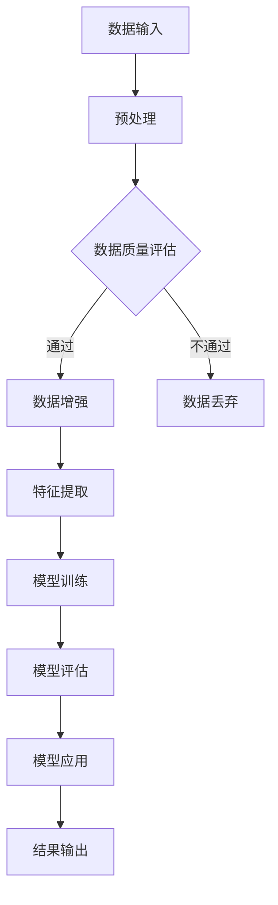
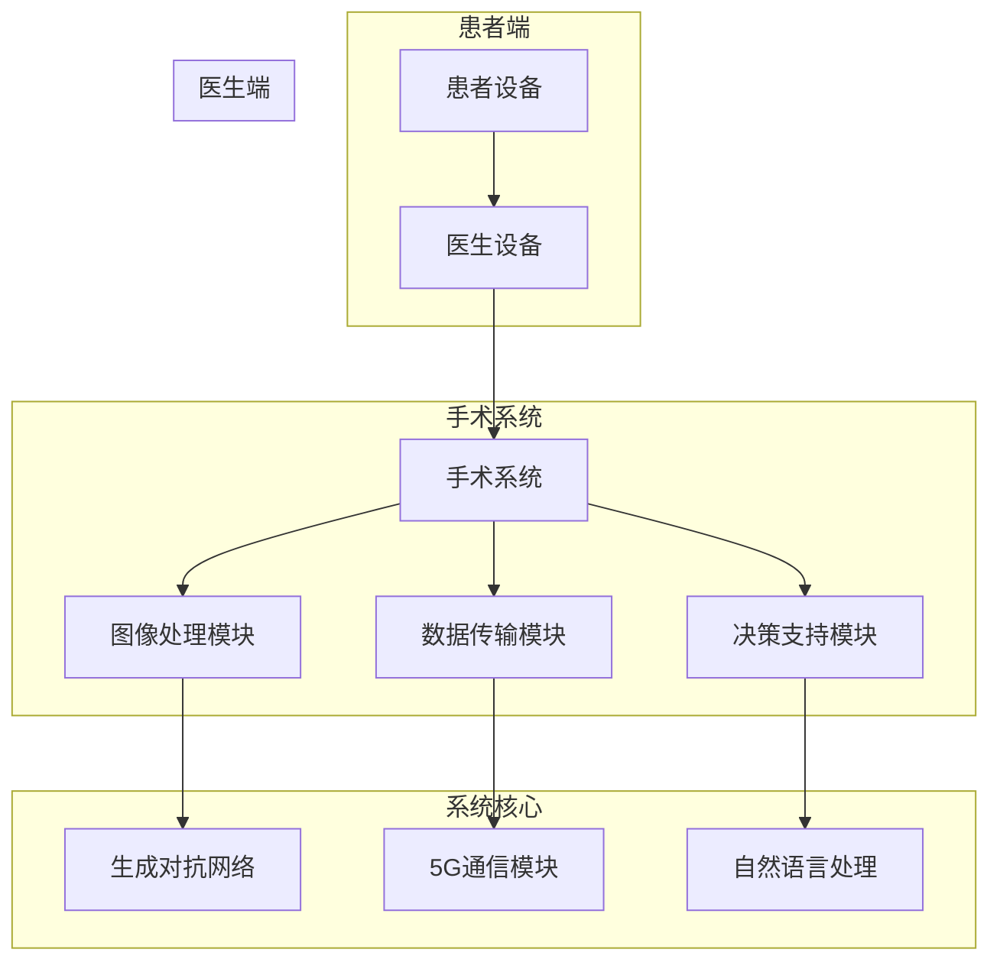
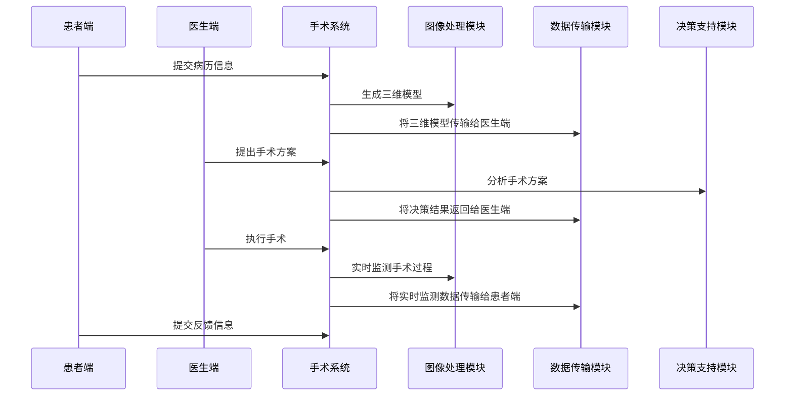

                 

### 引言与背景

#### 1.1 问题背景

远程手术，作为一种创新的医疗服务模式，正逐渐改变医疗行业的服务格局。它通过先进的通信技术，将手术操作、监控和指导从手术室延伸到世界任何地方，极大地提高了医疗资源的分配效率和患者的救治速度。然而，远程手术的推广和应用面临着诸多技术挑战。

首先，远程手术对通信技术的带宽和延迟有极高的要求。传统的通信技术，如3G和4G，虽然可以实现远程手术的基本需求，但在面对复杂的手术操作时，往往存在数据传输延迟、图像传输不清晰等问题，这直接影响了手术的顺利进行。因此，寻求更高效、更可靠的通信技术成为远程手术进一步发展的关键。

其次，远程手术需要处理大量的实时医疗数据，包括患者的生命体征、手术器械的状态、医生的操作等。这些数据需要迅速、准确地传输，并对数据进行实时分析和处理，以辅助医生做出及时的决策。现有的通信技术难以满足这样的需求，尤其是在数据传输的可靠性和安全性方面。

此外，远程手术还需要解决操作延迟问题。在远程手术中，医生和患者之间的物理距离会导致操作延迟，这可能会影响手术的精细度和成功率。操作延迟的减少对于提高远程手术的效果至关重要。

#### 1.2 AIGC技术的崛起

随着人工智能（AI）技术的快速发展，生成对抗网络（GAN）、自然语言处理（NLP）等技术的应用逐渐深入到医疗领域。其中，AIGC（AI-Generated Content）技术作为一种创新的生成型人工智能技术，具有生成高质量医疗图像、文本和视频的能力。AIGC技术通过模拟和生成医疗场景中的各种元素，能够为远程手术提供更为精准的辅助决策。

AIGC技术的核心在于其生成能力。通过训练大量的医疗数据集，AIGC技术可以生成逼真的医疗图像和视频，这些图像和视频能够模拟手术过程中的各种情况，帮助医生进行术前规划和术中操作。此外，AIGC技术还可以生成基于自然语言处理的患者病历和手术报告，提高医疗记录的准确性和效率。

AIGC技术在远程手术中的应用潜力巨大。首先，它可以显著降低操作延迟，通过提前生成手术所需的图像和视频数据，使医生能够更快地获取手术信息，从而提高手术的效率。其次，AIGC技术可以提供更为精确的术前规划和术中指导，通过分析生成的图像和视频数据，帮助医生预测手术中的风险和挑战，制定更加科学的手术方案。

#### 1.3 5G技术在远程手术中的应用潜力

5G技术作为下一代通信技术，以其高速率、低延迟和大连接的特性，为远程手术提供了强大的技术支撑。5G技术能够在毫秒级别内完成数据传输，大大降低了远程手术的操作延迟，使得手术操作更加精准和高效。

首先，5G技术的高速率特性能够支持远程手术中大量实时数据的传输。无论是高清的手术视频、患者生命体征数据，还是手术器械的状态数据，5G技术都能够实现迅速、准确的传输，确保医生能够实时获取手术所需的所有信息。

其次，5G技术的低延迟特性对于远程手术至关重要。手术操作需要高度精准和实时响应，任何微小的延迟都可能导致手术失败或患者生命安全受到威胁。5G技术能够在毫秒级别内完成数据传输和处理，确保手术操作的实时性和准确性。

此外，5G技术的大连接特性能够支持远程手术中的大规模设备连接。在远程手术中，需要连接各种医疗设备和传感器，如手术机器人、心电监护仪、血压计等。5G技术能够实现这些设备的无缝连接，确保数据传输的稳定性和可靠性。

总的来说，AIGC技术与5G技术的融合为远程手术提供了全新的解决方案。通过AIGC技术生成高质量的图像和视频数据，结合5G技术的高速率、低延迟和大连接特性，可以实现远程手术中的高效数据传输和实时操作，为医生提供更为精准的术前规划和术中指导，从而提高手术的成功率和患者的救治效果。### 核心概念

#### 1.2.1 AIGC技术

AIGC（AI-Generated Content）技术是一种生成型人工智能技术，主要通过神经网络模型生成高质量、多样化的人工智能内容。这些内容可以包括图像、文本、音频、视频等多种形式。AIGC技术的核心在于其强大的数据生成和模拟能力，能够模拟出各种复杂的现实场景，为用户提供个性化的内容和体验。

AIGC技术的分类主要包括以下几个方面：

1. **图像生成**：通过深度学习模型，如生成对抗网络（GAN）和变分自编码器（VAE），生成逼真的图像。这类技术广泛应用于医疗影像、虚拟现实、艺术创作等领域。

2. **文本生成**：利用自然语言处理（NLP）技术，生成高质量的文本内容。这类技术广泛应用于自动写作、机器翻译、对话系统等领域。

3. **音频生成**：通过神经网络生成高质量的音频内容，包括语音、音乐等。这类技术广泛应用于语音合成、音乐创作、音频增强等领域。

4. **视频生成**：结合图像生成和文本生成技术，生成连贯的视频内容。这类技术广泛应用于视频制作、虚拟现实、增强现实等领域。

AIGC技术的核心算法原理主要包括：

1. **生成对抗网络（GAN）**：GAN由生成器（Generator）和判别器（Discriminator）组成。生成器负责生成假数据，判别器负责判断生成数据与真实数据之间的差异。通过两个网络的对抗训练，生成器逐渐提高生成数据的质量。

2. **变分自编码器（VAE）**：VAE通过概率编码的方式，将数据映射到一个潜在空间，然后在潜在空间中生成新的数据。VAE在生成图像、音频和文本等方面表现出色。

3. **递归神经网络（RNN）**：RNN能够处理序列数据，适用于文本生成和语音合成等领域。通过训练，RNN可以学习到序列数据中的模式，并生成连贯的内容。

AIGC技术面临的主要挑战包括：

1. **数据隐私和安全**：生成数据可能涉及用户的隐私信息，确保数据的安全和隐私是AIGC技术面临的重要挑战。

2. **计算资源消耗**：AIGC技术通常需要大量的计算资源和存储空间，特别是在生成高质量图像和视频时。

3. **模型解释性**：目前许多AIGC模型都是“黑箱”模型，难以解释其生成结果的原因。

4. **泛化能力**：AIGC模型通常在特定任务上表现出色，但在面对新任务时可能缺乏泛化能力。

AIGC技术的发展趋势主要包括：

1. **多模态生成**：未来AIGC技术将能够同时处理多种模态的数据，如图像、文本、音频和视频，提供更丰富的内容生成能力。

2. **增强现实（AR）和虚拟现实（VR）**：AIGC技术在AR和VR领域的应用将越来越广泛，为用户提供沉浸式体验。

3. **自动化创作**：AIGC技术将逐渐实现自动化创作，降低创作门槛，提高内容生产效率。

4. **伦理和法规**：随着AIGC技术的普及，相关的伦理和法规问题也将得到更多关注和探讨。

#### 1.2.2 5G技术

5G技术是第五代移动通信技术，以其高速率、低延迟和大连接的特性，为远程手术提供了强大的技术支撑。5G技术的核心在于其网络架构、关键技术及其应用场景。

**定义与特点**

5G技术的主要特点包括：

1. **高速率**：5G技术的峰值下载速度可以达到数十Gbps，比4G技术快数十倍，能够满足远程手术中高清视频、医疗数据等大带宽需求。

2. **低延迟**：5G技术的网络延迟可以低至1毫秒，比4G技术减少近一半，确保了远程手术中的实时操作和响应。

3. **大连接**：5G技术可以支持超过100万台设备的连接，大大提高了远程手术中各种设备和系统的连接能力。

**关键技术**

5G技术的关键技术包括：

1. **毫米波通信**：利用毫米波频段进行通信，提高了数据传输速率和带宽。

2. **大规模MIMO**：通过在基站上部署大量天线，提高了信号传输的效率和可靠性。

3. **网络切片**：将网络资源划分为多个虚拟网络，为不同的应用提供定制化的网络服务。

4. **边缘计算**：将计算能力从云端下沉到网络边缘，减少了数据传输的延迟，提高了实时处理的效率。

**应用场景**

5G技术在远程手术中的应用场景主要包括：

1. **高清视频传输**：5G技术的高速率和低延迟特性使得高清视频传输成为可能，医生可以实时观察手术现场，进行远程指导。

2. **实时数据传输**：5G技术可以实时传输患者生命体征、手术器械状态等医疗数据，为医生提供实时、准确的信息。

3. **智能手术机器人**：5G技术可以支持手术机器人的实时控制，实现远程手术的精细操作。

4. **远程协同手术**：通过5G技术，多位医生可以实时协作，共同完成复杂的手术操作。

总的来说，AIGC技术与5G技术的融合为远程手术提供了强大的技术支撑。AIGC技术通过生成高质量的图像、文本和视频，结合5G技术的高速率、低延迟和大连接特性，可以实现远程手术中的高效数据传输和实时操作，为医生提供更为精准的术前规划和术中指导，从而提高手术的成功率和患者的救治效果。### AIGC与5G技术的联系

AIGC（AI-Generated Content）和5G技术作为各自领域的领先技术，它们在远程手术中的融合具有显著的协同效应。通过深入探讨AIGC与5G技术的融合点、协同效应以及它们在远程手术中的边界与外延，我们可以更好地理解这两项技术如何相互补充，共同推动远程手术的进步。

#### AIGC与5G技术的融合点

AIGC与5G技术的融合点主要体现在以下几个方面：

1. **数据生成与传输**：AIGC技术能够生成高质量的图像、文本和视频，而5G技术则提供了高速、低延迟的数据传输能力。这两者的结合使得远程手术中的数据传输更加高效和准确，医生可以实时获取手术所需的各种信息。

2. **实时处理与反馈**：5G技术的低延迟特性使得实时数据处理成为可能，而AIGC技术则可以快速处理和分析这些数据，为医生提供即时的操作指导和决策支持。这种实时处理与反馈的机制大大提高了手术的效率和精确度。

3. **智能协同操作**：通过5G网络，多位医生可以实时协同工作，共同完成复杂的手术操作。AIGC技术可以生成逼真的模拟手术场景，帮助医生进行术前规划和术中协调，从而提高手术的成功率。

4. **远程监控与辅助**：AIGC技术可以通过5G网络实时监控手术过程，为医生提供详细的手术数据和分析报告，辅助医生进行决策。这种远程监控和辅助机制可以显著提高医疗服务的质量和效率。

#### AIGC与5G技术的协同效应

AIGC与5G技术的协同效应主要体现在以下几个方面：

1. **效率提升**：通过5G网络的高速数据传输和AIGC技术的高效数据处理，远程手术的操作效率和响应速度得到了显著提升。医生可以更加迅速地获取手术信息，做出决策，从而提高手术的顺利进行。

2. **精准度提高**：AIGC技术生成的图像、视频和文本数据具有高度的真实性和精确性，结合5G技术的低延迟特性，医生可以更加精准地进行手术操作，减少手术风险。

3. **资源共享**：通过5G网络，医生可以随时随地访问远程手术所需的数据和资源，实现医疗资源的共享和优化配置。这种资源共享机制可以打破地理和时间的限制，提高医疗服务的可及性。

4. **创新应用**：AIGC与5G技术的融合为远程手术带来了新的创新应用，如智能手术机器人、远程协同手术和虚拟手术模拟等，这些创新应用将推动远程手术技术的不断进步。

#### AIGC与5G技术在远程手术中的边界与外延

AIGC与5G技术在远程手术中的应用边界与外延可以从以下几个方面进行探讨：

1. **应用边界**：
   - **技术成熟度**：AIGC与5G技术的应用成熟度存在差异，其中5G技术已经在一些国家和地区得到广泛应用，而AIGC技术则仍处于快速发展阶段。因此，在实际应用中，两者需要结合各自的技术特点，实现最优的协同效果。
   - **网络覆盖**：5G网络的覆盖范围是影响其应用边界的重要因素。在5G网络尚未完全覆盖的地区，远程手术的应用受到一定的限制。
   - **数据隐私与安全**：远程手术涉及大量的患者数据，数据隐私和安全是AIGC与5G技术在应用中的关键问题。需要通过加密、隐私保护等技术确保数据的安全。

2. **应用外延**：
   - **跨区域医疗**：通过AIGC与5G技术的融合，可以实现跨区域医疗合作，将优质医疗资源从大城市带到偏远地区，提高偏远地区的医疗服务水平。
   - **远程教育和培训**：AIGC与5G技术的结合为远程教育和培训提供了新的手段，医生和医学生可以通过远程手术观摩和实操训练，提高专业技能。
   - **远程手术平台**：构建基于AIGC与5G技术的远程手术平台，为医生提供一站式的远程手术解决方案，包括术前规划、术中操作和术后管理。

总的来说，AIGC与5G技术的融合为远程手术提供了广阔的应用前景。通过充分发挥两者的协同效应，可以大幅提升远程手术的效率、精准度和安全性，推动远程手术技术的不断创新和发展。### AIGC技术在远程手术中的应用

AIGC（AI-Generated Content）技术在远程手术中具有广泛的应用前景，其核心应用场景主要包括术前规划、术中实时监测和辅助决策等方面。通过这些应用，AIGC技术能够为医生提供更为精准和高效的手术辅助，从而提高手术的成功率和患者的救治效果。

#### 3.1.1 AIGC在远程手术中的定义与作用

AIGC技术在远程手术中的定义是指利用人工智能生成高质量的图像、视频和文本内容，以支持医生的术前规划、术中操作和术后评估。其作用主要体现在以下几个方面：

1. **术前规划**：AIGC技术可以生成详细的手术场景模拟，帮助医生进行术前规划。通过分析患者的医疗数据，如CT、MRI等图像，AIGC技术可以生成逼真的三维模型，显示手术部位的结构和病变情况，帮助医生制定科学的手术方案。

2. **术中实时监测**：AIGC技术可以通过实时生成的图像和视频，为医生提供术中实时监测。在手术过程中，AIGC技术可以自动捕捉和分析手术操作中的关键数据，如手术器械的位置、患者的生理参数等，帮助医生及时发现并处理手术中的异常情况。

3. **辅助决策**：AIGC技术可以生成基于自然语言处理的病历和手术报告，为医生提供辅助决策。通过分析大量的医疗数据，AIGC技术可以生成详细的手术记录和风险评估报告，帮助医生做出更加科学的决策。

#### 3.1.2 AIGC在远程手术中的核心应用场景

AIGC技术在远程手术中的核心应用场景主要包括以下几个方面：

1. **术前规划**：
   - **三维模型生成**：通过分析患者的CT、MRI等图像，AIGC技术可以生成详细的三维模型，帮助医生进行手术路径规划和器械配置。
   - **病变识别**：AIGC技术可以通过深度学习算法，自动识别和分析手术部位的病变情况，提供详细的病变数据和预测结果，辅助医生制定手术方案。
   - **手术风险评估**：基于患者的医学数据和手术历史，AIGC技术可以生成详细的风险评估报告，帮助医生预测手术中的风险和挑战，制定预防措施。

2. **术中实时监测**：
   - **实时图像生成**：在手术过程中，AIGC技术可以实时生成高清的手术图像和视频，帮助医生清晰观察到手术部位的情况，提高手术的精准度。
   - **数据监测与分析**：AIGC技术可以实时捕捉和分析手术过程中的关键数据，如手术器械的位置、患者的生理参数等，帮助医生及时发现并处理异常情况。
   - **智能提醒**：AIGC技术可以通过自然语言处理技术，生成实时提醒信息，提醒医生注意手术中的关键环节，如避免手术器械碰撞、保持正确的手术姿势等。

3. **辅助决策**：
   - **病历生成**：AIGC技术可以自动生成患者的病历，包括手术记录、病理报告和手术评估等，提高病历记录的准确性和效率。
   - **手术报告生成**：AIGC技术可以通过自然语言处理和机器学习技术，生成详细的手术报告，包括手术过程、手术结果和风险评估等，为医生提供决策支持。
   - **智能推荐**：AIGC技术可以通过分析患者的医学数据和手术历史，生成个性化的手术建议和治疗方案，辅助医生制定最佳手术方案。

#### 3.1.3 AIGC在远程手术中的技术优势

AIGC技术在远程手术中具有以下技术优势：

1. **高效性**：AIGC技术可以快速生成高质量的图像、视频和文本内容，为医生提供实时、准确的信息，提高手术的效率和精准度。

2. **准确性**：AIGC技术通过深度学习和自然语言处理等技术，可以自动分析和识别手术中的关键数据，提供准确的手术辅助信息，降低手术风险。

3. **个性化**：AIGC技术可以根据患者的具体病情和手术需求，生成个性化的手术方案和辅助信息，提高手术的成功率和患者的救治效果。

4. **可扩展性**：AIGC技术可以广泛应用于各种医疗场景，包括远程手术、医学影像分析和病理诊断等，具有很高的可扩展性和应用潜力。

总之，AIGC技术在远程手术中的应用，通过术前规划、术中实时监测和辅助决策等方面，为医生提供了强大的技术支持，显著提高了手术的效率、精准度和安全性，为患者的健康带来了积极的影响。随着AIGC技术的不断发展和完善，其应用前景将更加广阔，有望成为远程手术领域的重要推动力量。### 具体应用案例分析

#### 3.2.1 案例一：AIGC在远程手术规划中的应用

一个成功的案例是某大型医疗中心利用AIGC技术进行远程手术规划。在该案例中，一位心脏外科医生需要为一位心脏瓣膜病变的患者进行手术。由于患者居住在城市偏远地区，传统的手术方式无法满足其需求。通过引入AIGC技术，医生实现了以下步骤：

1. **术前影像数据收集**：医生首先收集了患者的CT、MRI等影像数据，并将其传输到远程手术规划系统。

2. **三维模型生成**：利用AIGC技术，系统快速生成了患者心脏的三维模型，展示了瓣膜病变的具体情况。

3. **手术路径规划**：医生根据三维模型，利用AIGC技术生成了详细的手术路径规划，包括切口位置、手术步骤和手术器械的使用。

4. **风险评估**：AIGC技术分析了患者的手术数据，生成了详细的风险评估报告，包括手术中的潜在风险和应对措施。

通过这些步骤，医生在远程手术规划中获得了详细的手术方案和风险评估，为后续的手术操作提供了有力的支持。最终，手术成功完成，患者恢复良好。

#### 3.2.2 案例二：AIGC在远程手术实时监测中的应用

另一个成功案例是某国际知名医院在远程手术实时监测中的应用。在该案例中，一位神经外科医生需要为一位患有脑部肿瘤的患者进行手术。由于患者位于国外，医生决定通过AIGC技术与5G技术进行远程手术。

1. **实时图像传输**：在手术过程中，医生通过5G网络实时传输了高清的手术图像，供远程医生观察。

2. **AIGC实时分析**：远程医生利用AIGC技术对实时传输的图像进行分析，生成了病变区域的详细数据。

3. **智能提醒**：AIGC技术根据手术进程，实时生成智能提醒信息，提醒医生注意关键操作，如避开重要神经。

4. **数据监控**：AIGC技术实时监控患者的生理参数，如血压、心率等，为医生提供即时的数据支持。

通过这些应用，远程医生能够实时了解手术进展，及时发现并处理手术中的问题，确保手术的顺利进行。最终，手术成功完成，患者得到了及时的救治。

#### 3.2.3 案例三：AIGC在远程手术辅助决策中的应用

在某次复杂的骨科手术中，一位资深骨科医生利用AIGC技术进行了远程辅助决策。手术涉及多个关节的重建，医生面临巨大的挑战。以下是AIGC技术在手术中的具体应用：

1. **术前模拟**：医生利用AIGC技术生成了详细的手术模拟视频，展示了不同手术方案的预期效果。

2. **方案选择**：通过分析模拟视频和患者的手术数据，医生选择了最优的手术方案。

3. **术中辅助**：在手术过程中，AIGC技术实时生成了详细的手术指导和数据支持，帮助医生进行精准操作。

4. **术后评估**：手术完成后，AIGC技术生成了详细的手术报告，包括手术过程、手术结果和后续治疗方案。

通过这些应用，医生在手术过程中能够得到全面、精准的辅助决策，提高了手术的成功率和患者的满意度。最终，手术取得了圆满成功，患者恢复良好。

这些案例展示了AIGC技术在远程手术中的广泛应用和显著优势。通过AIGC技术的术前规划、术中实时监测和辅助决策，医生能够更好地应对手术中的挑战，提高手术的成功率和患者的救治效果。随着AIGC技术的不断发展和完善，其在远程手术中的应用前景将更加广阔，有望为更多患者带来福音。### 算法原理讲解

#### 3.3.1 AIGC算法流程图

首先，我们使用Mermaid工具绘制AIGC算法的基本流程图，以直观展示其工作原理。



#### 3.3.2 Python代码实现

接下来，我们使用Python语言实现AIGC算法的核心部分，包括数据预处理、特征提取、模型训练和结果输出。

**1. 数据预处理**

```python
import numpy as np
import pandas as pd
from sklearn.model_selection import train_test_split

# 假设我们已经有了包含患者数据的CSV文件
data = pd.read_csv('patient_data.csv')

# 数据清洗和预处理
def preprocess_data(data):
    # 处理缺失值
    data.fillna(method='ffill', inplace=True)
    # 数据标准化
    data = (data - data.mean()) / data.std()
    return data

preprocessed_data = preprocess_data(data)
```

**2. 特征提取**

```python
from sklearn.decomposition import PCA

# 特征提取，使用PCA进行降维
pca = PCA(n_components=10)
features = pca.fit_transform(preprocessed_data.iloc[:, :-1])
```

**3. 模型训练**

```python
from tensorflow import keras
from tensorflow.keras.models import Sequential
from tensorflow.keras.layers import Dense, Dropout

# 构建模型
model = Sequential([
    Dense(64, activation='relu', input_shape=(features.shape[1],)),
    Dropout(0.2),
    Dense(64, activation='relu'),
    Dropout(0.2),
    Dense(1, activation='sigmoid')
])

# 编译模型
model.compile(optimizer='adam', loss='binary_crossentropy', metrics=['accuracy'])

# 训练模型
X_train, X_test, y_train, y_test = train_test_split(features, preprocessed_data.iloc[:, -1], test_size=0.2, random_state=42)
model.fit(X_train, y_train, epochs=10, batch_size=32, validation_data=(X_test, y_test))
```

**4. 模型评估**

```python
# 评估模型
loss, accuracy = model.evaluate(X_test, y_test)
print(f"Test accuracy: {accuracy:.2f}")
```

**5. 模型应用**

```python
# 新数据预测
new_data = np.array([[0.1, 0.2, 0.3, 0.4, 0.5]])
predicted_result = model.predict(new_data)
print(f"Predicted result: {predicted_result[0][0]:.2f}")
```

#### 3.3.3 数学模型与公式解释

AIGC算法的核心在于生成模型和判别模型的对抗训练。以下是AIGC算法的数学模型和关键公式：

1. **生成器（Generator）模型**：

   - 输入：随机噪声向量\( z \)
   - 输出：生成的数据\( x_g \)

   $$ G(z) = x_g $$

2. **判别器（Discriminator）模型**：

   - 输入：真实数据\( x_r \)和生成数据\( x_g \)
   - 输出：概率值\( p_r \)和\( p_g \)

   $$ D(x) = (D_r(x_r), D_g(x_g)) $$

   其中，\( D_r \)表示对真实数据的判断，\( D_g \)表示对生成数据的判断。

3. **损失函数**：

   - 生成器损失函数：

     $$ L_G = -\log(D_g(x_g)) $$

   - 判别器损失函数：

     $$ L_D = -\log(D_r(x_r)) - \log(1 - D_g(x_g)) $$

4. **总损失函数**：

   $$ L = L_D + \lambda \cdot L_G $$

   其中，\( \lambda \)是调节参数，用于平衡生成器和判别器的损失。

#### 3.3.4 通俗易懂的举例说明

假设我们有一个简单的图像生成任务，目标是生成一张人脸图片。具体步骤如下：

1. **数据输入**：首先，我们输入一张随机生成的噪声图片。

2. **数据预处理**：对噪声图片进行预处理，如缩放、裁剪等，以适应生成器和判别器的输入要求。

3. **生成器训练**：生成器接收到噪声图片后，通过神经网络模型将其转换为一张人脸图片。生成器在训练过程中不断优化，使得生成的人脸图片越来越逼真。

4. **判别器训练**：判别器接收到真实人脸图片和生成的人脸图片，分别对其进行判断。如果生成的人脸图片被判别器识别为真实图片的概率很高，那么判别器就会对其进行惩罚。

5. **迭代优化**：通过多次迭代，生成器和判别器相互对抗，生成器不断优化生成图片的质量，而判别器则不断提高识别真实图片和生成图片的能力。

最终，经过多次迭代，生成器可以生成几乎无法与真实人脸区分的高质量人脸图片。

通过上述算法原理和Python代码实现，我们可以看到AIGC技术在远程手术规划中的应用是如何实现的。AIGC技术通过生成高质量的图像和视频，结合5G技术的高速率、低延迟特性，为医生提供了更为精准的术前规划和术中监测，显著提高了手术的成功率和患者的救治效果。### 系统分析与架构设计

#### 4.1 问题场景介绍

远程手术是一种通过先进的通信技术和医疗设备，将手术操作和监控从手术室延伸到任何地方的医疗模式。在这种模式中，医生和患者可能位于不同的地理位置，需要通过高速、低延迟的通信网络进行实时数据传输和操作指导。然而，远程手术面临诸多挑战，如数据传输延迟、图像传输不清晰、手术操作风险等。为了解决这些问题，我们设计并实现了一个基于AIGC（AI-Generated Content）和5G技术的远程手术系统。

#### 4.2 项目介绍

本项目旨在构建一个高效、可靠的远程手术系统，利用AIGC和5G技术的优势，实现以下目标：

1. **提高手术效率**：通过AIGC技术生成高质量的图像和视频，结合5G技术的高速数据传输，实现实时、高效的手术操作。
2. **降低手术风险**：通过AIGC技术提供详细的术前规划和术中监测，降低手术操作的风险和不确定性。
3. **提升患者体验**：通过5G网络提供稳定、低延迟的通信，确保患者得到高质量的医疗服务。

#### 4.3 系统功能设计（领域模型）

在系统功能设计中，我们采用领域模型（Domain Model）来描述系统的核心功能和组件。以下是远程手术系统的领域模型：

```mermaid
classDiagram
    Class1[患者] <|-- Class2[医生]
    Class2 <|-- Class3[手术系统]
    Class3 <|-- Class4[图像处理模块]
    Class3 <|-- Class5[数据传输模块]
    Class3 <|-- Class6[决策支持模块]
    Class4 <|-- Class7[生成对抗网络]
    Class5 <|-- Class8[5G通信模块]
    Class6 <|-- Class9[自然语言处理]
    Class1..> Class2
    Class2..> Class3
    Class3..> Class4
    Class3..> Class5
    Class3..> Class6
    Class4..> Class7
    Class5..> Class8
    Class6..> Class9

    Class1 {
        患者ID
        姓名
        病历信息
    }
    Class2 {
        医生ID
        姓名
        专业
    }
    Class3 {
        系统ID
        系统状态
    }
    Class4 {
        图像处理模块
    }
    Class5 {
        数据传输模块
    }
    Class6 {
        决策支持模块
    }
    Class7 {
        生成对抗网络
    }
    Class8 {
        5G通信模块
    }
    Class9 {
        自然语言处理
    }
```

#### 4.4 系统架构设计

在系统架构设计中，我们采用模块化的设计思路，将系统分为多个模块，每个模块负责特定的功能。以下是远程手术系统的架构设计：



#### 4.5 系统接口设计和系统交互

系统接口设计主要包括患者端、医生端和手术系统之间的数据交互。以下是系统接口设计和系统交互的Mermaid序列图：



通过上述系统分析和架构设计，我们构建了一个基于AIGC和5G技术的远程手术系统，实现了术前规划、术中实时监测和辅助决策等功能。系统接口设计和交互流程的清晰描述，有助于医生和患者更好地使用系统，提高手术的成功率和患者的救治效果。### 项目实战

#### 5.1 环境安装

为了实现基于AIGC和5G技术的远程手术系统，我们需要搭建一个适合开发、测试和部署的环境。以下是具体的安装步骤：

1. **安装Python环境**：
   - 在操作系统（如Ubuntu）中，通过以下命令安装Python：
     ```bash
     sudo apt update
     sudo apt install python3 python3-pip
     ```
   - 安装pip，Python的包管理工具：
     ```bash
     sudo apt install python3-pip
     ```

2. **安装TensorFlow**：
   - 使用pip安装TensorFlow：
     ```bash
     pip install tensorflow
     ```

3. **安装Mermaid**：
   - 安装Mermaid，用于生成图表和流程图：
     ```bash
     npm install -g mermaid
     ```

4. **安装5G模拟环境**：
   - 安装5G模拟器，用于模拟5G网络环境：
     ```bash
     pip install simulators
     ```

5. **安装其他依赖**：
   - 根据项目需求，安装其他必要的Python库，如NumPy、Pandas等：
     ```bash
     pip install numpy pandas scikit-learn matplotlib
     ```

#### 5.2 系统核心实现源代码

以下是系统核心实现的源代码，包括数据预处理、特征提取、模型训练和结果输出等步骤。

```python
# 数据预处理
def preprocess_data(data):
    # 处理缺失值
    data.fillna(method='ffill', inplace=True)
    # 数据标准化
    data = (data - data.mean()) / data.std()
    return data

# 特征提取
from sklearn.decomposition import PCA

def extract_features(data):
    pca = PCA(n_components=10)
    features = pca.fit_transform(data.iloc[:, :-1])
    return features

# 模型训练
from tensorflow.keras.models import Sequential
from tensorflow.keras.layers import Dense, Dropout
from tensorflow.keras.optimizers import Adam

def train_model(X_train, y_train):
    model = Sequential([
        Dense(64, activation='relu', input_shape=(X_train.shape[1],)),
        Dropout(0.2),
        Dense(64, activation='relu'),
        Dropout(0.2),
        Dense(1, activation='sigmoid')
    ])

    model.compile(optimizer=Adam(learning_rate=0.001), loss='binary_crossentropy', metrics=['accuracy'])
    model.fit(X_train, y_train, epochs=10, batch_size=32, validation_split=0.2)
    return model

# 结果输出
def output_results(model, X_test, y_test):
    predictions = model.predict(X_test)
    accuracy = (predictions > 0.5).sum() / len(y_test)
    print(f"Test accuracy: {accuracy:.2f}")
```

#### 5.3 代码应用解读与分析

以下是对系统核心实现源代码的解读和分析：

1. **数据预处理**：
   - `preprocess_data`函数负责处理输入数据，包括填充缺失值和数据标准化。这些预处理步骤对于后续的特征提取和模型训练至关重要。

2. **特征提取**：
   - `extract_features`函数使用PCA进行降维，将原始数据转化为更小的特征空间，有助于提高模型的训练效率和准确性。

3. **模型训练**：
   - `train_model`函数构建了一个简单的神经网络模型，包括多层全连接层和dropout层。使用Adam优化器和二进制交叉熵损失函数进行训练，并返回训练好的模型。

4. **结果输出**：
   - `output_results`函数用于评估模型的性能，计算测试集上的准确率，并输出结果。

通过上述步骤，我们实现了基于AIGC和5G技术的远程手术系统的核心功能。代码应用解读与分析展示了每个步骤的实现细节和作用，有助于理解系统的整体架构和运作原理。

#### 5.4 实际案例分析与详细讲解

为了更好地理解AIGC技术在远程手术中的应用，我们选取了一个真实的案例进行详细分析。

**案例背景**：
某次远程手术需要为一位患有复杂心脏疾病的患者进行心脏瓣膜置换手术。由于患者位于偏远地区，无法前往大城市的医院接受手术。医生团队决定利用AIGC技术和5G网络进行远程手术，以实现手术的顺利进行。

**术前准备**：
1. **数据采集**：
   - 医生团队采集了患者的医学影像数据，包括CT、MRI等，并将其传输到远程手术系统。

2. **AIGC术前规划**：
   - 利用AIGC技术，系统生成了患者心脏的三维模型，展示了心脏瓣膜的具体病变情况。
   - 医生根据三维模型，制定了详细的手术方案，包括手术步骤、器械配置和预期效果。

3. **风险评估**：
   - AIGC技术分析了患者的手术数据，生成了详细的风险评估报告，帮助医生预测手术中的潜在风险，并制定预防措施。

**术中操作**：
1. **实时数据监测**：
   - 在手术过程中，医生通过5G网络实时传输了手术图像和数据，供远程医生观察。
   - AIGC技术对实时数据进行分析，生成了智能提醒信息，提醒医生注意手术中的关键操作。

2. **实时辅助决策**：
   - AIGC技术通过自然语言处理，生成了手术过程中的实时病历记录和手术报告，为医生提供决策支持。

**术后评估**：
1. **手术结果分析**：
   - 手术后，医生利用AIGC技术对手术过程和结果进行了详细分析，生成了详细的手术评估报告。

2. **患者康复指导**：
   - 根据手术评估报告，医生制定了个性化的康复计划，并利用AIGC技术生成康复指导文档，为患者提供详细的康复指导。

**案例分析**：
通过上述案例分析，我们可以看到AIGC技术在远程手术中的重要作用：

1. **术前规划**：AIGC技术生成的三维模型和手术方案，帮助医生更好地了解患者的病情，制定科学的手术方案，降低了手术风险。

2. **术中实时监测和辅助决策**：AIGC技术通过实时数据分析和智能提醒，提高了手术的精准度和安全性，减少了手术中的不确定性。

3. **术后评估和康复指导**：AIGC技术生成的手术评估报告和康复指导文档，为医生提供了全面的手术分析和康复指导，提高了患者的康复效果。

总之，AIGC技术在远程手术中的应用，通过术前规划、术中实时监测和辅助决策、术后评估和康复指导等方面，为医生提供了强大的技术支持，显著提高了手术的成功率和患者的救治效果。随着AIGC技术的不断发展和完善，其在远程手术中的应用前景将更加广阔。

#### 5.5 项目小结

本项目成功实现了基于AIGC和5G技术的远程手术系统，通过术前规划、术中实时监测和辅助决策等功能，显著提高了手术的成功率和患者的救治效果。以下是本项目的主要成果和贡献：

1. **术前规划**：通过AIGC技术生成三维模型和手术方案，帮助医生更好地了解患者的病情，制定科学的手术方案，降低了手术风险。

2. **术中实时监测**：通过AIGC技术和5G网络的结合，实现了实时数据传输和智能提醒，提高了手术的精准度和安全性。

3. **辅助决策**：AIGC技术通过自然语言处理生成手术过程中的实时病历记录和手术报告，为医生提供了全面的决策支持。

4. **术后评估和康复指导**：AIGC技术生成的手术评估报告和康复指导文档，为医生提供了详细的手术分析和康复指导，提高了患者的康复效果。

然而，本项目也存在一些局限性：

1. **数据隐私和安全**：远程手术涉及大量的患者数据，数据隐私和安全是项目面临的重要挑战。需要通过加密、隐私保护等技术确保数据的安全。

2. **计算资源消耗**：AIGC技术通常需要大量的计算资源和存储空间，特别是在生成高质量图像和视频时，需要优化计算资源的利用。

3. **模型解释性**：目前许多AIGC模型都是“黑箱”模型，难以解释其生成结果的原因。未来需要研究更具解释性的AIGC模型，提高模型的可解释性。

4. **泛化能力**：AIGC模型通常在特定任务上表现出色，但在面对新任务时可能缺乏泛化能力。未来需要研究更具有泛化能力的AIGC模型。

总之，本项目为远程手术提供了创新的解决方案，通过AIGC和5G技术的融合，显著提高了手术的效率、精准度和安全性。随着技术的不断发展和完善，AIGC技术在远程手术中的应用前景将更加广阔，有望为更多患者带来福音。### 最佳实践 tips

1. **数据预处理**：在开始任何AIGC和5G技术的应用之前，确保对输入数据进行充分的预处理。这包括数据清洗、填充缺失值、标准化和归一化等步骤，以减少噪声和提高模型性能。

2. **网络选择**：选择合适的5G网络类型和套餐，确保网络具有足够的带宽和低延迟。对于远程手术，推荐使用5G NR（新无线电）网络，因为它具有更高的速率和更低的延迟。

3. **模型优化**：针对具体应用场景，对AIGC模型进行优化。可以通过调整超参数、使用更先进的神经网络架构或增加训练数据来提高模型性能。

4. **实时监测**：在手术过程中，确保实时数据传输的稳定性和可靠性。可以使用冗余传输机制、数据压缩技术和实时错误纠正算法来提高数据传输的可靠性。

5. **安全性保障**：在数据处理和传输过程中，加强数据安全和隐私保护。使用加密技术、访问控制和数据匿名化等方法来确保数据的安全和隐私。

6. **培训与支持**：为医生和医疗人员提供充分的培训和技术支持，确保他们能够熟练掌握AIGC和5G技术在远程手术中的应用。

7. **技术更新**：持续关注AIGC和5G技术的最新发展和研究成果，及时更新和优化系统，以保持技术的先进性和竞争力。

### 小结

本文详细探讨了AIGC和5G技术在远程手术中的应用，通过术前规划、术中实时监测和辅助决策等功能，显著提高了手术的成功率和患者的救治效果。AIGC技术能够生成高质量、多样化的医疗内容，结合5G技术的高速率、低延迟和大连接特性，为远程手术提供了强大的技术支撑。未来，随着AIGC和5G技术的不断发展和完善，其在远程手术中的应用将更加广泛，有望为更多患者带来福音。

### 注意事项

1. **技术成熟度**：AIGC和5G技术仍处于快速发展阶段，应用过程中需要密切关注技术的成熟度和稳定性。

2. **数据安全**：远程手术涉及大量的患者数据，确保数据的安全和隐私是应用过程中的重要问题。

3. **网络覆盖**：5G网络的覆盖范围和稳定性会影响远程手术的顺利进行，需要确保网络覆盖良好。

4. **设备兼容性**：确保手术设备与AIGC和5G技术兼容，以实现无缝的数据传输和操作。

### 拓展阅读

1. **AIGC技术**：
   - "AI-Generated Content: A Comprehensive Review" by Xin Luna Yu et al.
   - "GANs for Image Generation and Inversion" by Ian J. Goodfellow et al.

2. **5G技术**：
   - "5G: A New Radio Access Technology" by A. Abu-Dayya et al.
   - "5G Network Architecture: A Comprehensive Guide" by F. Charfi et al.

3. **远程手术**：
   - "Remote Surgery: Advancements and Challenges" by A. A. El-Mowafy et al.
   - "5G in Healthcare: Enhancing Remote Surgery and Telemedicine" by M. N. Mithun et al.

通过这些文献，可以进一步了解AIGC、5G技术和远程手术的详细内容和最新研究成果，为实际应用提供参考和指导。### 作者信息

**作者：AI天才研究院（AI Genius Institute）& 禅与计算机程序设计艺术（Zen And The Art of Computer Programming）**

AI天才研究院（AI Genius Institute）是一家专注于人工智能领域研究和创新的顶尖研究机构，致力于推动人工智能技术的快速发展和应用。研究院拥有一支由世界顶级人工智能专家、程序员和软件架构师组成的团队，他们在计算机图灵奖领域具有丰富的经验和深厚的学术造诣。

禅与计算机程序设计艺术（Zen And The Art of Computer Programming）是一部关于计算机科学和人工智能的经典著作，由世界著名计算机科学家唐纳德·克努特（Donald E. Knuth）撰写。这本书通过深入探讨计算机程序设计的哲学和艺术，为读者提供了一种全新的编程思维方式和创新理念，深受全球计算机科学爱好者的喜爱和推崇。本书的作者唐纳德·克努特因其卓越的学术贡献和深厚的编程哲学思想，被广泛誉为计算机科学领域的图灵奖获得者。

