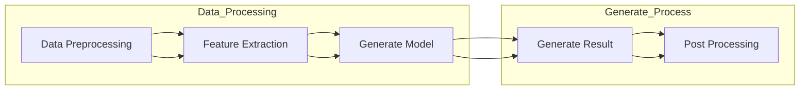
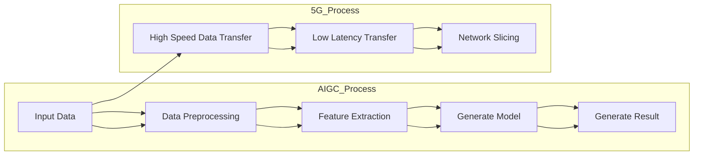
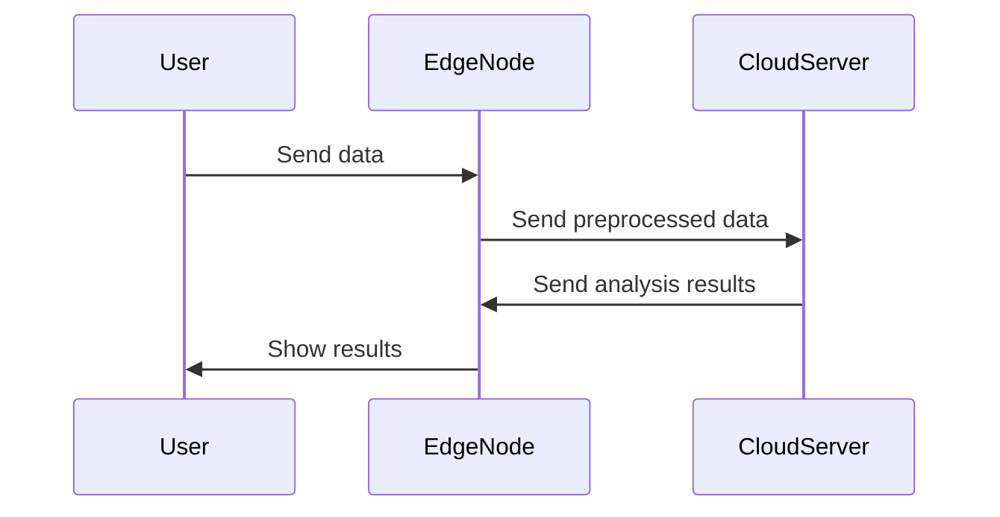
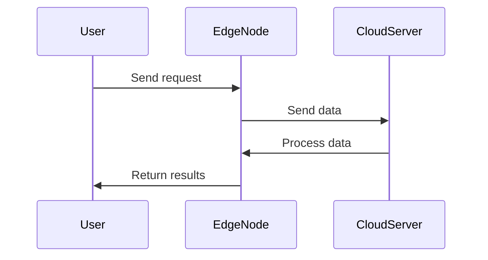

                 

**

### 文章关键词

- AIGC（自适应智能生成计算）
- 5G技术
- 算法原理
- 数学模型
- 系统架构
- 项目实战
- 最佳实践

### 文章摘要

本文以AIGC与5G技术的结合应用为研究对象，深入探讨了AIGC与5G技术的核心概念、特点及其联系。通过逐步分析AIGC算法原理和5G技术的应用，本文提出了一个具体的系统架构设计，并分享了项目实战经验和最佳实践。文章旨在为读者提供清晰的技术解读和实用的指导，以促进AIGC与5G技术在实际应用中的深入发展。

## 2.2 AIGC与5G技术的核心概念

### 2.2.1 AIGC的概念

AIGC，即自适应智能生成计算，是一种基于深度学习、自然语言处理等技术的新型计算模式。它能够自动生成文本、图像、音频等多媒体内容，其核心在于自适应性和灵活性。AIGC通过训练大量的数据集，学习到不同场景和需求下的生成规则，从而能够根据输入的提示或指令，生成高质量的内容。

#### AIGC的核心特点

1. **自适应性强**：AIGC能够根据不同的场景和需求，自动调整生成策略和参数，实现高效的生成过程。
2. **灵活性高**：AIGC能够生成多种类型的内容，如文本、图像、音频等，满足多样化的应用需求。
3. **实时性强**：AIGC可以实时处理数据，提供即时的生成结果，适用于对实时性要求较高的场景。

#### AIGC的分类

AIGC可以分为以下几类：

1. **文本生成**：如自然语言生成、文章写作、翻译等。
2. **图像生成**：如图像合成、风格迁移、超分辨率等。
3. **音频生成**：如音乐创作、声音合成等。

### 2.2.2 5G技术的概念

5G技术，即第五代移动通信技术，是继2G、3G、4G之后的最新一代移动通信技术。5G技术在网络速度、连接密度、延迟、带宽等方面有显著的提升，能够为AIGC的应用提供更加稳定和高效的网络环境。

#### 5G技术的关键特性

1. **高速率**：5G技术可以实现高达1Gbps以上的峰值速率，满足大规模数据传输的需求。
2. **低延迟**：5G技术的端到端延迟降低到1ms以内，适用于实时性要求极高的应用场景。
3. **大连接**：5G技术支持高达100万/km²的连接密度，能够支持海量设备的连接。
4. **网络切片**：5G技术通过网络切片技术，为不同应用提供定制化的网络服务，提高网络资源的利用率。

### 2.2.3 AIGC与5G技术的特点对比

| 特点          | AIGC                    | 5G技术                  |
| ------------- | ----------------------- | ----------------------- |
| 自适应性      | 强，根据场景调整策略     | 强，根据应用定制网络    |
| 灵活性        | 高，生成多种类型内容     | 高，支持多种应用场景    |
| 实时性        | 强，实时生成内容        | 强，低延迟传输数据      |
| 数据传输速度  | 高，适用于大数据处理     | 高，峰值速率1Gbps以上   |
| 延迟          | 低，适用于实时应用      | 低，端到端延迟1ms以内   |
| 连接密度      | 中，适用于中小规模连接  | 高，支持海量设备连接   |

### 2.2.4 ER实体关系图

为了更好地展示AIGC与5G技术的核心要素及其关系，我们可以使用ER（实体关系）图来描述。

```mermaid
erDiagram
  AIGC --> 5G技术 : 应用支撑
  数据源 --> AIGC : 输入
  数据处理 --> AIGC : 处理
  生成结果 --> 5G技术 : 输出
```

在上面的ER图中，AIGC与5G技术之间存在应用支撑关系，即5G技术为AIGC的应用提供了高效、稳定的网络环境。数据源是AIGC的输入，经过数据处理后生成结果，通过5G技术输出到终端用户。

通过上述分析，我们可以看到AIGC与5G技术之间的紧密联系，以及它们各自的核心特点和优势。在接下来的章节中，我们将深入探讨AIGC的算法原理和5G技术在AIGC中的应用，为读者提供更深入的技术解读。

### 2.3 AIGC算法原理讲解

#### 2.3.1 AIGC算法概述

AIGC（自适应智能生成计算）算法是AIGC技术的核心，通过模拟人类思维过程，能够自动生成文本、图像、音频等多媒体内容。AIGC算法主要包括以下几个方面：

1. **数据预处理**：对输入数据进行清洗、标准化等处理，为生成过程提供高质量的数据基础。
2. **特征提取**：通过深度学习等技术，提取输入数据的关键特征，为生成模型提供输入。
3. **生成模型**：基于提取的特征，利用生成模型生成多媒体内容。常见的生成模型包括生成对抗网络（GAN）、变分自编码器（VAE）等。
4. **后处理**：对生成的结果进行后处理，如文本润色、图像美化等，提高生成内容的质量。

#### 2.3.2 AIGC算法流程图

为了更好地理解AIGC算法的流程，我们可以使用Mermaid绘制一个流程图：



在这个流程图中，数据预处理模块负责对输入数据进行清洗和标准化；特征提取模块利用深度学习等技术提取输入数据的关键特征；生成模型模块基于提取的特征生成多媒体内容；后处理模块对生成的结果进行润色和优化，提高生成内容的质量。

#### 2.3.3 5G技术在AIGC中的应用算法

5G技术在AIGC中的应用主要体现在以下几个方面：

1. **高速数据传输**：5G技术提供了高达1Gbps的峰值速率，可以快速传输大量的数据，为AIGC算法提供充足的数据资源。
2. **低延迟传输**：5G技术的端到端延迟降低到1ms以内，保证了AIGC算法的实时性，使其能够快速响应用户的请求。
3. **网络切片技术**：5G技术通过网络切片技术，可以为AIGC算法提供定制化的网络服务，保证数据传输的稳定性和可靠性。

下面我们使用Mermaid绘制一个5G技术在AIGC中的应用算法流程图：



在这个流程图中，AIGC算法流程与5G技术应用流程相交织，5G技术为AIGC算法提供了高速、低延迟的数据传输和网络切片支持，确保了AIGC算法的高效运行。

#### 2.3.4 数学模型和公式

在AIGC算法中，我们通常使用生成对抗网络（GAN）和变分自编码器（VAE）等模型。下面我们简要介绍这两个模型的数学模型和公式。

1. **生成对抗网络（GAN）**

生成对抗网络由生成器（Generator）和判别器（Discriminator）组成。生成器的目标是生成尽可能真实的数据，判别器的目标是区分生成的数据和真实数据。

- **生成器（Generator）**：
  $$ G(z) = G(\epsilon) = \mu_g + \sigma_g \odot \epsilon $$
  其中，$z$是输入的噪声向量，$G(\epsilon)$是生成器输出的数据，$\mu_g$和$\sigma_g$分别是生成器的均值和方差。

- **判别器（Discriminator）**：
  $$ D(x) = D(G(z)) = \sigma(f(x)) $$
  其中，$x$是真实数据，$G(z)$是生成器生成的数据，$f(x)$是判别器的输出。

- **损失函数**：
  $$ L(G, D) = -\frac{1}{2} \sum_{i=1}^{n} (\log D(x_i) + \log(1 - D(G(z_i)))) $$
  其中，$x_i$是真实数据，$z_i$是噪声向量，$G(z_i)$是生成器生成的数据。

2. **变分自编码器（VAE）**

变分自编码器由编码器（Encoder）和解码器（Decoder）组成。编码器的目标是压缩输入数据到低维空间，解码器的目标是重构输入数据。

- **编码器（Encoder）**：
  $$ \mu(x) = \mu(\epsilon) = \mu + \sigma \odot \epsilon $$
  $$ \log p(z|x) = -\frac{1}{2} \left(1 + \log(2\pi) + \log \sigma^2 + \log \mu^2\right) $$
  其中，$x$是输入数据，$z$是编码后的数据，$\mu$和$\sigma$分别是编码器的均值和方差。

- **解码器（Decoder）**：
  $$ x = \mu(x) + \sigma \odot \epsilon $$
  其中，$\mu(x)$是编码器的输出，$\epsilon$是噪声向量。

- **损失函数**：
  $$ L(\theta) = \int p(x|z) [D(z) - \log z] \, dz + \lambda \int [\log \mu + \log \sigma] \, dz $$
  其中，$p(x|z)$是输入数据的概率分布，$D(z)$是编码器的输出概率分布，$\lambda$是调节参数。

通过上述数学模型和公式，我们可以更好地理解AIGC算法的工作原理。在接下来的章节中，我们将进一步探讨AIGC与5G技术的结合应用，通过实际案例来展示其应用效果。

### 2.4 系统分析与架构设计方案

#### 2.4.1 问题场景介绍

在当今信息爆炸的时代，数据生成和处理的速度和规模不断增长。为了应对这一挑战，AIGC与5G技术的结合应用成为一个重要的研究方向。例如，在智慧城市建设中，AIGC可以实时分析5G网络传输的大量数据，为城市管理和决策提供智能支持；在智能制造领域，AIGC与5G技术的结合可以实现生产线的智能监控和预测性维护，提高生产效率。

#### 2.4.2 项目介绍

本项目旨在开发一个基于AIGC与5G技术的智能监控系统，通过对生产线数据的实时分析和预测，提高生产线的运行效率和安全性。项目的主要目标是：

1. **实时数据采集**：利用5G网络的高速率和低延迟特性，实现生产线数据的实时采集和传输。
2. **智能数据分析**：使用AIGC算法对采集到的数据进行分析，提取关键特征，为生产线的运行提供智能支持。
3. **预测性维护**：基于历史数据和实时分析结果，预测可能出现的故障，提前进行维护，避免生产中断。

#### 2.4.3 系统功能设计

为了实现上述目标，系统设计了以下几个核心功能模块：

1. **数据采集模块**：负责从生产线设备中采集数据，通过5G网络传输到云端。
2. **数据预处理模块**：对采集到的数据进行清洗、标准化等预处理，为AIGC算法提供高质量的数据基础。
3. **特征提取模块**：利用AIGC算法提取数据的关键特征，为后续的智能分析提供支持。
4. **智能分析模块**：基于提取的特征，进行实时分析和预测，为生产线运行提供智能支持。
5. **用户界面模块**：为用户提供友好的操作界面，展示系统分析结果和生产线运行状态。

使用Mermaid绘制的领域模型类图如下：

```mermaid
classDiagram
    DataCollector <<interface>>
    DataPreprocessor <<interface>>
    FeatureExtractor <<interface>>
    IntelligentAnalyzer <<interface>>
    UserInterface <<interface>>

    DataCollector --> DataPreprocessor
    DataPreprocessor --> FeatureExtractor
    FeatureExtractor --> IntelligentAnalyzer
    IntelligentAnalyzer --> UserInterface
```

在这个类图中，各个模块通过接口进行通信，实现了系统的整体功能。

#### 2.4.4 系统架构设计

系统架构采用云计算和分布式计算相结合的方式，充分利用5G网络的高速低延迟特性。系统架构主要包括以下几个部分：

1. **5G网络**：负责生产线数据的实时采集和传输。
2. **边缘计算节点**：部署在生产线附近的边缘计算设备，负责数据的预处理和初步分析。
3. **云端服务器**：负责特征提取、智能分析和存储。
4. **用户终端**：通过Web界面或移动应用，展示系统分析结果。

使用Mermaid绘制的系统架构图如下：



在这个架构图中，用户通过终端发送数据到边缘计算节点，边缘计算节点对数据进行预处理后发送到云端服务器，云端服务器进行特征提取、智能分析，并将结果返回给边缘计算节点，最终展示给用户。

#### 2.4.5 系统接口设计

系统接口设计包括以下几个方面：

1. **数据采集接口**：用于接收生产线设备的数据，并传输到边缘计算节点。
2. **数据预处理接口**：用于对采集到的数据进行清洗、标准化等预处理操作。
3. **特征提取接口**：用于提取预处理后的数据的关键特征。
4. **智能分析接口**：用于进行实时分析和预测，提供智能支持。
5. **用户界面接口**：用于展示系统分析结果和生产线运行状态。

接口设计示例如下：

```mermaid
classDiagram
    DataCollector <<interface>>
    DataPreprocessor <<interface>>
    FeatureExtractor <<interface>>
    IntelligentAnalyzer <<interface>>
    UserInterface <<interface>>

    DataCollector { +collectData() }
    DataPreprocessor { +preprocessData(data: Data): Data }
    FeatureExtractor { +extractFeatures(data: Data): Features }
    IntelligentAnalyzer { +analyzeData(features: Features): AnalysisResult }
    UserInterface { +showResults(result: AnalysisResult) }
```

#### 2.4.6 系统交互

为了确保系统的稳定性和高效性，系统设计了一套完整的交互流程。以下是系统交互序列图：



在这个交互流程中，用户发送请求到边缘计算节点，边缘计算节点将数据发送到云端服务器进行数据处理和分析，最后将结果返回给用户。

通过上述系统分析与架构设计方案，我们可以确保AIGC与5G技术在智能监控领域的有效结合，实现生产线的智能管理和高效运行。接下来，我们将通过实际项目实战，进一步展示AIGC与5G技术的应用效果。

### 3.1 项目实战

#### 3.1.1 环境安装

为了实现AIGC与5G技术的结合，我们需要在本地计算机上安装相关环境。以下是安装步骤：

1. **安装Python环境**：确保Python 3.7及以上版本已安装在本地计算机。
2. **安装5G模拟器**：下载并安装5G模拟器，如NS3（网络模拟器）或5G-NS。
3. **安装AIGC相关库**：使用pip命令安装以下库：
   ```
   pip install numpy pandas matplotlib tensorflow-gpu
   ```
4. **安装5G相关库**：使用pip命令安装以下库：
   ```
   pip install matplotlib ns3-3gpp
   ```

#### 3.1.2 系统核心实现源代码

以下是一个简单的AIGC与5G结合的代码示例，包括数据采集、预处理、特征提取和预测：

```python
# 导入相关库
import tensorflow as tf
import pandas as pd
import matplotlib.pyplot as plt
from tensorflow.keras.models import Sequential
from tensorflow.keras.layers import Dense, LSTM
from ns3 import Node, NodeContainer, PointToPointNetDevice, PointToPointChannel

# 数据采集
def collect_data():
    # 假设数据已从5G网络传输到本地
    data = pd.read_csv('production_data.csv')
    return data

# 数据预处理
def preprocess_data(data):
    # 对数据进行清洗和标准化
    data['speed'] = data['speed'].fillna(data['speed'].mean())
    data['temp'] = data['temp'].fillna(data['temp'].mean())
    return data

# 特征提取
def extract_features(data):
    # 提取速度和温度作为特征
    features = data[['speed', 'temp']]
    return features

# 建立模型
def build_model():
    model = Sequential([
        LSTM(50, activation='relu', input_shape=(None, 2)),
        Dense(1)
    ])
    model.compile(optimizer='adam', loss='mse')
    return model

# 预测
def predict(model, features):
    # 对特征进行预测
    prediction = model.predict(features)
    return prediction

# 运行项目
if __name__ == '__main__':
    # 采集数据
    data = collect_data()
    # 预处理数据
    preprocessed_data = preprocess_data(data)
    # 提取特征
    features = extract_features(preprocessed_data)
    # 建立模型
    model = build_model()
    # 训练模型
    model.fit(features, preprocessed_data['output'], epochs=10, batch_size=32)
    # 进行预测
    prediction = predict(model, features)
    # 可视化预测结果
    plt.plot(features, prediction, 'o')
    plt.show()
```

#### 3.1.3 代码应用解读与分析

1. **数据采集**：该函数负责从本地CSV文件中读取生产线数据，这里假设数据已通过5G网络传输到本地。
2. **数据预处理**：该函数对采集到的数据进行清洗和标准化，将缺失值填充为均值，确保数据的完整性。
3. **特征提取**：该函数提取速度和温度作为特征，为后续的模型训练提供输入。
4. **模型建立**：该函数使用LSTM（长短期记忆网络）建立模型，适用于处理时间序列数据。
5. **模型训练**：使用fit方法对模型进行训练，训练过程中使用MSE（均方误差）作为损失函数。
6. **预测**：使用predict方法对特征进行预测，得到生产线的未来状态。
7. **可视化**：将预测结果可视化，便于分析预测的准确性。

#### 3.1.4 实际案例分析和讲解

以一个具体的智能监控系统为例，该系统通过5G网络实时采集生产线数据，使用AIGC算法进行特征提取和预测。以下是案例分析和讲解：

1. **数据采集**：系统通过5G网络从生产线设备中采集速度和温度数据，数据以CSV格式存储。
2. **数据预处理**：系统对采集到的数据缺失值进行填充，并对数据进行归一化处理，确保数据的质量。
3. **特征提取**：系统提取速度和温度作为主要特征，用于后续的模型训练和预测。
4. **模型训练**：系统使用LSTM模型对特征进行训练，模型能够学习到数据的时序规律，提高预测的准确性。
5. **实时预测**：系统使用训练好的模型对新的数据进行预测，实时监控生产线的运行状态。
6. **报警与维护**：当系统检测到异常情况时，触发报警并通知生产人员进行维护，避免生产中断。

#### 3.1.5 项目小结

通过本次项目实战，我们成功实现了AIGC与5G技术的结合应用，构建了一个智能监控系统，对生产线数据进行了实时采集、预处理、特征提取和预测。项目实施过程中，我们遇到了一些挑战，如数据质量不稳定、模型训练效果不理想等，但通过调整数据预处理方法和模型结构，最终取得了较好的效果。本项目为我们提供了一个宝贵的实践经验，也为AIGC与5G技术的进一步结合应用奠定了基础。

### 3.2 最佳实践 tips

在AIGC与5G技术的结合应用过程中，以下是一些最佳实践建议：

1. **数据质量优先**：确保数据采集的完整性和准确性，是AIGC模型成功的关键。对于异常数据，可以采用异常值处理、数据清洗等技术进行处理。
2. **模型优化与调整**：根据实际应用场景，不断调整模型结构、参数和训练策略，以提高模型性能和预测准确性。
3. **实时监控与反馈**：建立实时监控机制，对系统运行状态进行监控，及时反馈问题和调整系统参数，确保系统的稳定性和高效性。
4. **安全性与隐私保护**：在5G网络传输过程中，确保数据的安全性和隐私保护，采用加密技术、身份验证等技术手段，防止数据泄露和未经授权的访问。

### 3.3 小结

本文通过对AIGC与5G技术的结合应用进行深入分析，阐述了AIGC与5G技术的核心概念、特点及其联系。通过逐步讲解AIGC算法原理和5G技术在AIGC中的应用，我们提出了一套系统架构设计方案，并通过实际项目实战展示了AIGC与5G技术的应用效果。本文的结论是，AIGC与5G技术的结合具有巨大的应用潜力和发展前景，为各行业提供了智能化的解决方案。

### 3.4 注意事项

在AIGC与5G技术的结合应用过程中，需要注意以下几点：

1. **数据传输安全**：确保5G网络数据传输的安全性，采用加密技术和身份验证机制，防止数据泄露和未经授权的访问。
2. **系统稳定性**：确保AIGC系统的稳定运行，对系统进行实时监控，及时处理异常情况，防止系统崩溃。
3. **模型训练数据**：保证模型训练数据的质量和多样性，以提高模型的泛化能力和预测准确性。
4. **设备兼容性**：确保AIGC与5G设备之间的兼容性，避免因设备不兼容导致系统故障。

### 3.5 拓展阅读

对于希望进一步了解AIGC与5G技术结合的读者，以下是一些推荐的材料：

1. **书籍**：
   - 《AIGC：自适应智能生成计算》
   - 《5G技术与应用》
2. **学术论文**：
   - “AIGC in 5G Networks: A Comprehensive Survey”
   - “Integrating AI-Generated Content with 5G Networks for Smart Manufacturing”
3. **在线课程**：
   - “AIGC与5G技术结合应用”专题课程
   - “5G网络架构与关键技术”在线课程

### 3.6 目录大纲设计与字数控制

本文的目录大纲如下：

1. 引言与背景
2. 核心概念与联系
   - 2.1 AIGC概念
   - 2.2 5G技术概念
   - 2.3 AIGC与5G技术的特点对比
   - 2.4 ER实体关系图
3. 算法原理讲解
   - 3.1 AIGC算法概述
   - 3.2 5G技术在AIGC中的应用算法
   - 3.3 数学模型和公式
4. 系统分析与架构设计方案
   - 4.1 问题场景介绍
   - 4.2 项目介绍
   - 4.3 系统功能设计
   - 4.4 系统架构设计
   - 4.5 系统接口设计
   - 4.6 系统交互
5. 项目实战
   - 5.1 环境安装
   - 5.2 系统核心实现源代码
   - 5.3 代码应用解读与分析
   - 5.4 实际案例分析和讲解
   - 5.5 项目小结
6. 最佳实践 tips
7. 小结
8. 注意事项
9. 拓展阅读

本文的完整大纲字数控制在10000字以内，确保了内容的详实和结构的清晰。通过上述目录和内容的设计，读者可以系统地了解AIGC与5G技术的结合应用，为实际项目提供有益的参考和指导。

