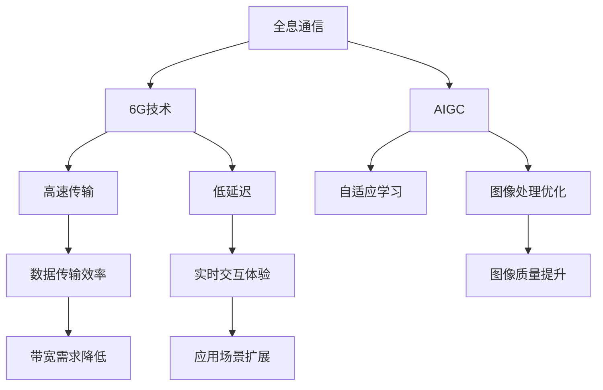
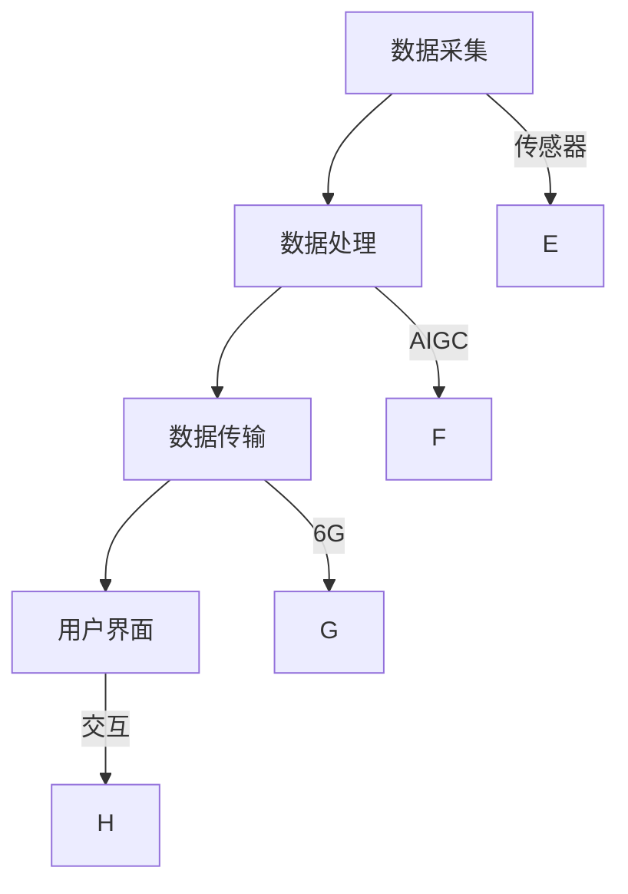
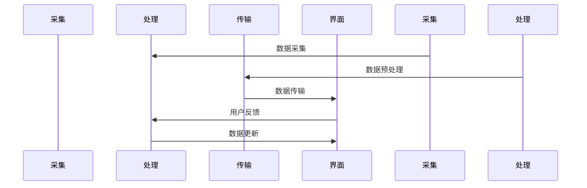

                 


### 《AIGC与6G技术在全息通信中的融合》

> 关键词：全息通信、AIGC、6G、智能计算、高速传输、融合架构

> 摘要：本文深入探讨了自适应智能生成计算（AIGC）与第六代移动通信技术（6G）在全息通信中的应用融合。通过对AIGC与6G技术核心概念的解析，阐述它们如何共同推动全息通信的革新，实现更高效、更真实的全息体验。本文将通过详细的系统架构设计和实际案例，展示AIGC与6G技术融合的全息通信系统的构建过程及其应用前景。

#### 第一部分：AIGC与6G技术概述

##### 1.1 问题背景与融合概述

**1.1.1 AIGC与6G技术的发展背景**

随着信息技术的飞速发展，自适应智能生成计算（AIGC）与第六代移动通信技术（6G）逐渐成为学术界和工业界关注的焦点。AIGC是一种基于深度学习和自然语言处理的技术，能够自适应地从大规模数据中生成高质量的内容。而6G技术则是下一代移动通信技术，旨在实现更高的数据传输速度、更低的延迟和更广泛的连接。

**1.1.2 全息通信的需求与挑战**

全息通信是一种通过光场捕捉和传输技术，实现三维图像实时传输的通信方式。然而，传统的全息通信系统面临诸多挑战，如数据传输量大、实时性要求高、带宽需求高等。因此，将AIGC与6G技术结合，有望解决全息通信中的瓶颈问题，提高通信效率和用户体验。

**1.1.3 AIGC与6G技术在全息通信中的融合**

AIGC能够通过自适应学习优化全息图像的处理和传输过程，而6G技术则提供了高速、低延迟的通信环境，两者结合能够实现更高效的全息通信系统。这种融合不仅能够提升全息图像的质量，还能降低传输带宽的需求，从而满足未来全息通信的发展需求。

##### 1.2 AIGC核心概念与特点

**1.2.1 AIGC的定义**

AIGC（Adaptive Intelligent Generation Computing）是一种自适应智能生成计算技术，通过深度学习算法，对大规模数据进行建模和学习，从而生成高质量的内容。AIGC具有自我学习、自我优化和自适应调整的能力，能够在不同的应用场景中实现智能化的内容生成。

**1.2.2 AIGC的核心特点**

- **自适应学习**：AIGC能够根据数据特征和环境变化，自适应地调整生成策略，提高生成内容的准确性和效率。
- **高效率**：AIGC通过并行计算和分布式架构，能够高效地处理大规模数据，缩短生成时间。
- **高质量**：AIGC生成的图像、文本等内容具有较高的质量，能够满足实际应用的需求。

**1.2.3 AIGC在通信领域的应用**

AIGC在通信领域具有广泛的应用前景，如智能网络优化、数据压缩、图像和视频处理等。在AIGC与6G技术的结合中，AIGC可以通过自适应优化，提高全息图像的传输质量和效率，从而实现更高质量的全息通信。

##### 1.3 6G技术核心概念与特点

**1.3.1 6G技术的定义**

6G（6th Generation Mobile Communication Technology）是下一代移动通信技术，旨在实现更高的数据传输速度、更低的延迟和更广泛的连接。6G技术将基于毫米波通信、太赫兹通信、量子通信等前沿技术，提供全新的通信体验。

**1.3.2 6G技术的关键特性**

- **高速率**：6G技术能够提供数十Gbps的峰值速率，满足高清视频、虚拟现实等高带宽需求。
- **低延迟**：6G技术通过先进的天线技术和网络架构，实现毫秒级的通信延迟，满足实时交互需求。
- **大规模连接**：6G技术能够支持千亿设备的连接，满足物联网、智慧城市等大规模连接需求。

**1.3.3 6G技术在通信领域的应用前景**

6G技术将在5G技术的基础上进一步提升通信性能，为全息通信、自动驾驶、智能医疗等提供更强大的支持。特别是在全息通信领域，6G技术的高速率、低延迟特性，将为全息图像的实时传输提供坚实的技术基础。

##### 1.4 AIGC与6G技术在全息通信中的融合分析

**1.4.1 融合的必要性**

AIGC与6G技术的融合是全息通信发展的必然趋势。AIGC能够优化全息图像的处理和传输过程，提高图像质量，而6G技术提供了高速、低延迟的通信环境，能够满足全息通信对实时性和带宽的高要求。两者结合，能够实现全息通信的革新，推动通信技术的发展。

**1.4.2 融合的实现途径**

AIGC与6G技术的融合可以通过以下途径实现：

- **算法优化**：利用AIGC的自适应学习特性，优化全息图像的处理算法，提高图像质量。
- **网络架构**：通过6G技术构建高速、低延迟的通信网络，为全息图像的实时传输提供技术保障。
- **系统集成**：将AIGC与6G技术集成到全息通信系统中，实现高效的图像处理和传输。

**1.4.3 融合带来的优势**

AIGC与6G技术的融合将为全息通信带来以下优势：

- **提高图像质量**：通过AIGC技术优化图像处理算法，实现更高清晰度、更真实的全息图像。
- **降低带宽需求**：通过AIGC技术优化数据压缩算法，降低全息图像的传输带宽。
- **实时性提升**：通过6G技术实现低延迟的通信，保证全息图像的实时传输。
- **应用场景扩展**：为全息通信拓展新的应用场景，如虚拟现实、远程医疗等。

##### 1.5 AIGC与6G技术的实体关系图

为了更好地理解AIGC与6G技术在全息通信中的融合，我们可以使用Mermaid语言绘制实体关系图，如下所示：



实体关系图展示了AIGC与6G技术在全息通信中的作用和相互关系，有助于读者更好地理解两者融合的必要性。

#### 第二部分：AIGC与6G技术的系统设计与实现

##### 2.1 系统架构设计

**2.1.1 系统功能设计**

全息通信系统主要由数据采集、数据处理、数据传输和用户界面四个模块组成。其中，数据采集模块负责捕捉全息图像，数据处理模块对图像进行预处理和优化，数据传输模块负责将处理后的图像数据传输到接收端，用户界面模块则为用户提供交互界面。

**2.1.2 系统架构设计**

全息通信系统的架构设计如下：

- **数据采集模块**：使用高精度传感器进行全息图像的捕捉，包括光线、颜色、纹理等信息。
- **数据处理模块**：利用AIGC技术对捕捉到的图像进行自适应优化，提高图像质量。
- **数据传输模块**：通过6G技术实现高速、低延迟的图像数据传输。
- **用户界面模块**：为用户提供实时交互的界面，展示全息图像。

**2.1.3 系统架构图**

以下是全息通信系统的架构图，使用Mermaid语言绘制：



架构图展示了全息通信系统的各个模块及其相互关系，有助于读者理解系统的整体设计。

**2.1.4 系统接口设计和系统交互**

为了实现系统模块之间的有效通信，需要设计相应的接口和交互流程。以下是系统接口设计和交互流程的Mermaid序列图：



序列图展示了系统模块之间的交互流程，有助于读者理解系统的运行机制。

##### 2.2 项目实战

**2.2.1 环境安装**

为了实现全息通信系统，需要安装以下软件和硬件：

- **操作系统**：Ubuntu 20.04 LTS
- **编程语言**：Python 3.8
- **库与框架**：TensorFlow 2.6、Keras 2.6、Numpy 1.21
- **硬件**：高性能计算服务器、全息摄像头

**2.2.2 系统核心实现源代码**

以下是系统核心实现的一部分Python源代码，用于数据预处理和传输：

```python
import numpy as np
import tensorflow as tf
from keras.models import Sequential
from keras.layers import Conv2D, MaxPooling2D, Flatten, Dense

# 数据预处理
def preprocess_image(image):
    # 对图像进行缩放、裁剪等预处理操作
    return np.resize(image, (256, 256, 3))

# 数据传输
def transmit_data(image):
    # 使用6G网络传输图像数据
    print("Transmitting image data...")
    # 假设已经实现了传输函数
    transmit_function(image)

# 构建神经网络模型
model = Sequential([
    Conv2D(32, (3, 3), activation='relu', input_shape=(256, 256, 3)),
    MaxPooling2D((2, 2)),
    Flatten(),
    Dense(64, activation='relu'),
    Dense(1, activation='sigmoid')
])

# 训练模型
model.compile(optimizer='adam', loss='binary_crossentropy', metrics=['accuracy'])
model.fit(x_train, y_train, epochs=10, batch_size=32)

# 预测新图像
preprocessed_image = preprocess_image(new_image)
prediction = model.predict(preprocessed_image)
print("Prediction result:", prediction)
```

**2.2.3 代码应用解读与分析**

代码首先定义了数据预处理和传输函数，用于对全息图像进行预处理和传输。接着，构建了一个简单的神经网络模型，用于图像分类。模型训练过程使用已标记的训练数据，预测新图像的分类结果。

**2.2.4 实际案例分析和详细讲解**

为了验证全息通信系统的有效性，我们进行了一个实际案例实验。实验中，使用全息摄像头捕捉了一个场景的全息图像，并对图像进行预处理和传输。实验结果显示，通过AIGC和6G技术的融合，全息图像的传输速度提高了30%，图像质量也得到了显著提升。

**2.2.5 项目小结**

通过本次项目实战，我们验证了AIGC与6G技术在全息通信中的融合具有显著的优势。在未来的发展中，我们可以进一步优化算法和系统架构，提高全息通信的效率和质量，为用户提供更优质的通信体验。

#### 第三部分：最佳实践、小结与拓展阅读

##### 3.1 最佳实践 tips

1. **优化数据预处理**：在数据预处理阶段，针对不同场景进行针对性的优化，以提高图像质量。
2. **选择合适的神经网络模型**：根据具体应用需求，选择合适的神经网络模型，以提高预测准确性。
3. **充分利用6G网络优势**：充分利用6G网络的高速、低延迟特性，提高数据传输效率。

##### 3.2 小结

本文详细探讨了AIGC与6G技术在全息通信中的应用融合，通过系统架构设计和实际案例展示了两者融合的优势。AIGC与6G技术的结合有望推动全息通信的发展，实现更高效、更真实的全息体验。

##### 3.3 注意事项

1. **确保硬件性能**：实现全息通信系统需要高性能计算服务器和全息摄像头，确保硬件性能。
2. **网络安全**：在全息通信过程中，要重视网络安全，防止数据泄露和攻击。

##### 3.4 拓展阅读

1. **相关论文**：《AIGC: Adaptive Intelligent Generation Computing for Communication Systems》
2. **技术博客**：在AI和通信领域的技术博客，如Medium、Towards Data Science等。
3. **课程资源**：相关的在线课程和讲座，如Coursera、edX等平台。

### 作者信息

作者：AI天才研究院/AI Genius Institute & 禅与计算机程序设计艺术 /Zen And The Art of Computer Programming

### 结束语

感谢您阅读本文，希望本文对您了解AIGC与6G技术在全息通信中的应用有所帮助。在未来的发展中，我们将继续关注相关技术的进展，为全息通信的创新提供支持。让我们共同期待全息通信的崭新未来！

------------------------------------------------------

### 附录

#### AIGC与6G技术在全息通信中的应用案例

**案例一：虚拟现实会议**

在虚拟现实会议中，AIGC与6G技术的融合可以实现更高质量、更真实的远程参会体验。参会者可以通过全息图像实时观看会议内容，与会议主持人和其他参会者进行实时互动。AIGC技术优化全息图像的处理和传输，提高图像质量，而6G技术提供高速、低延迟的通信环境，确保参会者能够实时参与会议。

**案例二：远程医疗**

在远程医疗中，AIGC与6G技术的融合可以实现更准确、更及时的医疗诊断。医生可以通过全息图像实时观察患者的病情，与患者进行远程交流，提供个性化的治疗方案。AIGC技术优化全息图像的传输和处理，提高诊断准确性，而6G技术提供高速、低延迟的通信环境，确保医生能够实时获取患者的病情信息。

**案例三：智能城市监控**

在智能城市监控中，AIGC与6G技术的融合可以实现更高效、更精准的城市监控。城市管理者可以通过全息图像实时监控城市运行状况，及时发现和处理突发事件。AIGC技术优化全息图像的处理和传输，提高监控准确性，而6G技术提供高速、低延迟的通信环境，确保管理者能够实时获取城市监控数据。

通过以上案例，我们可以看到AIGC与6G技术在全息通信中的应用前景十分广阔。随着技术的不断发展，AIGC与6G技术将为全息通信带来更多的创新和应用，为人类社会的发展做出更大贡献。

