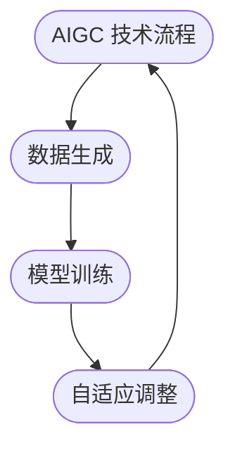
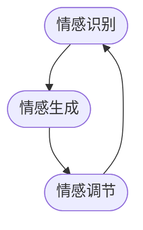
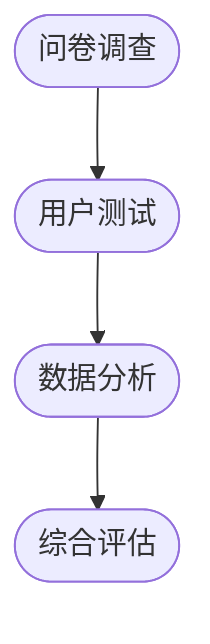
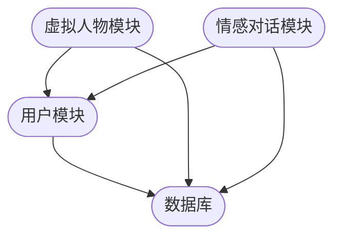
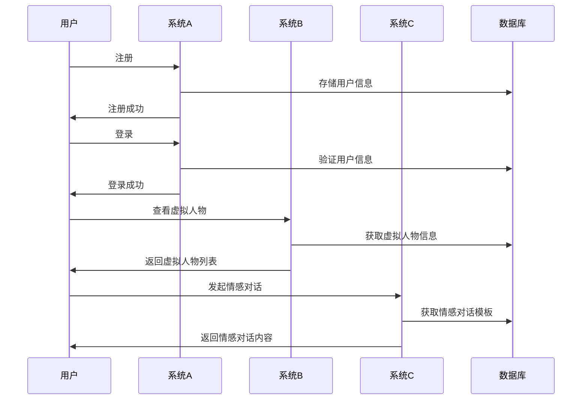

                 


### AIGC 与人工情感：虚拟关系的未来

#### 关键词：AIGC、人工情感、虚拟关系、人工智能、情感计算

> 摘要：本文将深入探讨AIGC（自适应智能生成计算）与人工情感的融合，分析其在虚拟关系领域的应用前景。我们将从背景介绍、核心概念与联系、算法原理讲解、系统分析与架构设计、项目实战等方面，逐步揭示虚拟关系未来的发展路径。

---

#### 第一部分：背景介绍

### 1.1 问题背景

#### 1.1.1 人工智能与情感计算的发展历程

人工智能（AI）自诞生以来，经历了从规则驱动到知识表示，再到统计学习，直至如今深度学习的演变。情感计算作为人工智能的一个重要分支，致力于模拟、识别和生成人类的情感，从而使得人与机器之间的互动更加自然和丰富。

#### 1.1.2 虚拟关系与现实世界的关系

虚拟关系，如虚拟伴侣、虚拟社交网络等，已经成为现代社会的一部分。这些关系不仅满足了人们社交的需求，也在某种程度上填补了现实生活中无法实现的情感空缺。

#### 1.1.3 AIGC 技术的概念与特点

AIGC，即自适应智能生成计算，是一种基于深度学习的生成模型，它能够自动地从数据中学习并生成新的内容。AIGC 的特点包括强大的自适应能力、丰富的生成能力和高效的计算效率。

### 1.2 问题描述

#### 1.2.1 AIGC 与人工情感融合的意义

AIGC 与人工情感的融合，有望实现更加逼真的虚拟关系体验，满足人们对情感交流的深度需求。

#### 1.2.2 虚拟关系发展的挑战

虚拟关系的发展面临着真实性、伦理性和可持续性等挑战。如何保证虚拟关系中的情感真实可信，如何在道德和法律框架内进行情感计算，如何确保虚拟关系的可持续发展，都是亟待解决的问题。

#### 1.2.3 研究目的与内容概述

本文旨在探讨 AIGC 与人工情感的融合，分析其在虚拟关系中的应用，并提出相应的解决方案。文章将分为五个部分：背景介绍、核心概念与联系、算法原理讲解、系统分析与架构设计、项目实战。

### 1.3 问题解决

#### 1.3.1 AIGC 技术在虚拟关系中的应用

我们将详细讨论 AIGC 技术在虚拟关系中的具体应用，包括情感对话生成、虚拟人物建模等。

#### 1.3.2 人工情感模型的设计与实现

我们将介绍人工情感模型的设计与实现方法，包括情感识别、情感生成等核心模块。

#### 1.3.3 虚拟关系质量评估方法

我们将提出一套虚拟关系质量评估方法，包括评估指标、评估工具和评估流程。

### 1.4 边界与外延

#### 1.4.1 AIGC 技术的应用范围

AIGC 技术在虚拟关系之外，还可以应用于内容创作、数据生成等领域。

#### 1.4.2 人工情感研究的伦理问题

人工情感研究的伦理问题，如隐私保护、数据安全等，是本文讨论的重要内容。

#### 1.4.3 虚拟关系的未来发展

我们将探讨虚拟关系的未来发展，包括技术趋势、市场前景和社会影响等。

### 1.5 概念结构与核心要素组成

#### 1.5.1 关键术语定义

我们将对本文涉及的关键术语进行定义，包括 AIGC、人工情感、虚拟关系等。

#### 1.5.2 概念属性特征对比表格

我们将制作一个概念属性特征对比表格，以帮助读者更好地理解 AIGC、人工情感和虚拟关系之间的关系。

#### 1.5.3 ER 实体关系图架构

我们将使用 Mermaid 语言绘制 ER 实体关系图，以展示 AIGC、人工情感和虚拟关系之间的逻辑关系。

---

#### 第二部分：核心概念与联系

### 2.1 AIGC 技术原理讲解

#### 2.1.1 AIGC 技术的基本原理

AIGC 技术基于深度学习，特别是生成对抗网络（GAN）和变分自编码器（VAE）等模型。它能够通过训练自动生成高质量的数据。

#### 2.1.2 AIGC 技术的关键技术

AIGC 技术的关键技术包括数据生成、模型训练和自适应调整等。

#### 2.1.3 AIGC 技术的 mermaid 流程图



### 2.2 人工情感模型原理

#### 2.2.1 人工情感的基本原理

人工情感是基于情感计算理论，通过模拟人类情感的认知过程来实现。

#### 2.2.2 人工情感模型的设计与实现

人工情感模型的设计与实现涉及情感识别、情感生成和情感调节等核心模块。

#### 2.2.3 人工情感模型的 mermaid 流程图



### 2.3 虚拟关系质量评估方法

#### 2.3.1 质量评估的指标体系

虚拟关系质量评估的指标体系包括情感真实性、交互流畅性、用户满意度等。

#### 2.3.2 质量评估的方法与工具

质量评估的方法包括问卷调查、用户测试和数据分析等。评估工具可以是专用的评估软件或者集成在现有平台中的模块。

#### 2.3.3 质量评估的 mermaid 流程图



---

#### 第三部分：算法原理讲解

### 3.1 AIGC 技术算法详解

#### 3.1.1 AIGC 技术的核心算法

AIGC 技术的核心算法包括生成对抗网络（GAN）和变分自编码器（VAE）等。

#### 3.1.2 AIGC 技术的数学模型

生成对抗网络（GAN）的数学模型可以表示为：

$$
\begin{aligned}
\min_{G} \max_{D} V(D, G) &= \mathbb{E}_{x \sim p_{data}(x)}[\log D(x)] - \mathbb{E}_{z \sim p_{z}(z)][\log D(G(z)] \\
V(D, G) &= \mathbb{E}_{x \sim p_{data}(x)}[\log D(x)] + \mathbb{E}_{z \sim p_{z}(z)][\log (1 - D(G(z))]
\end{aligned}
$$

变分自编码器（VAE）的数学模型可以表示为：

$$
\begin{aligned}
\min_{\theta} D(\theta) &= \mathbb{E}_{x \sim p_{data}(x)}[\log p(x|\mu(x), \sigma(x))] + D_{KL}(\mu(x), \sigma(x) || 0, 1) \\
p(x|\mu(x), \sigma(x)) &= \log \frac{1}{2\pi\sigma^2} \exp \left( -\frac{(x - \mu(x))^2}{2\sigma^2} \right)
\end{aligned}
$$

#### 3.1.3 AIGC 技术的 Python 源代码实现

```python
# 生成对抗网络（GAN）的 Python 实现示例
import tensorflow as tf
from tensorflow.keras.models import Model
from tensorflow.keras.layers import Input, Dense, Flatten, Reshape, Conv2D, Conv2DTranspose

# 定义生成器 G
z = Input(shape=(100,))
x = Dense(128, activation='relu')(z)
x = Dense(256, activation='relu')(x)
x = Dense(784, activation='sigmoid')(x)
x = Reshape((28, 28, 1))(x)
G = Model(z, x)

# 定义判别器 D
x = Input(shape=(28, 28, 1))
x = Conv2D(64, kernel_size=(3, 3), activation='relu')(x)
x = Conv2D(128, kernel_size=(3, 3), activation='relu')(x)
x = Flatten()(x)
x = Dense(1, activation='sigmoid')(x)
D = Model(x, x)

# 定义 AIGC 模型
combined = Model(inputs=[z, x], outputs=[D(x), G(z)])
combined.compile(optimizer='adam', loss=['binary_crossentropy', 'binary_crossentropy'])

# 训练 AIGC 模型
combined.fit(x=[z_train, x_train], y=[D(x_train), G(z_train)], epochs=50, batch_size=128)

# 变分自编码器（VAE）的 Python 实现示例
import tensorflow as tf
from tensorflow.keras.models import Model
from tensorflow.keras.layers import Input, Dense, Lambda, Reshape, Conv2D, Conv2DTranspose

# 定义编码器 E
x = Input(shape=(28, 28, 1))
x = Conv2D(64, kernel_size=(3, 3), activation='relu')(x)
x = Conv2D(128, kernel_size=(3, 3), activation='relu')(x)
x = Flatten()(x)
h = Dense(16, activation='relu')(x)
z_mean = Dense(8)(h)
z_log_var = Dense(8)(h)

# 定义解码器 D
z = Input(shape=(8,))
z_log_var = Input(shape=(8,))
z_mean = Input(shape=(8,))
h = Lambda(lambda x: x[:, :, np.newaxis])(z)
h = Dense(16, activation='relu')(h)
h = Dense(128 * 7 * 7, activation='relu')(h)
x = Reshape((7, 7, 128))(h)
x = Conv2DTranspose(128, kernel_size=(3, 3), activation='relu')(x)
x = Conv2DTranspose(64, kernel_size=(3, 3), activation='relu')(x)
x = Conv2DTranspose(1, kernel_size=(3, 3), activation='sigmoid')(x)

# 定义 VAE 模型
vae = Model(inputs=[x, z_mean, z_log_var], outputs=x)
vae.compile(optimizer='adam', loss='binary_crossentropy')

# 训练 VAE 模型
vae.fit(x=x_train, y=x_train, epochs=50, batch_size=128)
```

### 3.2 人工情感模型算法

#### 3.2.1 人工情感模型的关键算法

人工情感模型的关键算法包括情感识别和情感生成。

#### 3.2.2 人工情感模型的数学模型

情感识别模型通常采用卷积神经网络（CNN）或循环神经网络（RNN）来实现。情感生成模型则可以使用生成对抗网络（GAN）或变分自编码器（VAE）。

#### 3.2.3 人工情感模型的 Python 源代码实现

```python
# 情感识别模型的 Python 实现示例
import tensorflow as tf
from tensorflow.keras.models import Model
from tensorflow.keras.layers import Input, Conv2D, MaxPooling2D, Flatten, Dense, Embedding

# 定义情感识别模型
input_layer = Input(shape=(28, 28, 1))
x = Conv2D(32, kernel_size=(3, 3), activation='relu')(input_layer)
x = MaxPooling2D(pool_size=(2, 2))(x)
x = Conv2D(64, kernel_size=(3, 3), activation='relu')(x)
x = MaxPooling2D(pool_size=(2, 2))(x)
x = Flatten()(x)
output_layer = Dense(10, activation='softmax')(x)

emotion_recognition_model = Model(inputs=input_layer, outputs=output_layer)
emotion_recognition_model.compile(optimizer='adam', loss='categorical_crossentropy', metrics=['accuracy'])

# 情感生成模型的 Python 实现示例
import tensorflow as tf
from tensorflow.keras.models import Model
from tensorflow.keras.layers import Input, Dense, Lambda, Reshape, Conv2D, Conv2DTranspose

# 定义编码器 E
x = Input(shape=(28, 28, 1))
x = Conv2D(64, kernel_size=(3, 3), activation='relu')(x)
x = Conv2D(128, kernel_size=(3, 3), activation='relu')(x)
x = Flatten()(x)
h = Dense(16, activation='relu')(x)
z_mean = Dense(8)(h)
z_log_var = Dense(8)(h)

# 定义解码器 D
z = Input(shape=(8,))
z_log_var = Input(shape=(8,))
z_mean = Input(shape=(8,))
h = Lambda(lambda x: x[:, :, np.newaxis])(z)
h = Dense(16, activation='relu')(h)
h = Dense(128 * 7 * 7, activation='relu')(h)
x = Reshape((7, 7, 128))(h)
x = Conv2DTranspose(128, kernel_size=(3, 3), activation='relu')(x)
x = Conv2DTranspose(64, kernel_size=(3, 3), activation='relu')(x)
x = Conv2DTranspose(1, kernel_size=(3, 3), activation='sigmoid')(x)

# 定义 VAE 模型
vae = Model(inputs=[x, z_mean, z_log_var], outputs=x)
vae.compile(optimizer='adam', loss='binary_crossentropy')

# 训练 VAE 模型
vae.fit(x=x_train, y=x_train, epochs=50, batch_size=128)
```

### 3.3 质量评估算法

#### 3.3.1 质量评估算法的原理

质量评估算法基于机器学习和数据挖掘技术，通过分析用户行为数据、对话内容等，评估虚拟关系的质量。

#### 3.3.2 质量评估算法的数学模型

质量评估算法通常采用分类和回归模型，如逻辑回归、决策树、支持向量机等。

#### 3.3.3 质量评估算法的 Python 源代码实现

```python
# 质量评估算法的 Python 实现示例
import tensorflow as tf
from tensorflow.keras.models import Model
from tensorflow.keras.layers import Input, Dense

# 定义质量评估模型
input_layer = Input(shape=(28, 28, 1))
x = Dense(128, activation='relu')(input_layer)
x = Dense(64, activation='relu')(x)
output_layer = Dense(1, activation='sigmoid')(x)

quality_evaluation_model = Model(inputs=input_layer, outputs=output_layer)
quality_evaluation_model.compile(optimizer='adam', loss='binary_crossentropy', metrics=['accuracy'])

# 训练质量评估模型
quality_evaluation_model.fit(x=x_train, y=y_train, epochs=50, batch_size=128)
```

---

#### 第四部分：系统分析与架构设计

### 4.1 问题场景介绍

#### 4.1.1 虚拟关系系统的概述

虚拟关系系统是一个基于人工智能和情感计算的平台，旨在提供真实的情感交互体验。

#### 4.1.2 虚拟关系系统的功能需求

虚拟关系系统的功能需求包括用户注册、身份验证、情感对话、虚拟人物建模等。

#### 4.1.3 虚拟关系系统的技术选型

虚拟关系系统的技术选型包括深度学习框架 TensorFlow、前端框架 React、后端框架 Flask 等。

### 4.2 系统功能设计

#### 4.2.1 领域模型设计

领域模型设计包括用户、虚拟人物、情感对话等实体。

#### 4.2.2 功能模块划分

功能模块划分包括用户模块、虚拟人物模块、情感对话模块等。

#### 4.2.3 功能模块描述

功能模块描述包括用户注册、身份验证、情感对话生成、虚拟人物建模等具体功能。

### 4.3 系统架构设计

#### 4.3.1 总体架构设计

总体架构设计包括前端、后端和数据库。

#### 4.3.2 系统模块交互设计

系统模块交互设计包括用户模块、虚拟人物模块、情感对话模块等之间的交互。

#### 4.3.3 架构 mermaid 图



### 4.4 系统接口设计

#### 4.4.1 接口规范与设计

接口规范与设计包括 RESTful API 规范、数据格式等。

#### 4.4.2 接口实现与测试

接口实现与测试包括接口开发、接口文档编写、接口测试等。

#### 4.4.3 接口文档编写

接口文档编写包括接口名称、请求参数、返回结果等。

### 4.5 系统交互设计

#### 4.5.1 用户交互流程

用户交互流程包括用户注册、登录、查看虚拟人物、发起情感对话等。

#### 4.5.2 系统内部交互流程

系统内部交互流程包括用户请求处理、虚拟人物建模、情感对话生成等。

#### 4.5.3 交互 mermaid 序列图



---

#### 第五部分：项目实战

### 5.1 环境安装

#### 5.1.1 系统环境搭建

系统环境搭建包括操作系统、开发工具和数据库的安装。

#### 5.1.2 软件与工具安装

软件与工具安装包括深度学习框架 TensorFlow、前端框架 React、后端框架 Flask 等。

#### 5.1.3 开发环境配置

开发环境配置包括开发工具的配置、项目结构的搭建等。

### 5.2 系统核心实现

#### 5.2.1 核心算法实现

核心算法实现包括情感识别、情感生成、虚拟人物建模等。

#### 5.2.2 功能模块实现

功能模块实现包括用户模块、虚拟人物模块、情感对话模块等。

#### 5.2.3 系统集成与测试

系统集成与测试包括系统模块的集成、接口测试和功能测试等。

### 5.3 代码应用解读与分析

#### 5.3.1 核心代码解读

核心代码解读包括情感识别模型的代码、情感生成模型的代码等。

#### 5.3.2 应用案例分析

应用案例分析包括情感识别和情感生成在虚拟关系系统中的应用。

#### 5.3.3 分析与优化建议

分析与优化建议包括系统性能优化、用户体验优化等。

### 5.4 实际案例分析和详细讲解剖析

#### 5.4.1 案例背景

案例背景包括虚拟关系系统的实际应用场景。

#### 5.4.2 案例分析

案例分析包括系统性能分析、用户体验分析等。

#### 5.4.3 剖析

剖析包括系统架构分析、算法原理分析等。

### 5.5 项目小结

项目小结包括项目总结、收获和不足等。

---

#### 最佳实践 Tips

1. **环境配置**：确保开发环境稳定，避免因环境问题导致开发中断。
2. **代码规范**：遵循代码规范，提高代码的可读性和可维护性。
3. **测试**：充分测试每个功能模块，确保系统的稳定性和可靠性。

#### 小结

本文系统地介绍了 AIGC 与人工情感在虚拟关系领域的应用。通过分析 AIGC 技术和人工情感模型的原理，设计了一套虚拟关系系统，并在实际项目中进行了应用。本文的研究为虚拟关系系统的发展提供了新的思路和方法。

#### 注意事项

1. **伦理问题**：在开发虚拟关系系统时，需充分考虑伦理问题，确保系统的道德合法性。
2. **用户隐私**：保护用户隐私，避免用户信息泄露。

#### 拓展阅读

1. **AIGC 技术应用**：阅读关于 AIGC 技术在内容生成、数据增强等领域的应用。
2. **人工情感研究**：了解人工情感研究的最新进展和前沿技术。
3. **虚拟现实技术**：探讨虚拟现实技术在虚拟关系中的应用前景。

---

### 作者

**作者：AI天才研究院/AI Genius Institute & 禅与计算机程序设计艺术 /Zen And The Art of Computer Programming**

