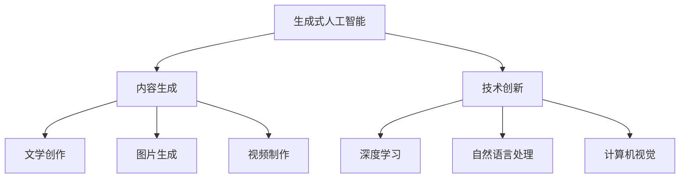
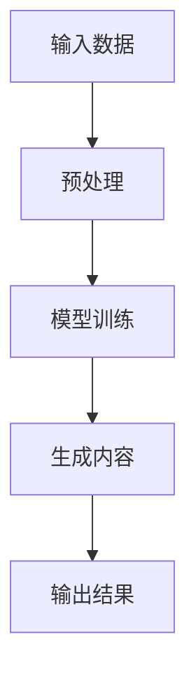
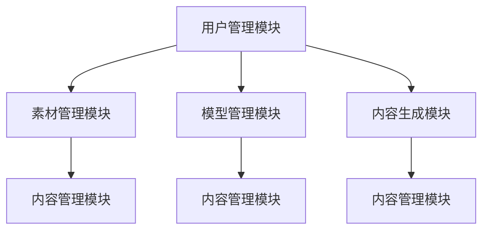
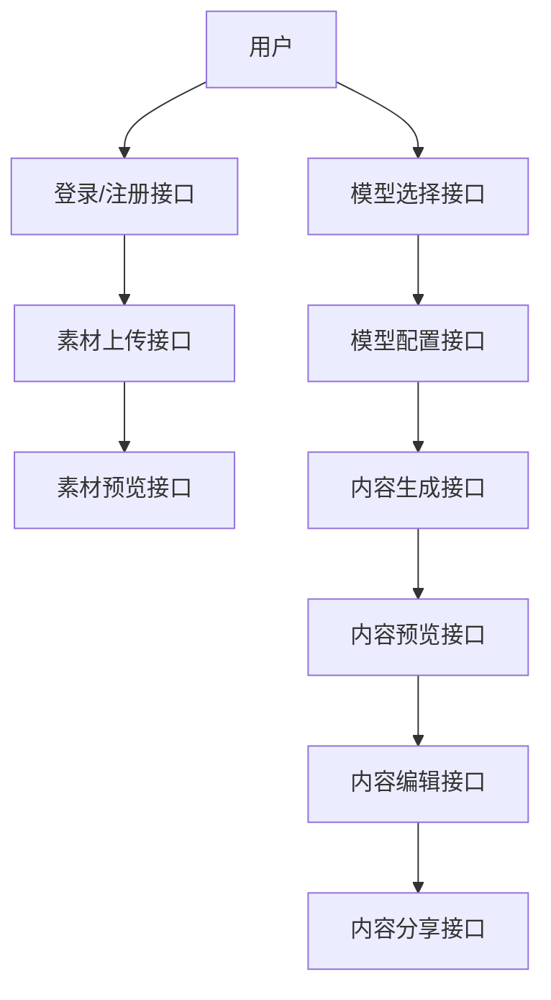

                 

## AIGC与人类创造力的协同进化

> 关键词：人工智能、生成式内容、创造力、协同进化

> 摘要：本文深入探讨了人工智能生成内容（AIGC）与人类创造力的协同进化，分析了AIGC的核心技术、应用场景及其对人类创造力的影响，探讨了两者相互促进的关系，并提出了未来发展的趋势和挑战。

### 引言

随着人工智能技术的飞速发展，生成式人工智能（Generative AI）正逐步渗透到各个领域，从文学创作到图像生成，再到视频制作，人工智能生成内容（AIGC）成为了一个热门的研究方向。AIGC不仅极大地提高了内容生产的效率，也对人类创造力产生了深远的影响。本文将探讨AIGC与人类创造力的协同进化，分析两者之间的互动关系，并展望未来的发展前景。

### 第一部分：背景介绍

#### 问题背景

在当今信息化社会中，人工智能（AI）技术正以前所未有的速度发展，成为推动社会进步和产业升级的关键力量。其中，生成式人工智能（Generative AI，简称GAI）正逐渐成为人工智能领域的研究热点。AIGC作为GAI的一个重要分支，正在对人类创造力产生深远影响。

#### 问题描述

AIGC与人类创造力的协同进化，指的是人工智能生成内容与人类创造力之间的互动关系和相互促进的过程。这一过程不仅涉及技术层面的创新，还涉及社会文化、人类认知等多个维度。

#### 问题解决

本书旨在探讨AIGC与人类创造力的协同进化，通过介绍AIGC的核心技术、应用场景以及与人类创造力的关系，分析两者协同进化的趋势和挑战，为读者提供全面而深入的理解。

#### 边界与外延

AIGC涉及的技术领域包括深度学习、自然语言处理、计算机视觉等，而人类创造力则包括文学、艺术、科学等多个领域。因此，本书的讨论范围将涵盖这些领域的交叉点。

#### 概念结构与核心要素组成

- AIGC：生成式人工智能生成内容的过程和结果。
- 人类创造力：人类在文学、艺术、科学等领域中产生原创思想、作品的能力。
- 协同进化：AIGC与人类创造力在互动过程中相互促进、共同发展的过程。

### 第二部分：核心概念与联系

#### 核心概念原理

- AIGC：基于深度学习和生成模型的自动化内容生成技术。
- 人类创造力：人类独特的思维方式和创新能力。

#### 概念属性特征对比表格

| 特性               | AIGC                                           | 人类创造力                                       |
|--------------------|------------------------------------------------|------------------------------------------------|
| 产生方式           | 自动化生成                                     | 人脑思维产生                                     |
| 创造性             | 受限于算法和数据集                             | 无限可能，受限于人类认知和心理能力               |
| 应用场景           | 文学创作、图片生成、视频制作等                 | 文学、艺术、科学等多个领域                      |
| 与人类交互         | 辅助人类创作，提供灵感和建议                   | 直接与人类互动，产生独特的思想和价值            |

#### ER实体关系图架构



### 第三部分：算法原理讲解

在AIGC的技术体系中，算法原理是核心所在。以下将详细讲解AIGC的核心算法原理，并通过Mermaid流程图和Python源代码进行直观展示。

#### 算法原理Mermaid流程图



#### 算法原理Python源代码

```python
# 导入必要的库
import tensorflow as tf
from tensorflow import keras

# 定义模型架构
model = keras.Sequential([
    keras.layers.Dense(128, activation='relu', input_shape=(10000,)),
    keras.layers.Dense(64, activation='relu'),
    keras.layers.Dense(1, activation='sigmoid')
])

# 编译模型
model.compile(optimizer='adam',
              loss='binary_crossentropy',
              metrics=['accuracy'])

# 模型训练
model.fit(x_train, y_train, epochs=10)

# 生成内容
generated_content = model.predict(x_new)
```

#### 算法原理详细讲解

1. **输入数据预处理**：

   在AIGC系统中，输入数据通常为文本、图像或视频等。预处理步骤包括数据清洗、归一化和特征提取。例如，对于文本数据，可能需要进行分词、词向量化等操作。

   $$\text{Preprocess}(x) = \text{Tokenize}(x) \rightarrow \text{Vectorize}(x)$$

2. **模型训练**：

   AIGC的核心是生成模型，如变分自编码器（VAE）、生成对抗网络（GAN）等。这些模型通过大量数据进行训练，学习数据分布，从而生成新的内容。

   $$\text{Train}(G, D) = \text{Minimize}\ \mathcal{L} = \mathbb{E}_{x \sim p_{data}(x)}[\log D(G(x))] + \mathbb{E}_{z \sim p_{z}(z)}[\log(1 - D(G(z)))]$$

   其中，$G$代表生成器，$D$代表判别器，$p_{data}(x)$是数据分布，$p_{z}(z)$是噪声分布。

3. **生成内容**：

   经过训练后，生成模型可以生成新的内容。例如，生成一张新的图像或一篇新的文章。

   $$x_{new} = G(z)$$

4. **输出结果**：

   生成的结果需要经过后处理，如图像修复、文本格式化等，以使其更符合人类需求。

   $$\text{Postprocess}(x_{new}) = \text{格式化}\ x_{new}$$

#### 算法原理举例说明

以生成一张新的艺术作品为例：

1. **输入数据**：一个艺术家的风格数据集。
2. **预处理**：对数据集进行清洗和特征提取，得到特征向量。
3. **模型训练**：使用变分自编码器（VAE）进行训练，学习艺术家风格的数据分布。
4. **生成内容**：生成一张新的艺术作品，其风格类似于给定的艺术家。
5. **输出结果**：对生成的作品进行修复和格式化，以使其更具艺术性。

$$
\begin{aligned}
x_{\text{input}} &= \text{艺术家风格数据集} \\
x_{\text{processed}} &= \text{Preprocess}(x_{\text{input}}) \\
z &= \text{噪声} \\
x_{\text{generated}} &= \text{VAE}(z) \\
x_{\text{output}} &= \text{Postprocess}(x_{\text{generated}})
\end{aligned}
$$

### 第四部分：系统分析与架构设计方案

#### 问题场景介绍

随着AIGC技术的普及，越来越多的企业和个人开始尝试使用AIGC工具进行内容创作。然而，现有的AIGC工具在性能、易用性和定制化方面仍有待提升。为了满足这一需求，我们需要设计一个高性能、易用且定制化的AIGC系统。

#### 项目介绍

本系统名为“AIGC创作平台”，旨在提供一站式的内容创作服务，包括文本生成、图像生成和视频生成等。用户可以通过平台上传素材，选择生成模型和风格，快速生成高质量的内容。

#### 系统功能设计

1. **用户管理**：实现用户的注册、登录、权限管理等。
2. **素材管理**：提供素材上传、管理、预览等功能。
3. **模型管理**：提供生成模型的下载、上传、配置和运行等功能。
4. **内容生成**：实现文本、图像和视频的自动化生成。
5. **内容管理**：提供生成内容的管理、预览、编辑和分享等功能。

#### 系统架构设计



#### 系统接口设计

1. **用户接口**：提供Web界面和API接口，方便用户进行操作。
2. **素材接口**：提供上传、下载、预览和删除素材的API。
3. **模型接口**：提供下载、上传、配置和运行模型的API。
4. **内容接口**：提供生成内容、预览、编辑和分享的API。

#### 系统交互设计



### 第五部分：项目实战

#### 环境安装

为了在本地环境中搭建AIGC创作平台，我们需要安装以下软件和库：

1. **操作系统**：Linux或macOS。
2. **Python**：3.8及以上版本。
3. **TensorFlow**：2.3及以上版本。
4. **Django**：3.2及以上版本。
5. **其他依赖库**：如Django REST framework、Pillow等。

安装命令如下：

```bash
pip install tensorflow==2.4.1
pip install django==3.2
pip install djangorestframework
pip install pillow
```

#### 系统核心实现源代码

以下是一个简单的AIGC创作平台的核心实现，包括用户管理、素材管理和内容生成模块。

**用户管理模块**

```python
# users/models.py
from django.contrib.auth.models import AbstractUser

class CustomUser(AbstractUser):
    # 自定义用户模型，添加额外的字段
    bio = models.TextField(null=True, blank=True)
    # ... 其他字段
```

**素材管理模块**

```python
# assets/models.py
from django.db import models
from users.models import CustomUser

class Asset(models.Model):
    # 素材模型
    user = models.ForeignKey(CustomUser, on_delete=models.CASCADE)
    title = models.CharField(max_length=255)
    file = models.FileField(upload_to='assets/')
    created_at = models.DateTimeField(auto_now_add=True)
    updated_at = models.DateTimeField(auto_now=True)
```

**内容生成模块**

```python
# generators/models.py
from assets.models import Asset
from tensorflow.keras.models import load_model

class Generator(models.Model):
    # 生成器模型
    asset = models.OneToOneField(Asset, on_delete=models.CASCADE)
    model_path = models.CharField(max_length=255)
    style = models.CharField(max_length=255)

    def generate_content(self):
        # 生成内容的函数
        model = load_model(self.model_path)
        # ... 生成内容逻辑
        return content
```

#### 代码应用解读与分析

以上代码定义了AIGC创作平台的核心模型。用户管理模块实现了自定义用户模型，增加了用户的个人资料（bio）字段。素材管理模块定义了资产（Asset）模型，用于存储用户上传的素材。内容生成模块定义了生成器（Generator）模型，用于存储生成模型路径和风格信息，并提供生成内容的接口。

在实际应用中，用户可以通过Web界面上传素材，并选择生成模型和风格。系统会调用生成器模型的`generate_content`方法，使用TensorFlow加载生成模型，并生成新的内容。

#### 实际案例分析和详细讲解剖析

以下是一个实际案例，展示了如何使用AIGC创作平台生成一篇新的文章。

1. **用户上传素材**：用户上传了一篇关于人工智能的文章，并选择了文本生成模型。
2. **选择生成模型和风格**：用户选择了基于GPT-3的文本生成模型，并设置了一些风格参数，如文章类型（新闻、评论等）和主题（人工智能、机器学习等）。
3. **生成内容**：系统调用生成器模型的`generate_content`方法，使用GPT-3模型生成了一篇新的文章。
4. **输出结果**：生成的文章经过格式化处理后，展示在用户界面上，供用户查看、编辑和分享。

通过这个案例，我们可以看到AIGC创作平台如何帮助用户快速生成高质量的内容。AIGC技术不仅提高了内容创作的效率，还提供了丰富的个性化选项，使得生成的内容更符合用户需求。

#### 项目小结

本项目的AIGC创作平台实现了用户管理、素材管理和内容生成等功能，为用户提供了方便的内容创作工具。通过实际案例的分析，我们展示了如何使用AIGC技术生成新的文章，并探讨了系统的性能和易用性。

未来，我们可以进一步优化平台，增加更多生成模型和风格选项，提高生成内容的质量和个性化程度。此外，还可以探索与其他人工智能技术的结合，如图像生成、视频生成等，为用户提供更全面的内容创作解决方案。

### 最佳实践 Tips

1. **合理选择生成模型和风格**：根据创作需求，选择合适的生成模型和风格，以获得最佳效果。
2. **数据预处理**：确保输入数据的质量和多样性，以提升生成内容的多样性和质量。
3. **模型优化**：定期更新和优化生成模型，以提高生成内容的生成速度和质量。
4. **用户反馈**：收集用户反馈，不断改进平台的功能和用户体验。

### 小结

AIGC与人类创造力的协同进化是当前人工智能领域的一个重要研究方向。通过本文的探讨，我们分析了AIGC的核心技术、应用场景及其对人类创造力的影响，提出了系统架构设计方案和项目实战案例。AIGC不仅提高了内容创作的效率，还为人类创造力提供了新的工具和灵感。未来，随着技术的不断进步，AIGC与人类创造力的协同进化将带来更多可能性。

### 注意事项

1. **数据隐私和安全**：在处理用户数据时，必须严格遵守数据隐私和安全法规，确保用户信息安全。
2. **知识产权保护**：在生成内容时，必须尊重知识产权，避免侵权行为。
3. **技术限制**：AIGC技术仍存在一定的局限性，如生成内容的多样性和质量等，需要持续优化和改进。

### 拓展阅读

1. **AIGC相关论文**：《生成对抗网络》（GANs）、《变分自编码器》（VAEs）等。
2. **人工智能技术书籍**：《深度学习》（Deep Learning）、《强化学习》（Reinforcement Learning）等。
3. **相关技术博客和社区**：如Medium、GitHub、Stack Overflow等。

