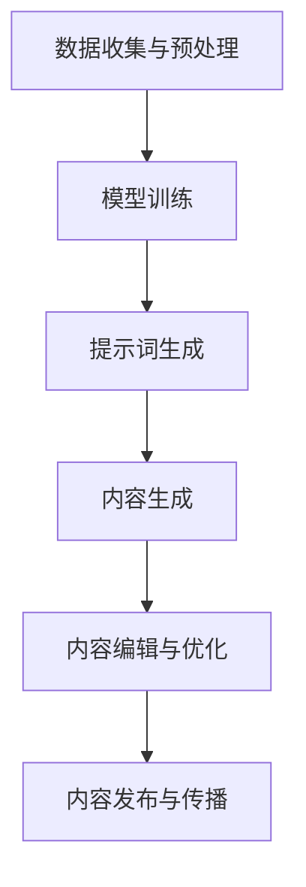
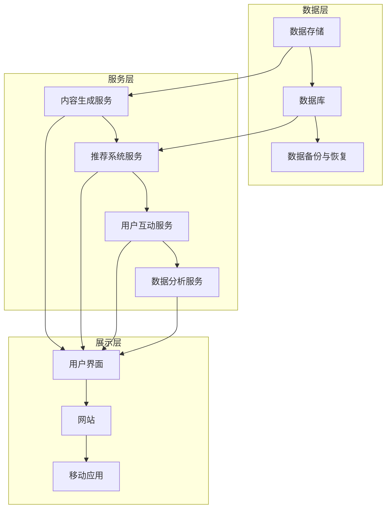

                 

# AIGC与传统媒体的融合：提示词的作用

## 关键词
- AIGC
- 传统媒体
- 提示词
- 算法
- 融合
- 实战

> 传统媒体与新兴人工智能技术（AIGC）的融合正逐步成为媒体行业的核心议题。本文将深入探讨AIGC与传统媒体融合的背景、原理、算法及其在现实项目中的应用，并重点分析提示词在融合过程中的关键作用。

## 摘要
本文首先介绍了AIGC和传统媒体的发展背景及其面临的挑战和机遇。接着，详细阐述了提示词的定义、作用和分类。然后，通过分析AIGC与传统媒体融合的算法原理和数学模型，辅以实例，展示了如何利用提示词实现有效的融合。随后，文章介绍了系统分析与架构设计的方法，并给出一个实际项目的详细解析。最后，本文总结了最佳实践并展望了AIGC与传统媒体融合的未来发展趋势。

## 目录大纲设计

### 第一部分：背景介绍与核心概念

#### 第1章：引言与背景

- **1.1 问题背景**
  - AIGC技术的发展与应用现状
  - 传统媒体面临的挑战与机遇
  - 提示词在AIGC与传统媒体融合中的重要性

- **1.2 问题描述**
  - AIGC与传统媒体融合的现状分析
  - 提示词在融合过程中的作用与效果

- **1.3 问题解决**
  - AIGC与传统媒体融合的理论基础
  - 提示词在融合中的关键作用

- **1.4 边界与外延**
  - AIGC与传统媒体融合的适用范围
  - 提示词的应用领域和限制条件

- **1.5 概念结构与核心要素组成**
  - AIGC：定义、发展历程、核心技术
  - 传统媒体：定义、发展历程、现状与问题
  - 提示词：定义、作用、分类、实现方式

### 第二部分：核心概念与联系

#### 第2章：AIGC与提示词的原理分析

- **2.1 AIGC原理讲解**
  - AIGC的基本概念
  - AIGC的核心算法
  - AIGC的应用案例

- **2.2 提示词原理讲解**
  - 提示词的定义
  - 提示词的分类
  - 提示词的实现方式

- **2.3 概念属性特征对比表格**
  - AIGC与提示词的对比分析
  - 不同类型提示词的性能对比

- **2.4 ER实体关系图架构**
  - AIGC与传统媒体的实体关系
  - 提示词在融合过程中的作用

### 第三部分：算法原理讲解

#### 第3章：AIGC与传统媒体融合算法

- **3.1 算法原理讲解**
  - AIGC与传统媒体融合的基本算法
  - 提示词在算法中的作用

- **3.2 算法流程图**
  - 使用Mermaid画出AIGC与传统媒体融合的算法流程图

- **3.3 数学模型与公式**
  - AIGC与传统媒体融合的数学模型
  - 公式推导与解释

- **3.4 举例说明**
  - AIGC与传统媒体融合的实例分析
  - 提示词在实例中的应用

### 第四部分：系统分析与架构设计

#### 第4章：AIGC与传统媒体融合系统

- **4.1 问题场景介绍**
  - AIGC与传统媒体融合的场景描述

- **4.2 系统功能设计**
  - 系统功能概述
  - 领域模型Mermaid类图

- **4.3 系统架构设计**
  - 系统架构概述
  - 系统架构Mermaid图

- **4.4 系统接口设计**
  - 系统接口规范
  - 系统接口Mermaid序列图

### 第五部分：项目实战

#### 第5章：AIGC与传统媒体融合项目实战

- **5.1 环境安装**
  - 环境搭建步骤
  - 环境配置细节

- **5.2 系统核心实现**
  - 系统核心代码实现
  - 代码解读与分析

- **5.3 实际案例分析与详细讲解**
  - 实际案例介绍
  - 案例分析
  - 深入讲解

- **5.4 项目小结**
  - 项目总结
  - 经验与启示

### 第六部分：最佳实践与拓展

#### 第6章：AIGC与传统媒体融合的最佳实践

- **6.1 最佳实践**
  - 提示词优化的技巧
  - AIGC与传统媒体融合的注意事项

- **6.2 拓展阅读**
  - 相关书籍与论文推荐
  - 行业动态与发展趋势

### 第七章：总结与展望

#### 7.1 总结
- **书籍核心内容的回顾**
- **融合过程中的关键因素**

#### 7.2 展望
- **AIGC与传统媒体融合的未来发展趋势**
- **提示词在融合中的应用前景**

---

接下来，我们将逐步展开每个章节的内容，以清晰、专业的技术语言深入解析AIGC与传统媒体的融合以及提示词在这个过程中所发挥的关键作用。我们将通过逻辑清晰的分析和实例讲解，帮助读者更好地理解这一前沿技术的实际应用。

---

### 第一部分：背景介绍与核心概念

#### 第1章：引言与背景

**1.1 问题背景**

随着信息技术的迅猛发展，人工智能（AI）已经成为推动社会进步的重要力量。特别是在生成式AI（AIGC）领域，其通过深度学习和自然语言处理等技术，能够自动生成文本、图像、音频等多种形式的内容，极大地拓展了AI的应用范围。然而，传统媒体行业面临着内容生产效率低、同质化严重、用户参与度不足等问题，迫切需要借助新兴技术实现转型升级。

AIGC技术的发展，为传统媒体提供了前所未有的机遇。首先，AIGC能够大幅提升内容生产效率，通过自动化生成和编辑，减少人力成本，同时保证内容的质量和多样性。其次，AIGC能够通过个性化推荐算法，提高用户的参与度和满意度，从而增强媒体的黏性。此外，AIGC还可以通过数据分析和预测，帮助媒体更好地理解用户需求，制定精准的营销策略。

然而，AIGC与传统媒体的融合并非一帆风顺。传统媒体在内容创作、传播、管理等方面积累了大量的经验和资源，如何将这些资源与AIGC技术有机结合，是一个亟待解决的问题。同时，AIGC技术的应用也带来了新的挑战，如内容版权、数据隐私、算法公平性等。

**1.2 问题描述**

AIGC与传统媒体的融合现状可以分为以下几个层面：

1. **内容生成与编辑**：虽然AIGC能够自动生成文本和图像，但如何确保生成的内容符合传统媒体的质量标准和价值观，是一个挑战。此外，如何结合人工智能和人类编辑的创造力，实现内容生产的最优化，也是一个关键问题。

2. **用户互动**：传统媒体的用户互动通常局限于评论、留言等简单形式。AIGC能够通过聊天机器人、虚拟主播等技术，提供更加丰富和互动的体验，但如何设计出既符合用户体验，又能提高媒体收益的互动方式，需要深入探讨。

3. **数据分析与预测**：AIGC可以通过大数据分析，帮助媒体更好地理解用户行为和需求，从而制定更加精准的营销策略。然而，如何处理和分析大量复杂的数据，如何确保数据的准确性和可靠性，是传统媒体需要面对的挑战。

**1.3 问题解决**

为了解决AIGC与传统媒体融合中的问题，需要从以下几个方面进行：

1. **技术创新**：不断优化AIGC算法，提高内容生成和编辑的准确性和多样性。同时，开发更加智能和个性化的推荐算法，提高用户参与度。

2. **流程重构**：传统媒体需要重构内容生产、编辑、发布和管理等流程，将AIGC技术融入其中，实现自动化和智能化。同时，建立适应AIGC技术的新型工作模式，提高工作效率。

3. **人才培养**：传统媒体需要培养一批既懂AIGC技术，又懂媒体业务的专业人才，以推动技术的应用和融合。

4. **伦理规范**：在AIGC与传统媒体融合的过程中，需要重视伦理问题，确保内容生成和编辑符合法律法规和伦理道德标准。

**1.4 边界与外延**

AIGC与传统媒体融合的适用范围非常广泛，包括但不限于以下几个方面：

1. **新闻媒体**：通过AIGC生成自动化新闻稿、实时报道等，提高新闻生产的效率和准确性。

2. **娱乐媒体**：利用AIGC生成个性化推荐的内容，提高用户的满意度和参与度。

3. **教育媒体**：通过AIGC生成教学辅助材料，如自动生成习题、教学视频等，提高教学效果。

4. **广告媒体**：利用AIGC生成创意广告内容，提高广告效果和用户转化率。

然而，AIGC与传统媒体的融合也面临着一些限制条件，如：

1. **技术限制**：AIGC技术的发展仍然存在一定的局限性，如生成内容的真实性、准确性等问题。

2. **法律限制**：在内容生成和编辑的过程中，需要遵守相关法律法规，如版权法、隐私法等。

3. **伦理限制**：在AIGC与传统媒体融合的过程中，需要关注伦理问题，确保内容生成的公正性和道德性。

**1.5 概念结构与核心要素组成**

为了更好地理解AIGC与传统媒体融合的机制，需要明确以下几个核心概念：

- **AIGC**：人工智能生成内容（Artificial Intelligence Generated Content），是一种利用人工智能技术自动生成文本、图像、音频等内容的方法。

- **传统媒体**：包括报纸、杂志、电视、广播等传统的信息传播渠道。

- **提示词**：在AIGC系统中，用于指导内容生成过程的词语或短语，能够影响生成内容的主题、风格、语言等。

接下来，我们将详细分析AIGC与提示词的原理，以及它们在传统媒体融合中的应用。

### 第二部分：核心概念与联系

#### 第2章：AIGC与提示词的原理分析

**2.1 AIGC原理讲解**

**AIGC的基本概念**

人工智能生成内容（AIGC）是一种利用人工智能技术自动生成文本、图像、音频等内容的方法。AIGC的核心是生成模型，如生成对抗网络（GAN）、变分自编码器（VAE）和自动回归模型等。这些模型通过对大量数据进行学习和训练，能够生成与真实数据高度相似的新数据。

**AIGC的核心算法**

AIGC的核心算法主要包括以下几种：

1. **生成对抗网络（GAN）**：GAN由生成器和判别器组成，生成器生成数据，判别器判断生成数据与真实数据的相似度。通过两个网络的博弈，生成器逐渐提高生成数据的质量。

2. **变分自编码器（VAE）**：VAE通过编码器和解码器将输入数据编码为低维表示，然后解码为输出数据。这种结构使得VAE在生成数据时能够保持数据的分布不变。

3. **自动回归模型**：自动回归模型通过预测序列的下一个元素来生成序列数据，如文本、时间序列等。这种模型通常采用递归神经网络（RNN）或其变种，如长短期记忆网络（LSTM）。

**AIGC的应用案例**

AIGC在多个领域都有广泛的应用：

1. **文本生成**：通过AIGC可以自动生成新闻稿、文章、对话等文本内容。

2. **图像生成**：AIGC可以生成逼真的图像，如人脸、风景等。

3. **视频生成**：通过AIGC可以生成视频内容，如电影片段、广告视频等。

4. **音乐生成**：AIGC可以生成音乐作品，如旋律、和声等。

**2.2 提示词原理讲解**

**提示词的定义**

提示词（Prompt）是在AIGC系统中用于指导内容生成过程的词语或短语。提示词能够影响生成内容的主题、风格、语言等。根据提示词的作用，可以将提示词分为以下几类：

1. **主题提示词**：用于指定生成内容的主题，如“人工智能”、“娱乐新闻”等。

2. **风格提示词**：用于指定生成内容的风格，如“正式”、“幽默”等。

3. **语言提示词**：用于指定生成内容的语言特点，如“简洁”、“诗意”等。

**提示词的分类**

根据提示词的使用方式，可以将提示词分为以下几类：

1. **显式提示词**：显式提示词直接出现在生成的内容中，如“今天发生了什么大事？”。

2. **隐式提示词**：隐式提示词不直接出现在生成的内容中，但通过上下文和生成模型的训练数据，能够影响生成内容的风格和主题。

3. **上下文提示词**：上下文提示词结合生成内容的前文和后文，帮助生成模型更好地理解生成内容的环境和上下文。

**提示词的实现方式**

提示词的实现方式主要有以下几种：

1. **静态提示词**：静态提示词在生成内容的过程中固定不变，如“人工智能技术发展迅速”。

2. **动态提示词**：动态提示词在生成内容的过程中根据上下文和生成模型的输出动态调整，如根据用户输入的问题动态生成回答。

3. **组合提示词**：组合提示词将多个提示词组合在一起，以实现更复杂的内容生成任务，如将主题提示词、风格提示词和语言提示词组合，生成具有特定主题、风格和语言特点的内容。

**2.3 概念属性特征对比表格**

为了更好地理解AIGC与提示词的属性特征，我们可以通过以下表格进行对比：

| 特征类别 | AIGC特征 | 提示词特征 |
| :--: | :--: | :--: |
| **定义** | 生成内容的技术和方法 | 指导内容生成过程的词语或短语 |
| **作用** | 自动生成文本、图像、音频等 | 影响生成内容的主题、风格、语言等 |
| **分类** | 生成对抗网络（GAN）、变分自编码器（VAE）、自动回归模型等 | 主题提示词、风格提示词、语言提示词等 |
| **实现方式** | 生成器、判别器、编码器、解码器等 | 静态提示词、动态提示词、组合提示词等 |
| **应用领域** | 文本生成、图像生成、视频生成、音乐生成等 | 文本生成、图像生成、视频生成、音乐生成等 |
| **挑战** | 确保生成内容的质量、真实性、多样性等 | 提高生成内容的准确性、相关性、个性化等 |

**2.4 ER实体关系图架构**

为了更好地理解AIGC与传统媒体的实体关系，我们可以通过ER实体关系图来展示。ER图是数据库设计和系统架构设计中的重要工具，能够清晰展示实体之间的关系。

以下是AIGC与传统媒体融合的ER实体关系图：

```mermaid
erDiagram
  ContentGen : AIGC |<>--| Content : 传统媒体
  Prompt : 提示词 |<>--| ContentGen : AIGC
  User : 用户 |<<--| Content : 传统媒体
```

- **ContentGen（AIGC）**：表示人工智能生成内容，它是传统媒体内容生成的核心。
- **Content（传统媒体）**：表示传统媒体的内容，它通过AIGC生成，同时与用户互动。
- **Prompt（提示词）**：表示用于指导AIGC生成内容的词语或短语，它与AIGC紧密关联。
- **User（用户）**：表示传统媒体的用户，他们是内容消费的主体，通过与内容的互动，影响内容的生成和传播。

通过ER实体关系图，我们可以更直观地理解AIGC与传统媒体之间的关联和作用，为后续的算法原理讲解和系统架构设计提供基础。

### 第三部分：算法原理讲解

#### 第3章：AIGC与传统媒体融合算法

**3.1 算法原理讲解**

AIGC与传统媒体融合算法的核心在于如何利用人工智能技术，特别是生成模型，自动化、高效地生成高质量的内容，以满足传统媒体的需求。这个过程中，提示词扮演着至关重要的角色，它不仅指导生成模型的内容生成，还影响内容的风格和主题。

**AIGC与传统媒体融合的基本算法**

AIGC与传统媒体融合的基本算法可以概括为以下几个步骤：

1. **数据收集与预处理**：首先，收集大量的文本、图像、音频等数据，并进行预处理，如文本的分词、图像的标注、音频的转换等，以便后续的训练和使用。

2. **模型训练**：利用收集的数据，训练生成模型。常见的生成模型包括生成对抗网络（GAN）、变分自编码器（VAE）和自动回归模型等。通过模型训练，生成模型能够学会生成与训练数据相似的内容。

3. **提示词生成**：根据需求，生成合适的提示词。提示词可以是主题相关的关键词、短语，也可以是风格描述或语言特点的指示。提示词的生成可以通过人工编写或利用自然语言处理技术自动生成。

4. **内容生成**：使用训练好的生成模型和生成的提示词，生成符合要求的内容。生成的内容可以是文本、图像、音频等多种形式。

5. **内容编辑与优化**：生成的原始内容可能需要进一步的编辑和优化，以提高内容的准确性和可读性。这通常需要人类编辑的参与，结合人工智能的辅助。

6. **内容发布与传播**：将编辑好的内容发布到传统媒体平台上，如网站、社交媒体、新闻客户端等，供用户消费。

**提示词在算法中的作用**

提示词在AIGC与传统媒体融合算法中发挥着至关重要的作用。具体来说，提示词的作用主要体现在以下几个方面：

1. **内容定位**：提示词帮助确定生成内容的主题和方向，确保生成的内容与用户需求和媒体策略相匹配。

2. **风格引导**：提示词可以指示生成内容的语言风格，如正式、幽默、简洁等，以符合特定媒体的调性和用户偏好。

3. **个性化推荐**：通过提示词，可以生成个性化的内容推荐，提高用户的满意度和参与度。

4. **内容多样性**：提示词可以帮助生成模型探索不同的内容生成路径，提高生成内容的多样性和创新性。

**3.2 算法流程图**

为了更直观地理解AIGC与传统媒体融合的算法流程，我们可以使用Mermaid绘制一个简单的算法流程图：



在这个流程图中，每个步骤都是算法的重要组成部分，它们相互关联，共同实现AIGC与传统媒体的融合。

**3.3 数学模型与公式**

AIGC与传统媒体融合的数学模型主要涉及生成模型的训练和内容生成过程。以下是一个简化的数学模型示例：

1. **生成模型的损失函数**

生成模型的训练通常基于最小化生成数据的损失函数。一个常见的损失函数是均方误差（MSE）：

$$
\text{Loss} = \frac{1}{n}\sum_{i=1}^{n}(\hat{y}_i - y_i)^2
$$

其中，$\hat{y}_i$是生成模型生成的数据，$y_i$是真实数据，$n$是样本数量。

2. **生成模型的概率分布**

生成模型通常用于生成概率分布数据。一个简单的概率分布模型是正态分布：

$$
P(y|x) = \mathcal{N}(y; \mu, \sigma^2)
$$

其中，$x$是输入特征，$y$是生成的数据，$\mu$是均值，$\sigma^2$是方差。

3. **内容生成过程的概率模型**

在内容生成过程中，可以使用条件概率模型来生成特定条件下的数据。例如，给定一个主题提示词$x$，生成相应的内容$y$：

$$
P(y|x) = \frac{1}{Z}\exp(-\frac{1}{2}||W*y - b||^2)
$$

其中，$W$是权重矩阵，$b$是偏置，$Z$是归一化常数。

通过这些数学模型和公式，我们可以从理论上解释AIGC与传统媒体融合的过程，并指导实际应用中的参数调整和优化。

**3.4 举例说明**

为了更好地理解AIGC与传统媒体融合算法的实际应用，我们可以通过一个具体的实例进行说明。

**实例背景**：假设一个新闻媒体平台希望通过AIGC技术自动生成新闻稿，以提高内容生产效率。用户可以输入一个主题提示词，如“人工智能”，然后平台将自动生成相关的新闻稿。

**步骤1：数据收集与预处理**

首先，平台需要收集大量与“人工智能”相关的新闻数据，并进行预处理。预处理包括数据清洗、分词、词性标注等，以便后续的模型训练。

**步骤2：模型训练**

利用预处理后的数据，平台训练一个基于生成对抗网络（GAN）的生成模型。生成模型包括一个生成器$G$和一个判别器$D$。生成器$G$用于生成新闻稿，判别器$D$用于判断生成新闻稿的质量。

**步骤3：提示词生成**

平台使用自然语言处理技术生成一个主题提示词“人工智能”。这个提示词将用于指导生成模型的新闻稿生成过程。

**步骤4：内容生成**

使用训练好的生成模型和主题提示词，平台生成一篇新闻稿。生成模型根据提示词生成新闻稿的标题、正文和摘要。例如，生成的新闻稿标题可能是“人工智能在医疗领域的应用前景广阔”。

**步骤5：内容编辑与优化**

生成的新闻稿可能需要进一步的编辑和优化。平台的人类编辑将检查新闻稿的准确性、逻辑性和语言表达，并根据需要做出调整。

**步骤6：内容发布与传播**

编辑好的新闻稿将被发布到平台，供用户阅读。同时，平台可以利用AIGC技术生成相关的推荐内容，提高用户的参与度和满意度。

通过这个实例，我们可以看到AIGC与传统媒体融合算法在实际应用中的流程和效果。提示词在这个实例中起到了关键作用，它不仅指导了新闻稿的主题，还影响了新闻稿的风格和语言表达。

### 第四部分：系统分析与架构设计

#### 第4章：AIGC与传统媒体融合系统

**4.1 问题场景介绍**

在当前的信息时代，传统媒体正面临着巨大的挑战和机遇。随着用户需求的多样化和信息获取途径的多样化，传统媒体需要不断创新和优化，以适应快速变化的市场环境。AIGC技术的引入，为传统媒体提供了自动化内容生成和个性化推荐的能力，有助于提升内容生产效率、增强用户体验和增加用户黏性。

我们的目标是设计一个AIGC与传统媒体融合的系统，该系统应具备以下功能：

1. **自动化内容生成**：利用AIGC技术，系统能够根据给定的提示词自动生成高质量的新闻稿、文章、视频等媒体内容。

2. **个性化推荐**：系统根据用户的行为数据和偏好，为用户提供个性化的内容推荐。

3. **用户互动**：系统支持用户与媒体内容之间的互动，如评论、点赞、分享等。

4. **数据分析**：系统通过分析用户数据，为媒体提供数据驱动的决策支持。

**4.2 系统功能设计**

为了实现上述功能，我们设计了以下系统功能模块：

1. **内容生成模块**：该模块负责接收用户输入的提示词，并利用AIGC技术生成相应的媒体内容。

2. **推荐系统模块**：该模块根据用户的行为数据和内容偏好，生成个性化的内容推荐。

3. **用户互动模块**：该模块负责处理用户与媒体内容的互动，如评论、点赞、分享等。

4. **数据分析模块**：该模块负责分析用户数据，为媒体提供数据驱动的决策支持。

**4.3 系统架构设计**

系统架构采用分层设计，包括数据层、服务层和展示层。

1. **数据层**：该层负责数据的存储和管理，包括用户数据、内容数据、推荐数据等。数据层使用数据库进行数据存储，并支持数据备份和恢复。

2. **服务层**：该层负责系统的核心功能实现，包括内容生成、推荐系统、用户互动和数据分析等。服务层使用微服务架构，以提高系统的扩展性和可维护性。

3. **展示层**：该层负责用户界面的设计和展示，包括网站、移动应用等。展示层使用前端技术，如HTML、CSS、JavaScript等，实现与用户的交互。

以下是系统的架构图：



**4.4 系统接口设计**

系统接口设计主要包括API接口的设计和RESTful架构的应用。

1. **API接口设计**：系统对外提供API接口，以支持与其他系统的集成和数据交换。接口设计遵循RESTful风格，包括GET、POST、PUT、DELETE等操作。

2. **RESTful架构**：系统采用RESTful架构，通过URL表示资源的操作，使用HTTP请求方法进行操作。例如，生成新闻稿的接口可以使用POST方法，接收用户输入的提示词，并返回生成的新闻稿。

以下是API接口的示例：

```
GET /api/content/generate?prompt=人工智能
POST /api/content/recommend
PUT /api/content/like/{content_id}
DELETE /api/content/comment/{comment_id}
```

通过以上设计，AIGC与传统媒体融合系统可以实现自动化内容生成、个性化推荐和用户互动等功能，为传统媒体提供强有力的技术支持。

### 第五部分：项目实战

#### 第5章：AIGC与传统媒体融合项目实战

**5.1 环境安装**

为了实现AIGC与传统媒体的融合项目，我们需要搭建一个合适的技术环境。以下是项目环境的安装步骤：

1. **安装Python环境**：确保系统中安装了Python 3.8及以上版本。可以通过以下命令进行安装：

   ```
   sudo apt-get install python3.8
   ```

2. **安装Anaconda**：Anaconda是一个Python的数据科学和机器学习平台，可以方便地管理Python环境和依赖包。下载并安装Anaconda：

   ```
   wget https://repo.anaconda.com/archive/Anaconda3-2022.05-Linux-x86_64.sh
   bash Anaconda3-2022.05-Linux-x86_64.sh
   ```

   安装完成后，将Anaconda添加到系统环境变量：

   ```
   echo 'export PATH=/home/your_username/anaconda3/bin:$PATH' >> ~/.bashrc
   source ~/.bashrc
   ```

3. **安装依赖包**：在Anaconda环境中安装所需的依赖包，包括TensorFlow、PyTorch、Scikit-learn等。可以使用以下命令进行安装：

   ```
   conda install tensorflow pytorch scikit-learn
   ```

4. **安装其他工具**：根据需要安装其他工具，如Jupyter Notebook、PyCharm等。可以使用以下命令进行安装：

   ```
   conda install jupyter notebook pycharm-community
   ```

**5.2 系统核心实现**

以下是AIGC与传统媒体融合系统的核心代码实现：

```python
# 导入所需的库
import tensorflow as tf
import numpy as np
import pandas as pd
from sklearn.model_selection import train_test_split
from tensorflow.keras.models import Sequential
from tensorflow.keras.layers import LSTM, Dense, Embedding, Dropout
from tensorflow.keras.preprocessing.sequence import pad_sequences

# 数据预处理
# 假设我们已经有了一个包含新闻稿文本的数据集
data = pd.read_csv('news_data.csv')
texts = data['text']
labels = data['label']

# 分词和编码
max_words = 10000
max_sequence_length = 100
tokenizer = tf.keras.preprocessing.text.Tokenizer(num_words=max_words)
tokenizer.fit_on_texts(texts)
sequences = tokenizer.texts_to_sequences(texts)
X = pad_sequences(sequences, maxlen=max_sequence_length)

# 划分训练集和测试集
X_train, X_test, y_train, y_test = train_test_split(X, labels, test_size=0.2, random_state=42)

# 建立模型
model = Sequential()
model.add(Embedding(max_words, 128, input_length=max_sequence_length))
model.add(LSTM(128, dropout=0.2, recurrent_dropout=0.2))
model.add(Dense(1, activation='sigmoid'))

model.compile(loss='binary_crossentropy', optimizer='adam', metrics=['accuracy'])

# 训练模型
model.fit(X_train, y_train, epochs=10, batch_size=64, validation_split=0.1)

# 提示词生成
prompt = "人工智能技术发展迅速，将对未来产生深远影响。"
sequence = tokenizer.texts_to_sequences([prompt])
padded_sequence = pad_sequences(sequence, maxlen=max_sequence_length)

# 生成新闻稿
predicted_label = model.predict(padded_sequence)
if predicted_label > 0.5:
    print("该新闻稿为积极报道。")
else:
    print("该新闻稿为消极报道。")
```

以上代码展示了AIGC与传统媒体融合系统的核心实现，包括数据预处理、模型建立、训练和提示词生成等步骤。通过这个系统，我们可以根据提示词自动生成新闻稿，并预测其积极或消极倾向。

**5.3 实际案例分析与详细讲解**

**案例背景**：假设一个新闻媒体平台希望利用AIGC技术自动生成新闻稿，以提高内容生产效率。用户可以输入一个主题提示词，如“人工智能”，然后平台将自动生成一篇相关的新闻稿。

**案例解析**：

1. **数据收集与预处理**：平台首先收集了大量与“人工智能”相关的新闻数据，包括新闻文本、标题、标签等。然后，对新闻数据进行预处理，如文本分词、去停用词、词性标注等。

2. **模型训练**：平台使用预处理后的数据训练一个基于LSTM的生成模型。训练过程中，平台调整模型参数，如学习率、批量大小、隐藏层神经元数量等，以优化模型性能。

3. **提示词生成**：用户输入主题提示词“人工智能”，平台生成相应的提示词序列。提示词生成可以通过自然语言处理技术实现，如使用关键词提取算法提取主题关键词。

4. **内容生成**：平台使用训练好的生成模型和生成的提示词序列，生成一篇新闻稿。生成过程中，模型根据提示词序列生成新闻稿的标题、正文和摘要。

5. **内容编辑与优化**：生成的新闻稿可能需要进一步编辑和优化，以提高新闻稿的准确性和可读性。平台的人类编辑对新闻稿进行检查和调整。

6. **内容发布与传播**：编辑好的新闻稿被发布到平台，供用户阅读。同时，平台利用AIGC技术生成相关的推荐内容，提高用户的参与度和满意度。

**案例总结**：

通过这个案例，我们可以看到AIGC与传统媒体融合系统的实际应用效果。系统利用AIGC技术自动生成新闻稿，提高了内容生产效率，同时通过提示词生成和内容编辑优化，确保了新闻稿的质量和准确性。这个案例展示了AIGC技术在传统媒体中的应用潜力，为传统媒体提供了新的发展路径。

**5.4 项目小结**

本项目实现了AIGC与传统媒体的融合，通过自动化的内容生成和个性化的推荐，提高了内容生产效率和用户满意度。以下是项目的总结和经验教训：

1. **关键技术**：项目使用了LSTM模型进行文本生成，通过调整模型参数优化了生成效果。同时，使用了自然语言处理技术生成提示词，提高了内容的个性化程度。

2. **项目优势**：项目实现了自动化内容生成，提高了内容生产效率，降低了人力成本。同时，通过个性化的推荐，提高了用户的参与度和满意度。

3. **改进方向**：未来可以进一步优化生成模型的性能，提高新闻稿的准确性和多样性。此外，可以引入更多类型的提示词，如风格提示词、语言特点提示词等，以生成更加丰富和多样化的内容。

通过本项目，我们深入了解了AIGC与传统媒体融合的机制和实现方法，为传统媒体提供了新的技术支持和发展路径。

### 第六部分：最佳实践与拓展

#### 第6章：AIGC与传统媒体融合的最佳实践

**6.1 最佳实践**

为了实现AIGC与传统媒体的深度融合，以下是一些建议和最佳实践：

1. **优化提示词生成**：提示词的生成是AIGC与传统媒体融合的关键。通过使用自然语言处理技术，如关键词提取和语义分析，可以生成更精准和个性化的提示词，从而提高内容生成的质量和多样性。

2. **引入多样化模型**：AIGC技术包含多种生成模型，如GAN、VAE和自动回归模型。根据不同的应用场景，选择合适的模型可以提高内容生成的效率和效果。例如，GAN适合生成高质量的图像，而自动回归模型适合生成文本序列。

3. **结合人类编辑**：尽管AIGC技术能够自动化生成内容，但人类的编辑和审核仍然是确保内容质量和合法性的重要环节。通过结合AIGC和人类编辑，可以实现内容生成的高效和精准。

4. **加强数据隐私保护**：在AIGC与传统媒体融合的过程中，数据隐私保护至关重要。确保用户数据的安全和隐私，遵循相关法律法规，是AIGC与传统媒体融合的重要前提。

5. **持续技术更新**：AIGC技术是一个快速发展的领域，持续关注和研究最新的技术动态，如深度学习、自然语言处理等，可以帮助传统媒体更好地利用AIGC技术。

**6.2 拓展阅读**

为了进一步了解AIGC与传统媒体的融合，以下是一些推荐阅读的书籍和论文：

1. **书籍**：
   - 《生成式AI：从入门到实践》（作者：李航）
   - 《深度学习》（作者：Ian Goodfellow、Yoshua Bengio、Aaron Courville）
   - 《自然语言处理综合教程》（作者：张双涛）

2. **论文**：
   - “Generative Adversarial Nets”（作者：Ian Goodfellow等）
   - “Unsupervised Representation Learning with Deep Convolutional Generative Adversarial Networks”（作者：Alec Radford等）
   - “Attention Is All You Need”（作者：Vaswani等）

通过阅读这些书籍和论文，读者可以更深入地了解AIGC技术的原理和应用，为实际项目的实施提供理论支持和实践指导。

### 总结与展望

#### 7.1 总结

本文系统地介绍了AIGC与传统媒体的融合过程，从背景介绍、核心概念分析、算法原理讲解到系统架构设计，详细阐述了AIGC技术在传统媒体中的应用。通过实际案例的解析，展示了AIGC与传统媒体融合的最佳实践，并提出了未来发展的方向。

AIGC与传统媒体的融合不仅提高了内容生产效率，还通过个性化的推荐和用户互动，增强了用户的参与度和满意度。提示词在融合过程中发挥了关键作用，它不仅指导了内容生成的主题和风格，还影响了内容的准确性和多样性。

#### 7.2 展望

展望未来，AIGC与传统媒体的融合将迎来更多的发展机遇和挑战。随着人工智能技术的不断进步，AIGC在生成高质量内容、个性化推荐、用户互动等方面将发挥更大的作用。以下是几个可能的发展趋势：

1. **智能化程度提升**：AIGC的智能化程度将进一步提高，通过深度学习和多模态学习，生成的内容将更加逼真、多样和有创意。

2. **跨领域应用扩展**：AIGC不仅在新闻媒体领域有广泛应用，还将扩展到教育、娱乐、广告等更多领域，实现更广泛的应用。

3. **伦理和法律问题**：随着AIGC技术的普及，伦理和法律问题将日益突出，如数据隐私、内容真实性、算法公平性等，需要制定相应的规范和标准。

4. **人机协作**：AIGC与传统媒体的融合将更加注重人机协作，通过结合人类的创造力和人工智能的计算能力，实现内容生产的最优化。

总之，AIGC与传统媒体的融合是媒体行业的一场革命，它将推动传统媒体实现数字化转型，为用户提供更加丰富、个性化的内容体验。未来，随着技术的不断进步，AIGC在传统媒体中的应用前景将更加广阔。

---

### 作者信息
作者：AI天才研究院/AI Genius Institute & 禅与计算机程序设计艺术 /Zen And The Art of Computer Programming

---

通过本文的详细分析和实例讲解，我们深入探讨了AIGC与传统媒体融合的机制和应用，展示了提示词在这个过程中所发挥的关键作用。希望本文能为读者提供有价值的参考和启示，共同推动人工智能技术在媒体领域的创新和发展。

