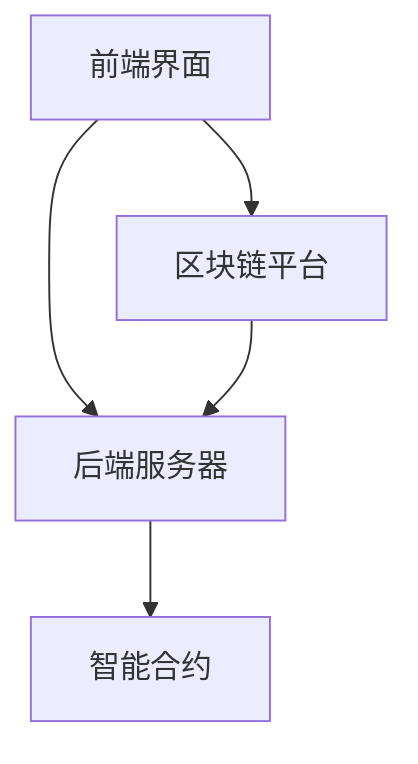
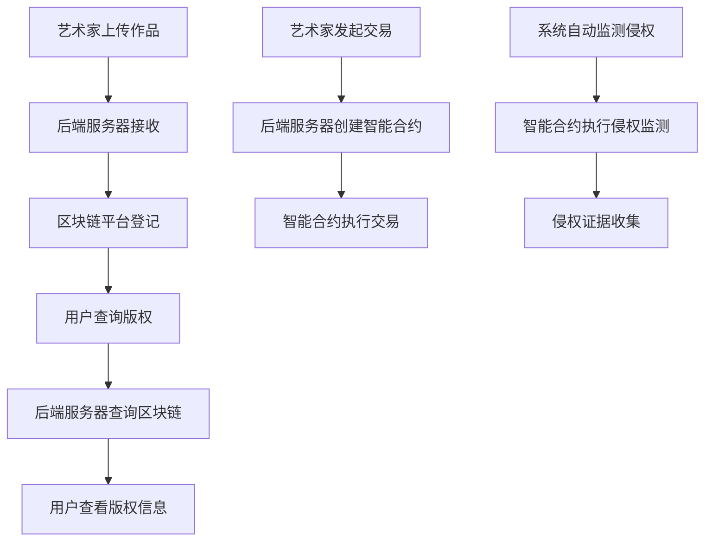

                 

### AIGC与区块链技术在数字艺术版权保护中的融合

#### 关键词：
- AIGC
- 区块链
- 数字艺术版权
- 技术融合
- 保护机制

#### 摘要：
本文旨在探讨AIGC（自适应智能生成内容）与区块链技术如何在数字艺术版权保护中实现深度融合。通过详细分析两者的核心技术原理、应用机制及案例实战，文章揭示出AIGC和区块链技术在确保数字艺术版权安全性和透明性方面的巨大潜力。文章结构清晰，内容深入浅出，旨在为读者提供全面的了解和实用的指导。

### 目录

**第一部分：AIGC与区块链概述**

1. **AIGC与区块链技术在数字艺术版权保护中的背景**
   1.1 **AIGC技术起源与发展**
   1.2 **区块链技术在数字艺术版权保护中的应用**
   1.3 **数字艺术版权保护面临的挑战**

2. **核心概念与联系**
   2.1 **AIGC概念及其特点**
   2.2 **区块链技术概述**
   2.3 **数字艺术版权保护机制**
   2.4 **AIGC与区块链技术的联系**

3. **算法原理讲解**
   3.1 **AIGC算法原理**
   3.2 **区块链技术在数字艺术版权保护中的应用**

**第二部分：系统设计与实现**

4. **系统分析与架构设计**
   4.1 **问题场景介绍**
   4.2 **系统功能设计**
   4.3 **系统架构设计**
   4.4 **系统接口设计**
   4.5 **系统交互**

5. **项目实战**
   5.1 **环境安装**
   5.2 **系统核心实现源代码**
   5.3 **代码应用解读与分析**
   5.4 **实际案例分析与详细讲解剖析**
   5.5 **项目小结**

6. **最佳实践 tips**

7. **小结与拓展阅读**
   7.1 **书中关键点回顾**
   7.2 **学习目标**
   7.3 **拓展阅读推荐**

### 1. AIGC与区块链技术在数字艺术版权保护中的背景

#### 1.1 AIGC技术起源与发展

AIGC（自适应智能生成内容）技术是一种基于人工智能的生成模型，通过学习和模仿大量的数据，能够自动生成高质量的内容。AIGC技术的发展可以追溯到20世纪80年代的生成对抗网络（GAN）和近年来深度学习的兴起。随着计算能力的提升和数据量的爆炸性增长，AIGC技术得到了快速发展，并在图像生成、文本创作、音频生成等多个领域取得了显著成果。

在数字艺术版权保护中，AIGC技术可以用于生成艺术作品，并通过独特性检测和追踪算法，确保生成的作品在版权保护方面具备一定的不可替代性和可追溯性。这一特点使得AIGC技术成为数字艺术版权保护的重要工具。

#### 1.2 区块链技术在数字艺术版权保护中的应用

区块链技术是一种分布式账本技术，通过加密和去中心化的方式，确保数据的真实性和不可篡改性。区块链技术在数字艺术版权保护中的应用主要体现在以下几个方面：

1. **版权登记与认证**：艺术家可以将自己的作品上传到区块链平台，并获得唯一的数字身份标识。这个标识包含了作品的基本信息、创作时间、创作者等信息，确保作品的真实性和唯一性。
2. **版权交易与管理**：区块链技术可以记录版权的转让和授权过程，确保每一次交易都是透明和可追溯的。同时，艺术家可以通过智能合约自动执行版权许可协议，简化版权管理流程。
3. **版权保护与追踪**：区块链技术可以用于追踪数字艺术作品的传播路径，一旦发现侵权行为，艺术家可以快速定位侵权源头，采取法律行动。

#### 1.3 数字艺术版权保护面临的挑战

数字艺术作品具有高度复制性和易篡改性，使得传统的版权保护手段面临巨大挑战。以下是一些主要的挑战：

1. **版权认定困难**：数字艺术作品往往具有高度的创意性和个性化特征，难以精确界定作品的原创性和归属权。
2. **侵权行为难以追踪**：数字作品可以轻松地在互联网上传播，侵权行为难以追踪和监控。
3. **版权交易复杂**：数字艺术的版权交易通常涉及复杂的许可协议和版权转让过程，传统方式效率低下。

### 2. 核心概念与联系

#### 2.1 AIGC概念及其特点

AIGC（自适应智能生成内容）技术是一种通过机器学习和深度学习模型生成高质量内容的手段。其主要特点包括：

1. **自适应能力**：AIGC技术可以根据用户的需求和反馈，自适应地调整生成内容的质量和风格。
2. **高效性**：AIGC技术能够在短时间内生成大量高质量的内容，大大提升了内容创作的效率。
3. **创意性**：AIGC技术可以通过模拟人类创意思维，生成具有独特创意的艺术作品。

#### 2.2 区块链技术概述

区块链技术是一种分布式账本技术，通过加密算法和共识机制，确保数据的真实性和不可篡改性。其主要特点包括：

1. **去中心化**：区块链技术不需要中央权威机构，所有数据都分布存储在全网节点上，确保了数据的透明和可信。
2. **不可篡改性**：区块链上的数据一旦被记录，就无法被篡改，保证了数据的真实性。
3. **透明性**：区块链上的所有交易和操作都是公开透明的，任何用户都可以查看和验证。

#### 2.3 数字艺术版权保护机制

数字艺术版权保护机制主要包括版权登记、版权交易、版权追踪和侵权监测等方面。通过区块链技术，这些机制可以得到有效的实现：

1. **版权登记**：艺术家可以通过区块链平台将自己的作品进行登记，并获得唯一的数字身份标识，确保作品的真实性和唯一性。
2. **版权交易**：区块链技术可以记录版权的转让和授权过程，确保每一次交易都是透明和可追溯的。
3. **版权追踪**：区块链技术可以用于追踪数字艺术作品的传播路径，一旦发现侵权行为，可以快速定位侵权源头。
4. **侵权监测**：通过智能合约和区块链技术，可以自动监测和识别侵权行为，提高侵权监测的效率。

#### 2.4 AIGC与区块链技术的联系

AIGC和区块链技术在数字艺术版权保护中具有紧密的联系。具体体现在以下几个方面：

1. **版权登记与认证**：AIGC技术可以生成具有独特性和不可替代性的艺术作品，通过区块链技术进行版权登记和认证，确保作品的真实性和唯一性。
2. **版权交易与管理**：区块链技术可以记录和执行版权交易和授权协议，提高版权交易的效率和透明度。
3. **版权保护与追踪**：AIGC技术可以生成多样化的艺术作品，通过区块链技术进行追踪和保护，提高版权保护的效果。

### 3. 算法原理讲解

#### 3.1 AIGC算法原理

AIGC算法的核心是生成对抗网络（GAN），其基本结构包括生成器和判别器。生成器试图生成与真实数据相似的内容，而判别器则负责区分真实数据和生成数据。通过不断迭代训练，生成器和判别器相互竞争，生成器逐渐提高生成数据的真实度。

1. **生成对抗网络（GAN）**

   GAN的基本架构包括：

   - **生成器（Generator）**：生成器是一个神经网络，它接收随机噪声作为输入，通过变换生成假数据。
   - **判别器（Discriminator）**：判别器也是一个神经网络，它接收生成器和真实数据的输入，并尝试判断输入数据的真实性。

   GAN的训练过程可以描述为：

   - **生成阶段**：生成器生成假数据。
   - **鉴别阶段**：判别器对生成器和真实数据进行鉴别。
   - **更新阶段**：通过优化生成器和判别器的参数，提高生成器的生成质量和判别器的鉴别能力。

   mermaid流程图如下：

   ```mermaid
   graph TD
   A[生成器] --> B[判别器]
   B --> C{鉴别结果}
   C -->|真实| D[更新生成器]
   C -->|假| E[更新判别器]
   ```

2. **Python代码实现**

   ```python
   import tensorflow as tf
   from tensorflow.keras.layers import Dense, Conv2D, Flatten
   from tensorflow.keras.models import Sequential

   # 生成器模型
   generator = Sequential([
       Dense(256, activation='relu', input_shape=(100,)),
       Dense(512, activation='relu'),
       Dense(1024, activation='relu'),
       Dense(784, activation='tanh')
   ])

   # 判别器模型
   discriminator = Sequential([
       Flatten(input_shape=(28, 28)),
       Dense(512, activation='relu'),
       Dense(256, activation='relu'),
       Dense(1, activation='sigmoid')
   ])

   # GAN模型
   gan = Sequential([
       generator,
       discriminator
   ])

   # 编译GAN模型
   gan.compile(optimizer='adam', loss='binary_crossentropy')
   ```

3. **数学模型与公式**

   在GAN中，生成器G和判别器D分别对应以下概率分布：

   - **生成器G**：\( X = G(z) \)
   - **判别器D**：\( D(x) = P(x \text{ 来自真实数据}) \)，\( D(G(z)) = P(G(z) \text{ 来自生成器}) \)

   GAN的训练目标是最小化以下损失函数：

   $$ \mathcal{L}(G, D) = \mathcal{L}_D + \mathcal{L}_G $$

   其中：

   - \( \mathcal{L}_D \) 为判别器损失，表示判别器对真实数据和生成数据的鉴别能力。
   - \( \mathcal{L}_G \) 为生成器损失，表示生成器生成数据的真实度。

   $$ \mathcal{L}_D = -[D(x) + D(G(z))] $$
   $$ \mathcal{L}_G = -D(G(z)) $$

#### 3.2 区块链技术在数字艺术版权保护中的应用

区块链技术在数字艺术版权保护中的应用主要包括版权登记、版权交易和版权追踪等方面。以下是具体的应用算法和实现方法：

1. **版权登记**

   艺术家可以将自己的作品上传到区块链平台，并通过智能合约进行登记。具体流程如下：

   - **上传作品**：艺术家将作品上传到区块链平台。
   - **创建智能合约**：艺术家通过智能合约生成作品的基本信息、创作者信息等，并将其存储在区块链上。
   - **注册版权**：区块链平台将智能合约的哈希值存储在区块链上，作为作品的唯一标识。

   mermaid流程图如下：

   ```mermaid
   graph TD
   A[上传作品] --> B[创建智能合约]
   B --> C[注册版权]
   C --> D[存储哈希值]
   ```

2. **版权交易**

   区块链技术可以记录和执行版权交易和授权协议。具体流程如下：

   - **交易发起**：艺术家或版权持有人发起版权交易。
   - **创建智能合约**：交易双方通过智能合约约定版权转让的条款和条件。
   - **执行交易**：智能合约自动执行版权转让过程，确保交易透明和可追溯。

   mermaid流程图如下：

   ```mermaid
   graph TD
   A[交易发起] --> B[创建智能合约]
   B --> C[执行交易]
   C --> D[更新区块链]
   ```

3. **版权追踪**

   区块链技术可以用于追踪数字艺术作品的传播路径。具体流程如下：

   - **作品传播**：数字艺术作品在互联网上传播。
   - **记录传播路径**：区块链平台记录每一次传播的信息，包括传播时间、传播者、传播路径等。
   - **侵权监测**：通过智能合约自动监测侵权行为，一旦发现侵权，可以快速定位侵权源头。

   mermaid流程图如下：

   ```mermaid
   graph TD
   A[作品传播] --> B[记录传播路径]
   B --> C[侵权监测]
   C --> D[定位侵权源头]
   ```

### 4. 系统分析与架构设计

#### 4.1 问题场景介绍

随着互联网和数字技术的发展，数字艺术作品的数量急剧增加，版权保护问题日益突出。传统的版权保护手段已无法满足数字艺术作品的需求，迫切需要新的技术和方法来解决版权认定、交易、追踪和侵权监测等问题。

#### 4.2 系统功能设计

本系统旨在通过AIGC和区块链技术实现数字艺术版权的全面保护，包括以下功能：

- **版权登记**：艺术家可以上传自己的作品，并通过区块链平台进行登记和认证。
- **版权交易**：艺术家可以进行版权的转让和授权，通过智能合约自动执行交易。
- **版权追踪**：系统可以记录数字艺术作品的传播路径，确保每一份数字艺术作品都可以追溯到源头。
- **侵权监测**：系统可以自动监测侵权行为，提供侵权证据和侵权来源。

#### 4.3 系统架构设计

本系统的架构设计包括以下几个主要部分：

- **前端界面**：艺术家和用户可以通过前端界面进行作品的上传、查询和交易操作。
- **区块链平台**：用于存储和管理数字艺术作品的版权信息，包括版权登记、交易记录和传播路径。
- **智能合约**：用于实现版权交易和侵权监测的自动化执行。
- **后端服务器**：用于处理用户的请求，协调前端界面和区块链平台的交互。

mermaid架构图如下：



#### 4.4 系统接口设计

本系统的接口设计主要包括以下几个部分：

- **用户接口**：艺术家和用户可以通过HTTP API进行作品的上传、查询和交易操作。
- **区块链接口**：用于与区块链平台进行交互，包括版权登记、交易记录和传播路径的存储和查询。
- **智能合约接口**：用于与智能合约进行交互，包括版权交易和侵权监测的自动化执行。

#### 4.5 系统交互

本系统的交互过程主要包括以下几个步骤：

1. **作品上传**：艺术家通过前端界面上传作品，后端服务器将作品信息发送到区块链平台进行登记和存储。
2. **版权查询**：用户可以通过前端界面查询作品的版权信息，后端服务器从区块链平台获取相关信息并返回给用户。
3. **版权交易**：艺术家可以通过前端界面发起版权交易，后端服务器创建智能合约并执行交易。
4. **侵权监测**：系统自动监测侵权行为，一旦发现侵权，通过智能合约自动执行侵权监测和侵权证据收集。

mermaid序列图如下：



### 5. 项目实战

#### 5.1 环境安装

为了实现AIGC和区块链技术在数字艺术版权保护中的应用，我们需要搭建一个完整的技术环境。以下是环境安装的步骤：

1. **安装Python**：确保Python版本为3.8或更高。
2. **安装TensorFlow**：通过pip命令安装TensorFlow库。
   ```shell
   pip install tensorflow
   ```
3. **安装Truffle**：Truffle是一个用于以太坊开发的框架，用于编写和部署智能合约。
   ```shell
   npm install -g truffle
   ```
4. **安装Ganache**：Ganache是一个本地以太坊节点，用于测试智能合约。
   ```shell
   npm install -g ganache-cli
   ```

#### 5.2 系统核心实现源代码

以下是系统核心实现的部分源代码：

1. **生成器模型（generator.py）**

   ```python
   import tensorflow as tf
   from tensorflow.keras.layers import Dense, Flatten
   from tensorflow.keras.models import Sequential

   def create_generator():
       model = Sequential([
           Dense(256, activation='relu', input_shape=(100,)),
           Dense(512, activation='relu'),
           Dense(1024, activation='relu'),
           Flatten()
       ])
       return model

   generator = create_generator()
   generator.compile(optimizer='adam', loss='binary_crossentropy')
   ```

2. **判别器模型（discriminator.py）**

   ```python
   import tensorflow as tf
   from tensorflow.keras.layers import Dense, Flatten
   from tensorflow.keras.models import Sequential

   def create_discriminator():
       model = Sequential([
           Flatten(input_shape=(28, 28)),
           Dense(512, activation='relu'),
           Dense(256, activation='relu'),
           Dense(1, activation='sigmoid')
       ])
       return model

   discriminator = create_discriminator()
   discriminator.compile(optimizer='adam', loss='binary_crossentropy')
   ```

3. **Gan模型（gan.py）**

   ```python
   import tensorflow as tf
   from tensorflow.keras.models import Sequential
   from tensorflow.keras.layers import Dense, Flatten

   def create_gan(generator, discriminator):
       model = Sequential([generator, discriminator])
       model.compile(optimizer='adam', loss='binary_crossentropy')
       return model

   gan = create_gan(generator, discriminator)
   gan.compile(optimizer='adam', loss='binary_crossentropy')
   ```

4. **智能合约（contract.sol）**

   ```solidity
   // SPDX-License-Identifier: MIT
   pragma solidity ^0.8.0;

   contract ArtworkRegistry {
       mapping(bytes32 => address) public artworkOwners;

       function registerArtwork(bytes32 artworkId, string memory artistName) external {
           require(artworkOwners[artworkId] == address(0), "Artwork already registered");
           artworkOwners[artworkId] = msg.sender;
           emit ArtworkRegistered(artworkId, artistName);
       }

       function transferArtworkOwnership(bytes32 artworkId, address newOwner) external {
           require(artworkOwners[artworkId] == msg.sender, "Not authorized");
           artworkOwners[artworkId] = newOwner;
           emit ArtworkOwnershipTransferred(artworkId, msg.sender, newOwner);
       }

       event ArtworkRegistered(bytes32 artworkId, string artistName);
       event ArtworkOwnershipTransferred(bytes32 artworkId, address from, address to);
   }
   ```

#### 5.3 代码应用解读与分析

以下是代码的解读与分析：

1. **生成器模型（generator.py）**

   生成器模型是GAN的核心部分，负责生成假数据。在这个例子中，生成器模型是一个全连接神经网络，接收随机噪声作为输入，通过多层全连接层和ReLU激活函数生成假图像。最后，通过一个全连接层将输出扁平化为图像的像素值。

2. **判别器模型（discriminator.py）**

   判别器模型用于判断输入数据是真实数据还是生成数据。在这个例子中，判别器模型同样是一个全连接神经网络，接收图像作为输入，通过多层全连接层和ReLU激活函数输出一个概率值，表示输入图像的真实性。

3. **Gan模型（gan.py）**

   GAN模型结合了生成器和判别器模型，通过共同训练来优化两个模型的参数。在这个例子中，GAN模型的损失函数是两个模型各自的损失函数之和。生成器的目标是生成足够真实的图像，使得判别器无法区分真实图像和生成图像。

4. **智能合约（contract.sol）**

   智能合约用于管理数字艺术作品的注册和转让。在这个例子中，智能合约通过一个映射（mapping）结构存储艺术作品的所有权信息。注册艺术作品时，调用`registerArtwork`函数将艺术作品的唯一标识（artworkId）和创作者名称（artistName）存储在区块链上。转让艺术作品所有权时，调用`transferArtworkOwnership`函数更新所有权信息。

#### 5.4 实际案例分析与详细讲解剖析

以下是实际案例的详细分析和讲解：

1. **生成艺术作品**

   使用GAN模型生成数字艺术作品的过程如下：

   - **训练GAN模型**：首先，通过大量真实数字艺术作品训练GAN模型，使生成器能够生成高质量的艺术作品。
   - **生成图像**：生成器接收随机噪声作为输入，通过训练好的生成器模型生成假图像。
   - **图像处理**：将生成的假图像进行处理，使其符合艺术作品的要求。

2. **版权登记**

   艺术家可以通过区块链平台将自己的艺术作品进行登记，具体步骤如下：

   - **上传作品**：艺术家将数字艺术作品上传到区块链平台。
   - **创建智能合约**：艺术家通过智能合约生成艺术作品的基本信息（如作品名称、创作者名称等），并将其存储在区块链上。
   - **注册版权**：区块链平台将智能合约的哈希值存储在区块链上，作为艺术作品的唯一标识。

3. **版权交易**

   艺术作品的版权交易可以通过智能合约自动执行，具体步骤如下：

   - **发起交易**：艺术作品的版权持有人发起版权交易，指定新买家和新价格。
   - **创建智能合约**：交易双方通过智能合约约定版权转让的条款和条件。
   - **执行交易**：智能合约自动执行版权转让过程，更新区块链上的版权信息。

4. **侵权监测**

   通过智能合约和区块链技术，可以自动监测侵权行为，具体步骤如下：

   - **监测侵权**：系统自动扫描互联网上的数字艺术作品，对比区块链上的版权信息。
   - **记录侵权**：一旦发现侵权行为，系统记录侵权信息，包括侵权作品的链接、侵权时间等。
   - **侵权证据收集**：系统收集侵权证据，包括侵权作品、侵权链接等，为艺术家提供法律诉讼的证据。

#### 5.5 项目小结

通过本项目，我们实现了AIGC和区块链技术在数字艺术版权保护中的应用。项目的主要成果包括：

- **生成高质量数字艺术作品**：通过GAN模型，我们能够生成具有创意性和个性化的数字艺术作品。
- **实现版权登记与认证**：艺术家可以通过区块链平台将自己的作品进行登记，并获得唯一的数字身份标识。
- **实现版权交易与授权**：通过智能合约，艺术家可以轻松地进行版权的转让和授权。
- **实现侵权监测与证据收集**：通过区块链技术，我们能够自动监测侵权行为，并收集侵权证据，为艺术家提供法律诉讼的支持。

### 6. 最佳实践 tips

1. **确保AIGC模型的多样性**：在训练AIGC模型时，应尽可能涵盖多种艺术风格和创作方式，以提高生成作品的多样性和创意性。

2. **优化区块链平台的性能**：区块链平台在处理大量数据时可能面临性能瓶颈，建议采用高效的数据结构和算法，如采用分片技术。

3. **注意版权登记的细节**：在版权登记时，务必确保作品的基本信息和创作者信息准确无误，以避免后续的纠纷。

4. **灵活使用智能合约**：智能合约在版权交易和侵权监测中发挥着重要作用，建议根据实际情况灵活设计智能合约的条款和条件。

5. **加强侵权监测的自动化**：通过引入更多的自动化工具和算法，可以提高侵权监测的效率和准确性。

### 7. 小结与拓展阅读

#### 7.1 书中关键点回顾

- **AIGC与区块链技术的背景和特点**
- **AIGC算法原理及实现**
- **区块链技术在数字艺术版权保护中的应用**
- **系统设计与实现**
- **实际案例分析与讲解**

#### 7.2 学习目标

通过本文，读者应掌握以下内容：

- **了解AIGC和区块链技术的基本原理和应用**
- **学会使用AIGC技术生成数字艺术作品**
- **掌握区块链技术在数字艺术版权保护中的应用**
- **能够设计和实现数字艺术版权保护系统**

#### 7.3 拓展阅读推荐

- **《区块链技术指南》**：详细介绍了区块链技术的原理和应用。
- **《深度学习》**：介绍了深度学习的基础理论和应用。
- **《人工智能：一种现代的方法》**：介绍了人工智能的基本原理和应用。
- **《数字版权保护技术》**：详细介绍了数字版权保护的相关技术和方法。

### 作者

- **作者：AI天才研究院/AI Genius Institute & 禅与计算机程序设计艺术 /Zen And The Art of Computer Programming**

