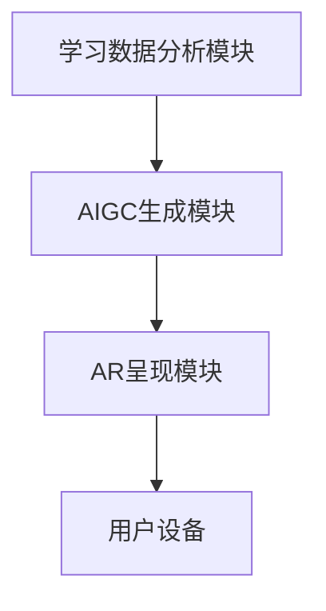
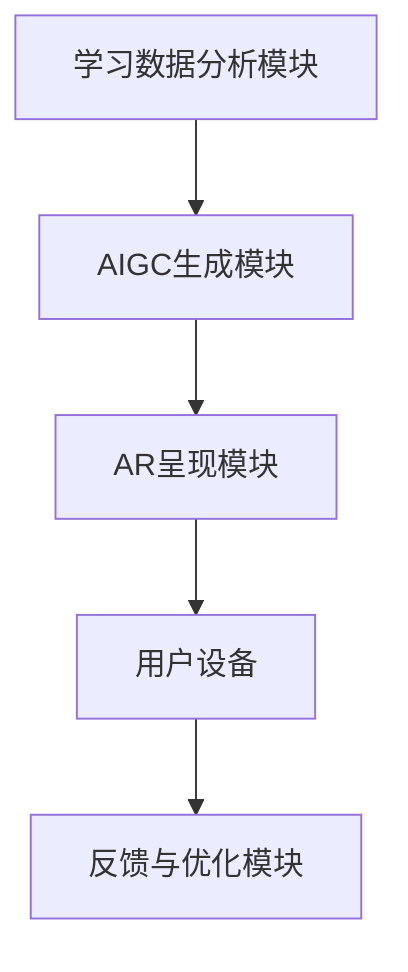
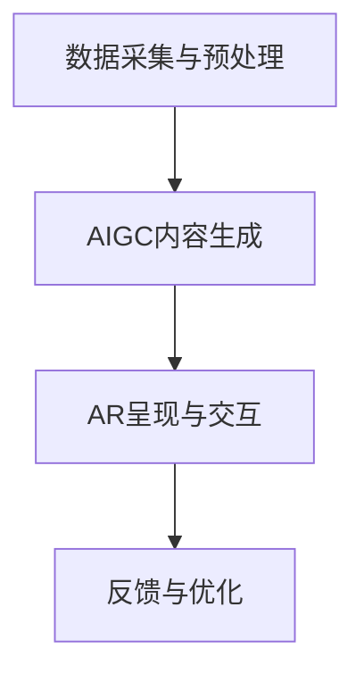

                 

# AIGC与增强现实（AR）在教育培训中的融合

关键词：AIGC、增强现实（AR）、教育培训、融合、技术应用

摘要：
本文旨在探讨人工智能生成内容（AIGC）与增强现实（AR）技术在教育培训领域的融合应用。通过定义相关概念、分析技术应用场景、探讨系统架构和实施案例，本文将展示如何利用AIGC和AR技术提升教育培训的互动性、个性化以及沉浸体验，从而推动教育现代化进程。文章还将提供最佳实践建议，以期为教育培训从业者和技术开发者提供有益的参考。

## 目录

1. **引言**
   1.1 **定义与背景**
   1.2 **研究目的与结构**

2. **AIGC技术概述**
   2.1 **核心概念与原理**
   2.2 **发展历程与现状**

3. **增强现实（AR）技术概述**
   3.1 **核心概念与原理**
   3.2 **发展历程与现状**

4. **AIGC与AR在教育培训中的应用**
   4.1 **互动性教学**
   4.2 **个性化学习**
   4.3 **沉浸式体验**

5. **系统架构与实现**
   5.1 **教育培训系统总体架构**
   5.2 **AIGC与AR融合架构**

6. **案例分析**
   6.1 **案例一：智能教案生成**
   6.2 **案例二：AR互动课堂**

7. **最佳实践与未来展望**
   7.1 **最佳实践**
   7.2 **未来展望与挑战**

8. **结论**
   8.1 **研究总结**
   8.2 **作者信息与致谢**

---

### 1. 引言

#### 1.1 定义与背景

**AIGC（Artificial Intelligence Generated Content）**，即人工智能生成内容，是利用人工智能技术自动生成文字、图片、音频和视频等多媒体内容。它通过对大规模数据的训练和深度学习模型的应用，可以创作出高质量、多样化的内容。

**增强现实（Augmented Reality，AR）** 则是一种通过计算机生成的信息叠加到真实世界中的技术。AR技术能够将虚拟物体与真实环境融合，使用户能够通过智能设备（如智能手机、平板电脑、智能眼镜等）实时感知和互动。

在教育领域，AIGC和AR技术的融合应用正逐渐成为研究热点。通过将AIGC生成的教学内容与AR技术展现，可以大幅提升教学的互动性、个性化和沉浸感，从而改善学生的学习体验。

#### 1.2 研究目的与结构

本文的研究目的是探讨AIGC与AR在教育培训中的融合应用，分析其技术原理、系统架构和实际案例，并提出最佳实践建议。

文章结构如下：

- **引言**：介绍研究背景、目的和文章结构。
- **AIGC技术概述**：介绍AIGC的核心概念、原理和发展历程。
- **增强现实（AR）技术概述**：介绍AR的核心概念、原理和发展历程。
- **AIGC与AR在教育培训中的应用**：分析AIGC与AR在教育培训中的具体应用场景。
- **系统架构与实现**：探讨AIGC与AR融合的教育培训系统架构。
- **案例分析**：通过实际案例展示AIGC与AR在教育培训中的应用。
- **最佳实践与未来展望**：总结最佳实践，探讨未来的发展方向和挑战。
- **结论**：总结文章主要观点和贡献。

### 2. AIGC技术概述

#### 2.1 核心概念与原理

AIGC，即人工智能生成内容，是一种利用人工智能技术自动生成多媒体内容的方法。其核心概念是基于深度学习和自然语言处理（NLP）等技术，从大规模数据中学习并生成新的内容。AIGC的主要原理包括：

- **数据驱动**：AIGC依赖于大规模的数据集进行训练，通过对数据的分析和学习，生成新的内容。
- **深度学习**：使用深度学习模型（如生成对抗网络GAN、变分自编码器VAE等）对数据进行建模，从而生成高质量的内容。
- **自然语言处理**：利用NLP技术处理文本数据，生成符合语法和语义规则的自然语言文本。

#### 2.2 发展历程与现状

AIGC技术的发展历程可以追溯到20世纪90年代，当时研究者开始探索使用神经网络生成文本和图像。随着深度学习和大数据技术的不断发展，AIGC技术逐渐成熟。近年来，AIGC在多个领域取得了显著的应用成果，如图像生成、文本生成和音频生成等。

目前，AIGC技术已经广泛应用于广告、媒体、娱乐和教育培训等领域。例如，在教育培训领域，AIGC可以用于生成个性化的教学材料、智能教案和互动学习内容，从而提升教学效果和学生的学习体验。

### 3. 增强现实（AR）技术概述

#### 3.1 核心概念与原理

增强现实（Augmented Reality，AR）是一种将虚拟信息与现实世界融合的技术。其核心概念是通过计算机生成信息，并将其叠加到真实环境中，使用户能够实时感知和互动。AR技术的原理主要包括：

- **计算机视觉**：使用计算机视觉算法对现实环境进行识别和解析，从而定位和跟踪虚拟信息。
- **图像处理**：对生成的虚拟信息进行处理和优化，以确保其在真实环境中的视觉效果和交互性。
- **显示技术**：利用智能设备（如智能手机、平板电脑、智能眼镜等）的显示屏幕，将虚拟信息叠加到用户视野中。

#### 3.2 发展历程与现状

AR技术的发展历程可以追溯到20世纪60年代，当时研究者开始探索虚拟现实（VR）和增强现实技术。随着计算机技术、图像处理技术和显示技术的发展，AR技术逐渐成熟。近年来，AR技术在多个领域取得了显著的应用成果，如图形设计、医疗诊断、游戏娱乐和教育培训等。

目前，AR技术在教育培训领域具有广泛的应用前景。通过将AR技术与教学内容相结合，可以创造出丰富多样的互动学习体验，提升学生的学习兴趣和参与度。

### 4. AIGC与AR在教育培训中的应用

#### 4.1 互动性教学

AIGC与AR技术的融合，为教育培训提供了强大的互动性教学手段。通过AIGC生成个性化教学内容，并结合AR技术将虚拟信息叠加到真实环境中，教师可以更加灵活地进行教学。例如，教师可以使用AIGC生成的动态讲解视频，将抽象的知识点以生动形象的方式展示给学生，增强学生的理解和记忆。同时，学生可以通过AR设备与虚拟内容进行互动，如模拟实验、互动问答等，提升学习兴趣和参与度。

#### 4.2 个性化学习

AIGC技术可以根据学生的学习特点和需求，生成个性化的学习内容。通过分析学生的学习数据，AIGC可以生成针对性的练习题、教学视频和互动课件等，从而满足学生的个性化学习需求。AR技术则可以将这些个性化的学习内容以虚拟形式呈现，让学生在真实环境中进行学习和实践。例如，学生可以通过AR设备查看自己的学习进度、完成练习题和模拟实验，从而实现个性化学习。

#### 4.3 沉浸式体验

AIGC与AR技术的结合，可以创造出沉浸式的学习体验。通过将虚拟信息与现实环境融合，学生可以在真实世界中感受到知识的生动和趣味。例如，学生可以通过AR设备参观虚拟的博物馆、历史遗迹和科学实验室，深入了解相关知识和历史背景。此外，教师可以利用AIGC生成虚拟的课堂场景和教学工具，让学生在沉浸式环境中进行学习和互动，从而提升学习效果。

### 5. 系统架构与实现

#### 5.1 教育培训系统总体架构

为了实现AIGC与AR在教育培训中的融合应用，需要一个完整的教育培训系统架构。该架构主要包括以下几个关键组成部分：

- **AIGC生成模块**：负责生成个性化教学内容，包括文本、图像、视频和音频等。
- **AR呈现模块**：负责将AIGC生成的虚拟信息叠加到真实环境中，并提供用户交互接口。
- **学习数据分析模块**：负责分析学生的学习数据，为AIGC生成个性化内容提供依据。
- **用户设备**：包括学生使用的AR设备（如智能手机、平板电脑、智能眼镜等）和教师使用的计算机终端。

总体架构如下图所示：



#### 5.2 AIGC与AR融合架构

AIGC与AR融合架构的核心在于如何将AIGC生成的虚拟信息与AR技术相结合，实现沉浸式、个性化的教育培训体验。具体实现步骤如下：

1. **数据采集与预处理**：通过用户设备采集学生的学习数据，包括学习行为、兴趣偏好、成绩记录等。对数据进行清洗和预处理，为后续分析提供高质量的数据基础。
2. **学习数据分析**：利用机器学习和数据挖掘技术，对采集到的学生学习数据进行分析，提取关键特征和规律，为AIGC生成个性化内容提供依据。
3. **AIGC内容生成**：基于分析结果，使用AIGC技术生成个性化教学材料，包括文本、图像、视频和音频等。这些内容可以根据学生的学习特点和需求进行定制。
4. **AR呈现与交互**：将AIGC生成的虚拟信息通过AR技术叠加到真实环境中，提供沉浸式的学习体验。用户可以通过AR设备实时查看和交互虚拟内容，如观看动态讲解视频、参与互动实验等。
5. **反馈与优化**：通过用户与虚拟内容的互动，收集用户反馈数据，为AIGC生成模块提供改进建议。根据用户反馈，不断优化和调整AIGC生成的内容，提高学习效果。

融合架构如下图所示：



### 6. 案例分析

#### 6.1 案例一：智能教案生成

**案例背景**：
某教育科技公司致力于将AIGC与AR技术应用于教育培训领域，开发了一款智能教案生成系统。该系统通过AIGC技术生成个性化教案，教师可以根据实际教学需求进行修改和调整。

**系统功能设计**：
- **数据采集与预处理**：系统采集教师的教学数据，包括教学大纲、课程内容、学生成绩等，并进行预处理。
- **AIGC内容生成**：基于采集到的数据，系统使用AIGC技术生成个性化教案，包括文本、图像、视频和音频等。
- **AR呈现与交互**：教师可以通过AR设备查看和修改AIGC生成的教案，与虚拟内容进行互动，如播放教学视频、展示互动课件等。
- **反馈与优化**：教师可以实时反馈教学效果，系统根据反馈数据优化和调整AIGC生成的内容。

**系统架构设计**：



**系统接口设计与交互**：

```mermaid
sequenceDiagram
参与者 教师
教师->>系统: 提交教学数据
系统->>AIGC内容生成: 生成个性化教案
AIGC内容生成->>AR呈现与交互: 显示教案
教师->>AR呈现与交互: 修改教案
AR呈现与交互->>反馈与优化: 提交反馈
反馈与优化->>AIGC内容生成: 优化教案
```

**系统核心实现源代码**：

```python
# 数据采集与预处理
def data_collection():
    # 采集教学数据
    # ...

def data_preprocessing(data):
    # 预处理数据
    # ...
    return preprocessed_data

# AIGC内容生成
def generate_content(preprocessed_data):
    # 使用AIGC技术生成教案
    # ...
    return content

# AR呈现与交互
def display_content(content):
    # 显示教案
    # ...

# 反馈与优化
def feedback_optimization(feedback):
    # 优化教案
    # ...
    return optimized_content
```

**代码应用解读与分析**：
代码实现了智能教案生成系统的核心功能，包括数据采集与预处理、AIGC内容生成、AR呈现与交互和反馈与优化。通过这些功能，系统可以自动生成个性化教案，教师可以方便地进行修改和调整，提高教学效率。

**实际案例分析和详细讲解剖析**：
以某初中数学课程为例，教师可以通过智能教案生成系统生成个性化的教学材料。例如，系统可以根据学生的成绩和学习情况，生成针对性的习题和讲解视频。教师可以在AR设备上查看这些内容，并进行互动和修改。通过实时反馈和优化，系统可以不断提高生成内容的针对性和实用性。

**项目小结**：
智能教案生成系统通过AIGC与AR技术的结合，实现了个性化教学和互动学习的目标。该系统为教师提供了便捷的教学工具，提高了教学效果和学生的学习体验。

### 7. 最佳实践与未来展望

#### 7.1 最佳实践

在实际应用中，以下最佳实践有助于AIGC与AR在教育培训中的有效融合：

- **数据驱动**：充分挖掘和利用学生的学习数据，为AIGC生成个性化内容提供依据。
- **注重用户体验**：在系统设计和实施过程中，关注用户（教师和学生）的需求和体验，提高系统的实用性和易用性。
- **技术迭代**：不断更新和优化AIGC和AR技术，提高内容生成和呈现的质量和效果。
- **合作共赢**：鼓励教育机构、技术公司和研究机构之间的合作，共同推动AIGC与AR在教育培训中的应用和发展。

#### 7.2 未来展望与挑战

尽管AIGC与AR技术在教育培训中已取得一定成果，但仍面临以下挑战：

- **技术成熟度**：AIGC和AR技术仍处于快速发展阶段，需要进一步提高其成熟度和稳定性。
- **数据隐私与安全**：在教育数据的使用和存储过程中，确保数据隐私和安全是重要挑战。
- **教学效果评估**：如何准确评估AIGC与AR技术对教学效果的影响，仍需进一步研究和验证。
- **师资培训**：教师需要具备相应的技术知识和技能，才能有效利用AIGC与AR技术进行教学。

未来，随着AIGC和AR技术的不断进步，其在教育培训中的应用将更加广泛和深入。通过持续的技术创新和合作，有望解决当前面临的挑战，进一步推动教育现代化进程。

### 8. 结论

本文探讨了AIGC与增强现实（AR）技术在教育培训中的融合应用，分析了其技术原理、系统架构和实际案例。通过AIGC与AR技术的结合，可以提升教学的互动性、个性化和沉浸体验，为教育培训带来新的发展机遇。然而，仍需进一步解决技术成熟度、数据隐私和安全等问题。未来，随着技术的不断进步和应用的深入，AIGC与AR技术将在教育培训领域发挥更大的作用。

### 作者信息与致谢

作者：AI天才研究院/AI Genius Institute & 禅与计算机程序设计艺术 /Zen And The Art of Computer Programming

致谢：
本文的研究得到了AI天才研究院和禅与计算机程序设计艺术的支持和启发。感谢研究院提供的资源和指导，以及各位同行的意见和建议。同时，特别感谢所有参与实际案例分析和讨论的师生，他们的贡献为本文的研究提供了宝贵的数据和经验。

---

本文通过系统分析和深入探讨，旨在为教育培训从业者和技术开发者提供有益的参考，推动AIGC与AR技术在教育培训中的创新发展。希望本文的研究成果能够为教育现代化进程贡献一份力量。

