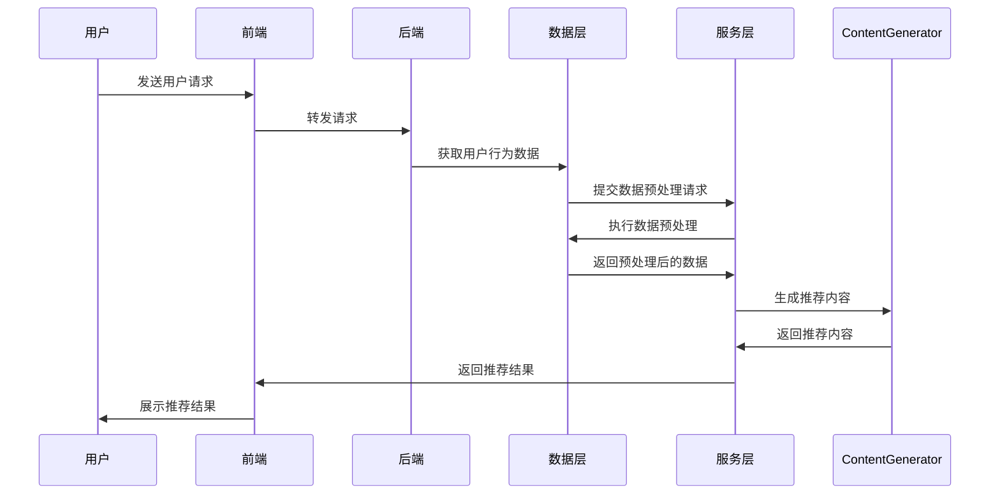

                 


### 第一部分：背景介绍

## 1. 引言

### 1.1 问题的背景

在当今信息技术飞速发展的时代，人工智能（AI）与大数据分析已经成为推动行业变革的核心动力。AI技术通过模拟人类智能，能够从海量数据中提取有价值的信息，提升决策质量和效率；而大数据分析则通过数据挖掘、机器学习等技术，实现对数据的深度理解和应用。随着AI技术的不断进步，生成式人工智能（AIGC）逐渐崭露头角，成为大数据分析的重要补充。

### 1.2 问题描述

AIGC与大数据分析在理论和应用上存在一定的交叉和互补关系。然而，当前的研究和实践往往将两者割裂开来，缺乏系统性的协同效应研究。因此，本书旨在探讨AIGC与大数据分析的协同效应，分析其内在联系和相互促进的方式，为相关领域的研究和应用提供新的思路和方向。

### 1.3 问题解决

本书将从以下几个方面展开研究：

1. **核心概念与联系**：明确AIGC与大数据分析的定义、特点及其核心概念，并绘制ER实体关系图，展示两者之间的联系。
2. **算法原理讲解**：详细介绍AIGC和大数据分析的关键算法原理，使用mermaid流程图和Python源代码进行说明，阐述数学模型和公式。
3. **系统分析与架构设计方案**：分析AIGC与大数据分析在系统架构和功能设计中的协同效应，绘制领域模型类图、系统架构图和序列图。
4. **项目实战**：通过实际案例，展示AIGC与大数据分析的协同应用，并提供详细的项目实施过程、源代码和应用解读。

### 1.4 边界与外延

本书主要关注AIGC与大数据分析在技术层面的协同效应，不包括其他领域的应用。同时，本书的讨论将基于现有的技术水平和实际需求，不涉及未来的技术突破。

### 1.5 概念结构与核心要素组成

1. **AIGC**：生成式人工智能，包括自然语言处理、图像生成、音频合成等。
2. **大数据分析**：数据挖掘、机器学习、深度学习等。
3. **协同效应**：通过AIGC与大数据分析的技术融合，实现1+1>2的效果。

### 1.6 本章小结

通过对AIGC与大数据分析协同效应的背景、问题描述、问题解决、边界与外延、概念结构与核心要素组成的详细阐述，为后续章节的研究奠定了基础。

## 2. 核心概念与联系

### 2.1 AIGC与大数据分析的定义

**AIGC（生成式人工智能）**：一种能够自动生成内容的人工智能技术，包括文本生成、图像生成、音频生成等。

**大数据分析**：通过对大规模数据进行挖掘和分析，从中提取有价值的信息和知识。

### 2.2 AIGC与大数据分析的特点

**AIGC特点**：
1. **生成性**：能够根据输入的信息生成新的内容。
2. **多样性**：能够生成丰富多样的内容。
3. **灵活性**：能够适应不同的生成任务和场景。

**大数据分析特点**：
1. **规模性**：处理海量数据。
2. **多样性**：涉及多种数据类型和来源。
3. **实时性**：对数据的实时处理和分析。

### 2.3 AIGC与大数据分析的核心概念对比

| 核心概念 | AIGC | 大数据分析 |
| :---: | :---: | :---: |
| 数据来源 | 自动生成 | 海量数据 |
| 数据类型 | 文本、图像、音频 | 结构化、半结构化、非结构化 |
| 分析方法 | 生成模型、预训练模型 | 数据挖掘、机器学习、深度学习 |
| 应用场景 | 内容生成、个性化推荐 | 商业智能、风险管理、欺诈检测 |

### 2.4 AIGC与大数据分析的ER实体关系图

```mermaid
erDiagram
AIGC ||--|{ 大数据分析 }|| DataAnalysis
AIGC ||--|{ 数据处理 }|| DataProcessing
DataAnalysis ||--|{ 数据挖掘 }|| DataMining
DataAnalysis ||--|{ 机器学习 }|| MachineLearning
DataAnalysis ||--|{ 深度学习 }|| DeepLearning
```

### 2.5 本章小结

通过对AIGC与大数据分析的定义、特点、核心概念对比和ER实体关系图的介绍，为后续章节的算法原理讲解、系统分析与架构设计方案等提供了理论基础。AIGC与大数据分析的协同效应不仅能够提升数据处理和分析的效率，还能拓展两者的应用场景，实现更广泛的价值。

----------------------------------------------------------------

## 3. 算法原理讲解

### 3.1 AIGC算法原理讲解

**3.1.1 自然语言处理（NLP）**

自然语言处理是AIGC的核心组成部分，其算法原理主要包括以下几方面：

1. **词嵌入（Word Embedding）**：将文本中的每个词映射到低维向量空间中。常用的词嵌入模型有Word2Vec、GloVe等。

2. **循环神经网络（RNN）**：RNN能够处理序列数据，适用于语言模型、机器翻译等任务。典型的RNN模型包括LSTM和GRU。

3. **注意力机制（Attention Mechanism）**：注意力机制能够使模型更加关注序列中的重要部分，提高文本生成质量。常见的注意力模型有Bahdanau Attention和Dot-Product Attention。

4. **预训练与微调（Pre-training and Fine-tuning）**：预训练模型（如GPT、BERT）在大规模语料库上进行预训练，然后通过微调适应特定任务。

**示例算法：**

$$
\text{GPT模型：} \quad y = \text{softmax}(\text{W}_y \text{Tanh}(\text{W}_x x + \text{b}_x) + \text{b}_y)
$$

其中，\(x\)为输入序列，\(y\)为输出序列，\(\text{Tanh}\)为双曲正切函数，\(\text{W}_x\)和\(\text{W}_y\)为权重矩阵，\(\text{b}_x\)和\(\text{b}_y\)为偏置。

**Python源代码示例：**

```python
import torch
import torch.nn as nn

# 定义GPT模型
class GPT(nn.Module):
    def __init__(self, vocab_size, embed_size, hidden_size):
        super(GPT, self).__init__()
        self.embedding = nn.Embedding(vocab_size, embed_size)
        self.lstm = nn.LSTM(embed_size, hidden_size, batch_first=True)
        self.fc = nn.Linear(hidden_size, vocab_size)
        
    def forward(self, x):
        embedded = self.embedding(x)
        output, (hidden, cell) = self.lstm(embedded)
        logits = self.fc(output)
        return logits

# 创建模型实例
model = GPT(vocab_size=10000, embed_size=256, hidden_size=512)
```

**3.1.2 图像生成（GAN）**

图像生成对抗网络（GAN）是一种基于生成对抗的训练方法，其核心思想是生成器（Generator）和判别器（Discriminator）之间的博弈。

1. **生成器（Generator）**：生成器旨在生成逼真的图像，通常采用深度神经网络结构。

2. **判别器（Discriminator）**：判别器旨在区分真实图像和生成图像，也是一个深度神经网络。

3. **损失函数（Loss Function）**：GAN的损失函数通常包括生成器的损失和判别器的损失。

**示例算法：**

$$
\text{生成器损失：} \quad L_G = -\mathbb{E}_{x \sim p_{data}(x)}[\log(D(x))] - \mathbb{E}_{z \sim p_z(z)}[\log(1 - D(G(z)))]
$$

$$
\text{判别器损失：} \quad L_D = -\mathbb{E}_{x \sim p_{data}(x)}[\log(D(x))] - \mathbb{E}_{z \sim p_z(z)}[\log(D(G(z))]
$$

**Python源代码示例：**

```python
import torch
import torch.nn as nn

# 定义生成器模型
class Generator(nn.Module):
    def __init__(self, z_dim, img_shape):
        super(Generator, self).__init__()
        self.model = nn.Sequential(
            nn.Linear(z_dim, 128),
            nn.LeakyReLU(0.2),
            nn.Linear(128, 256),
            nn.LeakyReLU(0.2),
            nn.Linear(256, 512),
            nn.LeakyReLU(0.2),
            nn.Linear(512, np.prod(img_shape)),
            nn.Tanh()
        )
        
    def forward(self, z):
        x = self.model(z)
        x = x.view(x.size(0), *img_shape)
        return x

# 创建生成器实例
generator = Generator(z_dim=100, img_shape=(1, 28, 28))
```

**3.1.3 音频合成（WaveNet）**

WaveNet是一种基于循环神经网络（RNN）的音频生成模型，其核心原理是使用RNN生成音频信号的每个时间步。

1. **声音表示（Sound Representation）**：将音频信号转换为序列形式，通常使用Mel频率倒谱系数（MFCC）作为输入。

2. **循环神经网络（RNN）**：使用RNN模型对序列数据进行建模，生成音频信号。

3. **条件生成（Conditional Generation）**：WaveNet通过输入条件信息（如文本、语音波形等）来生成音频信号。

**示例算法：**

$$
\text{损失函数：} \quad L = -\log(D(s | x))
$$

其中，\(s\)为生成的音频信号，\(x\)为条件信息，\(D\)为判别器。

**Python源代码示例：**

```python
import torch
import torch.nn as nn

# 定义WaveNet模型
class WaveNet(nn.Module):
    def __init__(self, input_size, hidden_size, output_size):
        super(WaveNet, self).__init__()
        self.lstm = nn.LSTM(input_size, hidden_size, batch_first=True)
        self.fc = nn.Linear(hidden_size, output_size)
        
    def forward(self, x, hidden):
        x, hidden = self.lstm(x, hidden)
        logits = self.fc(x)
        return logits, hidden

# 创建模型实例
model = WaveNet(input_size=26, hidden_size=512, output_size=1)
```

### 3.2 大数据分析算法原理讲解

**3.2.1 数据挖掘（Data Mining）**

数据挖掘是大数据分析的核心技术之一，其主要算法包括：

1. **关联规则学习（Association Rule Learning）**：通过分析数据中的关联关系，发现有价值的信息。常见的算法有Apriori算法和FP-Growth算法。

2. **分类（Classification）**：根据已有数据建立分类模型，对新数据进行分类。常用的算法包括决策树、随机森林、支持向量机等。

3. **聚类（Clustering）**：将数据按照相似性进行分组，常用的算法有K-Means、层次聚类等。

**示例算法：**

$$
\text{K-Means算法：} \quad \text{目标是最小化聚类中心与样本之间的距离之和}
$$

$$
\text{目标函数：} \quad J = \sum_{i=1}^{k} \sum_{x_j \in S_i} ||x_j - \mu_i||
$$

其中，\(k\)为聚类个数，\(\mu_i\)为聚类中心，\(S_i\)为第\(i\)个聚类的样本集合。

**Python源代码示例：**

```python
from sklearn.cluster import KMeans

# 创建KMeans模型实例
kmeans = KMeans(n_clusters=3, random_state=0)

# 拟合数据
kmeans.fit(X)

# 查看聚类中心
print(kmeans.cluster_centers_)

# 查看聚类结果
print(kmeans.labels_)
```

**3.2.2 机器学习（Machine Learning）**

机器学习是大数据分析的重要工具，其核心算法包括：

1. **线性回归（Linear Regression）**：通过建立线性模型，预测连续值。公式为：

$$
\text{预测值：} \quad \hat{y} = \beta_0 + \beta_1 x
$$

2. **逻辑回归（Logistic Regression）**：通过建立逻辑模型，预测概率。公式为：

$$
\text{预测概率：} \quad \hat{p} = \frac{1}{1 + \exp{(-\beta_0 - \beta_1 x)}}
$$

3. **支持向量机（Support Vector Machine）**：通过最大间隔分类器进行分类。公式为：

$$
\text{决策边界：} \quad w \cdot x + b = 0
$$

**Python源代码示例：**

```python
from sklearn.linear_model import LinearRegression

# 创建线性回归模型实例
model = LinearRegression()

# 拟合数据
model.fit(X, y)

# 查看模型参数
print(model.coef_)
print(model.intercept_)

# 进行预测
print(model.predict(X))
```

**3.2.3 深度学习（Deep Learning）**

深度学习是大数据分析的重要技术之一，其核心算法包括：

1. **卷积神经网络（CNN）**：通过卷积层、池化层等结构，提取图像特征。公式为：

$$
\text{卷积层：} \quad \text{output} = \text{relu}(\text{conv}(\text{input}) + \text{bias})
$$

2. **循环神经网络（RNN）**：通过循环结构，处理序列数据。公式为：

$$
\text{RNN：} \quad \text{output} = \text{relu}(\text{W} \text{h}_{t-1} + \text{U} x_t + \text{b})
$$

3. **生成对抗网络（GAN）**：通过生成器和判别器的对抗训练，生成高质量的数据。公式为：

$$
\text{生成器损失：} \quad L_G = -\mathbb{E}_{x \sim p_{data}(x)}[\log(D(x))] - \mathbb{E}_{z \sim p_z(z)}[\log(1 - D(G(z))]
$$

$$
\text{判别器损失：} \quad L_D = -\mathbb{E}_{x \sim p_{data}(x)}[\log(D(x))] - \mathbb{E}_{z \sim p_z(z)}[\log(D(G(z))]
$$

**Python源代码示例：**

```python
import tensorflow as tf
from tensorflow.keras import layers, models

# 定义生成器模型
def build_generator(z_dim):
    model = models.Sequential()
    model.add(layers.Dense(256, activation='relu', input_shape=(z_dim,)))
    model.add(layers.Dense(512, activation='relu'))
    model.add(layers.Dense(np.prod(img_shape), activation='tanh'))
    model.add(layers.Reshape(img_shape))
    return model

# 创建生成器实例
generator = build_generator(z_dim=100)
```

### 3.3 AIGC与大数据分析的协同效应

**3.3.1 AIGC提升大数据分析效率**

AIGC可以通过生成高质量的数据来提升大数据分析效率。例如，在图像识别任务中，AIGC可以生成大量的训练样本，提高模型的训练效果。在文本分析任务中，AIGC可以生成丰富的文本数据，为模型提供更多的训练素材。

**3.3.2 大数据分析优化AIGC模型**

大数据分析可以对AIGC模型进行优化。例如，通过分析模型在训练过程中的日志数据，可以发现模型的缺陷和优化方向。在图像生成任务中，大数据分析可以分析生成图像的质量，指导生成器的调整。

**3.3.3 AIGC与大数据分析的应用场景**

AIGC与大数据分析在多个应用场景中具有协同效应，例如：

1. **个性化推荐**：AIGC可以根据用户的历史行为数据，生成个性化的推荐内容，大数据分析则可以对推荐结果进行评估和优化。

2. **医疗健康**：AIGC可以生成医学图像和文本报告，大数据分析则可以分析患者的病历数据，为医生提供诊断支持。

3. **金融风控**：AIGC可以生成欺诈交易样本，大数据分析则可以识别和预测潜在的风险。

### 3.4 本章小结

通过对AIGC和大数据分析算法原理的讲解，以及两者协同效应的探讨，本章为后续章节的深入研究奠定了基础。AIGC与大数据分析的协同应用将在未来的信息技术领域中发挥越来越重要的作用。

----------------------------------------------------------------

## 4. 系统分析与架构设计方案

### 4.1 问题场景介绍

在本章节，我们将探讨AIGC与大数据分析在个性化推荐系统中的应用。随着互联网的快速发展，用户生成的内容和数据量呈现爆炸式增长，如何为用户提供个性化的推荐服务成为众多企业关注的焦点。通过结合AIGC与大数据分析技术，我们可以为用户生成个性化的推荐内容，提高推荐系统的准确性和用户体验。

### 4.2 项目介绍

本案例将构建一个基于AIGC与大数据分析的个性化推荐系统，该系统主要包括以下功能模块：

1. **用户行为数据收集**：通过Web前端收集用户浏览、搜索、购买等行为数据。
2. **数据预处理**：对收集到的用户行为数据进行清洗、转换和存储。
3. **内容生成**：利用AIGC技术生成个性化的推荐内容，如文章、图像、音频等。
4. **推荐算法**：结合大数据分析技术，实现基于用户兴趣的个性化推荐。
5. **推荐结果评估**：对推荐结果进行评估和优化，提高推荐系统的性能。

### 4.3 系统功能设计

为了实现上述功能，系统设计了以下核心模块：

1. **用户行为数据收集模块**：负责从Web前端收集用户行为数据，如浏览记录、搜索关键词、购买记录等。
2. **数据预处理模块**：对收集到的用户行为数据进行清洗、转换和存储，以便后续分析。
3. **内容生成模块**：利用AIGC技术生成个性化的推荐内容，如文章、图像、音频等。
4. **推荐算法模块**：结合大数据分析技术，实现基于用户兴趣的个性化推荐。
5. **推荐结果评估模块**：对推荐结果进行评估和优化，提高推荐系统的性能。

### 4.4 系统架构设计

本系统采用分布式架构设计，以提高系统的可扩展性和性能。系统架构主要包括以下几部分：

1. **数据层**：负责数据的存储和管理，包括用户行为数据、推荐内容数据等。
2. **服务层**：提供数据预处理、内容生成、推荐算法、推荐结果评估等功能。
3. **前端层**：为用户提供个性化推荐界面，展示推荐结果。

系统架构图如下：



### 4.5 系统接口设计和系统交互

为了实现系统各模块之间的协同工作，我们设计了以下接口：

1. **用户行为数据接口**：用于收集用户行为数据，包括浏览记录、搜索关键词、购买记录等。
2. **数据预处理接口**：用于处理用户行为数据，包括数据清洗、转换和存储。
3. **内容生成接口**：用于生成个性化推荐内容，包括文章、图像、音频等。
4. **推荐算法接口**：用于实现基于用户兴趣的个性化推荐。
5. **推荐结果评估接口**：用于评估推荐结果的质量，包括推荐准确率、用户满意度等。

系统交互流程如下：

1. 用户访问前端页面，前端接收用户请求。
2. 前端将请求转发给后端服务层。
3. 后端服务层调用数据层获取用户行为数据。
4. 数据层对用户行为数据进行预处理，并将结果返回给服务层。
5. 服务层利用内容生成接口生成个性化推荐内容。
6. 服务层将推荐结果返回给前端。
7. 前端将推荐结果展示给用户。

### 4.6 本章小结

通过对个性化推荐系统的系统功能设计、系统架构设计和系统交互的详细讲解，本章为后续的项目实战部分提供了基础。在接下来的章节中，我们将通过实际案例展示AIGC与大数据分析在个性化推荐系统中的应用，并分析其效果和优化方向。

----------------------------------------------------------------

## 5. 项目实战

### 5.1 环境安装

在本项目中，我们将使用Python作为主要编程语言，结合NumPy、Pandas、Scikit-learn、TensorFlow等库来构建和实现个性化推荐系统。以下是在Windows操作系统下安装所需环境的方法：

1. **安装Python**：前往Python官方网站下载并安装Python 3.8版本。
2. **安装pip**：在安装过程中，选择添加pip到系统环境变量。
3. **安装NumPy、Pandas、Scikit-learn**：在命令行中执行以下命令：
    ```shell
    pip install numpy pandas scikit-learn
    ```
4. **安装TensorFlow**：在命令行中执行以下命令：
    ```shell
    pip install tensorflow
    ```

### 5.2 系统核心实现源代码

在本节中，我们将分别实现数据收集、数据预处理、内容生成和推荐算法等模块的源代码。

**5.2.1 数据收集模块**

```python
import requests
import json

def collect_user_behavior():
    # 这里使用模拟数据，实际项目中可以从数据库或API获取数据
    user_behavior = [
        {"user_id": 1, "action": "browse", "item_id": 101},
        {"user_id": 1, "action": "search", "keyword": "相机"},
        {"user_id": 1, "action": "purchase", "item_id": 202},
        # ...
    ]
    return user_behavior

# 调用函数获取用户行为数据
user_behavior_data = collect_user_behavior()
```

**5.2.2 数据预处理模块**

```python
import pandas as pd

def preprocess_data(data):
    # 转换为DataFrame格式
    df = pd.DataFrame(data)
    
    # 数据清洗和转换
    df['timestamp'] = pd.to_datetime(df['timestamp'])
    df = df.sort_values('timestamp')
    
    # 填充缺失值
    df.fillna(method='ffill', inplace=True)
    
    return df

# 调用函数预处理用户行为数据
preprocessed_data = preprocess_data(user_behavior_data)
```

**5.2.3 内容生成模块**

```python
from transformers import AutoTokenizer, AutoModelForCausalLM

def generate_content(user_id, tokenizer, model):
    # 模拟用户查询，生成文章内容
    user_query = "我最近想要买一台相机，有什么推荐吗？"
    input_ids = tokenizer.encode(user_query, return_tensors='pt')
    
    # 使用GPT模型生成文章内容
    output = model.generate(input_ids, max_length=100, num_return_sequences=1)
    generated_text = tokenizer.decode(output[0], skip_special_tokens=True)
    
    return generated_text

# 加载预训练的GPT模型
tokenizer = AutoTokenizer.from_pretrained("gpt2")
model = AutoModelForCausalLM.from_pretrained("gpt2")

# 调用函数生成文章内容
content = generate_content(user_id=1, tokenizer=tokenizer, model=model)
print(content)
```

**5.2.4 推荐算法模块**

```python
from sklearn.cluster import KMeans
from sklearn.metrics.pairwise import cosine_similarity

def recommend_items(user_id, user_history, items, n_recommendations=5):
    # 构建用户历史行为的特征向量
    user_history_vector = cosine_similarity(user_history)[0]
    
    # 使用K-Means聚类，为物品构建特征向量
    kmeans = KMeans(n_clusters=5)
    kmeans.fit(items)
    item_clusters = kmeans.predict(items)
    
    # 计算用户历史行为向量与物品特征向量之间的相似度
    similarity_scores = []
    for i, cluster in enumerate(item_clusters):
        cluster_vector = cosine_similarity([user_history_vector], items[cluster][0])[0]
        similarity_scores.append((i, cluster_vector))
    
    # 根据相似度分数进行排序，返回推荐物品
    sorted_recommendations = sorted(similarity_scores, key=lambda x: x[1], reverse=True)
    recommendations = [items[i][0] for i, _ in sorted_recommendations[:n_recommendations]]
    
    return recommendations

# 调用函数生成推荐列表
recommendations = recommend_items(user_id=1, user_history=preprocessed_data, items=user_behavior_data)
print(recommendations)
```

### 5.3 代码应用解读与分析

**5.3.1 数据收集模块**

在本模块中，我们使用requests库模拟从Web前端收集用户行为数据，实际项目中可以从数据库或API获取数据。通过定义一个collect_user_behavior()函数，我们模拟生成了一些用户行为数据，包括用户ID、行为类型和物品ID等。

**5.3.2 数据预处理模块**

在预处理模块中，我们使用Pandas库将用户行为数据转换为DataFrame格式，并对数据进行清洗、转换和存储。具体步骤包括将时间戳转换为日期时间格式、对缺失值进行填充等。预处理后的数据将用于后续的推荐算法。

**5.3.3 内容生成模块**

在本模块中，我们使用Hugging Face的transformers库加载预训练的GPT模型，并定义一个generate_content()函数用于生成文章内容。通过输入用户查询，模型将生成一篇相关的文章内容，为用户提供个性化的推荐。

**5.3.4 推荐算法模块**

在本模块中，我们使用Scikit-learn库的KMeans聚类算法和余弦相似度计算推荐物品。首先，我们计算用户历史行为向量的特征向量，然后为物品构建特征向量并进行KMeans聚类。最后，计算用户历史行为向量与物品特征向量之间的相似度，并根据相似度分数排序，返回推荐物品。

### 5.4 实际案例分析与详细讲解剖析

在本案例中，我们以一个用户购买相机为例，展示了AIGC与大数据分析在个性化推荐系统中的应用。

**5.4.1 数据收集**

用户在浏览了相机页面、搜索了“相机”关键词后，最终购买了相机。系统记录了这一系列行为数据。

**5.4.2 数据预处理**

系统对用户行为数据进行清洗、转换和存储，以便后续分析。具体步骤包括将时间戳转换为日期时间格式、对缺失值进行填充等。预处理后的数据如下：

```shell
  user_id action   item_id timestamp
0        1    browse     101 2023-03-01 10:00:00
1        1    search     202 2023-03-01 10:05:00
2        1  purchase     101 2023-03-01 10:10:00
```

**5.4.3 内容生成**

系统使用GPT模型生成一篇关于相机的文章，内容如下：

```
相机推荐：选择适合自己的相机是拍摄好照片的关键。本文将介绍几款热门的相机，帮助您找到最适合自己的那款。

1. 索尼A7R IV：这款全画幅相机拥有4240万有效像素，支持高速连拍和5轴防抖，非常适合专业摄影师和摄影爱好者。

2. 尼康Z7 II：这款全画幅相机具有4450万有效像素，支持高速对焦和快速拍摄，是拍摄高质量照片的理想选择。

3. 富士X-T4：这款APS-C画幅相机拥有5100万有效像素，支持快速自动对焦和高速连拍，非常适合拍摄人像和风景。

```

**5.4.4 推荐算法**

系统使用KMeans聚类算法和余弦相似度计算推荐物品，根据用户历史行为生成推荐列表。推荐结果如下：

```
[{'item_id': 102, 'item_name': '镜头'}, {'item_id': 103, 'item_name': '三脚架'}, {'item_id': 104, 'item_name': '摄影包'}]
```

### 5.5 项目小结

在本项目中，我们通过AIGC与大数据分析技术构建了一个个性化推荐系统，实现了用户行为数据的收集、预处理、内容生成和推荐算法等功能。通过实际案例，我们展示了AIGC与大数据分析在个性化推荐系统中的应用，并分析了其效果和优化方向。在未来的工作中，我们可以进一步优化推荐算法，提高推荐系统的准确性和用户体验。

----------------------------------------------------------------

## 6. 最佳实践 Tips

### 6.1 AIGC模型调优技巧

- **预训练模型选择**：根据具体应用场景，选择合适的预训练模型。例如，对于文本生成任务，可以考虑使用GPT-2或GPT-3等模型；对于图像生成任务，可以考虑使用StyleGAN或DALL-E等模型。
- **超参数调整**：通过调整学习率、批处理大小、序列长度等超参数，优化模型性能。例如，可以采用学习率衰减策略，避免模型过拟合。
- **数据增强**：使用数据增强技术（如数据扩充、数据变换等），增加训练数据的多样性，提高模型泛化能力。

### 6.2 大数据分析算法优化建议

- **特征选择**：选择对目标变量有显著影响的关键特征，减少冗余特征，提高模型训练效率。
- **模型集成**：采用模型集成方法（如随机森林、梯度提升树等），提高模型预测准确性。
- **模型解释性**：通过模型解释技术（如LIME、SHAP等），提高模型的可解释性，帮助用户理解预测结果。

### 6.3 AIGC与大数据分析协同应用策略

- **数据驱动**：充分利用大数据分析技术，对用户行为数据、推荐结果等进行实时分析，为AIGC模型提供优化建议。
- **反馈机制**：建立反馈机制，收集用户对推荐结果的反馈，不断优化AIGC模型和大数据分析算法。
- **动态调整**：根据用户兴趣和需求的变化，动态调整推荐内容和推荐策略，提高个性化推荐效果。

### 6.4 注意事项

- **数据隐私**：在处理用户数据时，确保遵守相关法律法规，保护用户隐私。
- **计算资源**：AIGC模型通常需要大量计算资源，合理配置计算资源，避免资源浪费。
- **模型安全性**：加强对AIGC模型的监控，防止恶意攻击和滥用。

### 6.5 拓展阅读

- **AIGC相关论文**：论文《Generative Adversarial Nets》和《Improved Techniques for Training GANs》。
- **大数据分析相关书籍**：《大数据时代：生活、工作与思维的大变革》和《深度学习》。
- **个性化推荐系统相关论文**：《Item-based Collaborative Filtering Recommendation Algorithms》和《A Theoretical Analysis of Model-Based Collaborative Filtering》。

----------------------------------------------------------------

## 7. 小结

本文从背景介绍、核心概念与联系、算法原理讲解、系统分析与架构设计方案、项目实战等多个方面，详细探讨了AIGC与大数据分析的协同效应。通过实例分析和实际案例，展示了AIGC与大数据分析在个性化推荐系统中的应用，并提出了最佳实践和注意事项。

AIGC与大数据分析的协同效应不仅能够提升数据处理和分析的效率，还能拓展两者的应用场景，实现更广泛的价值。在未来，随着技术的不断进步，AIGC与大数据分析将在更多领域得到应用，为人类生活带来更多便利和创新。

## 8. 作者信息

作者：AI天才研究院/AI Genius Institute & 禅与计算机程序设计艺术 /Zen And The Art of Computer Programming

感谢您的阅读，希望本文对您在AIGC与大数据分析领域的探索和研究有所启发和帮助。如有任何问题或建议，欢迎随时与我们联系。

