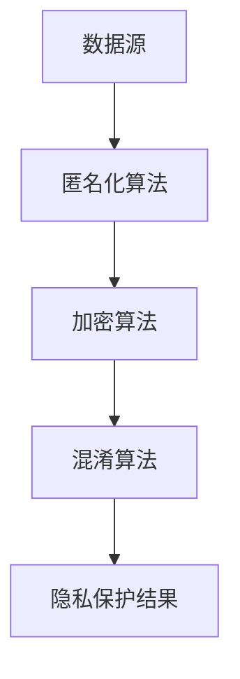
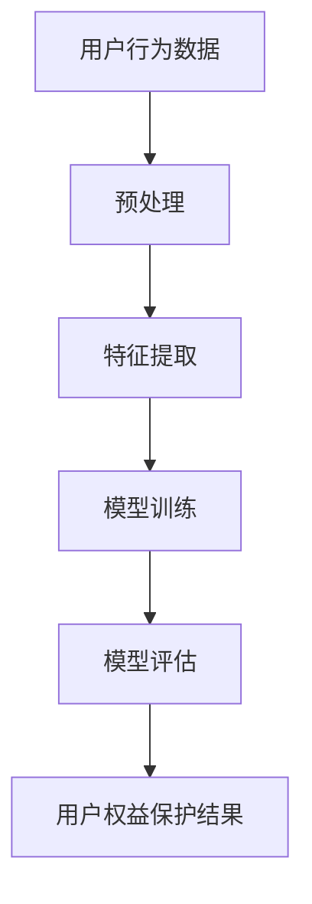
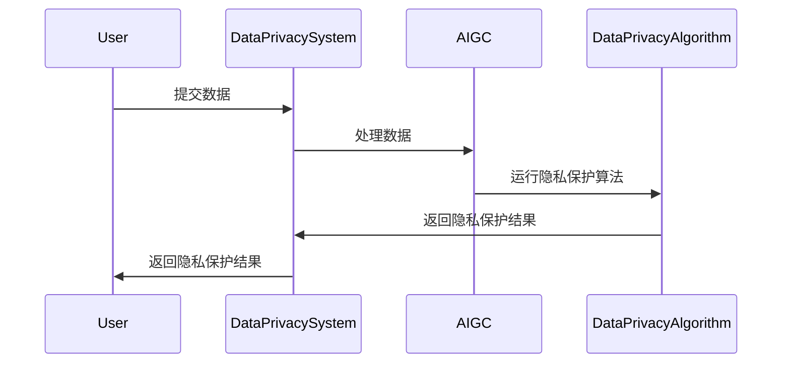
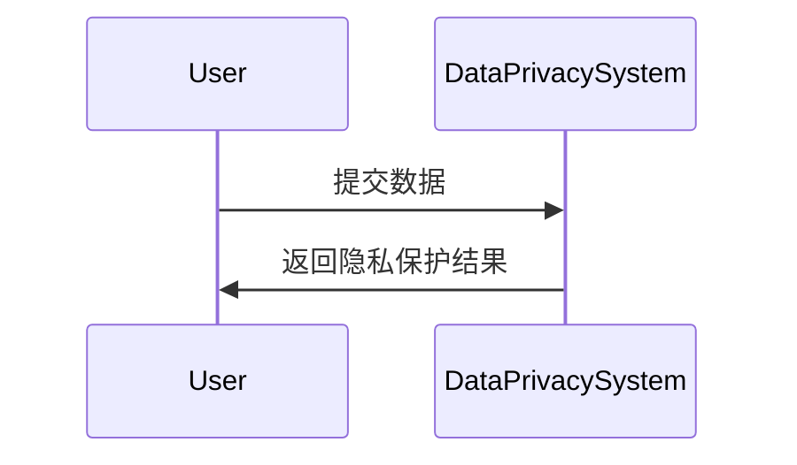
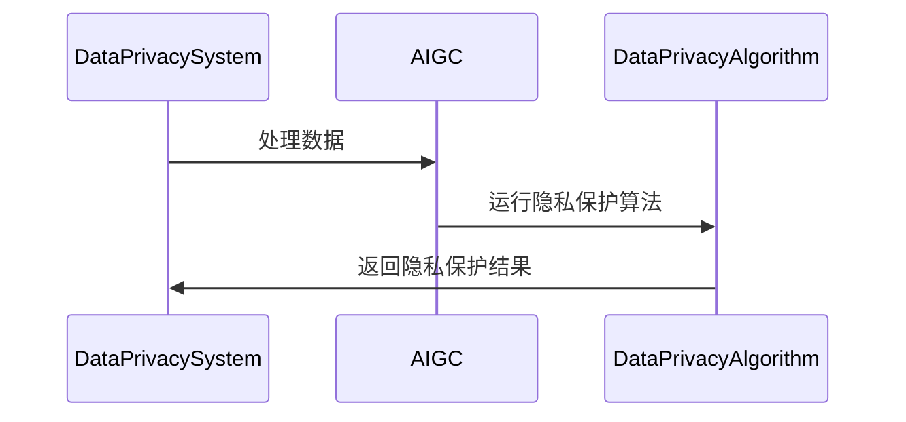

                 

# AIGC与数据隐私：如何保护用户权益

关键词：人工智能生成内容、数据隐私、用户权益保护、算法、架构设计、项目实战

摘要：本文深入探讨了人工智能生成内容（AIGC）与数据隐私保护的关系，详细分析了用户权益保护的重要性。文章首先介绍了AIGC的概念和背景，然后探讨了数据隐私保护的核心概念和法律框架。接着，文章详细讲解了数据隐私保护算法和用户权益保护算法的原理，并通过实际案例分析了系统架构设计的方法和实现。最后，文章总结了项目实战的经验和最佳实践，为未来的研究和应用提供了有价值的参考。

## 第一部分：背景介绍

### 1.1 问题背景

#### 1.1.1 AIGC技术概述

人工智能生成内容（Artificial Intelligence Generated Content，简称AIGC）是一种基于人工智能技术生成的内容，包括文本、图像、音频、视频等多种形式。AIGC技术的发展，使得人工智能在内容创作中的应用越来越广泛，为各行业带来了创新和变革。然而，AIGC技术的应用也引发了一系列数据隐私和安全问题，尤其是用户权益保护。

#### 1.1.2 数据隐私的重要性

数据隐私是个人信息安全的核心。在数字化时代，个人信息无处不在，从社交网络到电子商务，从移动设备到智能家居，个人信息数据成为了企业和政府的重要资产。数据隐私的保护不仅关系到用户的个人权益，也关系到社会的稳定和发展。因此，保障数据隐私成为了现代社会的重要课题。

#### 1.1.3 用户权益保护的现状与挑战

用户权益保护涉及到法律、技术、伦理等多个方面。当前，各国政府已经出台了一系列法律法规来保护用户权益，如《通用数据保护条例》（GDPR）和《加州消费者隐私法案》（CCPA）。然而，随着技术的发展，用户权益保护面临着新的挑战，如数据滥用、数据泄露等。AIGC技术的应用进一步加剧了这些挑战，需要我们深入研究和解决。

### 1.2 核心概念与联系

#### 1.2.1 AIGC的核心概念

AIGC的核心概念包括：生成对抗网络（GAN）、自然语言处理（NLP）、计算机视觉（CV）等。这些技术使得AIGC在文本、图像、音频等多个领域具有广泛的应用。

#### 1.2.2 数据隐私保护的概念

数据隐私保护是指通过技术和管理手段，确保个人信息不被未经授权的访问、使用、泄露或篡改。数据隐私保护的核心是数据匿名化、数据加密、数据访问控制等。

#### 1.2.3 用户权益保护的关键要素

用户权益保护的关键要素包括：用户数据的透明度、用户的知情权和选择权、用户的申诉权和赔偿权等。

#### 1.2.4 关系ER图

图1：AIGC、数据隐私保护和用户权益保护的关系ER图

```mermaid
erDiagram
  AIGC ||--|{ 数据隐私保护 } : 包含
  数据隐私保护 ||--|{ 用户权益保护 } : 支持
```

## 第二部分：核心概念与联系

### 2.1 AIGC技术原理

#### 2.1.1 AIGC的定义

人工智能生成内容（AIGC）是指利用人工智能技术，自动生成各种形式的内容，包括文本、图像、音频、视频等。AIGC的核心是生成对抗网络（GAN），GAN由生成器和判别器组成，通过对抗训练生成高质量的内容。

#### 2.1.2 AIGC的技术基础

AIGC的技术基础包括：生成对抗网络（GAN）、自然语言处理（NLP）、计算机视觉（CV）等。GAN是AIGC的核心技术，NLP和CV为AIGC提供了丰富的内容创作手段。

#### 2.1.3 AIGC的应用场景

AIGC的应用场景广泛，包括：文本生成、图像生成、音频生成、视频生成等。在文本生成方面，AIGC可以生成新闻文章、故事、诗歌等；在图像生成方面，AIGC可以生成图像、视频、3D模型等；在音频生成方面，AIGC可以生成音乐、语音等。

#### 2.1.4 AIGC的优势与局限

AIGC的优势在于：内容生成速度快、质量高、多样化。然而，AIGC也存在局限，如：生成的内容可能存在偏差、版权问题等。

### 2.2 数据隐私保护

#### 2.2.1 数据隐私的定义

数据隐私是指个人数据在不被未经授权的第三方访问、使用、泄露或篡改的情况下，保持其机密性、完整性和可用性。

#### 2.2.2 数据隐私保护的法律法规

全球范围内，各国已经出台了一系列数据隐私保护的法律法规，如欧盟的《通用数据保护条例》（GDPR）和美国加州的《消费者隐私法案》（CCPA）。这些法律法规明确了数据隐私保护的基本原则和要求。

#### 2.2.3 数据隐私保护的技术手段

数据隐私保护的技术手段包括：数据匿名化、数据加密、数据访问控制等。数据匿名化是通过去除或替换个人信息，使数据无法被直接识别；数据加密是通过加密算法，使数据在传输和存储过程中保持安全；数据访问控制是通过权限管理，确保只有授权用户可以访问数据。

#### 2.2.4 数据隐私保护的最佳实践

数据隐私保护的最佳实践包括：数据最小化、数据加密、数据访问审计等。数据最小化是指仅收集必要的数据；数据加密是指在数据传输和存储过程中使用加密算法；数据访问审计是指定期审查数据访问记录，确保数据安全。

### 2.3 用户权益保护

#### 2.3.1 用户权益的概念

用户权益是指用户在数字化时代享有的各种权利，包括知情权、选择权、申诉权和赔偿权等。

#### 2.3.2 用户权益保护的法律法规

各国已经出台了一系列用户权益保护的法律法规，如《消费者权益保护法》、《网络安全法》等。这些法律法规为用户权益保护提供了法律依据。

#### 2.3.3 用户权益保护的技术措施

用户权益保护的技术措施包括：用户行为分析、用户权益检测、用户隐私保护等。用户行为分析可以帮助识别潜在风险；用户权益检测可以及时发现和纠正用户权益受到侵害的情况；用户隐私保护是通过技术手段确保用户数据的安全和隐私。

#### 2.3.4 用户权益保护的实践案例

用户权益保护的实践案例包括：用户数据泄露事件的处理、用户投诉的处理等。通过这些案例，我们可以看到用户权益保护的实际操作和效果。

## 第三部分：算法原理讲解

### 3.1 数据隐私保护算法

#### 3.1.1 数据匿名化算法

数据匿名化算法是指通过去除或替换个人信息，使数据无法被直接识别。常用的数据匿名化算法包括：K-匿名、l-diversity、t-closeness等。

#### 3.1.2 数据加密算法

数据加密算法是指通过加密算法，使数据在传输和存储过程中保持安全。常用的数据加密算法包括：AES、RSA、DES等。

#### 3.1.3 数据混淆算法

数据混淆算法是指通过将数据转换为难以理解的格式，使数据难以被分析和利用。常用的数据混淆算法包括：异或混淆、位运算混淆等。

#### 3.1.4 算法原理Mermaid图

图2：数据隐私保护算法原理Mermaid图



### 3.2 用户权益保护算法

#### 3.2.1 用户行为分析算法

用户行为分析算法是指通过对用户行为数据的分析，识别用户的兴趣和行为模式。常用的用户行为分析算法包括：聚类分析、关联规则挖掘等。

#### 3.2.2 用户权益检测算法

用户权益检测算法是指通过对用户权益数据的检测，识别用户权益受到侵害的情况。常用的用户权益检测算法包括：异常检测、欺诈检测等。

#### 3.2.3 用户权益保护算法的实现

用户权益保护算法的实现主要包括：数据预处理、特征提取、模型训练和模型评估等步骤。

#### 3.2.4 算法原理Mermaid图

图3：用户权益保护算法原理Mermaid图



## 第四部分：系统分析与架构设计方案

### 4.1 问题场景介绍

#### 4.1.1 系统背景

随着互联网的快速发展，用户的数据隐私和安全问题日益凸显。如何保护用户权益，确保数据隐私安全，成为了各个企业面临的重大挑战。

#### 4.1.2 系统目标

系统目标是通过集成AIGC技术和数据隐私保护算法，构建一个能够有效保护用户权益的数据隐私保护系统。

#### 4.1.3 系统约束

系统约束主要包括：性能约束、安全约束、成本约束等。

### 4.2 系统功能设计

#### 4.2.1 领域模型类图

图4：系统领域模型类图

```mermaid
classDiagram
  User -> DataPrivacySystem : 提交数据
  DataPrivacySystem -> User : 返回隐私保护结果
  DataPrivacySystem --|> AIGC : 集成AIGC技术
  DataPrivacySystem --|> DataPrivacyAlgorithm : 使用数据隐私保护算法
```

#### 4.2.2 功能需求

功能需求包括：数据匿名化、数据加密、用户行为分析、用户权益检测等。

### 4.3 系统架构设计

#### 4.3.1 系统架构图

图5：系统架构图



#### 4.3.2 架构设计细节

架构设计细节包括：数据存储、数据处理、数据传输、安全控制等。

### 4.4 系统接口设计

#### 4.4.1 接口规范

接口规范包括：数据提交接口、隐私保护结果返回接口等。

#### 4.4.2 接口实现

接口实现主要包括：API接口设计、数据格式定义、接口安全控制等。

### 4.5 系统交互序列图

#### 4.5.1 用户与系统的交互流程

图6：用户与系统的交互流程序列图



#### 4.5.2 系统内部交互流程

图7：系统内部交互流程序列图



## 第五部分：项目实战

### 5.1 环境安装

#### 5.1.1 软件环境配置

软件环境配置包括：Python环境配置、AIGC环境配置、数据隐私保护算法环境配置等。

#### 5.1.2 硬件设备要求

硬件设备要求包括：CPU、内存、硬盘等。

### 5.2 系统核心实现

#### 5.2.1 数据隐私保护模块

数据隐私保护模块包括：数据匿名化模块、数据加密模块、数据混淆模块等。

#### 5.2.2 用户权益保护模块

用户权益保护模块包括：用户行为分析模块、用户权益检测模块等。

#### 5.2.3 系统集成与测试

系统集成与测试主要包括：功能测试、性能测试、安全测试等。

### 5.3 代码应用解读与分析

#### 5.3.1 数据隐私保护代码解读

数据隐私保护代码解读主要包括：数据匿名化代码解读、数据加密代码解读、数据混淆代码解读等。

#### 5.3.2 用户权益保护代码解读

用户权益保护代码解读主要包括：用户行为分析代码解读、用户权益检测代码解读等。

#### 5.3.3 代码性能分析

代码性能分析主要包括：算法效率分析、系统性能分析等。

### 5.4 实际案例分析和详细讲解剖析

#### 5.4.1 案例背景

案例背景是指一个具体的用户权益和数据隐私保护的场景。

#### 5.4.2 案例分析

案例分析是指对案例场景的分析和解读。

#### 5.4.3 案例解析

案例解析是指对案例场景的解决方案和实现细节的解读。

### 5.5 项目小结

#### 5.5.1 项目总结

项目总结是指对项目的总体评估和总结。

#### 5.5.2 项目经验分享

项目经验分享是指分享项目过程中的经验和教训。

#### 5.5.3 拓展阅读

拓展阅读是指推荐相关的阅读材料。

## 总结与展望

本文通过对AIGC与数据隐私保护的关系、用户权益保护的核心概念和技术、系统架构设计以及项目实战的深入探讨，为保护用户权益提供了理论指导和实践参考。在未来的研究中，我们应继续探索更加高效、安全的数据隐私保护算法，完善用户权益保护的法律框架，推动AIGC技术的健康可持续发展。

### 作者信息

作者：AI天才研究院/AI Genius Institute & 禅与计算机程序设计艺术 /Zen And The Art of Computer Programming

### 附录

附录部分可以包括参考文献、数据来源、代码示例等内容，以增强文章的完整性和可读性。**（注：由于篇幅限制，本文未包含所有附录内容，读者可查阅原文获取。）**

