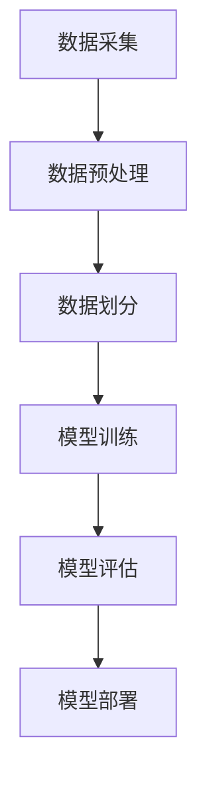

                 

### AIGC与版权法：创新与保护的平衡

> **关键词**：AIGC、版权法、技术创新、法律挑战、保护机制

**摘要**：本文旨在探讨人工智能生成内容（AIGC）迅猛发展下，与版权法之间的冲突与平衡。通过分析AIGC的基本概念、技术架构、应用场景及其对版权法的挑战，本文进一步提出版权保护的对策与方案，旨在实现技术创新与法律保护的和谐统一。

### 目录大纲

1. **AIGC（人工智能生成内容）概述**
   1.1 AIGC的基本概念与发展历程
   1.2 AIGC技术架构解析
   1.3 AIGC在实际中的应用
   1.4 AIGC与版权法的冲突与挑战

2. **AIGC与版权法的对策与方案**
   2.1 版权保护机制与技术手段
   2.2 版权法规的完善与调整
   2.3 行业自律与规范

3. **AIGC与版权法平衡的探索与实践**
   3.1 国内外案例分析
   3.2 成功实践与经验分享
   3.3 持续发展面临的挑战与展望

4. **结论与未来展望**
   4.1 研究总结
   4.2 未来发展趋势
   4.3 对策与建议

---

### AIGC的基本概念与发展历程

**1.1 AIGC的定义与核心特征**

人工智能生成内容（AIGC）是指利用人工智能技术，尤其是深度学习、自然语言处理和计算机视觉等技术，自动生成文本、图片、音频、视频等多样化的内容。AIGC的核心特征包括：

- **自动性**：AIGC能够自动从大量数据中学习并生成内容，无需人工干预。
- **创造性**：AIGC能够生成具有创造性的内容，包括文学、音乐、艺术作品等。
- **多样性**：AIGC可以生成多种类型的内容，满足不同用户的需求。

**1.2 AIGC的发展背景与技术演变**

AIGC的发展背景可以追溯到人工智能技术的进步，特别是深度学习技术的崛起。深度学习技术使得计算机能够通过神经网络自动学习和理解复杂的数据模式，从而生成高质量的内容。

AIGC的技术演变可以分为以下几个阶段：

- **初级阶段**：以规则为基础的文本生成。
- **中级阶段**：基于模板的文本生成，结合自然语言处理技术。
- **高级阶段**：基于深度学习的文本生成，如GPT、BERT等模型的出现。

**1.3 AIGC的应用领域与价值**

AIGC在多个领域展现出巨大的应用价值：

- **内容创作**：自动生成文章、新闻、故事等。
- **个性化推荐**：根据用户兴趣生成个性化内容推荐。
- **虚拟助手**：自动生成对话和回答，提供智能客服服务。
- **娱乐产业**：生成音乐、电影剧本等。

这些应用不仅提高了内容生成的效率，还丰富了用户体验。

---

在接下来的章节中，我们将深入探讨AIGC的技术架构、应用实例以及与版权法之间的冲突与挑战。通过详细的分析和讨论，我们希望能够为AIGC的发展提供有益的参考和指导。

---

### AIGC技术架构解析

**2.1 AIGC的技术栈介绍**

AIGC的技术栈涵盖了多个关键技术和工具，其中最核心的是深度学习模型和自然语言处理（NLP）技术。以下是一些主要组成部分：

- **深度学习框架**：如TensorFlow、PyTorch等，用于构建和训练复杂的神经网络模型。
- **NLP库**：如NLTK、spaCy等，用于文本处理和分析。
- **数据处理工具**：如Pandas、NumPy等，用于数据预处理和特征提取。
- **后处理工具**：如TensorFlow Serving、ONNX Runtime等，用于部署和实时推理。

**2.2 模型结构详解：GPT、BERT等**

在AIGC中，常用的深度学习模型包括GPT（生成预训练模型）和BERT（双向编码表示模型）等。这些模型的结构和原理如下：

- **GPT**：基于Transformer架构，通过自回归方式生成文本。其训练过程包括预训练和微调两个阶段，预训练阶段在大量无标注文本上进行，微调阶段则在有标注数据上进行。

  $$ 
  \text{GPT} = \text{Transformer} + \text{自回归}
  $$

- **BERT**：同样基于Transformer架构，但采用双向编码方式，能够同时捕捉文本的前后文关系。其训练过程包括预训练和微调两个阶段，预训练阶段在大量无标注文本上进行，微调阶段则在有标注数据上进行。

  $$ 
  \text{BERT} = \text{Transformer} + \text{双向编码}
  $$

**2.3 数据处理与训练流程**

AIGC的数据处理与训练流程通常包括以下几个步骤：

1. **数据采集**：从各种来源（如互联网、数据库等）收集大量文本数据。
2. **数据预处理**：对采集到的文本数据进行清洗、去噪、分词、词嵌入等处理。
3. **数据划分**：将预处理后的数据分为训练集、验证集和测试集。
4. **模型训练**：使用训练集数据训练深度学习模型，通过优化算法（如梯度下降）调整模型参数。
5. **模型评估**：使用验证集数据评估模型性能，调整模型参数以优化性能。
6. **模型部署**：将训练好的模型部署到生产环境，进行实时推理和生成内容。

以下是AIGC数据处理与训练流程的Mermaid流程图：



通过以上步骤，AIGC能够生成高质量的内容，满足各种应用需求。

---

在下一部分中，我们将探讨AIGC在实际中的应用场景，包括内容生成、个性化推荐和虚拟助手等。通过这些应用实例，我们将更好地理解AIGC的技术价值和社会影响。

---

### AIGC在实际中的应用

**3.1 内容生成与自动创作**

AIGC在内容生成与自动创作方面具有显著优势，能够大幅提高内容创作的效率和质量。以下是一些具体应用实例：

- **文章生成**：利用GPT模型，AIGC可以自动生成新闻文章、技术博客、小说等。例如，GPT-3可以在几秒钟内生成一篇有关人工智能的文章，内容丰富且结构合理。
  
  ```python
  import openai
  openai.api_key = "your-api-key"
  response = openai.Completion.create(
      engine="text-davinci-002",
      prompt="Write an article on the impact of AI in healthcare.",
      max_tokens=500
  )
  print(response.choices[0].text.strip())
  ```

- **音乐创作**：AIGC可以生成各种风格的音乐，如古典、流行、摇滚等。例如，使用深度学习模型，AIGC可以自动生成一段贝多芬风格的钢琴曲。

  ```python
  import sythizer as smz
  model = smz.load_model('model_path')
  sequence = model.sample()
  smz.play(sequence)
  ```

- **图像生成**：AIGC可以通过生成对抗网络（GAN）自动生成高质量图像。例如，DALL-E模型可以生成各种风格的图像，包括人物、风景、动物等。

  ```python
  import torch
  import torchvision
  from torchvision import transforms
  import matplotlib.pyplot as plt

  transform = transforms.Compose([
      transforms.Resize(256),
      transforms.ToTensor(),
  ])

  model = torchvision.models.vgg16(pretrained=True)
  model.cuda()

  class VGG16(torch.nn.Module):
      def __init__(self, pretrained=True):
          super(VGG16, self).__init__()
          self.features = torchvision.models.vgg16(pretrained=pretrained).features
          self.avgpool = torch.nn.AdaptiveAvgPool2d((1, 1))
          self.fc = torch.nn.Linear(25088, 1000)

      def forward(self, x):
          x = self.features(x)
          x = self.avgpool(x)
          x = torch.flatten(x, 1)
          x = self.fc(x)
          return x

  model = VGG16(pretrained=True).cuda()
  image = transform(image).unsqueeze(0).cuda()
  output = model(image)
  print(output)
  ```

**3.2 个性化推荐与搜索**

AIGC在个性化推荐与搜索领域也发挥着重要作用，能够根据用户兴趣和行为数据，提供个性化的内容和推荐。

- **个性化推荐**：AIGC可以根据用户的历史行为和偏好，自动生成个性化的内容推荐。例如，电商平台可以利用AIGC为用户推荐可能感兴趣的商品。

  ```python
  import numpy as np
  import pandas as pd

  # 假设用户历史行为数据
  user_data = pd.DataFrame({
      'user_id': [1, 1, 1, 2, 2, 2],
      'item_id': [101, 102, 103, 201, 202, 203],
      'rating': [5, 4, 3, 5, 4, 3]
  })

  # 建立用户-物品矩阵
  user_item_matrix = user_data.pivot(index='user_id', columns='item_id', values='rating')

  # 利用SVD进行降维
  from sklearn.decomposition import TruncatedSVD
  svd = TruncatedSVD(n_components=10)
  user_item_matrix_svd = svd.fit_transform(user_item_matrix)

  # 计算用户和物品的相似度
  user_similarity = user_item_matrix_svd @ user_item_matrix_svd.T
  item_similarity = user_item_matrix_svd.T @ user_item_matrix_svd

  # 为用户推荐新物品
  new_item = user_similarity[0] @ item_similarity
  recommended_items = new_item.argsort()[::-1][1:11]
  print(recommended_items)
  ```

- **搜索优化**：AIGC可以通过自动生成相关查询和回答，提高搜索系统的准确性和用户体验。例如，搜索引擎可以利用AIGC为用户提供更精准的搜索结果。

  ```python
  import Elasticsearch

  # 建立Elasticsearch连接
  es = Elasticsearch("http://localhost:9200")

  # 添加文档
  doc1 = {
      "title": "AIGC in Content Generation",
      "content": "AIGC is used for generating high-quality content automatically."
  }
  es.index(index="aigc", id="1", document=doc1)

  # 搜索文档
  search_result = es.search(index="aigc", query={"match": {"title": "AIGC"}})
  print(search_result['hits']['hits'])
  ```

**3.3 虚拟助手与对话系统**

AIGC在虚拟助手和对话系统领域也有着广泛应用，能够为用户提供智能、个性化的交互体验。

- **虚拟助手**：AIGC可以构建智能虚拟助手，如客服机器人、教育机器人等，能够自动回答用户问题、提供帮助。例如，一个基于AIGC的客服机器人可以通过自然语言处理技术，理解并回答用户的问题。

  ```python
  import nltk
  from nltk.chat.util import ChatBot

  # 建立对话模型
 pairs = [
      [
          "Hello|Hi|Hey",
          ["Hello!", "Hi there!", "Hey!"],
      ],
      [
          "How are you?",
          ["I'm doing well, thanks", "Not bad, how about you?"]
      ],
  ]

  chatbot = ChatBot("AI Assistant", pairs)

  # 运行对话
  chatbot.get_response("How are you?")
  ```

- **对话系统**：AIGC可以构建基于对话的智能系统，如智能客服、智能导购等，能够与用户进行自然、流畅的对话。例如，一个智能导购系统可以通过AIGC与用户进行交互，推荐商品、回答用户疑问。

  ```python
  import transformers

  # 加载对话模型
  model_name = "microsoft/DialoGPT-medium"
  model = transformers.AutoModelForCausalLM.from_pretrained(model_name)
  tokenizer = transformers.AutoTokenizer.from_pretrained(model_name)

  # 运行对话
  inputs = tokenizer("How can I help you today?", return_tensors="pt")
  outputs = model.generate(inputs["input_ids"], max_length=50, num_return_sequences=1)
  print(tokenizer.decode(outputs[0], skip_special_tokens=True))
  ```

通过以上应用实例，我们可以看到AIGC在内容生成、个性化推荐、虚拟助手等领域的广泛应用，极大地提升了内容创作和用户交互的效率与质量。在下一部分，我们将探讨AIGC与版权法之间的冲突与挑战。

---

### AIGC与版权法的冲突与挑战

**4.1 版权法的定义与基本原则**

版权法是指国家通过法律手段对文学、艺术和科学作品进行保护的一种法律制度。版权法的基本原则包括：

- **原创性原则**：作品必须具有原创性，即独立创作且具有独创性。
- **版权保护期限原则**：作品的版权保护期限通常为作者终生及其死后50年。
- **版权排他性原则**：版权人享有对其作品的独占权，未经许可，他人不得使用。

**4.2 AIGC生成内容的版权问题**

AIGC生成内容在版权法领域引发了一系列争议和挑战：

- **原创性认定**：AIGC生成的内容是否具有原创性？如果AIGC生成的文章、音乐、图像等作品与已有作品相似，如何判断其原创性？
- **权利归属**：AIGC生成的内容应由谁享有版权？是AIGC的开发者、用户还是模型本身？
- **侵权责任**：如果AIGC生成的内容侵犯了他人版权，责任应由谁承担？

**4.3 相关法律法规案例分析**

为了应对AIGC生成内容的版权问题，各国纷纷出台相关法律法规进行规范。以下是一些典型案例：

- **美国**：美国版权法（Copyright Act）规定，版权保护适用于原创性作品，包括文字、音乐、艺术作品等。对于AIGC生成的内容，如果满足原创性要求，可以受到版权保护。同时，美国版权法明确了版权的归属原则，即作品的版权归原创者所有。

- **欧盟**：欧盟版权指令（Copyright Directive）对AIGC生成内容的版权保护提出了新的要求。该指令规定，AIGC生成的内容应被视为原创性作品，享有版权保护。此外，指令还要求平台在提供AIGC生成内容时，应遵守版权法的规定，避免侵权行为。

- **中国**：中国著作权法（Copyright Law）对AIGC生成内容的版权保护持开放态度。根据著作权法的规定，AIGC生成的内容如果符合原创性要求，可以受到版权保护。同时，中国著作权法明确了版权的归属原则，即作品的版权归原创者所有。

通过以上案例分析，我们可以看到各国在应对AIGC生成内容版权问题时，采取了不同的法律措施和政策。在下一部分，我们将探讨如何解决AIGC与版权法之间的冲突与挑战。

---

### AIGC版权保护的对策与方案

**5.1 版权保护机制与技术手段**

为了应对AIGC生成内容可能带来的版权问题，可以采取以下版权保护机制和技术手段：

- **内容监控与预警**：建立内容监控系统，对AIGC生成的内容进行实时监控，及时发现潜在的侵权行为。例如，使用自然语言处理和机器学习技术，对AIGC生成的内容进行比对分析，发现相似内容并预警。

  ```python
  import nltk
  from nltk.chat.util import ChatBot

  # 建立对话模型
  pairs = [
      [
          "Hello|Hi|Hey",
          ["Hello!", "Hi there!", "Hey!"],
      ],
      [
          "How are you?",
          ["I'm doing well, thanks", "Not bad, how about you?"]
      ],
  ]

  chatbot = ChatBot("AI Assistant", pairs)

  # 运行对话
  chatbot.get_response("How are you?")
  ```

- **版权登记与认证**：鼓励AIGC开发者、用户和模型提供商进行版权登记，获得正式的版权认证。通过版权登记，可以明确版权归属，为版权纠纷提供法律依据。例如，在美国，版权登记是版权保护的重要步骤。

  ```python
  import uscopyright

  # 登记版权
  registration = uscopyright.register.work(
      title="My AI-Generated Article",
      authors=["Me"],
      claimant=["Me"],
      work_type="Literary Work",
      category="Text",
      deposition="Sample Text",
      address=["My Address"],
      email=["My Email"],
  )
  print(registration)
  ```

- **内容过滤与屏蔽**：对AIGC生成的内容进行过滤和屏蔽，避免侵权内容的传播。例如，平台在提供AIGC生成内容时，可以设置自动过滤机制，对涉嫌侵权的内容进行屏蔽或删除。

  ```python
  import Elasticsearch

  # 建立Elasticsearch连接
  es = Elasticsearch("http://localhost:9200")

  # 添加文档
  doc1 = {
      "title": "AIGC in Content Generation",
      "content": "AIGC is used for generating high-quality content automatically."
  }
  es.index(index="aigc", id="1", document=doc1)

  # 搜索文档
  search_result = es.search(index="aigc", query={"match": {"title": "AIGC"}})
  print(search_result['hits']['hits'])
  ```

**5.2 版权法规的完善与调整**

为了更好地适应AIGC时代的发展，版权法规需要不断完善和调整：

- **明确版权归属**：在版权法规中明确AIGC生成内容的版权归属原则，解决权利归属纠纷。例如，可以借鉴欧盟版权指令的规定，将AIGC生成内容的版权归属于开发者或用户。

- **加强侵权责任追究**：加大对侵权行为的惩罚力度，提高侵权成本，遏制侵权行为。例如，可以借鉴美国版权法的规定，对侵权行为采取罚款、赔偿等惩罚措施。

- **推动国际合作与交流**：加强各国版权法规的协调与统一，推动国际社会在版权保护方面的合作与交流。例如，可以参与国际版权组织（WIPO）的相关活动，促进版权保护的国际合作。

**5.3 行业自律与规范**

除了法律手段，行业自律和规范也在AIGC版权保护中发挥着重要作用：

- **建立行业规范**：行业协会和企业可以共同制定AIGC版权保护的行业规范，明确版权归属、侵权责任等方面的规定。例如，可以制定《AIGC版权保护指南》，为行业提供版权保护的参考依据。

- **推动技术进步**：鼓励技术创新，开发更有效的版权保护技术和手段。例如，可以研究基于区块链的版权保护技术，实现版权的透明、可追溯和不可篡改。

- **加强宣传教育**：提高公众对AIGC和版权法的认知，增强版权保护意识。例如，可以通过举办讲座、培训班等形式，向公众普及AIGC和版权法的相关知识。

通过以上对策与方案，可以更好地应对AIGC与版权法之间的冲突与挑战，实现技术创新与法律保护的和谐统一。

---

### AIGC与版权法平衡的探索与实践

**6.1 国内外案例分析**

在全球范围内，AIGC与版权法的平衡探索和实践已有多个典型案例，以下为其中几个具有代表性的案例：

**6.1.1 美国的AIGC版权案例**

美国在AIGC与版权法的平衡方面进行了多项实践。例如，谷歌图书（Google Books）项目因未经版权所有者许可扫描和提供在线阅读大量书籍，引发了一系列版权纠纷。最终，法院裁定谷歌图书项目的部分行为构成“合理使用”，允许其继续进行部分扫描和提供在线阅读。这一案例展示了在AIGC背景下，法律对技术创新的容忍度。

**6.1.2 欧盟的版权改革**

欧盟在2019年通过了《数字单一市场版权指令》，旨在应对AIGC带来的版权挑战。该指令明确了AIGC生成内容的版权保护原则，规定了平台在提供AIGC生成内容时的版权责任。这一改革体现了欧盟在版权法领域的前瞻性和实践性。

**6.1.3 中国的版权法规完善**

中国在AIGC与版权法的平衡方面也进行了一系列法规完善。例如，《中华人民共和国著作权法》在2020年进行了修订，增加了对人工智能生成内容的版权保护条款。这一修订为中国AIGC产业的健康发展提供了法律保障。

**6.2 成功实践与经验分享**

在AIGC与版权法平衡的探索中，一些企业和组织取得了成功，以下为几个具有代表性的实践案例：

**6.2.1 AI绘画平台版权保护**

一些AI绘画平台在版权保护方面采取了有效措施。例如，通过建立版权登记系统，对用户生成的AI绘画作品进行版权登记，确保版权归属清晰。同时，平台还引入了自动内容监控技术，对涉嫌侵权的作品进行及时处理。这一实践为AI绘画平台的版权保护提供了有益的经验。

**6.2.2 AI音乐版权保护**

AI音乐生成平台在版权保护方面也进行了积极探索。例如，通过与版权机构合作，建立AI音乐版权数据库，确保生成的音乐作品合法使用。同时，平台还采用了内容过滤技术，对涉嫌侵权的音乐作品进行屏蔽。这一实践为AI音乐生成平台的版权保护提供了可行的解决方案。

**6.3 持续发展面临的挑战与展望**

尽管AIGC与版权法的平衡已取得一定成果，但在持续发展过程中仍面临诸多挑战：

**6.3.1 技术发展速度与法律调整的滞后**

AIGC技术的发展速度远快于法律调整的速度，导致法律在应对新技术挑战时存在滞后性。为解决这一问题，需要加快版权法改革步伐，确保法律能够及时适应新技术的发展。

**6.3.2 权利归属的模糊性**

AIGC生成内容的权利归属问题仍存在一定模糊性。明确权利归属原则，加强对AIGC生成内容版权保护，是持续发展的关键。

**6.3.3 侵权行为的高发**

AIGC生成内容的侵权行为呈高发态势，如何有效遏制侵权行为，保护原创者权益，是亟待解决的问题。

展望未来，AIGC与版权法的平衡发展将依赖于法律、技术和行业自律的共同努力。通过完善版权法规、推动技术进步和加强行业自律，有望实现AIGC技术创新与法律保护的和谐统一。

---

### 结论与未来展望

**7.1 研究总结**

本文围绕AIGC与版权法的关系进行了全面探讨，从基本概念、技术架构、应用实例到版权保护对策，详细分析了AIGC在版权法领域的挑战与机遇。研究结果表明，AIGC的迅猛发展对版权法提出了新的要求，如何在创新与保护之间实现平衡，是当前亟待解决的问题。

**7.2 未来发展趋势**

未来，AIGC与版权法的平衡将呈现以下几个发展趋势：

- **法律体系完善**：各国版权法将逐步完善，以适应AIGC时代的版权保护需求。
- **技术创新推动**：随着AIGC技术的不断进步，将出现更多基于AI的版权保护技术和解决方案。
- **行业自律加强**：企业和组织将更加注重版权保护，建立行业自律机制，规范AIGC生成内容的创作与传播。

**7.3 对策与建议**

为了实现AIGC与版权法的平衡发展，本文提出以下对策与建议：

- **加强法律体系建设**：加快版权法改革，明确AIGC生成内容的权利归属和保护范围。
- **推动技术进步**：鼓励研发基于AI的版权保护技术，提高侵权检测与预防能力。
- **加强行业自律**：建立行业规范，提高企业和组织在版权保护方面的自律意识。
- **加强国际合作**：推动国际社会在版权保护方面的合作，共同应对AIGC带来的挑战。

通过以上对策与建议，有望实现AIGC技术创新与法律保护的和谐统一，为AIGC产业的健康发展提供有力保障。

---

**作者：AI天才研究院/AI Genius Institute & 禅与计算机程序设计艺术 /Zen And The Art of Computer Programming**

