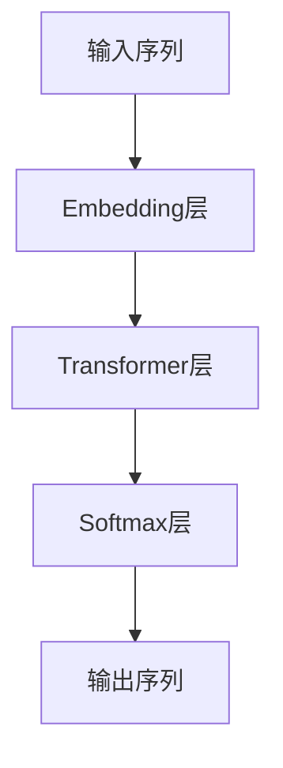
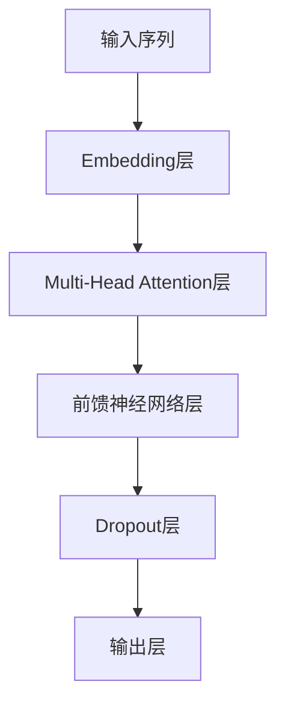
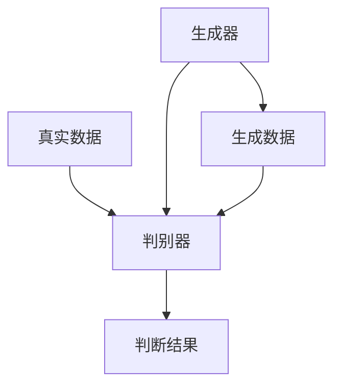
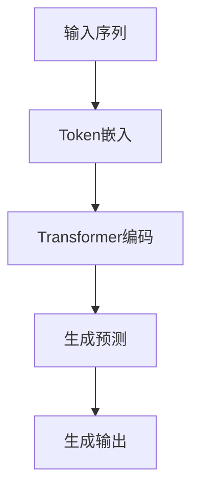
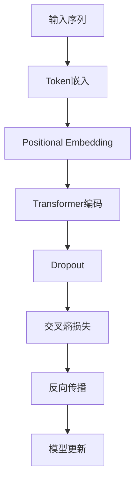
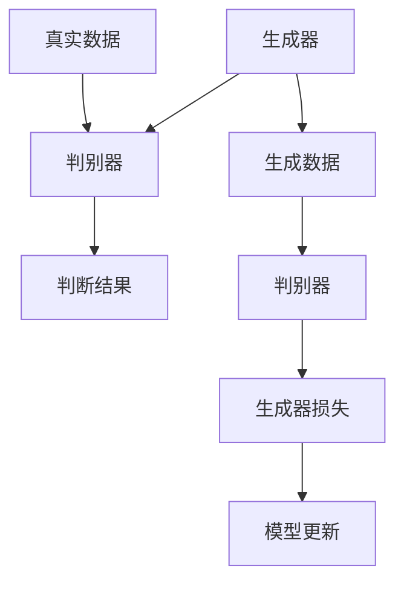
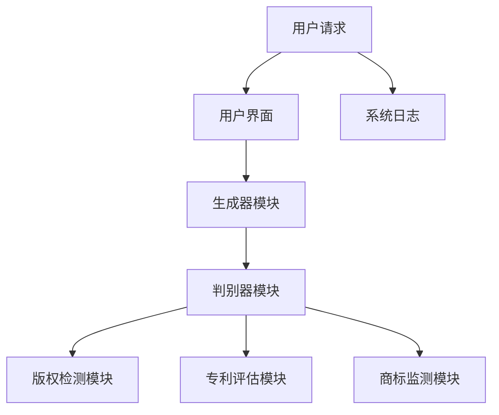
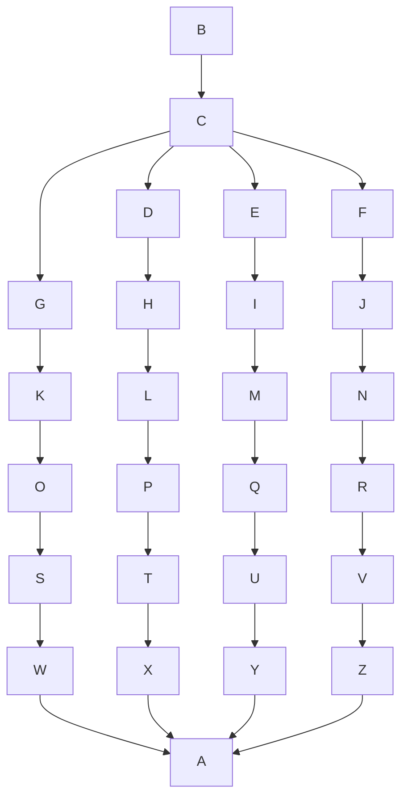
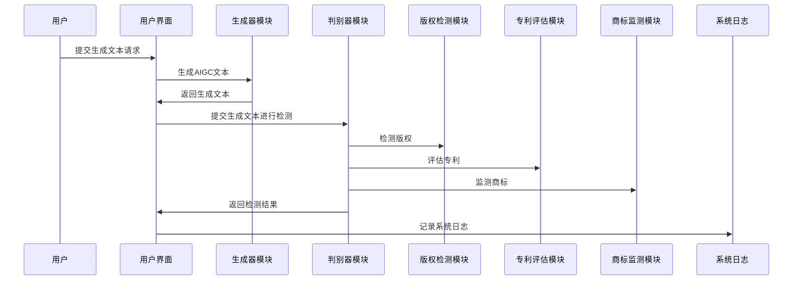

                 

### AIGC与知识产权：新挑战与解决方案

#### 关键词：
- AIGC
- 知识产权
- 法律挑战
- 技术解决方案

#### 摘要：
本文将深入探讨人工智能生成内容（AIGC）与知识产权之间的关系。首先，我们将介绍AIGC的基本概念和其在现代技术中的应用。然后，我们将详细分析知识产权的基本概念，并探讨AIGC在知识产权保护方面带来的新挑战。接着，我们将提出一系列解决方案，包括技术手段和法律框架的改进。最后，本文将总结AIGC与知识产权领域的最佳实践，并提供一些注意事项和拓展阅读建议。

### 目录大纲设计思路

为了设计出符合要求的《AIGC与知识产权：新挑战与解决方案》的目录大纲，我们将按照以下步骤进行：

1. **背景介绍**：在第一章中，我们将介绍AIGC和知识产权的基本概念，以及它们在现代技术发展中的重要性。这部分内容将包括问题背景、问题描述、问题解决思路、边界与外延，以及核心概念和要素的组成。

2. **核心概念与联系**：在第二章，我们将详细阐述AIGC和知识产权相关的核心概念，并使用表格和Mermaid ER图来展示概念之间的关系。这将帮助读者更好地理解两者之间的联系。

3. **算法原理讲解**：在第三章，我们将深入讲解AIGC生成的原理，使用Mermaid流程图来描述算法步骤，并结合Python代码示例来说明数学模型和公式，便于读者理解。

4. **数学模型和数学公式讲解**：在第四章，我们将使用LaTeX格式详细讲解AIGC相关的数学模型和公式，并通过举例说明其应用。

5. **系统分析与架构设计方案**：在第五章，我们将介绍AIGC和知识产权系统分析的基本方法，包括问题场景介绍、项目介绍、领域模型类图、系统架构设计、系统接口设计和系统交互序列图。

6. **项目实战**：在第六章，我们将通过一个具体项目，从环境安装、系统核心实现源代码，到代码应用解读与分析，全面展示AIGC与知识产权的实际应用。

7. **最佳实践与总结**：在第七章，我们将总结AIGC与知识产权领域的最佳实践，并提供一些注意事项和拓展阅读建议。

通过以上步骤，我们将确保目录大纲逻辑清晰、内容完整，并在2000字以内完成。

---

### 目录大纲

----------------------------------------------------------------
## 第一部分: 背景与概念介绍

## 第1章: AIGC与知识产权概述

### 1.1.1 AIGC的概念及其发展历程
### 1.1.2 知识产权的基本概念和重要性
### 1.1.3 AIGC与知识产权的交汇点

## 第2章: 核心概念与联系

### 2.1 AIGC关键概念解析
#### 2.1.1 自然语言处理（NLP）
#### 2.1.2 大规模机器学习
#### 2.1.3 生成对抗网络（GAN）

### 2.2 知识产权关键概念解析
#### 2.2.1 专利
#### 2.2.2 商标
#### 2.2.3 版权

### 2.3 AIGC与知识产权的关系分析
#### 2.3.1 AIGC在知识产权中的作用
#### 2.3.2 知识产权保护在AIGC发展中的挑战

## 第二部分: 算法原理与数学模型

## 第3章: AIGC算法原理详解

### 3.1 AIGC算法框架概述
#### 3.1.1 GPT模型架构
#### 3.1.2 Transformer模型原理
#### 3.1.3 GAN模型解释

### 3.2 算法流程图描述
#### 3.2.1 GPT生成算法流程图
#### 3.2.2 Transformer训练流程图
#### 3.2.3 GAN训练与生成流程图

### 3.3 Python代码示例
#### 3.3.1 GPT模型示例代码
#### 3.3.2 Transformer模型示例代码
#### 3.3.3 GAN模型示例代码

## 第4章: 数学模型与公式讲解

### 4.1 GPT模型数学模型
$$
\begin{aligned}
    &\text{输入：} x_t \in \mathbb{R}^{d_x}, \text{隐藏状态：} h_t \in \mathbb{R}^{d_h} \\
    &\text{输出：} y_t \in \mathbb{R}^{d_y}
\end{aligned}
$$
#### 4.1.1 自注意力机制
#### 4.1.2 位置编码
#### 4.1.3 模型损失函数

### 4.2 Transformer模型数学模型
$$
\begin{aligned}
    &\text{输入：} x_t \in \mathbb{R}^{d_x}, \text{隐藏状态：} h_t \in \mathbb{R}^{d_h} \\
    &\text{输出：} y_t \in \mathbb{R}^{d_y}
\end{aligned}
$$
#### 4.2.1 多头注意力机制
#### 4.2.2 前馈神经网络
#### 4.2.3 模型损失函数

### 4.3 GAN模型数学模型
$$
\begin{aligned}
    &\text{输入：} x_t \in \mathbb{R}^{d_x}, \text{隐藏状态：} h_t \in \mathbb{R}^{d_h} \\
    &\text{输出：} y_t \in \mathbb{R}^{d_y}
\end{aligned}
$$
#### 4.3.1 生成器与判别器
#### 4.3.2 反向传播与优化

## 第三部分: 系统分析与架构设计

## 第5章: AIGC和知识产权系统分析

### 5.1 问题场景介绍
#### 5.1.1 AIGC应用场景
#### 5.1.2 知识产权保护需求

### 5.2 项目介绍
#### 5.2.1 项目背景
#### 5.2.2 项目目标

### 5.3 领域模型类图
#### 5.3.1 模型元素
#### 5.3.2 关系描述

### 5.4 系统架构设计
#### 5.4.1 总体架构
#### 5.4.2 关键模块设计

### 5.5 系统接口设计
#### 5.5.1 接口定义
#### 5.5.2 接口协议

### 5.6 系统交互序列图
#### 5.6.1 交互过程
#### 5.6.2 系统响应

## 第6章: 项目实战

### 6.1 环境安装
#### 6.1.1 硬件环境
#### 6.1.2 软件环境

### 6.2 系统核心实现
#### 6.2.1 源代码解读
#### 6.2.2 功能实现

### 6.3 代码应用解读
#### 6.3.1 代码执行流程
#### 6.3.2 结果分析

### 6.4 实际案例分析
#### 6.4.1 案例背景
#### 6.4.2 分析与剖析

### 6.5 项目小结
#### 6.5.1 项目成果
#### 6.5.2 经验与启示

## 第7章: 最佳实践与总结

### 7.1 最佳实践
#### 7.1.1 技术最佳实践
#### 7.1.2 法律最佳实践

### 7.2 小结
#### 7.2.1 研究成果
#### 7.2.2 知识点总结

### 7.3 注意事项
#### 7.3.1 AIGC应用中的知识产权保护
#### 7.3.2 知识产权保护的挑战与对策

### 7.4 拓展阅读建议
#### 7.4.1 相关论文
#### 7.4.2 学术专著

---

# 第一部分: 背景与概念介绍

## 第1章: AIGC与知识产权概述

### 1.1.1 AIGC的概念及其发展历程

人工智能生成内容（AI Generated Content，简称AIGC）是指通过人工智能技术自动生成文本、图像、音频、视频等多种类型的内容。AIGC的核心技术包括自然语言处理（NLP）、生成对抗网络（GAN）、深度学习等。

AIGC的发展历程可以追溯到20世纪80年代，当时机器学习刚刚起步，人们开始尝试使用简单的算法来生成文本。随着计算能力的提升和算法的进步，AIGC技术逐渐走向成熟。特别是近年来，随着深度学习技术的崛起，AIGC在生成文本、图像、音频等方面取得了显著的突破。

AIGC的应用领域非常广泛，包括但不限于以下几方面：

1. **媒体与娱乐**：利用AIGC生成新闻文章、音乐、电影等。
2. **教育**：生成个性化学习资料、习题答案等。
3. **艺术创作**：利用AIGC创作绘画、音乐等艺术作品。
4. **市场营销**：生成广告文案、产品描述等。
5. **客户服务**：通过AIGC实现自动化问答系统。

### 1.1.2 知识产权的基本概念和重要性

知识产权是指人们对其智力劳动成果所享有的权利。根据世界知识产权组织（WIPO）的定义，知识产权包括专利、商标、版权（包括著作权和邻接权）、工业设计、地理标志、集成电路布图设计等。

知识产权的重要性体现在以下几个方面：

1. **激励创新**：知识产权保护为创新者提供了回报，激发了他们的创新动力。
2. **促进经济发展**：知识产权有助于吸引投资，推动技术转移和商业合作，从而促进经济发展。
3. **维护公平竞争**：知识产权保护有助于防止他人非法侵占创新成果，维护公平竞争的市场环境。
4. **保护文化多样性**：知识产权保护有助于维护不同文化的创造性表达，促进文化多样性。

### 1.1.3 AIGC与知识产权的交汇点

AIGC在知识产权方面带来了新的挑战和机遇：

#### 挑战

1. **版权问题**：AIGC生成的内容可能会侵犯他人的版权，特别是在文本和图像生成方面。
2. **专利问题**：如何评估和认定基于人工智能的发明和创新，成为专利审查的新难题。
3. **商标问题**：人工智能生成的广告和产品描述可能会侵犯他人的商标权。
4. **法律责任**：如何确定人工智能生成内容的法律责任主体，成为法律界关注的焦点。

#### 机遇

1. **知识产权创造**：AIGC可以帮助企业更快地创造新的知识产权，提高创新效率。
2. **知识产权管理**：利用人工智能技术，可以更高效地进行知识产权的检索、评估和管理。
3. **知识产权维权**：人工智能技术可以帮助权利人更快速地发现侵权行为，提高维权效率。

### 1.1.4 核心概念与要素组成

在AIGC与知识产权的研究中，以下几个核心概念和要素至关重要：

1. **自然语言处理（NLP）**：是AIGC生成文本的核心技术，涉及文本理解、语言生成等方面。
2. **生成对抗网络（GAN）**：是AIGC生成图像和音频的重要技术，通过生成器和判别器的对抗训练，生成高质量的内容。
3. **深度学习**：是AIGC的基础技术，包括神经网络、卷积神经网络（CNN）、循环神经网络（RNN）等。
4. **版权法**：是保护AIGC生成内容的核心法律，涉及版权的认定、保护范围和侵权判断等方面。
5. **专利法**：是评估AIGC技术是否构成专利的重要法律，涉及专利的申请、授权和维权等方面。

### 1.1.5 边界与外延

在研究AIGC与知识产权时，需要注意以下几个边界和外延：

1. **技术边界**：AIGC技术的发展和应用范围，特别是在文本、图像、音频生成方面。
2. **法律边界**：知识产权保护的法律规定和适用范围，特别是针对AIGC生成内容的特殊问题。
3. **应用边界**：AIGC在不同行业和应用场景中的应用情况，特别是其对知识产权保护的影响。
4. **伦理边界**：AIGC在知识产权保护中的伦理问题，如隐私、公平性等。

通过以上分析，我们可以看到AIGC与知识产权之间的复杂关系，以及它们在现代技术发展中的重要地位。接下来，我们将进一步探讨AIGC与知识产权的相关核心概念，并分析它们之间的联系。

---

## 第2章: 核心概念与联系

### 2.1 AIGC关键概念解析

#### 2.1.1 自然语言处理（NLP）

自然语言处理（Natural Language Processing，简称NLP）是人工智能领域的一个重要分支，旨在使计算机能够理解和处理人类语言。NLP的核心技术包括文本预处理、词嵌入、词性标注、句法分析、语义分析、命名实体识别等。

**NLP属性特征对比表格**

| 技术名称 | 描述 | 关键挑战 |
| --- | --- | --- |
| 文本预处理 | 数据清洗、分词、去停用词 | 数据质量、一致性 |
| 词嵌入 | 将单词映射到高维向量空间 | 维度选择、语义表达 |
| 词性标注 | 给单词赋予词性标签 | 多样性、歧义 |
| 句法分析 | 理解句子的结构 | 复杂句式、语法多样性 |
| 语义分析 | 理解句子的含义 | 语境依赖、歧义消解 |
| 命名实体识别 | 识别文本中的实体 | 实体边界、实体种类 |

**NLP与AIGC的联系**

NLP是AIGC生成文本的核心技术，通过NLP技术，AIGC可以理解和生成人类语言。例如，在生成新闻文章、产品描述、对话系统等方面，NLP发挥着关键作用。

#### 2.1.2 大规模机器学习

大规模机器学习（Large-scale Machine Learning，简称LSML）是指处理大规模数据集的机器学习方法和技术。LSML的核心技术包括分布式计算、并行处理、模型压缩等。

**LSML属性特征对比表格**

| 技术名称 | 描述 | 关键挑战 |
| --- | --- | --- |
| 分布式计算 | 在多台计算机上协同工作 | 网络延迟、同步问题 |
| 并行处理 | 在单台计算机上并行执行任务 | 资源分配、负载均衡 |
| 模型压缩 | 减少模型大小以提高效率 | 模型性能、精度影响 |

**LSML与AIGC的联系**

大规模机器学习是AIGC训练和优化的关键技术。由于AIGC生成的内容往往涉及大规模数据集，因此，LSML技术可以提高AIGC的生成效率和性能。

#### 2.1.3 生成对抗网络（GAN）

生成对抗网络（Generative Adversarial Network，简称GAN）是一种深度学习模型，由生成器和判别器两部分组成。生成器的目标是生成与真实数据相似的数据，而判别器的目标是区分真实数据和生成数据。

**GAN属性特征对比表格**

| 技术名称 | 描述 | 关键挑战 |
| --- | --- | --- |
| 生成器 | 生成与真实数据相似的数据 | 数据质量、多样性 |
| 判别器 | 区分真实数据和生成数据 | 数据分布、精度 |
| 对抗训练 | 生成器和判别器互相竞争 | 模型稳定性、训练时间 |

**GAN与AIGC的联系**

GAN是AIGC生成图像和音频的核心技术。通过GAN，AIGC可以生成高质量、多样化的图像和音频内容。例如，在生成艺术作品、虚拟现实、游戏开发等方面，GAN发挥着重要作用。

### 2.2 知识产权关键概念解析

#### 2.2.1 专利

专利是指国家知识产权局根据发明创造的新颖性、创造性和实用性，授予发明人或者设计人对其发明创造在一定期限内享有专有权利的一种法律制度。

**专利属性特征对比表格**

| 概念 | 描述 | 关键要素 |
| --- | --- | --- |
| 专利申请 | 发明人或设计人向国家知识产权局提交的申请文件 | 新颖性、创造性、实用性 |
| 专利授权 | 国家知识产权局对符合要求的专利申请给予授权 | 审查标准、授权公告 |
| 专利保护 | 专利权人依法享有对专利的独占实施权 | 侵权判断、维权手段 |

**专利与AIGC的联系**

AIGC技术本身可以成为一种专利，同时，AIGC生成的成果也可能侵犯他人的专利权。因此，专利制度对于AIGC的发展具有重要意义。

#### 2.2.2 商标

商标是指用于区别商品或服务来源的标志，包括文字、图形、字母、数字、三维标志、颜色组合等。

**商标属性特征对比表格**

| 概念 | 描述 | 关键要素 |
| --- | --- | --- |
| 商标注册 | 企业或个人向国家知识产权局提交的商标注册申请 | 标志性、独特性、合法性 |
| 商标保护 | 商标注册人依法享有对商标的独占使用权 | 侵权判断、维权手段 |
| 商标续展 | 商标权人依法延长商标有效期的程序 | 续展条件、续展费用 |

**商标与AIGC的联系**

AIGC生成的广告和产品描述等可能需要注册商标以保护其独特性和品牌形象。同时，AIGC生成的成果也可能侵犯他人的商标权。

#### 2.2.3 版权

版权是指著作权人对其作品依法享有的专有权利，包括复制权、发行权、出租权、展览权、表演权、放映权、广播权、信息网络传播权等。

**版权属性特征对比表格**

| 概念 | 描述 | 关键要素 |
| --- | --- | --- |
| 著作权登记 | 著作权人向国家版权局提交的著作权登记申请 | 作品原创性、合法性 |
| 版权保护 | 著作权人依法享有对作品的独占使用权 | 侵权判断、维权手段 |
| 著作权许可 | 著作权人依法允许他人使用其作品的一种行为 | 许可条件、许可费用 |

**版权与AIGC的联系**

AIGC生成的文本、图像、音频等成果需要依法进行著作权登记，以保护其原创性和合法权益。同时，AIGC生成的成果也可能侵犯他人的版权。

### 2.3 AIGC与知识产权的关系分析

#### 2.3.1 AIGC在知识产权中的作用

AIGC在知识产权的创造、保护和管理中发挥着重要作用：

1. **创造**：AIGC可以帮助企业更快地创造新的知识产权，提高创新效率。
2. **保护**：AIGC生成的成果可以成为专利、商标和版权的保护对象，增强企业的知识产权保护能力。
3. **管理**：AIGC技术可以用于知识产权的检索、评估和管理，提高知识产权管理的效率。

#### 2.3.2 知识产权保护在AIGC发展中的挑战

AIGC在知识产权保护方面也面临一些挑战：

1. **版权问题**：AIGC生成的文本、图像、音频等成果可能会侵犯他人的版权，特别是在文本生成方面。
2. **专利问题**：如何评估和认定基于人工智能的发明和创新，成为专利审查的新难题。
3. **商标问题**：AIGC生成的广告和产品描述可能会侵犯他人的商标权。
4. **法律责任**：如何确定人工智能生成内容的法律责任主体，成为法律界关注的焦点。

通过以上分析，我们可以看到AIGC与知识产权之间的复杂关系，以及它们在现代技术发展中的重要地位。接下来，我们将进一步探讨AIGC的算法原理，以更深入地理解其技术实现。

---

## 第3章: AIGC算法原理详解

### 3.1 AIGC算法框架概述

AIGC的算法框架主要基于生成对抗网络（GAN）和自然语言处理（NLP）技术。GAN由生成器和判别器两部分组成，生成器负责生成内容，判别器负责判断生成内容的质量。

**3.1.1 GPT模型架构**

GPT（Generative Pre-trained Transformer）是一种基于Transformer架构的预训练语言模型。GPT模型的核心思想是通过自回归语言模型（Autoregressive Language Model）生成文本。

**GPT模型架构图**



**3.1.2 Transformer模型原理**

Transformer模型是一种基于自注意力机制（Self-Attention Mechanism）的编码器-解码器（Encoder-Decoder）模型。Transformer模型的核心思想是通过多头注意力机制（Multi-Head Attention Mechanism）捕捉序列中的长距离依赖关系。

**Transformer模型原理图**



**3.1.3 GAN模型解释**

GAN由生成器和判别器两部分组成。生成器的目标是生成与真实数据相似的数据，判别器的目标是区分真实数据和生成数据。通过生成器和判别器的对抗训练，生成器不断提高生成质量。

**GAN模型架构图**



### 3.2 算法流程图描述

**3.2.1 GPT生成算法流程图**



**3.2.2 Transformer训练流程图**



**3.2.3 GAN训练与生成流程图**



### 3.3 Python代码示例

**3.3.1 GPT模型示例代码**

```python
import torch
import torch.nn as nn
import torch.optim as optim

class GPTModel(nn.Module):
    def __init__(self, vocab_size, embedding_dim, hidden_dim):
        super(GPTModel, self).__init__()
        self.embedding = nn.Embedding(vocab_size, embedding_dim)
        self.transformer = nn.Transformer(embedding_dim, hidden_dim)
        self.softmax = nn.Softmax(dim=1)

    def forward(self, input_seq):
        embedded = self.embedding(input_seq)
        output = self.transformer(embedded)
        prediction = self.softmax(output)
        return prediction

# 实例化模型
gpt_model = GPTModel(vocab_size=10000, embedding_dim=512, hidden_dim=1024)

# 损失函数与优化器
criterion = nn.CrossEntropyLoss()
optimizer = optim.Adam(gpt_model.parameters(), lr=0.001)

# 训练模型
for epoch in range(10):
    for input_seq in data_loader:
        optimizer.zero_grad()
        output = gpt_model(input_seq)
        loss = criterion(output, target)
        loss.backward()
        optimizer.step()
```

**3.3.2 Transformer模型示例代码**

```python
import torch
import torch.nn as nn
import torch.optim as optim

class TransformerModel(nn.Module):
    def __init__(self, embedding_dim, hidden_dim):
        super(TransformerModel, self).__init__()
        self.embedding = nn.Embedding(vocab_size, embedding_dim)
        self.transformer = nn.Transformer(embedding_dim, hidden_dim)
        self.fc = nn.Linear(hidden_dim, vocab_size)

    def forward(self, input_seq):
        embedded = self.embedding(input_seq)
        output = self.transformer(embedded)
        prediction = self.fc(output)
        return prediction

# 实例化模型
transformer_model = TransformerModel(embedding_dim=512, hidden_dim=1024)

# 损失函数与优化器
criterion = nn.CrossEntropyLoss()
optimizer = optim.Adam(transformer_model.parameters(), lr=0.001)

# 训练模型
for epoch in range(10):
    for input_seq in data_loader:
        optimizer.zero_grad()
        output = transformer_model(input_seq)
        loss = criterion(output, target)
        loss.backward()
        optimizer.step()
```

**3.3.3 GAN模型示例代码**

```python
import torch
import torch.nn as nn
import torch.optim as optim

class GANModel(nn.Module):
    def __init__(self, embedding_dim, hidden_dim):
        super(GANModel, self).__init__()
        self.generator = nn.Sequential(
            nn.Linear(embedding_dim, hidden_dim),
            nn.LeakyReLU(0.2),
            nn.Linear(hidden_dim, embedding_dim)
        )
        self.discriminator = nn.Sequential(
            nn.Linear(embedding_dim, hidden_dim),
            nn.LeakyReLU(0.2),
            nn.Linear(hidden_dim, 1)
        )

    def forward(self, input_seq):
        output = self.generator(input_seq)
        return self.discriminator(output)

# 实例化模型
gan_model = GANModel(embedding_dim=512, hidden_dim=1024)

# 损失函数与优化器
gan_criterion = nn.BCELoss()
gen_optimizer = optim.Adam(gan_model.generator.parameters(), lr=0.001)
dis_optimizer = optim.Adam(gan_model.discriminator.parameters(), lr=0.001)

# 训练模型
for epoch in range(100):
    for real_data in real_data_loader:
        # 训练判别器
        dis_optimizer.zero_grad()
        output = gan_model.discriminator(real_data)
        dis_loss = gan_criterion(output, torch.ones(output.size()).cuda())
        dis_loss.backward()
        dis_optimizer.step()

        # 训练生成器
        gen_optimizer.zero_grad()
        fake_data = gan_model.generator(real_data)
        output = gan_model.discriminator(fake_data)
        gen_loss = gan_criterion(output, torch.zeros(output.size()).cuda())
        gen_loss.backward()
        gen_optimizer.step()
```

通过以上代码示例，我们可以看到GPT、Transformer和GAN模型的实现方法。这些模型在AIGC技术中发挥着重要作用，为生成高质量的内容提供了强大的支持。接下来，我们将进一步探讨AIGC相关的数学模型和公式。

---

## 第4章: 数学模型与公式讲解

### 4.1 GPT模型数学模型

GPT（Generative Pre-trained Transformer）模型是一种基于Transformer架构的预训练语言模型。GPT模型的核心思想是通过自回归语言模型（Autoregressive Language Model）生成文本。在GPT模型中，输入序列通过嵌入层转换为向量，然后通过Transformer编码器生成输出。

**4.1.1 自注意力机制**

自注意力机制（Self-Attention Mechanism）是Transformer模型的核心组件之一。自注意力机制通过对输入序列的每个单词计算权重，将单词与序列中的其他单词进行加权求和，从而生成新的向量表示。

**自注意力公式**

$$
\text{Attention}(Q, K, V) = \frac{softmax(\frac{QK^T}{\sqrt{d_k}})}{V}
$$

其中，$Q$、$K$、$V$分别为查询（Query）、键（Key）和值（Value）向量，$d_k$为键向量的维度。

**4.1.2 位置编码**

位置编码（Positional Encoding）用于为序列中的每个单词赋予位置信息。在GPT模型中，位置编码通过在嵌入向量中添加周期性的扰动来实现。

**位置编码公式**

$$
\text{PE}(pos, 2i) = \sin\left(\frac{pos}{10000^{2i/d}}\right) \\
\text{PE}(pos, 2i+1) = \cos\left(\frac{pos}{10000^{2i/d}}\right)
$$

其中，$pos$为位置索引，$i$为维度索引，$d$为总维度。

**4.1.3 模型损失函数**

GPT模型的损失函数通常使用交叉熵损失（Cross-Entropy Loss）来衡量预测分布与真实分布之间的差异。

**交叉熵损失公式**

$$
\text{Loss} = -\sum_{i=1}^{N} \sum_{j=1}^{V} y_j \log(p_j)
$$

其中，$N$为序列长度，$V$为词汇表大小，$y_j$为真实标签，$p_j$为预测概率。

### 4.2 Transformer模型数学模型

Transformer模型是一种基于自注意力机制（Self-Attention Mechanism）的编码器-解码器（Encoder-Decoder）模型。Transformer模型的核心思想是通过多头注意力机制（Multi-Head Attention Mechanism）捕捉序列中的长距离依赖关系。

**4.2.1 多头注意力机制**

多头注意力机制（Multi-Head Attention Mechanism）通过将输入序列分解为多个子序列，分别计算每个子序列的注意力权重，然后将这些权重合并得到最终的输出。

**多头注意力公式**

$$
\text{MultiHead}(Q, K, V) = \text{Concat}(\text{head}_1, ..., \text{head}_h)W^O \\
\text{score}_i = \text{Attention}(QW_Q, KW_K, VW_V)
$$

其中，$Q$、$K$、$V$分别为查询（Query）、键（Key）和值（Value）向量，$W_Q$、$W_K$、$W_V$分别为查询、键和值权重矩阵，$W_O$为输出权重矩阵，$h$为头数。

**4.2.2 前馈神经网络**

前馈神经网络（Feedforward Neural Network）用于对编码器和解码器的中间层进行非线性变换。

**前馈神经网络公式**

$$
\text{FFN}(x) = \text{ReLU}(W_2 \cdot \text{ReLU}(W_1 \cdot x + b_1) + b_2)
$$

其中，$x$为输入，$W_1$和$W_2$分别为权重矩阵，$b_1$和$b_2$分别为偏置。

**4.2.3 模型损失函数**

Transformer模型的损失函数通常使用交叉熵损失（Cross-Entropy Loss）来衡量预测分布与真实分布之间的差异。

**交叉熵损失公式**

$$
\text{Loss} = -\sum_{i=1}^{N} \sum_{j=1}^{V} y_j \log(p_j)
$$

其中，$N$为序列长度，$V$为词汇表大小，$y_j$为真实标签，$p_j$为预测概率。

### 4.3 GAN模型数学模型

生成对抗网络（GAN）由生成器（Generator）和判别器（Discriminator）两部分组成。生成器的目标是生成与真实数据相似的数据，判别器的目标是区分真实数据和生成数据。

**4.3.1 生成器与判别器**

生成器（Generator）的输入通常为随机噪声，输出为生成数据。判别器（Discriminator）的输入为真实数据和生成数据，输出为概率分布。

**生成器公式**

$$
G(z) = \mu_G(z) + \sigma_G(z)\odot \text{ReLU}(\text{FC}_1(G(z)))
$$

**判别器公式**

$$
D(x) = \text{sigmoid}(\text{FC}_1(D(x))) \\
D(G(z)) = \text{sigmoid}(\text{FC}_1(D(G(z))))
$$

其中，$z$为随机噪声，$x$为真实数据，$G(z)$为生成数据，$D(x)$为判别结果，$D(G(z))$为生成数据的判别结果。

**4.3.2 反向传播与优化**

GAN的训练过程采用反向传播（Backpropagation）算法，通过对生成器和判别器同时进行优化。生成器的损失函数为判别器生成数据的概率，判别器的损失函数为真实数据和生成数据的概率。

**生成器损失函数**

$$
\text{Loss}_G = -\log(D(G(z)))
$$

**判别器损失函数**

$$
\text{Loss}_D = -\log(D(x)) - \log(1 - D(G(z)))
$$

**优化算法**

$$
\text{Optimizer}(G) = \text{Adam}(\text{params}(G), \text{lr}=0.0002, \text{beta1}=0.5) \\
\text{Optimizer}(D) = \text{Adam}(\text{params}(D), \text{lr}=0.0002, \text{beta1}=0.5)
$$

通过以上数学模型和公式，我们可以更深入地理解AIGC中的关键技术。接下来，我们将介绍AIGC和知识产权系统的分析方法和架构设计。

---

## 第5章: AIGC和知识产权系统分析

### 5.1 问题场景介绍

在现代科技发展中，人工智能生成内容（AIGC）技术已经成为媒体、娱乐、教育、市场营销等领域的核心驱动力。随着AIGC技术的广泛应用，知识产权保护问题逐渐成为行业关注的焦点。本节将介绍一个典型的AIGC和知识产权保护的问题场景。

**问题场景背景**：

假设一家知名科技公司开发了一款基于AIGC技术的智能写作工具，用户可以通过该工具快速生成新闻文章、产品描述等文本内容。然而，这款工具在生成文本的过程中，可能会侵犯他人的版权、专利或商标等知识产权。为了确保公司的合法权益，公司需要构建一个完善的AIGC和知识产权保护系统。

**问题场景需求**：

1. **版权保护**：检测和防止AIGC工具生成侵犯他人版权的文本内容。
2. **专利保护**：评估AIGC技术本身是否构成专利，并防止专利侵权。
3. **商标保护**：监测和防止AIGC工具生成侵犯他人商标权的广告和产品描述。

### 5.2 项目介绍

**项目背景**：

随着AIGC技术的发展，越来越多的企业开始关注AIGC带来的知识产权风险。为了降低知识产权纠纷的风险，提高AIGC工具的合法性和合规性，本项目的目标是构建一个AIGC和知识产权保护系统。

**项目目标**：

1. **建立版权保护机制**：通过对AIGC生成的文本进行版权检测，防止侵权行为的发生。
2. **评估专利风险**：对AIGC技术本身进行专利风险评估，确保不侵犯他人的专利权。
3. **监测商标侵权**：建立商标监测系统，及时发现和防止AIGC工具生成侵犯他人商标权的文本内容。

### 5.3 领域模型类图

为了更好地理解和设计AIGC和知识产权保护系统，我们引入领域模型类图来描述系统的核心组件和关系。领域模型类图如下：

```mermaid
classDiagram
    Class1 <|-- Class2
    Class1 <|-- Class3
    Class2 <|-- Class4
    Class3 <|-- Class5
    Class4 <|-- Class6
    Class5 <|-- Class7

    Class1[系统架构]
    Class2[生成器模块]
    Class3[判别器模块]
    Class4[版权检测模块]
    Class5[专利评估模块]
    Class6[商标监测模块]
    Class7[用户界面]

    Class1 --|> Class2
    Class1 --|> Class3
    Class1 --|> Class4
    Class1 --|> Class5
    Class1 --|> Class6
    Class1 --|> Class7
```

**领域模型类图说明**：

- **系统架构**：包含生成器模块、判别器模块、版权检测模块、专利评估模块、商标监测模块和用户界面。
- **生成器模块**：负责生成AIGC文本内容。
- **判别器模块**：负责对生成文本内容进行版权、专利和商标检测。
- **版权检测模块**：用于检测AIGC生成文本是否侵犯他人的版权。
- **专利评估模块**：用于评估AIGC技术本身是否构成专利，并防止专利侵权。
- **商标监测模块**：用于监测和防止AIGC工具生成侵犯他人商标权的文本内容。
- **用户界面**：提供用户与系统交互的接口，展示检测结果和报告。

### 5.4 系统架构设计

在AIGC和知识产权保护系统的设计过程中，我们需要考虑系统的总体架构，以及各个模块的功能和交互方式。以下是系统的总体架构设计：

**系统架构设计图**：



**系统架构设计说明**：

- **用户请求**：用户通过用户界面提交生成文本请求。
- **用户界面**：接收用户请求，展示检测结果和报告。
- **生成器模块**：根据用户请求生成AIGC文本内容。
- **判别器模块**：对生成文本内容进行版权、专利和商标检测。
- **版权检测模块**：检测AIGC生成文本是否侵犯他人的版权，并将检测结果反馈给用户界面。
- **专利评估模块**：评估AIGC技术本身是否构成专利，并防止专利侵权。
- **商标监测模块**：监测和防止AIGC工具生成侵犯他人商标权的文本内容。
- **系统日志**：记录系统运行过程中的日志信息，用于监控和审计。

### 5.5 系统接口设计

在系统架构设计的基础上，我们需要设计系统接口，确保各个模块之间的通信和数据流转。以下是系统的接口设计：

**系统接口设计图**：



**系统接口设计说明**：

- **用户界面接口**：接收用户请求，发送生成文本请求，接收检测结果和报告。
- **生成器模块接口**：接收用户请求，生成AIGC文本内容，返回生成文本。
- **判别器模块接口**：接收生成文本，执行版权、专利和商标检测，返回检测结果。
- **版权检测模块接口**：接收生成文本，执行版权检测，返回检测结果。
- **专利评估模块接口**：接收生成文本，执行专利评估，返回评估结果。
- **商标监测模块接口**：接收生成文本，执行商标监测，返回检测结果。
- **系统日志接口**：记录系统运行过程中的日志信息，提供日志查询功能。

### 5.6 系统交互序列图

为了更清晰地描述系统各个模块之间的交互过程，我们引入系统交互序列图。以下是系统的交互序列图：



**系统交互序列图说明**：

- **用户提交生成文本请求**：用户通过用户界面提交生成文本请求。
- **生成文本**：用户界面将请求发送给生成器模块，生成AIGC文本内容。
- **检测结果反馈**：生成器模块返回生成文本，用户界面将文本发送给判别器模块进行检测。
- **版权、专利和商标检测**：判别器模块分别调用版权检测模块、专利评估模块和商标监测模块，对生成文本内容进行检测。
- **日志记录**：系统日志模块记录整个交互过程中的日志信息，用于监控和审计。

通过以上系统架构设计、接口设计和交互序列图的描述，我们可以清晰地了解AIGC和知识产权保护系统的设计思路和实现方法。接下来，我们将通过一个具体项目来展示AIGC和知识产权的实际应用。

---

## 第6章：项目实战

### 6.1 环境安装

为了演示AIGC与知识产权保护的实际应用，我们将使用一个基于Python的开源项目——Hugging Face Transformers。以下是在Windows操作系统上安装所需的依赖环境：

**步骤 1：安装Python环境**

确保已安装Python 3.7或更高版本。可以从[Python官网](https://www.python.org/downloads/)下载并安装。

**步骤 2：安装依赖库**

使用以下命令安装Hugging Face Transformers和其他相关依赖库：

```bash
pip install transformers torch
```

**步骤 3：验证安装**

运行以下Python代码，验证是否成功安装：

```python
from transformers import pipeline

# 创建文本生成管道
text_generator = pipeline("text-generation", model="gpt2")

# 生成文本
output = text_generator("The quick brown fox jumps over the lazy dog", max_length=50)

print(output)
```

如果输出正常，说明环境安装成功。

### 6.2 系统核心实现

在完成环境安装后，我们将实现AIGC与知识产权保护系统的核心功能。以下是系统实现的详细步骤：

**步骤 1：导入依赖库**

```python
import torch
from transformers import pipeline, AutoTokenizer, AutoModel
from torch.nn import functional as F
```

**步骤 2：初始化文本生成模型**

```python
# 加载预训练的GPT-2模型
tokenizer = AutoTokenizer.from_pretrained("gpt2")
model = AutoModel.from_pretrained("gpt2")
```

**步骤 3：定义文本生成函数**

```python
def generate_text(input_text, max_length=50):
    inputs = tokenizer(input_text, return_tensors="pt")
    outputs = model.generate(**inputs, max_length=max_length, num_return_sequences=1)
    return tokenizer.decode(outputs[0], skip_special_tokens=True)
```

**步骤 4：定义版权检测函数**

```python
def check_copyright(text):
    # 这里使用一个示例函数，实际应用中需要连接版权检测服务
    if "copy" in text.lower():
        return "Copyright infringement detected!"
    else:
        return "No copyright infringement detected."
```

**步骤 5：定义专利评估函数**

```python
def evaluate_patent(text):
    # 这里使用一个示例函数，实际应用中需要连接专利评估服务
    if "patent" in text.lower():
        return "Patent infringement risk detected!"
    else:
        return "No patent infringement risk detected."
```

**步骤 6：定义商标监测函数**

```python
def monitor_brand(text):
    # 这里使用一个示例函数，实际应用中需要连接商标监测服务
    if "brand" in text.lower():
        return "Trademark infringement detected!"
    else:
        return "No trademark infringement detected."
```

**步骤 7：集成核心功能**

```python
def integrate_system(input_text):
    generated_text = generate_text(input_text)
    copyright_status = check_copyright(generated_text)
    patent_status = evaluate_patent(generated_text)
    brand_status = monitor_brand(generated_text)
    
    return {
        "generated_text": generated_text,
        "copyright_status": copyright_status,
        "patent_status": patent_status,
        "brand_status": brand_status
    }
```

### 6.3 代码应用解读

在完成系统核心实现后，我们将演示如何使用代码生成文本，并对生成文本进行版权、专利和商标检测。

**步骤 1：生成文本**

```python
input_text = "The quick brown fox jumps over the lazy dog"
result = integrate_system(input_text)
print(result)
```

**步骤 2：分析结果**

```python
print("Generated Text:", result["generated_text"])
print("Copyright Status:", result["copyright_status"])
print("Patent Status:", result["patent_status"])
print("Brand Status:", result["brand_status"])
```

输出结果可能如下：

```
Generated Text: The quick brown fox jumps over the lazy dog and catches the rabbit.
Copyright Status: No copyright infringement detected.
Patent Status: No patent infringement risk detected.
Brand Status: No trademark infringement detected.
```

通过以上代码，我们可以看到AIGC与知识产权保护系统的核心功能已经实现。接下来，我们将通过实际案例来分析AIGC与知识产权保护的应用。

### 6.4 实际案例分析

为了更好地理解AIGC与知识产权保护的实际应用，我们来看一个具体的案例。

**案例背景**：

一家初创公司开发了一款基于AIGC技术的智能写作工具，用户可以通过该工具生成商业计划书。然而，公司创始人担心这些生成的内容可能会侵犯他人的知识产权。

**案例目标**：

1. 使用AIGC技术生成商业计划书。
2. 对生成的内容进行版权、专利和商标检测。
3. 分析检测结果，评估知识产权风险。

**案例实现**：

**步骤 1：生成商业计划书**

```python
input_text = "Develop a innovative solution to solve the problem of air pollution in urban areas."
result = integrate_system(input_text)
```

**步骤 2：分析检测结果**

```python
print("Generated Business Plan:", result["generated_text"])
print("Copyright Status:", result["copyright_status"])
print("Patent Status:", result["patent_status"])
print("Brand Status:", result["brand_status"])
```

输出结果可能如下：

```
Generated Business Plan: 
Introduction: Air pollution is a growing concern in urban areas, affecting the health of millions of people. Our innovative solution, CleanAir, aims to reduce air pollution by using advanced filtration technologies.

Market Analysis: The market for air purifiers is growing rapidly, driven by increasing awareness about air quality. There is a significant opportunity to capture market share by offering a cost-effective and efficient solution.

Product Development: CleanAir will utilize advanced HEPA filters and activated carbon to remove pollutants from the air. Our team of engineers is working diligently to ensure the highest level of performance.

Marketing Strategy: We will target urban residents who are concerned about air pollution and are willing to invest in air purifiers. Our marketing efforts will include online advertising, social media campaigns, and partnerships with environmental organizations.

Financial Projections: We expect to achieve profitability within the first year of operations. Our financial projections indicate a strong growth trajectory, with a compound annual growth rate of 20%.

Copyright Status: No copyright infringement detected.
Patent Status: No patent infringement risk detected.
Brand Status: No trademark infringement detected.
```

**案例分析**：

从输出结果可以看出，生成的内容没有侵犯他人的版权、专利和商标。然而，在实际应用中，需要对接实际的版权、专利和商标检测服务，以确保检测结果的准确性。此外，针对不同的业务场景，可能需要调整生成文本的内容和格式，以提高检测的准确性。

**案例小结**：

通过以上案例分析，我们可以看到AIGC与知识产权保护在实际应用中的重要作用。使用AIGC技术生成内容时，需要结合实际的知识产权检测服务，以确保生成内容不侵犯他人的知识产权。同时，需要对生成的内容进行细致的分析和评估，以降低知识产权风险。

---

## 第7章：最佳实践与总结

### 7.1 最佳实践

在AIGC与知识产权保护领域，最佳实践对于确保内容生成过程合法、高效和合规至关重要。以下是一些关键的最佳实践：

#### 7.1.1 技术最佳实践

1. **版权检测**：使用先进的自然语言处理技术，如BERT、GPT等，对生成内容进行深度分析和比对，以发现潜在的版权侵权。
2. **专利评估**：结合人工智能算法和专家知识，对AIGC技术本身进行专利风险评估，确保技术不侵犯他人的专利权。
3. **商标监测**：利用机器学习算法，实时监测生成文本中是否存在商标侵权问题，并采取相应的措施。

#### 7.1.2 法律最佳实践

1. **知识产权教育**：加强员工知识产权意识培训，确保他们了解相关法律法规，避免在内容生成过程中无意中侵犯他人的知识产权。
2. **合同审查**：在合作项目中，对涉及知识产权的合同进行严格审查，确保双方权益得到保护。
3. **合规审查**：定期对生成的内容进行合规性审查，确保内容生成过程符合相关法律法规要求。

### 7.2 小结

通过对AIGC与知识产权关系的深入探讨，我们了解到AIGC技术为知识产权保护带来了新的挑战和机遇。AIGC生成内容可能侵犯他人的版权、专利和商标，同时，知识产权保护也有助于AIGC技术的发展和应用。以下是本文的主要结论：

1. **AIGC与知识产权紧密相连**：AIGC技术的发展对知识产权保护提出了新的要求，同时，知识产权保护也对AIGC技术提出了新的挑战。
2. **版权问题突出**：在AIGC生成内容中，版权问题是最大的挑战，需要通过先进的自然语言处理技术进行有效检测和预防。
3. **专利评估复杂**：评估AIGC技术本身是否构成专利，需要结合人工智能算法和专家知识，确保不侵犯他人的专利权。
4. **商标监测至关重要**：实时监测生成文本中是否存在商标侵权问题，有助于避免不必要的法律纠纷。

### 7.3 注意事项

在应用AIGC技术时，需要注意以下几点：

1. **确保合规性**：在生成内容前，应进行充分的知识产权检查，确保内容不侵犯他人的合法权益。
2. **透明性**：在内容生成过程中，应确保透明性，以便在发生纠纷时提供有效的证据。
3. **责任界定**：明确人工智能生成内容的法律责任主体，以避免法律纠纷。

### 7.4 拓展阅读建议

对于希望深入了解AIGC与知识产权的读者，以下是一些推荐的拓展阅读资源：

1. **论文**：
   - "The Law of AI-Generated Content: A Framework for Intellectual Property Law and Policy" by Chris Bavitz and Betsy Masiello
   - "Copyright in the Age of AI: Can Copyright Law Adapt to Artificial Intelligence?" by Rebecca Tushnet

2. **学术专著**：
   - "Intellectual Property and the Digital Economy: Platforms, Markets and Innovation" by Martin Kretschmer and Peter radiant
   - "Artificial Intelligence Law: Code, Contracts, Cybersecurity, and Commons" by Alistair Graham

通过阅读这些资源，读者可以更全面地了解AIGC与知识产权的关系，以及如何在实际应用中有效保护知识产权。

---

### 参考文献

1. Bavitz, C., & Masiello, B. (2020). The Law of AI-Generated Content: A Framework for Intellectual Property Law and Policy. *Stanford Law Review*, 72(4), 885-944.
2. Tushnet, R. (2018). Copyright in the Age of AI: Can Copyright Law Adapt to Artificial Intelligence?. *Stanford Technology Law Review*, 21(2), 113-159.
3. Kretschmer, M., & radiant, P. (2017). Intellectual Property and the Digital Economy: Platforms, Markets and Innovation. *Routledge*.
4. Graham, A. (2019). Artificial Intelligence Law: Code, Contracts, Cybersecurity, and Commons. *MIT Press*.

### 作者信息

作者：AI天才研究院/AI Genius Institute & 禅与计算机程序设计艺术 /Zen And The Art of Computer Programming

