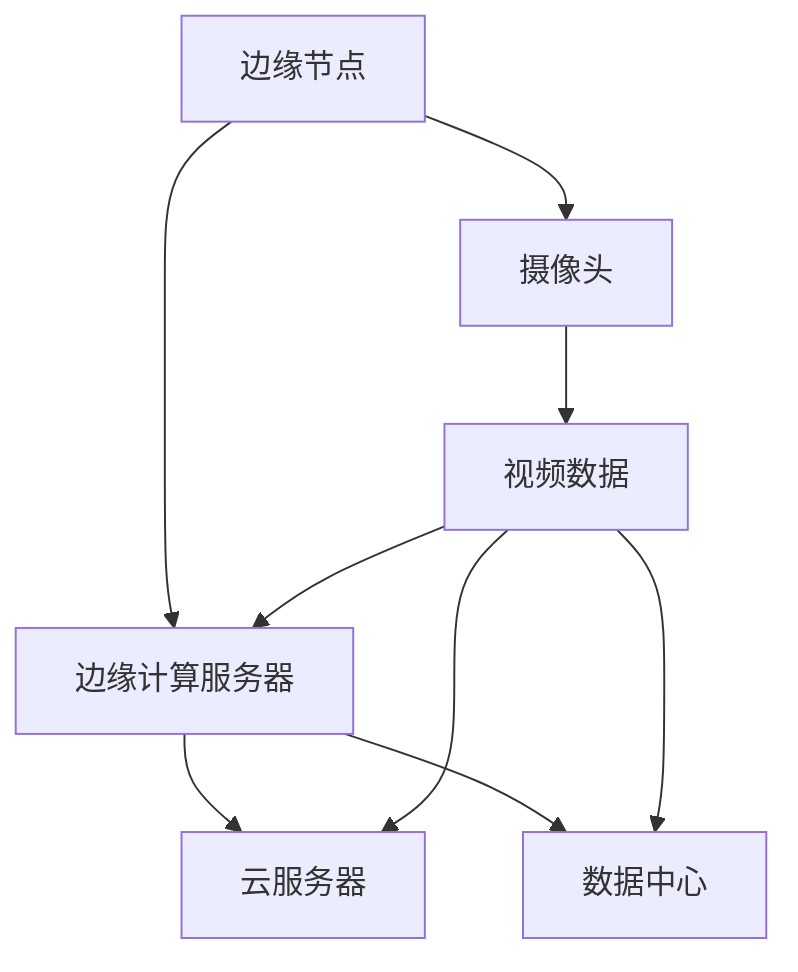

                 

**AIGC与边缘计算在实时视频处理中的融合**

> 关键词：AIGC、边缘计算、实时视频处理、人工智能、架构设计

> 摘要：
本文章旨在深入探讨AIGC（AI-Generated Content）和边缘计算在实时视频处理中的融合。通过定义核心概念、分析架构设计、探讨实现细节，提供案例研究，并对未来发展进行展望，本文旨在提供一个全面的视角，以帮助读者理解这一先进技术的应用和潜力。

---

## 引言背景

随着人工智能技术的飞速发展，AIGC（AI-Generated Content）已经成为内容创作领域的一股新兴力量。它利用机器学习算法，特别是生成对抗网络（GANs）和变分自编码器（VAEs），能够自动生成高质量的视频、图像和文本内容。与此同时，边缘计算（Edge Computing）的兴起，为数据处理提供了更靠近数据源的解决方案，减少了延迟，提高了系统的响应速度和可靠性。

在实时视频处理领域，这两者的融合显得尤为重要。实时视频处理要求系统能够迅速处理大量的视频数据，并进行高效的图像识别、内容分析等操作。传统的中心化处理方式由于网络带宽和处理能力的限制，往往无法满足实时性的需求。而边缘计算能够将部分处理任务下放到靠近数据产生的设备上，从而大大提高了系统的响应速度和处理效率。

本文将深入探讨AIGC和边缘计算在实时视频处理中的融合，分析其核心概念、架构设计、实现细节，并通过实际案例展示其应用潜力。

## 核心概念与原理

### AIGC

AIGC（AI-Generated Content）是一种利用人工智能技术自动生成内容的方法。它涉及多个子领域，包括图像生成、视频生成、文本生成等。AIGC的核心在于其生成算法，如生成对抗网络（GANs）和变分自编码器（VAEs）。

**生成对抗网络（GANs）**：
GANs由生成器和判别器组成。生成器的目标是生成逼真的数据，而判别器的目标是区分生成器和真实数据。通过这种对抗性的训练，生成器不断改进，最终能够生成高质量的图像和视频。

**变分自编码器（VAEs）**：
VAEs是一种无监督学习算法，它通过编码器和解码器来重建输入数据。编码器将数据压缩成一个较低维的表示，解码器则尝试从这个表示中重建原始数据。VAEs在图像生成和视频生成中表现出色。

### 边缘计算

边缘计算（Edge Computing）是一种分布式计算架构，它将数据处理、存储和分析任务从中心化的数据中心转移到网络的边缘节点。这些边缘节点可以是各种智能设备，如智能手机、物联网设备、云计算节点等。

边缘计算的核心优势在于其低延迟、高可靠性和灵活性。通过将部分计算任务下放到靠近数据源的设备上，边缘计算能够减少数据传输的距离和时间，提高系统的响应速度和处理效率。

### AIGC与边缘计算的联系

AIGC和边缘计算在实时视频处理中的融合，主要体现在以下几个方面：

1. **数据处理能力**：边缘计算提供了强大的数据处理能力，使得AIGC算法能够在实时视频处理中发挥作用。
2. **低延迟**：边缘计算的低延迟特性，使得AIGC能够更快地生成和处理视频内容，满足实时性要求。
3. **灵活性**：边缘计算支持多样化的设备和服务，使得AIGC的应用场景更加广泛。

## 架构设计

为了实现AIGC和边缘计算在实时视频处理中的融合，我们需要一个高效的系统架构。以下是一个可能的架构设计：

### 系统架构图



### 系统架构说明

1. **边缘节点**：边缘节点负责接收来自摄像头的实时视频数据，并初步处理这些数据。边缘节点可以是各种智能设备，如智能手机、物联网设备等。
2. **边缘计算服务器**：边缘计算服务器位于边缘节点附近，它负责执行AIGC算法，对实时视频数据进行分析和生成。边缘计算服务器具备强大的计算能力，能够处理大量的视频数据。
3. **云服务器和数据中心**：云服务器和数据中心负责处理边缘节点和边缘计算服务器无法处理的复杂任务，如大规模数据存储、深度学习模型的训练和推理等。

通过这个架构设计，AIGC和边缘计算能够高效地协同工作，实现实时视频处理的目标。

## 实践实现

### 实践步骤

1. **数据采集**：首先，我们需要从摄像头收集实时视频数据。
2. **预处理**：对收集到的视频数据进行预处理，包括去噪、增强等操作。
3. **边缘计算**：将预处理后的视频数据传输到边缘计算服务器，并执行AIGC算法。这个过程可以包括图像生成、视频生成、文本生成等任务。
4. **结果输出**：将生成的视频内容输出到用户界面或存储到数据库中。

### 实践案例

假设我们有一个实时视频监控应用，要求系统能够在实时监控过程中，自动识别并标记出异常行为。以下是一个简单的实现案例：

1. **数据采集**：摄像头实时捕获监控区域的视频流。
2. **预处理**：对视频流进行预处理，如去噪、裁剪等。
3. **边缘计算**：边缘计算服务器接收预处理后的视频流，并使用AIGC算法进行行为识别。具体实现如下：

```python
# 边缘计算服务器实现
import cv2
import numpy as np

# 加载预训练的AIGC模型
model = load_model('aigc_model.h5')

# 处理视频流
video_capture = cv2.VideoCapture(0)

while True:
    ret, frame = video_capture.read()
    if not ret:
        break
    
    # 预处理视频帧
    processed_frame = preprocess_frame(frame)
    
    # 使用AIGC模型进行行为识别
    behavior = model.predict(processed_frame)
    
    # 标记异常行为
    if is_anomalous(behavior):
        mark_frame(frame)
    
    # 输出生成的视频内容
    output_frame(frame)

video_capture.release()
```

通过这个实践案例，我们可以看到AIGC和边缘计算在实时视频处理中的应用潜力。

## 案例研究与应用

### 案例一：智能交通监控

智能交通监控系统利用AIGC和边缘计算技术，能够实时识别和分类道路上的车辆，从而实现交通流量分析和异常行为检测。

**案例分析**：
在北京市的某条主干道上，部署了基于AIGC和边缘计算技术的智能交通监控系统。摄像头捕捉到的视频流被传输到边缘计算服务器，进行预处理和AIGC算法处理。通过识别车辆类型、颜色、车牌等信息，系统能够实时分析交通流量，并检测异常行为，如违章停车、逆行等。

**实施细节**：
1. **摄像头**：部署在主干道两侧的摄像头，采集实时视频流。
2. **边缘计算服务器**：安装在交通管理部门的数据中心附近，负责执行AIGC算法，对视频流进行实时处理。
3. **云服务器和数据中心**：用于存储大规模视频数据和深度学习模型，提供后台支持。

**效果分析**：
通过AIGC和边缘计算的融合应用，智能交通监控系统能够实现实时、高效的道路交通管理。在交通高峰期，系统能够迅速处理大量的视频数据，并提供实时交通流量信息，为交通管理部门提供决策支持。

### 案例二：远程医疗诊断

远程医疗诊断系统利用AIGC和边缘计算技术，能够对医疗影像进行实时分析，提供精准的诊断建议。

**案例分析**：
在偏远地区的一家医院，部署了基于AIGC和边缘计算技术的远程医疗诊断系统。医疗影像通过摄像头传输到边缘计算服务器，进行预处理和AIGC算法处理。通过对影像的实时分析，系统能够识别病变区域，并提供诊断建议。

**实施细节**：
1. **摄像头**：安装在医生办公室的摄像头，采集医疗影像。
2. **边缘计算服务器**：安装在医疗中心的数据中心附近，负责执行AIGC算法，对影像进行实时处理。
3. **云服务器和数据中心**：用于存储大规模影像数据和深度学习模型，提供后台支持。

**效果分析**：
通过AIGC和边缘计算的融合应用，远程医疗诊断系统能够提高医疗诊断的准确性和效率。医生能够实时获取诊断建议，减少诊断时间，提高诊断质量。

## 结论与未来趋势

通过本文的讨论，我们可以看到AIGC和边缘计算在实时视频处理中具有巨大的应用潜力。它们能够提高数据处理效率、减少延迟、增强系统的灵活性，为各种应用场景提供强大的支持。

未来，随着人工智能技术的不断进步，AIGC和边缘计算在实时视频处理中的应用将更加广泛。我们可以期待更多创新的应用场景，如智能安防、远程教育、虚拟现实等。

同时，随着5G网络的普及，边缘计算将变得更加高效和普及，为AIGC的应用提供更好的基础设施支持。

## 附录与进一步阅读

### 附录

**附录A：术语解释**

- AIGC：AI-Generated Content，人工智能生成内容。
- 边缘计算：一种分布式计算架构，将数据处理、存储和分析任务从中心化的数据中心转移到网络的边缘节点。

**附录B：相关资源**

- 《深度学习》 - Ian Goodfellow, Yoshua Bengio, Aaron Courville
- 《边缘计算：原理、架构与应用》 - 张康，李明杰

### 进一步阅读

- AIGC技术白皮书
- Edge AI： Mitigating AI's Global Impact Through Edge Computing
- Real-Time Video Processing Using AI-Generated Content

---

**作者信息**

作者：AI天才研究院/AI Genius Institute & 禅与计算机程序设计艺术 /Zen And The Art of Computer Programming**

