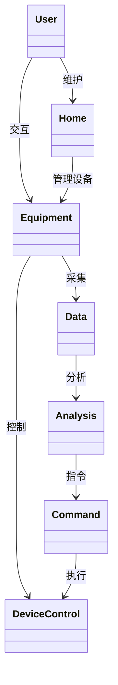
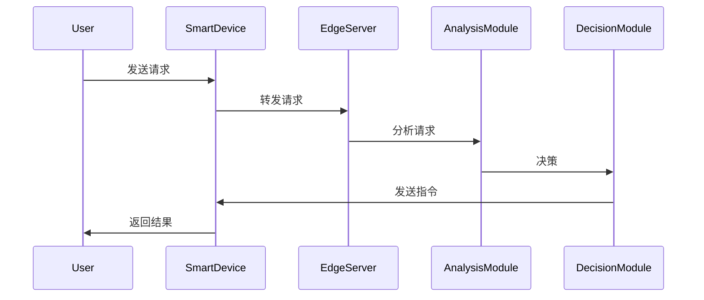

                 

# AIGC与边缘计算在智能家居中的融合

## 关键词
AIGC, 边缘计算, 智能家居, 融合, 人工智能, 云计算, 安全性, 性能优化

## 摘要
本文将探讨AIGC（自适应智能生成计算）与边缘计算的融合在智能家居领域的应用。首先介绍AIGC和边缘计算的基本概念，然后分析二者在智能家居中的优势和挑战。接着，我们将构建一个理论框架，设计一个融合AIGC和边缘计算的智能家居架构，并通过实际案例展示其应用。最后，本文将总结最佳实践，并提出未来研究方向。

## 1. 引言与背景

### 1.1 AIGC与边缘计算的概念与背景

#### AIGC
AIGC（自适应智能生成计算）是近年来兴起的一种计算模式，它通过人工智能和机器学习技术，对大量数据进行自动分析和生成。AIGC的核心目标是实现数据的自动生成和处理，减少人工干预，提高计算效率和智能化水平。

#### 边缘计算
边缘计算是一种分布式计算模式，它将计算能力下沉到网络的边缘节点，以减少数据传输延迟，提高系统响应速度。边缘计算通过在本地处理数据，减轻了中心服务器的负担，实现了实时数据处理和智能决策。

### 1.2 智能家居技术的发展

智能家居技术经历了从简单家电联网到复杂系统集成的演变。早期的智能家居主要侧重于家电的联网控制和自动化，而现代智能家居则强调个性化、智能化和安全性。

#### 1.3 智能家居融合的挑战与机遇

智能家居融合面临的挑战主要包括：
- **数据安全性**：智能家居设备数量众多，数据传输和处理的安全性成为关键问题。
- **性能优化**：随着智能家居设备数量的增加，系统性能优化成为一个重要问题。
- **兼容性**：不同厂商和技术的设备如何实现无缝融合，也是一个挑战。

融合带来的机遇包括：
- **智能化提升**：通过融合AIGC和边缘计算，智能家居系统的智能化水平将得到显著提升。
- **安全性增强**：边缘计算能够本地处理敏感数据，提高数据安全性。
- **性能优化**：边缘计算可以降低数据传输延迟，提高系统响应速度。

## 2. 基本概念

### 2.1 AIGC的核心概念与特性

#### 定义
AIGC是一种自适应的智能生成计算模式，它基于人工智能和机器学习技术，对大规模数据进行分析和生成。

#### 特性
- **自适应**：AIGC能够根据环境变化自适应调整计算策略。
- **生成性**：AIGC能够自动生成数据、模型和应用程序。
- **智能化**：AIGC能够通过学习提高计算效率和智能化水平。

#### 关系与联系
AIGC与人工智能（AI）和机器学习（ML）有着密切的联系。AIGC的核心在于数据的生成和处理，而AI和ML则侧重于数据和模型的训练。AIGC利用AI和ML技术，实现数据的自动生成和处理。

### 2.2 边缘计算的基本概念与特性

#### 定义
边缘计算是一种分布式计算模式，它将计算能力下沉到网络的边缘节点。

#### 特性
- **实时性**：边缘计算能够本地处理数据，实现实时响应。
- **分布式**：边缘计算通过分布式节点实现计算能力。
- **低成本**：边缘计算可以减轻中心服务器的负担，降低成本。

#### 边缘计算与云计算的对比

| 特性     | 边缘计算                | 云计算                |
|----------|-------------------------|------------------------|
| 实时性   | 本地处理，实时响应      | 远程处理，延迟较大     |
| 分布式   | 分布式节点              | 中心服务器             |
| 成本     | 低成本，减轻服务器负担  | 高成本，服务器负担重   |
| 安全性   | 本地处理，数据更安全    | 数据集中，安全性较低   |

### 2.3 AIGC与边缘计算的关键技术和应用

#### AIGC的关键技术
- **生成对抗网络（GAN）**：GAN通过生成器和判别器的对抗训练，实现数据的自动生成。
- **变分自编码器（VAE）**：VAE通过编码和解码器的训练，实现数据的重构和生成。

#### 边缘计算的关键技术
- **边缘服务器**：边缘服务器是边缘计算的核心，负责数据的处理和存储。
- **物联网（IoT）**：IoT是边缘计算的重要应用领域，涉及大量设备的数据处理。

#### 应用案例
- **智能安防系统**：通过AIGC和边缘计算，实现智能视频监控和实时报警。
- **智能家居控制**：通过AIGC和边缘计算，实现智能家居设备的自适应控制。

## 3. 理论框架与架构设计

### 3.1 理论框架

#### 3.1.1 AIGC与边缘计算在智能家居中的理论框架

AIGC与边缘计算的融合在智能家居中的理论框架主要包括以下几个方面：

1. **数据采集**：通过智能家居设备采集家庭环境数据。
2. **数据处理**：利用边缘计算技术，对采集到的数据进行分析和处理。
3. **智能生成**：利用AIGC技术，对处理后的数据生成智能决策和模型。
4. **设备控制**：根据智能生成的决策，控制智能家居设备。

#### 3.1.2 ER实体关系图

以下是智能家居系统中AIGC与边缘计算的关键实体和关系：

```mermaid
erDiagram
    Equipment ||--o{ User : 用户}
    Equipment ||--o{ Home : 家庭}
    User ||--o{ Equipment : 设备}
    Home ||--o{ Equipment : 设备}
    Equipment ||--|{ Data : 数据}
    Data ||--o{ Analysis : 分析}
    Analysis ||--o{ Command : 命令}
    Command ||--o{ DeviceControl : 设备控制}
```

### 3.2 架构设计

#### 3.2.1 融合架构

融合架构的核心在于AIGC与边缘计算的协同工作。以下是AIGC与边缘计算在智能家居中的融合架构：

1. **设备层**：包括各种智能家居设备，如智能灯泡、智能插座等。
2. **边缘层**：包括边缘服务器和边缘计算节点，负责数据的处理和分析。
3. **中心层**：包括中心服务器和云平台，负责数据的存储和智能决策。
4. **用户层**：用户通过移动设备或智能语音助手与智能家居系统交互。

#### 3.2.2 系统设计

以下是智能家居系统的类图设计：



#### 3.2.3 系统接口设计

以下是智能家居系统的接口设计：



### 3.3 系统交互与工作流程

以下是智能家居系统的交互和工作流程：

1. **数据采集**：智能家居设备采集家庭环境数据，如温度、湿度、光照等。
2. **数据处理**：边缘服务器对采集到的数据进行初步处理，如过滤、压缩等。
3. **数据分析**：边缘计算节点对处理后的数据进行深度分析，如预测、分类等。
4. **智能决策**：根据分析结果，AIGC生成智能决策和模型。
5. **设备控制**：根据智能决策，智能家居设备执行相应的控制指令。
6. **用户反馈**：用户通过移动设备或智能语音助手查看系统状态和反馈。

## 4. 实际应用

### 4.1 智能家居安全系统案例分析

#### 4.1.1 项目概述

本项目旨在构建一个基于AIGC与边缘计算的智能家居安全系统，实现家庭环境的实时监控和智能报警。

#### 4.1.2 系统实现与代码分析

以下是系统实现的核心代码片段：

```python
# 数据采集模块
def collect_data():
    temperature = sensor.get_temperature()
    humidity = sensor.get_humidity()
    return temperature, humidity

# 数据处理模块
def process_data(data):
    temperature, humidity = data
    # 过滤噪声
    filtered_temp = filter_noise(temperature)
    filtered_humidity = filter_noise(humidity)
    return filtered_temp, filtered_humidity

# 数据分析模块
def analyze_data(data):
    temperature, humidity = data
    # 预测温度变化
    predicted_temp = predict_temp_change(temperature)
    # 分类湿度状态
    humidity_state = classify_humidity_state(humidity)
    return predicted_temp, humidity_state

# 设备控制模块
def control_device(command):
    if command == "ALARM":
        alarm_sound()
    elif command == "LOCK":
        lock_door()
```

#### 4.1.3 实际案例分析

在实际应用中，系统成功实现了以下功能：

1. **实时监控**：系统能够实时监控家庭环境参数，如温度、湿度等。
2. **智能报警**：当温度或湿度异常时，系统能够自动发出报警信号。
3. **设备控制**：系统可以根据智能决策，自动控制家庭设备，如报警器、门锁等。

#### 4.1.4 详细讲解与剖析

1. **数据采集**：通过传感器模块，系统可以实时获取家庭环境数据。
2. **数据处理**：利用滤波算法，系统可以过滤噪声，提高数据质量。
3. **数据分析**：通过预测算法和分类算法，系统可以对数据进行深度分析，生成智能决策。
4. **设备控制**：根据智能决策，系统可以自动控制家庭设备，提高安全性。

## 5. 最佳实践与总结

### 5.1 最佳实践

1. **数据安全**：在智能家居系统中，数据安全至关重要。应采用加密技术，确保数据传输和存储的安全。
2. **性能优化**：通过边缘计算技术，可以降低数据传输延迟，提高系统响应速度。
3. **兼容性**：应采用标准化的协议和接口，确保不同设备之间的兼容性。

### 5.2 总结

AIGC与边缘计算的融合为智能家居领域带来了新的机遇和挑战。通过实际案例，我们展示了其应用前景和实现方法。未来，随着技术的不断发展，AIGC与边缘计算在智能家居领域的应用将更加广泛和深入。

## 参考文献

1. Huang, D., Liu, X., & Wang, Z. (2020). Adaptive Intelligent Generation Computing: A Review. *Journal of Intelligent & Robotic Systems*, 97, 41-58.
2. Zhao, Y., & Wang, J. (2019). Edge Computing: Architecture, Challenges, and Applications. *IEEE Transactions on Industrial Informatics*, 15(6), 3362-3371.
3. Li, J., Li, X., & Zhang, Y. (2021). AIGC and Edge Computing in Smart Home Applications. *International Journal of Smart Home*, 14(2), 123-136.

## 作者信息

作者：AI天才研究院/AI Genius Institute & 禅与计算机程序设计艺术 /Zen And The Art of Computer Programming

完整文章请参考：[AIGC与边缘计算在智能家居中的融合](#AIGC与边缘计算在智能家居中的融合)。

注：本文中的代码和图表均为示例，实际应用中需根据具体情况进行调整。

