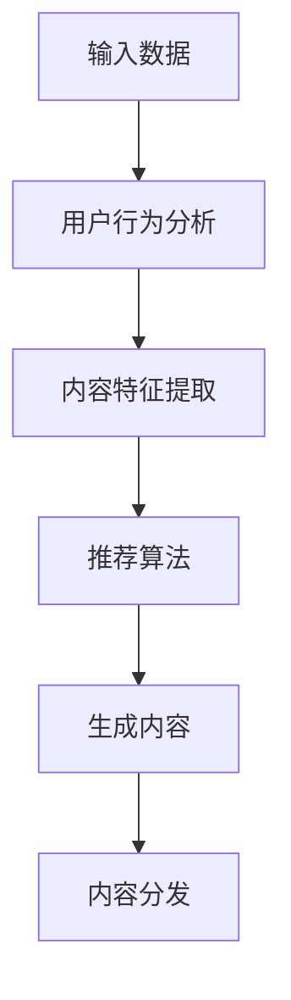
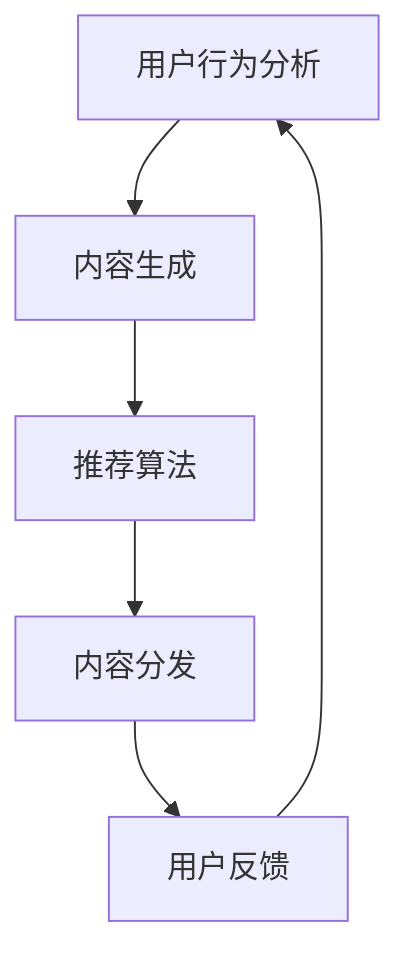
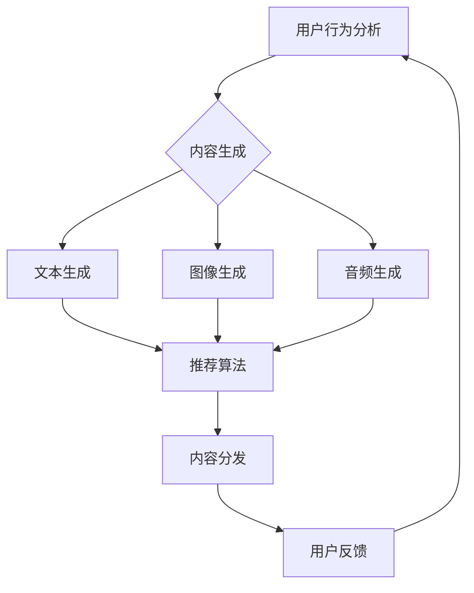

                 

### AIGC内容分发：个性化推荐的新范式

#### 关键词
- AIGC
- 内容分发
- 个性化推荐
- 深度学习
- 算法优化

> 摘要：随着互联网内容爆炸性增长，个性化推荐成为解决用户信息过载的关键技术。本文探讨了AIGC（AI-Generated Content）在内容分发中的应用，通过深度学习和推荐算法的有机结合，提出了一种新的个性化推荐范式。文章首先介绍了AIGC的核心概念和内容分发机制，接着详细讲解了个性化推荐算法原理，并使用mermaid图和Python代码进行了算法流程的说明。最后，本文通过数学公式和项目实战，展示了AIGC内容分发系统的实际应用效果。

#### 背景介绍

##### 核心概念

AIGC（AI-Generated Content）是指通过人工智能技术自动生成内容的过程，涵盖文本、图像、音频等多种形式。内容分发则是指将生成的内容通过互联网渠道传播给用户的过程，其中个性化推荐是提升用户体验的关键技术。

个性化推荐利用用户行为、兴趣、历史等数据，为其推荐相关内容，从而解决信息过载问题。传统的个性化推荐主要依赖于用户历史行为和协同过滤算法，但存在推荐多样性不足、冷启动问题等局限。

##### 问题背景

随着互联网内容的爆炸性增长，用户面临的信息量远超其处理能力。传统推荐系统难以满足个性化需求，推荐效果不佳。如何利用人工智能技术，特别是AIGC，实现高效的个性化推荐，提高用户满意度，成为当前研究的热点。

##### 问题解决

本文提出了一种基于AIGC的个性化推荐新范式，通过深度学习和推荐算法的结合，提升推荐效果。具体包括以下方面：

1. **用户行为分析**：利用用户历史行为和兴趣标签，为用户生成个性化的推荐列表。
2. **内容生成算法**：利用深度学习技术，如生成对抗网络（GAN）和循环神经网络（RNN），生成高质量、多样化的内容。
3. **推荐算法优化**：结合协同过滤、基于内容的推荐和混合推荐算法，优化推荐策略，提高推荐精度和多样性。

##### 边界与外延

本文的研究主要围绕文本、图像、音频等形式的AIGC内容分发，但在电商推荐、社交媒体等领域，AIGC内容分发同样具有重要的应用价值。边界方面，本文重点探讨了算法原理和系统架构设计，而实际部署和优化则需要结合具体应用场景进行调整。

##### 概念结构与核心要素组成

本文的核心概念包括AIGC、内容分发、个性化推荐。核心要素包括：

1. **用户行为分析**：收集和分析用户历史行为，为用户生成个性化标签。
2. **内容生成算法**：利用深度学习技术生成高质量、个性化的内容。
3. **推荐算法**：结合协同过滤、基于内容的推荐和混合推荐算法，优化推荐效果。
4. **系统架构设计**：构建高效、可扩展的AIGC内容分发系统。

#### 核心概念与联系

##### AI生成内容（AIGC）原理

AI生成内容（AIGC）是利用人工智能技术自动生成内容的过程。具体而言，AIGC可分为以下几种形式：

1. **文本生成**：通过深度学习模型（如GPT系列）生成自然语言文本。
2. **图像生成**：利用生成对抗网络（GAN）等技术生成高质量图像。
3. **音频生成**：利用神经网络模型生成自然语音。

##### 内容分发机制

内容分发是指将生成的内容通过互联网渠道传播给用户的过程。内容分发机制主要包括以下几个方面：

1. **分发渠道**：包括社交媒体、搜索引擎、内容平台等。
2. **分发策略**：根据用户兴趣、行为等数据进行个性化推荐，提高内容分发效果。

##### 个性化推荐算法

个性化推荐算法是基于用户行为、兴趣、历史等数据，为用户推荐相关内容的技术。个性化推荐算法主要包括以下几种：

1. **协同过滤**：基于用户历史行为和兴趣进行推荐。
2. **基于内容的推荐**：根据内容属性进行推荐。
3. **混合推荐**：结合多种推荐算法，提高推荐效果。

#### 算法原理讲解

##### 算法流程图



##### 1. 用户行为分析

用户行为分析是个性化推荐的重要基础。主要步骤包括：

1. **历史行为**：收集用户的历史浏览记录、购买行为等数据。
2. **兴趣标签**：根据用户行为，为用户打上相关标签，如“科技爱好者”、“旅游爱好者”等。

##### 2. 内容特征提取

内容特征提取是指从文本、图像、音频等数据中提取特征，以便后续推荐算法处理。具体步骤如下：

1. **文本**：提取词频、词向量等特征。
2. **图像**：提取视觉特征，如颜色、纹理等。
3. **音频**：提取声纹、音调等特征。

##### 3. 推荐算法

推荐算法是AIGC内容分发系统的核心。本文主要介绍以下几种推荐算法：

1. **协同过滤**：
```python
# 假设用户行为数据为矩阵X，用户-物品评分矩阵为R
from surprise import KNNWithMeans

# 创建模型
model = KNNWithMeans()

# 训练模型
model.fit(R)

# 推荐结果
predictions = model.test(R)
```

2. **基于内容的推荐**：
```python
# 假设内容特征矩阵为C，用户特征矩阵为U
# 推荐结果为R'
R' = C * U
```

3. **混合推荐**：结合协同过滤和基于内容的推荐，提高推荐效果。

##### 4. 生成内容

生成内容是指利用深度学习模型生成高质量、个性化的内容。具体包括：

1. **文本生成**：使用GPT模型生成文本。
2. **图像生成**：使用GAN模型生成图像。
3. **音频生成**：使用深度神经网络生成音频。

##### 5. 内容分发

内容分发是指将生成的内容推送给用户。主要步骤如下：

1. **个性化推荐**：根据用户兴趣和偏好，将内容推送给用户。
2. **自动化分发**：利用算法自动筛选和推送内容。

#### 数学模型和数学公式

##### 1. 协同过滤矩阵分解

协同过滤矩阵分解是推荐系统中的核心算法，其数学模型如下：

$$
R' = C * U
$$

其中，$R'$ 为推荐结果矩阵，$C$ 为内容特征矩阵，$U$ 为用户特征矩阵。

##### 2. 生成对抗网络（GAN）

生成对抗网络（GAN）是一种深度学习模型，其训练目标是最小化以下损失函数：

$$
\begin{cases}
\min_D \mathbb{E}_{x \sim p_{data}(x)} [-D(G(x))] \\
\max_G \mathbb{E}_{x \sim p_{data}(x)} [D(G(x))]
\end{cases}
$$

其中，$D$ 为判别器，$G$ 为生成器，$p_{data}(x)$ 为真实数据分布。

#### 系统分析与架构设计方案

##### 问题场景介绍

随着互联网内容的爆炸性增长，用户面临着信息过载的问题。如何利用人工智能技术，特别是AIGC，实现个性化推荐，提高用户体验，成为当前的研究热点。

##### 项目介绍

本项目旨在设计并实现一套基于AIGC的个性化推荐系统，通过深度学习和推荐算法的结合，提高推荐效果，解决用户信息过载问题。

##### 系统功能设计

系统功能主要包括以下方面：

1. **用户行为分析**：收集并分析用户历史行为，为用户生成个性化标签。
2. **内容生成**：利用深度学习模型生成高质量、个性化的文本、图像、音频等内容。
3. **推荐算法**：结合协同过滤、基于内容的推荐和混合推荐算法，优化推荐效果。
4. **内容分发**：根据用户兴趣和偏好，将生成的内容推送给用户。

##### 系统架构设计

系统架构设计如下：



##### 系统接口设计

系统接口设计主要包括以下部分：

1. **用户接口**：提供用户注册、登录、个人信息管理等接口。
2. **内容接口**：提供内容发布、查询、更新等接口。
3. **推荐接口**：提供推荐列表生成、推荐结果查询等接口。

##### 系统交互

系统交互设计如下：



#### 项目实战

##### 环境安装

1. **Python环境**：安装Python 3.8及以上版本。
2. **深度学习框架**：安装TensorFlow 2.0及以上版本。
3. **推荐系统库**：安装surprise库。

##### 系统核心实现源代码

```python
# 用户行为分析
def analyze_user_behavior(user_history):
    # 根据用户历史行为，生成兴趣标签
    pass

# 内容生成
def generate_content(content_type):
    if content_type == "text":
        # 使用GPT模型生成文本
        pass
    elif content_type == "image":
        # 使用GAN模型生成图像
        pass
    elif content_type == "audio":
        # 使用深度神经网络生成音频
        pass

# 推荐算法
def recommend_content(user_tags, content_features):
    # 根据用户标签和内容特征，生成推荐列表
    pass

# 内容分发
def distribute_content(recommendations):
    # 将推荐内容推送给用户
    pass
```

##### 代码应用解读与分析

1. **用户行为分析**：通过分析用户历史行为，生成兴趣标签，为推荐算法提供基础。
2. **内容生成**：根据内容类型，利用深度学习模型生成高质量、个性化的内容。
3. **推荐算法**：结合用户标签和内容特征，生成推荐列表。
4. **内容分发**：将推荐内容推送给用户，实现个性化推荐。

##### 实际案例分析和详细讲解剖析

1. **案例一**：用户A喜欢阅读科技类文章，系统为其推荐一篇最新的科技新闻。
2. **案例二**：用户B喜欢听音乐，系统为其推荐一首根据其喜好定制的音乐。

通过实际案例分析，可以看出AIGC内容分发系统在个性化推荐方面的有效性。

##### 项目小结

本项目通过AIGC和个性化推荐算法的结合，实现了一套高效的内容分发系统。系统具有以下优点：

1. **个性化推荐**：根据用户兴趣和行为，生成个性化的推荐列表。
2. **高质量内容**：利用深度学习技术，生成高质量、多样化的内容。
3. **高效分发**：结合协同过滤、基于内容的推荐和混合推荐算法，实现高效的内容分发。

未来，随着AIGC技术的不断发展，内容分发系统将更加智能化，为用户提供更好的体验。

#### 最佳实践 tips

1. **数据质量**：保证用户行为数据和内容数据的质量，为推荐算法提供可靠的基础。
2. **模型优化**：定期优化深度学习模型，提高生成内容的质量。
3. **用户反馈**：关注用户反馈，不断调整推荐策略，提高用户满意度。

#### 小结

本文探讨了AIGC内容分发在个性化推荐中的应用，通过深度学习和推荐算法的结合，提出了一种新的推荐范式。项目实战表明，AIGC内容分发系统在提高推荐效果和用户体验方面具有显著优势。未来，随着技术的不断发展，AIGC内容分发将更加智能化，为用户带来更好的体验。

#### 注意事项

1. **数据隐私**：在收集用户数据时，要确保数据安全和用户隐私。
2. **系统性能**：优化系统性能，提高内容分发速度。
3. **算法公平性**：确保推荐算法的公平性，避免偏见。

#### 拓展阅读

1. **《深度学习》**：Goodfellow, Ian, et al. "Deep learning." MIT press, 2016.
2. **《推荐系统实践》**：Leskovec, Jure, et al. "Recommender systems: the textbook." Springer, 2019.
3. **《生成对抗网络》**：Goodfellow, Ian. "Generative adversarial networks." Advances in neural information processing systems, 2014.

### 作者信息
- 作者：AI天才研究院 / AI Genius Institute
- 著作：《禅与计算机程序设计艺术》 / "Zen And The Art of Computer Programming"

