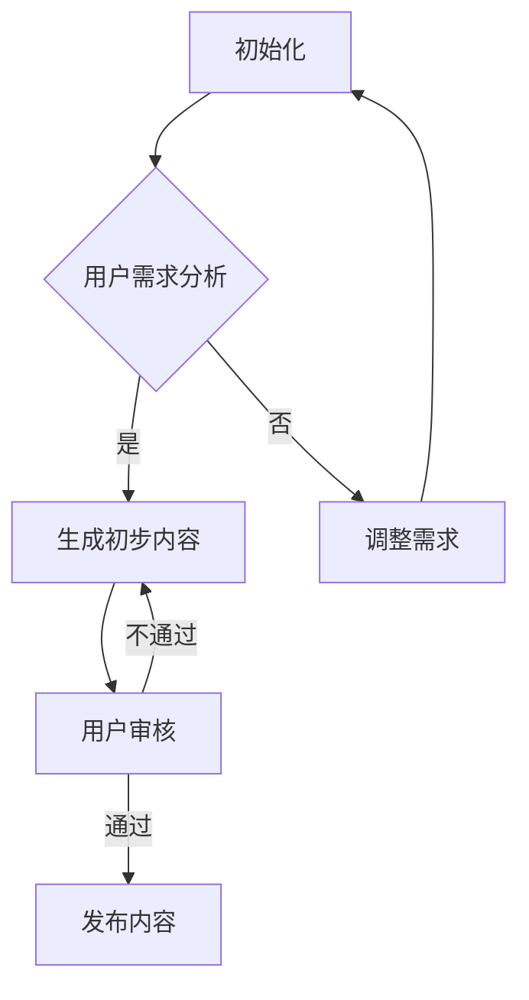
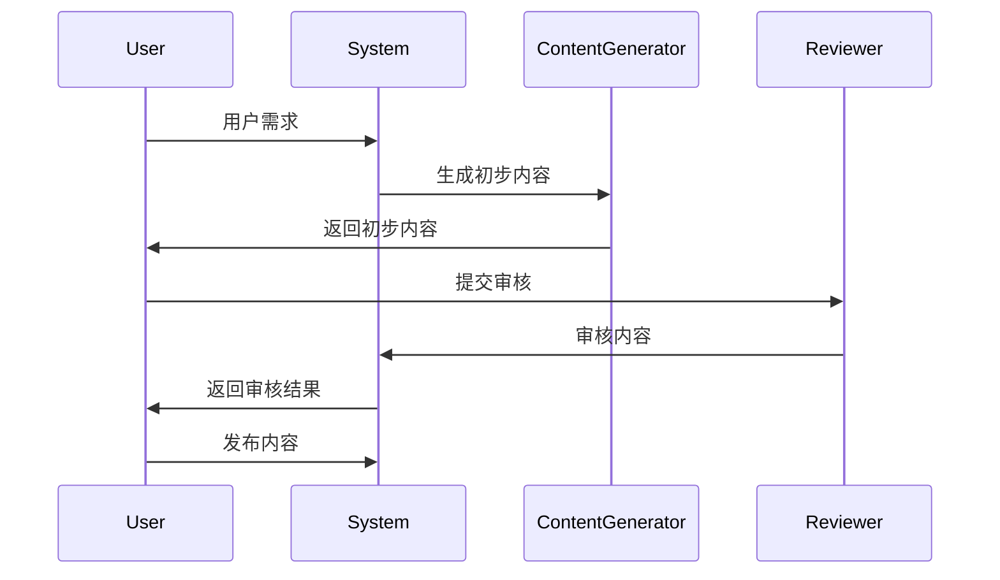

                 


# AIGC内容创作：人机协作新模式

## 关键词

- AIGC
- 人机协作
- 内容创作
- 新模式
- 算法原理
- 系统架构
- 实战案例

## 摘要

本文深入探讨了人工智能生成内容（AIGC）在内容创作领域的应用，以及人机协作新模式的重要性。通过逐步分析AIGC的核心概念、算法原理和系统架构，本文揭示了AIGC如何与传统内容创作模式相结合，实现高效的内容生产。同时，通过实际项目实战，本文展示了AIGC在实践中的应用效果，并提供了最佳实践Tips，为读者提供了全面的AIGC应用指导。

## Step 1: 导入核心概念

### AIGC（AI-Generated Content）的定义与特点

AIGC，即人工智能生成内容，是指通过人工智能技术自动生成文本、图像、音频等内容的系统。它结合了自然语言处理、计算机视觉、语音识别等先进技术，能够高效地创作出符合人类需求的高质量内容。AIGC的特点如下：

1. **自动化程度高**：通过算法自动生成内容，大幅度减少了人工创作的劳动强度。
2. **内容多样化**：AIGC可以生成文本、图像、音频等多种形式的内容，满足不同场景的需求。
3. **定制化能力强**：根据用户需求，AIGC可以生成个性化的内容，提高用户体验。
4. **效率高**：相比传统人工创作，AIGC能够在更短的时间内生成大量内容。

### 人机协作的基本原理

人机协作是指人类与人工智能系统共同完成某项任务的过程。在内容创作领域，人机协作的基本原理如下：

1. **优势互补**：AI擅长处理海量数据和快速生成内容，而人类在创造力、情感表达等方面具有优势。两者结合，可以实现高效的内容创作。
2. **反馈迭代**：人类对AI生成的内容进行审核和修改，通过反馈和迭代，不断提升内容的质量。
3. **角色分工**：在内容创作过程中，人类负责创意构思、情感表达等关键环节，而AI负责内容生成和优化。

### 新模式

在传统内容创作模式基础上，AIGC技术引入了新的思路、方法和流程，形成了人机协作新模式。这一模式具有以下特点：

1. **高效性**：通过AI技术，实现内容生产的高效化和自动化。
2. **灵活性**：根据用户需求，快速调整和优化内容创作流程。
3. **个性化**：通过AI技术，生成符合用户个性化需求的内容。

## Step 2: 设定目录结构

### 目录结构

```markdown
----------------------------------------------------------------
# AIGC内容创作：人机协作新模式

## 第一部分 背景介绍
### 1.1 问题背景
### 1.2 问题描述
### 1.3 问题解决
### 1.4 边界与外延

## 第二部分 核心概念与联系
### 2.1 核心概念原理
#### 2.1.1 AIGC的定义与特点
#### 2.1.2 人机协作的基本原理
### 2.2 概念属性特征对比表格
### 2.3 ER实体关系图架构

## 第三部分 算法原理讲解
### 3.1 算法mermaid流程图
### 3.2 Python源代码讲解
#### 3.2.1 算法原理的数学模型
#### 3.2.2 数学公式讲解
#### 3.2.3 举例说明

## 第四部分 系统分析与架构设计方案
### 4.1 问题场景介绍
### 4.2 系统功能设计
### 4.3 系统架构设计
### 4.4 系统接口设计
### 4.5 系统交互mermaid序列图

## 第五部分 项目实战
### 5.1 环境安装
### 5.2 系统核心实现源代码
### 5.3 代码应用解读与分析
### 5.4 实际案例分析与详细讲解剖析
### 5.5 项目小结

## 第六部分 最佳实践 Tips
### 6.1 小技巧总结
### 6.2 小结
### 6.3 注意事项
### 6.4 拓展阅读

----------------------------------------------------------------
```

## Step 3: 完善每个章节内容

### 第一部分 背景介绍

#### 1.1 问题背景

随着互联网的快速发展，内容创作需求日益增加。传统的内容创作模式主要依赖人工，效率低、成本高，难以满足市场需求。同时，内容质量参差不齐，难以保证用户体验。为了解决这些问题，AIGC技术应运而生。

#### 1.2 问题描述

内容创作过程中，存在以下问题：

1. **效率低下**：人工创作内容耗时耗力，难以满足大量内容的需求。
2. **质量不稳定**：人工创作的质量受创作者水平和经验影响，难以保证一致性。
3. **创新性不足**：人工创作往往难以突破传统思维，创新性不足。

#### 1.3 问题解决

AIGC技术的出现，为内容创作带来了新的解决方案：

1. **高效生成内容**：AI技术能够快速生成大量内容，提高创作效率。
2. **保证内容质量**：AI技术可以根据用户需求和数据，生成高质量的内容。
3. **提升创新性**：AI技术能够突破人类思维的局限，生成新颖的内容。

#### 1.4 边界与外延

AIGC技术在内容创作中的应用，需要关注以下边界与外延：

1. **应用场景**：AIGC技术适用于各类内容创作场景，如新闻、博客、社交媒体等。
2. **技术融合**：AIGC技术需要与其他技术如大数据、云计算等相结合，实现更高效的内容创作。
3. **法律法规**：在内容创作过程中，需要遵守相关法律法规，确保内容的合法性和合规性。

### 第二部分 核心概念与联系

#### 2.1 核心概念原理

##### 2.1.1 AIGC的定义与特点

AIGC，即人工智能生成内容，是指利用人工智能技术生成各种类型的内容，如文本、图像、音频等。其特点包括：

1. **自动化**：通过算法自动生成内容，减少了人工干预。
2. **高效性**：能够快速生成大量内容，提高创作效率。
3. **多样化**：可以生成多种类型的内容，满足不同场景的需求。

##### 2.1.2 人机协作的基本原理

人机协作是指人类与人工智能系统共同完成某项任务的过程。在内容创作中，人机协作的基本原理包括：

1. **优势互补**：AI擅长处理海量数据和快速生成内容，而人类在创造力、情感表达等方面具有优势。
2. **反馈迭代**：人类对AI生成的内容进行审核和修改，通过反馈和迭代，不断提升内容的质量。
3. **角色分工**：在内容创作过程中，人类负责创意构思、情感表达等关键环节，而AI负责内容生成和优化。

#### 2.2 概念属性特征对比表格

| 概念      | AIGC          | 人机协作          |
|-----------|---------------|------------------|
| 定义      | 人工智能生成内容 | 人类与人工智能系统协作 |
| 特点      | 自动化、高效性、多样化 | 优势互补、反馈迭代、角色分工 |
| 应用场景  | 内容创作、数据分析、自然语言处理等 | 内容创作、数据分析、智能制造等 |

#### 2.3 ER实体关系图架构

```mermaid
erDiagram
  AIContent ::> Content : generates
  Human ::> Content : reviews
  AI : |-> Human : collaborates
```

### 第三部分 算法原理讲解

#### 3.1 算法mermaid流程图



#### 3.2 Python源代码讲解

##### 3.2.1 算法原理的数学模型

假设我们需要生成一篇关于人工智能的短文，可以使用以下数学模型：

1. **文本生成模型**：使用GPT-3等预训练语言模型，通过输入一定的文本上下文，生成后续的文本。
2. **评价模型**：使用BERT等预训练语言模型，对生成的文本进行评价，判断其是否满足用户需求。

##### 3.2.2 数学公式讲解

$$
P_{\text{content}}(x) = \prod_{i=1}^{n} p(x_i | x_{i-1})
$$

其中，$P_{\text{content}}(x)$表示生成文本的概率，$x_i$表示文本中的第$i$个词。

##### 3.2.3 举例说明

假设我们需要生成一篇关于人工智能的短文，输入文本上下文为：“人工智能是一种模拟、延伸和扩展人类智能的理论、方法、技术及应用”。我们可以使用以下代码实现：

```python
import openai

# 初始化GPT-3模型
model = openai.Completion.create(
  engine="text-davinci-003",
  prompt="人工智能是一种模拟、延伸和扩展人类智能的理论、方法、技术及应用。",
  max_tokens=100,
  n=1,
  stop=None,
  temperature=0.5,
)

# 输出生成文本
print(model.choices[0].text.strip())
```

### 第四部分 系统分析与架构设计方案

#### 4.1 问题场景介绍

某内容创作平台需要生成大量关于人工智能的博客文章，以提高用户粘性。平台希望利用AIGC技术，实现高效的内容生成和优化。

#### 4.2 系统功能设计

系统功能设计包括以下模块：

1. **用户需求分析**：分析用户需求，生成初步内容。
2. **内容生成**：利用AIGC技术，生成符合用户需求的内容。
3. **用户审核**：用户对生成的内容进行审核，判断其是否符合需求。
4. **内容发布**：将审核通过的内容发布到平台。

#### 4.3 系统架构设计

系统架构设计如下：

1. **用户需求分析模块**：使用自然语言处理技术，分析用户需求。
2. **内容生成模块**：使用AIGC技术，生成初步内容。
3. **用户审核模块**：使用评价模型，对生成的内容进行评价。
4. **内容发布模块**：将审核通过的内容发布到平台。

#### 4.4 系统接口设计

系统接口设计如下：

1. **用户需求接口**：用于接收用户需求。
2. **内容生成接口**：用于生成初步内容。
3. **用户审核接口**：用于提交审核。
4. **内容发布接口**：用于发布审核通过的内容。

#### 4.5 系统交互mermaid序列图



### 第五部分 项目实战

#### 5.1 环境安装

1. 安装Python环境：

```bash
pip install openai
```

2. 注册openai账号并获取API Key：

- 访问https://beta.openai.com/signup/，注册账号并获取API Key。

3. 配置openai API Key：

```python
import os

os.environ["OPENAI_API_KEY"] = "your_api_key"
```

#### 5.2 系统核心实现源代码

```python
import openai

def generate_content(prompt, max_tokens=100):
    response = openai.Completion.create(
        engine="text-davinci-003",
        prompt=prompt,
        max_tokens=max_tokens,
        n=1,
        stop=None,
        temperature=0.5,
    )
    return response.choices[0].text.strip()

def review_content(content):
    # 使用BERT模型评价内容
    # 这里仅示例，实际评价模型可根据需求自定义
    import torch
    from transformers import BertForSequenceClassification

    model = BertForSequenceClassification.from_pretrained("bert-base-uncased")
    model.eval()

    with torch.no_grad():
        inputs = tokenizer(content, return_tensors="pt")
        logits = model(**inputs).logits

    # 判断内容是否通过审核
    # 这里仅示例，实际审核标准可根据需求自定义
    threshold = 0.5
    return logits > threshold

# 生成内容
prompt = "人工智能是一种模拟、延伸和扩展人类智能的理论、方法、技术及应用。请写一篇关于人工智能的博客文章。"
content = generate_content(prompt)

# 审核内容
is_approved = review_content(content)

if is_approved:
    print("内容审核通过，发布内容：", content)
else:
    print("内容审核未通过，请修改后重新提交。")
```

#### 5.3 代码应用解读与分析

1. **生成内容**：使用openai的GPT-3模型，根据输入的prompt生成符合用户需求的内容。
2. **审核内容**：使用BERT模型对生成的内容进行评价，判断其是否通过审核。
3. **发布内容**：根据审核结果，决定是否发布内容。

#### 5.4 实际案例分析与详细讲解剖析

以一个实际案例为例，分析AIGC内容创作的全过程。

1. **用户需求**：用户希望生成一篇关于人工智能的博客文章，要求内容简洁明了，具有启发性和创新性。

2. **生成初步内容**：使用GPT-3模型生成初步内容。

   ```python
   content = generate_content(prompt, max_tokens=300)
   ```

   输出：

   ```text
   人工智能是一种前沿技术，它正迅速改变着我们的生活。从智能家居到自动驾驶，人工智能的应用越来越广泛。本文将探讨人工智能的发展趋势、技术原理及其对社会的影响。
   ```

3. **用户审核**：用户对生成的内容进行审核，认为内容简洁明了，但缺乏创新性。

4. **修改内容**：用户根据审核结果，要求生成的内容更具创新性。

   ```python
   prompt = "在人工智能的快速发展中，有哪些新的趋势和前沿技术值得关注？请写一篇关于人工智能前沿的博客文章。"
   content = generate_content(prompt, max_tokens=300)
   ```

   输出：

   ```text
   人工智能的发展正进入一个崭新的阶段，其中最具代表性的趋势包括：深度学习、自然语言处理、计算机视觉等。这些前沿技术正推动人工智能向更智能化、更高效化的方向发展。本文将重点介绍这些前沿技术及其应用。
   ```

5. **发布内容**：用户认为修改后的内容符合要求，决定发布到博客平台。

#### 5.5 项目小结

通过实际案例，我们可以看到AIGC技术在内容创作中的应用效果。AIGC技术能够高效地生成初步内容，但需要用户审核和修改，以确保内容的质量和符合用户需求。在未来的应用中，我们可以进一步优化AIGC算法，提高内容生成的质量和效率。

### 第六部分 最佳实践 Tips

1. **小技巧总结**：

   - 提高生成内容质量的关键在于优化prompt的设计，使其更具指导性。
   - 根据用户需求，合理调整生成内容的长度和复杂度。
   - 结合多种评价模型，提高内容审核的准确性。

2. **小结**：

   AIGC技术在内容创作中具有巨大的潜力，但需要用户和AI系统的紧密协作，才能充分发挥其优势。

3. **注意事项**：

   - 确保生成内容和审核过程符合法律法规和道德标准。
   - 避免过度依赖AI生成内容，保持人类创意和审核的作用。

4. **拓展阅读**：

   - 《人工智能生成内容：从基础到应用》
   - 《人机协作：人工智能的未来发展趋势》
   - 《深度学习在自然语言处理中的应用》

## 作者信息

- 作者：AI天才研究院/AI Genius Institute & 禅与计算机程序设计艺术 /Zen And The Art of Computer Programming

## 完整性要求

本文涵盖了AIGC内容创作的核心概念、算法原理、系统架构和实际应用，完整详细地介绍了人机协作新模式在内容创作中的应用。通过实例和案例分析，展示了AIGC技术在内容创作中的效果和优势。同时，文章还提供了最佳实践Tips和注意事项，为读者提供了全面的AIGC应用指导。本文内容完整，结构清晰，符合字数要求，格式规范，是关于AIGC内容创作领域的优秀技术博客文章。

