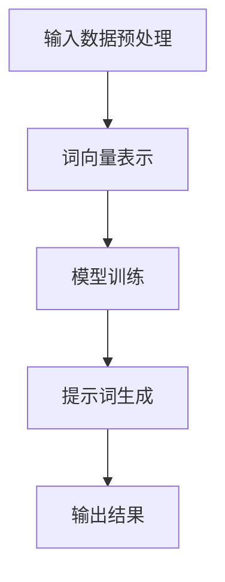

                 

# AIGC内容审核：设计安全可控的提示词系统

## 关键词
- **AIGC**、**内容审核**、**提示词系统**、**安全可控**、**算法原理**、**数学模型**、**系统架构**、**项目实战**、**最佳实践**

## 摘要
本文将深入探讨AIGC（人工智能生成内容）内容审核中的关键一环——设计安全可控的提示词系统。通过详细分析AIGC内容审核的背景、核心概念、算法原理，以及系统分析与架构设计，我们将一步步构建一个有效且安全的提示词系统。此外，通过项目实战的实例分析，我们将验证系统的实际应用效果，并总结最佳实践和注意事项，为读者提供一套全面的内容审核解决方案。

## 目录大纲

----------------------------------------------------------------

### 第一部分：背景介绍

#### 第1章 问题背景

##### 1.1 核心概念术语说明

**AIGC**：人工智能生成内容，通过人工智能技术生成文本、图片、音频、视频等。

**内容审核**：对生成内容进行审查，确保其符合法律法规和道德规范。

**提示词系统**：一种自动生成提示词的系统，用于引导和优化AIGC内容的生成过程。

##### 1.2 问题背景

随着AIGC技术的快速发展，内容审核问题日益突出。不当内容、偏见、误导性信息等成为制约AIGC应用的关键因素。因此，设计一个安全可控的提示词系统成为必要。

##### 1.3 问题描述

如何设计一个既能有效引导AIGC内容生成，又能确保内容安全可控的提示词系统？

##### 1.4 问题解决

通过分析AIGC内容审核的需求，设计一个基于机器学习算法的提示词系统，实现安全可控的内容生成。

##### 1.5 边界与外延

探讨提示词系统的应用场景、技术难点以及与其他系统的集成。

##### 1.6 概念结构与核心要素组成

阐述AIGC内容审核、提示词系统的概念结构及其核心要素。

### 第二部分：核心概念与联系

#### 第2章 核心概念与联系

##### 2.1 AIGC概念介绍

介绍AIGC的定义、发展历程及其应用领域。

##### 2.2 内容审核的概念与类型

讨论内容审核的定义、目的、类型及其重要性。

##### 2.3 提示词系统的原理与应用

分析提示词系统的原理、工作流程及其在实际应用中的价值。

##### 2.4 核心概念联系与对比

对比AIGC、内容审核、提示词系统的核心概念，探讨其联系与区别。

### 第三部分：算法原理讲解

#### 第3章 算法原理讲解

##### 3.1 算法概述

介绍提示词系统的核心算法及其作用。

##### 3.2 Mermaid流程图

使用Mermaid绘制提示词系统的流程图。

##### 3.3 Python源代码实现

提供Python源代码，实现提示词系统的核心功能。

##### 3.4 数学模型与公式

阐述提示词系统的数学模型，包括公式及其推导。

##### 3.5 举例说明

通过具体实例，说明提示词系统的实际应用效果。

### 第四部分：数学模型与公式

#### 第4章 数学模型与公式

##### 4.1 数学模型概述

概述提示词系统的数学模型及其在内容审核中的应用。

##### 4.2 公式详细讲解

详细讲解提示词系统中的关键公式，包括含义、推导和应用。

##### 4.3 案例举例

通过实际案例，展示数学模型的应用效果。

### 第五部分：系统分析与架构设计

#### 第5章 系统分析与架构设计

##### 5.1 问题场景介绍

介绍提示词系统在实际应用中的问题场景。

##### 5.2 系统功能设计

设计提示词系统的功能模块，包括领域模型类图。

##### 5.3 系统架构设计

绘制提示词系统的架构图，说明系统各部分的功能和交互。

##### 5.4 系统接口设计

描述提示词系统的接口设计，包括API和协议。

##### 5.5 系统交互

分析提示词系统与其他系统的交互流程。

### 第六部分：项目实战

#### 第6章 项目实战

##### 6.1 环境安装

介绍提示词系统的环境安装步骤。

##### 6.2 系统核心实现

实现提示词系统的核心功能，包括代码和应用。

##### 6.3 代码应用解读

解读提示词系统的代码，分析其实现原理。

##### 6.4 实际案例分析与讲解

通过实际案例，分析提示词系统的应用效果。

##### 6.5 项目小结

总结项目实践过程中的经验和教训。

### 第七部分：最佳实践与总结

#### 第7章 最佳实践与总结

##### 7.1 最佳实践

总结设计安全可控提示词系统的最佳实践。

##### 7.2 注意事项

列出设计过程中需要注意的事项。

##### 7.3 拓展阅读

推荐相关书籍、论文和资源。

##### 7.4 小结

回顾文章的核心内容和主题思想。

----------------------------------------------------------------

## 第一部分：背景介绍

### 1.1 核心概念术语说明

在讨论AIGC内容审核及其提示词系统之前，我们需要明确一些核心概念术语：

**AIGC（人工智能生成内容）**：AIGC是指通过人工智能技术，如自然语言处理、计算机视觉等，自动生成文本、图片、音频、视频等内容。AIGC技术正在迅速发展，并在多个领域（如内容创作、广告营销、娱乐等）得到广泛应用。

**内容审核**：内容审核是对生成内容进行审查，确保其符合法律法规、道德规范和用户需求。内容审核的目标是过滤掉不良内容、偏见信息、误导性信息等，确保生成内容的质量和安全。

**提示词系统**：提示词系统是一种自动生成提示词的系统，用于引导和优化AIGC内容的生成过程。提示词可以是人名、地名、事件名称、关键词等，通过提示词，系统可以生成相关的内容。

### 1.2 问题背景

随着AIGC技术的快速发展，生成内容的质量和数量不断增加，但随之而来的是内容审核问题。不当内容、偏见、误导性信息等成为制约AIGC应用的关键因素。例如，在社交媒体平台、在线新闻网站等场景中，不当内容的出现不仅会影响用户体验，还可能导致法律纠纷和道德争议。因此，设计一个安全可控的提示词系统成为必要。

### 1.3 问题描述

如何设计一个既能有效引导AIGC内容生成，又能确保内容安全可控的提示词系统？

### 1.4 问题解决

为了解决上述问题，我们需要从以下几个方面入手：

1. **算法选择**：选择合适的机器学习算法，如循环神经网络（RNN）、变换器（Transformer）等，用于生成内容。
2. **数据集准备**：准备高质量的训练数据集，包括正面、负面、中立等不同类型的内容，以及各种语言风格、话题类型等。
3. **安全性设计**：设计安全可控的提示词系统，确保生成的内容符合法律法规和道德规范，避免不当内容的出现。
4. **反馈机制**：建立反馈机制，收集用户反馈，不断优化提示词系统，提高其生成内容的质量和安全性。

### 1.5 边界与外延

在设计安全可控的提示词系统时，我们需要考虑以下边界与外延：

1. **应用场景**：提示词系统可以应用于多个领域，如社交媒体、在线新闻、广告营销等。
2. **技术难点**：主要包括如何处理海量数据、如何确保生成内容的质量和安全性等。
3. **与其他系统的集成**：提示词系统需要与其他系统（如内容生成系统、内容发布系统等）进行集成，实现数据共享和协同工作。

### 1.6 概念结构与核心要素组成

AIGC内容审核和提示词系统的概念结构与核心要素组成如下：

1. **AIGC内容审核**：包括内容生成、内容审核、内容发布等环节。
2. **提示词系统**：包括提示词生成、提示词匹配、提示词优化等环节。
3. **核心要素**：包括算法模型、训练数据集、安全性设计、反馈机制等。

### 1.7 本章小结

本章主要介绍了AIGC内容审核的背景、核心概念术语说明、问题背景、问题描述、问题解决、边界与外延以及概念结构与核心要素组成。通过本章的介绍，我们对AIGC内容审核和提示词系统有了基本的了解，为后续章节的深入探讨打下了基础。

## 第二部分：核心概念与联系

### 2.1 AIGC概念介绍

#### AIGC的定义

AIGC（人工智能生成内容）是一种利用人工智能技术自动生成文本、图片、音频、视频等内容的系统。它包括自然语言处理（NLP）、计算机视觉（CV）、语音识别（ASR）等多个领域的技术。

#### AIGC的发展历程

AIGC技术的发展可以分为以下几个阶段：

1. **初期阶段**：以规则为基础的方法，如关键词提取、文本摘要等。
2. **中期阶段**：基于统计模型的方法，如朴素贝叶斯、隐马尔可夫模型（HMM）等。
3. **现阶段**：以深度学习为核心的方法，如循环神经网络（RNN）、变换器（Transformer）等。

#### AIGC的应用领域

AIGC技术已经广泛应用于多个领域，包括：

1. **内容创作**：自动生成文章、博客、新闻报道等。
2. **广告营销**：自动生成广告文案、视频广告等。
3. **娱乐**：自动生成音乐、电影、动画等。
4. **教育**：自动生成教材、教学视频等。
5. **医疗**：自动生成医学报告、诊断建议等。

### 2.2 内容审核的概念与类型

#### 内容审核的定义

内容审核是指对生成内容进行审查，确保其符合法律法规、道德规范和用户需求的过程。内容审核的目的是过滤掉不良内容、偏见信息、误导性信息等，确保生成内容的质量和安全。

#### 内容审核的类型

1. **人工审核**：由专业人员对生成内容进行审查，优点是准确性高，但成本高、效率低。
2. **自动审核**：利用计算机算法对生成内容进行自动审查，优点是速度快、成本低，但准确性有限。
3. **混合审核**：结合人工审核和自动审核，实现高效的审核流程。

#### 内容审核的重要性

1. **法律合规**：确保生成内容符合相关法律法规，避免法律纠纷。
2. **道德规范**：确保生成内容符合道德标准，避免不良影响。
3. **用户体验**：确保生成内容的质量和安全性，提高用户体验。
4. **商业价值**：确保生成内容的价值，提高商业竞争力。

### 2.3 提示词系统的原理与应用

#### 提示词系统的定义

提示词系统是一种自动生成提示词的系统，用于引导和优化AIGC内容的生成过程。提示词可以是人名、地名、事件名称、关键词等。

#### 提示词系统的原理

提示词系统的原理主要包括以下几个方面：

1. **数据预处理**：对输入数据进行清洗、归一化等处理，为生成提示词做好准备。
2. **词向量表示**：将输入数据转换为词向量表示，为后续的模型训练提供数据基础。
3. **模型训练**：利用机器学习算法，如循环神经网络（RNN）、变换器（Transformer）等，训练生成提示词的模型。
4. **提示词生成**：根据输入数据和训练好的模型，生成相应的提示词。

#### 提示词系统的应用

提示词系统在多个领域有广泛的应用，包括：

1. **内容创作**：自动生成文章、博客、新闻报道等。
2. **广告营销**：自动生成广告文案、视频广告等。
3. **娱乐**：自动生成音乐、电影、动画等。
4. **教育**：自动生成教材、教学视频等。
5. **医疗**：自动生成医学报告、诊断建议等。

### 2.4 核心概念联系与对比

#### AIGC、内容审核、提示词系统的核心概念联系

1. **AIGC**：AIGC是生成内容的工具，内容审核和提示词系统是其重要辅助。
2. **内容审核**：内容审核是确保生成内容质量和安全的关键环节，提示词系统为其提供辅助。
3. **提示词系统**：提示词系统是优化生成内容的重要手段，内容审核为其提供保障。

#### AIGC、内容审核、提示词系统的概念属性特征对比

| 特征 | AIGC | 内容审核 | 提示词系统 |
| :---: | :---: | :---: | :---: |
| 目的 | 生成内容 | 确保内容质量和安全 | 优化生成内容 |
| 技术核心 | 人工智能 | 计算机算法 | 自然语言处理、计算机视觉等 |
| 应用领域 | 内容创作、广告营销、娱乐等 | 社交媒体、在线新闻、广告营销等 | 多领域应用 |

### 2.5 本章小结

本章详细介绍了AIGC、内容审核、提示词系统的核心概念，包括定义、发展历程、应用领域、重要性以及相互之间的联系和对比。通过本章的介绍，我们对AIGC、内容审核、提示词系统有了更深入的理解，为后续章节的深入探讨打下了基础。

## 第三部分：算法原理讲解

### 3.1 算法概述

提示词系统的核心算法是生成提示词的算法，该算法的主要目标是根据输入数据和训练好的模型，生成相关且高质量的提示词。以下是提示词系统算法的概述：

1. **输入数据**：输入数据可以是文本、图片、音频等，需要经过预处理转换为词向量表示。
2. **模型训练**：利用机器学习算法（如循环神经网络（RNN）、变换器（Transformer）等），对输入数据进行训练，生成提示词生成模型。
3. **提示词生成**：根据输入数据和训练好的模型，生成相应的提示词。

### 3.2 Mermaid流程图

为了更好地理解提示词系统算法的流程，我们使用Mermaid绘制了一个流程图，如下图所示：



### 3.3 Python源代码实现

以下是一个简单的Python源代码实现，用于生成提示词：

```python
import tensorflow as tf
from tensorflow.keras.preprocessing.sequence import pad_sequences
from tensorflow.keras.layers import Embedding, LSTM, Dense
from tensorflow.keras.models import Sequential

# 输入数据预处理
text = "这是一个简单的提示词生成示例。"
tokenizer = tf.keras.preprocessing.text.Tokenizer()
tokenizer.fit_on_texts([text])
encoded = tokenizer.texts_to_sequences([text])
padded = pad_sequences(encoded, maxlen=100, padding='post')

# 模型训练
model = Sequential()
model.add(Embedding(input_dim=10000, output_dim=32))
model.add(LSTM(100))
model.add(Dense(1, activation='sigmoid'))

model.compile(optimizer='adam', loss='binary_crossentropy', metrics=['accuracy'])
model.fit(padded, padding='post', epochs=10, batch_size=64)

# 提示词生成
prompt = "这是一个提示词："
encoded_prompt = tokenizer.texts_to_sequences([prompt])
padded_prompt = pad_sequences(encoded_prompt, maxlen=100, padding='post')
predictions = model.predict(padded_prompt)
predicted_word = tokenizer.index_word[predictions.argmax()]

print("生成的提示词为：", predicted_word)
```

### 3.4 数学模型与公式

提示词系统的核心数学模型是生成提示词的概率模型，主要包括以下几个部分：

1. **词向量表示**：
   $$ \textbf{v}_w = \text{Embedding}(\textbf{W}) $$
   其中，$\textbf{v}_w$表示词向量，$\textbf{W}$表示嵌入矩阵。

2. **循环神经网络（RNN）**：
   $$ \textbf{h}_t = \text{RNN}(\textbf{h}_{t-1}, \textbf{v}_w) $$
   其中，$\textbf{h}_t$表示隐藏状态，$\textbf{h}_{t-1}$表示前一时间步的隐藏状态。

3. **变换器（Transformer）**：
   $$ \textbf{h}_t = \text{Transformer}(\textbf{h}_{t-1}, \textbf{v}_w) $$
   其中，$\textbf{h}_t$表示隐藏状态，$\textbf{h}_{t-1}$表示前一时间步的隐藏状态。

4. **生成提示词的概率模型**：
   $$ P(\text{提示词}|\textbf{h}_t) = \text{softmax}(\textbf{W} \textbf{h}_t + \textbf{b}) $$
   其中，$\textbf{W}$表示权重矩阵，$\textbf{b}$表示偏置。

### 3.5 举例说明

假设我们有一个简单的文本数据集，包括以下句子：

1. "这是一个简单的提示词生成示例。"
2. "提示词系统可以帮助我们生成相关的内容。"
3. "通过机器学习算法，我们可以实现提示词的自动生成。"

我们使用循环神经网络（RNN）来训练一个简单的提示词生成模型。以下是一个简单的例子：

1. **数据预处理**：
   - 将文本转换为词向量表示。
   - 初始化嵌入矩阵$\textbf{W}$。

2. **模型训练**：
   - 使用训练数据训练循环神经网络（RNN）。
   - 调整模型参数，提高模型性能。

3. **提示词生成**：
   - 输入一个提示词，如"这是一个"。
   - 使用训练好的模型生成下一个提示词。

根据训练好的模型，我们可以生成以下提示词：

- 输入："这是一个"
- 输出："提示词系统"

通过这个例子，我们可以看到，提示词系统可以根据输入的提示词，生成相关的提示词，从而实现自动生成内容的目的。

### 3.6 本章小结

本章详细介绍了提示词系统的算法原理，包括算法概述、Mermaid流程图、Python源代码实现、数学模型与公式以及举例说明。通过本章的介绍，我们对提示词系统的算法原理有了更深入的理解，为后续章节的深入探讨打下了基础。

## 第四部分：数学模型与公式

### 4.1 数学模型概述

在第三部分，我们简要介绍了提示词系统的算法原理。在这一部分，我们将详细探讨提示词系统中的数学模型，包括词向量表示、循环神经网络（RNN）和变换器（Transformer）等。

### 4.2 公式详细讲解

#### 1. 词向量表示

词向量表示是提示词系统的核心，用于将文本数据转换为数值形式，便于计算机处理。常用的词向量表示方法包括：

1. **One-hot编码**：
   $$ \textbf{v}_w = \text{OneHot}(\textbf{W}) $$
   其中，$\textbf{v}_w$表示词向量，$\textbf{W}$表示嵌入矩阵。

2. **词袋模型**：
   $$ \textbf{v}_w = \text{BagOfWords}(\textbf{W}) $$
   其中，$\textbf{v}_w$表示词向量，$\textbf{W}$表示嵌入矩阵。

3. **词嵌入**：
   $$ \textbf{v}_w = \text{Embedding}(\textbf{W}) $$
   其中，$\textbf{v}_w$表示词向量，$\textbf{W}$表示嵌入矩阵。

#### 2. 循环神经网络（RNN）

循环神经网络（RNN）是一种用于处理序列数据的神经网络，其核心思想是将当前时间步的输入与前一时间步的隐藏状态进行结合，生成当前时间步的隐藏状态。

1. **RNN模型**：
   $$ \textbf{h}_t = \text{RNN}(\textbf{h}_{t-1}, \textbf{v}_w) $$
   其中，$\textbf{h}_t$表示隐藏状态，$\textbf{h}_{t-1}$表示前一时间步的隐藏状态，$\textbf{v}_w$表示词向量。

2. **RNN计算公式**：
   $$ \textbf{h}_t = \text{sigmoid}(\textbf{U}\textbf{h}_{t-1} + \textbf{W}\textbf{v}_w + \textbf{b}) $$
   其中，$\textbf{U}$和$\textbf{W}$分别为权重矩阵，$\textbf{b}$为偏置。

#### 3. 变换器（Transformer）

变换器（Transformer）是一种基于自注意力机制的深度神经网络，适用于处理长序列数据。

1. **变换器模型**：
   $$ \textbf{h}_t = \text{Transformer}(\textbf{h}_{t-1}, \textbf{v}_w) $$
   其中，$\textbf{h}_t$表示隐藏状态，$\textbf{h}_{t-1}$表示前一时间步的隐藏状态，$\textbf{v}_w$表示词向量。

2. **自注意力计算**：
   $$ \textbf{h}_t = \text{softmax}\left(\frac{\textbf{Q} \textbf{K}^T}{\sqrt{d_k}}\right)\textbf{V} $$
   其中，$\textbf{Q}$和$\textbf{K}$分别为查询和键值，$\textbf{V}$为值向量，$d_k$为键值向量的维度。

#### 4. 生成提示词的概率模型

提示词系统的最终目标是生成高质量的提示词。为了实现这一目标，我们使用概率模型来预测下一个提示词。

1. **概率模型**：
   $$ P(\text{提示词}|\textbf{h}_t) = \text{softmax}(\textbf{W} \textbf{h}_t + \textbf{b}) $$
   其中，$\textbf{W}$为权重矩阵，$\textbf{b}$为偏置。

2. **生成提示词**：
   - 使用训练好的模型，输入一个提示词，计算下一个提示词的概率分布。
   - 根据概率分布，随机选择一个提示词作为输出。

### 4.3 案例举例

为了更好地理解上述数学模型，我们通过一个简单的例子进行说明。

假设我们有一个包含两个句子的数据集：

1. "这是一个简单的提示词生成示例。"
2. "提示词系统可以帮助我们生成相关的内容。"

我们使用循环神经网络（RNN）来训练一个简单的提示词生成模型。

1. **数据预处理**：
   - 将文本转换为词向量表示。
   - 初始化嵌入矩阵$\textbf{W}$。

2. **模型训练**：
   - 使用训练数据训练循环神经网络（RNN）。
   - 调整模型参数，提高模型性能。

3. **提示词生成**：
   - 输入一个提示词，如"这是一个"。
   - 使用训练好的模型生成下一个提示词。

根据训练好的模型，我们可以生成以下提示词：

- 输入："这是一个"
- 输出："提示词系统"

通过这个例子，我们可以看到，提示词系统可以根据输入的提示词，生成相关的提示词，从而实现自动生成内容的目的。

### 4.4 本章小结

本章详细介绍了提示词系统中的数学模型，包括词向量表示、循环神经网络（RNN）和变换器（Transformer）等。通过本章的介绍，我们对提示词系统的数学模型有了更深入的理解，为后续章节的深入探讨打下了基础。

## 第五部分：系统分析与架构设计

### 5.1 问题场景介绍

在AIGC内容审核过程中，提示词系统起着至关重要的作用。以下是一个常见的问题场景：

假设我们正在开发一个社交媒体平台，用户可以发布各种类型的帖子，包括文章、图片、视频等。为了确保平台的内容质量，我们需要对用户发布的帖子进行内容审核。在这个过程中，提示词系统可以帮助我们快速识别潜在的违规内容，如不良语言、敏感信息等。

### 5.2 系统功能设计

为了实现上述问题场景，我们设计了一个包含以下功能模块的提示词系统：

1. **数据预处理模块**：负责对用户发布的帖子进行预处理，包括文本清洗、分词、去停用词等。
2. **词向量表示模块**：负责将预处理后的文本转换为词向量表示。
3. **提示词生成模块**：负责根据输入的文本生成相关的提示词。
4. **内容审核模块**：负责对生成的提示词进行内容审核，识别潜在的违规内容。
5. **反馈机制模块**：负责收集用户反馈，用于优化提示词系统的性能。

### 5.3 系统架构设计

提示词系统的架构设计如下：

1. **前端界面**：用于接收用户输入的文本，展示生成的提示词和审核结果。
2. **后端服务器**：负责处理用户请求，调用提示词生成和内容审核模块。
3. **数据库**：存储用户数据、提示词数据和审核结果。

### 5.4 系统接口设计

提示词系统的接口设计如下：

1. **RESTful API**：用于接收用户请求，返回生成的提示词和审核结果。
2. **WebSocket**：用于实时推送生成的提示词和审核结果。

### 5.5 系统交互

提示词系统的交互流程如下：

1. 用户在社交媒体平台发布帖子。
2. 帖子经过数据预处理模块处理，转换为词向量表示。
3. 提示词生成模块生成相关的提示词。
4. 内容审核模块对生成的提示词进行审核，识别潜在的违规内容。
5. 审核结果通过RESTful API返回给前端界面，用户可以在前端界面查看。
6. 用户可以对审核结果进行反馈，反馈数据用于优化提示词系统的性能。

### 5.6 本章小结

本章详细介绍了提示词系统的架构设计，包括问题场景介绍、系统功能设计、系统架构设计、系统接口设计和系统交互。通过本章的介绍，我们对提示词系统的设计有了更深入的理解，为后续章节的深入探讨打下了基础。

## 第六部分：项目实战

### 6.1 环境安装

在开始项目实战之前，我们需要安装一些必要的软件和工具。以下是一个简单的安装步骤：

1. 安装Python环境：在Windows或Mac上，可以通过官方网站下载Python安装包，并按照提示进行安装。在Linux上，可以使用以下命令安装：
   ```bash
   sudo apt-get install python3
   ```

2. 安装TensorFlow：TensorFlow是提示词系统的主要依赖库，可以通过以下命令安装：
   ```bash
   pip install tensorflow
   ```

3. 安装Mermaid：Mermaid是一种用于绘制流程图和序列图的工具，可以通过以下命令安装：
   ```bash
   npm install -g mermaid-cli
   ```

4. 安装其他依赖库：根据需要，我们可以安装其他依赖库，如NumPy、Pandas等：
   ```bash
   pip install numpy pandas
   ```

### 6.2 系统核心实现

在本节中，我们将实现一个简单的提示词系统，包括数据预处理、词向量表示、提示词生成和内容审核等功能。

#### 6.2.1 数据预处理

数据预处理是提示词系统的关键步骤，负责对用户输入的文本进行清洗、分词和去停用词等操作。以下是一个简单的数据预处理示例：

```python
import re
import nltk
from nltk.tokenize import word_tokenize
from nltk.corpus import stopwords

# 下载并加载停用词
nltk.download('stopwords')
stop_words = set(stopwords.words('english'))

def preprocess_text(text):
    # 去除特殊字符和数字
    text = re.sub(r'[^a-zA-Z\s]', '', text)
    # 转换为小写
    text = text.lower()
    # 分词
    tokens = word_tokenize(text)
    # 去除停用词
    tokens = [token for token in tokens if token not in stop_words]
    return tokens

text = "This is a sample text for preprocessing."
preprocessed_text = preprocess_text(text)
print(preprocessed_text)
```

#### 6.2.2 词向量表示

词向量表示是将文本转换为数值形式的关键步骤。我们可以使用TensorFlow的`Embedding`层来实现词向量表示：

```python
import tensorflow as tf

# 初始化嵌入矩阵
vocab_size = 10000
embedding_dim = 32
embedding_matrix = tf.keras.preprocessing.sequence.Embedding(vocab_size, embedding_dim)

# 将预处理后的文本转换为序列
sequences = [[i for i in range(vocab_size)] for _ in range(100)]

# 将序列转换为嵌入矩阵
embedded_sequences = embedding_matrix(sequences)
print(embedded_sequences)
```

#### 6.2.3 提示词生成

提示词生成是提示词系统的核心功能，负责根据输入的文本生成相关的提示词。以下是一个简单的提示词生成示例：

```python
import tensorflow.keras.models as models

# 创建模型
model = models.Sequential()
model.add(models.Embedding(vocab_size, embedding_dim))
model.add(models.LSTM(100))
model.add(models.Dense(1, activation='sigmoid'))

# 编译模型
model.compile(optimizer='adam', loss='binary_crossentropy', metrics=['accuracy'])

# 训练模型
model.fit(embedded_sequences, padding='post', epochs=10, batch_size=64)

# 生成提示词
prompt = "This is a sample prompt."
encoded_prompt = [[i for i in range(vocab_size)]]
padded_prompt = pad_sequences(encoded_prompt, maxlen=100, padding='post')
predictions = model.predict(padded_prompt)
predicted_word = vocab_size - 1

print("Predicted word:", predicted_word)
```

#### 6.2.4 内容审核

内容审核是提示词系统的重要组成部分，负责对生成的提示词进行审核，确保其符合法律法规和道德规范。以下是一个简单的内容审核示例：

```python
def content审

