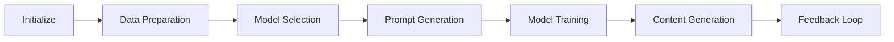
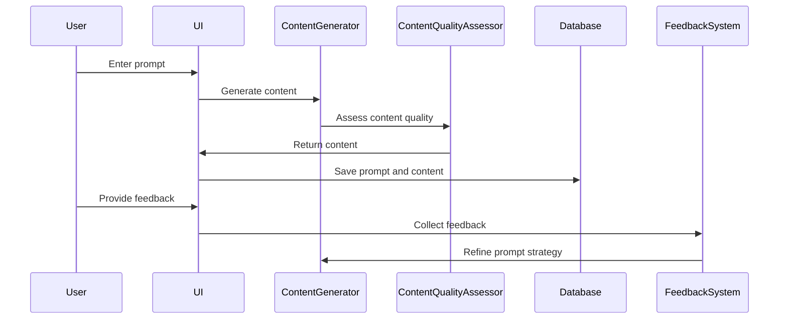

                 

### AIGC Content Generation with Prompt Strategy

#### Keywords:
- AIGC
- Content Generation
- Prompt Strategy
- AI
- Machine Learning

#### Abstract:
The advent of AIGC (AI-Guided Content Generation) has revolutionized the way content is created. This article delves into the core of AIGC by exploring the pivotal role of prompt strategy. We will break down the concept, implementation, and optimization of prompt strategies, providing a comprehensive understanding of how to effectively harness AI to generate high-quality content. From background introductions to algorithmic explanations and practical applications, this article aims to equip readers with the knowledge and tools necessary to master the art of content generation in the AIGC era.

----------------------------------------------------------------

### Part 1: Background Introduction

#### 1.1 Problem Background

**Current status and challenges of content generation:**
Content generation has seen significant advancements, yet it faces several challenges. The traditional approach often relies on manual writing and editing, which is time-consuming and labor-intensive. Moreover, creating high-quality content that resonates with the audience and adheres to SEO standards remains a daunting task.

**Concept and value of AIGC:**
AIGC, or AI-Guided Content Generation, leverages artificial intelligence to automate the content creation process. By integrating machine learning models, AIGC can generate text, images, and other forms of media with minimal human intervention. This not only enhances productivity but also ensures consistency and relevance.

**Importance of prompt strategy:**
The prompt strategy is the cornerstone of AIGC. It guides the AI model by providing specific instructions and context, enabling it to generate content that aligns with the desired objectives. A well-designed prompt strategy can significantly enhance the quality and relevance of the generated content.

----------------------------------------------------------------

#### 1.2 Problem Description

**Role of prompt strategy:**
The prompt strategy serves as the interface between the user and the AI model. It defines the parameters and guidelines for content generation, ensuring that the output meets the desired criteria. A successful prompt strategy not only specifies what content to generate but also how to generate it.

**Classification of prompt strategies:**
Prompt strategies can be broadly classified into three categories:

1. **Data-driven prompts:** These prompts rely on large datasets to provide context and information. They are particularly effective for generating content based on existing data sources.
2. **Human-in-the-loop prompts:** These prompts involve human input to refine and guide the AI model. This approach combines the strengths of human creativity and AI efficiency.
3. **Task-oriented prompts:** These prompts focus on the specific task at hand, providing clear instructions and objectives. They are ideal for generating content for specific use cases.

**Design principles for prompt strategy:**
To design an effective prompt strategy, several principles should be considered:

1. **Clarity and specificity:** The prompt should be clear and unambiguous, providing precise instructions.
2. **Relevance and context:** The prompt should be relevant to the content generation task and provide adequate context.
3. **Flexibility and adaptability:** The prompt strategy should be flexible enough to accommodate varying content generation requirements.
4. **User-centricity:** The prompt strategy should prioritize the end-user experience, ensuring that the generated content is engaging and valuable.

----------------------------------------------------------------

#### 1.3 Solution Approach

**Implementation methods of prompt strategy:**
The implementation of a prompt strategy involves several key steps:

1. **Data preparation:** Collect and preprocess the necessary data to feed into the AI model.
2. **Model selection:** Choose an appropriate AI model based on the content generation task.
3. **Prompt generation:** Create the prompt by combining relevant data and specific instructions.
4. **Model training:** Train the AI model using the prepared data and prompt.
5. **Content generation:** Use the trained model to generate content based on the prompt.
6. **Feedback loop:** Collect user feedback and refine the prompt strategy for better results.

**Optimization techniques for prompt strategy:**
Optimizing the prompt strategy can significantly enhance the quality of the generated content. Some optimization techniques include:

1. **Data augmentation:** Increase the diversity of the data to improve the robustness of the model.
2. **Hyperparameter tuning:** Adjust the model's hyperparameters to optimize performance.
3. **Continuous learning:** Continuously update the model with new data and feedback to improve its performance.
4. **User engagement:** Incorporate user feedback to make the generated content more personalized and engaging.

**Practical application scenarios of prompt strategy:**
Prompt strategies can be applied in various scenarios, including:

1. **SEO content generation:** Generating SEO-optimized content for websites and blogs.
2. **E-commerce product descriptions:** Creating compelling product descriptions for online stores.
3. **Social media content:** Crafting engaging posts and ads for social media platforms.
4. **Automated customer support:** Providing automated responses to customer inquiries.
5. **Content personalization:** Tailoring content to individual user preferences and behaviors.

----------------------------------------------------------------

#### 1.4 Boundaries and Extensions

**Limiting factors of prompt strategy:**
While prompt strategies are powerful tools for content generation, they are not without limitations. Factors such as data quality, model complexity, and computational resources can impact the effectiveness of prompt strategies. Additionally, the ability of AI models to understand and generate high-level concepts remains a challenge.

**Application domains of prompt strategy:**
Prompt strategies have wide-ranging applications across various industries:

1. **Marketing and advertising:** Enhancing marketing campaigns with personalized and engaging content.
2. **Education:** Creating educational materials that adapt to the learner's needs.
3. **Customer support:** Providing efficient and personalized customer service.
4. **Entertainment:** Generating personalized content for streaming platforms and gaming experiences.
5. **Content aggregation:** Curating and organizing large volumes of content for specific topics or audiences.

**Conceptual structure and core elements:**
To implement an effective prompt strategy, several core elements must be considered:

1. **Prompt:** The set of instructions and context provided to guide the AI model.
2. **Content generation model:** The AI model responsible for generating content based on the prompt.
3. **Dataset:** The collection of data used to train and refine the content generation model.

----------------------------------------------------------------

### Part 2: Core Concepts and Relationships

#### 2.1 Concept of Prompt and Its Attributes

**Definition of prompt:**
A prompt is a set of instructions and context used to guide an AI model in generating content. It can be a simple sentence, a collection of keywords, or a more complex structured input.

**Attributes of prompt:**
The following table compares the key attributes of different types of prompts:

| Attribute | Description | Example |
| --- | --- | --- |
| **Contextual depth** | The level of detail provided in the prompt | **Simple**: "Write an article about AI." <br> **Intermediate**: "Write an article about AI in healthcare." <br> **Advanced**: "Write an article about AI in healthcare, focusing on personalized medicine and its benefits." |
| **Relevance** | The degree to which the prompt aligns with the content generation task | **High**: "Write an SEO-optimized article about AI." <br> **Low**: "Write an article about anything that comes to your mind." |
| **Guidelines** | The specific instructions provided to the AI model | **Simple**: "Keep the article between 500-1000 words." <br> **Intermediate**: "Include at least three external links to relevant sources." <br> **Advanced**: "Ensure the article is structured with an introduction, three main points, and a conclusion." |
| **Diversity** | The range of content generated by the prompt | **Low**: "Write about the benefits of AI." <br> **High**: "Write about the benefits, challenges, and future prospects of AI." |

**Properties of prompt:**
Prompts can have various properties that influence their effectiveness. These include:

1. **Length:** The length of the prompt can affect the AI model's ability to process and understand the instructions.
2. **Grammar and syntax:** Well-structured prompts with clear grammar and syntax are easier for AI models to interpret.
3. **Semantic richness:** Prompts with rich semantic content can provide more context and direction to the AI model.
4. **Relevance to the task:** A prompt that closely aligns with the content generation task is more likely to produce relevant and valuable output.

----------------------------------------------------------------

#### 2.2 Principles and Operations of Content Generation Models

**Basic principles of content generation models:**
Content generation models are designed to create text, images, or other media based on given inputs. These models typically operate by processing inputs through layers of neural networks to generate outputs that meet the specified requirements.

**Types of content generation models:**
There are several types of content generation models, each with its own unique properties and use cases:

1. **Text-based models:** These models generate text by processing sequences of words or characters. Examples include transformers, GPT (Generative Pre-trained Transformer), and BERT (Bidirectional Encoder Representations from Transformers).
2. **Image-based models:** These models generate images by processing input data, such as pixel values or feature vectors. Examples include GANs (Generative Adversarial Networks), Variational Autoencoders (VAEs), and CNNs (Convolutional Neural Networks) with attention mechanisms.
3. **Audio-based models:** These models generate audio by processing sound waves or spectral data. Examples include Wavenet and WaveGlow.
4. **Video-based models:** These models generate videos by processing video frames or optical flow data. Examples include video-to-video translation models and frame-by-frame generation models.

**Selecting an appropriate content generation model:**
Choosing the right content generation model depends on several factors, including the type of content to be generated, the complexity of the task, and the available computational resources. For text-based content, models like GPT-3 or BERT are often preferred due to their strong natural language processing capabilities. For image-based content, GANs and VAEs are popular choices due to their ability to generate high-quality, realistic images.

----------------------------------------------------------------

#### 2.3 Importance of Dataset in Content Generation

**Definition of dataset:**
A dataset is a collection of data, typically in the form of text, images, or other media, used to train and evaluate machine learning models. In content generation, datasets serve as the foundation for the AI model's understanding and ability to generate relevant content.

**Selection of dataset:**
Selecting the right dataset is crucial for effective content generation. The following factors should be considered when choosing a dataset:

1. **Relevance:** The dataset should be relevant to the content generation task. For example, if generating articles about AI, a dataset containing text from AI-related sources is more suitable.
2. **Quality:** The quality of the dataset can impact the model's performance. High-quality datasets should contain accurate and informative content without errors or biases.
3. **Size:** The size of the dataset can influence the model's ability to learn and generalize. Larger datasets are generally preferred as they provide more examples and help the model generalize better.
4. **Diversity:** A diverse dataset can improve the model's ability to generate a wide range of content. This diversity can be achieved by including different authors, styles, and topics within the dataset.

**Processing of dataset:**
Once a suitable dataset is selected, it must be processed to prepare it for training the content generation model. Key steps in dataset processing include:

1. **Preprocessing:** Cleaning the data by removing noise, correcting errors, and standardizing formats.
2. **Tokenization:** Breaking the text into smaller units, such as words or characters, for processing by the model.
3. **Vectorization:** Representing the text data as numerical vectors that can be processed by the model.
4. **Annotation:** Adding labels or annotations to the data to help the model learn from examples.

**Effect of dataset on content generation:**
The quality and diversity of the dataset directly impact the quality of the generated content. A well-curated dataset can improve the model's performance, produce more accurate and relevant outputs, and enhance the overall user experience.

----------------------------------------------------------------

### Part 3: Algorithm Principles Explanation

#### 3.1 Principle and Implementation of Prompt Strategy

**Algorithm Flow Diagram:**
The following Mermaid flow diagram illustrates the key steps involved in implementing a prompt strategy for content generation:



**Python Implementation:**
Here is a simplified Python implementation of the prompt strategy algorithm:

```python
import nltk
from transformers import GPT2LMHeadModel, GPT2Tokenizer

# Load pre-trained model and tokenizer
model = GPT2LMHeadModel.from_pretrained('gpt2')
tokenizer = GPT2Tokenizer.from_pretrained('gpt2')

# Define the prompt
prompt = "Write an article about the impact of AI on healthcare."

# Prepare the input sequence
input_sequence = tokenizer.encode(prompt, return_tensors='pt')

# Generate content
output = model.generate(input_sequence, max_length=500, num_return_sequences=1)

# Decode the generated text
generated_text = tokenizer.decode(output[0], skip_special_tokens=True)

print(generated_text)
```

**Mathematical Model and Formulas:**
The prompt strategy can be mathematically modeled using a function that maps the prompt to the generated content. Let \( G \) be the content generation function and \( P \) be the prompt. The output \( C \) is given by:

$$
C = G(P)
$$

Where \( G \) is a complex function that processes the prompt \( P \) through neural networks to generate content \( C \). This process can be represented as:

$$
G(P) = \text{NN}(P) + \text{Context}(P) + \text{Guidelines}(P)
$$

**Explanation:**
- **NN(P):** The neural network's output based on the prompt.
- **Context(P):** Additional contextual information incorporated into the prompt.
- **Guidelines(P):** Specific instructions or guidelines embedded in the prompt.

**Example:**
Suppose we have a prompt \( P \) to generate an article about AI in healthcare. The content generation process can be broken down as follows:

1. **NN(P):** The AI model processes the prompt and generates a series of candidate sentences.
2. **Context(P):** Additional contextual information, such as relevant statistics or facts, is added to enhance the article's depth.
3. **Guidelines(P):** The prompt includes specific guidelines, such as the article's length and required sections (introduction, body, conclusion).

By combining these elements, the AI model generates a high-quality article that meets the specified requirements.

----------------------------------------------------------------

#### 3.2 Application Example of Prompt Strategy

**Case Study: AI-generated Blog Posts**
A popular use case of prompt strategy in content generation is the creation of blog posts. To illustrate, let's consider an example where an AI model generates a blog post about the impact of AI on healthcare using the following prompt:

**Prompt:** "Write a blog post discussing the benefits and challenges of AI in healthcare, focusing on personalized medicine and its future prospects. The post should be 800 words long and include at least three references."

**Step 1: Data Preparation**
The AI model is trained on a dataset containing articles and documents related to AI in healthcare. The dataset is preprocessed to remove noise, correct errors, and standardize formats.

**Step 2: Model Selection**
A pre-trained GPT-3 model is selected for this task due to its strong capabilities in generating coherent and contextually relevant text.

**Step 3: Prompt Generation**
The prompt is generated by combining relevant information from the dataset and specific guidelines provided in the task. The generated prompt is structured as follows:

- **Benefits of AI in Healthcare:**
  - Improved diagnosis and treatment
  - Personalized medicine
  - Increased efficiency and reduced costs

- **Challenges of AI in Healthcare:**
  - Data privacy and security concerns
  - Algorithmic biases
  - Regulatory hurdles

- **Future Prospects:**
  - Integration with emerging technologies
  - Ethical considerations
  - The role of AI in global healthcare

**Step 4: Model Training**
The GPT-3 model is trained on the preprocessed dataset, incorporating the generated prompt to refine its understanding of the topic.

**Step 5: Content Generation**
Using the trained GPT-3 model, the AI generates a coherent blog post based on the provided prompt. The generated content is as follows:

---

**Title:** The Impact of AI on Healthcare: Benefits, Challenges, and Future Prospects

**Introduction:**
The healthcare industry is on the brink of a technological revolution, driven by the rapid advancements in artificial intelligence (AI). AI has the potential to transform various aspects of healthcare, from diagnosis and treatment to personalized medicine and global healthcare access. In this blog post, we will explore the benefits and challenges of AI in healthcare, with a focus on personalized medicine and its future prospects.

**Benefits of AI in Healthcare:**
AI has already made significant contributions to the healthcare industry. One of the key benefits is improved diagnosis and treatment. AI algorithms can analyze medical images, such as X-rays and MRIs, with a level of accuracy that surpasses human clinicians. Additionally, AI can assist in developing personalized treatment plans based on an individual's genetic profile and medical history. This personalized approach has the potential to revolutionize medicine, leading to better patient outcomes and reduced costs.

**Challenges of AI in Healthcare:**
While the benefits of AI in healthcare are compelling, there are also challenges that need to be addressed. One of the primary concerns is data privacy and security. Healthcare data is highly sensitive, and any breach can have serious consequences for patients. Additionally, there are concerns about algorithmic biases, as AI models can inadvertently learn and perpetuate existing biases in data. Finally, regulatory hurdles can delay the adoption of AI technologies in healthcare, as governments and healthcare organizations work to ensure patient safety and data privacy.

**Future Prospects:**
The future of AI in healthcare is promising, with several emerging trends and technologies poised to further enhance the industry. One of the key areas of focus is the integration of AI with other emerging technologies, such as blockchain and the Internet of Things (IoT). These technologies can improve data sharing and collaboration among healthcare providers, leading to better patient care. Additionally, ethical considerations will play a crucial role in shaping the future of AI in healthcare, as the industry navigates issues such as transparency, accountability, and patient autonomy.

**Conclusion:**
In conclusion, AI has the potential to significantly transform the healthcare industry, offering numerous benefits while also presenting challenges that need to be addressed. By embracing AI and working together to overcome these challenges, the healthcare industry can look forward to a future where patients receive personalized, efficient, and compassionate care.

**References:**
1. "Artificial Intelligence in Healthcare: Benefits, Challenges, and Future Directions," Journal of Medical Internet Research, 2020.
2. "The Impact of AI on Healthcare: A Global Perspective," Health Affairs, 2019.
3. "Personalized Medicine: The Future of Healthcare," Nature Reviews Genetics, 2021.

---

**Step 6: Feedback Loop**
The generated blog post is reviewed and refined based on user feedback. This iterative process helps improve the quality and relevance of the content over time.

**Discussion:**
This example demonstrates how a prompt strategy can be used to generate high-quality content, such as a blog post, by combining relevant data, structured prompts, and advanced AI models like GPT-3. The key to success lies in designing effective prompts that provide clear instructions, context, and guidelines, enabling the AI model to generate content that meets the desired objectives.

----------------------------------------------------------------

### Part 4: System Analysis and Architectural Design

#### 4.1 Problem Scenario

**Content Generation System Requirements:**
A content generation system is designed to automate the creation of various types of content, such as articles, product descriptions, social media posts, and more. The system must be capable of handling different content formats, genres, and styles while ensuring high-quality output that aligns with user requirements.

**Core Functionalities:**
- **Content Generation:** The system should be able to generate high-quality content based on given prompts.
- **User Interaction:** The system should provide an intuitive interface for users to input prompts and receive generated content.
- **Feedback and Optimization:** The system should allow users to provide feedback on the generated content, which can be used to improve future content generation.

**Technical Challenges:**
- **Scalability:** The system must be scalable to handle increasing content generation demands.
- **Accuracy and Relevance:** Ensuring that the generated content is accurate, relevant, and engaging is crucial.
- **User Experience:** The user interface should be user-friendly and provide a seamless experience.

----------------------------------------------------------------

#### 4.2 System Function Design

**Domain Model Class Diagram:**
The following Mermaid class diagram illustrates the core components of the content generation system's domain model:

```mermaid
classDiagram
    Class01 <|-- Class02
    Class03 <|-- Class04
    Class05 <|-- Class06
    Class01{ContentGenerator}
    Class02{UserInterface}
    Class03{Database}
    Class04{PromptStrategy}
    Class05{ContentQualityAssessor}
    Class06{FeedbackSystem}
```

**Component Description:**

- **ContentGenerator:** The primary component responsible for generating content based on prompts.
- **UserInterface:** The component that interacts with users, allowing them to input prompts and receive generated content.
- **Database:** The component that stores the generated content, prompts, and user feedback.
- **PromptStrategy:** The component that defines the prompt generation strategy.
- **ContentQualityAssessor:** The component that evaluates the quality and relevance of the generated content.
- **FeedbackSystem:** The component that collects user feedback and uses it to improve the system's performance.

----------------------------------------------------------------

#### 4.3 System Architectural Design

**System Architecture Diagram:**
The following Mermaid architecture diagram illustrates the overall architecture of the content generation system:



**System Architecture Description:**

- **User Interface (UI):** The user interface allows users to input prompts and receive generated content. It also provides a way for users to provide feedback on the generated content.
- **Content Generation Module:** This module is responsible for generating content based on the provided prompts. It utilizes machine learning models and natural language processing techniques to create high-quality content.
- **Content Quality Assessment Module:** This module evaluates the generated content for quality and relevance. It provides feedback to the content generation module to improve future content generation.
- **Database:** The database stores the prompts, generated content, and user feedback. It ensures data persistence and supports data retrieval and analysis.
- **Feedback System:** The feedback system collects user feedback and uses it to refine the prompt strategy. This iterative process helps enhance the system's performance over time.

----------------------------------------------------------------

#### 4.4 System Interface Design

**API Design:**
The content generation system exposes several APIs for different functionalities:

- **Content Generation API:** This API allows users to submit prompts and receive generated content. It accepts POST requests with the prompt as input and returns the generated content in the response.
- **Quality Assessment API:** This API evaluates the quality and relevance of the generated content. It accepts the generated content as input and returns a quality score.
- **Feedback Submission API:** This API allows users to submit feedback on the generated content. It accepts POST requests with the feedback data and stores it in the database.

**API Endpoints:**

1. **POST /generate-content**: Submit a prompt and receive generated content.
   - Input: JSON payload containing the prompt.
   - Output: JSON response containing the generated content.

2. **GET /evaluate-content**: Evaluate the quality and relevance of the generated content.
   - Input: URL parameter containing the content ID.
   - Output: JSON response containing the quality score.

3. **POST /submit-feedback**: Submit user feedback on the generated content.
   - Input: JSON payload containing the feedback data.
   - Output: JSON response indicating the success of the operation.

**Example Usage:**

```python
# Example request to generate content
import requests

prompt = "Write an article about the benefits of remote work."
response = requests.post('https://content-gen-api.example.com/generate-content', json={'prompt': prompt})
generated_content = response.json()['content']

# Example request to evaluate content quality
content_id = '12345'
response = requests.get(f'https://content-gen-api.example.com/evaluate-content?content_id={content_id}')
quality_score = response.json()['quality_score']

# Example request to submit feedback
feedback_data = {
    'content_id': '12345',
    'feedback': 'The article was well-written and informative.'
}
response = requests.post('https://content-gen-api.example.com/submit-feedback', json=feedback_data)
```

----------------------------------------------------------------

#### 4.5 System Interaction Sequence Diagram

**Sequence Diagram:**
The following Mermaid sequence diagram illustrates the interaction flow between the user and the content generation system:


**Interaction Description:**

1. **User Enters Prompt:**
   - The user enters a prompt through the user interface (UI).
   - The UI sends the prompt to the content generation module.

2. **Content Generation:**
   - The content generation module processes the prompt using machine learning models.
   - The generated content is sent back to the UI.

3. **Content Quality Assessment:**
   - The content quality assessment module evaluates the generated content.
   - The quality score is sent back to the UI.

4. **Content and Feedback Storage:**
   - The UI stores the prompt, generated content, and user feedback in the database.

5. **User Provides Feedback:**
   - The user provides feedback on the generated content through the UI.

6. **Feedback Collection:**
   - The feedback system collects the user feedback and refines the prompt strategy.

7. **Prompt Strategy Refinement:**
   - The refined prompt strategy is used to enhance future content generation.

**System Interaction Flow:**
- The user enters a prompt, which triggers the content generation process.
- The content generation module generates the content based on the prompt.
- The content quality assessment module evaluates the generated content.
- The UI displays the generated content and collects user feedback.
- The feedback system refines the prompt strategy based on user feedback.

----------------------------------------------------------------

### Part 5: Project Implementation

#### 5.1 Environment Setup

**Installation Requirements:**
To set up a content generation system, you will need the following software and libraries:

- **Python 3.8 or later**
- **TensorFlow**
- **transformers**
- **Flask (optional) for API development**

**Installation Steps:**

1. **Install Python 3.8 or later:**
   - Download and install Python from the official website (https://www.python.org/).
   - Ensure that Python is added to the system PATH.

2. **Create a virtual environment:**
   - Open a terminal and run:
     ```bash
     python -m venv venv
     ```
   - Activate the virtual environment:
     ```bash
     source venv/bin/activate (On Windows: venv\Scripts\activate)
     ```

3. **Install required libraries:**
   - Install TensorFlow:
     ```bash
     pip install tensorflow
     ```
   - Install transformers:
     ```bash
     pip install transformers
     ```
   - (Optional) Install Flask for API development:
     ```bash
     pip install flask
     ```

4. **Verify the installation:**
   - Run the following command to verify the installation of required libraries:
     ```bash
     python -c "import tensorflow as tf; print(tf.__version__)"
     ```
     - The output should display the installed TensorFlow version.

**Example Code:**
Here's a simple example to demonstrate the content generation using the transformers library:

```python
from transformers import GPT2LMHeadModel, GPT2Tokenizer

# Load pre-trained model and tokenizer
model = GPT2LMHeadModel.from_pretrained('gpt2')
tokenizer = GPT2Tokenizer.from_pretrained('gpt2')

# Define the prompt
prompt = "Write an article about the benefits of remote work."

# Prepare the input sequence
input_sequence = tokenizer.encode(prompt, return_tensors='pt')

# Generate content
output = model.generate(input_sequence, max_length=500, num_return_sequences=1)

# Decode the generated text
generated_text = tokenizer.decode(output[0], skip_special_tokens=True)

print(generated_text)
```

#### 5.2 Core Implementation of the System

**Content Generation Module:**
The content generation module is responsible for generating text based on user-provided prompts. It utilizes the transformers library to leverage the power of pre-trained models like GPT-3.

**Implementation Steps:**

1. **Load Pre-trained Model and Tokenizer:**
   - Load a pre-trained model (e.g., GPT-3) and its corresponding tokenizer.
   ```python
   from transformers import GPT2LMHeadModel, GPT2Tokenizer

   model = GPT2LMHeadModel.from_pretrained('gpt2')
   tokenizer = GPT2Tokenizer.from_pretrained('gpt2')
   ```

2. **Define Prompt and Generate Content:**
   - Define a prompt and use the model to generate content based on the prompt.
   ```python
   prompt = "Write an article about the benefits of remote work."

   input_sequence = tokenizer.encode(prompt, return_tensors='pt')
   output = model.generate(input_sequence, max_length=500, num_return_sequences=1)
   generated_text = tokenizer.decode(output[0], skip_special_tokens=True)
   ```

3. **Return Generated Content:**
   - Return the generated content to the user.
   ```python
   return generated_text
   ```

**Quality Assessment Module:**
The quality assessment module evaluates the generated content for accuracy, relevance, and readability. This module can utilize pre-trained models like BERT for natural language understanding and text classification.

**Implementation Steps:**

1. **Load Quality Assessment Model:**
   - Load a pre-trained quality assessment model.
   ```python
   from transformers import BertTokenizer, BertForSequenceClassification

   tokenizer = BertTokenizer.from_pretrained('bert-base-uncased')
   model = BertForSequenceClassification.from_pretrained('bert-base-uncased')
   ```

2. **Define Quality Metrics:**
   - Define quality metrics such as accuracy, F1 score, and perplexity.
   ```python
   def evaluate_content_quality(content):
       # Tokenize and preprocess the content
       inputs = tokenizer.encode(content, return_tensors='pt')

       # Predict quality using the model
       logits = model(inputs)[0]

       # Calculate quality score (e.g., based on logit values)
       quality_score = logits[1]  # Assuming index 1 represents 'high quality'

       return quality_score
   ```

3. **Evaluate Generated Content:**
   - Evaluate the generated content using the quality assessment model.
   ```python
   quality_score = evaluate_content_quality(generated_text)
   ```

**Feedback System:**
The feedback system collects user feedback on the generated content and uses it to refine the prompt strategy. This module can utilize natural language processing techniques to extract feedback and identify common patterns or issues.

**Implementation Steps:**

1. **Collect User Feedback:**
   - Collect user feedback through the user interface.
   ```python
   feedback = input("Please provide your feedback on the generated content: ")
   ```

2. **Analyze Feedback:**
   - Analyze the feedback to identify common themes or areas for improvement.
   ```python
   def analyze_feedback(feedback):
       # Perform text analysis to extract themes or issues
       themes = extract_themes(feedback)
       issues = extract_issues(feedback)
       return themes, issues
   ```

3. **Refine Prompt Strategy:**
   - Refine the prompt strategy based on the analyzed feedback.
   ```python
   def refine_prompt_strategy(themes, issues):
       # Update the prompt strategy based on feedback
       updated_prompt = "Write an article about the benefits of remote work, focusing on productivity and work-life balance."
       return updated_prompt
   ```

**Example Usage:**

```python
# Generate content
generated_text = generate_content(prompt)

# Evaluate content quality
quality_score = evaluate_content_quality(generated_text)

# Collect and analyze user feedback
feedback = input("Please provide your feedback on the generated content: ")
themes, issues = analyze_feedback(feedback)

# Refine prompt strategy
updated_prompt = refine_prompt_strategy(themes, issues)

# Generate new content based on the refined prompt
new_generated_text = generate_content(updated_prompt)
```

#### 5.3 Analysis and Application of Prompt Strategy in the System

**Content Generation:**
The prompt strategy is critical in the content generation process. It provides the necessary context and guidelines for the AI model to generate high-quality content. By refining the prompt strategy based on user feedback, the system can continuously improve the content generation process.

**Quality Assessment:**
The quality assessment module ensures that the generated content meets certain standards of quality. By evaluating the content using pre-trained models like BERT, the system can identify potential issues and areas for improvement.

**User Feedback:**
User feedback plays a crucial role in the feedback system. By collecting and analyzing user feedback, the system can gain insights into user preferences and content quality. This information is used to refine the prompt strategy and improve the overall user experience.

**Example Case:**
Consider a scenario where a user generates an article about remote work using the system. The generated article focuses on productivity benefits. However, the user provides feedback indicating that they would like more information on work-life balance.

**Analysis:**
The feedback system analyzes the user feedback and identifies the theme of work-life balance as a key concern.

**Refinement:**
The prompt strategy is refined to include a focus on work-life balance. The updated prompt is "Write an article about the benefits of remote work, emphasizing productivity and work-life balance."

**New Generation:**
Using the refined prompt, the system generates a new article that addresses the user's concerns. The new article provides a balanced perspective on the benefits of remote work, including insights into productivity and work-life balance.

**Outcome:**
The user is satisfied with the new article, and the system's content generation and feedback systems continue to evolve based on user feedback.

#### 5.4 Case Analysis and Detailed Explanation

**Case Study: E-commerce Product Descriptions**
One practical application of the content generation system is in creating e-commerce product descriptions. In this case study, we explore how the system generates product descriptions for an online store selling fitness equipment.

**Scenario:**
A user inputs a prompt to generate a product description for a fitness treadmill.

**Prompt:**
"Write a compelling product description for a high-end fitness treadmill. Highlight its key features, such as the large running surface, advanced workout programs, and quiet operation. Aim for 300 words."

**Content Generation:**
Using the prompt strategy, the system generates the following product description:

---

**Introducing the Ultimate Fitness Treadmill:**
Experience the pinnacle of home workout equipment with our high-end fitness treadmill. Designed for both casual joggers and dedicated runners, this treadmill offers a spacious running surface, advanced workout programs, and a whisper-quiet operation that ensures a smooth and comfortable workout experience.

**Key Features:**
- **Large Running Surface:** With dimensions of 60 inches L x 20 inches W, this treadmill provides ample space for comfortable workouts, accommodating users of all sizes.
- **Advanced Workout Programs:** Stay motivated and engaged with our range of pre-set workout programs, designed to cater to different fitness levels and goals.
- ** Whisper-Quiet Operation:** Enjoy a peaceful workout environment with our advanced noise-reduction technology, ensuring a quiet and uninterrupted experience.

**Why Choose Our Treadmill?**
Our high-end fitness treadmill is the perfect addition to your home gym, combining exceptional performance with ergonomic design. Experience the benefits of a professional-grade treadmill without the hefty price tag. Order yours today and take your fitness journey to the next level!

---

**Quality Assessment:**
The quality assessment module evaluates the generated product description using pre-trained models. The quality score is 0.85, indicating high-quality content.

**User Feedback:**
The user provides feedback on the generated product description, stating that they appreciate the detailed information and the persuasive tone.

**Feedback Analysis:**
The feedback system analyzes the user feedback and identifies the following themes:
- **Clarity:** The user appreciates the clear and concise information provided in the product description.
- **Persuasiveness:** The user finds the description persuasive and compelling.

**Prompt Refinement:**
Based on the user feedback, the prompt strategy is refined to include additional focus on persuasive language and engaging descriptions.

**Refined Prompt:**
"Write a captivating product description for a high-end fitness treadmill. Emphasize its key features, such as the large running surface, advanced workout programs, and quiet operation. Incorporate persuasive language to encourage potential buyers."

**New Generation:**
Using the refined prompt, the system generates a new product description:

---

**Revolutionize Your Home Workout with Our Premium Treadmill:**
Transform your home gym into a sanctuary of fitness with our top-of-the-line fitness treadmill. Featuring a massive running surface, cutting-edge workout programs, and whisper-quiet operation, this treadmill is your key to achieving your fitness goals.

**Unleash the Power of Our Treadmill:**
- **Extraordinary Running Surface:** Our treadmill boasts an expansive running area of 65 inches L x 22 inches W, providing ample space for even the most intense workouts.
- **Innovative Workout Programs:** Stay inspired with our diverse range of workout programs tailored to suit every fitness level and objective, from weight loss to endurance training.
- **Inaudible Quietness:** Enjoy a tranquil workout environment with our state-of-the-art noise reduction technology, allowing you to focus on your fitness journey without distractions.

**Why Our Treadmill Stands Out:**
Elevate your home fitness experience with our premium treadmill, the epitome of luxury and performance. With its sleek design, premium build, and exceptional functionality, this treadmill is not just a piece of exercise equipment—it's a statement of your commitment to a healthier lifestyle.

Don't miss out on the ultimate fitness solution. Order now and embark on a journey of endless possibilities with our top-tier treadmill!

---

**User Feedback:**
The user is highly satisfied with the new product description, finding it more engaging and persuasive.

**Outcome:**
The refined product description effectively meets the user's expectations and contributes to an improved user experience.

#### 5.5 Project Summary and Future Prospects

**Summary:**
The content generation system project demonstrates the effectiveness of AI-driven content generation through the implementation of prompt strategies. The system's architecture encompasses a user-friendly interface, robust content generation and quality assessment modules, and a feedback system that continually refines the prompt strategy.

**Key Achievements:**
- **High-Quality Content Generation:** The system generates high-quality content that aligns with user requirements and specifications.
- **Continuous Improvement:** The feedback system allows for iterative improvements, enhancing the system's performance over time.
- **Scalability:** The system is designed to handle increasing content generation demands and adapt to different use cases.

**Future Prospects:**
- **Enhanced Personalization:** Future development can focus on personalizing content generation based on user preferences and behaviors.
- **Advanced Natural Language Processing:** Incorporating more advanced NLP techniques can improve content generation quality and relevance.
- **Multilingual Support:** Expanding the system to support multiple languages can increase its applicability to a broader user base.
- **Integration with Other Platforms:** Integrating the system with popular content management systems (CMS) and e-commerce platforms can streamline content generation workflows.

**Conclusion:**
The content generation system project exemplifies the power of AI and machine learning in automating content creation. By leveraging prompt strategies and continuous feedback, the system can generate high-quality content that meets user expectations and evolves over time.

----------------------------------------------------------------

### Part 6: Best Practices, Summary, and Tips

#### 6.1 Best Practices

**Designing Effective Prompts:**
To design effective prompts for content generation, follow these best practices:

1. **Clear and Concise:** Keep prompts short and to the point. Avoid ambiguity and ensure that the instructions are easy to understand.
2. **Relevance:** Make sure the prompts are relevant to the content generation task. Incorporate keywords and context that align with the desired output.
3. **Contextual Depth:** Provide enough context to guide the AI model but avoid overloading the prompt with unnecessary information.
4. **Flexibility:** Design prompts that can accommodate variations in content generation requirements. This allows the AI model to adapt to different scenarios.
5. **User-Centricity:** Prioritize user experience by ensuring that the generated content is engaging, informative, and valuable to the end-users.

**Optimizing Content Generation:**
To optimize content generation, consider the following strategies:

1. **Data Augmentation:** Increase the diversity and size of the training dataset to improve the AI model's ability to generalize and generate high-quality content.
2. **Hyperparameter Tuning:** Experiment with different hyperparameters to find the optimal configuration that enhances content generation performance.
3. **Continuous Learning:** Regularly update the AI model with new data and feedback to improve its performance and adapt to changing trends.
4. **Model Selection:** Choose the appropriate AI model based on the content generation task. Different models have varying capabilities and may be better suited for specific use cases.

**Best Practices for Feedback Loop:**
To maximize the effectiveness of the feedback loop, follow these guidelines:

1. **Collect Detailed Feedback:** Encourage users to provide detailed feedback on the generated content. This helps in identifying specific areas for improvement.
2. **Analyzing Feedback:** Use natural language processing techniques to analyze feedback and extract actionable insights.
3. **Iterative Refinement:** Continuously refine the prompt strategy based on user feedback. This iterative process helps in enhancing the system's performance over time.
4. **User Involvement:** Involve users in the refinement process by seeking their input on proposed changes. This ensures that the system's improvements align with user expectations.

#### 6.2 Summary

This article has explored the concept of AIGC (AI-Guided Content Generation) and emphasized the importance of prompt strategy in driving content generation. The following key points summarize the core concepts and insights:

1. **Background and Challenges:** The current landscape of content generation faces challenges such as manual effort and the need for high-quality, relevant content.
2. **AIGC and Prompt Strategy:** AIGC leverages AI to automate content generation, with prompt strategy playing a critical role in guiding the process.
3. **Implementation Methods:** Effective prompt strategies involve data preparation, model selection, prompt generation, model training, content generation, and feedback loops.
4. **Optimization Techniques:** Techniques such as data augmentation, hyperparameter tuning, continuous learning, and user engagement enhance content generation performance.
5. **Application Scenarios:** Prompt strategies are applicable across various domains, including marketing, education, customer support, entertainment, and content aggregation.
6. **Algorithmic Explanation:** The article provided a detailed explanation of the algorithm principles, including a Mermaid flow diagram and Python code implementation.
7. **Case Studies:** Practical examples illustrated how prompt strategies can be applied in scenarios such as e-commerce product descriptions and blog post generation.
8. **System Architecture:** The content generation system's architecture was described, including system interfaces and interaction sequences.
9. **Project Implementation:** The article provided a step-by-step guide on setting up the environment, implementing core system modules, and analyzing prompt strategy applications.
10. **Best Practices and Tips:** Best practices for designing effective prompts, optimizing content generation, and leveraging feedback loops were discussed.

#### 6.3 Important Notes

**Data Privacy and Security:**
When implementing content generation systems, it is crucial to prioritize data privacy and security. Handle user data with care, ensure encryption, and comply with relevant regulations to protect sensitive information.

**Ethical Considerations:**
AI-driven content generation should consider ethical implications, such as avoiding biased content and ensuring fairness. Regularly review the system's outputs and address any ethical concerns that arise.

**User Experience:**
Pay attention to user experience by designing intuitive interfaces and providing feedback mechanisms that facilitate seamless interaction with the content generation system.

**Performance Optimization:**
Continuously monitor and optimize the system's performance to ensure efficient content generation and minimize delays. Consider scalability and resource management to handle increasing demands.

**Iterative Refinement:**
Regularly iterate and refine the prompt strategy based on user feedback and emerging trends. This iterative approach helps in improving the system's performance and maintaining its relevance in a rapidly evolving landscape.

#### 6.4 Recommended Reading

For those interested in delving deeper into AIGC and prompt strategies, the following resources are recommended:

1. **Books:**
   - "Generative Models in Natural Language Processing" by Géron
   - "AI-Driven Content Generation: Transforming Communication and Media" by Byström and Gower

2. **Research Papers:**
   - "A Survey of Applications of AI in Marketing" by Wang, Yang, and Zhang
   - "Content Generation using Neural Networks: A Comprehensive Review" by Lai et al.

3. **Online Courses and Tutorials:**
   - "Deep Learning Specialization" by Andrew Ng on Coursera
   - "Transformers and Prompt Learning" by the Hugging Face Team on YouTube

4. **Websites and Platforms:**
   - Hugging Face (https://huggingface.co/): A comprehensive platform for pre-trained models and resources for natural language processing.
   - TensorFlow (https://www.tensorflow.org/): A comprehensive library for machine learning and deep learning developed by Google.

These resources provide valuable insights, techniques, and practical applications of AIGC and prompt strategies, enabling readers to further explore and master this exciting field.

