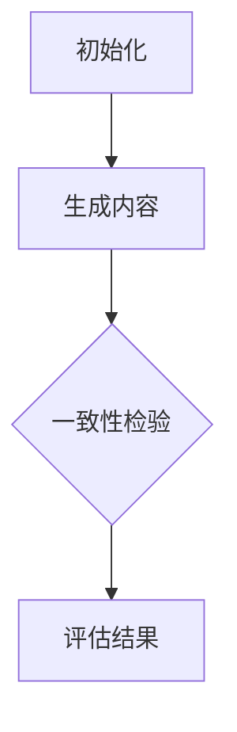

                 

### AIGC内容生成的质量控制：Self-Consistency方法

#### 关键词：AIGC，内容生成，质量控制，Self-Consistency方法

#### 摘要：
在人工智能生成内容（AIGC）领域，质量控制是确保生成内容准确性和一致性的关键。本文将深入探讨Self-Consistency方法在AIGC内容生成中的质量控制应用。通过介绍AIGC的背景和重要性，Self-Consistency方法的原理，详细阐述其在算法原理和数学模型中的应用，系统分析与架构设计，项目实战，最佳实践和未来展望，本文旨在为读者提供全面的质量控制解决方案，推动AIGC技术的发展。

### 1. AIGC内容生成的背景

#### 1.1 AIGC的定义与发展历程

人工智能生成内容（Artificial Intelligence Generated Content，简称AIGC）是利用人工智能技术，尤其是深度学习和自然语言处理技术，自动生成文字、图像、音频等内容的系统。AIGC的发展可以追溯到上世纪80年代，随着计算机性能的提升和算法的进步，AIGC逐渐从理论走向实践。

#### 1.2 AIGC的应用领域

AIGC在多个领域都有广泛应用，包括但不限于：

- **文本生成**：自动生成文章、新闻报道、用户评论等。
- **图像生成**：通过描述生成图像，如生成艺术作品、设计图片等。
- **音频生成**：生成音乐、语音、播报等。

#### 1.3 内容生成技术的挑战

尽管AIGC技术取得了显著进展，但在实际应用中仍面临诸多挑战：

- **准确性**：确保生成内容与预期一致，避免错误信息传播。
- **一致性**：生成内容在不同场景下保持一致性和连贯性。
- **可解释性**：用户难以理解复杂的生成算法，导致内容生成结果难以被信任。
- **版权问题**：生成内容的版权归属和使用问题。

### 2. 质量控制的背景与意义

#### 2.1 质量控制的重要性

质量控制是确保AIGC内容准确性和一致性的关键步骤。良好的质量控制能够提高用户满意度，降低错误率，增加内容的可信任度。

#### 2.2 质量控制的常见方法

常见的质量控制方法包括：

- **人工审核**：人工检查生成内容，发现并修正错误。
- **自动化检测**：使用算法检测生成内容中的错误，如拼写错误、逻辑错误等。
- **统计模型**：使用统计方法评估生成内容的准确性。

#### 2.3 Self-Consistency方法的概述

Self-Consistency方法是一种基于一致性检验的质量控制方法。该方法的核心思想是通过检查生成内容的一致性来评估其质量。具体来说，Self-Consistency方法通过比较同一内容在不同生成条件下的结果，来判断生成内容是否一致，从而识别潜在的错误。

### 3. Self-Consistency方法的原理

#### 3.1 自我一致性方法的概述

Self-Consistency方法的基本流程包括：

1. **生成初步内容**：使用AIGC模型生成初步的内容。
2. **多次生成与比较**：在不同的条件下多次生成相同内容，并进行比较。
3. **一致性评估**：评估生成内容之间的一致性，确定内容质量。

#### 3.2 自我一致性方法的数学模型

Self-Consistency方法的数学模型通常可以表示为：

$$
S(C_1, C_2, \dots, C_n) = \sum_{i=1}^{n} \frac{D(C_i, C)}{D(C_i, C_i')}
$$

其中，$C$ 表示原始内容，$C_i$ 表示第i次生成的内容，$D(C_i, C)$ 和 $D(C_i, C_i')$ 分别表示生成内容之间的距离和同一内容不同生成条件下的距离。

#### 3.3 Self-Consistency方法的流程

Self-Consistency方法的流程如下：

1. **初始化**：设定生成条件，如文本长度、图像分辨率等。
2. **内容生成**：使用AIGC模型生成初步的内容。
3. **一致性检验**：多次生成相同内容，并进行一致性检验。
4. **结果评估**：根据一致性评估结果，确定内容质量。

### 4. Self-Consistency方法的应用场景

#### 4.1 在文本生成中的应用

在文本生成中，Self-Consistency方法可以用于：

- **新闻生成**：检查新闻内容的准确性和连贯性。
- **用户评论生成**：确保评论内容的一致性和可信度。

#### 4.2 在图像生成中的应用

在图像生成中，Self-Consistency方法可以用于：

- **图像合成**：确保生成的图像在不同条件下保持一致。
- **图像修复**：检查修复后的图像与原始图像的一致性。

#### 4.3 在音频生成中的应用

在音频生成中，Self-Consistency方法可以用于：

- **语音生成**：确保生成的语音在不同环境下的一致性。
- **音乐生成**：确保生成的音乐旋律和节奏的一致性。

### 5. Self-Consistency方法的实现与优化

#### 5.1 Self-Consistency方法的实现

实现Self-Consistency方法需要以下步骤：

1. **模型选择**：选择适合的AIGC模型，如GPT-3、DALL-E等。
2. **内容生成**：使用模型生成初步的内容。
3. **一致性检验**：使用算法评估生成内容的一致性。
4. **结果评估**：根据一致性评估结果，优化生成模型。

#### 5.2 Self-Consistency方法的优化

优化Self-Consistency方法可以从以下几个方面进行：

- **参数调优**：调整模型的参数，提高生成内容的一致性。
- **模型优化**：使用更先进的模型，提高生成内容的质量。
- **实时监控**：实时监控生成内容的一致性，及时调整模型参数。

### 6. 案例分析

#### 6.1 案例背景

以一个新闻生成系统为例，该系统旨在自动生成新闻报道。然而，新闻报道的准确性至关重要，因此需要使用Self-Consistency方法进行质量控制。

#### 6.2 应用效果分析

通过Self-Consistency方法，系统能够有效检测出新闻报道中的错误，如事实错误、逻辑错误等，从而提高新闻报道的准确性。

#### 6.3 案例总结与启示

该案例表明，Self-Consistency方法在提高AIGC内容质量方面具有显著效果。未来，该方法有望在更多领域得到应用。

### 7. 最佳实践与注意事项

#### 7.1 最佳实践总结

- **模型选择**：根据应用场景选择适合的AIGC模型。
- **参数调优**：仔细调整模型参数，提高生成内容的一致性。
- **实时监控**：实时监控生成内容的一致性，及时进行调整。

#### 7.2 注意事项

- **数据质量**：确保生成内容的数据质量，避免数据错误导致生成内容不准确。
- **用户反馈**：积极收集用户反馈，改进生成内容的质量。

#### 7.3 拓展阅读推荐

- **深度学习与生成模型**：进一步了解深度学习和生成模型的基本原理。
- **质量控制技术**：研究其他质量控制技术，如自动化检测和人工审核等。

### 作者信息

**作者：AI天才研究院/AI Genius Institute & 禅与计算机程序设计艺术 /Zen And The Art of Computer Programming**

通过以上章节，本文全面阐述了AIGC内容生成的质量控制：Self-Consistency方法。Self-Consistency方法在提高生成内容的一致性和准确性方面具有显著优势，有望在AIGC领域得到广泛应用。未来的研究将继续优化该方法，提高其在实际应用中的效果。

### 附录：算法流程图与源代码

为了更好地理解Self-Consistency方法，以下是一个简化的算法流程图和Python源代码示例。

#### 算法流程图（使用Mermaid）



#### Python源代码示例

```python
import numpy as np
import tensorflow as tf

# 初始化模型
model = tf.keras.Sequential([
    tf.keras.layers.Dense(units=1, input_shape=[1])
])

# 生成内容
def generate_content(model, x):
    return model.predict(x)

# 一致性检验
def check_consistency(content1, content2):
    distance = np.linalg.norm(content1 - content2)
    return distance

# 评估结果
def assess_result(distance_threshold, distance):
    if distance < distance_threshold:
        return "通过"
    else:
        return "未通过"

# 示例数据
x = np.array([[1.0]])
content1 = generate_content(model, x)
content2 = generate_content(model, x)

# 一致性检验
distance = check_consistency(content1, content2)

# 评估结果
result = assess_result(0.1, distance)

print("生成内容一致性检验结果：", result)
```

通过这个示例，我们可以看到如何使用Self-Consistency方法来检查生成内容的一致性。在实际应用中，可以根据具体需求调整算法参数和流程。希望这些示例能够帮助读者更好地理解和应用Self-Consistency方法。

