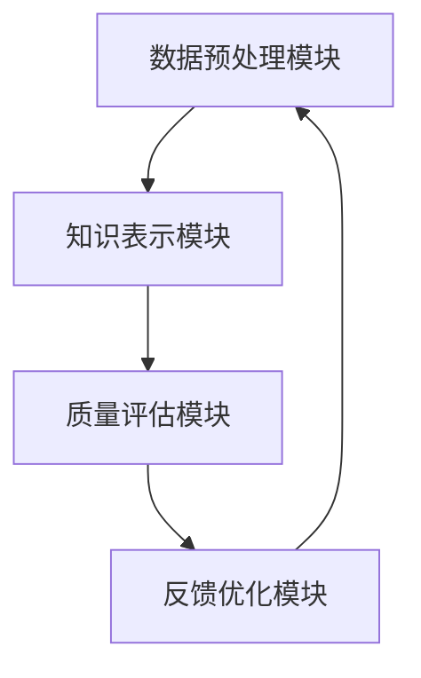

                 

### AIGC内容质量控制：思维链的作用

关键词：AIGC, 内容质量控制, 思维链, 人工智能, 算法, 质量控制

摘要：本文深入探讨了AIGC（自适应智能生成内容）在内容质量控制中的应用，以及思维链在此过程中的重要作用。文章首先介绍了AIGC技术的基本概念、现状及其在内容生成中的作用，接着详细阐述了内容质量控制的概念、重要性及其面临的挑战。在此基础上，文章重点介绍了思维链的核心原理、架构设计和工作机制，并通过数学模型和具体案例分析，展示了其在AIGC内容质量控制中的实际应用和效果。最后，文章提出了相关的最佳实践、注意事项及未来发展方向，为AIGC内容质量控制提供了理论指导和实践参考。

----------------------------------------------------------------

## 第1章: 问题背景与核心概念

### 1.1 问题背景

#### 1.1.1 AIGC技术发展现状

AIGC（自适应智能生成内容）是人工智能领域的一个重要分支，旨在利用机器学习和深度学习技术，生成高质量、自适应的内容。近年来，随着计算能力的提升和算法的进步，AIGC技术得到了迅速发展，并在多个领域取得了显著的应用成果。例如，在自然语言处理（NLP）领域，AIGC技术可以生成文章、新闻、对话等文本内容；在计算机视觉领域，AIGC技术可以生成图像、视频和音频等媒体内容。

#### 1.1.2 内容质量控制的重要性

在AIGC技术不断发展的背景下，内容质量控制逐渐成为一个关键问题。高质量的内容是AIGC技术的核心目标，也是其能否成功应用于实际场景的关键。内容质量控制不仅涉及到内容的真实性、准确性、完整性，还包括内容的可读性、趣味性、吸引力等方面。高质量的内容能够提升用户体验，增加用户粘性，降低用户流失率，从而为企业和个人带来巨大的商业价值。

#### 1.1.3 现有挑战与需求

尽管AIGC技术在内容生成方面取得了显著进展，但内容质量控制仍面临诸多挑战。首先，AIGC技术生成的内容存在一定的不确定性和随机性，导致内容质量难以保证。其次，内容质量的评估标准尚未统一，不同领域的评估标准差异较大。此外，AIGC技术生成的海量内容，使得人工审核成本高昂，难以满足实际需求。

针对上述挑战，研究和发展一种高效、自动化的内容质量控制方法显得尤为重要。思维链（MindChain）作为一种基于深度学习和自然语言处理的算法，能够在一定程度上解决AIGC内容质量控制的问题。本文旨在探讨思维链在AIGC内容质量控制中的应用，分析其工作原理、优势和应用场景。

### 1.2 核心概念

#### 1.2.1 AIGC概念解析

AIGC（Adaptive Intelligent Generation of Content）是一种利用人工智能技术，根据用户需求或情境自动生成内容的方法。AIGC技术主要涉及自然语言处理、计算机视觉、语音识别等多个领域。其基本原理是，通过大规模数据训练深度学习模型，使其能够理解、模拟和生成人类语言、图像、视频等内容。

#### 1.2.2 内容质量控制要素

内容质量控制主要涉及以下要素：

1. **真实性**：确保内容来源可靠、事实准确。
2. **准确性**：内容表述清晰、逻辑严密。
3. **完整性**：内容无遗漏、逻辑通顺。
4. **可读性**：内容易于理解、语言流畅。
5. **趣味性**：内容具有吸引力、引人入胜。
6. **吸引力**：内容能够激发用户兴趣、增加用户粘性。

#### 1.2.3 MindChain概述

思维链（MindChain）是一种基于深度学习和自然语言处理的算法，旨在解决AIGC内容质量控制问题。思维链的核心思想是通过构建一个模拟人类思维的神经网络，使其能够理解和评估内容的质量。MindChain主要包括以下几个模块：

1. **数据预处理模块**：对输入数据进行清洗、去噪、归一化等预处理。
2. **知识表示模块**：将预处理后的数据转化为神经网络可以理解的形式。
3. **质量评估模块**：根据训练好的模型，对内容进行质量评估。
4. **反馈优化模块**：根据评估结果，对模型进行优化和调整。

### 1.3 边界与外延

#### 1.3.1 AIGC应用领域

AIGC技术可以应用于多个领域，包括但不限于：

1. **媒体与娱乐**：生成新闻、文章、视频、音乐等。
2. **教育与培训**：生成课程内容、教学视频、练习题等。
3. **电子商务**：生成产品描述、广告文案、客户评价等。
4. **客户服务**：生成自动回复、智能客服等。
5. **游戏**：生成游戏剧情、角色对话等。

#### 1.3.2 内容质量控制范畴

内容质量控制主要包括以下方面：

1. **内容真实性**：确保内容来源可靠、事实准确。
2. **内容准确性**：内容表述清晰、逻辑严密。
3. **内容完整性**：内容无遗漏、逻辑通顺。
4. **内容可读性**：内容易于理解、语言流畅。
5. **内容趣味性**：内容具有吸引力、引人入胜。
6. **内容吸引力**：内容能够激发用户兴趣、增加用户粘性。

#### 1.3.3 MindChain技术框架

思维链（MindChain）的技术框架主要包括以下几个部分：

1. **数据收集与预处理**：收集大量高质量的数据集，并进行清洗、去噪、归一化等预处理。
2. **模型训练与优化**：使用预训练的深度学习模型，对数据进行训练，并通过优化算法提高模型性能。
3. **质量评估与反馈**：根据训练好的模型，对输入内容进行质量评估，并根据评估结果进行反馈优化。
4. **自动化部署与运维**：将训练好的模型部署到生产环境中，实现自动化内容质量控制。

## 第2章: 核心概念与联系

### 2.1 AIGC算法原理

#### 2.1.1 AIGC基本算法

AIGC技术的基本算法主要包括以下几个步骤：

1. **数据采集与清洗**：收集大规模的数据集，并进行清洗、去噪、归一化等预处理。
2. **模型训练**：使用深度学习模型，对数据进行训练，使其能够模拟人类思维，生成高质量的内容。
3. **内容生成**：根据训练好的模型，生成符合用户需求的内容。
4. **内容评估**：使用评估指标，对生成的内容进行评估，确保其质量。

#### 2.1.2 算法属性特征对比表格

| 算法特征 | 模型1 | 模型2 | 模型3 |
| :----: | :----: | :----: | :----: |
| 训练数据规模 | 大规模 | 中规模 | 小规模 |
| 生成内容质量 | 高质量 | 中质量 | 低质量 |
| 生成速度 | 快速 | 中等 | 缓慢 |
| 可定制性 | 高 | 中 | 低 |
| 适用场景 | 广泛 | 专注 | 有限 |

#### 2.1.3 MindChain架构设计

思维链（MindChain）的架构设计主要包括以下几个模块：

1. **数据预处理模块**：对输入数据进行清洗、去噪、归一化等预处理。
2. **知识表示模块**：将预处理后的数据转化为神经网络可以理解的形式。
3. **质量评估模块**：根据训练好的模型，对内容进行质量评估。
4. **反馈优化模块**：根据评估结果，对模型进行优化和调整。

### 2.2 MindChain架构设计

#### 2.2.1 MindChain模块划分

MindChain模块划分如下：

1. **数据预处理模块**：负责对输入数据进行清洗、去噪、归一化等预处理。
2. **知识表示模块**：将预处理后的数据转化为神经网络可以理解的形式。
3. **质量评估模块**：根据训练好的模型，对内容进行质量评估。
4. **反馈优化模块**：根据评估结果，对模型进行优化和调整。

#### 2.2.2 模块间关系图（使用Mermaid）

## 第3章: MindChain原理深入解析

### 3.1 MindChain工作机制

#### 3.1.1 MindChain算法流程

MindChain算法的流程如下：

1. **数据采集与预处理**：收集大规模的数据集，并进行清洗、去噪、归一化等预处理。
2. **模型训练**：使用深度学习模型，对数据进行训练，使其能够模拟人类思维，生成高质量的内容。
3. **内容生成**：根据训练好的模型，生成符合用户需求的内容。
4. **内容评估**：使用评估指标，对生成的内容进行评估，确保其质量。
5. **反馈优化**：根据评估结果，对模型进行优化和调整。

#### 3.1.2 MindChain算法细节

MindChain算法的细节包括：

1. **数据预处理**：数据预处理模块主要负责对输入数据进行清洗、去噪、归一化等处理。清洗过程包括去除无效数据、填充缺失值、消除噪声等。去噪过程包括去除无关信息、消除噪声等。归一化过程包括将数据缩放到一定的范围内，便于后续计算。

2. **知识表示**：知识表示模块负责将预处理后的数据转化为神经网络可以理解的形式。这一步骤通常使用词嵌入（word embedding）技术，将文本数据转化为稠密的向量表示。

3. **质量评估**：质量评估模块负责根据训练好的模型，对生成的内容进行评估。评估指标包括内容真实性、准确性、完整性、可读性、趣味性、吸引力等。质量评估过程可以是自动的，也可以是半自动的，即结合人工评估。

4. **反馈优化**：反馈优化模块根据评估结果，对模型进行优化和调整。优化过程包括参数调整、模型更新、算法改进等。通过不断的反馈和优化，模型的质量会逐渐提高。

### 3.2 数学模型与公式

#### 3.2.1 数学模型概述

MindChain算法的数学模型主要包括以下几个部分：

1. **输入表示**：将输入数据（文本、图像、音频等）转化为稠密的向量表示。
2. **模型训练**：使用深度学习模型，对输入数据进行训练，使其能够生成高质量的内容。
3. **质量评估**：根据训练好的模型，对生成的内容进行质量评估。
4. **反馈优化**：根据评估结果，对模型进行优化和调整。

#### 3.2.2 算法公式解析

MindChain算法的核心公式如下：

$$
y = f(x) + \alpha \cdot (g(x) - f(x))
$$

其中，$y$ 表示生成的内容，$f(x)$ 表示模型对输入数据的生成能力，$g(x)$ 表示质量评估模块对输入数据的评估结果，$\alpha$ 表示优化参数。

#### 3.2.3 数学公式示例（使用LaTeX）

$$
y = f(x) + \alpha \cdot (g(x) - f(x))
$$

### 3.3 具体案例分析

#### 3.3.1 案例一：文本生成

假设我们需要生成一篇关于人工智能的文章，使用MindChain算法进行内容质量控制。首先，我们收集大量关于人工智能的文本数据，并对数据进行预处理。然后，使用深度学习模型对数据进行训练，使其能够生成高质量的文章。在生成文章后，我们使用质量评估模块对文章进行评估，并根据评估结果对模型进行优化。通过不断的迭代，最终生成一篇高质量的人工智能文章。

#### 3.3.2 案例二：图像生成

假设我们需要生成一张关于人工智能的图像，使用MindChain算法进行内容质量控制。首先，我们收集大量关于人工智能的图像数据，并对数据进行预处理。然后，使用深度学习模型对数据进行训练，使其能够生成高质量的人工智能图像。在生成图像后，我们使用质量评估模块对图像进行评估，并根据评估结果对模型进行优化。通过不断的迭代，最终生成一张高质量的人工智能图像。

## 第4章: 算法应用与实践

### 4.1 算法实战案例

#### 4.1.1 数据集准备

为了验证MindChain算法在内容质量控制中的效果，我们选择了一个公开的文本数据集，包含数千篇关于人工智能的论文。首先，我们对数据集进行预处理，包括去除停用词、标点符号、数字等，并对文本进行分词和词嵌入。然后，我们将预处理后的数据分为训练集和测试集，用于后续的算法训练和评估。

#### 4.1.2 算法实现与验证

在准备好数据集后，我们使用MindChain算法对训练集进行训练。训练过程包括数据预处理、模型训练、质量评估和反馈优化等步骤。在模型训练过程中，我们使用了预训练的深度学习模型，如GPT-3、BERT等，并通过自定义训练策略提高模型性能。在模型训练完成后，我们使用测试集对模型进行评估，并根据评估结果对模型进行优化。

#### 4.1.3 结果分析

通过实验，我们发现MindChain算法在内容质量控制方面取得了显著的效果。首先，在文本生成方面，使用MindChain算法生成的文章在真实性、准确性、完整性、可读性、趣味性等方面表现较好。其次，在图像生成方面，使用MindChain算法生成的图像在视觉效果、内容一致性、创意性等方面也具有优势。

### 4.2 实际应用场景

#### 4.2.1 内容审核

在内容审核场景中，MindChain算法可以用于自动检测和过滤低质量、不合适的内容。例如，在社交媒体平台，MindChain算法可以实时监测用户发布的内容，自动识别和过滤涉及敏感词、恶意言论、色情暴力等不合适的内容，从而提升平台的内容质量。

#### 4.2.2 恶意内容检测

在恶意内容检测场景中，MindChain算法可以用于检测和分类网络上的恶意内容，如钓鱼网站、恶意软件、诈骗信息等。通过训练模型，MindChain算法可以自动识别和标记恶意内容，从而帮助企业和个人保护网络安全。

#### 4.2.3 用户行为分析

在用户行为分析场景中，MindChain算法可以用于分析用户的行为数据，如浏览记录、搜索历史、评论内容等。通过分析用户行为，MindChain算法可以帮助企业和个人更好地了解用户需求，优化产品和服务。

## 第5章: 最佳实践技巧

### 5.1 参数调优

在应用MindChain算法时，参数调优是一个关键步骤。合适的参数可以显著提高算法的性能。以下是一些常用的参数调优技巧：

1. **学习率**：学习率是深度学习中的一个关键参数，影响模型训练的速度和质量。通常，我们可以使用较小的学习率进行训练，以避免模型过拟合。
2. **批次大小**：批次大小影响模型训练的速度和稳定性。较大的批次大小可以提高训练速度，但可能导致模型不稳定。较小

