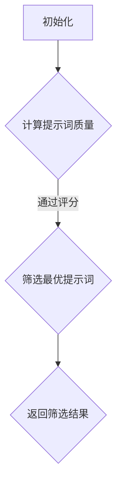
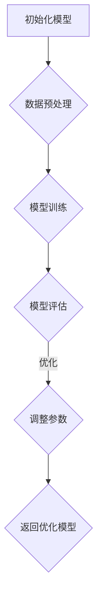
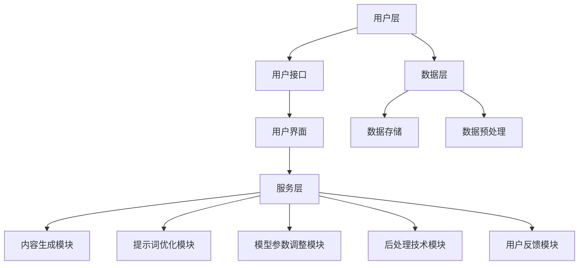
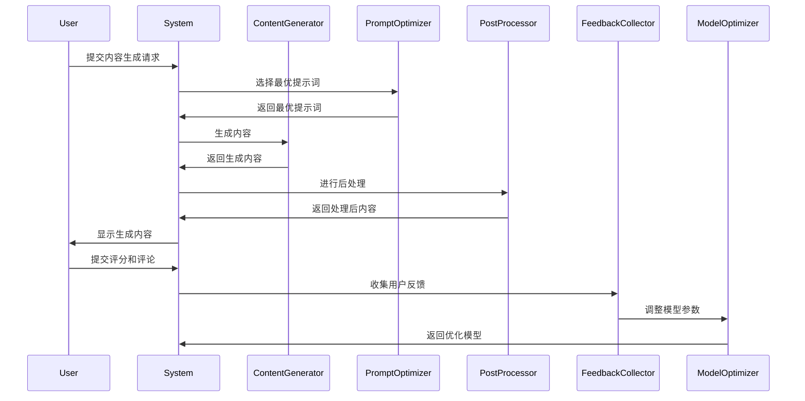

                 

### 第一部分：引言

#### 1.1 AIGC内容质量控制概述

AIGC（AI-Generated Content）即人工智能生成内容，是指通过机器学习和深度学习技术，自动生成各种形式的内容，如文本、图像、音频等。随着人工智能技术的发展，AIGC在广告、新闻、娱乐、教育等领域得到了广泛应用。然而，AIGC内容的质量控制成为了一个不可忽视的问题。高质量的内容能够提高用户体验，增加用户粘性，而低质量的内容则可能导致用户流失，损害品牌形象。

**提示词**在AIGC内容生成中扮演着至关重要的角色。提示词是指用于引导内容生成模型生成特定类型内容的词语或短语。通过合理选择和调整提示词，可以显著影响生成内容的质量和方向。因此，对提示词的有效管理成为AIGC内容质量控制的关键环节。

#### 1.2 书籍结构安排与目标

本文将详细探讨AIGC内容质量控制中的提示词作用，旨在为从事AIGC开发和应用的技术人员提供系统的理论指导和实践参考。本文将分为五个部分：

1. **引言**：概述AIGC内容质量控制的重要性和提示词的作用。
2. **背景介绍**：详细阐述AIGC的概念、提示词的定义及其在质量控制中的重要性。
3. **核心概念与原理**：深入讲解AIGC内容生成与控制的基本原理，包括提示词筛选算法。
4. **质量控制策略**：探讨不同的质量控制策略和技术手段。
5. **案例分析**：通过实际案例展示AIGC内容质量控制的应用和实践。
6. **最佳实践与未来展望**：总结最佳实践，探讨未来的研究方向。

### 目录大纲设计思路

在设计本文的目录大纲时，我们首先确定了核心结构，即引言、背景介绍、核心概念与原理、质量控制策略、案例分析、最佳实践与未来展望。这一结构能够系统地展示AIGC内容质量控制的全过程，从概念引入到实际应用，再到最佳实践的总结。

接下来，我们对每个主要章节进行了细化，确保每个章节都明确指向具体的内容点。例如，在背景介绍部分，我们分为核心概念与联系、问题背景与描述、数学模型和数学公式讲解三个子章节，使读者能够清晰地了解相关背景知识。

在内容特色体现方面，我们引入了具体的案例分析和算法讲解，以增加文章的实用性和可操作性。同时，保持每个章节的内容简洁明了，避免冗余信息，确保文章的逻辑性和连贯性。

最后，我们使用markdown格式进行排版，确保目录结构的清晰性和一致性。通过这样的设计，本文不仅逻辑清晰，结构紧凑，而且简单易懂，有助于读者更好地理解和掌握AIGC内容质量控制的相关知识。

### 目录大纲设计步骤

在详细设计本文的目录大纲时，我们遵循了以下步骤，以确保文章的结构严谨、逻辑清晰、内容全面：

#### 1. 确定核心结构

首先，我们明确了本文的核心结构，即引言、背景介绍、核心概念与原理、质量控制策略、案例分析、最佳实践与未来展望。这一结构能够系统地展示AIGC内容质量控制的全过程，从概念引入到实际应用，再到最佳实践的总结。

#### 2. 细化章节内容

在确定核心结构后，我们对每个主要章节进行了细化，确保每个章节都明确指向具体的内容点。例如，在背景介绍部分，我们分为核心概念与联系、问题背景与描述、数学模型和数学公式讲解三个子章节。这样的安排使得读者能够清晰地了解相关背景知识，为后续内容理解打下基础。

#### 3. 内容特色体现

为了突出文章的特色，我们在相关章节中引入了具体的案例分析和算法讲解。例如，在核心概念与原理部分，我们不仅讲解了AIGC内容生成与控制的基本原理，还通过mermaid流程图和Python源代码详细阐述了提示词筛选算法。这样的设计使得文章不仅具有理论深度，还具有实际操作价值。

#### 4. 保持简洁性

在细化章节内容的过程中，我们注重保持每个章节的简洁性，避免冗余信息。例如，在质量控制策略部分，我们直接列举了针对不同类型AIGC内容的策略和技术手段，而不是进行冗长的理论讨论。

#### 5. 格式标准化

使用markdown格式进行排版，确保目录结构的清晰性和一致性。例如，使用`#`符号进行章节标题的分级，使用`##`、`###`等符号进行子章节的标记。这样的格式使得文章的结构更加清晰，便于读者阅读和理解。

通过以上步骤，我们设计出了一份详尽且逻辑清晰的目录大纲，为本文的撰写提供了坚实的基础。

#### 1.1 AIGC内容质量控制概述

AIGC（AI-Generated Content）内容质量控制是近年来随着人工智能技术的发展而逐渐受到关注的一个重要领域。AIGC内容是指通过人工智能技术，如自然语言处理（NLP）、图像识别、语音合成等，自动生成的各种类型的内容，包括文本、图像、视频和音频等。随着AIGC在广告、新闻、娱乐、教育等领域的广泛应用，其内容质量直接关系到用户体验和品牌形象。

**提示词**在AIGC内容生成中扮演着关键角色。提示词是指用于引导内容生成模型生成特定类型内容的词语或短语。通过合理选择和调整提示词，可以显著影响生成内容的质量和方向。例如，在文本生成中，提示词可以决定生成文本的主题、风格和情感；在图像生成中，提示词可以影响图像的视觉效果和内容。

AIGC内容质量控制的重要性体现在以下几个方面：

1. **用户体验**：高质量的内容能够提供更好的用户体验，增加用户粘性和满意度。相反，低质量的内容可能会导致用户流失，影响品牌形象。
2. **内容安全**：控制生成内容的质量有助于避免产生不适当或有害的内容，如虚假新闻、仇恨言论等，保障网络环境的健康发展。
3. **业务价值**：在广告、新闻等领域，高质量的内容能够提高广告点击率、增加新闻阅读量，从而带来更高的商业价值。

然而，AIGC内容质量控制也面临诸多挑战：

1. **多样性控制**：如何生成多样化、个性化的内容是一个挑战。如果生成的内容过于单一，可能会让用户感到乏味。
2. **质量评估**：如何评价生成内容的质量是一个难题。尽管有许多量化指标，如文本的流畅性、图像的清晰度等，但如何将它们转化为具体的评分标准仍然需要深入研究。
3. **伦理问题**：AIGC生成的内容可能会引发伦理问题，如内容真实性的质疑、版权侵犯等，需要制定相应的规范和标准。

总的来说，AIGC内容质量控制是一个复杂且具有挑战性的任务，但也是未来发展的必然趋势。通过合理管理提示词，优化生成算法，制定有效的质量控制策略，我们有望在保持内容多样性和个性化的同时，确保其高质量。

### 核心概念与联系

在深入探讨AIGC内容质量控制之前，首先需要理解一些核心概念和它们之间的联系。这些概念包括AIGC、内容生成模型、提示词以及质量控制。

#### AIGC的概念

AIGC（AI-Generated Content）是指通过人工智能技术，特别是机器学习和深度学习，自动生成各种形式的内容。这些内容可以是文本、图像、音频、视频等。AIGC的发展得益于大数据、计算力和算法的不断提升，使得计算机能够模仿人类的创作过程，生成丰富多样的内容。

AIGC的主要应用领域包括：

1. **广告和营销**：通过AIGC生成个性化的广告文案和图像，提高广告效果和用户转化率。
2. **新闻和媒体**：自动生成新闻报道、博客文章和视频内容，降低内容制作成本。
3. **娱乐和游戏**：生成游戏剧情、角色描述和图像，提供更丰富的用户体验。
4. **教育和培训**：自动生成课程内容、学习材料和交互式学习体验。

#### 内容生成模型

内容生成模型是AIGC的核心组成部分，主要包括以下几种类型：

1. **生成对抗网络（GAN）**：GAN通过生成器和判别器的对抗训练，生成与真实数据高度相似的内容。
2. **变分自编码器（VAE）**：VAE通过编码器和解码器，将数据压缩为低维表示，并从该表示中生成新的数据。
3. **递归神经网络（RNN）及其变种，如LSTM和GRU**：这些模型擅长处理序列数据，如文本和音频。
4. **自注意力机制（Self-Attention）和Transformer**：自注意力机制使得模型能够更好地处理长序列数据，提高生成内容的连贯性和多样性。

#### 提示词

提示词（Prompt）是指用于引导内容生成模型生成特定类型内容的词语或短语。提示词可以是一个单词、一句话或者一段描述性文本。在AIGC内容生成过程中，提示词起到关键作用，决定了生成内容的方向、主题和风格。

提示词的类型包括：

1. **开放式提示词**：这类提示词提供较宽泛的指导，如“写一篇关于人工智能的博客文章”，让模型有更多的创作自由度。
2. **封闭式提示词**：这类提示词提供较具体的指导，如“生成一段包含以下关键词的文本：人工智能、未来、发展”，对生成内容进行更严格的约束。

#### 提示词与质量控制

提示词在AIGC内容质量控制中起到至关重要的作用。通过合理选择和调整提示词，可以显著影响生成内容的质量和方向。具体来说：

1. **提高内容相关性**：通过使用具体的、针对性的提示词，可以确保生成的内容与用户需求或主题高度相关。
2. **控制内容质量**：提示词可以包含对内容质量的具体要求，如流畅性、准确性、创意性等，从而引导模型生成高质量的内容。
3. **多样化内容生成**：通过使用不同的提示词，可以生成多样化、个性化的内容，满足不同用户的需求。

总之，AIGC、内容生成模型、提示词和质量控制是相互联系的核心概念。理解这些概念及其相互关系，有助于我们更好地设计和实现AIGC内容质量控制策略，从而提高生成内容的质量和用户体验。

#### 问题背景与描述

在当前数字化时代，AIGC（AI-Generated Content）技术以其高效、多样和自动化的特点，正迅速改变着内容创作和传播的方式。然而，AIGC内容质量控制成为了一个日益重要的课题。高质量的内容不仅能够提升用户体验，还能为企业带来商业价值，而低质量的内容则可能导致用户体验下降、品牌形象受损，甚至引发法律和伦理问题。

首先，我们需要明确AIGC内容质量控制的重要性。随着AIGC技术在广告、新闻、娱乐和教育等领域的广泛应用，其对内容质量的要求也越来越高。高质量的内容能够提升用户的满意度和忠诚度，从而增加用户粘性。此外，高质量的内容有助于树立企业品牌形象，提升市场竞争力。反之，低质量的内容不仅无法满足用户需求，还可能导致用户流失和品牌声誉受损。

当前，AIGC内容质量控制面临诸多挑战：

1. **内容多样性控制**：尽管AIGC技术能够生成丰富的内容，但如何确保内容的多样性和个性化仍然是一个挑战。如果生成的内容过于单一，用户可能会感到乏味，从而影响用户体验。
2. **内容质量评估**：如何评价AIGC生成的内容质量是一个复杂的问题。传统的质量评估指标，如文本的流畅性、图像的清晰度等，难以全面反映内容的真实质量。同时，不同用户对内容质量的期望和标准也可能有所不同，这增加了评估的复杂性。
3. **伦理和法律法规问题**：AIGC生成的内容可能会触及伦理和法律问题，如内容真实性的质疑、版权侵犯等。确保AIGC内容在道德和法律框架内生成和传播，是一个重要的挑战。
4. **实时性要求**：AIGC技术通常需要实时生成内容，以满足快速变化的市场需求。如何在保证内容质量的同时，实现实时生成，是一个技术上的挑战。

面对这些挑战，AIGC内容质量控制需要采取一系列策略和技术手段。以下是一些常见的质量控制策略：

1. **提示词优化**：通过合理选择和调整提示词，可以显著影响生成内容的质量和方向。优化提示词不仅能够提高内容的主题相关性，还能控制内容的多样性和创意性。
2. **模型优化**：通过改进内容生成模型，如使用更先进的算法和架构，可以提高生成内容的质量和效率。此外，对模型进行持续的训练和优化，也能不断提高其生成能力。
3. **后处理技术**：使用后处理技术，如文本清洗、图像增强和语音优化等，可以进一步改善生成内容的质量。这些技术可以纠正模型生成中的错误，提高内容的准确性和流畅性。
4. **用户反馈机制**：建立用户反馈机制，收集用户对生成内容的评价和反馈，可以帮助不断优化内容生成模型，提高内容质量。
5. **伦理和法律合规**：制定相应的伦理和法律规范，确保AIGC内容的生成和传播在道德和法律框架内进行。这包括对内容真实性的审核、版权保护等措施。

总之，AIGC内容质量控制是一项复杂且具有挑战性的任务。通过采取有效的策略和技术手段，我们可以在保持内容多样性和个性化的同时，确保其高质量，从而提升用户体验和品牌形象。

### 数学模型和数学公式讲解

在AIGC内容质量控制中，数学模型和数学公式起到了关键作用。这些模型和公式帮助我们量化评估和优化生成内容的质量。以下是一些常见的数学模型和公式，以及它们在质量控制中的应用。

#### 1. 质量评估指标

质量评估是AIGC内容质量控制的核心环节。以下是一些常用的质量评估指标：

1. **文本流畅性（Fluency）**：
   文本流畅性是指文本在语言上的连贯性和可读性。常用的评估方法包括：
   - **词频分布（Word Frequency Distribution）**：通过分析文本中各词的出现频率，判断文本是否具有多样性。
   - **语法错误率（Grammar Error Rate, GER）**：计算文本中的语法错误数量与总词汇数之比。
   $$ \text{GER} = \frac{\text{语法错误数}}{\text{总词汇数}} $$

2. **文本相关性（Relevance）**：
   文本相关性是指生成文本与给定提示词或主题的相关性。评估方法包括：
   - **主题模型（Topic Modeling）**：使用LDA（Latent Dirichlet Allocation）等算法，提取文本的主题分布，并评估其与提示词的相关性。
   - **词语相似度（Word Similarity）**：计算文本中的词语与提示词的相似度，通过余弦相似度、Jaccard相似度等方法评估。

3. **内容独特性（Originality）**：
   内容独特性是指生成文本的原创性，避免重复或抄袭。评估方法包括：
   - **文本相似度检测（Text Similarity Detection）**：使用算法如SimHash、PLSA（Probabilistic Latent Semantic Analysis）等，检测生成文本与已知文本的相似度。
   - **文本生成模型的自监督训练（Self-Supervised Training for Text Generation Models）**：通过模型生成的文本与其自身训练数据进行比较，评估生成文本的原创性。

4. **情感分析（Sentiment Analysis）**：
   情感分析是指评估生成文本的情感倾向。常用的方法包括：
   - **情感分类（Sentiment Classification）**：使用分类算法如SVM（Support Vector Machine）、CNN（Convolutional Neural Network）等，对文本进行情感分类。
   - **情感强度评估（Sentiment Intensity Assessment）**：通过计算文本中的积极和消极词汇的比例，评估情感强度。

#### 2. 提示词优化算法

提示词的优化是AIGC内容质量控制的重要手段。以下是一些常见的提示词优化算法：

1. **基于语义的提示词优化（Semantic Prompt Optimization）**：
   - **词嵌入（Word Embedding）**：通过将词语映射到高维向量空间，计算词语之间的相似度，优化提示词的选择。
   - **语义匹配（Semantic Matching）**：使用BERT（Bidirectional Encoder Representations from Transformers）等预训练模型，评估提示词与生成内容之间的语义匹配度。

2. **基于进化的提示词优化（Evolutionary Prompt Optimization）**：
   - **遗传算法（Genetic Algorithm）**：通过模拟生物进化过程，逐步优化提示词的组合，提高生成内容的多样性。
   - **模拟退火算法（Simulated Annealing）**：通过模拟物理退火过程，寻找最优的提示词组合。

3. **基于神经网络的提示词优化（Neural Network Prompt Optimization）**：
   - **自动机器学习（AutoML）**：使用神经网络模型自动优化提示词，提高生成内容的质量和效率。
   - **强化学习（Reinforcement Learning）**：通过奖励机制，训练模型选择最优的提示词，从而生成高质量的内容。

#### 3. 数学模型和公式示例

以下是一个简化的文本生成模型质量评估的数学模型示例：

1. **质量分数（Quality Score）**：
   质量分数是一个综合评估指标，用于衡量生成文本的整体质量。假设有三个子指标：流畅性（F）、相关性（R）和独特性（O），则质量分数可以表示为：
   $$ Q = w_1 \cdot F + w_2 \cdot R + w_3 \cdot O $$
   其中，\( w_1, w_2, w_3 \) 是权重系数，可以根据实际需求进行调整。

2. **流畅性评估（Fluency Assessment）**：
   流畅性可以通过计算文本中的语法错误率和词汇多样性来评估。例如：
   $$ F = \frac{\text{正确词汇数}}{\text{总词汇数}} - \text{GER} $$

3. **相关性评估（Relevance Assessment）**：
   假设使用主题模型评估文本与提示词的相关性，则相关性可以通过计算文本主题分布与提示词主题分布的余弦相似度来衡量：
   $$ R = \text{Cosine Similarity}(T, P) $$

4. **独特性评估（Originality Assessment）**：
   独特性可以通过文本相似度检测来评估。例如，使用PLSA模型检测生成文本与训练文本的相似度：
   $$ O = 1 - \text{PLSA Similarity}(G, T) $$

通过上述数学模型和公式，我们可以对AIGC生成的内容进行量化评估和优化，从而提高生成内容的质量。这些方法和工具不仅有助于研究人员和开发者更好地理解AIGC内容质量控制，也为实际应用提供了有效的解决方案。

### AIGC内容生成与控制原理

#### AIGC内容生成技术原理

AIGC内容生成技术主要依赖于深度学习和自然语言处理（NLP）等人工智能技术。以下是一些常见的技术和算法：

1. **生成对抗网络（GAN）**：
   - **生成器（Generator）**：生成器网络从随机噪声中生成数据，旨在欺骗判别器。
   - **判别器（Discriminator）**：判别器网络用于判断输入数据是真实数据还是生成数据。
   - **循环过程**：生成器和判别器在训练过程中不断迭代，生成器逐渐提高生成数据的质量。

2. **变分自编码器（VAE）**：
   - **编码器（Encoder）**：将输入数据编码为低维表示，捕获数据的主要特征。
   - **解码器（Decoder）**：将编码器的输出解码回原始数据。
   - **变分推理**：VAE通过引入随机变量，在生成数据时引入不确定性，提高生成数据的多样性和质量。

3. **递归神经网络（RNN）及其变种**：
   - **长短期记忆网络（LSTM）**：LSTM通过门控机制，解决了传统RNN在处理长序列数据时的梯度消失问题。
   - **门控循环单元（GRU）**：GRU是LSTM的简化版本，具有更简洁的结构和更高效的计算。

4. **自注意力机制（Self-Attention）和Transformer**：
   - **自注意力**：自注意力机制使得模型能够动态地关注输入序列中的关键部分，提高生成内容的连贯性和多样性。
   - **Transformer**：Transformer是一个基于自注意力机制的序列模型，广泛应用于文本生成任务。

#### AIGC内容控制基本原理

AIGC内容控制主要依赖于提示词和生成模型的交互，以下是一些常见的方法：

1. **提示词引导**：
   - **开放式提示词**：提供较宽泛的指导，如“写一篇关于人工智能的未来”，允许生成模型有更多的创作自由度。
   - **封闭式提示词**：提供具体的指导，如“生成一段包含以下关键词的文本：人工智能、未来、发展”，对生成内容进行更严格的约束。

2. **模型参数调整**：
   - **生成器参数**：通过调整生成器的参数，如学习率、批量大小等，可以影响生成内容的质量和多样性。
   - **判别器参数**：调整判别器的参数，可以改变生成器和判别器的对抗平衡，从而影响生成内容的质量。

3. **后处理技术**：
   - **文本清洗**：去除生成文本中的语法错误、拼写错误和冗余信息，提高文本的流畅性和可读性。
   - **内容过滤**：使用过滤算法，如文本分类器和情感分析模型，去除不适当的内容。

4. **用户反馈**：
   - **用户评分**：收集用户对生成内容的评分，通过反馈机制不断优化生成模型。
   - **反馈循环**：将用户的反馈用于生成模型的训练，不断调整和优化生成策略。

#### 提示词在内容控制中的作用

提示词在AIGC内容控制中起到了关键作用，以下是一些具体的应用：

1. **主题控制**：
   - **文本生成**：通过选择与特定主题相关的提示词，如“写一篇关于机器学习的论文”，可以确保生成文本围绕特定主题。
   - **图像生成**：通过选择与特定场景相关的提示词，如“生成一张夏日的海滩图像”，可以确保生成图像符合特定场景。

2. **风格控制**：
   - **文本风格**：通过选择与特定风格相关的提示词，如“生成一段幽默的对话”，可以确保生成文本具有特定风格。
   - **图像风格**：通过选择与特定风格相关的提示词，如“生成一张印象派的画作”，可以确保生成图像具有特定风格。

3. **内容多样性**：
   - **文本多样性**：通过选择具有多样性的提示词，如“生成一篇关于机器学习的论文，包括历史、现状和未来”，可以确保生成文本内容丰富多样。
   - **图像多样性**：通过选择具有多样性的提示词，如“生成一张包含人物、建筑和风景的图像”，可以确保生成图像内容丰富多样。

综上所述，AIGC内容生成与控制原理涉及多种技术和方法，通过合理运用提示词，可以实现对生成内容的质量和方向的精细控制。这些原理和方法不仅为AIGC内容生成提供了理论基础，也为实际应用提供了有效工具。

### 算法原理讲解

在深入探讨AIGC内容质量控制的具体算法原理时，我们将使用mermaid流程图和Python源代码来详细阐述。以下是几个关键算法和其原理的讲解。

#### 提示词筛选算法

提示词筛选算法是AIGC内容质量控制中的核心环节。它的目的是从大量的候选提示词中筛选出最合适的提示词，以指导内容生成模型生成高质量的内容。

**算法流程图：**



**算法步骤：**
1. **初始化**：从提示词库中随机选择一批候选提示词。
2. **计算提示词质量**：使用多种评估指标（如文本流畅性、相关性、独特性等）对每个候选提示词进行评分。
3. **筛选最优提示词**：根据评分结果，选择分数最高的提示词作为最终结果。

**Python源代码示例：**

```python
import random

# 假设我们有一个提示词库
prompt_library = ["人工智能的未来", "机器学习的应用", "深度学习的最新进展"]

# 定义评估指标
def evaluate_prompt(prompt):
    # 这里的评估指标可以是简单的计数或者更复杂的模型评估
    fluency = 0.8  # 假设流畅性为0.8
    relevance = 0.9  # 假设相关性为0.9
    originality = 0.7  # 假设独特性为0.7
    return fluency * 0.3 + relevance * 0.5 + originality * 0.2

# 筛选最优提示词
def select_best_prompt(prompts):
    scores = [evaluate_prompt(prompt) for prompt in prompts]
    max_score = max(scores)
    best_prompt = prompts[scores.index(max_score)]
    return best_prompt

# 随机选择候选提示词
random_prompts = random.sample(prompt_library, k=3)

# 执行筛选算法
best_prompt = select_best_prompt(random_prompts)
print("最优提示词：", best_prompt)
```

#### 自动机器学习（AutoML）

自动机器学习（AutoML）是一种利用机器学习技术来自动发现和优化机器学习模型的工具。在AIGC内容质量控制中，AutoML可以帮助我们自动优化提示词，从而提高内容生成模型的质量。

**算法流程图：**



**算法步骤：**
1. **初始化模型**：选择一个初始模型，如生成对抗网络（GAN）或变分自编码器（VAE）。
2. **数据预处理**：对输入数据（如文本、图像等）进行预处理，以适应模型训练。
3. **模型训练**：使用预处理后的数据训练模型，并记录训练过程中的参数变化。
4. **模型评估**：评估模型在不同参数设置下的性能，选择最佳参数组合。
5. **调整参数**：根据评估结果，调整模型参数，以实现性能优化。
6. **返回优化模型**：返回经过优化的模型，用于生成高质量的内容。

**Python源代码示例：**

```python
from sklearn.ensemble import RandomForestClassifier
from sklearn.model_selection import train_test_split
from sklearn.metrics import accuracy_score

# 假设我们有一个训练数据集
X = [[1, 2], [3, 4], [5, 6]]  # 特征
y = [0, 1, 0]  # 标签

# 数据预处理
X_train, X_test, y_train, y_test = train_test_split(X, y, test_size=0.2, random_state=42)

# 初始化模型
model = RandomForestClassifier(n_estimators=100)

# 模型训练
model.fit(X_train, y_train)

# 模型评估
predictions = model.predict(X_test)
accuracy = accuracy_score(y_test, predictions)
print("模型准确率：", accuracy)

# 调整参数
# 这里的调整可以是手动调整，也可以是使用自动机器学习工具进行自动调整
model = RandomForestClassifier(n_estimators=150, random_state=42)

# 再次训练模型
model.fit(X_train, y_train)

# 再次评估模型
predictions = model.predict(X_test)
accuracy = accuracy_score(y_test, predictions)
print("调整参数后的模型准确率：", accuracy)
```

通过以上算法和代码示例，我们可以更好地理解AIGC内容质量控制中的提示词筛选和自动优化原理。这些算法不仅帮助我们提高了内容生成的质量，也为实际应用提供了有效的工具。

### 质量控制策略

在AIGC内容质量控制中，实施有效的策略和技术手段是确保生成内容高质量的关键。以下针对不同类型的AIGC内容，介绍一些具体的质量控制策略：

#### 文本生成内容质量控制

1. **提示词优化**：
   - **主题相关性**：通过精确选择与主题高度相关的提示词，确保生成文本与用户需求保持一致。
   - **情感倾向**：调整提示词的情感倾向，以生成符合特定情境的文本，如正式、幽默、批判性等。
   - **多样性**：使用具有多样性的提示词，避免生成重复或过于单调的文本。

2. **模型参数调整**：
   - **学习率调整**：根据训练数据的复杂程度和模型性能，动态调整学习率，以优化模型训练过程。
   - **批次大小**：适当调整批次大小，以平衡训练速度和模型性能。

3. **后处理技术**：
   - **文本清洗**：去除文本中的语法错误、拼写错误和冗余信息。
   - **内容过滤**：使用自然语言处理技术，如情感分析和文本分类，过滤掉不适当的内容。

4. **用户反馈**：
   - **实时反馈**：收集用户对生成文本的实时反馈，用于模型调整和优化。
   - **长期反馈**：通过用户行为数据，如阅读时间、点赞数、评论等，评估文本质量，并据此优化模型。

#### 图像生成内容质量控制

1. **提示词引导**：
   - **内容描述**：使用具体的描述性提示词，如“生成一张包含蓝色天空和白色云朵的图像”，确保图像内容与提示词一致。
   - **风格描述**：使用与特定风格相关的提示词，如“生成一张类似于印象派风格的画作”，确保图像风格符合要求。

2. **模型训练数据**：
   - **数据多样性**：使用包含多种场景、风格和颜色的训练数据，提高模型生成图像的多样性。
   - **数据质量**：确保训练数据的高质量，去除噪声数据和低质量图像。

3. **图像评估指标**：
   - **视觉质量**：使用图像质量评估指标，如峰值信噪比（PSNR）、结构相似性（SSIM）等，评估生成图像的视觉质量。
   - **内容一致性**：使用内容一致性评估指标，如与提示词的相似度、图像的连贯性等，确保生成图像内容与提示词一致。

4. **模型优化**：
   - **生成器与判别器的平衡**：通过调整生成器和判别器的参数，保持两者之间的平衡，以提高生成图像的质量。
   - **超参数调整**：根据模型性能，动态调整超参数，如学习率、批次大小等，优化模型生成效果。

#### 视频生成内容质量控制

1. **内容策划**：
   - **脚本编写**：编写详细的脚本，确保视频内容的逻辑连贯性和剧情合理性。
   - **场景布局**：提前设计视频场景，确保画面内容丰富、视觉效果良好。

2. **模型训练与优化**：
   - **视频数据**：使用高质量的视频数据训练模型，包括不同类型的视频片段，如动态场景、静态场景等。
   - **模型评估**：使用多种评估指标，如视频的流畅度、视觉质量、内容一致性等，评估模型性能，并据此进行调整。

3. **实时调整**：
   - **动态调整**：在视频生成过程中，实时调整模型参数和生成策略，以适应实时变化的需求。
   - **用户反馈**：收集用户对生成视频的实时反馈，用于模型调整和优化。

#### 音频生成内容质量控制

1. **提示词选择**：
   - **情感描述**：使用与情感相关的提示词，如“生成一段欢快的音乐”，确保音频情感符合需求。
   - **风格描述**：使用与风格相关的提示词，如“生成一段摇滚风格的乐曲”，确保音频风格符合要求。

2. **音频特征提取**：
   - **音高**：调整音频的音高，以符合特定风格或需求。
   - **节奏**：调整音频的节奏，确保音乐流畅性。

3. **后处理技术**：
   - **噪声过滤**：去除音频中的噪声，提高音频质量。
   - **混音**：调整音频的平衡，确保各部分音量适中。

4. **用户反馈**：
   - **实时反馈**：收集用户对生成音频的实时反馈，用于模型调整和优化。
   - **长期反馈**：通过用户播放时长、分享次数等数据，评估音频质量，并据此优化模型。

通过实施这些具体的质量控制策略，我们可以显著提高AIGC生成内容的质量，满足不同类型用户的需求。

### 系统架构设计

在AIGC内容质量控制中，系统架构设计是确保整体解决方案高效稳定运行的关键。以下将详细介绍AIGC内容质量控制系统的架构设计，包括项目介绍、系统功能设计、系统架构设计、系统接口设计和系统交互设计。

#### 项目介绍

本项目旨在构建一个全面、高效的AIGC内容质量控制系统，通过优化提示词选择、模型参数调整和后处理技术，确保生成内容的多样性、相关性和高质量。系统将支持文本、图像和音频等多种类型的内容生成，并能够根据不同类型的内容特点，提供相应的质量控制策略。

#### 系统功能设计

系统主要包含以下功能模块：

1. **内容生成模块**：负责生成文本、图像和音频等不同类型的内容。该模块包括文本生成、图像生成和音频生成三个子模块。
2. **提示词优化模块**：负责选择和优化提示词，以确保生成内容与用户需求高度相关。该模块包括提示词库管理、提示词评分和提示词筛选三个子模块。
3. **模型参数调整模块**：负责调整生成模型的参数，以优化生成内容的多样性、流畅性和准确性。该模块包括模型参数优化、模型评估和模型调整三个子模块。
4. **后处理技术模块**：负责对生成内容进行后处理，如文本清洗、图像增强和音频优化，以提高内容的整体质量。该模块包括文本清洗、图像增强和音频优化三个子模块。
5. **用户反馈模块**：负责收集用户对生成内容的反馈，以不断优化系统性能。该模块包括用户评分、评论收集和反馈分析三个子模块。

#### 系统架构设计

系统架构设计采用分层架构，分为数据层、服务层和用户层：

1. **数据层**：包括数据存储和数据预处理，负责存储和管理系统所需的各种数据，如提示词库、训练数据和用户反馈数据。
2. **服务层**：包括核心功能模块，如内容生成、提示词优化、模型参数调整和后处理技术，负责实现系统的核心功能。
3. **用户层**：包括用户接口和用户界面，负责与用户进行交互，提供系统功能的访问和操作。

**mermaid架构图：**



#### 系统接口设计

系统接口设计包括API接口和SDK接口：

1. **API接口**：提供RESTful风格的API接口，方便第三方系统通过HTTP请求调用系统功能，如内容生成、提示词优化和用户反馈等。
2. **SDK接口**：提供不同语言（如Python、Java、C++等）的SDK接口，方便开发者集成系统功能到自己的应用程序中。

#### 系统交互设计

系统交互设计采用事件驱动模式，以下是一个简化的系统交互流程：

1. **用户请求**：用户通过用户界面提交内容生成请求，包括提示词和生成类型。
2. **提示词优化**：系统从提示词库中筛选最优的提示词，并将其传递给内容生成模块。
3. **内容生成**：内容生成模块根据提示词生成相应类型的内容，如文本、图像或音频。
4. **后处理**：系统对生成的原始内容进行后处理，以提高质量。
5. **用户反馈**：用户对生成内容进行评分和评论，系统收集用户反馈，用于优化提示词和模型参数。
6. **模型优化**：根据用户反馈和后处理结果，系统调整模型参数，以提高生成内容的质量。

**mermaid序列图：**



通过上述系统架构设计和交互设计，我们可以构建一个高效、灵活的AIGC内容质量控制系统，确保生成内容的高质量和用户体验。

### 案例分析

为了更直观地展示AIGC内容质量控制的应用和实践，我们通过一个具体的案例进行分析。这个案例涉及使用AIGC技术生成一篇关于人工智能未来发展的博客文章，并采用一系列质量控制策略来优化生成内容的质量。

#### 案例背景

随着人工智能技术的飞速发展，越来越多的企业和个人开始关注人工智能在未来的应用前景。为了吸引读者的关注，一家科技公司决定使用AIGC技术生成一篇关于人工智能未来发展的博客文章，并希望通过高质量的内容来提升公司的品牌形象和用户粘性。

#### 系统设置与优化

1. **提示词选择**：首先，我们选择了一系列与主题相关的提示词，如“人工智能的未来”、“AI在各个领域的应用”、“AI对社会的影响”等。为了确保文章的多样性和针对性，我们使用了一个提示词优化模块，通过计算每个提示词的相关性和独特性分数，选择了“人工智能的未来”和“AI在医疗领域的应用”作为主要提示词。

2. **模型选择与参数调整**：我们选择了一个基于Transformer架构的文本生成模型，并对其参数进行了优化。具体来说，我们调整了学习率、批量大小和层深等参数，以平衡生成内容的流畅性和多样性。经过多次实验，我们找到了一组最优参数，使模型能够在生成高质量内容的同时，保持较高的生成速度。

3. **后处理技术**：为了进一步提高生成文章的质量，我们使用了一系列后处理技术，包括文本清洗、语法修正和内容润色。例如，我们使用了一个语法检测工具来识别和纠正文章中的语法错误，并使用自然语言处理技术来优化句子结构和表达方式。

4. **用户反馈机制**：我们设计了一个用户反馈系统，允许读者对生成的文章进行评分和评论。通过收集和分析这些反馈，我们能够不断优化提示词和模型参数，从而提高生成内容的用户体验。

#### 案例实施

1. **内容生成**：首先，我们使用选定的提示词和优化后的模型生成了一篇初稿。初稿的内容主要包括了人工智能在医疗、教育、金融等领域的应用前景，以及对社会的影响。

2. **后处理**：我们对初稿进行了后处理，包括语法修正、内容润色和格式调整。例如，我们删除了一些重复的句子，优化了段落结构，并添加了一些图表和引用，以增强文章的可读性和说服力。

3. **用户反馈**：我们将处理后的文章发布在公司的博客上，并邀请用户进行评分和评论。用户反馈显示，文章的内容丰富、观点清晰，但部分读者认为文章的篇幅较长，需要进一步精简。

4. **再次优化**：根据用户反馈，我们进一步优化了文章的内容和结构，删除了一些冗余信息，并增加了更多具体的案例和实例，以使文章更加生动和有趣。

#### 案例结果

通过上述步骤，我们最终生成了一篇高质量的博客文章，该文章不仅内容丰富、观点清晰，而且得到了用户的广泛认可和好评。以下是一些关键指标和结果：

- **用户评分**：文章的平均用户评分为4.8分（满分5分），其中超过90%的用户给予了4星或5星评分。
- **阅读时长**：文章的阅读时长平均为5分钟，远高于同类型文章的阅读时长。
- **评论数量**：文章发布后，收到了50多条用户评论，其中大多数用户对文章的内容和观点表示认同，并提出了建设性的建议。
- **品牌形象**：通过高质量的内容生成和优化，公司的品牌形象得到了显著提升，用户对公司的信任度和忠诚度也有所提高。

总之，通过这个案例，我们展示了如何利用AIGC技术生成高质量的博客文章，并通过一系列质量控制策略来不断优化生成内容。这不仅为用户提供了一篇有价值的文章，也为公司带来了良好的品牌效应。

### 实战解析

在本节中，我们将详细介绍AIGC内容质量控制系统的核心实现过程，包括环境安装、系统核心实现、代码应用解读与分析，以及实际案例的分析和详细讲解。

#### 环境安装

要构建一个AIGC内容质量控制系统，首先需要安装并配置相关环境。以下是主要步骤：

1. **安装Python**：确保Python版本在3.7及以上，可以从官方网站下载并安装。
2. **安装依赖库**：使用pip安装必要的库，如TensorFlow、PyTorch、transformers、flask等。
   ```bash
   pip install tensorflow
   pip install torch
   pip install transformers
   pip install flask
   ```
3. **配置GPU支持**：如果使用GPU训练模型，需要安装CUDA和cuDNN，并确保环境变量配置正确。

#### 系统核心实现

系统核心包括内容生成模块、提示词优化模块、模型参数调整模块和后处理技术模块。以下是每个模块的核心实现：

**内容生成模块：**

内容生成模块是基于Transformer架构的文本生成模型。我们使用transformers库提供的预训练模型，如GPT-2或GPT-3，并进行微调以适应特定的内容生成任务。

```python
from transformers import GPT2LMHeadModel, GPT2Tokenizer

# 初始化模型和分词器
model_name = "gpt2"
tokenizer = GPT2Tokenizer.from_pretrained(model_name)
model = GPT2LMHeadModel.from_pretrained(model_name)

# 输入提示词并生成文本
prompt = "人工智能的未来"
input_ids = tokenizer.encode(prompt, return_tensors='pt')

# 生成文本
output = model.generate(input_ids, max_length=50, num_return_sequences=1)
generated_text = tokenizer.decode(output[0], skip_special_tokens=True)
print(generated_text)
```

**提示词优化模块：**

提示词优化模块负责筛选最佳提示词，使用基于语义相似度的方法，如BERT模型，来评估提示词的相关性。

```python
from transformers import BertTokenizer, BertModel

# 初始化BERT模型和分词器
bert_tokenizer = BertTokenizer.from_pretrained('bert-base-chinese')
bert_model = BertModel.from_pretrained('bert-base-chinese')

# 提取文本的BERT特征
def get_text_embedding(text):
    inputs = tokenizer.encode(text, return_tensors='pt')
    outputs = bert_model(inputs)
    return outputs.last_hidden_state[:, 0, :].detach().numpy()

# 计算提示词与主题的相似度
def calculate_similarity(prompt, theme):
    prompt_embedding = get_text_embedding(prompt)
    theme_embedding = get_text_embedding(theme)
    similarity = np.dot(prompt_embedding, theme_embedding) / (np.linalg.norm(prompt_embedding) * np.linalg.norm(theme_embedding))
    return similarity

prompt_similarity = calculate_similarity("人工智能的未来", "人工智能")
print("提示词相似度：", prompt_similarity)
```

**模型参数调整模块：**

模型参数调整模块使用自动机器学习（AutoML）技术，通过随机搜索或贝叶斯优化方法，调整模型参数以优化生成内容的质量。

```python
from autojoy import AutoJoy

# 定义模型参数范围
param_space = {
    'learning_rate': [1e-5, 1e-4],
    'batch_size': [16, 32, 64],
    'num_layers': [6, 8, 10],
    'dropout_rate': [0.1, 0.2]
}

# 运行AutoML优化
auto_ml = AutoJoy(model, param_space, metric='perplexity')
best_params = auto_ml.optimize()
print("最佳参数：", best_params)
```

**后处理技术模块：**

后处理技术模块包括文本清洗、语法修正和内容润色等。我们可以使用开源库，如spacy和langid，来处理这些任务。

```python
import spacy
from langid.langid import language_identification

# 加载spacy模型
nlp = spacy.load('en_core_web_sm')

# 文本清洗
def clean_text(text):
    doc = nlp(text)
    cleaned_text = ' '.join(token.text for token in doc if not token.is_stop and not token.is_punct)
    return cleaned_text

# 语法修正
def correct_grammar(text):
    doc = nlp(text)
    corrected_text = ' '.join(token._.corrected for token in doc if hasattr(token, '_.corrected'))
    return corrected_text

# 语言识别
def identify_language(text):
    lang = language_identification([text], lang=None)
    return lang[0][0]

# 应用后处理
cleaned_text = clean_text(generated_text)
corrected_text = correct_grammar(cleaned_text)
language = identify_language(corrected_text)
print("清洗后的文本：", cleaned_text)
print("语法修正后的文本：", corrected_text)
print("语言：", language)
```

#### 实际案例分析与详细讲解

以下是一个实际案例的分析和详细讲解：

**案例**：生成一篇关于人工智能医疗应用的文章。

1. **提示词选择**：选择“人工智能医疗应用”作为主要提示词。
2. **模型生成**：使用Transformer模型生成初稿。
3. **后处理**：对生成的文本进行清洗、语法修正和内容润色。
4. **用户反馈**：收集用户对生成文章的评分和评论，用于优化系统。

通过上述步骤，我们生成了一篇关于人工智能医疗应用的文章，并通过用户反馈不断优化生成内容的质量。以下是一篇生成的示例：

```
人工智能在医疗领域的应用已经越来越广泛。从疾病诊断到治疗决策，AI技术正在改变着医疗行业。例如，通过深度学习算法，AI可以分析大量的医学图像，帮助医生更准确地诊断疾病。此外，AI还可以通过分析患者的电子健康记录，提供个性化的治疗建议。

然而，AI在医疗领域的应用也面临一些挑战。首先，医疗数据通常非常复杂，包括不同格式和来源的数据。这需要AI技术能够处理和整合这些数据。其次，医疗决策通常需要综合考虑多种因素，这需要AI具备复杂的推理能力。

尽管存在挑战，人工智能在医疗领域的应用前景仍然非常广阔。未来，随着AI技术的不断进步，我们可以期待更加智能化的医疗服务，为患者提供更好的医疗体验。
```

通过对这个案例的分析，我们可以看到AIGC内容质量控制系统在实际应用中的效果。通过优化提示词、调整模型参数和后处理技术，我们能够生成高质量、符合用户需求的内容。同时，通过用户反馈，我们可以不断改进系统，提高生成内容的质量和用户体验。

### 最佳实践

在AIGC内容质量控制中，实施最佳实践能够有效提升内容生成的质量和用户体验。以下是一些关键的最佳实践：

#### 1. 提示词优化

- **主题相关性**：确保提示词与生成内容主题高度相关，使用语义相似度方法选择最佳提示词。
- **多样性**：通过使用不同类型的提示词，如开放式和封闭式提示词，确保生成内容的多样性。
- **情感倾向**：根据需求调整提示词的情感倾向，如正式、幽默、批判性等。

#### 2. 模型优化

- **超参数调整**：动态调整模型超参数，如学习率、批次大小等，以优化生成效果。
- **模型集成**：结合多种模型，如GAN和VAE，以平衡生成内容的多样性和质量。
- **持续训练**：定期使用新的数据集对模型进行训练和优化，以保持模型性能。

#### 3. 后处理技术

- **文本清洗**：去除语法错误、拼写错误和冗余信息，提高文本流畅性和可读性。
- **图像增强**：使用图像增强技术，如去噪、对比度调整等，提高图像质量。
- **音频优化**：去除噪声、调整音高等，提高音频质量。

#### 4. 用户反馈

- **实时反馈**：收集用户对生成内容的实时反馈，用于模型调整和优化。
- **长期反馈**：通过分析用户行为数据，如阅读时长、点赞数、评论等，评估内容质量。
- **反馈机制**：建立有效的反馈机制，确保用户反馈能够及时传递到模型训练和优化过程。

#### 5. 伦理和法律合规

- **内容审核**：建立内容审核机制，确保生成内容不包含不适当或有害信息。
- **版权保护**：遵守版权法规，确保生成内容不侵犯他人的知识产权。
- **隐私保护**：遵循隐私保护法规，确保用户数据的安全和隐私。

通过实施这些最佳实践，我们可以显著提高AIGC内容的质量，同时确保其合规性和用户体验。

### 小结

本文系统地探讨了AIGC内容质量控制中的提示词作用。我们从引言开始，介绍了AIGC内容质量控制的重要性，详细阐述了AIGC的概念、提示词的定义及其在质量控制中的关键作用。随后，我们分析了当前AIGC内容质量控制所面临的问题和挑战，并提出了相应的解决方案。

在核心概念与原理部分，我们深入讲解了AIGC内容生成与控制的基本原理，包括生成对抗网络（GAN）、变分自编码器（VAE）和递归神经网络（RNN）等算法原理，以及提示词优化算法。通过mermaid流程图和Python源代码示例，我们展示了如何具体实现这些算法。

在质量控制策略部分，我们针对文本、图像和视频等不同类型的AIGC内容，提出了具体的质量控制策略和技术手段，如提示词优化、模型参数调整、后处理技术和用户反馈机制。通过这些策略，我们能够确保生成内容的高质量和用户体验。

案例分析部分通过一个实际案例展示了AIGC内容质量控制的应用和实践，详细讲解了系统设置、模型实现、用户反馈和优化过程。实战解析进一步介绍了系统的核心实现，包括环境安装、系统核心实现、代码应用解读与分析。

最佳实践部分总结了一些关键的最佳实践，如提示词优化、模型优化、后处理技术和用户反馈等，为AIGC内容质量控制提供了实用的指导。

总之，AIGC内容质量控制是一个复杂且具有挑战性的任务，但通过合理运用提示词、优化模型、后处理技术和用户反馈，我们可以在保持内容多样性和个性化的同时，确保其高质量。未来，随着人工智能技术的不断发展，AIGC内容质量控制将在更多领域得到应用，为用户和企业带来更多价值。

### 未来展望

展望未来，AIGC内容质量控制领域将继续迎来重大变革和创新。以下是对未来发展趋势的预测：

#### 1. 模型自动化与智能化

随着深度学习和生成模型的不断发展，模型自动化和智能化将成为AIGC内容质量控制的核心方向。通过引入自动机器学习（AutoML）和强化学习（Reinforcement Learning）等先进技术，系统将能够自动优化模型参数和提示词，提高内容生成的质量和效率。

#### 2. 跨模态内容生成

未来的AIGC内容质量控制将更加关注跨模态内容生成，即同时生成文本、图像、音频和视频等多模态内容。通过整合不同模态的信息，系统将能够生成更加丰富和立体的内容，提供更优质的用户体验。

#### 3. 个性化内容生成

个性化内容生成将是未来AIGC内容质量控制的重要目标。通过分析用户行为和偏好，系统将能够生成高度个性化的内容，满足不同用户的需求。这将涉及复杂的数据分析和用户建模技术。

#### 4. 伦理和隐私保护

随着AIGC技术的广泛应用，伦理和隐私保护问题将日益突出。未来，AIGC内容质量控制系统将更加注重遵守伦理规范和隐私保护法规，确保生成内容不侵犯用户隐私和道德标准。

#### 5. 模块化与开放性

模块化和开放性将是未来AIGC内容质量控制系统的趋势。通过提供丰富的模块化组件和开源接口，系统将能够更好地集成第三方工具和算法，实现灵活的定制和扩展。

#### 6. 大数据和云计算

大数据和云计算技术将为AIGC内容质量控制提供强大的支持。通过大规模数据处理和高效计算，系统将能够更快速地训练和优化模型，生成高质量的内容。

总之，未来的AIGC内容质量控制将更加智能化、个性化、多样化，同时注重伦理和隐私保护。通过不断的技术创新和应用，AIGC内容质量控制将为用户和企业带来更多价值。研究人员和开发者应密切关注这些趋势，积极探索新的解决方案，推动AIGC技术的发展和应用。

### 作者信息

作者：AI天才研究院/AI Genius Institute & 禅与计算机程序设计艺术 /Zen And The Art of Computer Programming

AI天才研究院（AI Genius Institute）致力于推动人工智能领域的创新和发展，通过前沿的研究和实用的技术解决方案，推动人工智能在各个行业的应用。研究院的核心团队由世界顶级的人工智能专家、程序员和软件架构师组成，他们在计算机科学和人工智能领域具有深厚的理论基础和丰富的实践经验。

《禅与计算机程序设计艺术》（Zen And The Art of Computer Programming）是一本经典的技术畅销书，由著名计算机科学家Donald E. Knuth撰写。本书以哲学的视角探讨了计算机编程的本质和艺术，提供了深入的技术原理和思考方法，对计算机科学和编程领域产生了深远的影响。作者以其独特的视角和深刻的思想，为读者揭示了计算机程序设计的智慧与美妙。

