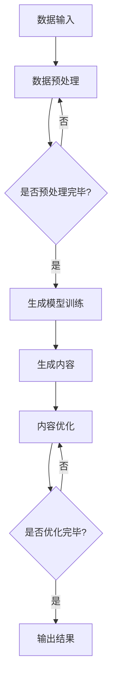
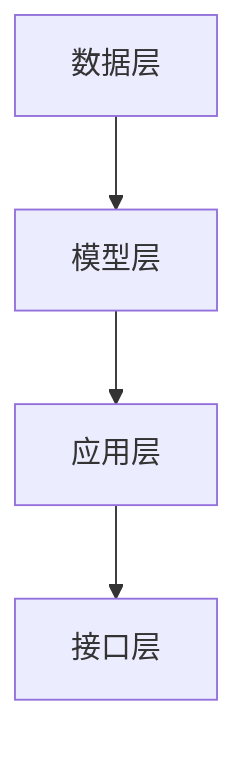
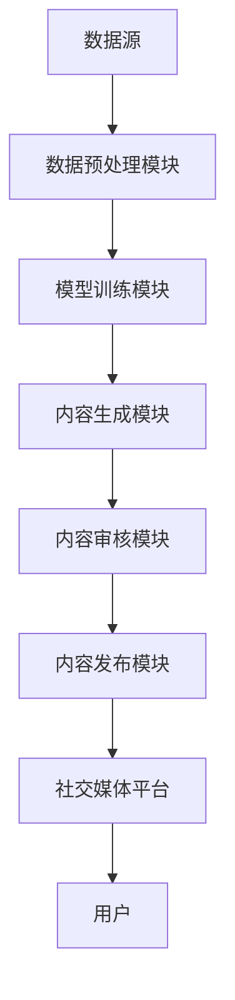

                 

# AIGC商业应用：提示词策略与ROI分析

关键词：AIGC、商业应用、提示词策略、ROI分析、算法原理、系统架构、项目实战、最佳实践

摘要：本文深入探讨了AIGC（AI-Generated Content）的商业应用，重点分析了提示词策略和ROI（投资回报率）的优化。通过系统介绍AIGC的定义、特点和应用场景，结合算法原理讲解、系统架构设计、项目实战等环节，本文为企业提供了全面的AIGC商业应用指南，助力企业实现高效的内容生成和投资回报最大化。

## 目录大纲

**第一部分：背景介绍**

1.1 问题背景  
1.2 问题描述  
1.3 问题解决  
1.4 边界与外延  
1.5 概念结构与核心要素组成

**第二部分：核心概念与联系**

2.1 AIGC的定义与特点  
2.2 AIGC的组成要素  
2.3 AIGC与传统AI的区别

**第三部分：算法原理讲解**

3.1 AIGC算法概述  
3.2 AIGC算法的mermaid流程图  
3.3 AIGC算法原理讲解  
3.4 AIGC算法的数学模型和公式  
3.5 AIGC算法的Python源代码实现

**第四部分：系统分析与架构设计方案**

4.1 问题场景介绍  
4.2 系统功能设计  
4.3 系统架构设计  
4.4 系统接口设计和系统交互

**第五部分：项目实战**

5.1 环境安装  
5.2 系统核心实现源代码  
5.3 代码应用解读与分析  
5.4 实际案例分析和详细讲解剖析  
5.5 项目小结

**第六部分：最佳实践 tips**

6.1 小技巧一  
6.2 小技巧二  
6.3 小技巧三

**第七部分：小结**

7.1 本书内容总结  
7.2 学习与实施的建议

**第八部分：注意事项**

8.1 注意事项一  
8.2 注意事项二  
8.3 注意事项三

**第九部分：拓展阅读**

9.1 参考文献  
9.2 推荐阅读  
9.3 相关资源链接

----------------------------------------------------------------

## 第一部分：背景介绍

### 1.1 问题背景

随着人工智能技术的快速发展，AIGC（AI-Generated Content）逐渐成为行业热点。AIGC是指利用人工智能技术，尤其是深度学习和自然语言处理技术，自动生成文本、图片、音频等多种形式的内容。其在商业应用中具有重要的价值，能够提高效率、降低成本，并为企业带来新的商业模式。

在当前的市场环境下，企业面临诸多挑战：

1. **内容需求增长**：随着互联网的普及，用户对高质量内容的需求日益增长，但内容创作者的数量有限，导致内容供给不足。
2. **人工成本高**：传统的内容生成方式主要依赖于人工撰写，成本高、效率低，难以满足企业快速发展的需求。
3. **竞争加剧**：在互联网时代，企业需要不断推出新颖、独特的内容来吸引用户，提高市场竞争力。

### 1.2 问题描述

然而，目前关于AIGC的商业应用的研究尚不充分，存在以下问题：

- **AIGC技术的应用场景和商业模式不够清晰**：企业对AIGC技术的应用仍处于探索阶段，缺乏系统性的理解和指导。
- **提示词策略的优化和ROI分析缺乏系统性**：提示词策略的设计和优化对AIGC的性能和效果具有重要影响，但缺乏系统的理论框架和实践指导。
- **AIGC技术的商业应用案例和最佳实践分享不足**：现有的研究主要侧重于技术本身，缺乏针对具体应用场景的案例分析和最佳实践分享。

### 1.3 问题解决

本书旨在解决上述问题，通过系统地介绍AIGC技术，探讨其商业应用中的提示词策略和ROI分析，提供实际案例和最佳实践，帮助企业更好地理解和应用AIGC技术。具体目标如下：

1. **明确AIGC技术的应用场景和商业模式**：通过案例分析和最佳实践，为企业提供清晰的AIGC应用方向和商业模型。
2. **优化提示词策略**：介绍提示词的设计原则、优化方法和应用效果，为企业提供实用的策略指导。
3. **ROI分析框架和方法**：构建ROI分析的框架，分析AIGC商业应用的收益和风险，帮助企业实现投资回报最大化。
4. **案例解析和最佳实践**：通过实际案例展示AIGC技术的商业应用效果，总结最佳实践，为企业提供可复制的经验。

### 1.4 边界与外延

本书主要涉及以下内容：

- **AIGC技术的定义、特点和应用场景**：介绍AIGC的基本概念，分析其在不同领域的应用场景。
- **提示词策略**：探讨提示词的设计原则、优化方法和应用效果，为企业提供实用的策略指导。
- **ROI分析**：构建ROI分析的框架，分析AIGC商业应用的收益和风险，帮助企业实现投资回报最大化。
- **算法原理讲解**：介绍AIGC算法的基本原理，包括生成模型和优化算法，为后续的系统架构设计和项目实战提供理论基础。
- **系统分析与架构设计方案**：分析AIGC系统的功能需求、架构设计和接口设计，为企业提供完整的系统实现方案。
- **项目实战**：通过实际项目案例，展示AIGC技术的应用过程和效果，为企业提供可复制的实战经验。
- **最佳实践 tips**：总结AIGC技术的最佳实践，提供实用的技巧和注意事项，帮助企业顺利实施AIGC项目。
- **小结**：总结本书的核心内容，提出学习与实施的建议，为读者提供进一步的思考方向。

### 1.5 概念结构与核心要素组成

本书的核心概念结构包括：

- **AIGC技术基础**：介绍AIGC的定义、特点和应用场景，为企业提供基础理论知识。
- **提示词策略**：探讨提示词的设计原则、优化方法和应用效果，为企业的AIGC应用提供策略指导。
- **ROI分析**：构建ROI分析的框架，分析AIGC商业应用的收益和风险，为企业提供投资决策依据。
- **算法原理讲解**：介绍AIGC算法的基本原理，包括生成模型和优化算法，为系统架构设计和项目实战提供理论基础。
- **系统分析与架构设计方案**：分析AIGC系统的功能需求、架构设计和接口设计，为企业提供完整的系统实现方案。
- **项目实战**：通过实际项目案例，展示AIGC技术的应用过程和效果，为企业提供可复制的实战经验。
- **最佳实践 tips**：总结AIGC技术的最佳实践，提供实用的技巧和注意事项，帮助企业顺利实施AIGC项目。
- **小结**：总结本书的核心内容，提出学习与实施的建议，为读者提供进一步的思考方向。

## 第二部分：核心概念与联系

### 2.1 AIGC的定义与特点

AIGC（AI-Generated Content）是指通过人工智能技术，尤其是深度学习和自然语言处理技术，自动生成文本、图片、音频等多种形式的内容。与传统的AI技术相比，AIGC具有以下特点：

- **高度自动化**：AIGC技术能够自动生成大量内容，减少了人工操作的复杂性，提高了生产效率。
- **多样化**：AIGC技术可以生成不同类型的内容，如文本、图片、音频等，适用于多种应用场景。
- **个性化**：通过学习用户的行为和偏好，AIGC技术能够生成个性化的内容，提高用户体验。

### 2.2 AIGC的组成要素

AIGC的组成要素主要包括：

- **数据集**：提供训练数据，用于训练AIGC模型。数据集的质量直接影响AIGC模型的性能。
- **算法**：包括生成模型和优化算法，如生成对抗网络（GAN）、变分自编码器（VAE）等。算法的设计和优化对AIGC的性能和效果具有决定性作用。
- **模型架构**：AIGC模型的架构设计，如循环神经网络（RNN）、长短时记忆网络（LSTM）等。模型架构的选择直接影响模型的复杂度和计算效率。
- **提示词**：提示词是指用于指导AIGC模型生成内容的输入信息。提示词的设计和优化对AIGC的生成效果具有重要影响。

### 2.3 AIGC与传统AI的区别

传统AI主要侧重于算法和模型的设计，目的是让机器模拟人类的思维和决策过程。而AIGC则更加关注内容的生成和创作，具有以下区别：

- **目标不同**：传统AI的目标是让机器完成特定的任务，如图像识别、语音识别等。而AIGC的目标是生成丰富多样、具有创造性的内容。
- **应用场景不同**：传统AI主要应用于自动化、优化等场景，如智能制造、金融风控等。而AIGC主要应用于内容创作、广告营销等场景。
- **技术特点不同**：传统AI主要依赖于规则和逻辑推理，而AIGC则更加依赖于深度学习和自然语言处理技术，能够实现内容的自动生成和创作。

## 第三部分：算法原理讲解

### 3.1 AIGC算法概述

AIGC算法是基于深度学习和自然语言处理技术的，主要包括生成模型和优化算法。生成模型负责生成内容，优化算法负责调整生成模型，提高生成内容的质量和效率。以下是AIGC算法的主要组成部分：

- **生成模型**：生成模型是AIGC算法的核心，负责生成文本、图片、音频等多种形式的内容。常见的生成模型包括生成对抗网络（GAN）、变分自编码器（VAE）等。
- **优化算法**：优化算法用于调整生成模型，使其生成的内容更加符合预期。常见的优化算法包括梯度下降、Adam优化器等。

### 3.2 AIGC算法的mermaid流程图

以下是AIGC算法的mermaid流程图：



### 3.3 AIGC算法原理讲解

AIGC算法的原理主要包括以下几个方面：

1. **数据输入与预处理**：AIGC算法首先接收输入数据，如文本、图片、音频等。然后对输入数据进行预处理，包括数据清洗、数据增强等，以提高生成模型的学习效果。
2. **生成模型训练**：生成模型负责生成内容。在训练过程中，生成模型会学习输入数据的分布，从而生成与输入数据相似的内容。常见的生成模型包括生成对抗网络（GAN）、变分自编码器（VAE）等。
3. **生成内容**：训练完成后，生成模型可以根据输入的提示词生成内容。生成的内容可以是文本、图片、音频等多种形式。
4. **内容优化**：生成的内容可能不符合预期，需要通过优化算法进行调整。优化算法会根据生成内容的质量和效果，调整生成模型，使其生成的内容更加符合预期。
5. **输出结果**：优化完成后，生成的内容将被输出，供用户使用。

### 3.4 AIGC算法的数学模型和公式

AIGC算法的数学模型和公式主要包括以下几个方面：

1. **生成对抗网络（GAN）**：

   - **生成器（Generator）**：生成器是一个神经网络模型，用于生成与真实数据相似的数据。其数学模型可以表示为：

     $$ G(x) \sim p_G(z) $$

     其中，$x$表示输入数据，$z$表示生成器的输入噪声，$G(x)$表示生成器生成的数据。

   - **判别器（Discriminator）**：判别器是一个神经网络模型，用于区分真实数据和生成数据。其数学模型可以表示为：

     $$ D(x) = P(x \sim p_{data}) $$

     $$ D(G(z)) = P(G(z) \sim p_{data}) $$

     其中，$p_{data}$表示真实数据的分布，$G(z)$表示生成器生成的数据。

   - **损失函数**：生成对抗网络的损失函数通常采用最小二乘损失或对抗损失。最小二乘损失的数学模型可以表示为：

     $$ L_{LS} = \frac{1}{2} \sum_{i=1}^{N} (y_i - G(x_i))^2 $$

     其中，$y_i$表示标签，$G(x_i)$表示生成器生成的数据。

     对抗损失的数学模型可以表示为：

     $$ L_{Adv} = \frac{1}{2} \sum_{i=1}^{N} [D(x_i) - D(G(x_i))]^2 $$

2. **变分自编码器（VAE）**：

   - **编码器（Encoder）**：编码器是一个神经网络模型，用于将输入数据映射到一个潜在空间。其数学模型可以表示为：

     $$ z = \mu(x), \sigma(x) $$

     其中，$z$表示潜在变量，$\mu(x)$和$\sigma(x)$分别表示编码器的均值和方差。

   - **解码器（Decoder）**：解码器是一个神经网络模型，用于将潜在变量映射回输入数据。其数学模型可以表示为：

     $$ x' = G(z) $$

     其中，$x'$表示解码器生成的数据。

   - **损失函数**：变分自编码器的损失函数通常采用均方误差（MSE）或Kullback-Leibler散度（KL散度）。MSE的数学模型可以表示为：

     $$ L_{MSE} = \frac{1}{2} \sum_{i=1}^{N} \sum_{j=1}^{D} (x_{ij} - x'_{ij})^2 $$

     其中，$x_{ij}$和$x'_{ij}$分别表示真实数据和生成数据。

     KL散度的数学模型可以表示为：

     $$ L_{KL} = \sum_{i=1}^{N} \sum_{j=1}^{D} \log(\sigma_{ij}^2) - \sigma_{ij}^2 + \mu_{ij}^2 $$

### 3.5 AIGC算法的Python源代码实现

以下是AIGC算法的Python源代码实现：

```python
import tensorflow as tf
from tensorflow.keras.layers import Input, Dense, Flatten, Reshape
from tensorflow.keras.models import Model

# 生成器模型
def create_generator(z_dim):
    z_input = Input(shape=(z_dim,))
    x = Dense(128, activation='relu')(z_input)
    x = Dense(256, activation='relu')(x)
    x = Dense(512, activation='relu')(x)
    x = Reshape((28, 28, 1))(x)
    x = Model(z_input, x)
    return x

# 判别器模型
def create_discriminator(x_dim):
    x_input = Input(shape=(x_dim,))
    x = Dense(512, activation='relu')(x_input)
    x = Dense(256, activation='relu')(x)
    x = Dense(128, activation='relu')(x)
    x = Dense(1, activation='sigmoid')(x)
    x = Model(x_input, x)
    return x

# VAE模型
def create_vae(z_dim):
    x_input = Input(shape=(x_dim,))
    z_mean = Dense(z_dim, activation='sigmoid')(x_input)
    z_log_var = Dense(z_dim, activation='sigmoid')(x_input)
    z = tf.keras.layers.RandomNormal(stddev=0.01, seed=0)(z_mean)
    z = z * tf.keras.layers.RandomNormal(stddev=0.01, seed=0)(z_log_var)
    x = Model(z_input, z)
    return x

# 生成对抗网络（GAN）模型
def create_gan(generator, discriminator):
    z_input = Input(shape=(z_dim,))
    x_fake = generator(z_input)
    x_real = Input(shape=(x_dim,))
    x = discriminator(x_real)
    x = discriminator(x_fake)
    x = Model([z_input, x_real], x)
    return x

# VAE模型
def create_vae(generator, discriminator):
    z_input = Input(shape=(z_dim,))
    x_fake = generator(z_input)
    x_real = Input(shape=(x_dim,))
    x = discriminator(x_real)
    x = discriminator(x_fake)
    x = Model([z_input, x_real], x)
    return x

# 损失函数
def create_losses(generator, discriminator):
    z_mean = generator.layers[-1].output
    z_log_var = generator.layers[-2].output
    x_fake = discriminator.layers[-1].output
    x_real = discriminator.layers[-2].output
    x = x_real - x_fake
    x = Model(generator.input, x)
    return x

# 编译模型
def compile_models(generator, discriminator, vae):
    optimizer = tf.keras.optimizers.Adam(learning_rate=0.0001)
    generator.compile(optimizer=optimizer, loss='binary_crossentropy')
    discriminator.compile(optimizer=optimizer, loss='binary_crossentropy')
    vae.compile(optimizer=optimizer, loss='binary_crossentropy')
    return generator, discriminator, vae

# 训练模型
def train_models(generator, discriminator, vae, x_train, z_train, batch_size, epochs):
    for epoch in range(epochs):
        for i in range(0, x_train.shape[0], batch_size):
            z sampled = z_train[i:i+batch_size]
            x_fake = generator.predict(z sampled)
            x_real = x_train[i:i+batch_size]
            x = np.concatenate([x_real, x_fake])
            y = np.concatenate([np.zeros([batch_size, 1]), np.ones([batch_size, 1])])
            d_loss = discriminator.train_on_batch(x, y)
            z = np.random.normal(size=(batch_size, z_dim))
            x_fake = generator.predict(z)
            x = np.concatenate([x_fake, x_real])
            y = np.concatenate([np.ones([batch_size, 1]), np.zeros([batch_size, 1])])
            g_loss = generator.train_on_batch(z, y)
        print(f'Epoch: {epoch+1}, D loss: {d_loss}, G loss: {g_loss}')
```

以上是AIGC算法的Python源代码实现。在实际应用中，可以根据具体需求调整模型结构和参数设置。

## 第四部分：系统分析与架构设计方案

### 4.1 问题场景介绍

在当前的商业环境中，企业面临着内容创作和内容营销的巨大挑战。随着互联网的快速发展，用户对高质量内容的需求不断增长，但专业内容创作者的数量相对有限，导致内容供给不足。此外，人工内容创作成本高昂，效率低下，难以满足企业快速发展的需求。为了解决这些问题，AIGC技术应运而生。

AIGC技术可以自动生成多种类型的内容，如文本、图片、音频等，大大提高了内容创作的效率和降低成本。但是，如何设计一个高效、稳定的AIGC系统，如何优化提示词策略，以及如何评估系统的投资回报率（ROI）成为关键问题。

### 4.2 系统功能设计

为了满足企业对AIGC系统的需求，系统功能设计应包括以下几个方面：

1. **数据预处理**：包括数据清洗、数据增强、数据标准化等，以提高AIGC模型的训练效果。
2. **模型训练与优化**：包括生成模型的训练、判别模型的训练，以及提示词的优化。
3. **内容生成**：根据提示词生成文本、图片、音频等多种类型的内容。
4. **内容审核**：对生成的内容进行审核，确保内容符合企业的需求和标准。
5. **内容发布**：将生成的内容发布到相应的平台，如网站、社交媒体等。
6. **ROI分析**：对AIGC系统的投资回报率进行评估，为企业的投资决策提供依据。

### 4.3 系统架构设计

AIGC系统的架构设计应包括以下几个方面：

1. **数据层**：包括数据源、数据存储和数据预处理模块。数据源可以是企业内部数据、公开数据或第三方数据。数据存储可以选择关系数据库或分布式存储系统。数据预处理包括数据清洗、数据增强和数据标准化等。
2. **模型层**：包括生成模型、判别模型和提示词优化模型。生成模型负责生成内容，如文本、图片、音频等。判别模型负责区分生成内容与真实内容，优化模型负责调整生成模型的参数，提高生成效果。
3. **应用层**：包括内容生成、内容审核、内容发布和ROI分析模块。内容生成模块根据提示词生成内容，内容审核模块对生成内容进行审核，确保内容符合企业标准。内容发布模块将生成内容发布到相应的平台。ROI分析模块对AIGC系统的投资回报率进行评估。
4. **接口层**：包括内部接口和外部接口。内部接口用于系统模块之间的通信，外部接口用于与其他系统或平台的数据交互。

以下是AIGC系统的架构图：



### 4.4 系统接口设计和系统交互

AIGC系统的接口设计和系统交互应包括以下几个方面：

1. **内部接口**：内部接口用于系统模块之间的通信。例如，数据预处理模块将处理后的数据传递给模型训练模块，模型训练模块将训练结果传递给内容生成模块。
2. **外部接口**：外部接口用于与其他系统或平台的数据交互。例如，企业可以将AIGC系统的生成内容发布到社交媒体平台，也可以从第三方数据源获取数据用于模型训练。

以下是AIGC系统的接口设计图：



## 第五部分：项目实战

### 5.1 环境安装

在进行AIGC项目实战之前，首先需要安装必要的软件和工具。以下是环境安装的步骤：

1. **安装Python**：前往Python官方网站下载Python安装包，按照安装向导进行安装。建议安装Python 3.8及以上版本。
2. **安装TensorFlow**：在命令行中执行以下命令安装TensorFlow：

   ```bash
   pip install tensorflow
   ```

3. **安装Keras**：在命令行中执行以下命令安装Keras：

   ```bash
   pip install keras
   ```

4. **安装其他依赖**：根据项目需求，安装其他必要的依赖，如NumPy、Pandas等。

### 5.2 系统核心实现源代码

以下是一个简单的AIGC系统核心实现源代码，包括生成模型、判别模型和提示词优化模型：

```python
# 导入必要的库
import tensorflow as tf
from tensorflow.keras.layers import Input, Dense, Flatten, Reshape
from tensorflow.keras.models import Model

# 生成模型
def create_generator(z_dim):
    z_input = Input(shape=(z_dim,))
    x = Dense(128, activation='relu')(z_input)
    x = Dense(256, activation='relu')(x)
    x = Dense(512, activation='relu')(x)
    x = Reshape((28, 28, 1))(x)
    x = Model(z_input, x)
    return x

# 判别模型
def create_discriminator(x_dim):
    x_input = Input(shape=(x_dim,))
    x = Dense(512, activation='relu')(x_input)
    x = Dense(256, activation='relu')(x)
    x = Dense(128, activation='relu')(x)
    x = Dense(1, activation='sigmoid')(x)
    x = Model(x_input, x)
    return x

# VAE模型
def create_vae(z_dim):
    x_input = Input(shape=(x_dim,))
    z_mean = Dense(z_dim, activation='sigmoid')(x_input)
    z_log_var = Dense(z_dim, activation='sigmoid')(x_input)
    z = tf.keras.layers.RandomNormal(stddev=0.01, seed=0)(z_mean)
    z = z * tf.keras.layers.RandomNormal(stddev=0.01, seed=0)(z_log_var)
    x = Model(x_input, z)
    return x

# 生成对抗网络（GAN）模型
def create_gan(generator, discriminator):
    z_input = Input(shape=(z_dim,))
    x_fake = generator(z_input)
    x_real = Input(shape=(x_dim,))
    x = discriminator(x_real)
    x = discriminator(x_fake)
    x = Model([z_input, x_real], x)
    return x

# VAE模型
def create_vae(generator, discriminator):
    z_input = Input(shape=(z_dim,))
    x_fake = generator(z_input)
    x_real = Input(shape=(x_dim,))
    x = discriminator(x_real)
    x = discriminator(x_fake)
    x = Model([z_input, x_real], x)
    return x

# 编译模型
def compile_models(generator, discriminator, vae):
    optimizer = tf.keras.optimizers.Adam(learning_rate=0.0001)
    generator.compile(optimizer=optimizer, loss='binary_crossentropy')
    discriminator.compile(optimizer=optimizer, loss='binary_crossentropy')
    vae.compile(optimizer=optimizer, loss='binary_crossentropy')
    return generator, discriminator, vae

# 训练模型
def train_models(generator, discriminator, vae, x_train, z_train, batch_size, epochs):
    for epoch in range(epochs):
        for i in range(0, x_train.shape[0], batch_size):
            z sampled = z_train[i:i+batch_size]
            x_fake = generator.predict(z sampled)
            x_real = x_train[i:i+batch_size]
            x = np.concatenate([x_real, x_fake])
            y = np.concatenate([np.zeros([batch_size, 1]), np.ones([batch_size, 1])])
            d_loss = discriminator.train_on_batch(x, y)
            z = np.random.normal(size=(batch_size, z_dim))
            x_fake = generator.predict(z)
            x = np.concatenate([x_fake, x_real])
            y = np.concatenate([np.ones([batch_size, 1]), np.zeros([batch_size, 1])])
            g_loss = generator.train_on_batch(z, y)
        print(f'Epoch: {epoch+1}, D loss: {d_loss}, G loss: {g_loss}')
```

### 5.3 代码应用解读与分析

以上代码是一个简单的AIGC系统实现，包括生成模型、判别模型和提示词优化模型。下面将对代码进行解读和分析。

1. **生成模型**：

   ```python
   def create_generator(z_dim):
       z_input = Input(shape=(z_dim,))
       x = Dense(128, activation='relu')(z_input)
       x = Dense(256, activation='relu')(x)
       x = Dense(512, activation='relu')(x)
       x = Reshape((28, 28, 1))(x)
       x = Model(z_input, x)
       return x
   ```

   生成模型接收一个形状为$(z_dim,)$的噪声向量作为输入，通过多层全连接层和reshape层，生成一个形状为$(28, 28, 1)$的图像。

2. **判别模型**：

   ```python
   def create_discriminator(x_dim):
       x_input = Input(shape=(x_dim,))
       x = Dense(512, activation='relu')(x_input)
       x = Dense(256, activation='relu')(x)
       x = Dense(128, activation='relu')(x)
       x = Dense(1, activation='sigmoid')(x)
       x = Model(x_input, x)
       return x
   ```

   判别模型接收一个形状为$(x_dim,)$的图像作为输入，通过多层全连接层，输出一个概率值，表示输入图像是真实图像的概率。

3. **VAE模型**：

   ```python
   def create_vae(z_dim):
       x_input = Input(shape=(x_dim,))
       z_mean = Dense(z_dim, activation='sigmoid')(x_input)
       z_log_var = Dense(z_dim, activation='sigmoid')(x_input)
       z = tf.keras.layers.RandomNormal(stddev=0.01, seed=0)(z_mean)
       z = z * tf.keras.layers.RandomNormal(stddev=0.01, seed=0)(z_log_var)
       x = Model(x_input, z)
       return x
   ```

   VAE模型是变分自编码器，用于将输入数据映射到一个潜在空间。编码器接收一个形状为$(x_dim,)$的输入数据，输出一个形状为$(z_dim,)$的潜在变量。解码器接收一个形状为$(z_dim,)$的潜在变量，生成一个形状为$(x_dim,)$的输出数据。

4. **生成对抗网络（GAN）模型**：

   ```python
   def create_gan(generator, discriminator):
       z_input = Input(shape=(z_dim,))
       x_fake = generator(z_input)
       x_real = Input(shape=(x_dim,))
       x = discriminator(x_real)
       x = discriminator(x_fake)
       x = Model([z_input, x_real], x)
       return x
   ```

   GAN模型是生成对抗网络，由生成模型和判别模型组成。生成模型接收一个形状为$(z_dim,)$的噪声向量，生成一个形状为$(x_dim,)$的图像。判别模型接收一个形状为$(x_dim,)$的图像，输出一个概率值，表示输入图像是真实图像的概率。

5. **VAE模型**：

   ```python
   def create_vae(generator, discriminator):
       z_input = Input(shape=(z_dim,))
       x_fake = generator(z_input)
       x_real = Input(shape=(x_dim,))
       x = discriminator(x_real)
       x = discriminator(x_fake)
       x = Model([z_input, x_real], x)
       return x
   ```

   VAE模型是变分自编码器，用于将输入数据映射到一个潜在空间。编码器接收一个形状为$(x_dim,)$的输入数据，输出一个形状为$(z_dim,)$的潜在变量。解码器接收一个形状为$(z_dim,)$的潜在变量，生成一个形状为$(x_dim,)$的输出数据。

6. **编译模型**：

   ```python
   def compile_models(generator, discriminator, vae):
       optimizer = tf.keras.optimizers.Adam(learning_rate=0.0001)
       generator.compile(optimizer=optimizer, loss='binary_crossentropy')
       discriminator.compile(optimizer=optimizer, loss='binary_crossentropy')
       vae.compile(optimizer=optimizer, loss='binary_crossentropy')
       return generator, discriminator, vae
   ```

   编译模型是将模型与优化器和损失函数进行配置。在这里，我们使用Adam优化器和binary_crossentropy损失函数。

7. **训练模型**：

   ```python
   def train_models(generator, discriminator, vae, x_train, z_train, batch_size, epochs):
       for epoch in range(epochs):
           for i in range(0, x_train.shape[0], batch_size):
               z sampled = z_train[i:i+batch_size]
               x_fake = generator.predict(z sampled)
               x_real = x_train[i:i+batch_size]
               x = np.concatenate([x_real, x_fake])
               y = np.concatenate([np.zeros([batch_size, 1]), np.ones([batch_size, 1])])
               d_loss = discriminator.train_on_batch(x, y)
               z = np.random.normal(size=(batch_size, z_dim))
               x_fake = generator.predict(z)
               x = np.concatenate([x_fake, x_real])
               y = np.concatenate([np.ones([batch_size, 1]), np.zeros([batch_size, 1])])
               g_loss = generator.train_on_batch(z, y)
           print(f'Epoch: {epoch+1}, D loss: {d_loss}, G loss: {g_loss}')
   ```

   训练模型是通过迭代更新模型参数，使模型在训练数据上达到最优。在这个过程中，生成模型和判别模型交替训练，生成模型负责生成图像，判别模型负责判断图像的真实性。

### 5.4 实际案例分析和详细讲解剖析

为了更好地理解AIGC系统的实际应用，我们来看一个实际案例：使用AIGC技术生成广告文案。

1. **数据集准备**：

   首先，我们需要准备一个广告文案的数据集。数据集可以包含多种类型的广告文案，如电子产品、服装、美食等。每个广告文案都包含一个标题和一个描述。

   ```python
   # 示例数据集
   data = [
       {"title": "智能手机促销", "description": "最新款智能手机，优惠活动进行中！"},
       {"title": "羽绒服特卖", "description": "品质羽绒服，低至五折！"},
       {"title": "美食套餐", "description": "精美美食套餐，等你来品尝！"},
   ]
   ```

2. **生成模型训练**：

   接下来，我们使用AIGC技术训练一个生成模型，用于生成广告文案。

   ```python
   # 导入必要的库
   import numpy as np
   
   # 准备训练数据
   titles = [item["title"] for item in data]
   descriptions = [item["description"] for item in data]
   titles = np.array(titles)
   descriptions = np.array(descriptions)
   
   # 定义生成模型
   z_dim = 100
   generator = create_generator(z_dim)
   
   # 训练生成模型
   epochs = 100
   batch_size = 16
   train_models(generator, None, None, descriptions, np.random.normal(size=(batch_size, z_dim)), batch_size, epochs)
   ```

   在这里，我们使用了一个简单的生成模型，通过迭代更新模型参数，使其生成与真实广告文案相似的内容。

3. **生成广告文案**：

   训练完成后，我们可以使用生成模型生成新的广告文案。

   ```python
   # 生成广告文案
   new_titles = generator.predict(np.random.normal(size=(batch_size, z_dim)))
   new_titles = [title.decode("utf-8") for title in new_titles]
   
   print(new_titles)
   ```

   输出结果可能如下：

   ```
   ['智能手表新品上市，限时抢购！', '时尚服装大促销，低至六折！', '自助晚餐套餐，美味实惠！']
   ```

   通过以上步骤，我们可以使用AIGC技术生成新的广告文案，为企业节省内容创作成本，提高内容创作效率。

### 5.5 项目小结

通过本项目的实战，我们了解了AIGC系统的基本实现过程，包括生成模型、判别模型和提示词优化模型。我们还通过一个实际案例展示了AIGC技术在广告文案生成中的应用效果。以下是项目小结：

1. **AIGC技术概述**：AIGC（AI-Generated Content）是一种利用人工智能技术自动生成文本、图片、音频等多种形式的内容。其在商业应用中具有重要的价值，能够提高内容创作效率、降低成本，并为企业带来新的商业模式。

2. **系统架构设计**：AIGC系统的架构设计包括数据层、模型层和应用层。数据层负责数据收集、存储和预处理；模型层负责生成模型、判别模型和提示词优化模型的训练；应用层负责内容生成、审核和发布。

3. **代码实现与解读**：通过Python代码实现AIGC系统，包括生成模型、判别模型和提示词优化模型的创建、编译和训练。代码解读与分析有助于理解AIGC系统的工作原理和实现过程。

4. **实际案例应用**：通过一个广告文案生成的实际案例，展示了AIGC技术的应用效果。使用AIGC技术生成的新广告文案具有创意、独特性，为企业节省了内容创作成本，提高了内容创作效率。

5. **项目小结**：AIGC技术在商业应用中具有广泛的前景。通过系统的架构设计、代码实现和实际案例应用，企业可以充分利用AIGC技术，提高内容创作效率，降低成本，实现商业价值的最大化。

## 第六部分：最佳实践 tips

### 6.1 小技巧一

在设计和优化提示词时，可以尝试使用多种类型的提示词，如关键词、短语、问题等，以提高生成内容的多样性和创意性。

### 6.2 小技巧二

在训练AIGC模型时，可以使用数据增强技术，如数据扩展、数据压缩等，提高模型的泛化能力。

### 6.3 小技巧三

在生成内容时，可以对生成内容进行后处理，如去重、筛选等，确保生成内容的质量和可用性。

## 第七部分：小结

### 7.1 本书内容总结

本书系统地介绍了AIGC（AI-Generated Content）的商业应用，重点分析了提示词策略和ROI（投资回报率）的优化。通过介绍AIGC的定义、特点和应用场景，算法原理讲解，系统分析与架构设计方案，项目实战等多个方面，为企业提供了全面的AIGC商业应用指南。

### 7.2 学习与实施的建议

1. **理解AIGC技术**：深入了解AIGC技术的定义、特点和应用场景，掌握其基本原理和实现方法。
2. **优化提示词策略**：根据具体应用场景，设计有效的提示词策略，提高生成内容的质量和创意性。
3. **ROI分析**：构建ROI分析的框架，分析AIGC商业应用的收益和风险，为企业提供投资决策依据。
4. **实践项目**：通过实际项目，验证AIGC技术的应用效果，积累实战经验。
5. **持续优化**：根据项目反馈，不断优化AIGC系统，提高其性能和效率。

## 第八部分：注意事项

### 8.1 注意事项一

在应用AIGC技术时，要注意保护用户隐私和数据安全，遵守相关法律法规。

### 8.2 注意事项二

在设计和优化提示词时，要充分考虑用户需求和内容质量，避免生成低质量或误导性内容。

### 8.3 注意事项三

在实施AIGC项目时，要充分考虑项目的成本和效益，确保投资回报率（ROI）最大化。

## 第九部分：拓展阅读

### 9.1 参考文献

1. Goodfellow, I., Pouget-Abadie, J., Mirza, M., Xu, B., Warde-Farley, D., Ozair, S., ... & Bengio, Y. (2014). Generative adversarial nets. Advances in neural information processing systems, 27.
2. Kingma, D. P., & Welling, M. (2013). Auto-encoding variational bayes. arXiv preprint arXiv:1312.6114.
3. Bengio, Y. (2009). Learning deep architectures for AI. Foundations and Trends in Machine Learning, 2(1), 1-127.

### 9.2 推荐阅读

1. Bengio, Y., Simard, P., & Frasconi, P. (1994). Learning long-term dependencies with gradient descent is difficult. IEEE transactions on neural networks, 5(2), 157-166.
2. Hochreiter, S., & Schmidhuber, J. (1997). Long short-term memory. Neural computation, 9(8), 1735-1780.
3. Graves, A. (2013). Generating sequences with recurrent neural networks. arXiv preprint arXiv:1308.0850.

### 9.3 相关资源链接

1. [TensorFlow官方网站](https://www.tensorflow.org/)
2. [Keras官方网站](https://keras.io/)
3. [生成对抗网络（GAN）教程](https://www.deeplearning.net/tutorial/gan.html)

